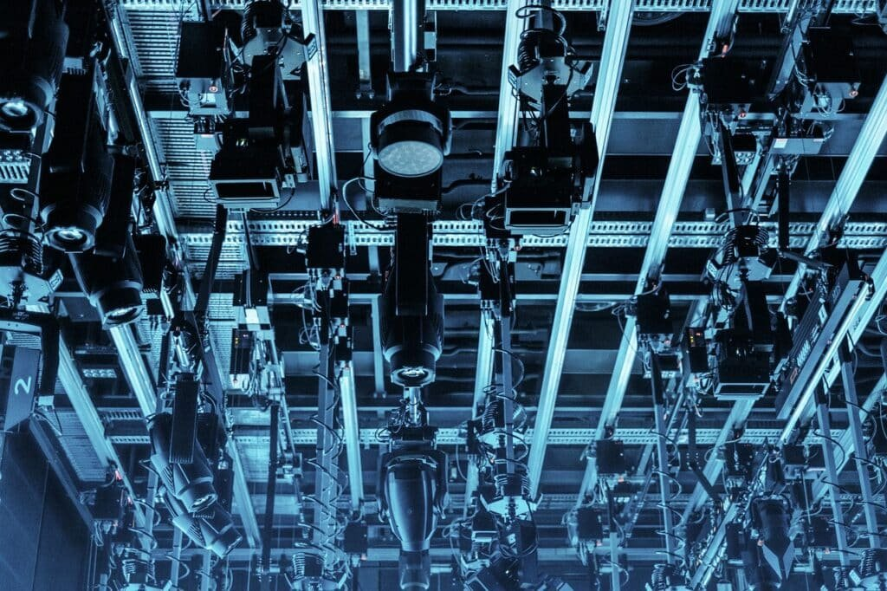

Volcanoes have long captivated the human imagination, with their awe-inspiring beauty and destructive power. But as fascinating as they are, these natural wonders also pose significant risks to nearby communities. That's where advanced techniques for monitoring volcanoes come into play. By employing cutting-edge technology and innovative approaches, scientists can closely monitor these unpredictable giants and gather crucial data that can help predict future eruptions. In this article, we will explore some of the modern tools and methods used in volcano monitoring, providing an insight into the fascinating world of volcanic research and the potential benefits it brings to the communities living in their shadows.

This image is property of pixabay.com.

## Satellite Remote Sensing

Satellite remote sensing is a powerful tool used in volcano monitoring. It encompasses several techniques, including hyperspectral imaging, thermal infrared imaging, synthetic-aperture radar (SAR), and monitoring atmospheric gas concentrations.

Hyperspectral imaging involves capturing images of the Earth's surface in hundreds of narrow and contiguous spectral bands. This allows scientists to analyze the reflected light and identify specific minerals, gases, or other substances present in volcanic plumes or on the ground. By studying the spectral signatures, experts can monitor volcanic activity, detect changes in gas emissions, and map the distribution of volcanic ash or lava flows.

Thermal infrared imaging, on the other hand, focuses on capturing the heat radiation emitted by the volcano. This data provides insights into the temperatures of lava flows and can help estimate the volume and speed of lava movement. By monitoring the thermal activity of a volcano, scientists can track changes in eruption intensity and identify potential hazards.

Synthetic-aperture radar (SAR) is a remote sensing technique that uses radar waves to gather information about the surface of the Earth. SAR can penetrate clouds and smoke, providing valuable data even during challenging weather conditions. This technique allows scientists to monitor changes in the topography of a volcano, detect ground deformation caused by magma movement, and assess the stability of the surrounding area.

Monitoring atmospheric gas concentrations is another essential aspect of satellite remote sensing. By measuring the gases emitted during volcanic eruptions, such as sulfur dioxide (SO2) and carbon dioxide (CO2), scientists can assess the magnitude and direction of volcanic plumes. This information helps in understanding the potential impact on air quality, climate change, and the formation of volcanic clouds that can affect aviation.

Satellite remote sensing techniques provide valuable data for understanding and monitoring volcanic activity on a global scale. By analyzing the data obtained from these methods, scientists can make informed predictions about volcanic eruptions, evaluate the associated risks, and take necessary measures to protect affected populations.

## Ground-Based Surveillance

Ground-based surveillance plays a crucial role in monitoring volcanoes and assessing their activity. It involves various techniques such as geodetic monitoring, seismology and infrasound, gas geochemistry sensors, and hydrological monitoring.

Geodetic monitoring uses precision instruments to measure the changes in the shape and movement of the Earth's surface. This technique can detect ground deformation caused by the movement of magma beneath the volcano. By monitoring ground deformation, scientists can infer the accumulation of magma and the potential for an eruption. Geodetic monitoring also helps in identifying areas at risk from ground cracks, landslides, or other geohazards associated with volcanic activity.

Seismology and infrasound are used to detect and analyze seismic waves and sound waves generated by volcanic activity. Seismographs record ground vibrations caused by volcanic earthquakes, providing valuable information about the movement of magma and the potential for an eruption. Infrasound sensors, on the other hand, detect low-frequency sound waves, which can help in identifying explosive eruptions and monitoring volcanic ash plumes.

Gas geochemistry sensors measure the composition and concentration of gases emitted by a volcano. By monitoring changes in gas emissions, scientists can assess volcanic activity, detect potential changes in eruptive behavior, and gain insights into the volcano's magmatic system. Gas geochemistry sensors are particularly useful in monitoring the presence of hazardous gases like sulfur dioxide, which can have significant impacts on air quality and human health.

Hydrological monitoring involves the assessment of water resources, including groundwater and surface water, in the vicinity of a volcano. Changes in water chemistry, temperature, or discharge can provide indications of volcanic activity. Monitoring hydrological parameters helps identify potential hazards, such as lahars (volcanic mudflows) or phreatic (steam-driven) eruptions, which occur when magma interacts with water. By understanding the hydrological processes associated with volcanic activity, scientists can better assess the risks to nearby communities and develop appropriate mitigation measures.

Ground-based surveillance techniques work in tandem with satellite remote sensing to provide comprehensive monitoring of volcanic activity. By combining data from these methods, scientists can gain a more accurate understanding of volcanic behavior, improve eruption forecasting, and enhance the ability to mitigate the risks associated with volcanic hazards.

This image is property of pixabay.com.

## Physical Volcanology

Physical volcanology involves the study of volcanic processes and their resulting deposits. It encompasses various techniques, such as the analysis of volcanic deposits, visual observations, and mapping.

Understanding the characteristics and behavior of volcanic deposits is essential for interpreting past eruptions and predicting future ones. Physical volcanologists analyze the composition, texture, and structure of volcanic rocks and deposits to gain insights into the eruption style, magma properties, and volcanic hazards. By studying volcanic deposits, scientists can reconstruct the eruptive history of a volcano, identify different eruption types, and assess the likelihood of similar eruptions occurring in the future.

Visual observations and mapping are fundamental tools in physical volcanology. Scientists directly observe volcanic activity, such as the emission of gases, explosions, and the movement of lava flows. They document these observations through photography, video recordings, and sketches. By mapping the extent and distribution of volcanic deposits, scientists can create detailed geological maps that help to characterize the volcanic hazards in the area. These maps aid in land-use planning, hazard assessments, and the development of evacuation plans.

Physical volcanology provides valuable insights into the processes that drive volcanic eruptions and shape the landscape. By studying volcanic deposits and conducting visual observations, scientists can enhance their understanding of volcanic behavior, improve eruption forecasting, and contribute to effective hazard assessment and mitigation strategies.

## Computational Modeling

Computational modeling plays a crucial role in understanding volcanic processes and predicting their behavior. It encompasses various techniques, including lava flow modeling, numerical eruption models, and volcanic ash transport and dispersion models.

Lava flow modeling involves simulating the movement of lava during volcanic eruptions. By considering factors like the topography, viscosity of the magma, and eruption parameters, scientists can predict the potential paths and speeds of volcanic flows. These models help in identifying areas at risk and developing effective evacuation plans. Lava flow models also aid in assessing the impact on critical infrastructure, such as roads, buildings, and power lines, and inform decisions regarding land-use planning in volcanic regions.

Numerical eruption models simulate the behavior of volcanic eruptions by solving complex mathematical equations that describe magma ascent, fragmentation, and ash dispersal. These models take into account various parameters, such as magma properties, vent geometry, and atmospheric conditions. Numerical eruption models can provide insights into eruption dynamics, the potential for explosive eruptions, and the dispersion of volcanic ash in the atmosphere. This information is invaluable for aviation safety, as volcanic ash can damage aircraft engines and pose a significant hazard to air traffic.

Volcanic ash transport and dispersion models help predict the movement and spread of volcanic ash clouds following an eruption. These models take into account atmospheric conditions, such as wind speed and direction, to simulate the behavior of ash particles. By predicting the spread of volcanic ash, scientists can issue timely warnings, assess the potential impacts on human health and infrastructure, and support decision-making for air traffic management.

Computational modeling complements field observations and laboratory experiments by providing a virtual platform to simulate and analyze volcanic processes. These models enable scientists to explore different scenarios, understand volcano dynamics, and make informed predictions about future eruptions. The insights gained from computational modeling contribute to improved volcano monitoring, hazard assessment, and risk mitigation efforts.

This image is property of pixabay.com.

## Laboratory Volcanology

Laboratory volcanology involves studying volcanic processes and phenomena under controlled laboratory conditions. It encompasses techniques such as the analysis of volcanic rocks and controlled eruption experiments.

Analyzing volcanic rocks in the laboratory provides valuable insights into their composition and properties. By subjecting volcanic samples to various analytical techniques, scientists can determine the mineralogy, chemistry, and texture of the rocks. This information helps to understand the volcanic processes, including magma evolution, eruption dynamics, and the potential for explosive eruptions. Laboratory analyses also aid in identifying the potential hazards associated with specific volcanic rocks, such as the release of toxic gases during eruptions.

Controlled eruption experiments involve recreating volcanic processes in the laboratory. Scientists design experiments to mimic different eruption scenarios, such as explosive eruptions, effusive eruptions, or the interaction between magma and water. These experiments allow researchers to observe and measure the behavior of volcanic materials under controlled conditions. By studying the processes and outcomes of controlled eruption experiments, scientists can gain insights into the physics of volcanic eruptions, test theoretical models, and improve our understanding of volcanic behavior.

Laboratory volcanology is a complementary field to observational and computational studies. By conducting controlled experiments and analyzing volcanic samples in a controlled environment, scientists can simulate volcanic phenomena and gain a deeper understanding of the underlying processes. The findings from laboratory volcanology enhance our knowledge of volcanic behavior and contribute to improved eruption forecasting, hazard assessment, and risk mitigation strategies.

## Robotics and Automated Systems

Robotics and automated systems have revolutionized [volcano monitoring](https://magmamatters.com/geothermal-energy-and-its-volcanic-origins/ "Geothermal Energy and Its Volcanic Origins") by enabling data collection and analysis in hazardous environments. These technologies include unmanned aerial vehicles (UAVs), automated seismographs, gas detectors, and underwater autonomous vehicles.

Unmanned aerial vehicles, commonly known as drones, play a crucial role in volcano monitoring. Equipped with various sensors and cameras, UAVs can collect high-resolution imagery and data from inaccessible areas, such as the crater or the summit of a volcano. This information helps in assessing changes in topography, mapping volcanic deposits, and monitoring gas emissions. UAVs also provide a safer alternative to human observers, as they can operate in hazardous conditions or during explosive eruptions.

Automated seismographs and gas detectors are instrumental in monitoring volcanic activity continuously. These instruments can detect and record seismic activity and changes in gas emissions, providing real-time data on volcanic processes. Automated systems allow for the rapid detection of volcanic earthquakes, identifying patterns that may indicate an imminent eruption. Gas detectors help in monitoring changes in gas concentrations, allowing scientists to assess volcanic activity and issue timely warnings to affected communities.

Underwater autonomous vehicles (UAVs) have revolutionized the monitoring of submarine volcanoes. Equipped with cameras, sonar, and other sensors, these vehicles can explore the underwater environment and collect valuable data about volcanic activity. Underwater autonomous vehicles can detect changes in temperature, gas emissions, and the morphology of submarine volcanoes. By studying these data, scientists gain insights into the dynamics of underwater eruptions and the formation of new volcanic structures.

Robotics and automated systems eliminate the need for humans to enter hazardous environments, significantly enhancing both safety and data collection capabilities. By employing these technologies, scientists can gather accurate and real-time information about volcanic activity, make more precise predictions, and implement effective hazard assessment and risk mitigation strategies.

## Direct Sampling and in-volcano Monitoring

Direct sampling and in-volcano monitoring techniques involve collecting samples and deploying instruments directly in volcano calderas. These methods provide valuable insights into the composition of volcanic gases, internal volcano dynamics, and the potential for eruptions.

Collecting gas samples directly from volcanic plumes or vents allows scientists to analyze the composition and concentration of gases emitted during an eruption. By studying the composition of volcanic gases, scientists can assess the potential risks associated with volcanic activity. For example, high levels of sulfur dioxide (SO2) emissions may indicate the presence of fresh magma near the surface, increasing the likelihood of an eruption. Collecting gas samples also enables the isotopic analysis of gases, providing further insights into the origin and behavior of volcanic fluids.

Deploying instruments like seismographs and tiltmeters directly in volcano calderas allows for real-time monitoring of volcanic activity. Seismographs record ground vibrations caused by volcanic earthquakes, providing critical information about magma movement and volcanic unrest. Tiltmeters, on the other hand, measure subtle changes in the slope or deformation of the ground, indicating the accumulation of magma beneath the volcano. Combined with other monitoring techniques, such as gas measurements and visual observations, direct sampling and in-volcano monitoring give scientists a comprehensive understanding of the volcano's behavior.

Direct sampling and in-volcano monitoring techniques are challenging due to the hazardous conditions and potential risks to operators. However, they provide invaluable data that cannot be obtained through remote sensing or automated systems alone. By collecting samples and deploying instruments in volcano calderas, scientists can enhance their understanding of volcanic processes and improve eruption forecasting, leading to more effective hazard assessment and mitigation strategies.

## Interdisciplinary Studies

Interdisciplinary studies involve the integration of geological, geophysical, and geochemical data to gain a [comprehensive understanding of volcanic](https://magmamatters.com/understanding-volcanic-formation-a-comprehensive-guide/ "Understanding Volcanic Formation: A Comprehensive Guide") processes. Collaboration between earth scientists and engineers, as well as computer scientists, is essential in advancing volcano monitoring techniques.

Integrating geological, geophysical, and geochemical data allows scientists to analyze the complex interactions between magma, rocks, fluids, and the surrounding environment. By combining these different datasets, researchers can identify patterns, correlations, and causal relationships that may not be apparent when studying individual datasets. The integration of data also facilitates a multidimensional approach to studying volcanic systems, enabling scientists to build more accurate models and make informed predictions about volcanic behavior.

Collaboration between earth scientists, such as geologists and geophysicists, and engineers is crucial in developing and deploying monitoring technologies. Engineers play a significant role in designing and implementing monitoring networks, developing robust instruments, and ensuring data reliability. By collaborating and sharing expertise, scientists and engineers can utilize state-of-the-art [technologies to monitor volcanoes](https://magmamatters.com/the-art-and-science-of-volcano-monitoring/ "The Art and Science of Volcano Monitoring") effectively and mitigate risks to surrounding communities.

Collaboration between earth scientists and computer scientists also holds immense potential in advancing volcano monitoring techniques. Computer scientists can contribute their expertise in data analysis, machine learning, and artificial intelligence to develop more sophisticated models, automated data processing techniques, and real-time monitoring systems. By leveraging computational power, earth scientists can analyze vast volumes of data, extract meaningful insights, and improve their ability to forecast volcanic eruptions accurately.

Interdisciplinary studies foster a holistic approach to volcano monitoring, enabling scientists to take advantage of diverse datasets, technological advancements, and analytical methods. By integrating geological, geophysical, and geochemical data and collaborating with engineers and computer scientists, researchers can enhance eruption forecasting, develop more accurate hazard assessments, and implement effective risk mitigation strategies.

## Hazards Assessment and Mitigation

Hazards assessment and mitigation involve assessing the risks associated with volcanic activity and implementing measures to minimize their impact on surrounding communities. This process includes creating hazard maps, designing and implementing evacuation plans, and establishing temporary exclusion zones.

Creating hazard maps is a crucial step in assessing the potential risks posed by a volcano. Hazard maps depict the areas likely to be affected by various volcanic hazards, such as lava flows, pyroclastic density currents, ashfall, lahars, and volcanic gases. These maps consider factors like topography, historical eruption data, and models of potential future eruptions. By providing visual representations of potential hazard zones, hazard maps help in land-use planning, determining evacuation routes, and communicating risks to local communities.

Designing and implementing evacuation plans is essential to ensure the safety of populations living near active volcanoes. These plans establish protocols and procedures for safely evacuating individuals in the event of an eruption. Effective evacuation plans consider factors like population density, transportation infrastructure, volcanic hazards, and the availability of emergency shelters. By conducting drills and raising public awareness, communities can be better prepared to respond to volcanic emergencies and safely evacuate when necessary.

Establishing temporary exclusion zones is another important aspect of managing volcanic hazards. These zones restrict access to areas deemed at high risk during volcanic eruptions. Temporary exclusion zones aim to protect individuals from hazards like pyroclastic flows, volcanic gases, and flying ballistic projectiles. By establishing clear boundaries and strictly enforcing access restrictions, authorities can ensure the safety of both residents and emergency responders.

Hazards assessment and mitigation strategies are essential for minimizing the impacts of volcanic eruptions on communities. By creating hazard maps, designing evacuation plans, and establishing temporary exclusion zones, authorities can reduce vulnerability, enhance preparedness, and save lives during volcanic emergencies.

## Communicating Volcanic Risk

Effective communication of volcanic risk is crucial for informing and educating the public about potential hazards. This process involves the dissemination of volcano hazard information, collaborative learning with social and behavioral scientists, and building relationships with local communities.

Dissemination of volcano hazard information is vital for ensuring that affected populations are aware of potential risks and can take appropriate actions. Authorities and scientists must communicate information about eruption forecasts, hazard maps, evacuation plans, and emergency procedures through various channels. These channels include websites, social media, press releases, public meetings, and educational programs. By providing timely and accurate information, authorities can help individuals make informed decisions and respond effectively during volcanic emergencies.

Collaborative learning with social and behavioral scientists helps in understanding how individuals perceive and respond to volcanic hazards. Scientists work with social scientists to study human behavior, risk perception, and decision-making during volcanic crises. These studies contribute to the development of effective communication strategies that consider cultural, social, and psychological factors. By understanding people's attitudes, beliefs, and knowledge about volcanic risks, authorities can tailor their communication efforts to meet the specific needs of different communities.

Building relationships with local communities is essential for fostering trust, collaboration, and engagement in volcanic risk management. Engaging with local communities allows authorities to understand their needs, concerns, and capacities. This collaboration ensures that hazard maps, evacuation plans, and other risk reduction measures are relevant and culturally appropriate. By involving communities in the decision-making process and providing platforms for dialogue, authorities can build resilience and empower individuals to take an active role in their own safety.

Effective communication of volcanic risk requires collaboration among scientists, authorities, social scientists, and local communities. By disseminating volcano hazard information, engaging in collaborative learning, and building relationships with local communities, authorities can ensure that individuals are well-prepared and capable of responding to volcanic emergencies.

