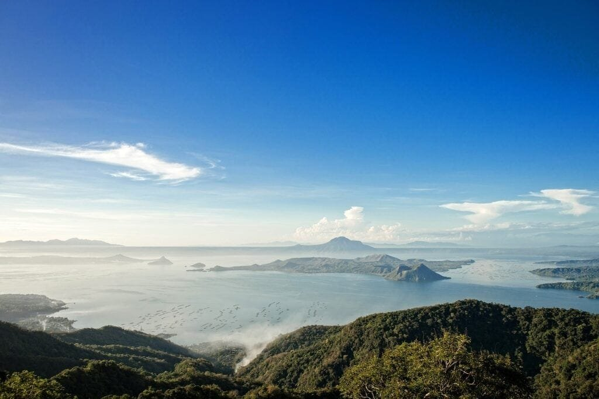

Are you fascinated by volcanoes and the power they hold? Do you ever wonder if there are ways to predict their activity and prevent potential disasters? Look no further, because in this article we will explore the world of volcano activity prediction and introduce you to seven advanced techniques that scientists are using to gain valuable insights into these powerful natural phenomena. From studying volcanic types and distribution to understanding eruption causes and hazards, we will delve into the fascinating world of volcanology and the methods that are pushing the boundaries of our understanding. So grab your geological boots and get ready to explore the exciting field of volcano activity prediction!

This image is property of pixabay.com.

## Understanding Volcano Types and Their Behavior

Volcanoes are fascinating natural formations that have captivated human curiosity for centuries. They come in various types, each with its own unique characteristics and eruption patterns. By understanding these types and their behavior, scientists can better predict volcanic activity and minimize the risks associated with eruptions.

### Shield Volcanoes and their eruption patterns

Shield volcanoes, like those found in Hawaii, are characterized by their gentle slopes and broad, shield-shaped profiles. These volcanoes form when low-viscosity lava flows gradually over a large area, causing the volcano to expand outward. The lava from shield volcanoes is typically fluid and can travel long distances before solidifying.

One of the defining features of shield volcanoes is their relatively calm eruption patterns. Due to the low viscosity of the lava, eruptions tend to be non-explosive and the lava flows steadily downstream. This allows scientists to monitor and predict the behavior of shield volcanoes more accurately.

### Stratovolcanoes and their activity

Stratovolcanoes, also known as composite volcanoes, are tall and steep-sided volcanoes that have a conical shape. They are typically found in subduction zones, where one tectonic plate is forced beneath another. Examples of stratovolcanoes include Mount Vesuvius in Italy and Mount Rainier in the United States.

Unlike shield volcanoes, stratovolcanoes have a more explosive nature. They are often associated with violent eruptions that release large quantities of ash, gas, and pyroclastic materials. These eruptions can travel great distances and pose a significant threat to nearby communities. Understanding the activity patterns of stratovolcanoes is crucial for effective monitoring and risk assessment.

### Hotspot Volcanoes and their activity patterns

Hotspot volcanoes, such as those in the Hawaiian Islands, are formed by mantle plumes that bring up hot material from deep within the Earth's mantle. These volcanoes are not necessarily located near plate boundaries but occur in specific areas where the mantle plumes intersect with the Earth's crust.

The activity patterns of hotspot volcanoes can vary. Some may exhibit continuous, low-level eruptions, while others may experience periodic eruptions with long periods of dormancy. The behavior of hotspot volcanoes is influenced by factors such as the viscosity of the magma, gas content, and the strength of the mantle plume. Understanding these patterns can help scientists anticipate future eruptions and better prepare for their potential impact.

<iframe width="560" height="315" src="https://www.youtube.com/embed/xVRlL2gd4Fc" frameborder="0" allow="accelerometer; autoplay; encrypted-media; gyroscope; picture-in-picture" allowfullscreen></iframe>

  

## Geochemical Monitoring

Geochemical monitoring plays a vital role in understanding the behavior of volcanoes. By analyzing the chemical composition of volcanic gases and various samples, scientists can gain valuable insights into the volcanic processes that occur beneath the Earth's surface.

### Understanding chemical changes in volcanic gases

Volcanic gases consist of various compounds, including water vapor, carbon dioxide, sulfur dioxide, and hydrogen sulfide. By monitoring changes in the composition and concentration of these gases, scientists can identify shifts in volcanic activity. For example, an increase in sulfur dioxide emissions may indicate an impending eruption.

Continuous [monitoring of volcanic gases](https://magmamatters.com/the-art-and-science-of-volcano-monitoring/ "The Art and Science of Volcano Monitoring") provides valuable data for predicting volcanic activity and helping authorities make informed decisions regarding evacuations and other safety measures. Monitoring stations equipped with gas analyzers are set up near active volcanoes to detect changes in gas emissions over time.

### Use of muon tomography to observe magma chambers

Muon tomography is an advanced technique that allows scientists to observe the interior of a volcano without physically accessing it. This method involves measuring the trajectory of cosmic muons, which are high-energy particles naturally generated by cosmic rays entering the Earth's atmosphere.

As muons pass through a volcano, their trajectory is influenced by the density of the materials they encounter. By placing detectors strategically around the volcano, scientists can reconstruct a three-dimensional image of its interior, including the location and size of magma chambers.

Muon tomography provides valuable information about the structure and dynamics of a volcano's magma system. By monitoring changes in these structures over time, scientists can gain insights into the likelihood of future eruptions.

### Collection and analysis of ash samples

During volcanic eruptions, significant amounts of ash and volcanic debris are released into the atmosphere. Collecting and analyzing these samples can provide valuable information about the eruption dynamics, the composition of the magma, and the potential hazards associated with the eruption.

Ash samples are collected using specialized equipment such as ash samplers and filters. These samples are then analyzed in laboratories using various techniques, including electron microscopy, X-ray diffraction, and chemical analysis. By studying ash samples, scientists can identify the type of volcano responsible for the eruption, assess the magnitude and duration of the eruption, and understand the potential health risks associated with volcanic ash exposure.

Geochemical monitoring, including the analysis of volcanic gases and ash samples, is crucial for gaining a [comprehensive understanding of volcanic](https://magmamatters.com/understanding-volcanic-formation-a-comprehensive-guide/ "Understanding Volcanic Formation: A Comprehensive Guide") activity. By combining these techniques with other monitoring methods, scientists can improve volcano prediction and provide early warning to communities at risk.

This image is property of pixabay.com.

## Geophysical Monitoring

Geophysical monitoring involves studying the physical properties and phenomena associated with volcanic activity. By monitoring seismic activities, ground deformation, and changes in gravitational and magnetic fields, scientists can gain insights into the processes occurring beneath the Earth's surface.

### Understanding seismic activities in and around volcanoes

Seismic activity is one of the most prominent indicators of volcanic activity. Volcanic earthquakes are caused by the movement of magma and the fracturing of rocks as pressure builds up beneath the surface. These earthquakes can vary in magnitude and frequency and provide valuable information about the behavior of volcanoes.

Seismic monitoring involves the deployment of seismometers around a volcano to detect and measure earthquakes. By analyzing the frequency, magnitude, and location of seismic events, scientists can infer the movement and behavior of magma within a volcano. This information is crucial for predicting volcanic eruptions and assessing their potential hazards.

### Use of ground deformation studies to predict eruptions

As magma accumulates beneath a volcano, the pressure causes the surrounding ground to deform. This deformation can be measured using instruments such as tiltmeters and GPS receivers, which detect changes in the shape or position of the land.

Ground deformation studies help scientists understand the subsurface processes associated with volcanic activity. By continuously monitoring these changes, scientists can identify trends and anomalies that may indicate an impending eruption. For example, an increase in ground inflation may suggest that magma is rising to the surface.

### Monitoring changes in gravitational and magnetic fields related to volcanic activities

Volcanic activity can also affect the gravitational and magnetic fields in the vicinity of a volcano. These changes are caused by variations in the density and magnetization of the rocks due to the presence of magma.

Gravimeters and magnetometers are used to monitor changes in these fields around volcanoes. By measuring fluctuations in gravity and magnetic intensity, scientists can gain insights into the movement and distribution of magma beneath the Earth's surface. These measurements, combined with other monitoring techniques, contribute to a more comprehensive understanding of volcanic behavior.

Geophysical monitoring plays a crucial role in volcano prediction and hazard assessment. By continuously monitoring seismic activity, ground deformation, and changes in gravity and magnetism, scientists can improve their ability to forecast volcanic eruptions and mitigate the risks associated with them.

