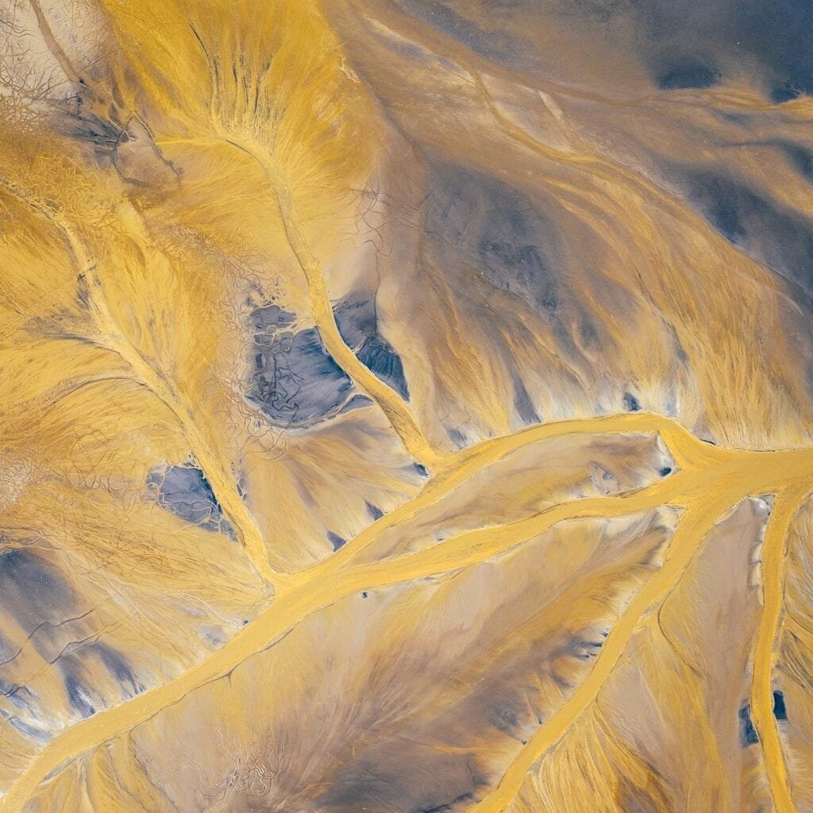

In this article, we will be delving into the long-term impact of volcanic eruptions. Volcanoes, as we know, are formed when molten rock, gases, and debris escape to the earth's surface, resulting in eruptions of lava and ash. These volcanic activities occur at various sites, such as plate boundaries, hotspots, and rift zones. Some volcanoes, like those found along the "Ring of Fire" in the Pacific Ocean, are prone to frequent eruptions due to the meeting of tectonic plates. On the other hand, shield volcanoes in Hawaii form gradually and erupt less explosively. As we analyze the historical consequences of volcanic eruptions, we'll uncover the diverse eruption patterns influenced by factors such as lava viscosity and gas content. While volcanic eruptions can provide nutrients to soil, they also have the potential to cause devastating natural disasters. By understanding volcanoes and their effects, we can better predict future activity and mitigate risks for the communities living in their vicinity.

This image is property of pixabay.com.

## Understanding Volcanoes and Their Creation

[Volcanoes are fascinating natural phenomena](https://magmamatters.com/understanding-volcanic-formation-a-comprehensive-guide/ "Understanding Volcanic Formation: A Comprehensive Guide") that are formed when molten rock, gases, and debris escape to the earth's surface, resulting in eruptions of lava and ash. They have a basic structure consisting of a central vent or crater, through which the magma (molten rock) is ejected. Surrounding the vent is the cone-shaped mountain that is built up by layers of lava, ash, and other erupted materials.

The creation of volcanoes is influenced by various key aspects. One of the main factors is the movement of tectonic plates. Volcanoes often occur at plate boundaries, where the earth's crust is either colliding or pulling apart. The interaction between these plates can lead to the formation of magma chambers, which eventually erupt to form a volcano.

In addition to plate boundaries, hot spots also play a crucial role in volcanic formation. Hot spots are areas of intense heat beneath the earth's crust that result from a deep-seated source of magma. As the tectonic plates move over these hot spots, volcanic activity can occur. This explains the formation of shield volcanoes in Hawaii, which gradually build up over a hot spot and typically have less explosive eruptions.

There are various types of volcanoes that can be classified based on their shape and eruptive characteristics. Some common types include stratovolcanoes, shield volcanoes, and cinder cones. Stratovolcanoes, also known as composite volcanoes, are tall and conical in shape, with eruptions that can be explosive and produce pyroclastic material. Shield volcanoes, on the other hand, have a broad and gently sloping structure, with eruptions that are typically effusive and produce fluid lava flows. Cinder cones are smaller in size and are formed by the ejection of pyroclastic material, resulting in a conical shape.

When exploring the geographical distribution of volcanoes, it becomes clear that they are not evenly spread across the globe. The "Ring of Fire," which encircles the Pacific Ocean, is an area that is highly prone to volcanic activity. This is because it is located along several tectonic plate boundaries, making it a hotspot for volcanic eruptions. Other volcanic regions include the African Rift Valley, the Mediterranean, and certain island chains.

## Causes of Volcanic Eruptions

Tectonic plate movement is a significant factor in causing volcanic eruptions. When two plates collide, one may be forced beneath the other in a process known as subduction. As the subducting plate descends into the mantle, it releases water from hydrated rocks, which lowers the melting point of surrounding rock and triggers the formation of magma. This magma then rises to the surface, leading to an eruption.

Hot spots also play a role in the occurrence of volcanic eruptions. These hot spots are stationary sources of magma deep within the earth's mantle. As the tectonic plates move over these hot spots, the magma can reach the surface and result in volcanic activity. This is evident in the formation of the Hawaiian Islands, which are a result of the Pacific Plate moving over a hot spot.

Several factors can influence the eruption patterns of volcanoes. One crucial factor is the viscosity of the magma. Magma with higher silica content tends to be more viscous and can lead to more explosive eruptions. Additionally, the presence of gases, such as water vapor and carbon dioxide, within the magma can also affect eruption patterns. When these gases are released during an eruption, they can cause the magma to explode and result in a more violent eruption.

<iframe width="560" height="315" src="https://www.youtube.com/embed/-LuPF5JTms0" frameborder="0" allow="accelerometer; autoplay; encrypted-media; gyroscope; picture-in-picture" allowfullscreen></iframe>

  

## Hazards Associated with Volcanoes

Volcanic eruptions pose immediate dangers to both the environment and human populations. The primary hazards associated with eruptions include pyroclastic flows, volcanic ash, lahars, and volcanic gases.

Pyroclastic flows are fast-moving currents of hot gas, ash, and rock fragments that cascade down the sides of a volcano. These flows can travel at high speeds, reaching temperatures of several hundred degrees Celsius and causing severe destruction in their path. They can bury entire communities and have the potential to cause significant loss of life.

Volcanic ash is another hazard that can have widespread impacts. Ash can be produced during explosive eruptions and can be carried over long distances by wind. Ashfall can disrupt air travel, contaminate water supplies, and cause respiratory problems in humans and animals. The weight of the ash can also lead to the collapse of buildings and infrastructure.

Lahars, or volcanic mudflows, are a mix of volcanic ash, water, and debris that can occur during or after an eruption. These lahars can travel rapidly down river valleys, burying everything in their path and causing significant damage to infrastructure. They are particularly dangerous as they can be triggered by rainfall or the melting of ice and snow on the volcano.

Volcanic gases, such as [sulfur dioxide and carbon](https://magmamatters.com/the-art-and-science-of-volcano-monitoring/ "The Art and Science of Volcano Monitoring") dioxide, can also pose hazards to surrounding communities. These gases can be released during eruptions and can have adverse effects on air quality and human health. In high concentrations, they can cause respiratory problems, asphyxiation, and even death.

Understanding these hazards is crucial for assessing the risks associated with volcanic eruptions and implementing strategies to minimize their impact on surrounding communities.

## Benefits of Volcanic Eruptions

While volcanic eruptions can pose significant hazards, they also have some benefits that should not be overlooked. One of the most significant benefits is the creation of nutrient-rich soil. When volcanic material, such as ash and lava, is deposited on the land, it contributes to the formation of fertile soil. This soil is rich in minerals and nutrients, making it ideal for agriculture. Volcanic regions, such as the slopes of Mount Etna in Italy and the Big Island of Hawaii, are known for their fertile soils and agricultural productivity.

Volcanic eruptions also play a role in energy creation through geothermal power. Geothermal energy harnesses the heat stored beneath the Earth's surface in areas of active volcanism. This heat can be used to generate electricity, heat buildings, and provide hot water. Countries like Iceland and New Zealand have successfully utilized geothermal energy, reducing their dependence on fossil fuels and lowering greenhouse gas emissions.

In addition to soil fertility and energy creation, volcanic eruptions also contribute to the creation of new landscapes and landforms. Volcanic activity can result in the formation of new islands, such as the volcanic islands of Hawaii, or the creation of distinct landforms like volcanic craters, calderas, and lava tubes. These unique landscapes can attract tourists and serve as sites for scientific study and exploration.

This image is property of pixabay.com.

## Historical Cases of Volcanic Eruptions

Throughout history, there have been numerous significant volcanic eruptions that have left a lasting impact on the affected areas. One such example is the eruption of Mount Vesuvius in 79 AD, which led to the destruction of the Roman cities of Pompeii and Herculaneum. The volcanic ash and pyroclastic flows buried these cities, preserving them for centuries and providing valuable insights into ancient Roman life.

Another well-known eruption is that of Mt. St. Helens in the United States in 1980. This eruption was one of the most destructive volcanic events in the country's history. It resulted in the loss of lives, destruction of forests, and significant damage to infrastructure. The eruption served as a wake-up call for the importance of monitoring and preparedness in volcanic regions.

Assessing the impact and aftermath of historical volcanic eruptions can be challenging due to limited documentation and the passage of time. However, studying these events provides valuable information for understanding the long-term consequences of volcanic activity and improving future disaster preparedness.

## Long-Term Environmental Impact of Volcanic Eruptions

Volcanic eruptions can have significant long-term environmental impacts, particularly in terms of climate change. During large eruptions, volcanic ash and gases are released into the atmosphere, including sulfur dioxide. These gases can react with water vapor in the atmosphere, forming sulfuric acid aerosols. These aerosols can reflect sunlight back into space, leading to a temporary cooling effect on the Earth's surface. This phenomenon is often referred to as volcanic winter.

In addition to the direct cooling effect, volcanic eruptions can also release greenhouse gases, such as carbon dioxide and methane. While the immediate impact of volcanic emissions on climate may be negligible compared to human-induced emissions, the long-term accumulation of greenhouse gases can contribute to global warming.

Volcanic eruptions can also have a profound impact on local ecosystems. The deposition of volcanic ash can alter soil chemistry and fertility, affecting plant growth and nutrient cycling. Additionally, volcanic eruptions can cause habitat destruction, which can lead to the displacement or extinction of certain plant and animal species. However, these disturbances can also bring new opportunities for ecological succession and the colonization of new species.

The deposition of ash from volcanic eruptions can have long-lasting effects on the environment. Ash can interact with water bodies, leading to the contamination of aquatic ecosystems and potentially harming aquatic life. It can also affect the quality of drinking water supplies and agricultural irrigation. The long-term consequences of ash deposition on the environment are still the subject of ongoing research.

This image is property of pixabay.com.

## Socio-Economic Impact of Volcanic Eruptions

Volcanic eruptions can have significant socio-economic impacts, affecting both the immediate area surrounding the volcano and broader regions. The economic costs associated with eruptions can be substantial, including the destruction of infrastructure, loss of agricultural productivity, and the displacement of communities. The cost of rebuilding and recovering from a volcanic eruption can place a significant burden on local economies and governments.

The social impact of volcanic disasters can also be profound. The loss of lives, homes, and livelihoods can result in psychological trauma and emotional distress for affected individuals and communities. Displacement and the disruption of social networks can lead to long-term changes in population distribution and societal dynamics. The recovery process can be lengthy and challenging, requiring support and resources from various sectors.

Furthermore, volcanic eruptions can have long-term effects on population shift and land-use patterns. In some cases, people may choose to relocate permanently away from volcanic areas due to the perceived risk of future eruptions. This can result in changes in population density and distribution, as well as shifts in land-use practices. Understanding the socio-economic impact of volcanic eruptions is crucial for effective disaster management and planning.

## The Impact on Human Health After a Volcano Eruption

Volcanic eruptions can have both immediate and long-term impacts on human health. The immediate health risks associated with eruptions include respiratory problems and eye irritation due to exposure to volcanic ash. Fine ash particles can easily be inhaled deep into the lungs, causing coughing, wheezing, and other respiratory symptoms. Those with pre-existing respiratory conditions, such as asthma, may be particularly vulnerable.

Exposure to volcanic gases can also pose health risks. Sulfur dioxide and other gases released during eruptions can irritate the respiratory system, leading to breathing difficulties. In high concentrations, these gases can be toxic and cause shortness of breath, chest tightness, and other symptoms. Communities located near erupting volcanoes need to be aware of these risks and take appropriate measures to protect their health.

The long-term health impacts of volcanic eruptions are still the subject of ongoing research. Studies have suggested potential links between volcanic eruptions and various health conditions, including respiratory diseases, cardiovascular problems, and even mental health issues. The psychological impact of volcanic disasters can be significant, resulting in anxiety, depression, and post-traumatic stress disorder (PTSD) among affected populations.

Understanding the health risks associated with volcanic eruptions is essential for implementing appropriate protective measures and providing proper healthcare to affected communities. Education and awareness campaigns can play a crucial role in promoting health and safety in volcanic regions.

## Mitigation of Risks Associated with Volcanoes

Efforts to mitigate the risks associated with volcanic eruptions involve various approaches, including predictive methodologies, disaster preparedness strategies, and effective evacuation plans.

Predicting volcanic eruptions is a complex task that requires monitoring various parameters, such as volcanic gas emissions, ground deformation, and seismic activity. Advances in technology, such as satellite monitoring and remote sensing, have improved our ability to detect pre-eruptive signals and provide early warnings. However, predicting the precise timing and magnitude of eruptions remains challenging. Continued research and investment in monitoring systems are crucial for improving prediction capabilities.

Disaster preparedness is another critical aspect of risk mitigation. This involves developing plans and protocols for emergency response and evacuation in the event of an eruption. Communities living near active [volcanoes need to be educated about volcanic hazards](https://magmamatters.com/the-environmental-impact-of-volcanic-eruptions-2/ "The Environmental Impact of Volcanic Eruptions"), evacuation routes, and emergency shelters. Regular drills and exercises can enhance preparedness and ensure a coordinated response during an eruption.

Effective evacuation plans and procedures are essential for the safe relocation of communities during volcanic emergencies. Evacuation routes should be identified, and transportation and communication systems should be established to facilitate the evacuation process. Building and maintaining emergency shelters can provide temporary accommodation for displaced individuals and families. Collaboration between government agencies, emergency services, and local communities is essential for successful evacuation operations.

Mitigating the risks associated with volcanoes requires a multi-faceted approach that includes scientific research, community engagement, and the use of technological advancements. By combining these efforts, it is possible to reduce the impact of volcanic eruptions and protect the lives and livelihoods of those living in volcanic regions.

## Future Research and Technology in Volcanic Studies

Ongoing research and advancements in [technology continue to enhance our understanding of volcanoes](https://magmamatters.com/geothermal-energy-and-its-volcanic-origins/ "Geothermal Energy and Its Volcanic Origins") and improve our ability to predict and mitigate the risks associated with volcanic eruptions.

Advancements in prediction methods have the potential to revolutionize the field of volcanic studies. Researchers are continuously working on developing new models and algorithms to interpret monitoring data more effectively and identify pre-eruptive signals. Combining various data sources, such as satellite imagery, ground-based sensors, and computer simulations, can provide a more comprehensive picture of volcanic activity. This can lead to improved eruption forecasting and increased warning times.

New technologies also play a crucial role in advancing volcanic studies. For example, drone technology allows researchers to access and study hazardous volcanic areas remotely, capturing high-resolution images and collecting data in real-time. This provides valuable insights into volcanic processes and facilitates accurate mapping of volcanic features. Other technologies, such as ground-penetrating radar and thermal imaging, contribute to better understanding the internal structures and thermal activity of volcanoes.

The future outlook for risk mitigation efforts is promising. With ongoing advancements in scientific research and technology, it is likely that our ability to predict volcanic eruptions will continue to improve. This will enable more effective disaster preparedness and response strategies, ultimately reducing the impact of volcanic disasters on human lives and the environment.

In conclusion, understanding volcanoes and their creation is crucial for predicting and mitigating the risks associated with volcanic eruptions. By studying the key aspects of volcanic formation, classifying different types of volcanoes, and exploring their geographical distribution, we can gain valuable insights into their behavior and potential hazards. Additionally, assessing the historical and long-term impact of volcanic eruptions provides essential knowledge for disaster management. By acknowledging the benefits of volcanic eruptions, such as nutrient-rich soil and geothermal energy, we can appreciate the complex role they play in shaping our planet. With ongoing research and advancements in technology, the future of volcanic studies looks promising, providing hope for improved prediction methods and risk mitigation efforts.

