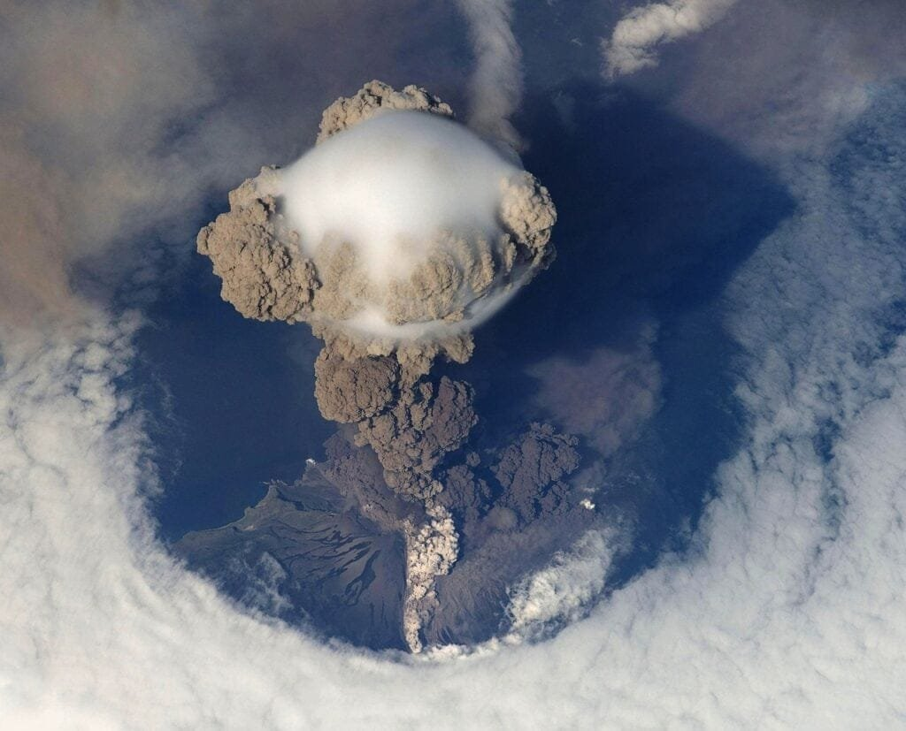

Aviation Safety Guidelines for Volcanic Ash provides crucial information to ensure the safety of aircraft and passengers when flying through areas affected by volcanic ash. Volcanic eruptions can release a significant amount of ash particles into the atmosphere, posing serious risks to aviation. This article dives into the topic of volcanic eruptions, explaining their formation, geographic distribution, and eruption patterns. Understanding these factors is essential in order to establish effective safety protocols and mitigate potential dangers. By following the recommended guidelines and protocols, pilots and airlines can minimize the impact of volcanic ash on their flights, ensuring a safe and smooth journey for all.

This image is property of pixabay.com.

## Understanding Volcanic Ash and its Impact on Aviation

Volcanic ash is a fine particulate material that is ejected into the atmosphere during volcanic eruptions. It is composed of tiny fragments of volcanic rock, glass, and minerals that are less than 2 millimeters in diameter. Unlike regular ash, volcanic ash can pose serious hazards to aircraft due to its abrasive properties, low visibility, and ability to damage aircraft engines and systems.

When a volcano erupts, the intense heat melts rocks and minerals, creating a volcanic plume. As the plume rises into the atmosphere, it cools rapidly, causing the volcanic material to solidify into ash particles. These particles can then be carried by winds over long distances, creating a risk for aircraft flying in the vicinity of the eruption.

The potential hazards of volcanic ash to aircraft are numerous and significant. One of the main concerns is the damage it can cause to aircraft engines. Volcanic ash has a high melting point, and when it enters the hot engines of an aircraft, it can melt and solidify, causing the engines to stall or fail. The abrasive [nature](https://magmamatters.com/the-art-and-science-of-volcano-monitoring/ "The Art and Science of Volcano Monitoring") of volcanic ash can also erode engine components, leading to reduced engine efficiency and potential engine failure.

In addition to engine damage, volcanic ash can also affect aircraft systems and components. The fine particles can infiltrate the air conditioning and pressurization systems, causing them to become clogged and affecting the aircraft's ability to maintain a safe cabin environment. The ash particles can also impair visibility by scratching windshields and obstructing the aircraft's windows, which can be extremely dangerous during critical phases of flight.

Historically, there have been several incidents where volcanic ash has impacted flights. One notable event occurred in 1982 when British Airways Flight 9 flew into a cloud of volcanic ash from the eruption of Mount Galunggung in Indonesia. The volcanic ash caused all four of the aircraft's engines to fail, leading to a complete loss of thrust. Fortunately, the pilots were able to restart the engines after descending to a lower altitude, and the plane landed safely in Jakarta. This incident highlighted the serious threat that volcanic ash poses to aircraft and led to significant advancements in aviation safety protocols for handling volcanic ash.

## Aviation Safety Protocol Development for Handling Volcanic Ash

Recognizing the potential dangers posed by volcanic ash, the International Civil Aviation Organization (ICAO) plays a crucial role in developing and enhancing ash-related safety guidelines. The ICAO works closely with meteorological organizations and the scientific community to gather data and research on volcanic eruptions and their impacts on aviation. This collaboration allows for the development of comprehensive safety protocols that can be implemented by airlines and pilots.

Over the years, there have been significant advancements in ash-related safety guidelines. These guidelines provide comprehensive procedures for airlines and pilots to follow when operating in ash-prone areas. They outline pre-flight, in-flight, and post-flight measures that should be taken to ensure the safety of passengers and crew.

Airlines and pilots have specific roles and responsibilities when it comes to handling volcanic ash. It is the responsibility of airlines to establish and implement policies and procedures that comply with the ICAO guidelines. This includes ensuring that their aircraft are properly maintained, conducting regular inspections, and providing appropriate training to pilots and crew members. Pilots, on the other hand, must be trained on ash-related safety protocols and emergency procedures to handle encounters with volcanic ash effectively.

<iframe width="560" height="315" src="https://www.youtube.com/embed/ahKoeqPXD-I" frameborder="0" allow="accelerometer; autoplay; encrypted-media; gyroscope; picture-in-picture" allowfullscreen></iframe>

  

## Pre-flight Safety Measures

The importance of pre-flight planning in ash-prone zones cannot be overstated. Prior to departure, pilots and airlines must gather and assess weather and volcanic activity reports to determine the potential presence of volcanic ash along their planned route. This involves monitoring volcanic activity in the region and staying informed about volcanic ash advisories issued by Volcanic Ash Advisory Centers (VAACs).

In addition to monitoring reports, pre-flight aircraft inspections are essential for detecting any signs of volcanic ash ingestion. Pilots and maintenance crews should pay close attention to the engines and air systems, as these are the areas most vulnerable to damage from volcanic ash. Any signs of ash contamination, such as ash residue or strange odors, should be addressed promptly to ensure the aircraft's airworthiness.

## In-flight Safety Measures

Monitoring and reading flight instrument readings are crucial during flight to detect any indications of volcanic ash. Pilots rely on various instruments, such as the engine pressure ratio (EPR) gauge and turbine temperature sensors, to monitor engine performance. Unusual readings or fluctuations can indicate the presence of volcanic ash, and pilots must take appropriate action to avoid further exposure.

Procedures for flying into or near ash clouds are clearly defined in the ash-related safety guidelines. Pilots should aim to avoid flying into ash clouds whenever possible. If unable to avoid them, pilots should reduce speed, descend to a lower altitude to minimize exposure, and report the encounter to air traffic control and relevant authorities.

Communications with air traffic control are vital during ash encounters. Pilots must provide detailed information about the ash cloud's location, density, and direction of movement to assist other aircraft in making informed decisions. This information helps air traffic control establish safe routes for avoiding ash clouds and ensure the safety of all aircraft in the affected area.

This image is property of pixabay.com.

## Post-flight Measures

Detailed aircraft inspections are essential after encountering volcanic ash. Maintenance crews should thoroughly inspect the aircraft for any signs of damage or contamination. This includes checking the engines, air systems, and other critical components for any abnormalities. Any necessary repairs or maintenance should be conducted promptly to prevent further damage and ensure the aircraft's continued airworthiness.

In addition to aircraft inspections, reporting volcanic ash encounters is an important post-flight measure. Pilots should file detailed reports, providing information about the encounter, including the time, location, and estimated density of the ash cloud. This information is crucial for meteorological organizations and research institutes to improve ash detection and avoidance methods and contribute to the development of better safety protocols.

Maintenance response plans should be in place to address ash ingestion. If an aircraft has ingested significant amounts of volcanic ash, it must undergo a thorough inspection and maintenance procedure to ensure that all damages are repaired. This may involve engine cleaning, replacement of damaged components, and comprehensive inspections to verify the aircraft's airworthiness before returning it to service.

## Preventive Strategies to Avoid Ash Clouds

Preventive strategies to avoid ash clouds focus on the importance of predictive modeling and satellite imaging. Predictive modeling involves analyzing historical data, volcanic activity trends, and meteorological conditions to forecast the movement and dispersion of volcanic ash. This information helps airlines and pilots plan their flights more effectively and avoid areas of potential ash contamination.

Satellite imaging plays a crucial role in detecting ash clouds. Satellites equipped with specialized sensors can detect and monitor the presence of volcanic ash in the atmosphere. These sensors can provide real-time information about the location, density, and movement of ash clouds, allowing for timely alerts and warnings to be issued to pilots and air traffic control.

Additionally, advancements in technology have led to the development of advanced detection and avoidance systems for volcanic ash. These systems use radar-based technologies, such as weather radar and lidar, to detect and track ash clouds. They provide pilots with real-time information about the location and intensity of ash clouds, enabling them to adjust their flight paths accordingly.

This image is property of pixabay.com.

## Air Traffic Management During Volcanic Activity

During volcanic activity, the Volcanic Ash Advisory Centers (VAACs) play a critical role in informing and directing planes. VAACs are responsible for monitoring volcanic eruptions and issuing volcanic ash advisories to aviation stakeholders. These advisories include information about the location, height, and movement of ash clouds, providing pilots and air traffic control with valuable guidance for safe flight operations.

In the event of an ash eruption, air traffic control communicates with pilots to ensure their safety. This communication involves relaying information from VAACs and coordinating with pilots to establish ash-free routing whenever possible. The concept of ash-free routing aims to keep aircraft clear of areas with known or suspected ash contamination, minimizing the risk of ash encounters.

## Training for Pilots and Crew

Training is essential for pilots and crew members to effectively handle volcanic ash encounters. They need to be familiar with ash-related safety protocols and emergency procedures to ensure the safety of the passengers and the aircraft. Training programs should cover topics such as ash identification, ash encounter response, and communication with air traffic control during ash events.

Simulator drills replicating ash encounters can help pilots develop the necessary skills and confidence to respond appropriately to ash-related incidents. These drills simulate various scenarios, allowing pilots to practice their decision-making, instrument interpretation, and emergency procedures in a controlled environment. Regular training and simulation exercises help pilots maintain their proficiency and preparedness for ash encounters.

## Government Role in Air Safety During Volcanic Activity

Governments play a crucial role in ensuring air safety during volcanic activity through regulatory oversight and enforcement. They establish and enforce regulations that require airlines and pilots to comply with ash-related safety guidelines. This includes conducting regular inspections, ensuring proper maintenance procedures are followed, and implementing training programs for pilots and crew members.

Collaboration between meteorological and aeronautical organizations is vital for effective air safety during volcanic activity. Meteorological organizations provide valuable data and forecasts about volcanic ash plumes, while aeronautical organizations, such as the ICAO, develop and disseminate safety guidelines based on that information. This collaborative effort ensures that comprehensive and up-to-date information is available to aviation stakeholders.

Government funding for research and technology is also critical for advancing aviation safety during volcanic activity. Funding enables scientists and researchers to study volcanic eruptions, develop improved detection and forecasting methods, and enhance aircraft technologies to withstand volcanic ash encounters. Continued investment in research and [technology ensures that aviation safety](https://magmamatters.com/geothermal-energy-and-its-volcanic-origins/ "Geothermal Energy and Its Volcanic Origins") protocols remain relevant and effective in the face of increasing volcanic activity.

## Future Advancements and Opportunities

The future of aviation safety amidst more frequent volcanic activity lies in ongoing research and technological advancements. Scientists and researchers are focusing on better ash detection and avoidance methods to minimize the risks associated with volcanic ash.

One area of research is improving the accuracy and timeliness of predictive modeling. By refining models and incorporating real-time data from satellites and ground-based monitoring systems, scientists aim to provide more accurate forecasts of volcanic ash movement. This will enable airlines and pilots to make more informed decisions and take proactive measures to avoid ash clouds.

Advancements in aircraft design also hold promise for mitigating the impact of volcanic ash encounters. Engineers are exploring innovative materials that can withstand the abrasive nature of volcanic ash without sustaining significant damage. Improved engine designs and filtration systems are also being developed to prevent ash ingestion and minimize engine performance degradation.

As more frequent volcanic activity is anticipated in the future, the aviation industry must stay ahead of the curve to ensure the safety of flights. Continued research, collaboration, and investment in technology will pave the way for enhanced volcanic ash detection, avoidance, and aircraft capabilities to withstand the challenges posed by volcanic eruptions.

In conclusion, understanding volcanic ash and its impact on [aviation is paramount for ensuring the safety of air travel](https://magmamatters.com/the-environmental-impact-of-volcanic-eruptions-2/ "The Environmental Impact of Volcanic Eruptions"). Through the development of comprehensive safety protocols, pre-flight planning, in-flight monitoring, and post-flight inspections, aviation stakeholders can effectively mitigate the hazards associated with volcanic ash. The collaborative efforts of international organizations, governments, and the aviation industry are instrumental in advancing aviation safety during volcanic activity. With ongoing research and technological advancements, the future of aviation safety remains promising, even in the face of more frequent volcanic eruptions.

