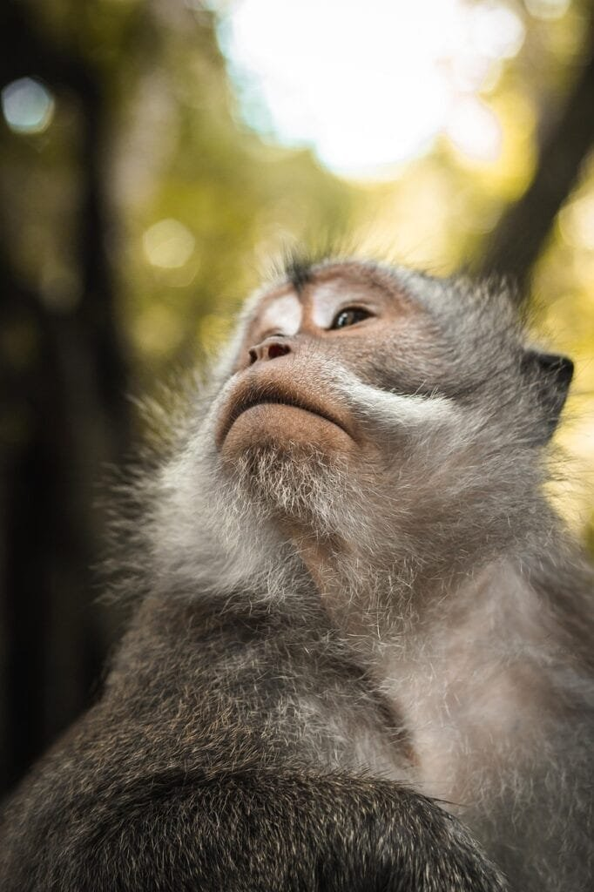

Volcanic regions are not only breathtaking landscapes but also host unique ecosystems with high biodiversity. The conservation of these regions is crucial to protect the wide range of species that call them home. In this guide, we will explore some top tips for conserving biodiversity in volcanic regions. From understanding the types of volcanoes and their eruption patterns to mitigating risks and promoting sustainable practices, these tips will provide valuable insights for preserving these fragile environments and the diverse life they support. Whether you are an avid traveler, a scientist, or simply curious about the wonders of nature, this guide will provide you with practical knowledge and a deeper appreciation for the conservation efforts needed in volcanic regions.

This image is property of pixabay.com.

## Understanding Volcanic Ecosystems

### Interpreting the geographical distribution of volcanoes

To understand volcanic ecosystems, it is important to first interpret the geographical distribution of volcanoes. Volcanoes are formed along plate boundaries, hotspots, or rift zones. The "Ring of Fire" surrounding the Pacific Ocean is a prime example of an area with a high concentration of active volcanoes due to the meeting of tectonic plates. By studying the distribution of volcanoes, scientists can gain insights into the potential risks and benefits associated with volcanic activity in specific regions.

### Identifying the types of volcanoes and their characteristics

Volcanoes come in different types, each with its own unique characteristics. Shield volcanoes, such as those found in Hawaii, are formed by the gradual accumulation of lava flows over time. These volcanoes have gentle slopes and tend to erupt less explosively. Stratovolcanoes, on the other hand, are characterized by steep slopes and are known for their explosive eruptions. Other [types of volcanoes](https://magmamatters.com/understanding-volcanic-formation-a-comprehensive-guide/ "Understanding Volcanic Formation: A Comprehensive Guide") include cinder cones and calderas. By identifying the types of volcanoes present in a region, scientists can better understand the potential impacts they may have on the surrounding environment.

### Analyzing eruption patterns and their impact on biodiversity

Eruption patterns play a crucial role in understanding the impact of volcanic activity on biodiversity. Factors such as lava viscosity and gas content can influence the explosiveness and duration of volcanic eruptions. Violent explosive eruptions can cause immediate devastation to plants and animals in the vicinity, while effusive eruptions, where lava flows slowly out of the volcano, can create new land and provide fertile soil for future growth. By analyzing eruption patterns, scientists can assess the short-term and long-term impacts on biodiversity and develop strategies for conservation and restoration.

## Assessing Impacts of Volcanic Activity on Biodiversity

### The role of volcanic soil in supporting diverse plant life

One of the positive impacts of volcanic activity on biodiversity is the creation of fertile soil. Volcanic soil, also known as volcanic ash, is rich in minerals and nutrients, making it highly beneficial for plant growth. The fine particles of volcanic ash can retain water and nutrients, providing an ideal environment for plant roots to thrive. Many plant species have adapted to these nutrient-rich soils and rely on volcanic activity for their survival. Understanding the role of volcanic soil in supporting diverse plant life is essential for the conservation and restoration of volcanic ecosystems.

### Effects of volcanic disasters on animal and plant species

While volcanic activity can provide favorable conditions for some plant species, it can also have devastating effects on animal and plant populations. Violent eruptions can destroy habitats, burying plants and animals under layers of ash and rock. The release of toxic gases and chemicals during volcanic eruptions can also have a detrimental impact on biodiversity. Some species may not have the ability to escape these catastrophic events, leading to a decline in their populations or even extinction. Assessing the effects of volcanic disasters on animal and plant species is crucial for understanding the long-term impacts on biodiversity and implementing effective conservation measures.

### Impact of gaseous emissions from volcanoes on biodiversity

Gaseous emissions from volcanoes, such as [sulfur dioxide and carbon](https://magmamatters.com/the-art-and-science-of-volcano-monitoring/ "The Art and Science of Volcano Monitoring") dioxide, can have both direct and indirect impacts on biodiversity. These gases can cause air pollution, leading to respiratory problems in animals and humans. They can also contribute to climate change and alter weather patterns, affecting ecosystems and species distribution. Some plant species, however, have evolved to tolerate high levels of volcanic gases and can even benefit from their presence. By studying the impact of gaseous emissions on biodiversity, scientists can gain a deeper understanding of the complex relationships between volcanic activity and ecosystems.

This image is property of pixabay.com.

## Implementing Conservation Measures in Volcanic Regions

### Adopting effective land-use planning

In order to conserve biodiversity in volcanic regions, effective land-use planning is essential. This involves identifying areas of high ecological value and implementing measures to protect them from human activities that may harm the ecosystem. By designating protected areas and establishing buffer zones around volcanoes, the natural habitats and wildlife can be safeguarded. Land-use planning should also take into consideration the potential risks associated with volcanic activity, ensuring that human settlements and infrastructure are located in areas that are less vulnerable to volcanic hazards.

### Promoting sustainable agriculture

Agricultural practices in volcanic regions should be sustainable to minimize the negative impact on biodiversity. Volcanic soils are highly fertile and can support agricultural activities. However, excessive use of chemical fertilizers and pesticides can contaminate the soil and water sources, affecting the health of both plants and animals. By promoting organic farming methods and encouraging farmers to adopt sustainable agricultural practices, the biodiversity in volcanic regions can be protected while still supporting local livelihoods.

### Ensuring responsible tourism practices

Volcanic regions often attract tourists due to their unique landscapes and natural features. However, tourism can also pose a threat to biodiversity if not managed properly. Irresponsible tourism practices can damage fragile ecosystems, disrupt wildlife habitats, and contribute to pollution. It is important to establish guidelines and regulations for tourism activities in volcanic regions, ensuring that they are conducted in a sustainable and responsible manner. This includes promoting eco-tourism, educating tourists about the importance of conservation, and supporting local communities in developing tourism initiatives that are aligned with biodiversity protection goals.

## Promoting Volcano Monitoring and Research

### Encouraging technological advancements in volcano monitoring

Monitoring volcanoes is crucial for predicting eruptions and mitigating risks to surrounding communities. Technological advancements in volcano monitoring, such as the use of seismometers, gas sensors, and satellite imagery, have greatly improved our ability to detect and analyze volcanic activity. By encouraging further research and development in this field, scientists can enhance their understanding of volcanic processes and improve the accuracy of eruption forecasts. Investing in innovative monitoring technologies can ultimately save lives and minimize the impact of volcanic eruptions on biodiversity.

### Promoting research on the impact of volcanic activities on biodiversity

To effectively protect and conserve biodiversity in volcanic regions, it is important to conduct research on the impact of volcanic activities on ecosystems. This research can provide valuable insights into how biodiversity responds to volcanic disturbances, which species are most vulnerable, and the best strategies for restoration and recovery. By promoting and supporting research projects in this field, scientists can contribute to the development of evidence-based conservation measures and improve our overall understanding of volcanic ecosystems.

### Improving availability and sharing of research data

Sharing research data and findings is essential for advancing knowledge and fostering collaboration in the field of volcano ecology and conservation. By improving the availability and accessibility of research data, scientists from different disciplines and regions can benefit from the insights gained by others. This can lead to more informed decision-making, improved conservation strategies, and a better understanding of the complex interactions between volcanoes and biodiversity. Creating platforms and initiatives that facilitate the sharing of research data will contribute to the collective efforts in conserving biodiversity in volcanic regions.

This image is property of pixabay.com.

## Creating Biodiversity Safeguards through Legislation

### Establishing protected areas

Establishing protected areas is a key strategy in safeguarding biodiversity in volcanic regions. By designating specific areas as protected, governments and conservation organizations can ensure that these habitats and their associated species are legally protected from destructive human activities. Protected areas can serve as refuges for rare and endangered species, as well as provide opportunities for scientific research and education. By enacting legislation to establish protected areas, governments can demonstrate their commitment to biodiversity conservation and provide a framework for effective management and monitoring.

### Developing strict environmental regulations

In addition to establishing protected areas, it is necessary to develop and enforce strict environmental regulations in volcanic regions. These regulations can address issues such as waste management, pollution control, and land-use practices. By setting clear guidelines and standards, governments can ensure that human activities in volcanic regions are carried out in a sustainable and environmentally responsible manner. Strict environmental regulations can help minimize the negative impacts of human activities on biodiversity and preserve the unique ecosystems found in volcanic regions.

### Enforcing penalties for non-compliance with conservation rules

To ensure compliance with environmental regulations and conservation rules, it is important to enforce penalties for non-compliance. By imposing fines, confiscating equipment, or revoking permits, authorities can send a strong message that the protection of biodiversity in volcanic regions is a priority. Strict enforcement of penalties can act as a deterrent and encourage individuals and organizations to adhere to conservation rules. It is crucial for governments to allocate resources and establish monitoring systems to ensure effective enforcement and to maintain the integrity of biodiversity safeguards.

## Engaging Local Communities in Biodiversity Conservation

### Educating communities about the importance of biodiversity

Engaging local communities in biodiversity conservation efforts begins with education and awareness. It is important to educate communities about the value of biodiversity and the benefits it provides, such as ecosystem services, food security, and economic opportunities. By raising awareness about the importance of biodiversity, communities can develop a sense of stewardship and take an active role in conservation initiatives. Educational programs, workshops, and outreach activities can be organized to provide information and foster a deeper understanding of the significance of biodiversity in volcanic regions.

### Involving local communities in conservation initiatives

In order to achieve long-term conservation success, it is crucial to involve local communities in biodiversity conservation initiatives. Local knowledge and traditional practices can provide valuable insights and contribute to the development of effective conservation strategies. By engaging communities in decision-making processes, they can take ownership of conservation projects and become active participants in ensuring the sustainable use of resources. This can be done through community-based conservation programs, collaborative partnerships, and the establishment of local conservation groups.

### Building capacity for emergency responses to volcanic risks

Volcanic eruptions can pose immediate threats to human lives and livelihoods. Building capacity for emergency responses is essential in volcanic regions to protect both human populations and biodiversity. This includes establishing early warning systems, training emergency responders, and conducting drills to simulate volcanic disasters. By involving local communities in these preparedness efforts, they can be better equipped to respond to volcanic risks and minimize the impact on their lives and the surrounding environment. Building capacity for emergency responses can save lives and help secure the long-term survival of biodiversity in volcanic regions.

## Collaboration with National and International Conservation Organizations

### Working with conservation NGOs

Collaboration with national and international conservation organizations can significantly enhance biodiversity conservation efforts in volcanic regions. These organizations often have expertise, resources, and networks that can support local initiatives and contribute to the development of effective conservation strategies. By forging partnerships with conservation NGOs, governments and local communities can tap into their knowledge and experience, access funding opportunities, and benefit from capacity-building programs. Collaboration between different stakeholders can lead to more holistic and impactful approaches to conserving biodiversity in volcanic regions.

### Cooperating with international initiatives

Biodiversity conservation is a global issue that requires international cooperation and coordination. Volcanic regions often span across national boundaries, making collaboration with other countries crucial for effective conservation. By participating in international initiatives, such as biodiversity conventions and agreements, governments can demonstrate their commitment to the protection and sustainable use of biodiversity in volcanic regions. Exchange of knowledge, sharing of best practices, and joint research projects can contribute to the development of innovative and effective conservation strategies that benefit both local communities and global biodiversity.

### Securing funding for conservation programs

Securing adequate funding is essential for the successful implementation of biodiversity conservation programs in volcanic regions. Governments can allocate funds for conservation initiatives, but additional financial support may be required. Collaboration with national and international funding agencies, philanthropic organizations, and private sector partners can help secure the necessary resources. By developing funding proposals, demonstrating the potential benefits of conservation, and establishing partnerships with stakeholders, governments and conservation organizations can secure the financial support needed to implement comprehensive and long-term biodiversity conservation programs.

## Promoting Restoration Ecology in Volcano-Damaged Areas

### Implementing replanting programs

After a volcanic eruption, large areas of land can be left barren and devoid of vegetation. Implementing replanting programs is a crucial step in restoring biodiversity in volcano-damaged areas. Native plant species that are adapted to volcanic soils can be reintroduced to accelerate the recovery process. These replanting programs can also help prevent soil erosion, create wildlife habitat, and contribute to ecosystem stability. By working with local communities and conservation organizations, governments can ensure the successful implementation of replanting programs and promote the restoration of volcanic ecosystems.

### Monitoring and managing the recovery of wildlife

Alongside replanting programs, it is important to monitor and manage the recovery of wildlife in volcano-damaged areas. The impacts of volcanic eruptions on animal populations can be significant, with some species losing their habitats or facing direct harm. Monitoring the return of wildlife and assessing their population trends can provide valuable insights into the recovery process. By implementing measures to protect and manage wildlife populations, such as habitat restoration and reintroduction programs, governments and conservation organizations can support the recovery of biodiversity in volcano-damaged areas.

### Rebuilding habitats destroyed by volcanic activity

Volcanic eruptions can cause extensive damage to habitats, displacing both plants and animals. Rebuilding habitats that have been destroyed is crucial for the recovery of biodiversity in volcano-damaged areas. This can involve creating artificial structures, such as nesting boxes or artificial caves, to provide temporary shelter for wildlife. Additionally, efforts can be made to restore natural features, such as rivers or wetlands, that were altered by volcanic activity. By focusing on habitat rebuilding, governments and conservation organizations can promote the recovery and resilience of ecosystems in volcanic regions.

## Mitigating Climate Change Impacts in Volcanic Regions

### Managing greenhouse gas emissions from volcanoes

Volcanoes are natural sources of greenhouse gases, such as carbon dioxide and sulfur dioxide. These gases can contribute to [climate change and have a global impact on the environment](https://magmamatters.com/geothermal-energy-and-its-volcanic-origins/ "Geothermal Energy and Its Volcanic Origins"). Mitigating the climate change impacts of volcanic emissions requires monitoring and managing these gases. By investing in technologies that can measure and monitor volcanic emissions, governments and scientists can gain a better understanding of the contribution of volcanoes to global greenhouse gas levels. Implementing measures to reduce emissions and develop sustainable energy sources can help mitigate the climate change impacts in volcanic regions.

### Adapting to shifting weather patterns due to volcanic eruptions

Volcanic eruptions can have a temporary but significant impact on weather patterns in the surrounding regions. Ash particles and gases released during eruptions can affect sunlight penetration, leading to cooler temperatures and changes in precipitation patterns. These shifts in weather patterns can have cascading effects on ecosystems and biodiversity. Adapting to these changes requires effective planning and measures to ensure the resilience of ecosystems. By monitoring and forecasting weather impacts, governments and communities can develop strategies to mitigate the effects and promote the adaptation of biodiversity to shifting conditions.

### Developing resilient ecosystems

Building resilient ecosystems is essential for mitigating the long-term impacts of climate change in volcanic regions. Resilient ecosystems are more capable of withstanding and recovering from disturbances, such as volcanic eruptions or changing climate conditions. This can involve restoring and diversifying habitats, managing invasive species, and enhancing ecosystem connectivity. By prioritizing the conservation of species and habitats that are more resilient to climate change, governments and conservation organizations can promote the adaptive capacity of ecosystems in volcanic regions. Building resilient ecosystems is crucial for maintaining biodiversity and ensuring the long-term survival of species in the face of climate change.

## Public Awareness and Education about Volcanoes and Biodiversity

### Promoting public understanding of volcanoes and their ecosystems

Public understanding of volcanoes and their ecosystems is essential for ensuring support and participation in conservation efforts. Many people may not fully grasp the importance of conserving volcanic biodiversity or the potential risks associated with volcanic activity. By promoting public awareness and education, governments and conservation organizations can raise understanding and appreciation for the unique ecosystems found in volcanic regions. This can be done through public campaigns, educational materials, and interactive exhibits that provide information on volcanoes, their biodiversity, and the need for conservation.

### Conducting educational campaigns on biodiversity conservation

Biodiversity conservation is a complex issue that requires the involvement of the public. Conducting educational campaigns on biodiversity conservation can help raise awareness about the threats faced by species in volcanic regions and the importance of their protection. These campaigns can target different age groups and segments of the population, providing information on the value of biodiversity, the role of ecosystems, and the actions individuals can take to contribute to conservation efforts. By fostering a sense of responsibility and empowerment, educational campaigns can inspire individuals to become active participants in biodiversity conservation.

### Creating interactive and informative materials

To effectively engage the public in the conservation of biodiversity in volcanic regions, it is important to create interactive and informative materials. These can include websites, videos, podcasts, and interactive exhibits that provide engaging and accessible information about volcanoes, ecosystems, and biodiversity. These materials can be designed to cater to different learning styles and interests, making the information more engaging and memorable. By creating interactive and informative materials, governments and conservation organizations can reach a wider audience and inspire individuals to take action to protect and conserve biodiversity in volcanic regions.

In conclusion, conserving biodiversity in volcanic regions requires a comprehensive and multi-faceted approach. Understanding the geographical distribution of volcanoes, identifying the types of volcanoes and their characteristics, and analyzing eruption patterns and their impact on biodiversity are vital steps in assessing the impacts of volcanic activity on the surrounding ecosystems. Implementing effective land-use planning, promoting sustainable agriculture, and ensuring responsible tourism practices are key measures in conserving biodiversity in volcanic regions. Engaging local communities, collaborating with national and international conservation organizations, and promoting restoration ecology are crucial for successful biodiversity conservation initiatives. Mitigating climate change impacts, promoting public awareness and education about volcanoes and biodiversity, and creating biodiversity safeguards through legislation are essential components in protecting and conserving biodiversity in volcanic regions. Through collective efforts and a holistic approach, we can ensure the preservation of these unique and ecologically valuable ecosystems for future generations.

