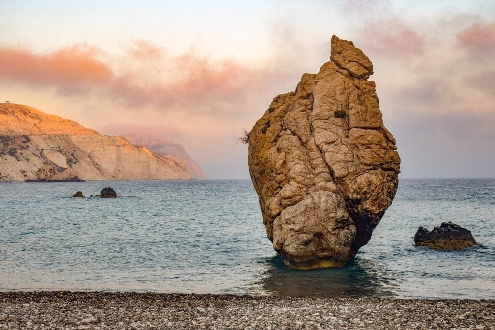

Volcanoes have fascinated humans for centuries, and it's no wonder why. The formation and eruption patterns of these natural wonders offer a glimpse into the inner workings of our planet. Volcanoes are not only majestic but also hold significant scientific importance. By deciphering their formation and eruption mechanisms, scientists can gain insights into the Earth's geological processes and better predict future volcanic activity. From the explosive volcanic eruptions along the "Ring of Fire" to the gradual outpourings of lava from shield volcanoes in Hawaii, each volcano has its own unique story to tell. In this article, we will explore the various types of volcanoes, their geographic distribution, eruption causes, and the hazards and benefits they bring. So, let's embark on a journey to decode the mysteries of volcanoes and uncover the secrets they hold.

# Understanding Volcanoes and Their Formation

Volcanoes have fascinated humans for centuries, with their fiery eruptions and majestic formations. In order to fully appreciate these natural wonders, it is essential to understand how they are formed and the processes that shape their existence. By delving into the science behind volcanoes, we can gain a deeper understanding of their significance and the impact they have on our planet.

This image is property of pixabay.com.

## Defining Volcanoes

Before we dive into the intricacies of volcano formation, let's first establish what exactly a volcano is. A volcano is a geological feature that is created when molten rock, known as magma, escapes to the Earth's surface through a vent or opening. This molten rock can be accompanied by gases and solid debris, resulting in a volcanic eruption that expels lava and ash into the atmosphere.

## Examining the Process of Volcano Formation

Volcanoes are formed through a combination of geologic processes and tectonic activity. At sites along plate boundaries, where the Earth's tectonic plates meet, the movement and interaction of these plates set the stage for volcanic activity. Along subduction zones, where one tectonic plate is forced beneath another, melting of the subducted plate occurs, leading to the formation of magma chambers. As the magma rises towards the surface, it can create a conduit, or pipe-like structure, which acts as a pathway for the magma to escape during an eruption.

In addition to plate boundaries, hotspots beneath the Earth's crust are another common location for volcano formation. Hotspots are areas of intense heat beneath the Earth's surface, often associated with plumes of hot mantle material. Over time, as the tectonic plates move across these hotspots, magma can rise to the surface, resulting in the [formation of volcanic](https://magmamatters.com/understanding-volcanic-formation-a-comprehensive-guide/ "Understanding Volcanic Formation: A Comprehensive Guide") features.

This image is property of pixabay.com.

## Highlighting the Role of Tectonic Activities in Volcanoes

Tectonic activities play a crucial role in the formation and existence of volcanoes. The movement and interaction of tectonic plates determine the location and type of volcanic activity. The most well-known example of tectonic activities influencing volcanoes is the "Ring of Fire," an area encircling the Pacific Ocean where several tectonic plates meet. This region is particularly prone to volcanic eruptions, as the convergence and subduction of these plates create the ideal conditions for magma formation and subsequent eruptions.

Volcanic activity can also be observed along rift zones, where the Earth's tectonic plates are moving apart. This movement creates a gap or fissure in the Earth's crust, allowing magma to rise to the surface and form a volcanic feature. Famous examples of volcanoes formed along rift zones include the volcanoes in Iceland.

Understanding the role of tectonic activities in volcanoes is crucial for predicting future eruptions and mitigating potential hazards. By closely monitoring the movement of tectonic plates, scientists can gather valuable data that helps in assessing the likelihood of volcanic activity in specific regions.

## Types of Volcanoes

Volcanoes come in a variety of shapes and sizes, each with its own distinctive characteristics. By categorizing volcanoes into different types, scientists can better understand their formation and eruption patterns. Let's explore some of the most common types of volcanoes:

### Describing Shield Volcanoes

Shield volcanoes are characterized by their broad, gently sloping profile, resembling a warrior's shield laid on the ground. These volcanoes are formed by low-viscosity lava, which flows easily and spreads out over a large area. The lava from shield volcanoes is typically composed of basalt, a type of volcanic rock rich in iron and magnesium.

One prominent example of a shield volcano is Mauna Loa in Hawaii. This massive volcano rises approximately 13,679 feet above sea level and extends deep beneath the ocean's surface. The eruptions from shield volcanoes are usually non-explosive, allowing for the gradual build-up of the volcano over time.

### Discussing Stratovolcanoes or Composite Volcanoes

Stratovolcanoes, also known as composite volcanoes, are tall, symmetrical mountains with steep sides. These volcanoes are formed by alternating layers of lava, ash, and other volcanic material. Unlike shield volcanoes, stratovolcanoes are composed of both low-viscosity lava and more viscous lava, resulting in explosive eruptions.

Examples of stratovolcanoes include Mount Fuji in Japan and Mount St. Helens in the United States. These volcanoes are known for their violent eruptions, which can release large amounts of ash, pyroclastic flows, and volcanic gases into the atmosphere.

### Distinguishing Cinder Cone Volcanoes

Cinder cone volcanoes are the simplest and most common type of volcano. These volcanoes are small in size but can still pose a significant threat. Cinder cones are formed when gas-rich magma is ejected into the air during an eruption. As the magma is propelled upwards, it breaks into small, solid fragments called cinders, which rain down around the vent and accumulate to form a cone-shaped mountain.

The eruption of a cinder cone volcano is typically brief and explosive, with ash and debris being ejected into the air. However, these eruptions are relatively localized and do not typically result in large-scale destruction.

### Differentiating Between Lava Domes and Volcanic Fields

Lava domes and volcanic fields are two distinct types of volcanic features. Lava domes, also known as volcanic domes, are formed when highly viscous lava accumulates around a vent and forms a bulbous or dome-shaped structure. These lava domes are often unstable and prone to collapse, leading to explosive eruptions.

On the other hand, volcanic fields are expansive areas that contain multiple volcanic features, such as cinder cones, shield volcanoes, and fissures. These volcanic fields are the result of extensive volcanic activity over a long period of time and can cover large areas of land.

Understanding the different types of volcanoes is essential for identifying potential hazards and assessing the risks associated with volcanic activity. By studying the specific characteristics and eruption patterns of each type, scientists can better predict the behavior of a volcano and implement appropriate safety measures.

This image is property of pixabay.com.

## Geographic Distribution of Volcanoes

Volcanoes are not evenly distributed across the globe but instead tend to cluster in certain regions. By mapping out these volcanic hotspots, scientists can gain valuable insights into the underlying geological processes that give rise to volcanic activity. Let's explore some key aspects of the geographic distribution of volcanoes:

### Mapping Global Volcanic Hotspots

Volcanic hotspots are areas where significant volcanic activity occurs, often due to the presence of a deep-seated mantle plume. These plumes are columns of hot, buoyant rock that rise from the Earth's mantle towards the surface. As the plume reaches the crust, it can melt and generate magma, leading to the formation of volcanoes.

One notable volcanic hotspot is located in the Hawaiian Islands. The islands of Hawaii are the result of the Pacific Plate moving over a stationary hotspot, which has created a chain of shield volcanoes, including the famous Mauna Loa and Mauna Kea.

Another example of a volcanic hotspot is found in the Yellowstone National Park in the United States. This hotspot has given rise to numerous geothermal features and is responsible for the presence of the Yellowstone Caldera, which is one of the largest active volcanic systems in the world.

### Identifying the 'Ring of Fire'

The "Ring of Fire" is a major area in the basin of the Pacific Ocean where a large number of earthquakes and volcanic eruptions occur. This ring is defined by the boundaries of several tectonic plates, including the Pacific Plate, as well as the presence of subduction zones and volcanic arcs.

The countries that make up the "Ring of Fire" include Chile, Japan, the Philippines, Indonesia, and the United States, among others. This region is known for its intense volcanic activity, with famous volcanoes such as Mount Fuji in Japan and Mount Pinatubo in the Philippines.

### Profiling Notable Volcanoes Around the World

Volcanoes can be found in various countries around the world, each with its own unique characteristics and historical significance. Let's highlight some notable volcanoes that have captured the attention of scientists and the public alike:

- Mount Vesuvius: Located near Naples, Italy, Mount Vesuvius is famous for its eruption in 79 AD, which buried the ancient city of Pompeii. This eruption serves as a vivid reminder of the destructive power of volcanoes and their impact on human civilization.
    
- Mount Etna: Situated on the island of Sicily, Italy, Mount Etna is one of the most active volcanoes in the world. Its frequent eruptions have shaped the surrounding landscape, and the volcano is often studied for its potential hazards and eruption patterns.
    
- Mount Rainier: Rising majestically in the state of Washington, United States, Mount Rainier is an iconic stratovolcano that dominates the skyline of the Pacific Northwest. With its snowy peaks and proximity to major population centers, the volcano poses a significant risk to nearby communities.
    

These are just a few examples of the diverse range of volcanoes found worldwide. The study and monitoring of these volcanoes are crucial for understanding their behavior and mitigating potential hazards.

## Eruption Triggers and Patterns

Volcanic eruptions are fascinating phenomena, with their power and intensity captivating our imagination. To truly comprehend these natural events, it is essential to explore the triggers and patterns of volcanic eruptions. By understanding the underlying processes, scientists can gain insights into predicting future eruptions and minimizing their impact. Let's delve into the dynamics of volcanic eruptions:

### Understanding Magma Dynamics and Volcano Eruptions

Magma dynamics play a central role in determining the behavior and outcome of a volcanic eruption. Magma is molten rock beneath the Earth's surface that can contain a variable amount of dissolved gas. The composition and characteristics of the magma, such as its viscosity and gas content, heavily influence the eruption style.

Viscosity refers to the resistance of a fluid to flow. High-viscosity magma is more resistant to flow and tends to be more gas-rich, leading to explosive eruptions. In contrast, low-viscosity magma flows more easily and is typically less gas-rich, resulting in effusive eruptions characterized by the steady flow of lava.

The gas content of magma, particularly the presence of dissolved volatile gases like water vapor, carbon dioxide, and sulfur dioxide, is critical in determining the explosivity of an eruption. As magma rises towards the surface, the decrease in pressure allows these gases to exsolve, or separate from the magma, forming bubbles. If the magma is too viscous to allow the bubbles to escape, pressure can build up within the volcano, leading to explosive eruptions.

### Explaining Effusive Eruptions

Effusive eruptions are characterized by the relatively gentle outpouring of lava from a volcano. These eruptions occur when low-viscosity magma, such as basalt, reaches the surface and flows out of the vent. Effusive eruptions often result in the formation of lava flows, which can slowly advance and cover large areas of land.

Effusive eruptions are typically less explosive and violent than other types of eruptions. The lava flows from these eruptions can be hot, but they generally move at a slow pace, allowing people and communities time to evacuate if necessary. However, effusive eruptions can still pose hazards, particularly when they occur near populated areas.

### Elaborating on Explosive Eruptions

Explosive eruptions, on the other hand, are characterized by a violent release of gases, ash, and rock fragments into the atmosphere. These eruptions occur when high-viscosity magma, such as andesite or rhyolite, traps large amounts of gas, leading to a buildup of pressure within the volcano.

When the pressure becomes too great, the volcano may erupt explosively, propelling a mixture of volcanic ash, gas, and other materials high into the air. The resulting eruption column can rise several kilometers into the atmosphere, spreading ash and debris over a wide area.

Explosive eruptions pose significant risks to human populations and infrastructure. The volcanic ash and rock fragments expelled during these eruptions can cause damage to buildings, disrupt air travel, and pose respiratory hazards to humans and animals. In some cases, these eruptions can result in pyroclastic flows, which are fast-moving, superheated clouds of gas and volcanic material that can devastate everything in their path.

Understanding the triggers and patterns of volcanic eruptions is crucial for the safety and well-being of communities living near volcanoes. By studying the behavior of past eruptions and monitoring vital signs, scientists strive to detect early warning signs and minimize the impact of future eruptions.

## Volcanic Hazards

While volcanoes may exhibit awe-inspiring beauty and serve as important natural phenomena, they also possess the potential to cause significant hazards and pose risks to both human and environmental health. Understanding these hazards is necessary for developing effective strategies to mitigate the risks associated with volcanic activity. Let's explore some of the most prominent volcanic hazards:

### Recognizing the Impact of Ash Clouds

One of the most immediate and widespread hazards associated with volcanic eruptions is the formation of ash clouds. When a volcano erupts explosively, it releases a mixture of gases, ash, and rock fragments into the atmosphere, forming a dense plume that can travel for hundreds or even thousands of miles.

Volcanic ash is composed of tiny rock particles and glass fragments that can be carried by the wind over vast distances. These ash clouds can pose risks to human health, as inhalation of ash can cause respiratory problems, especially for individuals with pre-existing respiratory conditions. Additionally, the fine particles in volcanic ash can damage aircraft engines, leading to the disruption of air travel and posing a threat to aviation safety.

### Assessing the Danger of Pyroclastic Flows and Surges

Pyroclastic flows and surges are some of the most deadly and destructive volcanic hazards. These fast-moving avalanches of hot gas, ash, and volcanic debris can reach speeds of hundreds of kilometers per hour, sweeping down the slopes of a volcano and incinerating everything in their path.

Pyroclastic flows are typically associated with explosive eruptions and can travel in various directions depending on the topography of the [volcano](https://magmamatters.com/the-environmental-impact-of-volcanic-eruptions-2/ "The Environmental Impact of Volcanic Eruptions"). These flows can devastate entire communities, destroying buildings and infrastructure, and leaving behind a barren landscape.

### Reviewing the Risk of Volcanic Landslides

Volcanic landslides, also known as debris avalanches or flank collapses, occur when a large mass of volcanic material, such as rock, ash, and debris, detaches from the side of a volcano. These landslides can be triggered by various factors, including volcanic eruptions, earthquakes, and the inherent instability of the volcano's slopes.

The rapid displacement of such a massive volume of material can generate powerful waves known as tsunamis. If the volcano is located near the coast, these tsunamis can pose a significant risk to coastal communities, causing widespread flooding and destruction.

### Discussing Volcanic Gases and Climate Change

Volcanic eruptions also release vast amounts of gases into the atmosphere, some of which can have significant environmental impacts. [Volcanic gases such as sulfur dioxide](https://magmamatters.com/the-art-and-science-of-volcano-monitoring/ "The Art and Science of Volcano Monitoring") can react with water vapor and other atmospheric components to form aerosols, tiny particles that can reflect sunlight back into space. This cooling effect can temporarily lower global temperatures on a regional or even global scale.

However, [volcanic gases can also have long-term impacts on climate change](https://magmamatters.com/geothermal-energy-and-its-volcanic-origins/ "Geothermal Energy and Its Volcanic Origins"). Carbon dioxide emitted during volcanic eruptions is a greenhouse gas that contributes to the warming of the Earth's atmosphere. While volcanic emissions of carbon dioxide are relatively small compared to human activities, they can still impact the overall balance of greenhouse gases in the atmosphere and contribute to climate change over longer timescales.

Understanding the hazards associated with volcanic activity is crucial for disaster management and risk assessment. By analyzing historical eruptions, monitoring volcanic phenomena, and implementing robust early warning systems, scientists and authorities can work together to minimize the impact of volcanic hazards on human populations and the environment.

## Volcanic Benefits

While the hazards associated with volcanic eruptions are well-documented, it is important to recognize that volcanoes also provide numerous benefits to the environment and human society. Volcanic activity has shaped our planet's landscape, contributed to the formation of fertile soils, and even provided a source of sustainable energy. Let's explore some of the positive aspects of volcanic activity:

### Exploring the Role of Volcanoes in Creating Fertile Soil

Volcanic eruptions can significantly impact soil fertility and contribute to the development of rich agricultural lands. The explosive eruptions of volcanoes release ash and other volcanic materials into the surrounding areas, depositing a layer of nutrient-rich material on the ground.

These volcanic materials, known as tephra, contain minerals and trace elements that are vital for plant growth. Over time, these nutrients can be broken down and absorbed by the soil, creating highly fertile environments that support diverse plant life. Volcanic soils, such as Andisols, are known for their high water and nutrient retention capacities, making them ideal for agriculture.

### Noting the Creation of New Land Masses

One of the most fascinating aspects of volcanic activity is the creation of new land masses. As molten rock, or lava, erupts from a volcano and cools upon contact with the Earth's surface, it solidifies and forms new land. Over time, repeated eruptions can build up layers of lava and volcanic material, resulting in the formation of islands, mountains, and even entire continents.

The Hawaiian Islands are a prime example of this process. These islands are located atop a stationary hotspot, and over millions of years, repeated volcanic activity has given rise to a chain of islands in the Pacific Ocean. The growth and formation of new land masses through volcanism provide valuable habitats for diverse ecosystems and contribute to the planet's geological diversity.

### Discussing Geothermal Energy Associated with Volcanic Activity

Volcanic activity can also be harnessed as a valuable source of renewable energy. Geothermal energy is derived from the heat stored within the Earth's crust, and in volcanic regions, this natural heat can be easily accessed and utilized. By drilling deep into the Earth's crust, it is possible to tap into reservoirs of hot water or steam that can then be used to generate electricity or provide direct heating.

Countries such as Iceland, which sits on the Mid-Atlantic Ridge and is home to numerous volcanoes, have successfully harnessed geothermal energy for various purposes, including electricity generation and heating systems. By utilizing this clean and renewable energy source, we can reduce our reliance on fossil fuels and mitigate the impacts of climate change.

Volcanoes play a vital role in shaping our planet's landscapes, providing fertile soil for agriculture, and offering sustainable sources of energy. By recognizing and harnessing these benefits, we can utilize volcanic activity in a way that supports our well-being and protects the environment.

## Volcanic Monitoring and Prediction

Effective monitoring and prediction of volcanic activity are crucial for preventing disasters and mitigating the risks associated with volcanic eruptions. By closely monitoring various parameters, scientists can gain valuable insights into the behavior and potential hazards of volcanoes. Let's explore some of the techniques and challenges associated with volcano monitoring:

### Describing Techniques of Volcano Monitoring

Scientists employ a range of techniques to monitor volcanic activity and gather data on the internal processes of a volcano. These techniques include:

- Seismic monitoring: By recording and analyzing seismic waves associated with volcanic activity, scientists can detect changes in a volcano's behavior and detect potential eruptions.
    
- Gas monitoring: Volcanic gases, such as sulfur dioxide, carbon dioxide, and others, can be monitored to assess changes in a volcano's activity. The composition and volume of these gases can provide valuable clues about the movement and behavior of magma beneath the volcano's surface.
    
- Deformation monitoring: By using instruments such as GPS and tiltmeters, scientists can measure changes in the shape or deformation of a volcano. These measurements can help identify areas of increased stress or movement, indicating potential volcanic activity.
    
- Thermal monitoring: Infrared cameras and satellite imagery can be used to monitor the surface temperature of a volcano. An increase in temperature may indicate the movement of magma or hot gases close to the surface.
    

By combining the data gathered from these various monitoring techniques, scientists can create a comprehensive picture of a volcano's behavior and make informed predictions about future eruptions.

### Identifying Signs of an Impending Eruption

Recognizing the signs of an impending eruption is crucial for issuing timely warnings and ensuring the safety of nearby communities. Some of the key indicators that scientists look for include:

- Increased seismic activity: A significant increase in the number or intensity of earthquakes beneath a volcano can indicate the movement of magma and the potential for an eruption.
    
- Ground deformation: A noticeable change in the shape or deformation of a volcano, as measured by GPS or tiltmeters, can suggest the movement of magma beneath the surface.
    
- Changes in gas emissions: A sudden increase in the release of volcanic gases, such as sulfur dioxide, can indicate an increase in volcanic activity and the potential for an eruption.
    
- Thermal anomalies: Unusual changes in surface temperature, as detected by thermal cameras or satellite imagery, can indicate the movement of magma close to the surface.
    

By monitoring these signs closely and analyzing the data collected, scientists can issue timely warnings and recommendations to authorities and local communities, helping to minimize the impact of an eruption.

### Explaining the Limitations and Challenges of Volcanic Forecasting

While significant advancements have been made in volcanic monitoring and prediction, there are still inherent limitations and challenges associated with forecasting volcanic eruptions. Volcanic systems are highly complex, and each volcano exhibits unique behavior, making it difficult to accurately predict the timing and magnitude of eruptions.

Changing eruptive styles and the varying composition of magma further complicate the forecasting process. Additionally, volcanic systems can undergo periods of quiescence, during which there is little or no volcanic activity, making it challenging to differentiate between periods of dormancy and those that precede an eruption.

Uncertainty surrounding volcanic forecasting underscores the importance of continuous monitoring and maintaining robust early warning systems. By investing in research, technology, and education, we can improve our understanding of volcanic processes and enhance our ability to predict and mitigate volcanic hazards.

## Volcano Disaster Management and Mitigation

The management of volcano-related disasters requires effective strategies that encompass various aspects of emergency planning, communication, and community preparedness. By implementing proactive measures, authorities can minimize the impact of volcanic eruptions and protect the well-being of affected populations. Let's explore some key strategies for volcano disaster management and mitigation:

### Presenting Effective Strategies for Lava Flow Control

Lava flows can pose significant risks to communities located near active volcanoes. To mitigate the impact of such flows, authorities can employ various strategies, including:

- Diversion channels: Constructing walls or barriers to redirect the flow of lava away from populated areas. Such channels can be built using non-flammable materials, such as concrete, to safely guide the lava to less vulnerable locations.
    
- Cooling techniques: Spraying water or other cooling agents on the advancing lava flow to solidify its surface and slow its progression.
    
- Land-use planning: Establishing zoning maps and regulations that restrict development in high-risk areas prone to lava flows.
    

Effective control of lava flows requires careful planning, regular monitoring, and close cooperation between authorities and communities.

### Discussing the Importance of Community Preparation and Emergency Planning

Community preparedness and emergency planning play a crucial role in minimizing the impact of volcanic disasters. Local communities located near active volcanoes should establish robust emergency management plans that outline evacuation routes, emergency shelters, and communication protocols.

Education and awareness campaigns can also help community members understand the risks associated with volcanic activity and equip them with the necessary knowledge to respond effectively to an eruption. Regular drills and simulations can prepare residents for different scenarios and help them develop a sense of readiness in the face of a potential disaster.

### Analyzing Case Studies of Successful Disaster Management

Studying past volcanic disasters can provide valuable insights into effective disaster management strategies. Some notable case studies include:

- The 1991 eruption of Mount Pinatubo in the Philippines: This eruption was preceded by extensive monitoring and early warning efforts, which allowed for mass evacuations and significantly reduced the loss of life. The successful disaster management response to this eruption serves as a model for future volcanic hazard mitigation efforts.
    
- The 2010 eruption of Eyjafjallajökull in Iceland: This eruption, although relatively small in scale, resulted in significant disruption to air travel due to the release of volcanic ash. Improved communication and cooperation between volcanic monitoring agencies and aviation authorities have since been implemented to mitigate the impact of such events.
    

By analyzing and learning from these case studies, authorities and communities can develop effective disaster management strategies tailored to their specific geographic and social contexts.

## Volcanic Activity Beyond Earth

While volcanoes are commonly associated with Earth, volcanic activity can also be found on other celestial bodies in our solar system. These extraterrestrial volcanoes provide valuable insights into the geological processes and conditions that shape other worlds. Let's explore the fascinating world of extraterrestrial volcanism:

### Highlighting Extraterrestrial Volcanoes

Several extraterrestrial bodies in our solar system exhibit evidence of past or ongoing volcanic activity. Some notable examples include:

- Io: One of Jupiter's moons, Io is the most volcanically active object in our solar system. Its intense volcanic activity is driven by tidal forces exerted by Jupiter and its other moons.
    
- Mars: Mars showcases a diverse range of volcanic features, including shield volcanoes, such as Olympus Mons, the largest volcano in the solar system. These Martian volcanoes provide scientists with valuable insights into the planet's geologic history.
    
- Enceladus: This moon of Saturn exhibits cryovolcanism, a form of volcanic activity that involves the eruption of icy materials, including water vapor, ammonia, and methane.
    

The exploration and study of extraterrestrial volcanoes provide scientists with a unique perspective on the processes that shape the planets and moons of our solar system.

### Contrasting Earth's Volcanoes with Those on Other Celestial Bodies

While Earth's volcanoes share certain similarities with their extraterrestrial counterparts, there are also some key differences. One important distinction lies in the composition of the erupted materials. Earth's volcanoes predominantly produce basaltic lava, a type of lava rich in iron and magnesium. In contrast, the volcanic activity on other celestial bodies can involve a wide range of materials, including sulfur, water ice, and even liquid hydrocarbons.

The environmental conditions and processes that drive extraterrestrial volcanism also differ from those on Earth. For example, the volcanic activity on Io is primarily driven by tidal forces, whereas on Mars, it is thought to be a consequence of the planet's internal heat and evolutionary history.

Studying these differences and similarities helps scientists understand the fundamental processes that shape worlds beyond our own and expands our knowledge of the broader universe.

### Discussing the Implications for Astrobiology

The study of extraterrestrial volcanoes has far-reaching implications for the field of astrobiology, the study of life beyond Earth. Volcanic activity, particularly cryovolcanism, may provide environments that are conducive to the development and sustenance of life.

For example, the plumes of water vapor emanating from Saturn's moon Enceladus suggest the presence of liquid water beneath its icy surface. This raises the possibility of habitable environments that could support microbial life.

The exploration and study of extraterrestrial volcanoes offer valuable insights into the potential habitability of other worlds and the conditions necessary for life as we know it.

## The Future of Volcanology

As our understanding of volcanoes continues to evolve, it is important to explore the future trends, challenges, and advances in the field of volcanology. By embracing new technologies and methodologies, scientists can enhance our ability to monitor volcanic activity, predict eruptions, and mitigate the associated risks. Let's take a glimpse into the future of volcanology:

### Predicting Trends in Global Volcanic Activities

With ongoing advancements in data collection and computational modeling, scientists are becoming increasingly proficient in predicting global volcanic activities. By incorporating data from various monitoring techniques, such as satellite imagery, ground-based sensors, and drone technology, researchers can develop comprehensive models that provide insights into future volcanic behavior.

These predictive models can help authorities and communities prepare for potential volcanic hazards, enabling them to implement proactive measures and reduce the impact of future eruptions.

### Assessing the Impact of Climate Change on Volcanic Activity

Climate change is a global phenomenon that has implications for various natural processes, including volcanic activity. While the direct link between climate change and volcanic eruptions is not yet fully understood, researchers are investigating potential correlations.

Some hypotheses suggest that rising global temperatures could increase the frequency and intensity of volcanic eruptions, while others propose that melting glaciers and changing pressure dynamics may affect volcanic systems. Understanding these complex interactions is essential for developing accurate predictions and establishing effective strategies for mitigating volcanic hazards in a changing climate.

### Discussing Advances in Technology and Methodology in Volcanology

As technology continues to advance, so does our ability to study and monitor volcanoes. Improved satellite imagery, remote sensing techniques, and high-resolution imaging provide scientists with unprecedented details of volcanic processes.

Additionally, the advent of drones has revolutionized volcano monitoring, allowing for close-up observations of volcanic activity and the collection of real-time data from areas that were previously inaccessible or dangerous for researchers.

Advanced modeling techniques, such as computer simulations and machine learning algorithms, also hold great potential in advancing our understanding of volcanic behavior. These modeling tools can integrate vast amounts of data to generate more accurate predictions and assist in decision-making processes related to disaster management.

By harnessing these technological advancements and incorporating them into existing methodologies, volcanologists can continuously refine their understanding of volcanic processes and enhance their ability to forecast eruptions, mitigate hazards, and protect vulnerable communities.

In conclusion, volcanoes are natural wonders that have both captivated and mystified us throughout history. Understanding the formation, types, and distribution of volcanoes allows us to appreciate their significance in shaping our planet's landscapes and informing our knowledge of the universe beyond. By exploring the triggers, patterns, and impacts of volcanic activity, we can develop strategies to predict and mitigate volcanic hazards, ensuring the safety of communities while harnessing the benefits that volcanoes offer. As we look to the future, continuous advancements in technology and methodology will further enhance our understanding of volcanism, enabling us to unlock new insights into these extraordinary geological phenomena.

