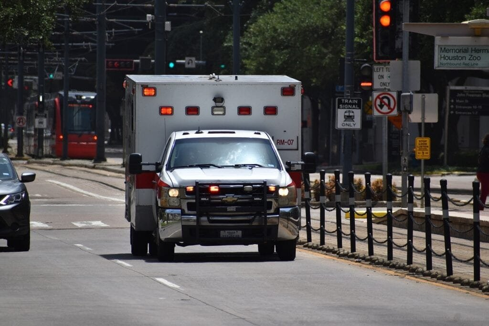
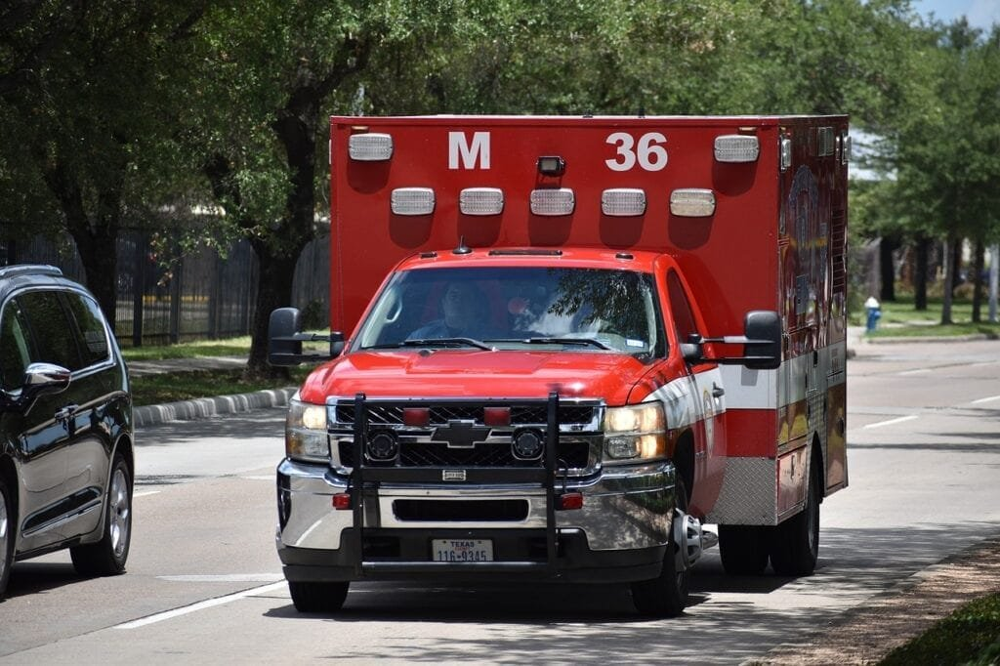

Volcanoes are fascinating natural phenomena that possess both beauty and danger. From the explosive eruptions of volcanoes in the Ring of Fire to the gradual eruptions of shield volcanoes in Hawaii, understanding these geological wonders is crucial for disaster preparedness. In this article, we will explore effective strategies for volcano disaster preparedness campaigns. By examining the different types of volcanoes, their geographic distribution, eruption causes, hazards, and benefits, we can better equip communities with the knowledge and resources needed to face the potential risks of volcanic activity.

This image is property of pixabay.com.

## Understanding Volcanic Hazards

Volcanic hazards pose significant risks to communities living near active volcanoes. It is crucial to understand the types of volcanic hazards that can occur to effectively prepare and mitigate their impact.

### Types of volcanic hazards

Volcanic hazards can include lava flows, pyroclastic flows, volcanic ashfall, volcanic gases, lahars (mudflows), and volcanic tsunamis. Lava flows are streams of molten rock that can destroy everything in their path. Pyroclastic flows are fast-moving, hot, and deadly clouds of gas, ash, and rock fragments. Volcanic ashfall can blanket large areas, causing respiratory issues and damaging infrastructure. Volcanic gases, such as sulfur dioxide, can be poisonous and cause respiratory problems. Lahars are fast-moving mudflows that can occur when volcanic ash mixes with water. Volcanic tsunamis can be generated by volcanic eruptions underwater.

### The role of geography in volcanic hazards

The geographic location of a volcano plays a significant role in determining the type and severity of volcanic hazards. Volcanoes located along plate boundaries, like those in the "Ring of Fire," are more prone to explosive eruptions, resulting in pyroclastic flows and volcanic ashfall. Shield volcanoes, like those in Hawaii, have slower eruptions, usually characterized by lava flows. Understanding the geographical context of a volcano can help predict its behavior and the specific hazards it may pose to nearby communities.

### Behavioral traits of different types of volcanoes

Different types of volcanoes exhibit distinct behavioral traits that can impact the severity and frequency of volcanic hazards. For example, stratovolcanoes are tall, steep-sided volcanoes that often produce explosive eruptions due to the high viscosity of their magma. In contrast, shield volcanoes have gently sloping sides and typically produce effusive eruptions characterized by the flow of lava. The behavior of a volcano can help scientists and communities understand the potential hazards it may pose and develop appropriate preparedness measures.

## Importance of Public Awareness on Volcanic Hazards

Public awareness plays a crucial role in mitigating the impact of volcanic hazards. Educating communities about the risks they face and providing them with information on preparedness measures significantly improves their ability to respond effectively to volcanic emergencies.

### Consequences of lack of public awareness

The lack of public awareness about volcanic hazards can have severe consequences. Without understanding the risks, communities may not take necessary precautions, resulting in increased vulnerability during volcanic eruptions. This can lead to a higher number of casualties and greater destruction of infrastructure. Lack of awareness can also hinder evacuation efforts, as people may not recognize the signs of an impending eruption or understand the evacuation procedures.

### Benefits of informed community

On the other hand, an informed community can respond more effectively to volcanic hazards. When people are aware of the potential risks, they can take proactive measures to protect themselves and their belongings. Informed communities are more likely to follow evacuation orders, reducing the risk of casualties. Additionally, public awareness fosters a sense of collective responsibility, encouraging individuals to support and help each other during emergencies. This can strengthen community resilience and aid in the recovery process.

### Case studies of effective public awareness campaigns

Several successful public awareness campaigns have significantly contributed to volcano disaster preparedness. One such example is the "Volcano Preparedness Week" conducted in the city of Portland, Oregon. This campaign involved a series of interactive workshops, town hall meetings, and educational programs for schools and community organizations. By engaging local authorities, educators, and community members, the campaign effectively raised awareness about volcanic hazards and equipped residents with the knowledge and tools to mitigate their impact. Evaluations of the campaign indicated increased public understanding and preparedness.

This image is property of pixabay.com.

## Developing an Effective Public Awareness Campaign

Developing an effective public awareness campaign requires careful planning and consideration of the target audience, message content and format, leveraging partnerships, and evaluating its success.

### Identifying target audiences

The first step in developing a public awareness campaign is identifying the target audiences. Different segments of the population may have varying levels of knowledge and understanding of volcanic hazards. By tailoring the campaign to specific groups, such as schools, businesses, or vulnerable communities, the message can be effectively communicated and tailored to their specific needs.

### Choosing message content and format

The content and format of the campaign's message play a critical role in engaging the audience and conveying important information. The message should be clear, concise, and easily understandable, using language that is accessible to all. Visual aids, such as infographics and videos, can effectively convey complex information in a digestible format. The campaign should also emphasize actionable steps that individuals can take to protect themselves and their communities.

### Leveraging partnerships for wider reach

To maximize the campaign's reach and impact, partnerships with various stakeholders are essential. Collaborating with local authorities, community organizations, and schools can help disseminate the campaign's message to a wider audience. Additionally, partnering with media outlets, such as newspapers, television, and radio stations, can provide opportunities for broader public exposure.

### Evaluating campaign's success

Regular evaluation of a public awareness campaign is crucial to assess its effectiveness and identify areas for improvement. Surveys, interviews, and feedback forms can collect data on the campaign's reach, audience comprehension, and behavior change. This information can then be used to refine the campaign's strategies and messages for future iterations.

## Using Traditional Media in Volcano Preparedness Campaigns

Traditional media, such as newspapers, radio broadcasts, and public forums, continue to play a vital role in volcano preparedness campaigns. These platforms allow for broader reach and provide an opportunity to engage with the community directly.

### Role of newspapers and radio broadcasts

Newspapers and radio broadcasts remain accessible sources of information for many communities, particularly those in remote areas with limited internet access. Publishing articles and features on volcanic hazards and preparedness in newspapers can inform the public and raise awareness. Radio broadcasts, including interviews with experts and public service announcements, can reach a wide audience, providing important information and promoting preparedness actions.

### Effective incorporation of television ads

Television ads have the advantage of combining visual and auditory elements to convey information effectively. By airing commercials on television networks, a campaign can reach a significant portion of the population, especially during prime time. Engaging and memorable advertisements can raise awareness and encourage viewers to take action in preparedness efforts.

### Public forums, workshops, and community meetings

In-person engagement through public forums, workshops, and community meetings can effectively educate and empower the public. These events provide opportunities for direct interaction and dialogue between experts and community members. They allow for questions to be answered, concerns to be addressed, and personalized guidance to be provided. Encouraging community participation fosters a sense of ownership and active involvement in preparedness efforts.

This image is property of pixabay.com.

## Leveraging Digital Media for Volcano Preparedness Campaigns

Digital media has revolutionized communication and provides unique opportunities for volcano preparedness campaigns. Leveraging various digital platforms can reach individuals of all ages and facilitate the dissemination of crucial information.

### Importance of social media

Social media platforms, such as Facebook, Twitter, and Instagram, have become powerful tools for raising public awareness. These platforms allow campaigns to reach a wide audience and facilitate engagement through interactive posts, infographics, videos, and live Q&A sessions. Social media can also foster a sense of community and encourage information sharing among users, amplifying the campaign's reach.

### Use of websites and mobile applications

Dedicated campaign websites and mobile applications can provide a centralized hub of information accessible to individuals at their convenience. These platforms can offer comprehensive resources, including educational materials, interactive maps, evacuation routes, emergency contacts, and real-time updates. Websites and mobile applications can be regularly updated and customized to address specific regional needs, enhancing the overall effectiveness of the campaign.

### Benefits of email and messaging alerts

Utilizing email and messaging alerts can directly reach individuals who have subscribed to receive updates from the campaign. These alerts can provide timely information about volcanic activity, evacuation notices, and preparedness tips. By using geolocation data, recipients can receive localized alerts, ensuring that they receive relevant information specific to their area.

## Educational Programs in Schools and Communities

Educational programs are a vital component of volcano preparedness campaigns, as they play a fundamental role in raising awareness and promoting understanding among both students and community members.

### Promoting understanding through curricula

Integrating volcano-related topics into school curricula can help students develop a deeper understanding of volcanic hazards and their impact. By incorporating age-appropriate lessons and activities, students can learn about the science behind volcanoes, their different types, and the potential risks they pose. This knowledge empowers students to make informed decisions and take appropriate actions in the face of volcanic emergencies.

### Extra-curricular volcano programs

Beyond formal classroom education, extra-curricular programs focused on volcanoes can provide additional opportunities for learning and engagement. Science clubs, environmental organizations, and community centers can organize workshops, field trips, and hands-on activities that explore the geological, ecological, and social aspects of volcanoes. These programs foster curiosity and encourage active participation in volcano preparedness.

### Engaging community members in educational initiatives

Volcano preparedness campaigns can engage community members through educational initiatives, such as public lectures and workshops. Inviting experts to share their knowledge and experiences can enhance public understanding of volcanic hazards and preparedness measures. These initiatives also create platforms for community members to share their own experiences and concerns, promoting a sense of collective resilience and collaboration.

## Engagement of Local Authorities in Volcano Preparedness

Local authorities play a crucial role in volcano preparedness by developing evacuation plans, organizing drills and simulations, and collaborating with national disaster management authorities.

### Developing evacuation plans

Local authorities are responsible for developing and regularly updating evacuation plans that outline procedures and routes for an orderly evacuation in the event of a volcanic eruption. These plans should consider factors such as population density, transportation infrastructure, and communication systems. Engaging with communities at risk and incorporating their input ensures that the plans are practical and meet the specific needs of the affected population.

### Organizing drills and simulations

Regular drills and simulations provide an opportunity for communities to practice their response to volcanic emergencies. Local authorities can coordinate these exercises, simulating various scenarios and evaluating the effectiveness of evacuation plans. Participation in drills helps familiarize community members with evacuation routes, assembly points, and communication protocols, increasing their preparedness and reducing panic during actual emergencies.

### Collaboration with national disaster management authorities

Collaboration between local authorities and national disaster management authorities is crucial for effective volcano preparedness. National authorities can provide resources, expertise, and coordination to support local efforts. They can assist in data collection, hazard mapping, and risk assessment, enabling more accurate and informed preparedness planning. Through this collaboration, local authorities can access training programs and funding opportunities to enhance their capacity to address volcanic hazards.

## Raising Funds for Volcano Preparedness Campaigns

Funding is essential for the successful implementation of volcano preparedness campaigns. Various sources, including government funding, private sponsorship and donations, and fundraising events, can be utilized to generate financial resources.

### Government funding

Government funding plays a significant role in supporting volcano preparedness campaigns. National and local governments can allocate funds specifically for public awareness initiatives, infrastructure development, and research on volcanic hazards. These funds can enable the hiring of experts, the production of educational materials, and the organization of workshops and community events. Advocacy for increased funding for volcano preparedness can help ensure the long-term sustainability of campaigns.

### Private sponsorship and donations

Private sponsorship and donations from businesses, organizations, and individuals can provide additional financial support for volcano preparedness campaigns. Corporate social responsibility initiatives can align with the goals and objectives of the campaign, fostering collaboration and mutual benefits. Individual contributions, both monetary and in-kind, can also make a significant impact. Fundraising drives, grant applications, and partnerships with philanthropic organizations are effective strategies for securing private support.

### Generating funds through events and merchandise

Organizing events and selling merchandise can generate funds while raising public awareness. Fundraising events, such as benefit concerts, charity runs, or art auctions, can bring communities together and encourage their participation. Merchandise, such as t-shirts, hats, or mugs, branded with campaign logos, can be sold to raise funds and serve as a reminder of the importance of volcano preparedness. These strategies not only generate financial resources but also create opportunities for engagement and community involvement.

## International Collaboration in Volcano Disaster Preparedness

International collaboration is essential for effective volcano disaster preparedness. Cooperation between countries and international organizations can improve data sharing, enhance scientific knowledge, and facilitate coordinated response efforts.

### Role of international organizations

International organizations, such as the United Nations International Strategy for Disaster Reduction (UNISDR) and the International Volcanic Health Hazard Network, play a crucial role in coordinating and supporting volcano disaster preparedness worldwide. These organizations provide valuable expertise, resources, and funding opportunities to countries and communities at risk. They facilitate knowledge exchange, capacity building, and best practices sharing to enhance global volcano preparedness efforts.

### Importance of data sharing between countries

Sharing data and scientific knowledge between countries is paramount for comprehensive volcano disaster preparedness. By collaborating and exchanging information on volcanic activity, eruption history, and hazard assessment techniques, countries can benefit from each other's experiences. This collective knowledge assists in the development of more accurate volcano monitoring systems, early warning systems, and hazard mapping. International cooperation ensures that no country is isolated in its preparedness efforts.

### Case studies of successful international cooperation

One notable example of successful international cooperation in volcano disaster preparedness is the establishment of the Volcano Observatories Best Practices database. This initiative, led by the World Organization of Volcano Observatories (WOVO), aims to standardize volcano monitoring and response protocols worldwide. Through the sharing of best practices, countries can learn from each other's successes and challenges, ultimately improving their preparedness and response capabilities. Similar collaborations exist at regional levels, such as the Caribbean Disaster Emergency Management Agency (CDEMA), which coordinates volcano preparedness efforts among Caribbean countries.

## Future Directions for Volcano Preparedness Campaigns

As technology advances and the world faces evolving challenges, volcano preparedness campaigns must adapt to address future needs effectively.

### Emerging technological tools for public education

Advancements in [technology offer new opportunities for public education in volcano](https://magmamatters.com/the-art-and-science-of-volcano-monitoring/ "The Art and Science of Volcano Monitoring") preparedness. Virtual reality and augmented reality can simulate volcanic eruptions, allowing individuals to experience the hazards and response actions firsthand. Interactive mobile applications can provide real-time updates, personalized risk assessments, and location-based alerts. These technological tools enhance engagement, improve understanding, and empower individuals to take proactive measures.

### Incorporation of climate change in volcanic risk assessment

The effects of climate change can influence volcanic activity and impact the severity of volcanic hazards. Rising global temperatures can initiate glacier melting, resulting in glacial outburst floods and lahars. Changes in precipitation patterns can affect the frequency and intensity of lahars and landslides. Future [volcano preparedness campaigns need to incorporate climate change](https://magmamatters.com/geothermal-energy-and-its-volcanic-origins/ "Geothermal Energy and Its Volcanic Origins") projections and adapt their strategies accordingly. This integration will ensure a comprehensive assessment of volcanic risks and enhance the resilience of communities in the face of changing climatic conditions.

### Challenges and opportunities for future campaigns

Future volcano preparedness campaigns face both challenges and opportunities. Increasing urbanization around volcanoes poses challenges in terms of evacuation planning and communication networks. Language and cultural barriers may hinder effective communication, particularly in multicultural communities. However, advancements in communication technology, increased public awareness of disaster preparedness, and the growing recognition of the importance of community engagement present opportunities for future campaigns. By addressing these challenges and capitalizing on opportunities, volcano preparedness campaigns can continue to evolve and improve, ultimately saving lives and protecting communities.

In conclusion, understanding volcanic hazards, raising public awareness, developing effective campaigns, engaging local authorities, securing funding, promoting education, fostering international collaboration, and embracing future directions are all crucial components of volcano preparedness campaigns. By implementing comprehensive strategies and involving all stakeholders, we can increase community resilience and minimize the impact of volcanic disasters.

