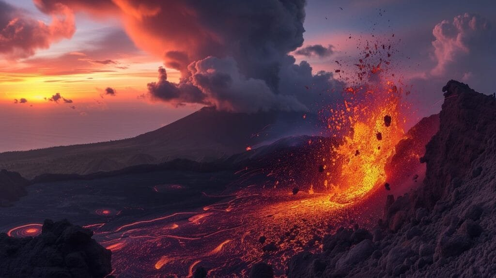
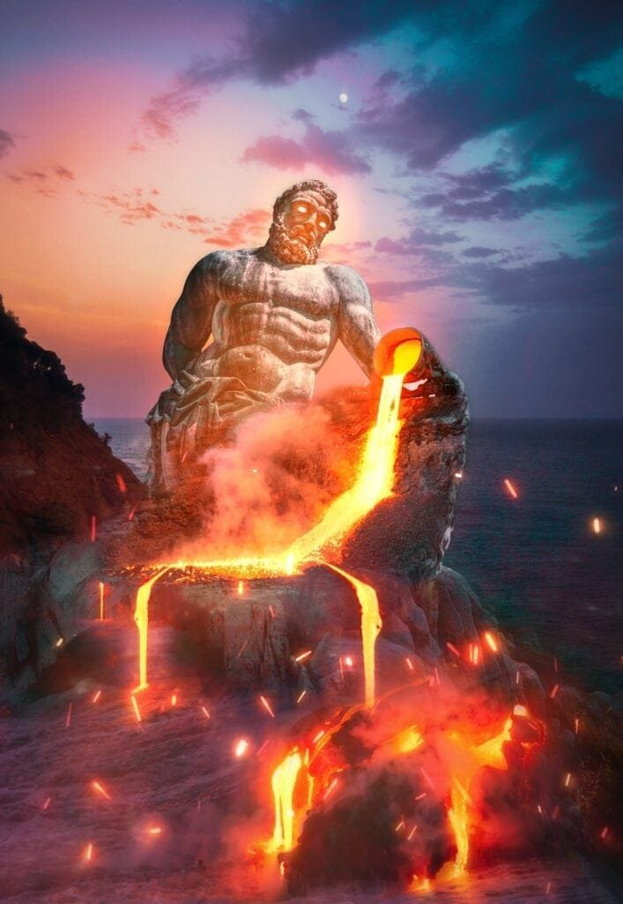

Have you ever wondered why there are different types of volcanic eruptions? Well, volcanic eruptions occur when molten rock, gases, and debris escape to the earth's surface, creating a spectacular display of power and fury. But not all eruptions are the same. The type of eruption depends on various factors such as the viscosity of the lava and the amount of gas content. Understanding these different types of volcanic eruptions is essential for predicting future volcanic activity and mitigating the risks it poses to surrounding communities. In this article, we will explore the fascinating world of volcanoes, ranging from the gradual eruptions of shield volcanoes in Hawaii to the explosive eruptions found along the Pacific Ring of Fire. Join us on this exploration of the diverse and fascinating types of volcanic eruptions.

This image is property of pixabay.com.

## Magma Composition and Eruption Types

Volcanic eruptions are a fascinating and powerful natural phenomenon, and understanding the different types of eruptions is crucial for predicting their behavior and mitigating potential hazards. The composition of magma, specifically the amount of silica it contains, plays a significant role in determining the viscosity and explosiveness of volcanic eruptions.

### Role of silica in determining magma viscosity

Silica, or silicon dioxide (SiO2), is a common component of magma and lava. It is a crucial factor in determining the viscosity of magma, which refers to its resistance to flow. Magma with high silica content tends to have high viscosity, meaning it is thick and sticky, and does not flow easily. On the other hand, magma with low silica content has low viscosity and flows more readily.

The presence of silica affects how easily gases can escape from the magma. High silica content creates a more viscous magma, which traps gases within it. This trapped gas can build up pressure until it is released explosively during an eruption. In contrast, low silica content allows gases to escape more easily, resulting in less explosive eruptions.

### How temperature and gaseous content contribute to eruption intensity

In addition to silica content, the temperature of magma and the amount of dissolved gases also play significant roles in determining the intensity of volcanic eruptions. Higher temperatures lead to lower viscosity, allowing magma to flow more easily and resulting in effusive eruptions. These eruptions are characterized by less explosive activity and the gentle release of lava.

The gaseous content of magma also influences eruption intensity. Magma contains dissolved gases such as water vapor, carbon dioxide, and sulfur dioxide. As magma rises to the surface, the decreasing pressure allows these gases to expand rapidly, leading to explosive eruptions. The higher the gas content, the more violent the eruption is likely to be.

### Correlation between magma type and eruption style

Different types of magma are associated with specific eruption styles. Basaltic magma, which has low silica content and is rich in iron and magnesium, is typically associated with effusive eruptions. These eruptions are relatively gentle, with lava flowing steadily out of the volcano.

In contrast, andesitic and rhyolitic magmas, which have higher silica content, are associated with explosive eruptions. These magmas have higher gas content and higher viscosity, leading to the build-up of pressure and violent eruptions characterized by ash clouds, pyroclastic flows, and volcanic bombs.

Understanding the correlation between magma type and eruption style is crucial for accurately predicting volcanic behavior and assessing potential hazards.

## Hawaiian Eruptions

Hawaiian eruptions are a specific type of volcanic activity characterized by unique features and patterns.

### Characteristics of Hawaiian eruptions

Hawaiian eruptions are typically characterized by effusive activity, with lava flowing gently and steadily from volcanoes. This type of eruption is associated with basaltic magma, which has low viscosity and low gas content. As a result, Hawaiian eruptions are relatively non-explosive and pose fewer immediate threats to surrounding communities.

The lava from Hawaiian eruptions tends to be hot and fluid, allowing it to travel significant distances before cooling and solidifying. This contributes to the [formation of shield volcanoes](https://magmamatters.com/understanding-volcanic-formation-a-comprehensive-guide/ "Understanding Volcanic Formation: A Comprehensive Guide"), which are broad, gently sloping volcanic mountains with wide basaltic lava flows.

### Notable Hawaiian eruptions in history

One of the most famous Hawaiian eruptions occurred in 1959 in the Kilauea volcano on the island of Hawaii. This eruption lasted for 36 years and resulted in the formation of a new landmass, expanding the size of the island. The eruption produced vast amounts of lava, which flowed into the ocean, creating new land and reshaping the coastline.

Another significant Hawaiian eruption took place in 2018, also in the Kilauea volcano. This eruption attracted worldwide attention as it produced dramatic lava fountains and fast-moving lava flows, causing destruction and displacing local residents.

### Geographical prevalence of Hawaiian volcanoes

Hawaiian volcanoes are primarily located in the Pacific Ocean, specifically in the Hawaiian Islands. These islands are a result of volcanic activity associated with the Pacific Plate moving over a stationary hotspot beneath the Earth's crust.

The most prominent Hawaiian volcanoes include Mauna Loa and Kilauea on the Big Island of Hawaii, as well as Mauna Kea, Haleakala, and the extinct volcanoes of Oahu, Molokai, Lanai, and Kauai. The unique geological conditions surrounding the Hawaiian Islands have contributed to their frequent and ongoing volcanic activity.

  

## Strombolian Eruptions

Strombolian eruptions are a distinctive type of volcanic activity characterized by their explosive bursts of lava and volcanic gases.

### Defining features of Strombolian eruptions

Strombolian eruptions are characterized by frequent, moderate explosive bursts of magma from a volcano's crater. These eruptions are associated with intermediate magmas, in terms of both silica content and gas content. The relatively high silica content gives the magma moderate viscosity, contributing to more explosive activity compared to Hawaiian eruptions.

During a Strombolian eruption, a volcano ejects incandescent volcanic bombs and cinders into the air. These materials are propelled by the force of expanding gas bubbles bursting at the volcano's surface. Strombolian eruptions can produce lava fountains, creating a spectacle of fireworks-like displays.

### Examples of Strombolian eruptions

Stromboli, an island located off the north coast of Sicily, is a classic example of a volcano renowned for its regular Strombolian eruptions. This volcano has been in a state of near-continuous eruption for thousands of years, earning it the nickname "Lighthouse of the Mediterranean."

Another notable example of Strombolian eruptions is the Masaya Volcano in Nicaragua. The volcano's Santiago Crater is famous for its active lava lake, with frequent explosive bursts that light up the night sky.

### Strombolian volcanoes around the world

Strombolian eruptions can occur at various volcanoes worldwide, each with its unique characteristics. In addition to Stromboli and Masaya, other volcanoes known for exhibiting Strombolian activity include Mount Erebus in Antarctica, Mount Yasur in Vanuatu, and Mount Etna in Italy.

These volcanic eruptions provide valuable insights into the behavior and dynamics of magmatic systems, ultimately contributing to our understanding of volcanic hazards and risk assessment.

## Vulcanian Eruptions

Vulcanian eruptions are explosive volcanic events known for their violent eruptions and ash-rich plumes.

### Identifying Vulcanian eruptions

Vulcanian eruptions are characterized by short but violent bursts of activity, where magma is fragmented and explosively expelled from the volcano. These eruptions are associated with highly viscous and gas-rich magma, typically intermediate in silica content. The high viscosity of the magma, combined with a high gas content, leads to the build-up of pressure, resulting in powerful eruptions.

During a Vulcanian eruption, a dense column of gas and ash shoots up into the atmosphere, often reaching several kilometers in height. The pyroclastic material expelled during these eruptions can travel long distances and pose a significant threat to both human settlements and aviation.

### Noteworthy Vulcanian eruptions

One of the most famous Vulcanian eruptions in history occurred at Mount St. Helens in the United States in 1980. This eruption, triggered by a massive landslide, resulted in the devastation of the surrounding area and the loss of several lives. The eruption column reached an altitude of over 24 kilometers, and the accompanying pyroclastic flows and lahars caused widespread destruction.

Another notable Vulcanian eruption took place at the Soufrière Hills volcano in Montserrat in 1995. This eruption led to the evacuation of the island's capital, Plymouth, as pyroclastic flows buried the town under layers of ash and debris.

### Locations of common Vulcanian activity

Vulcanian eruptions can occur at several volcanoes worldwide. In addition to Mount St. Helens and Soufrière Hills, other volcanoes associated with Vulcanian activity include Stromboli in Italy, Colima in Mexico, and Sakurajima in Japan.

By studying Vulcanian eruptions, volcanologists gain valuable insights into the behavior and dynamics of explosive volcanic systems, allowing for improved eruption forecasting and hazard mitigation.

This image is property of pixabay.com.

## Vesuvian or Plinian Eruptions

Vesuvian eruptions, also known as Plinian eruptions, are among the most violent and catastrophic volcanic events in history.

### Description of Vesuvian eruptions

Vesuvian eruptions are characterized by explosive activity, with the eruption column reaching immense heights into the atmosphere. These eruptions are associated with highly viscous and gas-rich magma, typically high in silica content. The high viscosity of the magma, along with the build-up of gas pressure, leads to powerful and sustained eruptions.

During a Vesuvian eruption, a dense column of gas, ash, and volcanic debris is ejected from the volcano, forming a distinctive mushroom-shaped cloud. The eruption column can reach altitudes of tens of kilometers, spreading volcanic ash and pyroclastic flows over vast areas.

### Famous Vesuvian eruptions and aftermath

One of the most infamous Vesuvian eruptions is the eruption of Mount Vesuvius in 79 AD. This eruption buried the ancient Roman cities of Pompeii and Herculaneum under layers of ash and volcanic debris, preserving them for centuries. The eruption of Mount Vesuvius was a catastrophic event, resulting in the loss of thousands of lives and the destruction of entire communities.

Another significant Vesuvian eruption occurred in 1631 at Mount Vesuvius. This eruption resulted in the loss of thousands of lives and caused widespread devastation across the surrounding region. The eruption column reached a height of 10 kilometers, and pyroclastic flows ravaged nearby towns and villages.

### Distribution of Vesuvian-type volcanoes

Volcanoes associated with Vesuvian eruptions, or Plinian eruptions, can be found in different parts of the world. Mount Vesuvius in Italy is the most famous example, located near the city of Naples. Other volcanoes known for producing Vesuvian-type eruptions include Mount Pinatubo in the Philippines, Krakatoa in Indonesia, and Mount Tambora in Indonesia.

These eruptions serve as reminders of the devastating power of volcanic activity and underscore the importance of monitoring and preparedness efforts in vulnerable areas.

## Phreatomagmatic Eruptions

Phreatomagmatic eruptions are volcanic events that occur when magma interacts with water.

### Mechanism of Phreatomagmatic eruptions

Phreatomagmatic eruptions result from the explosive interaction between magma and water. This can occur when magma comes into contact with underground water sources, surface water, or when it reaches the ocean. The heat of the magma causes the water to flash into steam rapidly, leading to a sudden increase in pressure and explosive eruptions.

During a phreatomagmatic eruption, pulverized magma, ash, and steam are propelled forcefully into the air. The expulsion of these materials creates volcanic ash clouds and generates ash-rich pyroclastic flows, which can be highly destructive and threaten nearby communities.

### Historic Phreatomagmatic eruption scenarios

One of the most notable examples of a phreatomagmatic eruption is the eruption of Krakatoa in 1883. This volcanic event resulted in a massive explosion that devastated nearby islands and created one of the most powerful volcanic eruptions in recorded history. The interaction between magma and seawater played a significant role in the eruption's intensity and destructive power.

Another historic phreatomagmatic eruption occurred at Mount Ontake in Japan in 2014. This eruption caught hikers by surprise, resulting in the loss of numerous lives. The interaction between the ascending magma and groundwater beneath the volcano contributed to the explosive nature of the eruption.

### Geographical occurrence of Phreatomagmatic eruptions

Phreatomagmatic eruptions can occur in various geographical settings where there is access to water sources. Volcanoes located near coastlines or in regions with abundant groundwater can be prone to phreatomagmatic activity.

Examples of volcanoes known for their phreatomagmatic eruptions include Krafla in Iceland, Taal Volcano in the Philippines, and Santorini in Greece. These eruptions highlight the dynamic interactions between magma and water, with profound implications for volcanic hazard assessment and mitigation.

This image is property of pixabay.com.

## Surtseyan Eruptions

Surtseyan eruptions are a specific type of volcanic activity that involves the explosive interaction between magma and seawater or shallow water.

### Identification of Surtseyan eruptions

Surtseyan eruptions are characterized by the explosive interaction between magma and water, specifically seawater or shallow water. These eruptions are typically associated with volcanic activity in or near the ocean. The violent fragmentation of magma and the rapid expansion of steam lead to the formation of ash-rich plumes and volcanic cones.

During a Surtseyan eruption, the explosive interaction between magma and water produces a distinct eruption column and a characteristic ash cloud. This type of eruption is often accompanied by the ejection of volcanic bombs and the formation of volcanic cones, creating new islands or enlarging existing ones.

### Recorded occurrences of Surtseyan eruptions

One of the most well-known examples of a Surtseyan eruption is the eruption that gave birth to the island of Surtsey off the coast of Iceland in 1963. This eruption occurred underwater, with the explosive interaction between lava and seawater forming a new volcanic island. The eruption lasted for several years, resulting in the creation of a unique ecosystem on the newly formed land.

Another notable Surtseyan eruption occurred off the coast of Tonga in the South Pacific in 2009. This eruption produced a temporary island called Hunga Tonga-Hunga Ha'apai, which lasted for several months before being eroded by the ocean.

### Typical locations of Surtseyan type volcanoes

Surtseyan eruptions are most commonly associated with volcanic activity in or near marine environments. Volcanoes located along coastlines or within the ocean itself are prone to this type of activity. Examples of volcanoes known for Surtseyan eruptions include Kick 'em Jenny in the Caribbean Sea, White Island in New Zealand, and Miyakejima in Japan.

The explosive nature of Surtseyan eruptions underscores the dynamic interaction between magma and water, with significant implications for the formation of new landmasses and the understanding of volcanic hazard potential.

## Lava Fountaining Eruptions

Lava fountaining eruptions are spectacular volcanic events characterized by the ejection of molten lava into the air.

### Defining Lava Fountaining eruptions

Lava fountaining eruptions occur when magma reaches the surface and is propelled forcefully into the air. During these eruptions, the ascending magma encounters a vent or conduit, leading to its explosive ejection. The magma is propelled as fiery fountains, with molten lava and volcanic gases shooting into the sky.

Lava fountains can take various forms and sizes, ranging from a few meters to tens or even hundreds of meters in height. These eruptions can produce lava flows, pyroclastic material, and volcanic ash clouds, depending on the composition and gas content of the magma.

### Examples of Lava Fountaining in the past

One of the most famous examples of a lava fountaining eruption is the 2018 eruption of Kilauea in Hawaii. During this eruption, lava fountains reached heights of over 60 meters, creating a captivating and mesmerizing display. Lava flows from this eruption destroyed numerous homes and reshaped the landscape of the surrounding area.

Another notable lava fountaining eruption occurred at Mount Nyiragongo in the Democratic Republic of Congo in 2002. This eruption resulted in a rapid and catastrophic flow of lava down the steep slopes of the volcano, devastating the nearby city of Goma and displacing thousands of people.

### Global presence of Lava Fountaining eruptions

Lava fountaining eruptions can occur at various volcanoes around the world. Volcanoes with regularly active lava lakes, such as Kilauea in Hawaii and Erta Ale in Ethiopia, are particularly prone to this type of eruption.

Other examples of volcanoes known for their lava fountaining eruptions include Mount Etna in Italy, Mount Stromboli in Italy, and Mount Yasur in Vanuatu. These eruptions provide valuable insights into the behavior of magmatic systems and their potential impacts on surrounding communities.

## Comparison of Different Eruption Styles

Understanding the different eruption styles associated with volcanic activity is crucial for assessing hazards and predicting volcanic behavior. Each eruption type poses unique challenges and potential risks.

### Comparative hazard levels across eruption types

The hazard levels associated with volcanic eruptions vary depending on eruption style. Effusive eruptions, such as Hawaiian eruptions, are generally less hazardous compared to explosive eruptions. The slow and steady flow of lava allows for better prediction and slower-moving lava flows pose less immediate danger to communities.

On the other hand, explosive eruptions, such as Vulcanian or Plinian eruptions, are particularly hazardous due to the rapid and violent release of volcanic products. Ash clouds, pyroclastic flows, and volcanic bombs can pose severe threats to human lives and infrastructure.

### Variances in eruption precursors

Different eruption styles exhibit varying precursors, providing valuable clues about volcanic activity before an eruption. Effusive eruptions, characterized by lower explosivity, may exhibit precursor signs such as ground deformation, increased gas emissions, and volcanic tremors. Monitoring these signals can help predict the onset of an effusive eruption and provide crucial time for evacuation and hazard mitigation.

In contrast, explosive eruptions have more immediate and volatile precursors. These include [increased seismic activity](https://magmamatters.com/the-art-and-science-of-volcano-monitoring/ "The Art and Science of Volcano Monitoring"), volcanic gas emissions, and changes in volcanic earthquakes. Monitoring these precursors is essential for issuing timely warnings and taking necessary precautions to protect communities at risk.

### Differences in resultant volcanic landforms

The different eruption styles associated with volcanic activity contribute to the formation of distinct volcanic landforms. Effusive eruptions, such as those seen in Hawaiian or shield volcanoes, result in the accumulation of fluid lava flows, forming broad, gently sloping volcanoes.

On the other hand, explosive eruptions, such as Vulcanian or Plinian eruptions, produce significant amounts of volcanic ash, pyroclastic flows, and explosive materials. These eruptions can lead to the formation of volcanic cones, calderas, and other topographical features shaped by explosive activity.

The study of resultant volcanic landforms aids in understanding past eruptions and can help predict and mitigate the potential hazards associated with different eruption styles.

## Volcanic Eruptions and Climate Impact

Volcanic eruptions have a significant impact on the atmosphere and can influence global climate patterns in both the short and long term.

### Effect of volcanic gases on the atmosphere

Volcanic eruptions release vast amounts of gases, including water vapor, carbon dioxide, sulfur dioxide, and various aerosols, into the atmosphere. These gases can have both direct and indirect effects on climate.

Carbon dioxide (CO2) is a greenhouse gas that contributes to global warming when released into the atmosphere. Volcanic eruptions can release large quantities of CO2, adding to the concentration of greenhouse gases in the atmosphere.

Sulfur dioxide (SO2) is another significant gas emitted during volcanic eruptions. When SO2 reacts with water vapor in the atmosphere, it forms sulfate aerosols, which can reflect sunlight back into space. This can result in a temporary cooling effect on the Earth's surface.

### Influence of large eruptions on global climate

Massive volcanic eruptions can have a substantial impact on the Earth's climate. When volcanic ash and gases are ejected into the stratosphere, they can remain suspended for months or even years. These aerosols can scatter and absorb sunlight, leading to a cooling effect on the planet's surface.

One of the most significant historical examples of such an impact is the eruption of Mount Tambora in 1815. The volcanic gases and ash injected into the atmosphere caused a decrease in global temperatures the following year, resulting in a period known as the "Year Without a Summer."

Large [volcanic eruptions can also release significant amounts of sulfur dioxide](https://magmamatters.com/the-environmental-impact-of-volcanic-eruptions-2/ "The Environmental Impact of Volcanic Eruptions"), which can react with water vapor to form sulfuric acid droplets. These droplets contribute to the formation of stratospheric aerosol layers, further impacting climate patterns.

### Historic examples of volcanoes altering weather patterns

Throughout history, volcanic eruptions have been known to alter weather patterns and have localized or even global impacts. The 1815 eruption of Mount Tambora in Indonesia resulted in a decrease in temperatures worldwide and disrupted weather patterns for several years.

Another example is the 1991 eruption of Mount Pinatubo in the Philippines. This eruption injected massive amounts of volcanic ash and gases into the atmosphere, leading to a temporary cooling effect on the Earth's surface. This cooling resulted in altered rainfall patterns and affected weather systems worldwide.

Understanding the relationship between volcanic activity and climate is essential for accurately predicting climate behavior and its potential impacts on ecosystems, agriculture, and human societies.

In conclusion, the study of different eruption styles provides valuable insights into the behavior of volcanoes and the potential hazards they pose. Factors such as magma composition, temperature, gaseous content, and the interaction with water all play significant roles in determining the intensity and nature of volcanic eruptions. By understanding these dynamics, scientists can better predict volcanic activity, leading to improved hazard assessment and mitigation strategies. The impact of volcanic eruptions on climate patterns further underscores the interconnectedness between Earth's [geology and the environment](https://magmamatters.com/geothermal-energy-and-its-volcanic-origins/ "Geothermal Energy and Its Volcanic Origins"), influencing global weather systems and long-term climate change. With continued research and monitoring efforts, we can deepen our understanding of volcanic eruptions and minimize the risks they pose to communities and the environment.

Related Posts: [Mitigating Risks: Forecasting Volcanic Activity in Prone Areas](https://magmamatters.com/mitigating-risks-forecasting-volcanic-activity-in-prone-areas/), [The Formation and Eruption Patterns of Volcanoes](https://magmamatters.com/the-formation-and-eruption-patterns-of-volcanoes-4/), [The Pyroclastic Phenomena of Pompeii: 7 Insights to Explore](https://magmamatters.com/the-pyroclastic-phenomena-of-pompeii-7-insights-to-explore/), [Tips for Capturing Volcano Pyroclastic Flow Photos](https://magmamatters.com/tips-for-capturing-volcano-pyroclastic-flow-photos/), [Understanding Volcanoes and Their Eruption Patterns](https://magmamatters.com/understanding-volcanoes-and-their-eruption-patterns/)
