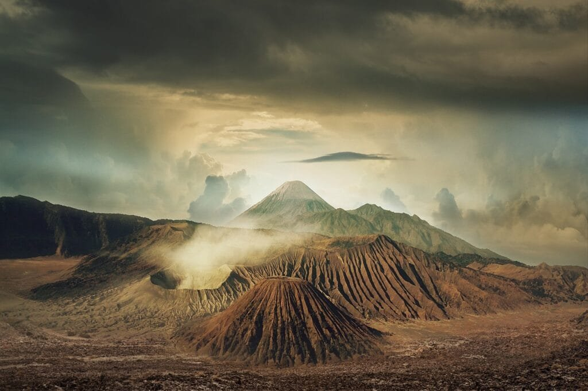

Have you ever wondered about the extraordinary impact that submarine volcanoes have on the fascinating world of deep sea creatures? These underwater volcanoes, hidden beneath the ocean's surface, are much more than just fiery eruptions beneath the waves. They play a crucial role in shaping the deep sea ecosystem, influencing the behavior, distribution, and even the survival of countless marine organisms. In this article, we will explore the captivating relationship between submarine volcanoes and the enigmatic creatures that call the deep sea their home. Prepare to be amazed as we dive into the unique and intricate world where molten lava meets the mysterious depths of the ocean.

This image is property of pixabay.com.

## Understanding Submarine Volcanoes

Submarine volcanoes, also known as underwater volcanoes, are volcanic vents that occur on the ocean floor. These unique geological features are formed when molten rock, gases, and debris are released from beneath the Earth's surface, resulting in eruptions of lava and ash. Unlike their terrestrial counterparts, submarine volcanoes are hidden beneath the vast oceans, making them difficult to study and observe directly. However, advancements in technology and scientific exploration have shed light on these mysterious and fascinating [natural phenomena](https://magmamatters.com/the-art-and-science-of-volcano-monitoring/ "The Art and Science of Volcano Monitoring").

### Definition and characteristics of submarine volcanoes

Submarine volcanoes are characterized by their location on the ocean floor. They can be found at various depths, ranging from shallow coastal regions to the deepest parts of the ocean. Just like terrestrial volcanoes, submarine volcanoes have a central vent, or crater, through which magma, gas, and other volcanic materials are ejected. However, due to the presence of water, the eruption dynamics of submarine volcanoes differ from those on land.

### How submarine volcanoes are formed

Submarine volcanoes are formed through a process similar to the formation of terrestrial volcanoes. They are primarily created at three distinct geological settings: plate boundaries, hotspots, and rift zones. At plate boundaries, where tectonic plates meet, the movement and interaction of these plates can result in the formation of submarine volcanoes. Hotspots, which are areas of intense volcanic activity beneath the Earth's crust, can give rise to submarine volcanoes as well. Lastly, in rift zones, where the Earth's tectonic plates are moving apart, magma is able to rise from the mantle and create new crust, leading to the formation of submarine volcanoes.

### Geographic distribution of submarine volcanoes

Submarine volcanoes are found across the globe, occurring in different regions and oceans. One notable area of submarine volcanic activity is the "Ring of Fire," which encircles the Pacific Ocean. This area is known for its high concentration of volcanoes, both above and below the ocean surface. Other regions with significant submarine volcanic activity include the Mid-Atlantic Ridge, the East Pacific Rise, and the Kermadec-Tonga Arc. The distribution of submarine volcanoes is closely tied to tectonic plate boundaries and the underlying geological processes occurring in these areas.

## Notable Submarine Volcano Eruptions

Submarine volcanoes have a long history of eruptions, some of which have had significant impacts on marine habitats and life. Understanding these historical eruptions is crucial in comprehending the influence of submarine volcanoes on the marine ecosystem.

### Historical eruptions of submarine volcanoes

Throughout history, there have been numerous documented eruptions of submarine volcanoes. These eruptions can range from small, localized events to large-scale catastrophic events. One notable eruption occurred in 1993 at the submarine volcano Kick 'em Jenny, located in the Caribbean Sea. This eruption caused a series of earthquakes and the release of large amounts of gas, posing a threat to nearby islands and marine life. Another notable eruption occurred in 2012 when the Havre volcano, located near New Zealand, erupted and created one of the largest underwater volcanic structures ever observed.

### Impacts of these eruptions on marine habitats and life

The eruptions of submarine volcanoes can have significant impacts on marine habitats and life. The sudden release of volcanic gases, fluids, and volcanic material can lead to the formation of volcanic plumes and turbidity currents, which can harm or destroy nearby marine ecosystems. These eruptions can also result in the deposition of volcanic ash on the ocean surface, affecting sunlight penetration and disrupting photosynthesis. Furthermore, the release of toxic gases, such as hydrogen sulfide, can have detrimental effects on marine organisms, leading to the loss of biodiversity in affected areas.

This image is property of pixabay.com.

## Geology of Submarine Volcanoes

To understand the behavior and characteristics of submarine volcanoes, it is important to explore their geological aspects, including their structural and chemical composition, as well as their interactions with tectonic plates and other geological features.

### Structural and chemical composition of submarine volcanoes

Submarine volcanoes exhibit a wide range of structural and chemical compositions. They can take the form of volcanic cones, calderas, or even fissure eruptions. The composition of magma within submarine volcanoes can vary, resulting in different eruptive styles ranging from effusive lava flows to explosive eruptions producing volcanic ash and pyroclastic materials. The chemical composition of submarine volcanic rocks also provides valuable information about the geological processes occurring beneath the ocean floor.

### Interactions with tectonic plates and other geological features

Submarine volcanoes are intrinsically linked to tectonic plate movements and other geological features. At plate boundaries, interactions between different tectonic plates can cause submarine volcanoes to form. These interactions can result in magma generation and the formation of volcanic arcs or chains. Additionally, the presence of other geological features, such as seamounts and hydrothermal vents, can further influence the behavior and characteristics of submarine volcanoes. The study of these interactions provides insights into the geological processes occurring in the oceanic crust.

## Ecosystems Around Submarine Volcanoes

Submarine volcanoes support unique ecosystems that have adapted to the extreme conditions of high temperature, high sulfur environments. These ecosystems are of great interest to scientists as they provide insights into the adaptability and resilience of marine life.

### Microbial communities and chemosynthesis

One of the most fascinating aspects of submarine volcanoes is the existence of microbial communities that thrive in these extreme environments. These communities are able to survive and even flourish due to chemosynthesis, a process by which they derive energy from chemicals, such as sulfur compounds, rather than sunlight. This provides a valuable energy source for other organisms further up the food chain.

### Adaptations of sea life to high-temperature, high-sulfur environments

Sea life around submarine volcanoes has evolved unique adaptations to survive in the harsh conditions of high temperature and high sulfur environments. Some organisms have developed heat-resistant proteins and enzymes that enable them to withstand the extreme temperatures. Others have adapted to utilize sulfur compounds as an energy source, making them well-suited to the chemosynthetic communities found near submarine volcanoes.

### Biodiversity around submarine volcanoes

Despite the challenging conditions, submarine volcanoes support a surprising amount of biodiversity. The rocky structures created by volcanic activity provide a habitat for a wide range of organisms, including corals, sponges, and various fish species. Some of these species are found exclusively near submarine volcanoes and have adapted to the unique environmental conditions present in these areas. The study of biodiversity around submarine volcanoes provides invaluable insights into the resilience and adaptive capabilities of marine organisms.

This image is property of pixabay.com.

## Impact of Submarine Volcanic Activities on Deep Sea Creatures

The eruption of submarine volcanoes can have significant impacts on deep-sea creatures, both during and after the volcanic events. Understanding these impacts is crucial in assessing the overall influence of submarine volcanoes on the deep-sea ecosystem.

### Effects of volcano eruption on deep-sea fauna

Volcanic eruptions can directly affect deep-sea fauna in several ways. The sudden release of volcanic gases and fluids can cause physical damage to organisms, leading to injury or death. The deposition of volcanic ash and pyroclastic materials can smother benthic organisms and disrupt their feeding and reproductive activities. Furthermore, the alteration in water chemistry caused by volcanic activity can have adverse effects on the physiological processes of deep-sea fauna.

### Alterations in the food chain and the marine life habitat

The eruption of submarine volcanoes can lead to significant alterations in the food chain and the overall marine life habitat. The deposition of volcanic ash and the release of toxic gases can disrupt primary productivity and reduce the availability of food for deep-sea organisms. This can have cascading effects throughout the food chain, impacting higher trophic levels and potentially causing population declines or even extinctions.

### Survival strategies of deep-sea creatures during and after a volcanic event

Deep-sea creatures have evolved various survival strategies to cope with the challenges posed by submarine volcanic activities. Some species may have the ability to sense changes in their environment and exhibit behavioral responses to avoid direct harm. Others may possess physiological adaptations that allow them to withstand the altered conditions caused by volcanic eruptions. Additionally, recolonization of affected areas by deep-sea organisms can occur through larval dispersal or migration from nearby unaffected habitats.

## Threats Posed by Submarine Volcanoes to Endangered Marine Species

Submarine volcanoes can pose significant threats to endangered marine species residing in their vicinity. Understanding these threats is essential in formulating conservation strategies to protect these vulnerable species.

### Endangered marine species residing near submarine volcanoes

Certain endangered marine species, such as marine mammals, sea turtles, and certain fish species, inhabit regions near submarine volcanoes. These areas often provide important habitats for breeding, feeding, or migration activities. The presence of submarine volcanoes in these habitats can increase the vulnerability of these species to various threats, including the physical impacts of volcanic eruptions, the alteration of food sources, and the disruption of essential reproductive processes.

### How volcanic activities exacerbate threats to these species

Volcanic activities can exacerbate threats to endangered marine species in several ways. Eruptions can lead to direct physical harm, including injury or death due to the release of volcanic debris or the alteration of water chemistry. The disturbance or destruction of critical habitats can disrupt important life processes, such as breeding and feeding activities. The alteration of food sources and the reduction of primary productivity can result in food shortages, reducing the viability of populations and exacerbating the challenges faced by endangered species.

## Scientific Exploration and Studies on Submarine Volcanoes

Scientific exploration and studies on submarine volcanoes are crucial in expanding our knowledge and understanding of these unique geological features. Various techniques and technologies have been employed to investigate submarine volcanoes, leading to significant discoveries and advancements in the field.

### Techniques and technologies used in research

Scientists utilize a range of techniques and technologies to investigate submarine volcanoes. These include remotely operated vehicles (ROVs) and autonomous underwater vehicles (AUVs), which allow for the exploration of the ocean floor and the collection of samples. Seismic surveys and bathymetric mapping help to identify and characterize submarine volcanic structures. Chemical and physical analyses of volcanic rocks and fluids provide insight into the [nature and behavior of submarine volcanoes](https://magmamatters.com/the-environmental-impact-of-volcanic-eruptions-2/ "The Environmental Impact of Volcanic Eruptions").

### Latest discoveries related to submarine volcanoes and marine life

Recent scientific studies have yielded exciting discoveries related to submarine volcanoes and their impact on marine life. Researchers have identified previously unknown species that thrive in the extreme conditions of underwater volcanic vents. They have also uncovered the intricate connections between microbial communities and chemosynthesis, highlighting the importance of these communities in deep-sea ecosystems. Furthermore, advancements in imaging and sensing technologies have allowed for more detailed observations of submarine volcanic eruptions and their effects on the surrounding environment.

## Lessons from the Past: Case Studies of Submarine Volcanic Events

Analyzing past submarine volcanic events provides valuable insights into the behavior and impacts of these phenomena. Case studies allow scientists to better understand the processes and interactions associated with submarine volcanoes.

### Analysis of particular submarine volcanic events

Case studies of specific submarine volcanic events offer a detailed examination of the characteristics and impacts of these events. By analyzing the geological, chemical, and biological data from these events, scientists can gain a better understanding of the eruption dynamics and the responses of marine organisms. Case studies also provide insights into the long-term effects of submarine volcanic events and the subsequent recovery of affected ecosystems.

### Impacts on deep-sea creatures from these events

The analysis of past submarine volcanic events highlights the varied impacts on deep-sea creatures. These impacts can include habitat destruction, changes in species composition, and alterations in ecological dynamics. Understanding these effects is crucial in assessing the resilience of deep-sea ecosystems and developing strategies for the conservation and management of marine resources.

## Adapting to life around Submarine Volcanoes: Biological and Ecological Impacts

Submarine volcanoes contribute to the biological and ecological impacts in the surrounding marine environment. The unique conditions created by these volcanic features have prompted adaptations and triggered ecological processes that shape the marine ecosystem.

### Physical adaptations of species living near submarine volcanoes

The extreme conditions surrounding submarine volcanoes have led to physical adaptations in species living in these environments. Some organisms have developed heat-resistant proteins and protective mechanisms to cope with the high temperatures. Others have evolved specialized respiratory systems to survive in sulfide-rich waters. These physical adaptations enable species to thrive in an otherwise inhospitable environment.

### Ecological significances of volcanic activities in marine environments

The volcanic activities of [submarine volcanoes have ecological significances in marine environments](https://magmamatters.com/geothermal-energy-and-its-volcanic-origins/ "Geothermal Energy and Its Volcanic Origins"). The release of nutrients and minerals during eruptions can enhance primary productivity in the surrounding waters, supporting the growth of phytoplankton and the subsequent food web. The chemosynthetic communities associated with submarine volcanoes provide habitats and serve as a food source for a variety of organisms. The ecological processes influenced by submarine volcanoes contribute to the overall biodiversity and functioning of marine ecosystems.

## The Future of Submarine Volcanoes and their Effects on Marine Life

As our understanding of submarine volcanoes deepens, it becomes important to consider the future implications of these geological features on marine life. Predicting future submarine volcanic events and their potential impacts is crucial for effective conservation and management strategies.

### Predicting future submarine volcanic events

Advancements in monitoring techniques and technologies have improved our ability to predict submarine volcanic events. Seismic monitoring networks, satellite observations, and other remote sensing methods provide valuable data for detecting changes in volcanic activity. By analyzing patterns and trends, scientists can develop models and forecasts to predict future eruptions, enabling timely warnings and precautionary measures.

### Potential impacts on deep-sea creatures and their habitats

The potential impacts of future submarine volcanic events on deep-sea creatures and their habitats are diverse and significant. Eruptions can result in physical damage, habitat destruction, changes in water chemistry, and alterations in food availability. These impacts can disrupt ecological processes and have cascading effects throughout the marine ecosystem. Understanding these potential impacts is essential for implementing targeted conservation and management strategies.

### What further research is necessary for understanding and mitigating impact

Further research is necessary to enhance our understanding of submarine volcanoes and their effects on marine life. Continued exploration of underwater volcanic vents and ecosystems will provide valuable insights into the mechanisms of adaptation and resilience exhibited by deep-sea organisms. Robust monitoring networks and research collaborations are crucial for gathering long-term data on volcanic activity and its impacts on the marine environment. Additionally, interdisciplinary studies that integrate geological, chemical, and biological research will help to unravel the complex interactions between submarine volcanoes and marine life.

In conclusion, submarine volcanoes play a significant role in shaping marine ecosystems and influencing deep-sea creatures. These unique geological features, formed through complex processes, offer valuable insights into the adaptability, resilience, and dynamics of marine life. Understanding the formation, characteristics, and impacts of submarine volcanoes is essential for predicting future volcanic events and implementing effective conservation and management strategies. Through ongoing scientific exploration and research, we continue to unravel the mysteries of submarine volcanoes and deepen our knowledge of their effects on marine ecosystems.

