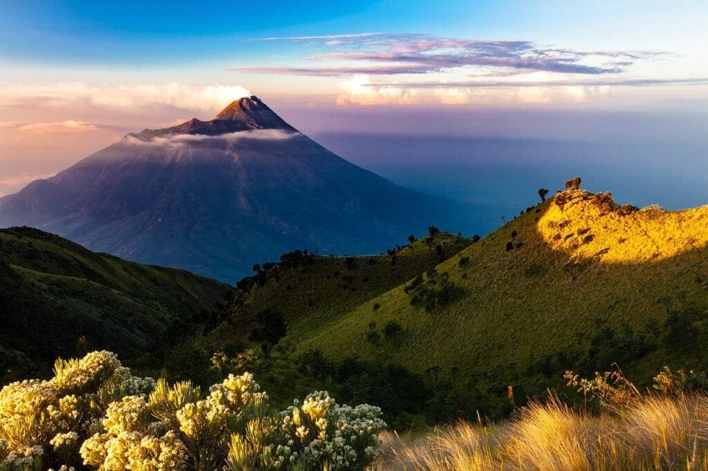
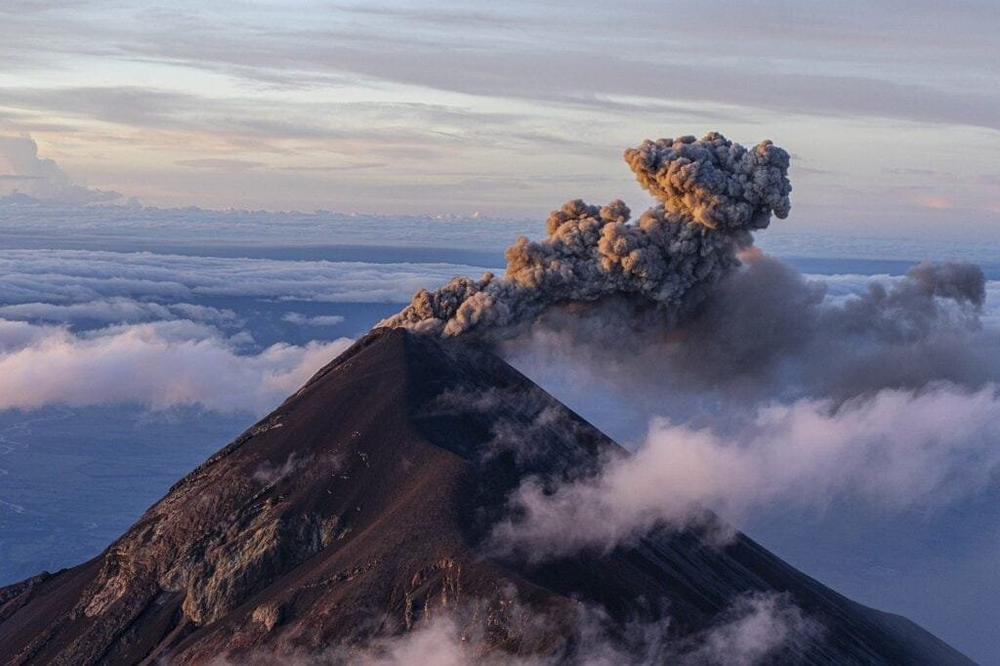

Let's take a journey into the fascinating world of volcanic eruptions from a geological perspective. Volcanoes, those majestic yet powerful natural wonders, are formed when molten rock, gases, and debris burst forth onto the earth's surface. They can be found at plate boundaries, hotspots, and rift zones, each location resulting in different eruption patterns. The "Ring of Fire," encircling the Pacific Ocean, is known for its volatile volcanoes sitting atop tectonic plate intersections. On the other hand, shield volcanoes in Hawaii form gradually over deep underground hot spots, erupting less explosively. By understanding these geological marvels, we can predict future activities and mitigate risks for the communities living nearby. So, get ready to dive into the mesmerizing world of volcanoes and explore the wonders they hold across different geological ages.

This image is property of pixabay.com.

## Volcano Formation

Volcanoes are formed through a fascinating process that involves the eruption of molten rock, gases, and debris from the Earth's interior to its surface. This process, known as volcanic activity, is driven by various geological factors.

The role of molten rock, also known as magma, is crucial in the formation of volcanoes. Magma is formed deep within the Earth's mantle, where immense heat and pressure cause rocks to melt. As magma rises towards the surface, it creates pathways through the Earth's crust, eventually reaching the surface and erupting as lava.

Gases, such as water vapor, carbon dioxide, and sulfur dioxide, also play a significant role in the formation of volcanoes. These gases are released during volcanic eruptions and can cause explosive eruptions when trapped within the magma. The pressure from these gases can lead to violent eruptions, ejecting ash, lava, and other volcanic debris into the atmosphere.

Additionally, the debris produced during volcanic eruptions, including pyroclastic material and volcanic ash, can contribute to the formation of volcanoes. These materials are ejected from the volcano and can accumulate around the vent, gradually building up the volcanic cone over time.

The formation of volcanoes is closely linked to tectonic plate activity. Volcanoes often occur along plate boundaries, where tectonic plates interact with each other. Subduction zones, where one plate is forced beneath another, are particularly prone to volcanic activity. The friction and heat generated during subduction allow magma to rise to the surface, resulting in the formation of volcanoes.

## Geographical Distribution of Volcanoes

Volcanoes are geographically distributed across the world, and their locations are influenced by several factors. One significant factor is volcanic hotspots, which are areas where volcanic activity is concentrated.

Volcanic hotspots are believed to be caused by mantle plumes, columns of hot and upwelling mantle material. These plumes create a localized area of intense volcanic activity. Examples of volcanic hotspots include the Hawaiian Islands, Yellowstone National Park, and the Galapagos Islands. These areas experience frequent volcanic eruptions and are characterized by the presence of numerous volcanoes.

The interaction of tectonic plates also plays a crucial role in the geographical distribution of volcanoes. Along plate boundaries, where plates are either converging or diverging, volcanoes are more likely to occur. For example, the "Ring of Fire" is a region encircling the Pacific Ocean known for its high volcanic activity. This ring is formed by the collision and subduction of several tectonic plates, leading to the formation of numerous volcanoes.

<iframe width="560" height="315" src="https://www.youtube.com/embed/zFIWWM0Iv-U" frameborder="0" allow="accelerometer; autoplay; encrypted-media; gyroscope; picture-in-picture" allowfullscreen></iframe>

  

## Types of Volcanoes

Volcanoes can be classified into different types based on their characteristics and eruption styles. These classifications are determined by factors such as the composition of the magma, eruption style, and the shape of the volcanic cone.

[Shield volcanoes are a type of](https://magmamatters.com/understanding-volcanic-formation-a-comprehensive-guide/ "Understanding Volcanic Formation: A Comprehensive Guide") volcano characterized by their broad, gently sloping sides and low profile. They are formed by the eruption of low-viscosity basaltic lava, resulting in the gradual accumulation of numerous lava flows. Shield volcanoes are typically associated with hotspots and are known for their effusive eruptions, where lava flows freely without significant explosive activity.

Composite or stratovolcanoes, on the other hand, are tall, steep-sided volcanoes that are composed of alternating layers of lava, ash, and other volcanic materials. These volcanoes are formed by the eruption of viscous andesitic or rhyolitic magma, which can lead to explosive eruptions. Composite volcanoes are commonly found at subduction zones, where oceanic plates are forced beneath continental plates.

[Cinder cone](https://magmamatters.com/the-birth-of-new-land-understanding-cinder-cones/) volcanoes are another type of volcano, and they are characterized by their steep slopes and small size. These volcanoes are formed by the accumulation of volcanic cinders and other pyroclastic material ejected during explosive eruptions. Cinder cone volcanoes typically have a single vent and can form quickly during short-lived eruptions.

## Volcanic Eruptions

Volcanic eruptions can occur in different ways, and their classification is based on various criteria, including the style of eruption, the viscosity of the magma, and the presence of gases.

The most common types of volcanic eruptions include effusive, explosive, and phreatomagmatic eruptions. Effusive eruptions are characterized by the slow and steady flow of lava, resulting in the gradual buildup of volcanic cones, as seen in shield volcanoes. Explosive eruptions, on the other hand, involve the rapid ejection of ash, lava fragments, and gases into the atmosphere. These eruptions can be highly destructive and are typically associated with composite or stratovolcanoes.

Phreatomagmatic eruptions occur when water comes into contact with magma, leading to a violent explosion. These eruptions can produce large quantities of volcanic ash and can be triggered by the interaction of rising magma with groundwater or bodies of water.

Several factors influence the patterns and intensity of volcanic eruptions. The composition and viscosity of the magma play a significant role in determining the explosiveness of an eruption. High-viscosity magma, such as andesitic or rhyolitic magma, tends to trap gases and generate more explosive eruptions. In contrast, low-viscosity magma, such as basaltic magma, allows gases to escape more easily, resulting in relatively less explosive eruptions.

This image is property of pixabay.com.

## Volcanic Hazards

Volcanic eruptions can pose various hazards to both human populations and the environment. Some of the most significant hazards include volcanic gases, ash fall, pyroclastic flows, and lahars.

Volcanic gases emitted during eruptions can have harmful effects on human health. These gases, such as [sulfur dioxide and carbon](https://magmamatters.com/the-art-and-science-of-volcano-monitoring/ "The Art and Science of Volcano Monitoring") dioxide, can cause respiratory problems and even death in high concentrations. Additionally, volcanic gases can have long-term impacts on climate and air quality.

Ash fall is another hazard associated with volcanic eruptions. Volcanic ash is made up of tiny rock fragments and glass particles that are ejected into the atmosphere during eruptions. These particles can be carried long distances by wind, causing respiratory issues, damaging crops, and disrupting transportation systems. Ash fall can also lead to the collapse of structures due to the added weight and the potential for roof collapse.

Pyroclastic flows are fast-moving currents of hot gas, ash, and volcanic debris that flow down the slopes of a volcano during explosive eruptions. These flows can reach speeds of hundreds of kilometers per hour and can be extremely destructive. Pyroclastic flows can incinerate everything in their path, including buildings and vegetation, and pose a significant threat to human life.

Lahars, also known as volcanic mudflows, are a mix of volcanic debris and water that flow rapidly down the slopes of a volcano. Lahars can be triggered by heavy rainfall or the rapid melting of snow and ice on a volcano's slopes during an eruption. These flows can travel long distances, burying entire communities and causing extensive damage to infrastructure.

## Benefits of Volcanic Eruptions

While volcanic eruptions can be devastating, they also have several benefits that contribute to the Earth's geological processes and ecosystems.

One significant benefit is the enrichment of soil fertility. Volcanic ash and lava are rich in minerals and nutrients, such as potassium, phosphorus, and calcium, that are essential for plant growth. When deposited on land, volcanic materials can greatly improve soil fertility, leading to increased agricultural productivity.

Volcanic eruptions also contribute to the creation of new land and islands. Lava flows can extend the coastline and form new land masses, expanding the available habitat for various plant and animal species. The formation of new islands provides unique environments for colonization and can contribute to the diversity of flora and fauna in a region.

Additionally, [volcanic eruptions play a role in global climatic changes](https://magmamatters.com/geothermal-energy-and-its-volcanic-origins/ "Geothermal Energy and Its Volcanic Origins"). Large volcanic eruptions can inject significant amounts of ash and gases into the atmosphere, which can block sunlight and lead to a temporary cooling effect on the Earth's surface. This cooling effect can affect global climate patterns and has been observed in the past, notably following major volcanic eruptions.

This image is property of pixabay.com.

## Impact on Biodiversity

Volcanic eruptions have both short-term and long-term impacts on biodiversity, affecting local flora and fauna as well as marine life.

In the immediate aftermath of an eruption, the intense heat, ash fall, and toxic gases can cause extensive damage to the surrounding ecosystem. Vegetation can be completely incinerated, and animals may perish from the direct effects of the eruption.

However, volcanic regions also serve as unique habitats for various species. Over time, plants and animals adapt to the harsh conditions of volcanic landscapes and establish thriving communities. Some plant species, for example, have evolved to tolerate high levels of volcanic gases and can colonize newly formed volcanic terrains.

Volcanic activity can also have indirect impacts on marine life. During explosive eruptions, volcanic ash and other materials can be ejected into the ocean, affecting marine ecosystems. Ash fall can disrupt the food chain, leading to changes in the distribution and abundance of marine species. Additionally, the release of gases during volcanic eruptions can alter water chemistry, potentially harming or benefiting certain marine organisms.

## Archaeological Evidence of Ancient Volcanic Eruptions

Throughout history, numerous volcanic eruptions have left their mark on human civilizations. Archaeological findings provide valuable insights into the impacts of ancient eruptions on human societies.

One notable example of an ancient volcanic eruption is the eruption of Mount Vesuvius in 79 AD, which buried the Roman cities of Pompeii and Herculaneum. The preserved remains of these cities offer a unique glimpse into daily life during the Roman Empire and provide valuable information about the eruption itself.

Archaeologists have also discovered evidence of volcanic eruptions in other parts of the world. The Minoan eruption of Santorini in the Aegean Sea around 1600 BC is believed to have had significant impacts on ancient civilizations in the Mediterranean region. The eruption caused widespread destruction and likely influenced the decline of the Minoan civilization on the island of Crete.

Such archaeological evidence helps us understand the long-term impacts of volcanic eruptions on human societies, including the displacement of populations, changes in cultural practices, and the development of resilience in the face of natural disasters.

## Volcanic Activity Monitoring and Prediction

Monitoring and predicting volcanic activity are crucial for informing decision-making and mitigating risks associated with eruptions. Various techniques and technologies are used to track volcanic activity and provide early warning systems.

One prominent method used in monitoring volcanic activity is seismic monitoring. Seismometers detect the seismic waves generated by volcanic processes, such as the movement of magma and the opening of fractures. By analyzing these seismic signals, scientists can gain insight into the behavior of a volcano and identify potential signs of an impending eruption.

Other monitoring techniques include the measurement of volcanic gas emissions, ground deformation, and thermal imaging. Monitoring changes in gas emissions can provide information about the movement of magma and the potential for an eruption. Ground deformation, measured using GPS and other instruments, can indicate the swelling or subsidence of a volcano's surface, which may be associated with magma movement. Thermal imaging allows scientists to detect changes in temperature, which can help identify areas of heightened volcanic activity.

Despite advancements in monitoring technology, accurately predicting volcanic eruptions remains challenging. The complex nature of volcanic processes and the wide range of factors involved make it difficult to forecast eruptions with precision. However, ongoing research and technological developments continue to improve our understanding of volcanoes and enhance our ability to predict future volcanic activity.

## Community Preparation and Disaster Mitigation

Preparing communities near volcanic regions for potential eruptions and establishing effective disaster mitigation strategies are essential for minimizing the impact of volcanic hazards.

Education plays a critical role in raising awareness and helping communities understand the risks associated with living near volcanoes. Public education campaigns can provide information on evacuation procedures, emergency preparedness, and the potential hazards of volcanic eruptions. By empowering individuals with knowledge, communities can make informed decisions and take appropriate actions in the event of an eruption.

Effective planning for disaster response is crucial for reducing the potential loss of life and property. Developing emergency response plans, coordinating with local authorities, and conducting drills and exercises can ensure that communities are prepared to respond swiftly and effectively in the face of a volcanic eruption. This includes establishing communication networks, identifying evacuation routes, and providing shelters for affected populations.

In the aftermath of a volcanic eruption, long-term recovery and rebuilding efforts are necessary to support affected communities. This involves providing assistance for displaced individuals, restoring infrastructure, and implementing measures to mitigate future risks. Community resilience and support systems are vital for the long-term recovery and rebuilding of communities impacted by volcanic disasters.

In conclusion, understanding volcanic eruptions and their various aspects is essential for predicting and mitigating the risks associated with these natural phenomena. The formation of volcanoes, the geographical distribution of volcanic activity, and the classification of volcanoes provide valuable insights into the behavior and impacts of volcanoes. The hazards and benefits of volcanic eruptions, the impact on biodiversity and human societies, as well as the techniques for monitoring and predicting volcanic activity, offer a comprehensive understanding of these geological processes. Finally, community preparation and disaster mitigation strategies are crucial for ensuring the safety and resilience of communities living near active volcanoes. By studying and comprehending volcanoes, we can better protect ourselves and our environment from the forces of nature.

