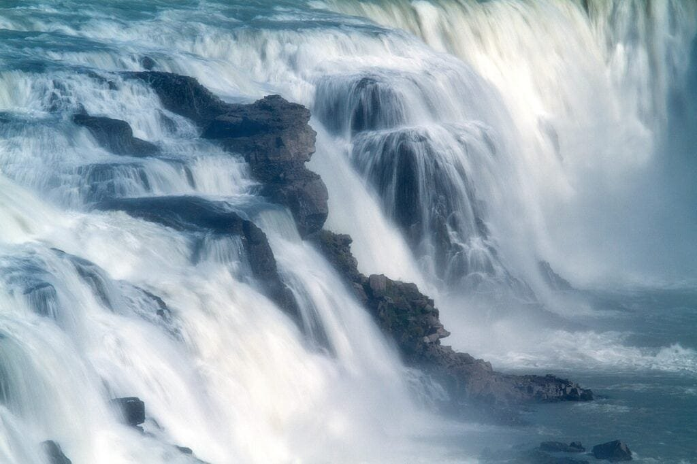

In the fascinating realm of geology, the formation of Hawaii's volcanic islands stands as a captivating topic. Volcanoes, born when molten rock and debris burst through the earth's crust, create a spectacle of lava and ash. But what sets these islands apart is their unique formation over a hot spot deep underground, allowing for the gradual rise of shield volcanoes. In this article, you will explore the three best explanations for the formation of Hawaii's volcanic islands, uncovering the secrets behind their gradual emergence, distinct eruption patterns, and the benefits and hazards they bring to the surrounding communities. Prepare to embark on a captivating journey through the intricate world of volcanic geology.

This image is property of pixabay.com.

## Understanding Volcanoes

[Volcanoes are fascinating geological](https://magmamatters.com/geothermal-energy-and-its-volcanic-origins/ "Geothermal Energy and Its Volcanic Origins") features that have captured human curiosity for centuries. These majestic formations, with their ability to spew out molten lava and ash, have both awe-inspiring beauty and destructive power. In this article, we will delve into the world of volcanoes, exploring their definitions, how they are formed, different types of volcanoes, and their eruption patterns.

### Definition of a volcano

A volcano is a vent in the Earth's crust through which molten rock, gases, and debris are ejected onto the surface. This eruption of material can take the form of lava flows, volcanic ash, and pyroclastic flows, depending on the characteristics of the volcano. Volcanoes can vary greatly in size, shape, and eruptive style, offering a wide range of volcanic landscapes around the world.

### How volcanoes are formed

Volcanoes are formed through various geological processes. One common way is at plate boundaries, where tectonic plates either converge, diverge, or slide past each other. At convergent plate boundaries, where two plates collide, one plate may be forced beneath the other in a process called subduction. The subducting plate can carry water and other volatile materials into the mantle, causing a decrease in melting temperature and the formation of magma. This magma then rises to the surface, leading to volcanic eruptions.

### Different types of volcanoes

There are several types of volcanoes, each with its own unique characteristics. Shield volcanoes, like those found in Hawaii, are formed by the eruption of fluid basaltic lava that spreads out and builds a broad, gently sloping cone-shaped mountain. They are typically not very explosive and have a gentle, effusive eruption style.

Another type is the stratovolcano, also known as a composite volcano. These are steep-sided mountains formed by alternating layers of ash, lava, and other volcanic materials. Stratovolcanoes are characterized by explosive eruptions that can release large volumes of ash and pyroclastic flows.

[Cinder cones](https://magmamatters.com/the-birth-of-new-land-understanding-cinder-cones/) are another type of volcano, commonly found in volcanic fields. These are small, steep-sided volcanoes formed by the eruption of pyroclastic material, such as volcanic bombs and cinders, which are ejected into the air and fall back around the vent, building up a cone-shaped structure.

## Tectonic Plates and their Role in Volcano Formation

### Understanding tectonic plates

To understand how volcanoes are formed, we must first understand tectonic plates. The Earth's lithosphere is divided into several large and small pieces called tectonic plates. These plates float on the semi-fluid asthenosphere below, and their interactions play a significant role in shaping the Earth's surface.

### Movement of tectonic plates

Tectonic plates are constantly moving, albeit very slowly. There are three main types of plate boundaries: convergent, divergent, and transform boundaries. At convergent boundaries, two plates move towards each other, causing subduction or collision. At divergent boundaries, plates move apart, creating space for magma to rise and form new oceanic crust. Transform boundaries occur when two plates slide past each other horizontally.

### Role of tectonic plates in volcano formation

Volcanoes are primarily formed at plate boundaries. At convergent plate boundaries, where one plate is forced beneath another, the subduction of oceanic crust can lead to the formation of volcanic arcs, like the "Ring of Fire" encircling the Pacific Ocean. These areas are highly prone to volcanic activity due to the release of water and other volatile substances from the subducting plate, creating conditions for magma generation.

At divergent plate boundaries, such as oceanic ridges, magma from the mantle rises to fill the gap created by the plates moving apart. This leads to the formation of underwater volcanoes and contributes to the expansion of the ocean floor.

Transform plate boundaries, although not as commonly associated with volcanic activity as convergent or divergent boundaries, can still experience localized volcanism. These volcanoes are often associated with tectonic features such as rift zones, where the crust is being pulled apart but not enough to create a full divergent boundary.

This image is property of pixabay.com.

## The Concept of Hot Spots in Volcano Formation

### Definition of hot spots

In addition to plate boundaries, another mechanism that plays a crucial role in volcano formation is the presence of hot spots. Hot spots are fixed locations beneath the Earth's crust where high-temperature plumes of mantle material rise towards the surface. These areas can generate significant heat and magma, leading to volcanic eruptions.

### How hot spots are formed and their characteristics

Hot spots are formed when plumes of abnormally hot rock rise from the deep mantle towards the Earth's surface. The exact cause of hot spots is still under debate among geoscientists, but one prominent theory suggests that they are related to the breakup of supercontinents or the convective movement of the mantle.

Hot spots exhibit distinct characteristics that set them apart from other volcanic regions. For example, they often exhibit long-lived volcanic activity, with eruptions spanning millions of years. Hot spots can also produce a trail of extinct volcanoes, forming a linear volcanic chain. This is evident in the case of the Hawaiian-Emperor seamount chain, where the Hawaiian Islands mark the active end of the chain, while the older, submerged Emperor seamounts extend towards the northwest.

### How hot spots trigger volcanic activities

Hot spots trigger volcanic activity by providing a continuous source of magma. As the plume rises towards the surface, it melts the surrounding rock, forming magma chambers. When the pressure from the accumulated magma becomes too great, it eventually breaches the Earth's surface, resulting in volcanic eruptions. This eruption activity can continue for an extended period due to the steady supply of magma from the deep mantle.

## Volcano Eruption Patterns

### Different patterns of volcanic eruptions

Volcanic eruptions can exhibit various patterns depending on the nature of the volcano and the conditions surrounding the eruption. Some volcanic eruptions are effusive, characterized by the steady flow of relatively low-viscosity lava. These eruptions typically occur at shield volcanoes and produce lava flows that can travel long distances.

On the other end of the spectrum are explosive eruptions, which occur when highly viscous magma, rich in gas content, is forcefully expelled from the volcano. These eruptions can result in plumes of ash, pyroclastic flows, and even volcanic bombs being ejected into the air.

### Contributing factors to eruption patterns

Several factors contribute to the eruption patterns of volcanoes. The viscosity of the magma plays a crucial role, with lower-viscosity magmas leading to more effusive eruptions and higher-viscosity magmas causing more explosive eruptions. The gas content in the magma also plays a significant role, as dissolved gases can become trapped and build up pressure within the volcano, leading to explosive eruptions when released.

The temperature of the magma, the presence of water or other volatiles, and the shape of the volcanic vent can all influence eruption patterns. Additionally, the system of magma chambers beneath the volcano, as well as the structural features of the volcano itself, can affect the behavior of volcanic eruptions.

### Significance of eruption patterns in predicting volcanic activities

Understanding the eruption patterns of volcanoes is vital for predicting and preparing for future volcanic activities. By studying past eruptions and the associated eruption patterns, volcanologists can gain insights into the behavior and characteristics of specific volcanoes. This knowledge can then be used to develop predictive models and monitoring systems to detect early signs of volcanic unrest, helping to mitigate risks and protect surrounding communities.

This image is property of pixabay.com.

## Geographic Distribution of Volcanoes

### Global spread of volcanoes

Volcanoes are not evenly distributed across the Earth's surface but are concentrated in specific regions. The majority of volcanic activity occurs along the boundaries of tectonic plates, such as the "Ring of Fire" that encircles the Pacific Ocean. This region is highly [seismically active](https://magmamatters.com/the-art-and-science-of-volcano-monitoring/ "The Art and Science of Volcano Monitoring") and is home to numerous subduction zones, volcanic arcs, and volcanic island chains.

However, volcanoes can also be found within continental interiors, such as the Yellowstone Caldera in the United States. These intra-plate volcanoes form due to localized mantle hot spots or crustal extension.

### Factors influencing the distribution of volcanoes

Several factors influence the distribution of volcanoes. First and foremost is the presence of tectonic plate boundaries, which provide the necessary conditions for volcanic activity. Additionally, the geological history and composition of regions can play a role. For example, areas with a history of past volcanic activity may be more prone to future eruptions.

Climate can also impact volcanic activity. Volcanoes near glacial regions can experience increased volcanic activity due to the melting of glaciers, which releases pressure on underlying magma chambers. Furthermore, the presence of water, such as in oceanic settings, can significantly influence the chemistry and behavior of volcanic eruptions.

### How distribution affects the impact of volcanic eruptions

The distribution of volcanoes has a profound impact on the risk and impact of volcanic eruptions. Regions with frequent volcanic activity, such as the "Ring of Fire," are often densely populated, exposing large populations to potential hazards. Additionally, the type of volcanic eruptions prevalent in an area can also influence the potential risks. Explosive eruptions, for example, can produce massive ash clouds that pose respiratory and travel hazards, as well as impacts on agriculture and infrastructure.

Understanding the distribution of [volcanoes allows for better assessment of volcanic hazards](https://magmamatters.com/the-environmental-impact-of-volcanic-eruptions-2/ "The Environmental Impact of Volcanic Eruptions") and the development of appropriate mitigation measures. By studying the unique characteristics and behavior of volcanoes in different regions, scientists can provide valuable information for governments and communities to develop disaster preparedness plans and make informed decisions regarding infrastructure development and land use.

## Hawaii's Geological Setting

### The location and geology of Hawaii

Hawaii is a group of islands located in the Central Pacific, approximately 2,400 miles southwest of California. The archipelago consists of eight main islands, with the Big Island of Hawaii being the largest and youngest. These islands sit atop a massive volcanic mountain chain that extends over 1,500 miles from the Big Island to the northwest.

The geology of Hawaii is unique due to its formation over a hot spot in the Earth's mantle. As the Pacific tectonic plate moves in a northwesterly direction, the Hawaiian hot spot has remained stationary beneath the oceanic crust, resulting in the formation of a linear volcanic chain.

### Hawaii's unique geological features

Hawaii's volcanic islands boast several unique geological features. One notable characteristic is the shield shape of the islands, which is the result of countless layers of fluid, low-viscosity basaltic lava flows. These flows create a broad, gently sloping cone-shaped mountain, giving the islands their distinctive appearance.

The islands also feature dormant and extinct volcanoes, with Mauna Kea and Mauna Loa on the Big Island being the most prominent examples. These shield volcanoes rise majestically above sea level, with Mauna Kea reaching a height of 13,796 feet above sea level, making it the highest point in the entire Pacific Ocean.

### Tectonic activity in Hawaii

As mentioned earlier, Hawaii's geological setting is closely tied to volcanic activity resulting from a hot spot in the Earth's mantle. The Hawaiian hot spot has remained relatively stationary beneath the Pacific plate, resulting in the continuous formation of new volcanic islands. As the Pacific plate moves in a northwesterly direction, new volcanoes are formed, while older ones become extinct and erode over time.

In addition to the primary hot spot responsible for the creation of the Hawaiian Islands, there are secondary hot spots that have formed seamounts and small islands to the northwest. These secondary hot spots, such as the Louisville and Emperor hot spots, also contribute to the volcanic activity present in the region.

## Formation of Hawaii's Volcanic Islands

### Role of hot spots in Hawaii's volcanic island formation

The formation of Hawaii's volcanic islands can be attributed to the presence of a hot spot in the Earth's mantle. As the Pacific plate moves over the stationary hot spot, magma rises to the surface, resulting in the formation of new volcanoes. Over time, as the plate moves, the older volcanoes become dormant or extinct, while new ones form at the leading edge of the hot spot.

The continuous eruption of molten lava creates layers of basaltic rocks, which gradually build up into large shield volcanoes. These shield volcanoes grow over thousands, if not millions, of years, creating the unique landscape of the Hawaiian Islands.

### Stages involved in the formation of Hawaii's volcanic islands

The formation of Hawaii's volcanic islands can be broadly divided into several stages. The first stage involves the initial eruption of basaltic lava from the ocean floor. As the lava accumulates and solidifies, it forms an underwater mountain known as a seamount.

Over time, as plate motion continues, the seamount is carried away from the hot spot. The second stage, known as the "shield stage," begins when the seamount reaches the ocean's surface, forming an island. This island is characterized by the eruption of fluid basaltic lava flows, which gradually build up the gentle slopes of the shield volcano.

The third stage, known as the "post-shield stage," occurs when the island moves away from the hot spot. During this stage, the volcanic activity decreases, and the shield volcano becomes dormant. Various erosion processes, such as wave action and weathering, shape the island over time, creating unique landforms and features.

### Factors contributing to the uniqueness of Hawaii's volcanic islands

Several factors contribute to the uniqueness of Hawaii's volcanic islands. Firstly, the prolonged volcanic activity resulting from the stationary hot spot has allowed for the continuous growth and expansion of the islands. This process has led to the creation of large shield volcanoes with gentle slopes, giving Hawaii its iconic landscape.

The composition of the lava erupted in Hawaii is also a contributing factor. The basaltic nature of the lava results in relatively low-viscosity flows, allowing the lava to travel long distances before solidifying. This fluidity contributes to the formation of expansive lava fields and the gradual growth of the shield volcanoes.

Furthermore, the geographic isolation of Hawaii, located in the midst of the vast Pacific Ocean, has allowed for the development of unique ecosystems and species found nowhere else on Earth. The isolation has provided a natural laboratory for evolutionary processes, resulting in a high level of endemism in Hawaii's flora and fauna.

## Volcanic Eruptions in Hawaii

### Overview of Hawaii's volcanic eruptions history

Hawaii has a long history of volcanic activity, with the islands themselves being the result of ongoing eruptions over millions of years. Volcanic eruptions in Hawaii are primarily associated with the shield volcanoes that form the islands. The most active volcano in Hawaii is Kilauea, located on the Big Island.

Kilauea has been erupting continuously since 1983, making it one of the longest-lasting eruptions in recorded history. The eruption has produced vast lava flows, covering large areas of land and extending into the ocean. Other active volcanoes in Hawaii include Mauna Loa, which last erupted in 1984, and Hualalai, which last erupted in 1801.

### Effects of Hawaii's volcanic eruptions on the Island's geography

The volcanic eruptions in Hawaii have had a profound impact on the geography of the islands. The continuous eruption of lava flows from the shield volcanoes has resulted in the gradual expansion of the land area. This has led to the creation of new landforms, including vast lava fields, lava tubes, and lava deltas where the lava enters the ocean.

However, volcanic eruptions in Hawaii can also cause significant destruction and alteration of existing landforms. The eruptions can lead to the destruction of infrastructure, including roads, homes, and utility lines. Lava flows can engulf entire communities, forcing residents to evacuate and leaving them without homes.

### Mitigation measures adopted in Hawaii's volcanic eruptions

Hawaii's long history of volcanic activity has prompted the development of effective mitigation measures to minimize the impacts of volcanic eruptions. The Hawaiian Volcano Observatory (HVO), operated by the United States Geological Survey (USGS), plays a critical role in monitoring and studying volcanic activity in Hawaii.

The HVO utilizes a network of seismometers, gas analyzers, and tiltmeters to continuously monitor the volcanoes in Hawaii. This real-time monitoring allows scientists to detect changes in volcanic activity and issue timely warnings to the public. These warnings enable residents and visitors to evacuate areas at risk, ensuring their safety.

Additionally, emergency management agencies in Hawaii work alongside the HVO to develop evacuation plans and emergency response procedures. These plans aim to mitigate the impacts of volcanic eruptions by ensuring the smooth evacuation of affected populations, providing temporary shelters, and coordinating response efforts with various agencies and organizations.

## Hazards and Benefits of Volcanic Eruptions

### Risks associated with volcanic eruptions

Volcanic eruptions pose various risks to both human populations and the environment. One of the most immediate and hazardous effects is the release of pyroclastic flows, which are fast-moving currents of hot gas, rock fragments, and ash. These flows can travel at high speeds, obliterating everything in their path and causing severe burns and respiratory problems.

Volcanic ash, another hazardous product of eruptions, can cause widespread disruption to air travel, as it can damage jet engines, impair visibility, and settle on runways. Ashfall can also impact agriculture by covering crops and making them unusable, as well as contaminate water sources, posing risks to human and animal health.

The release of volcanic gases during eruptions can have detrimental effects on human health. These gases, such as [sulfur dioxide and hydrogen sulfide](https://magmamatters.com/understanding-volcanic-formation-a-comprehensive-guide/ "Understanding Volcanic Formation: A Comprehensive Guide"), can cause respiratory problems, eye irritation, and even be fatal in high concentrations. Furthermore, the deposition of these gases can lead to acid rain, negatively impacting surrounding ecosystems and water bodies.

### Positive effects of volcanic eruptions on the environment

While volcanic eruptions entail risks and hazards, they also have positive effects on the environment. Volcanic ash and lava contain various essential nutrients, such as phosphorus, potassium, and trace elements, which are beneficial for plant growth. Over time, the deposits from volcanic eruptions can contribute to the fertility of the soil, supporting agriculture and the establishment of new ecosystems.

Volcanic eruptions can also lead to the formation of new land, expanding the shoreline and creating fresh habitats for a diverse range of species. In Hawaii, for example, lava flows into the ocean have resulted in the formation of new landmasses, providing nesting grounds for seabirds and creating habitat for marine life.

Additionally, volcanic eruptions can contribute to the formation of geothermal energy resources. The heat generated by the magma beneath the Earth's surface can be harnessed and utilized as a renewable source of clean energy. This geothermal energy can be used for electricity generation, heating, and other industrial purposes.

### Examples from Hawaii's volcanic activities

Hawaii serves as an excellent example of the hazards and benefits of volcanic eruptions. While the eruptions have caused significant destruction and displacement of communities, they have also played a vital role in shaping the unique ecosystems and landscapes found in the islands.

The lava flows from the shield volcanoes have created extensive lava fields, providing new land for the expansion of habitats and supporting unique plant and animal species found only in Hawaii. These eruptions have exposed previously barren lands to volcanic ash, enriching the soil and making it favorable for agriculture.

Furthermore, the geothermal activity associated with volcanic eruptions in Hawaii has been harnessed to generate electricity. Geothermal power plants tap into the natural heat of the Earth, using it to power turbines and produce clean, renewable electricity, reducing reliance on fossil fuels.

## Future Prospects and Predictions for Hawaii's Volcanoes

### How scientists monitor and predict volcanic activities in Hawaii

Scientists monitor volcanic activity in Hawaii using a variety of techniques and tools. The Hawaiian Volcano Observatory, as mentioned earlier, plays a crucial role in monitoring and studying the volcanoes in the region. The observatory utilizes real-time seismic data to track earthquake activity, which can provide insights into magma movement and potential volcanic eruptions.

Gas emissions from volcanoes are also closely monitored. Volcanic gases, such as sulfur dioxide, can indicate the presence of magma at shallow depths and provide early warning signs of eruption potential. These emissions are continuously monitored by ground-based sensors and satellite imagery, helping scientists detect changes in volcanic activity.

In addition to seismic and gas monitoring, geodetic measurements are used to track ground deformation caused by magma movement. Tiltmeters and GPS instruments are employed to measure the subtle changes in the shape and elevation of the volcanic edifices, providing valuable information about the accumulation and migration of magma.

### Likely future behaviors of Hawaii's volcanoes based on past behaviors

Based on past behaviors, scientists predict that Hawaii's volcanoes will continue to experience periodic eruptions. The shield volcanoes, such as Kilauea and Mauna Loa, are likely to undergo future eruptions due to their relatively short repose periods and ongoing magma supply.

However, the exact timing and magnitude of future eruptions are difficult to predict with certainty. Volcanic systems are complex, and their behavior is influenced by a multitude of factors, including magma composition, gas content, and the structural integrity of the volcanoes. Nevertheless, the wealth of monitoring data and scientific knowledge accumulated over the years provides a foundation for making informed predictions about volcanic activity in Hawaii.

### The role of technology in studying volcanoes in Hawaii

Technology plays a critical role in the study of volcanoes in Hawaii, enabling scientists to gather data, monitor volcanic activity, and make informed predictions. Remote sensing techniques, such as satellite imagery and thermal cameras, provide a birds-eye view of volcanic landscapes and allow scientists to detect changes in thermal patterns and gas emissions.

Ground-based instruments, such as seismometers, gas analyzers, and GPS instruments, provide valuable real-time data on volcanic activity. These instruments are designed to withstand the harsh environments near active volcanoes and continuously transmit data to monitoring centers.

One emerging technology that holds promise in volcano monitoring is the use of drones. Drones equipped with specialized sensors can provide detailed imagery of volcanic vents, collect samples of volcanic gases, and even fly into volcanic plumes to gather data. These drones offer a safer and more cost-effective alternative to traditional methods of data collection in hazardous volcanic environments.

In conclusion, studying and understanding volcanoes is essential for predicting and mitigating the risks associated with volcanic eruptions. By exploring the formation of volcanoes, the role of tectonic plates and hot spots, eruption patterns, geographic distribution, and the specific case of Hawaii's volcanic islands, we gain valuable insights into the behavior and characteristics of these natural phenomena. Through ongoing research, monitoring, and advances in technology, scientists can continue to unravel the complexities of volcanoes and improve our ability to protect communities, harness the benefits, and coexist with these awe-inspiring geological features.

