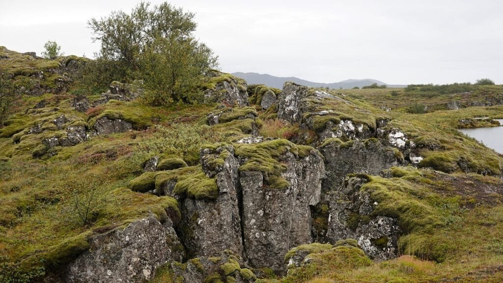

Volcanoes, those magnificent geological wonders, are not simply a random occurrence. They have a method to their madness, if you will. Volcanoes form when molten rock, gases, and debris reach the Earth's surface, resulting in magnificent volcanic eruptions. However, not all volcanoes are created equal. Some are found at plate boundaries, while others emerge at hotspots beneath the Earth's crust or in rift zones where tectonic plates pull apart. For instance, the notorious "Ring of Fire" around the Pacific Ocean is dotted with volcanoes due to the convergence of tectonic plates. On the other hand, Hawaii's shield volcanoes develop gradually over deep underground hotspots. By understanding why these hotspots lead to volcano formation, we can gain insights into [types of volcanoes](https://magmamatters.com/understanding-volcanic-formation-a-comprehensive-guide/ "Understanding Volcanic Formation: A Comprehensive Guide"), their distribution, eruption causes, hazards, and even the benefits they provide. This knowledge becomes invaluable in predicting future volcanic activity and mitigating risks to the surrounding communities. So, let’s embark on a captivating exploration of the formation of volcanoes at hotspots!

  

## Understanding Geological Hotspots

Geological hotspots are areas beneath the Earth's surface where there is a concentrated heat source. These hotspots are associated with a rising plume of magma from deep within the mantle. The intense heat causes the melting of overlying rocks, leading to the formation of volcanoes. Unlike traditional plate boundaries, hotspots are fixed and do not move with the shifting tectonic plates. This unique characteristic makes them an intriguing subject of study for geologists.

Hotspots can be found in various locations around the world. They are not restricted to plate boundaries like other volcanoes. Instead, they can occur in the middle of tectonic plates. One well-known example of a hotspot is the Hawaiian Islands. The islands were formed as the Pacific Plate moved over a hotspot, resulting in a chain of volcanic islands. Other notable hotspots include Yellowstone National Park, the Galapagos Islands, and Iceland. These locations provide valuable opportunities for scientists to examine the processes involved in hotspot volcano formation.

The relationship between hotspots and tectonic plates is complex but interconnected. Hotspots are often associated with regions of weakness in the Earth's crust, such as cracks or fractures. When a tectonic plate moves over a hotspot, the magma from the hotspot rises through these cracks and reaches the surface. This results in the formation of a volcano. It is important to note that hotspots can persist for millions of years, even as tectonic plates continue to move. This creates a trail of volcanic activity, with the oldest volcanoes located further from the hotspot and the youngest ones directly above it.

## Why Hotspots Lead to Volcano Formation

The formation of volcanoes at hotspots is a result of several key factors. First and foremost is the role of magma. Magma is molten rock that is generated deep within the Earth's mantle. At hotspots, the intense heat causes the melting of overlying rocks, creating a reservoir of magma beneath the Earth's crust. As the magma rises towards the surface, it can either erupt as lava or accumulate underground, leading to the formation of a volcano.

Another important factor in hotspot volcano formation is the breaking apart of the Earth's crust. The intense heat from the hotspot weakens the crust, leading to cracks and fractures. These openings allow the magma to reach the surface and form a volcano. Over time, as the tectonic plate moves, the volcano is carried away from the hotspot, and a new volcano forms in its place.

The pressure build-up underneath hotspots is also a significant factor in volcanic eruptions. As magma accumulates beneath the Earth's crust, it exerts pressure on the surrounding rocks. Eventually, the pressure becomes too great, leading to an explosive eruption. This pressure release can result in the eruption of lava, ash, and gases from the volcano. The frequency and intensity of volcanic eruptions at hotspots can vary significantly, depending on the geological conditions and the characteristics of the magma.

This image is property of pixabay.com.

## Identifying Volcanoes Formed at Hotspots

Volcanoes formed at hotspots display certain characteristics that distinguish them from other types of volcanoes. One notable characteristic is their shield shape. Shield volcanoes are broad and low, resembling a warrior's shield laid flat on the ground. This shape is a result of the low viscosity of the magma erupted from hotspots. The lava flows easily and spreads out in thin sheets, forming a gently sloping volcano.

Another characteristic of hotspot volcanoes is their relatively calm and non-explosive eruptions. Unlike stratovolcanoes, which can have violent eruptions, hotspot volcanoes usually experience effusive eruptions. This type of eruption occurs when the pressure within the volcano is low, allowing the magma to flow gently onto the surface. The lava emitted during these eruptions is usually basaltic in nature, which has a low viscosity and allows for easy flow.

There are numerous examples of hotspot volcanoes around the world. The Hawaiian Islands provide a prime example of this volcanic activity. The islands were formed as the Pacific Plate moved over the Hawaiian hotspot, resulting in a chain of volcanoes stretching across the Pacific Ocean. The most active volcano in Hawaii is Kilauea, which has been continuously erupting since 1983. Other examples of hotspot volcanoes include the Galapagos Islands, which were formed as the Nazca Plate moved over the Galapagos hotspot, and Yellowstone National Park, which sits atop the Yellowstone hotspot.

## Types of Volcanic Eruptions at Hotspots

The types of volcanic eruptions at hotspots are influenced by various factors. One significant factor is the composition and viscosity of the magma. Magma with low viscosity, such as basaltic magma, tends to have effusive eruptions, where the lava flows easily onto the surface. This type of eruption typically occurs at hotspot volcanoes.

On the other hand, magma with high viscosity, such as rhyolitic magma, leads to explosive eruptions. These eruptions occur when the pressure within the volcano becomes too great, causing the magma to fragment into small particles and explode from the volcano with great force. However, explosive eruptions are less common at hotspot volcanoes due to the low silica content and low viscosity of the magma.

Volcanic eruptions at hotspots can also vary in terms of volume. Some eruptions may be relatively small and localized, while others can be massive and have far-reaching effects. The volume of the eruption depends on the amount of magma that reaches the surface and the rate at which it is erupted.

Overall, hotspot volcanoes are known for their more gentle and non-explosive eruptions compared to other types of volcanoes. This makes them unique and fascinating areas of study for volcanologists.

This image is property of pixabay.com.

## Volcanic Activity Phases at Hotspots

Volcanic activity at hotspots can be divided into several distinct phases. The first phase is known as the "quiet phase." During this phase, there is minimal volcanic activity, and the volcano appears dormant. However, beneath the surface, magma is accumulating, building up pressure for a future eruption. This phase can last for hundreds or even thousands of years.

The second phase is the "pre-eruptive phase." In this phase, the pressure within the volcano increases, and signs of volcanic activity become more apparent. These signs can include [increased seismic activity](https://magmamatters.com/the-art-and-science-of-volcano-monitoring/ "The Art and Science of Volcano Monitoring"), ground deformation, and the release of gases. Scientists closely monitor these indicators to assess the likelihood of an impending eruption.

The third phase is the actual "eruptive phase." This is when the volcano erupts and releases lava, gases, and volcanic ash into the atmosphere. Eruptions at [hotspot volcanoes](https://magmamatters.com/the-environmental-impact-of-volcanic-eruptions-2/ "The Environmental Impact of Volcanic Eruptions") can range from relatively gentle flows of lava to more explosive events with ash clouds and pyroclastic flows. The duration and intensity of the eruptive phase can vary greatly among different hotspots.

The final phase of volcanic activity at hotspots is the "post-eruptive phase." After an eruption, the volcano enters a period of relative inactivity as the pressure within the magma chamber decreases. However, it is important to note that even during this phase, the volcano can still be considered active and may potentially erupt again in the future. Monitoring and studying these post-eruption phases are crucial for understanding the long-term behavior of hotspot volcanoes.

Magma plumes are believed to play a significant role in these volcanic activity phases. Magma plumes are columns of hot, buoyant rock that rise from the Earth's mantle to the base of the lithosphere. They are thought to be responsible for the formation of hotspot volcanoes. The presence and movement of magma plumes can influence the frequency and intensity of volcanic eruptions at hotspots.

## Hazards Posed by Hotspot Volcanoes

Hotspot volcanoes can pose various hazards to both the environment and human populations. One significant hazard is the potential for landslides. Volcanic materials, such as ash and loose rocks, can become unstable and easily slide down the slopes of the volcano. This can cause significant damage to the surrounding landscape and infrastructure, as well as pose a risk to nearby communities.

Lava flows are another hazard associated with hotspot volcanoes. The fluid nature of basaltic lava allows it to flow quickly and cover large areas. While this can create new land, it can also destroy everything in its path, including homes, forests, and farmland. Effusive eruptions, which are common at hotspot volcanoes, can lead to the gradual buildup of lava over time, causing significant changes to the landscape.

Airborne hazards, such as ash fall and volcanic gases, also pose risks. During volcanic eruptions, ash particles can be carried by the wind and deposited over vast distances. This can impact air quality, cause respiratory issues, and disrupt transportation and infrastructure. Volcanic gases, including sulfur dioxide and carbon dioxide, can be poisonous and pose a threat to human and animal health if inhaled in high concentrations.

In addition to immediate hazards, hotspot volcano eruptions can also have long-term impacts on climate. The release of large amounts of ash and gases into the atmosphere can affect global temperatures and weather patterns. Volcanic aerosols can reflect sunlight back into space, resulting in a cooling effect on the Earth's surface. This phenomenon, known as volcanic winter, can have significant implications for agriculture, ecosystems, and human societies.

Despite the hazards they pose, hotspot volcanoes also have beneficial aspects. The volcanic materials ejected during eruptions, such as ash and lava, are rich in essential nutrients. These materials, when deposited on the soil, can improve its fertility, making it highly suitable for agriculture. Volcanic eruptions have played a crucial role in the development of fertile regions around the world, such as the volcanic soils of Java in Indonesia.

Hotspot volcanoes are also responsible for the formation of new land. As magma rises to the surface and cools, it solidifies into rock, gradually building up layers that form islands or expand the size of existing land masses. This process can create new habitats for plants and animals and provide new opportunities for exploration and development.

Furthermore, hotspot volcanoes contribute to [geothermal energy](https://magmamatters.com/geothermal-energy-and-its-volcanic-origins/ "Geothermal Energy and Its Volcanic Origins") resources. The heat generated by these volcanic systems can be harnessed to produce clean and sustainable energy. Geothermal power plants utilize the natural heat stored within the Earth to generate electricity, reducing reliance on fossil fuels and mitigating climate change.

This image is property of pixabay.com.

## Studying Hotspot Volcanoes

Studying hotspot volcanoes is imperative for gaining a deeper understanding of Earth's geological processes and potential risks. Scientists employ various methods to study hotspot volcanoes, combining field observations with advanced technologies. These methods include seismology, ground deformation monitoring, gas sampling, and satellite imagery.

Seismology plays a crucial [role in monitoring hotspot volcanoes](https://magmamatters.com/the-role-of-volcanoes-in-earths-carbon-cycle-5/ "The Role Of Volcanoes In Earth’s Carbon Cycle"). By analyzing seismic waves generated by volcanic activity, scientists can detect and locate earthquakes and volcanic tremors. These indicators provide valuable information about the movement and behavior of magma beneath the Earth's surface.

Ground deformation monitoring involves measuring the changes in the shape and elevation of the volcano. This can be accomplished using tools such as global positioning systems (GPS), tiltmeters, and satellite radar interferometry. By tracking these changes, scientists can gain insights into the movement and accumulation of magma within the volcano.

Gas sampling is another essential method for studying hotspot volcanoes. Volcanic gases, such as sulfur dioxide and carbon dioxide, can provide clues about the activity and composition of magma. Scientists collect gas samples directly from the volcano or use remote sensing techniques to analyze the gases from a safe distance.

Satellite imagery has revolutionized the study of hotspot volcanoes by providing detailed and up-to-date information. Satellites equipped with thermal sensors can detect heat signatures and identify areas of increased volcanic activity. This information aids in monitoring eruptions, tracking lava flows, and assessing the extent of volcanic hazards.

Studying hotspot volcanoes is of utmost importance for understanding their behavior and predicting future activity. By improving our knowledge of these unique geological features, we can better assess the risks they pose to surrounding communities and develop effective strategies for risk mitigation and disaster response.

## Predicting Future Activity of Hotspot Volcanoes

Predicting the future activity of hotspot volcanoes is a challenging task, but advancements in technology have enhanced our ability to forecast eruptions. There are several signs that scientists look for when assessing the potential for an eruption.

One significant indicator is the increase in seismic activity. As magma moves beneath the Earth's surface, it can cause the surrounding rocks to fracture, resulting in earthquakes. By monitoring earthquake activity and analyzing patterns and changes in their frequency and intensity, scientists can gain insights into the movement of magma and the potential for an eruption.

Ground deformation is another important sign to watch for. As magma accumulates beneath the Earth's surface, it causes the ground to swell and change shape. By measuring these changes using techniques such as GPS and satellite interferometry, scientists can track the movement and accumulation of magma, giving them an indication of the volcano's activity.

Gas emissions can also provide valuable information about a volcano's behavior. Changes in the composition and quantity of volcanic gases, such as an increase in sulfur dioxide emissions, can indicate that magma is rising towards the surface. Monitoring these gases and analyzing their trends can help scientists predict future eruptions.

Technology plays a crucial role in predicting eruptions at hotspot volcanoes. Advanced monitoring systems, including remote sensing technologies and real-time data collection, allow scientists to monitor volcanic activity continuously. This real-time data can be used to detect subtle changes in volcanic behavior and provide early warning signs of an impending eruption.

Despite these advancements, predicting volcanic eruptions with absolute certainty remains a challenge. Volcanic systems are highly complex and can exhibit unpredictable behavior. However, by combining multiple lines of evidence and closely monitoring hotspot volcanoes, scientists can make informed assessments and provide timely warnings to safeguard surrounding communities.

## Risk Mitigation for Communities Near Hotspot Volcanoes

Communities living near hotspot volcanoes face inherent risks due to potential volcanic activity. However, proactive risk mitigation measures can help minimize the impact of volcanic hazards and protect human lives and infrastructure.

Precautionary measures are essential for communities located in high-risk areas. These measures include establishing exclusion zones around active volcanoes and implementing strict land-use planning regulations. By prohibiting or restricting human activities within these zones, the risk of exposure to volcanic hazards, such as pyroclastic flows or lahars, can be minimized.

Disaster response initiatives are also crucial for effectively managing volcanic emergencies. These initiatives involve the establishment of emergency management systems, including early warning systems, evacuation plans, and communication networks. Public education and awareness campaigns play a crucial role in ensuring that communities understand the risks they face and know how to respond in the event of an eruption.

Monitoring strategies are vital for detecting early signs of volcanic activity and facilitating timely evacuations. Continuous monitoring of volcanic gases, ground deformation, and seismic activity can provide valuable information about the state of the volcano and any changes that may indicate an imminent eruption. By investing in state-of-the-art monitoring systems and training personnel to interpret the data, communities can be better prepared to respond to volcanic emergencies.

Evacuation strategies are essential for ensuring the safety of residents living near hotspot volcanoes. Evacuation plans should be well thought out and communicated to the public in advance. These plans should include designated safe zones, transportation arrangements, and provisions for vulnerable populations, such as the elderly or those with disabilities. Regular drills and exercises can help ensure that the community is familiar with the evacuation procedures and can respond efficiently in a crisis.

In conclusion, understanding and mitigating the risks associated with hotspot volcanoes is crucial for safeguarding communities in their proximity. By implementing precautionary measures, establishing effective disaster response initiatives, and investing in monitoring and evacuation strategies, communities can reduce their vulnerability to volcanic hazards. Ongoing scientific research and advancements in technology will continue to play a significant role in predicting volcanic activity and minimizing the impact of eruptions.

Related Posts: [Mitigating Risks: Forecasting Volcanic Activity in Prone Areas](https://magmamatters.com/mitigating-risks-forecasting-volcanic-activity-in-prone-areas/), [The Formation and Eruption Patterns of Volcanoes](https://magmamatters.com/the-formation-and-eruption-patterns-of-volcanoes-4/), [The Pyroclastic Phenomena of Pompeii: 7 Insights to Explore](https://magmamatters.com/the-pyroclastic-phenomena-of-pompeii-7-insights-to-explore/), [Tips for Capturing Volcano Pyroclastic Flow Photos](https://magmamatters.com/tips-for-capturing-volcano-pyroclastic-flow-photos/), [Understanding Volcanoes and Their Eruption Patterns](https://magmamatters.com/understanding-volcanoes-and-their-eruption-patterns/)
