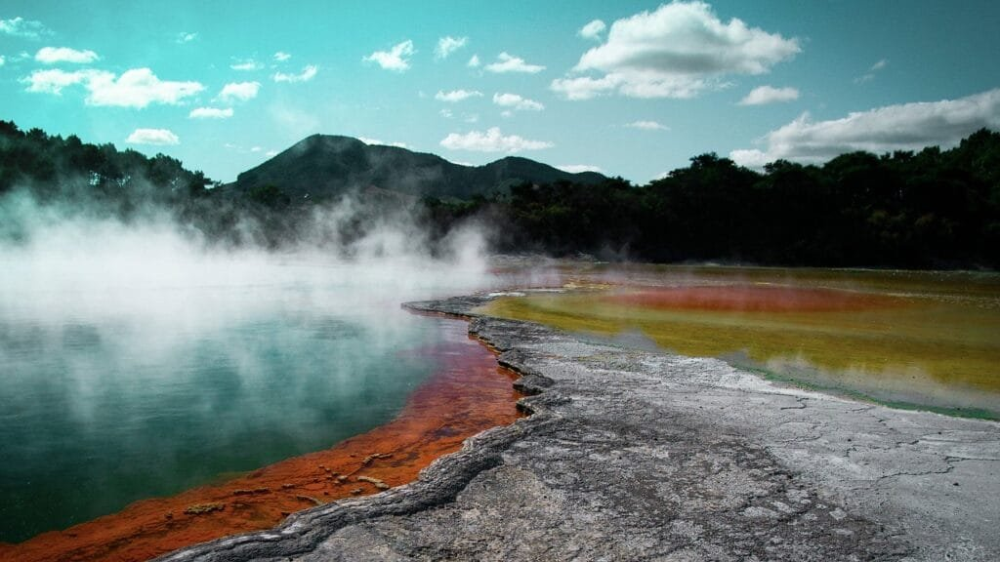
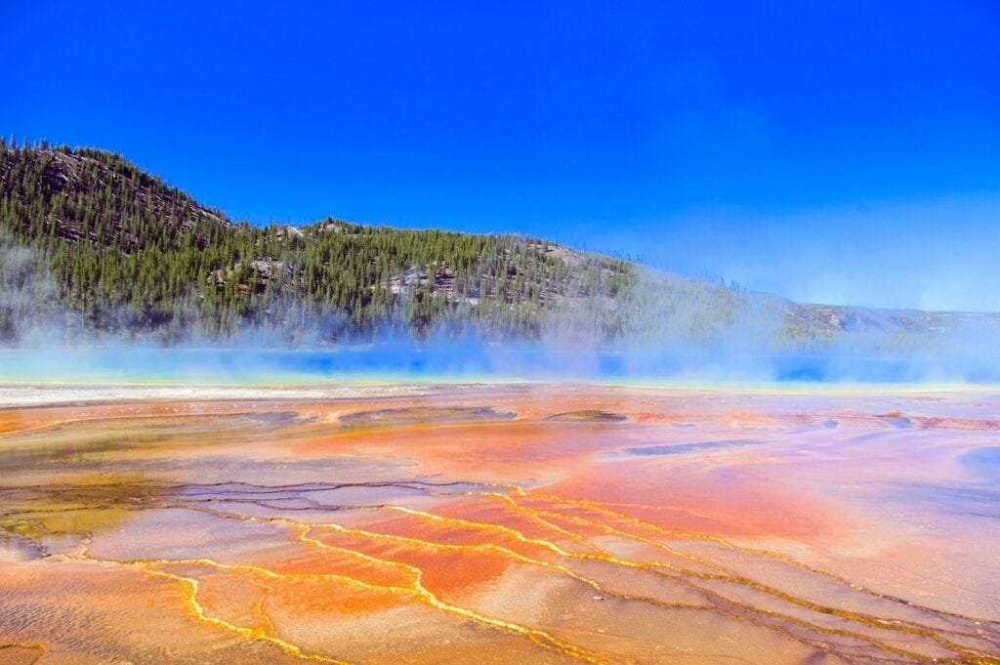

Did you know that volcanic islands hold immense potential for geothermal energy production? Volcanoes, formed by the eruption of molten rock and debris, are located along plate boundaries, hotspots, or rift zones where tectonic plates are moving apart. These geological phenomena are not only sources of natural disasters but also offer benefits like providing nutrients to the soil. By understanding the different types of volcanoes, their eruption patterns, and their geographic distribution, we can uncover the 5 best volcanic islands for harnessing geothermal energy. This article will explore the potential of these islands and shed light on the advantages of utilizing this renewable energy source.

This image is property of pixabay.com.

## Understanding Volcanism on Island Chains

[Volcanoes are fascinating natural phenomena](https://magmamatters.com/the-art-and-science-of-volcano-monitoring/ "The Art and Science of Volcano Monitoring") that have captivated human curiosity for centuries. They are not only awe-inspiring but also hold great scientific and practical value. In this comprehensive article, we will delve into the world of volcanism on island chains, exploring the geologic formation of island volcanoes, the typical volcanic activity patterns, and the various types and characteristics of these magnificent structures.

### Geologic formation of island chains and volcanoes

Island chains, such as those found in the Pacific Ocean, are a result of complex geologic processes that unfold beneath the Earth's surface. Volcanoes emerge when molten rock, gases, and debris ascend to the surface, leading to eruptions of lava and ash. These eruptions can occur at sites along plate boundaries, hotspots under the Earth's crust, or rift zones where the Earth's tectonic plates are moving apart.

The formation of island chains begins with the movement of tectonic plates. As the plates interact, the lighter oceanic crust is forced beneath the heavier continental crust, a process known as subduction. The subduction of the oceanic crust leads to the melting of the underlying mantle, creating a molten chamber called a magma chamber. Over time, the accumulation of magma within the chamber can build up pressure, eventually resulting in [volcanic eruptions and the subsequent formation](https://magmamatters.com/understanding-volcanic-formation-a-comprehensive-guide/ "Understanding Volcanic Formation: A Comprehensive Guide") of islands.

### Types and characteristics of island volcanoes

Island volcanoes can take various forms, each with its distinct characteristics. One common type is the stratovolcano, also known as a composite volcano. These majestic structures are tall and conical, formed by alternate layers of lava flows and pyroclastic materials. Stratovolcanoes often exhibit explosive eruptions due to the high viscosity of their magma, which traps gases and builds pressure.

Another type of island volcano is the shield volcano, which differs significantly from stratovolcanoes in terms of shape and eruptive behavior. Unlike stratovolcanoes, shield volcanoes are characterized by their broad, gently sloping profiles. These volcanoes are mainly composed of basaltic lava, which has low viscosity and allows for the smooth flow of lava over long distances. As a result, shield volcanoes tend to have less explosive eruptions, with lava flowing steadily down their slopes.

### Typical volcanic activity patterns on islands

Volcanoes on island chains often exhibit distinctive patterns of volcanic activity. These patterns can provide valuable insights into the behavior and future activity of these volcanoes. One common type of volcanic activity is effusive eruptions, where magma slowly rises to the surface and flows out in the form of lava. Effusive eruptions are often associated with shield volcanoes, as their low-viscosity magma facilitates the steady flow of lava.

Explosive eruptions, on the other hand, involve the rapid release of pressurized gases and fragmented pyroclastic materials. These eruptions can be highly destructive and pose significant risks to nearby communities. The explosivity of volcanic eruptions is influenced by various factors, including the composition and gas content of the magma, as well as the geometry of the volcanic vent. Understanding these patterns of volcanic activity is crucial for predicting future eruptions and mitigating the potential hazards they may pose.

## Tectonic Settings of Volcanic Islands

The formation of volcanic islands is intricately linked to plate tectonic movements. Tectonic plates, which make up the rigid outer shell of the Earth, are constantly moving and interacting with one another. It is these interactions that give rise to the formation of volcanic islands in various tectonic settings.

### Plate tectonic movements responsible for island volcano formation

The movement of tectonic plates plays a significant role in the formation of volcanic islands. One common mechanism for island formation is subduction, where an oceanic plate sinks beneath another plate, usually a continental plate. As the oceanic plate descends into the mantle, it generates intense heat and pressure, causing the underlying mantle to melt and form magma. This magma then rises to the surface, leading to the formation of volcanic islands.

Another mechanism for island formation is volcanic hotspots. Hotspots are areas of intense volcanic activity that lie deep within the Earth's mantle. They are thought to be generated by long-lived plumes of hot material that rise from the boundary between the mantle and the core. As the tectonic plate moves over the hotspot, a chain of islands is formed, with the youngest island being directly above the hotspot.

### Volcanic hotspots and their role in island formation

Volcanic hotspots are of particular interest when studying the geology of volcanic islands. These hotspots are believed to be long-lasting sources of magma, arising from deep within the Earth's mantle. As the tectonic plate moves over the hotspot, a series of volcanic eruptions occur, leading to the formation of a chain of islands. Over time, as the plate continues to move, new islands are formed, with the older ones gradually being carried away from the hotspot.

One well-known example of a volcanic hotspot is the Hawaiian Islands, located in the middle of the Pacific Ocean. The formation of the Hawaiian Islands is attributed to the movement of the Pacific Plate over a hotspot, resulting in a chain of islands stretching for thousands of kilometers. The youngest and most active island in this chain is the Big Island of Hawaii, where volcanic activity is still ongoing.

### The impact of tectonic activity on geothermal energy availability

The tectonic activity responsible for the formation of volcanic islands also plays a crucial role in the availability of geothermal energy. Geothermal energy is produced through the extraction of heat from the Earth's interior, using the natural geothermal gradient present in volcanic areas. The geothermal gradient refers to the increase in temperature with depth in the Earth's crust.

In areas with active tectonic activity, such as volcanic islands, the geothermal gradient is typically higher compared to non-volcanic regions. This increased geothermal gradient provides a significant opportunity for harnessing geothermal energy. The high temperatures associated with volcanic activity can be utilized to generate electricity or provide heating for local communities, offering a sustainable and renewable energy source.

<iframe width="560" height="315" src="https://www.youtube.com/embed/c7dy0hUZ9xI" frameborder="0" allow="accelerometer; autoplay; encrypted-media; gyroscope; picture-in-picture" allowfullscreen></iframe>

  

## Geology and Geothermal Gradient

Understanding the geology of volcanic islands is essential when exploring the potential for geothermal energy production. The geothermal gradient, which reflects the increase in temperature with increasing depth, varies depending on the geological characteristics of a given island. Let's dive deeper into the geothermal gradient and its influence on geothermal energy production.

### Explaining the geothermal gradient on volcanic islands

The geothermal gradient is a fundamental concept in geothermal energy production. It refers to the rate at which the temperature increases with depth in the Earth's crust. On volcanic islands, the geothermal gradient tends to be steeper compared to non-volcanic regions. This steep gradient is a result of the high temperatures associated with volcanic activity.

The heat generated by volcanic activity, combined with the geothermal gradient, creates an ideal environment for harnessing geothermal energy. As we venture deeper into the Earth's crust on volcanic islands, the temperature progressively rises, reaching levels suitable for tapping into the vast reserves of thermal energy stored underground.

### How geothermal gradient influences geothermal energy production

The geothermal gradient plays a crucial role in the efficiency and viability of geothermal energy production on volcanic islands. A steeper geothermal gradient allows for higher temperatures at shallower depths, making it easier to extract heat for energy generation. In contrast, a less steep gradient would require drilling to greater depths to reach the desired temperatures.

The presence of a favorable geothermal gradient reduces the cost and complexity associated with geothermal energy production. The shallow availability of high-temperature resources on volcanic islands allows for the utilization of more cost-effective drilling techniques, ensuring maximum efficiency in energy extraction.

### The relationship between island geology and the geothermal gradient

The geothermal gradient on volcanic islands is closely linked to the underlying geology of the region. The geological composition and structure of the island determine the distribution and accessibility of geothermal resources. Understanding the relationship between geology and the geothermal gradient is crucial for the identification of suitable geothermal energy sites.

Volcanic islands, by their very nature, possess a unique geological character. The presence of magma chambers, volcanic conduits, and fractures in the rocks can create pathways for the heat to reach the surface. The geothermal gradient is influenced by the permeability of the rock layers, the presence of groundwater, and the type and composition of the volcanic materials.

## The Science behind Geothermal Energy

Geothermal energy is one of the most promising renewable energy sources, providing a sustainable alternative to conventional forms of energy. By harnessing the heat stored within the Earth, geothermal power plants can generate electricity and heat for a wide range of applications. In this section, we will explore the principles of geothermal energy production, the heat sources driving this process, and the various methods used to extract geothermal energy.

### Principles of geothermal energy production

Geothermal energy production is based on the principle of utilizing the heat stored within the Earth's crust. The Earth's interior consists of a molten core surrounded by a solid mantle and crust. The heat from the core is continuously conducted towards the surface, creating a vast reservoir of thermal energy.

To extract this energy, geothermal power plants utilize wells drilled into the Earth's crust. These wells allow for the circulation of fluids, typically water or steam, in a closed loop system. As the fluid circulates through the wells, it absorbs heat from the surrounding rocks and rises to the surface, where it is utilized to generate electricity or provide direct heat.

### Heat sources for geothermal energy

The heat utilized in geothermal energy production can have different sources depending on the geological setting. In the case of volcanic islands, the primary heat source is the volcanic activity itself. The presence of magma chambers beneath the surface creates a continuous supply of heat, which can be tapped into to generate geothermal energy.

In addition to volcanic activity, heat can also be sourced from the radioactive decay of elements present in the Earth's crust. These decay processes release a significant amount of heat, contributing to the overall geothermal energy potential. The combination of these heat sources provides a reliable and sustainable reservoir of thermal energy that can be harnessed for power generation.

### Geothermal energy extraction methods

Geothermal energy extraction involves several methods aimed at efficiently harnessing the available thermal energy. The specific extraction method used depends on the characteristics of the geothermal resource and the technology available. Here are some commonly used methods:

1. **Dry steam power plants:** These power plants utilize steam directly from underground reservoirs to drive turbines and generate electricity. The steam is extracted through production wells and routed to the power plant, where it expands through the turbine blades, generating mechanical power.
    
2. **Flash steam power plants:** Flash steam power plants are the most common type of geothermal power plants. They rely on high-pressure hot water or brine from underground reservoirs. As the hot water is pumped to the surface, the pressure drops, causing some of the water to flash into steam. The steam is then used to drive turbine generators, producing electricity.
    
3. **Binary cycle power plants:** Binary cycle power plants are designed to generate electricity using lower temperature geothermal resources. In these plants, hot water or brine is passed through a heat exchanger, transferring its heat to a working fluid with a lower boiling point, such as an organic compound. The vaporization of the working fluid drives the turbine, generating electricity.
    

Each extraction method is tailored to the specific characteristics of the geothermal resource, ensuring optimal utilization of the available heat and maximum energy output.

This image is property of pixabay.com.

## Viable Geothermal Energy Sites on Volcanic Islands

Volcanic islands offer unique opportunities for the development of geothermal energy resources. The volcanic activity that gives birth to these islands creates ideal conditions for the generation of geothermal energy. In this section, we will explore the factors that contribute to the geothermal energy potential of volcanic islands, the process of assessing their viability for geothermal energy production, and the various factors that affect the viability of geothermal energy sites.

### Importance of volcanic activity for geothermal energy potential

Volcanic activity is a significant factor in determining the geothermal energy potential of volcanic islands. The presence of active volcanoes and underlying magma chambers provides a continuous heat source, which can be harnessed to produce geothermal energy. Volcanic islands are often located in regions characterized by high tectonic activity, making them particularly suitable for geothermal energy production.

The continuous supply of heat from volcanic activity ensures the long-term sustainability of geothermal energy production on volcanic islands. Unlike other renewable energy sources, such as wind or solar power, geothermal energy is not dependent on external factors such as weather conditions, making it a reliable and consistent source of clean energy.

### Assessing island volcanoes for geothermal energy production

The assessment of volcanic islands for geothermal energy production involves a comprehensive evaluation of various factors. The presence of active volcanoes, the geological characteristics of the island, and the availability of suitable geothermal reservoirs are key considerations. In addition, factors such as accessibility, environmental impact, and potential risks need to be carefully evaluated.

Geological surveys, including geological mapping and geophysical studies, are crucial for understanding the subsurface characteristics of the island. These surveys help identify potential geothermal reservoirs, determine their size and temperature, and assess their potential for sustained heat extraction.

### Factors affecting the viability of geothermal energy sites

Several factors influence the viability of geothermal energy sites on volcanic islands. The specific conditions of each site, including the temperature and flow rate of the geothermal resource, the permeability of the rocks, and the chemistry of the fluids, determine the feasibility of extracting heat for energy production.

Accessibility and infrastructure also play a vital role in the viability of geothermal energy sites. The presence of existing roads, power transmission lines, and water supply systems can significantly reduce the costs and logistical challenges associated with the development of geothermal power plants.

Environmental considerations are equally important when evaluating the viability of geothermal energy sites. Potential impacts on local ecosystems, such as displacement of wildlife or contamination of water sources, must be carefully assessed and mitigated. Balancing the economic benefits of geothermal energy with environmental conservation is essential for ensuring the long-term sustainability of these projects.

## Challenges of Geothermal Energy in Volcanic Environments

While geothermal energy holds great potential in volcanic environments, it also comes with its fair share of challenges. The unique [geological and environmental characteristics of volcanic](https://magmamatters.com/geothermal-energy-and-its-volcanic-origins/ "Geothermal Energy and Its Volcanic Origins") areas can present hurdles that need to be overcome for successful geothermal energy production. This section will explore the geological, environmental, and technical challenges associated with geothermal energy in volcanic environments, as well as potential solutions to address these challenges.

### Geological challenges: seismic activity and ground movement

One of the primary [geological challenges in volcanic environments](https://magmamatters.com/the-environmental-impact-of-volcanic-eruptions-2/ "The Environmental Impact of Volcanic Eruptions") is the high level of seismic activity and ground movement. The dynamic nature of volcanic areas can cause frequent earthquakes and volcanic eruptions, which pose risks to infrastructure and the safety of personnel working at geothermal energy sites.

To mitigate these risks, geothermal power plant designs need to incorporate robust engineering measures that can withstand seismic events. This includes reinforcing structures, using flexible piping systems, and implementing early warning systems to evacuate personnel in the event of an impending volcanic eruption or earthquake.

Monitoring and early warning systems are crucial for detecting changes in volcanic activity and seismicity. Real-time monitoring of ground deformation, volcanic gas emissions, and seismic activity can provide valuable data to predict and mitigate potential hazards.

### Environmental challenges: potential impacts on local ecosystems

Geothermal energy production in volcanic environments can have potential impacts on local ecosystems and their biodiversity. The extraction of fluids from underground reservoirs can deplete natural hot springs, disrupt sensitive habitats, and alter hydrological patterns. Additionally, the release of geothermal fluids and gases, if not properly managed, can lead to the contamination of surface water and air quality.

To minimize these environmental impacts, geothermal power plants must implement effective management strategies. This includes re-injecting spent fluids back into the reservoir to maintain the natural hydrological balance, implementing wastewater treatment systems, and employing technologies to capture and mitigate gas emissions.

Engaging with local communities and stakeholders is crucial in assessing and addressing environmental concerns. Collaboration with environmental agencies, conservation organizations, and indigenous communities can help develop sustainable practices that ensure the protection and preservation of local ecosystems.

### Technical challenges and potential solutions

Geothermal energy production in volcanic environments also presents unique technical challenges. One such challenge is the high levels of corrosive compounds, such as hydrogen sulfide, present in geothermal fluids. These compounds can cause corrosion in pipes and equipment, leading to increased maintenance and operational costs.

To overcome this challenge, geothermal power plants employ specialized materials and coatings that are resistant to corrosion. State-of-the-art materials, such as high-density polyethylene (HDPE) and corrosion-resistant alloys, can be used in pipelines and equipment to ensure long-term durability and minimize maintenance requirements.

Another technical challenge is the potential for scaling and mineral deposition in geothermal wells and heat exchangers. Scaling occurs when minerals dissolved in the geothermal fluids precipitate out and form solid deposits, reducing the efficiency of the heat transfer process.

To prevent scaling, geothermal power plants employ various strategies, including the use of chemical inhibitors, regular maintenance and cleaning procedures, and advanced descaling technologies. Implementing effective scaling prevention measures is crucial for maintaining the efficiency and longevity of geothermal energy systems.

This image is property of pixabay.com.

## Benefits of Geothermal Energy in Island Communities

Geothermal energy holds numerous benefits for island communities, making it an ideal solution for their energy needs. From environmental sustainability to economic advantages, geothermal energy offers a range of benefits that can transform island communities. In this section, we will explore the sustainable local energy production, the mitigation of climate change through renewable energy, and the economic advantages of geothermal energy.

### Sustainable local energy production

One of the significant benefits of geothermal energy on volcanic islands is its potential for sustainable local energy production. Geothermal power plants can provide a reliable and continuous supply of clean energy, reducing the dependence on imported fossil fuels and the associated costs.

By harnessing the heat stored within the Earth, geothermal energy can provide a renewable energy source that can drive economic growth and improve the quality of life for island communities. The sustainability of geothermal energy ensures that future generations can continue to benefit from this clean and abundant source of power.

### Mitigating climate change through renewable energy

Geothermal energy is considered a renewable energy source with a minimal carbon footprint. Unlike fossil fuel-based power generation, geothermal energy produces minimal greenhouse gas emissions, making it an essential tool in combating climate change.

By transitioning to geothermal energy, island communities can significantly reduce their carbon emissions and contribute to global efforts to mitigate climate change. Geothermal energy provides an environmentally friendly alternative to fossil fuel-based power generation, helping to create a more sustainable future for our planet.

### Economic advantages of geothermal energy

Geothermal energy offers significant economic advantages for island communities. The development of geothermal power plants creates job opportunities in various sectors, from construction and drilling to operations and maintenance. These job opportunities can boost local economies, provide steady employment, and support the growth of a skilled workforce in the renewable energy sector.

Furthermore, geothermal energy can reduce the energy costs for island communities by providing a stable and affordable source of electricity and heat. By relying on a local and sustainable energy source, island communities can reduce their vulnerability to global energy price fluctuations and create a more resilient and self-sufficient energy infrastructure.

## Case Studies: Exploiting Geothermal Energy on Volcanic Islands

The practical application of geothermal energy on volcanic islands can be seen through various case studies worldwide. These case studies demonstrate the successful utilization of geothermal energy and provide valuable insights into its potential and challenges. In this section, we will explore three notable examples: Iceland, Hawaii, and the Philippines.

### Iceland: a model for geothermal energy production

Iceland is renowned for its extensive use of geothermal energy and serves as a model for geothermal energy production. The country is located on the Mid-Atlantic Ridge, a divergent plate boundary where volcanic activity is prevalent. Iceland utilizes its abundant geothermal resources to meet the majority of its heating and electricity needs.

Geothermal power plants in Iceland provide approximately one-quarter of the country's electricity, with the remaining three-quarters generated from renewable hydroelectric sources. This reliance on renewable energy has allowed Iceland to reduce its carbon footprint significantly and become a global leader in sustainable energy practices.

### Hawaii: Geothermal energy amid shield volcanoes

Hawaii, home to a chain of shield volcanoes, offers another compelling case study for geothermal energy production. The Big Island of Hawaii is particularly well-suited for geothermal energy, given its active volcanoes and vast geothermal resources.

The Puna Geothermal Venture, located on the eastern side of the Big Island, is one of the largest geothermal power plants in the state. It harnesses the heat stored within the island to generate electricity, providing a stable and renewable energy source for local communities.

Hawaii's commitment to renewable energy, including geothermal, has positioned the state as a leader in clean energy initiatives and serves as an inspiration for other island communities seeking to transition towards sustainable energy sources.

### The Philippines: Benefiting from the 'Ring of Fire'

The Philippines, known for its location along the notorious "Ring of Fire," has been harnessing geothermal energy for several decades. The country ranks second globally in terms of geothermal energy production, utilizing its abundant geothermal resources to generate electricity and provide heat for various applications.

Located on the Pacific Ring of Fire, the Philippines has numerous active volcanoes and geothermal fields. The development of geothermal power plants in areas such as the province of Negros Oriental and the island of Leyte has significantly contributed to the country's energy supply, reducing its reliance on fossil fuels.

The success of geothermal energy in the Philippines showcases the potential for island communities to become energy-independent through the sustainable utilization of their geothermal resources.

## Future of Geothermal Energy on Volcanic Islands

The future of geothermal energy on volcanic islands holds great promise, driven by technological advancements and the need for sustainable energy sources. As we look ahead, it is essential to consider the potential impacts, opportunities, and challenges associated with the further expansion of geothermal energy. In this section, we will explore technological advancements, the possible expansion of geothermal energy on less-explored volcanic islands, and the long-term environmental and economic implications.

### Technological advancements and their potential impacts

Technological advancements continue to play a crucial role in the advancement of geothermal energy production. Innovations in drilling techniques, materials science, and reservoir modeling have improved the efficiency and cost-effectiveness of geothermal power plants.

Advanced drilling technologies, such as directional drilling and slim-hole drilling, enable access to deeper and hotter geothermal reservoirs. This expands the potential for geothermal energy production beyond the confines of traditional shallow reservoirs, unlocking previously untapped resources.

Enhancements in materials science have led to the development of high-temperature materials and coatings that can withstand the corrosive conditions encountered in geothermal environments. These materials increase the longevity and reliability of geothermal power plants, reducing maintenance requirements and improving overall performance.

### Possible expansion of geothermal energy on less-explored volcanic islands

While geothermal energy has been successfully harnessed on several volcanic islands, there are still numerous less-explored volcanic islands with untapped geothermal potential. The expansion of geothermal energy to these islands presents exciting opportunities for further development.

By conducting geological surveys and exploratory drilling, scientists and engineers can assess the geothermal resources on these islands and determine their viability for energy production. By expanding the geographic scope of geothermal energy, we can diversify our energy sources, reduce reliance on fossil fuels, and create new opportunities for sustainable development.

### Long-term environmental and economic implications

The widespread adoption and expansion of geothermal energy on volcanic islands will have long-term environmental and economic implications. The transition to clean and sustainable energy sources will contribute to global efforts to mitigate climate change by reducing greenhouse gas emissions.

From an economic perspective, the development of geothermal energy can create jobs, support local industries, and enhance energy security. It reduces dependency on imports of fossil fuels, stabilizes energy costs, and creates opportunities for local communities to thrive.

However, it is essential to carefully manage the environmental impacts of geothermal energy production. Effective environmental monitoring and mitigation measures must be in place to ensure the protection of ecosystems, wildlife, and local water sources.

## Summary and Conclusions

In conclusion, understanding volcanism on island chains provides valuable insights into the geologic processes that shape our planet and the potential for harnessing geothermal energy. Island volcanoes, formed through complex interactions of tectonic plates and volcanic activity, exhibit various characteristics and eruption patterns.

The tectonic settings of volcanic islands, including plate movements and volcanic hotspots, play a significant role in their geothermal energy potential. These settings provide the necessary heat sources and conditions for efficient geothermal energy production.

The unique geology of volcanic islands influences the geothermal gradient, which in turn affects the viability and efficiency of geothermal energy extraction. Understanding the geothermal gradient helps identify suitable sites and develop cost-effective techniques for energy production.

Geothermal energy, based on the extraction of heat from the Earth's interior, relies on well-established scientific principles and extraction methods. By utilizing heat from volcanic activity and other sources, geothermal power plants generate electricity and provide heat for a wide range of applications.

Volcanic islands offer favorable conditions for geothermal energy production, given their active volcanism and abundant geothermal resources. Assessing the viability of geothermal energy sites requires a comprehensive evaluation of geological, technical, and environmental factors.

While geothermal energy in volcanic environments presents challenges, such as seismic activity and environmental impacts, these challenges can be mitigated through advanced engineering, environmental management, and community engagement.

The benefits of geothermal energy in island communities are numerous, including sustainable local energy production, climate change mitigation, and economic advantages. Island communities can become energy-independent, reduce carbon emissions, and stimulate local economies through the development of geothermal energy.

Case studies from volcanic islands such as Iceland, Hawaii, and the Philippines demonstrate the successful implementation of geothermal energy and provide valuable lessons for future projects. These case studies highlight the transformational potential of geothermal energy and its ability to meet the energy needs of island communities.

The future of geothermal energy on volcanic islands looks promising, with ongoing technological advancements and the potential for expansion to less-explored islands. These advancements, coupled with effective environmental stewardship and careful planning, can ensure the long-term sustainability of geothermal energy production.

In summary, understanding and harnessing geothermal energy on volcanic islands is not only a scientific endeavor but also an opportunity to accelerate the transition towards a cleaner and more sustainable future. By capitalizing on the natural resources provided by these volcanic landscapes, we can create a greener and more resilient energy infrastructure for island communities worldwide.

