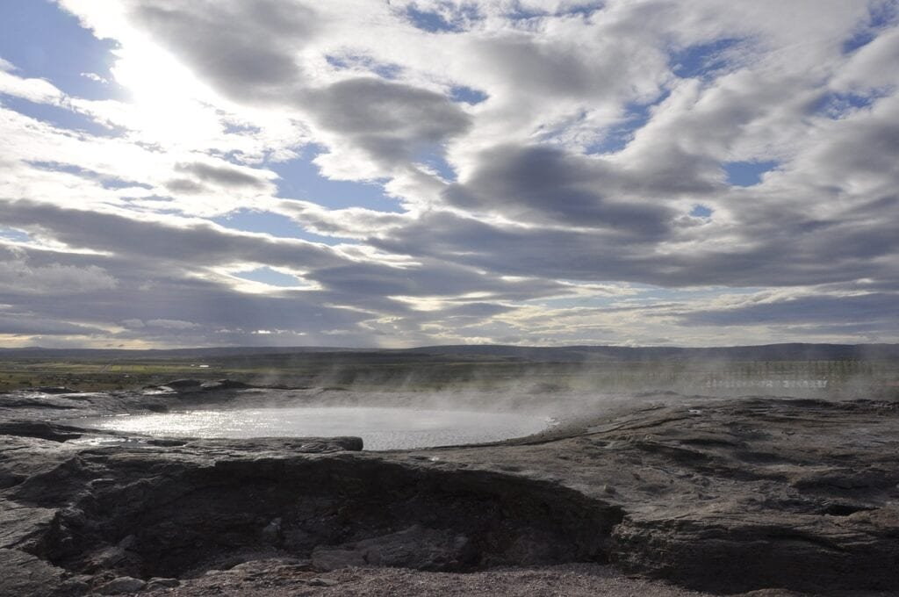
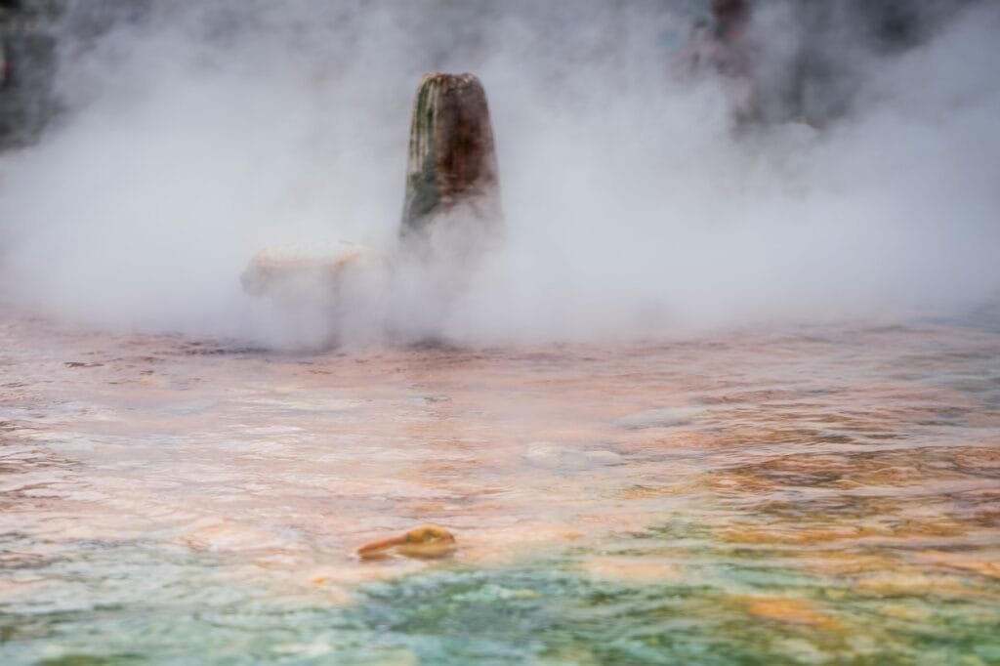

Imagine tapping into the immense power of volcanoes to generate sustainable energy. Harnessing the natural heat stored within these majestic natural wonders is exactly what geothermal energy methods aim to achieve. Volcanoes, with their molten rock, gases, and ash, offer a promising renewable energy source that can be utilized in various ways. This article explores the different types of volcanoes, their distribution, eruption causes, hazards, and benefits, setting the stage for a deeper analysis of the potential of volcanic energy. Join us on this exciting journey as we delve into the fascinating world of harnessing the power of volcanoes through geothermal energy methods.

<iframe width="560" height="315" src="https://www.youtube.com/embed/wXR6Vi_dHUY" frameborder="0" allow="accelerometer; autoplay; encrypted-media; gyroscope; picture-in-picture" allowfullscreen></iframe>

  

## Understanding Volcanic Power

[Volcanoes are nature's](https://magmamatters.com/the-art-and-science-of-volcano-monitoring/ "The Art and Science of Volcano Monitoring") boiling cauldrons, fascinating and powerful geological features that have captivated human curiosity for centuries. Understanding the concept of volcanoes is essential in unlocking the potential of volcanic power as a renewable energy source. A volcano is formed when molten rock, gases, and debris escape to the earth's surface, causing eruptions of lava and ash. These magnificent structures occur at sites along plate boundaries, hotspots under the earth's crust, or rift zones where the earth's tectonic plates are moving apart.

### Nature's Boiling Cauldrons: The Concept of Volcanoes

Volcanoes come in various types, each with its own distinctive characteristics. The "Ring of Fire," encircling the Pacific Ocean, is teeming with volatile volcanic activity. This region is notorious for its explosive eruptions, resulting from the convergence of tectonic plates. Conversely, shield volcanoes, such as those in Hawaii, form gradually over hot spots deep underground and have less explosive eruptions. Understanding the different [types of volcanoes](https://magmamatters.com/understanding-volcanic-formation-a-comprehensive-guide/ "Understanding Volcanic Formation: A Comprehensive Guide") and their formation processes helps scientists identify potential energy sources from volcanic activity.

### Geographic Distribution of Volcanoes

Volcanoes can be found all around the globe, with some regions more prone to volcanic activity than others. The Pacific Ring of Fire, extending from South America to Asia, encompasses the most active volcanic zones. Aside from this, volcanic activity is also observed in regions like Iceland, the East African Rift Valley, and parts of Europe. The geographic distribution of volcanoes is a clear indication of the tectonic forces and internal dynamics that shape our planet.

### Types of Volcanic Eruptions

Volcanic eruptions exhibit a wide range of characteristics, influenced by factors such as lava viscosity, gas content, and tectonic forces. Some eruptions are explosive, with ash, pyroclastic flows, and lethal gases, while others are non-explosive, characterized by effusive lava flows. These diverse eruption patterns provide valuable insights into the behavior of volcanoes and aid in predicting future volcanic activity. Understanding the types of volcanic eruptions allows scientists to better manage volcanic energy resources.

### How Volcanoes Contribute to Soil Nutrients and Support Local Ecosystem

While the power of volcanoes is awe-inspiring, their impact extends far beyond destruction. Volcanic eruptions replenish the soil with essential nutrients, making volcanic regions fertile ground for agriculture. The minerals released during eruptions, including potassium, phosphorus, and magnesium, enhance soil fertility and support the growth of crops. Additionally, volcanic ecosystems, with their unique plant and animal species, thrive in these nutrient-rich environments. Recognizing the role of volcanoes in supporting local ecosystems emphasizes their significance and highlights their potential as a sustainable energy source.

This image is property of pixabay.com.

## The Fundamentals of Geothermal Energy

Geothermal energy harnesses the natural heat stored within the Earth to generate sustainable power. It is a renewable energy source that offers an alternative to fossil fuels and reduces greenhouse gas emissions. By understanding the basic principles of geothermal energy and exploring the different types of geothermal energy systems, we can unlock the full potential of this clean and abundant energy source.

### Transforming Heat into Energy: The Basic Principles

Geothermal energy is derived from the heat generated by the Earth's core and the radioactive decay of minerals deep within the Earth. This heat energy can be accessed by drilling wells into geothermal reservoirs, where hot water or steam is stored. The heat is then converted into electricity using geothermal power plants. By understanding the fundamental principles of heat transfer and energy conversion, we can effectively harness geothermal energy and maximize its potential.

### The Different Types of Geothermal Energy Systems

Geothermal energy systems can be categorized into three main types: dry steam, flash steam, and binary cycle. In a dry steam system, high-pressure steam is directly extracted from geothermal reservoirs and used to power turbines. Flash steam systems are the most common, where hot water from the reservoir is released into a lower-pressure tank, causing it to flash into steam. This steam is then used to generate electricity. Binary cycle systems utilize a working fluid with a lower boiling point than water, effectively capturing heat from lower-temperature reservoirs. Understanding the different types of geothermal energy systems helps in selecting the most suitable method for power generation.

### Evaluation of Geothermal Resources

Assessing the availability and viability of geothermal resources is crucial in determining the potential for geothermal energy production. Geologists and geothermal experts analyze various factors, including subsurface temperature gradients, reservoir characteristics, and fluid flow, to evaluate the resource potential. In addition, drilling exploration wells and conducting geophysical surveys provide valuable data to quantify the extractable energy. By evaluating geothermal resources, we can make informed decisions about the feasibility and profitability of geothermal energy projects.

This image is property of pixabay.com.

## Volcanoes and Geothermal Energy

[Volcanoes and geothermal energy](https://magmamatters.com/geothermal-energy-and-its-volcanic-origins/ "Geothermal Energy and Its Volcanic Origins") are closely intertwined, as volcanic activity is one of the main sources of geothermal heat. Understanding the relationship between volcanoes and geothermal energy allows us to harness this abundant and renewable energy source more efficiently.

### Close Relationship Between Volcanoes and Geothermal Energy

Volcanic regions, with their intense geothermal heat, provide ideal conditions for the generation of geothermal energy. The proximity of active or dormant volcanoes to geothermal reservoirs allows for the direct harnessing of volcanic heat. The magma chambers and geothermal reservoirs often coexist underground, making volcanic areas prime locations for geothermal power production. By recognizing the close relationship between volcanoes and geothermal energy, we can strategically locate geothermal power plants to maximize energy production.

### Methods of Harnessing Geothermal Energy from Volcanoes

Harnessing geothermal energy from volcanoes involves extracting the heat stored within the volcanic system through various methods. The most common method is drilling geothermal wells to access the hot water or steam from underground reservoirs. This heat is then used to power turbines and generate electricity. In some cases, volcanic heat can be captured and directly utilized for heating purposes or to drive industrial processes. By employing these methods, we can effectively utilize the abundant geothermal energy potential within volcanic regions.

