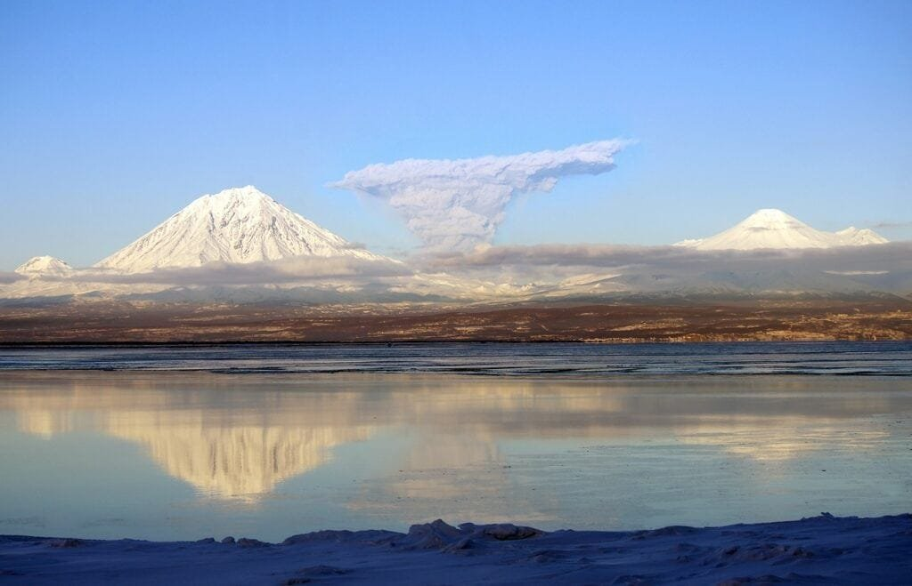

In the fascinating world of volcanoes, understanding their behavior and predicting their eruptions plays a crucial role in ensuring the safety of nearby communities and mitigating the potential risks. Volcanoes, whether located along plate boundaries, hotspots, or rift zones, display unique eruption patterns driven by factors such as lava viscosity and gas content. While some volcanoes erupt explosively, others gradually release lava and ash over time. Fortunately, successful methods for predicting volcanic eruptions have emerged, offering valuable insights into these powerful natural phenomena. By analyzing seismic activity, gas emissions, ground deformation, and other key indicators, scientists have made significant strides in forecasting volcanic eruptions. In this article, we will explore the methods that have proven successful in predicting volcanic activity and delve into their potential for safeguarding communities at risk.

# Understanding the Nature of Volcanoes

[Volcanoes are fascinating natural phenomena](https://magmamatters.com/the-art-and-science-of-volcano-monitoring/ "The Art and Science of Volcano Monitoring") that have captured the attention of scientists and the public for centuries. In order to effectively study and predict volcanic activity, it is crucial to understand the different types of volcanoes and the factors that influence their behavior.

<iframe width="560" height="315" src="https://www.youtube.com/embed/Zkbnn7SVATE" frameborder="0" allow="accelerometer; autoplay; encrypted-media; gyroscope; picture-in-picture" allowfullscreen></iframe>

  

## Different types of volcanoes

Volcanoes come in various shapes and sizes, each with its own distinct characteristics. The three main [types of volcanoes are shield](https://magmamatters.com/understanding-volcanic-formation-a-comprehensive-guide/ "Understanding Volcanic Formation: A Comprehensive Guide") volcanoes, composite volcanoes (also known as stratovolcanoes), and cinder cones.

Shield volcanoes are characterized by their broad, gently sloping sides and relatively low heights. They are typically formed by the eruption of large quantities of basaltic lava, which has a low viscosity and flows easily. Examples of shield volcanoes include Mauna Loa in Hawaii and the Galapagos Islands.

Composite volcanoes are tall and steep, with a conical shape. They are built up of alternating layers of lava flows and pyroclastic material, such as ash and volcanic rocks. These volcanoes are capable of explosive eruptions due to the presence of viscous magma. Mount St. Helens in the United States and Mount Fuji in Japan are examples of composite volcanoes.

Cinder cones, on the other hand, are small, steep-sided volcanoes that are formed by the accumulation of ejected volcanic materials, such as cinders and ash. They are often associated with single, short-lived eruptions and can be found in volcanic fields around the world.

Understanding the characteristics of each type of volcano is important for predicting their behavior and potential hazards.

This image is property of pixabay.com.

## Factors influencing volcano activities

Volcanic eruptions are driven by a combination of factors, including the composition of magma, the presence of gases, and the external forces acting on the volcano. The viscosity of magma, or its resistance to flow, plays a crucial role in determining whether an eruption will be explosive or effusive.

Magma composition can vary depending on the location and tectonic setting of a volcano. Mafic magma, which has a low silica content, tends to be less viscous and allows gases to escape more easily, resulting in less explosive eruptions. Felsic magma, on the other hand, has a higher silica content and is more viscous, leading to more explosive eruptions.

The presence of gases, such as water vapor, [carbon dioxide](https://magmamatters.com/geothermal-energy-and-its-volcanic-origins/ "Geothermal Energy and Its Volcanic Origins"), and sulfur dioxide, can also affect volcanic activity. As magma rises to the surface, the decrease in pressure allows gases to escape, causing the magma to expand and potentially leading to explosive eruptions. The chemical composition of gases emitted by volcanoes can provide valuable information about the state of the volcano and its potential for eruption.

External forces, such as tectonic movements and the interaction between magma and groundwater, can also trigger volcanic activity. Tectonic plate boundaries, where the Earth's crust is moving or colliding, are common locations for volcanic activity. The movement of magma through fractures in the Earth's crust can also cause earthquakes, which can be precursors to volcanic eruptions.

This image is property of pixabay.com.

## Geographic distribution of volcanoes

Volcanoes can be found in various locations around the world, but they are not evenly distributed. The majority of volcanoes are located along tectonic plate boundaries, where the movement of plates creates the conditions necessary for volcanic activity.

One prominent example of this is the "Ring of Fire," which encircles the Pacific Ocean. The Ring of Fire is home to the majority of the world's active volcanoes and is characterized by its high levels of seismic activity and volcanic eruptions. The subduction of the Pacific Plate beneath other tectonic plates in the region leads to the formation of explosive composite volcanoes.

In addition to plate boundaries, volcanoes can also form over hotspots, which are areas of intense heat beneath the Earth's crust. Hotspots are responsible for the formation of volcanoes like those in Hawaii, which are characterized by their shield-like shape and relatively gentle eruptions.

Understanding the geographic distribution of volcanoes is important for monitoring and predicting volcanic activity in different regions of the world. By studying past eruptions and monitoring current volcanic activity, scientists can better understand the nature of volcanoes and develop strategies for mitigating the risks they pose to surrounding communities.

