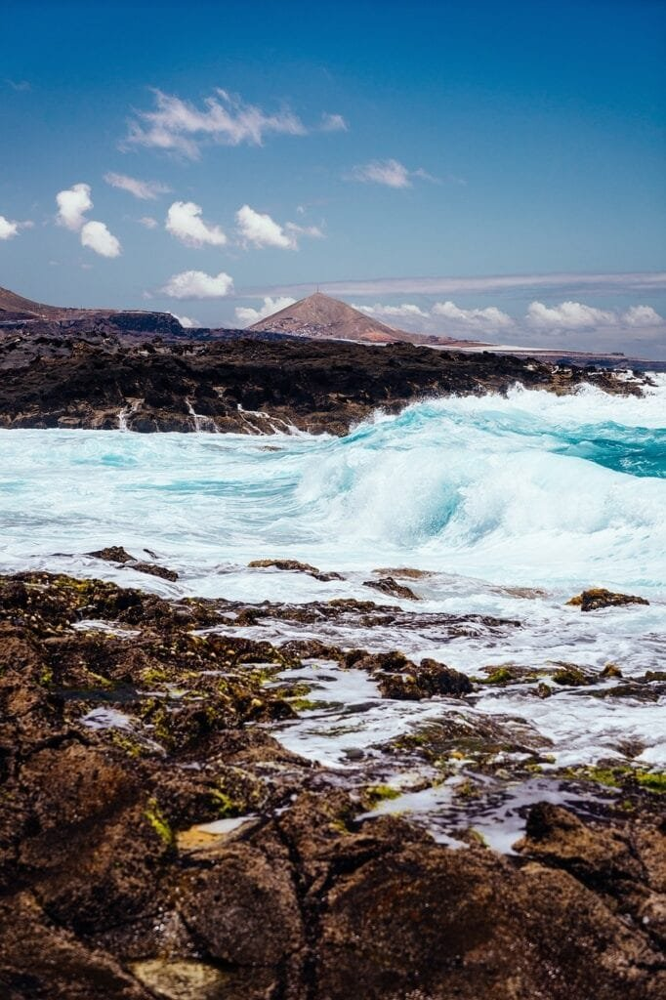
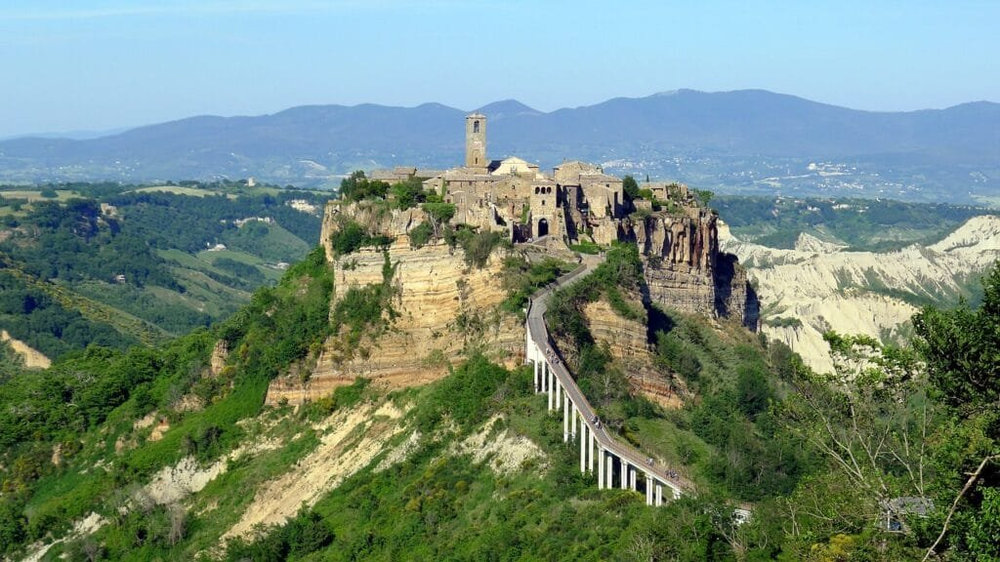
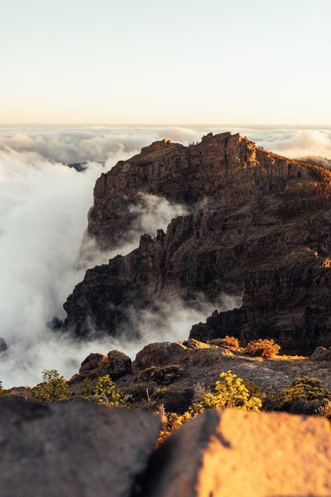

If you're a fan of geological wonders and stunning natural landscapes, then you're in for a treat! This article will take you on a journey to explore the 5 best volcanic landforms in the United States. From towering mountains formed by explosive eruptions to vast lava fields and mesmerizing crater lakes, these volcanic wonders will leave you in awe of the powerful forces of nature. So get ready to immerse yourself in the incredible beauty and fascinating history of these volcanic landforms that have shaped the American landscape. Let's embark on this volcanic adventure together!

# Hawaii Volcanoes National Park

This image is property of pixabay.com.

## Location and Access

Hawaii Volcanoes National Park is located on the Big Island of Hawaii, about 30 miles southwest of Hilo. The park can be accessed by car via the Chain of Craters Road, which offers stunning views of the volcanic landscape. There are also several hiking trails that allow visitors to explore the park on foot.

## Description of the Volcano

The main volcano in Hawaii Volcanoes National Park is Kilauea, one of the most active volcanoes in the world. Kilauea is a shield volcano, which means it has a broad, gently sloping shape. It is known for its frequent lava flows and explosive eruptions. The volcano is also home to several craters, including the impressive Halema'uma'u Crater.

## Eruption History

Kilauea has a long history of eruptions, with the most recent eruption occurring from 1983 to 2018. This eruption produced vast lava flows that reshaped the landscape of the park. Prior to this eruption, Kilauea had been continuously erupting since 1983, with periods of increased activity and lava lake formation.

## Current Activity

As of now, Kilauea is not actively erupting, but it remains an active volcano that is closely monitored by scientists. Visitors to the park can still see the effects of the recent eruption, such as the newly formed lava fields and the steam vents that continue to release volcanic gases.

## Flora and Fauna in the Area

Despite the harsh conditions created by volcanic activity, Hawaii Volcanoes National Park is home to a diverse range of plant and animal species. The park is known for its unique flora, including the rare silversword plant and various species of ferns. It is also a haven for birdwatchers, with endangered species such as the Hawaiian nene goose and the io (Hawaiian hawk) making their home in the park.

## Tourist Activities

There are plenty of activities for tourists to enjoy in Hawaii Volcanoes National Park. Hiking is a popular option, with trails leading to scenic overlooks and through lava tubes. Visitors can also take a drive along the Chain of Craters Road or explore the park's visitor center, which offers educational exhibits and ranger-led programs.

# Mount St. Helens, Washington

## Location and Access

Mount St. Helens is located in southwestern Washington state, about 50 miles northeast of Portland, Oregon. The volcano can be accessed via State Route 504, also known as the Spirit Lake Memorial Highway. This scenic road offers breathtaking views of the surrounding landscape.

## Description of the Volcano

Mount St. Helens is a stratovolcano, also known as a composite volcano, which is characterized by its steep summit and explosive eruptions. Prior to the 1980 eruption, Mount St. Helens had a symmetrical cone shape. However, the eruption caused the top of the volcano to collapse, creating a large crater known as the "Mount St. Helens Crater."

## Eruption History

The most significant eruption of Mount St. Helens occurred on May 18, 1980, and was one of the most destructive volcanic events in the history of the United States. The eruption caused the top 1,300 feet of the volcano to be blown off, resulting in the deaths of 57 people and the destruction of hundreds of square miles of forest.

## Current Activity

Mount St. Helens is still an active volcano, although it has been relatively quiet since the 1980 eruption. There have been minor eruptions and periods of increased volcanic activity, but nothing on the scale of the 1980 eruption. Scientists continue to closely monitor the volcano for any signs of future activity.

## Flora and Fauna in the Area

In the aftermath of the 1980 eruption, the landscape surrounding Mount St. Helens was completely devastated. However, nature has slowly been regenerating, and today the area is home to a diverse range of plant and animal species. Wildflowers, including lupine and Indian paintbrush, bloom in the spring and summer, attracting a variety of pollinators.

## Tourist Activities

Mount St. Helens offers a range of activities for tourists, including hiking, camping, and wildlife viewing. There are several hiking trails that lead to stunning viewpoints, including the Johnston Ridge Observatory, which offers panoramic views of the volcano. Visitors can also explore the Ape Cave lava tube, which is the longest lava tube in the continental United States.

# Crater Lake, Oregon

<iframe width="560" height="315" src="https://www.youtube.com/embed/otVfh_xHoAw" frameborder="0" allow="accelerometer; autoplay; encrypted-media; gyroscope; picture-in-picture" allowfullscreen></iframe>

  

## Location and Access

Crater Lake is located in southern Oregon, within Crater Lake National Park. The lake can be accessed via the Rim Drive, a 33-mile scenic road that encircles the caldera. The park is about 80 miles north of Klamath Falls.

## Description of the Volcano

Crater Lake was formed by the collapse of an ancient volcano known as Mount Mazama. The collapse created a caldera, or a large volcanic crater, which eventually filled with rainwater and snowmelt to form the lake. Crater Lake is renowned for its stunning blue color and crystal-clear waters.

## Eruption History

The collapse that formed the caldera occurred approximately 7,700 years ago and is considered one of the most explosive volcanic events in history. The eruption was so powerful that it left behind a layer of volcanic ash as far away as Canada. Since the collapse, there have been no further eruptions, leaving Crater Lake as a tranquil reminder of the volcano's violent past.

## Current Activity

Crater Lake is not currently an active volcano and is not monitored for volcanic activity. However, the area is seismically active, and scientists believe that there is a potential for future volcanic activity in the region. Nevertheless, there is no immediate risk of eruption, and visitors can safely enjoy the beauty of the lake.

## Flora and Fauna in the Area

Crater Lake National Park is home to a variety of plant and animal species. The park's forests are dominated by towering pine and fir trees, with wildflowers blooming in the spring and summer. The lake itself supports a variety of fish species, including rainbow trout and kokanee salmon. Visitors may also spot wildlife such as black bears, elk, and bald eagles.

## Tourist Activities

There are many activities to enjoy in Crater Lake National Park. The Rim Drive offers breathtaking views of the lake and the surrounding volcanic landscape. There are also several hiking trails that lead to stunning viewpoints, such as Watchman Peak and Garfield Peak. In the summer, visitors can take a boat tour of the lake or go swimming at designated areas.

# Lassen Volcanic National Park, California

## Location and Access

Lassen Volcanic National Park is located in northeastern California, about 50 miles east of Redding. The park can be accessed via State Route 89, which runs through the park and provides access to various points of interest.

## Description of the Volcano

Lassen Peak is the main volcano in Lassen Volcanic National Park and is one of the world's largest plug dome volcanoes. The volcano is known for its distinctive shape, with a steep, conical summit. Lassen Peak last erupted in 1915, creating a new crater known as the "Devastated Area."

## Eruption History

Lassen Peak has a history of volcanic activity, with its most recent eruption occurring in 1915. This eruption was considered the most powerful eruption to occur in the continental United States in the 20th century. The eruption produced volcanic ash that reached as far away as 200 miles and created lahars (mudflows) that devastated the surrounding area.

## Current Activity

Lassen Peak is currently dormant and not actively monitored for volcanic activity. However, the area is considered seismically active, and there is potential for future volcanic eruptions in the region. Visitors to the park should be aware of the volcanic history and enjoy the beauty of the landscape without concern for imminent eruption.

## Flora and Fauna in the Area

Lassen Volcanic National Park is home to a diverse range of plant and animal species. The park's forests are dominated by coniferous trees, including pine, fir, and cedar. Wildflowers bloom in the summer, adding vibrant colors to the landscape. The park is also home to a variety of wildlife, including black bears, gray squirrels, and golden eagles.

## Tourist Activities

There are many activities for tourists to enjoy in Lassen Volcanic National Park. Hiking is a popular option, with trails ranging in difficulty from easy strolls to challenging hikes to the summit of Lassen Peak. The park also offers opportunities for camping, picnicking, and wildlife viewing. In the winter, visitors can enjoy snowshoeing and cross-country skiing.

# Mount Rainier, Washington

This image is property of pixabay.com.

## Location and Access

Mount Rainier is located in Mount Rainier National Park in Washington state. The park is about 55 miles southeast of Seattle. Visitors can access the mountain via State Route 706, which leads to various points of interest within the park.

## Description of the Volcano

Mount Rainier is a stratovolcano and is the highest peak in the state of Washington. The volcano is known for its massive ice cap, which covers the summit and feeds numerous glaciers. Mount Rainier has a symmetrical cone shape and is often shrouded in clouds, adding to its mystique.

## Eruption History

The last major eruption of Mount Rainier occurred approximately 1,000 years ago. The [eruption produced a large ash cloud and pyroclastic flows](https://magmamatters.com/the-environmental-impact-of-volcanic-eruptions-2/ "The Environmental Impact of Volcanic Eruptions"), which are fast-moving avalanches of hot ash, rock fragments, and gas. Since then, there have been no further eruptions, although the volcano is still considered active.

## Current Activity

Mount Rainier is closely monitored for volcanic activity, including seismic activity, gas emissions, and ground deformation. While there are no signs of imminent eruption, scientists continue to study the volcano to better understand its behavior and potential hazards. Visitors to the park can enjoy the beauty of the mountain and its surrounding landscape without concern for immediate volcanic activity.

## Flora and Fauna in the Area

Mount Rainier National Park is home to a diverse range of plant and animal species. The park's subalpine meadows are famous for their vibrant wildflower displays in the summer, including lupine, Indian paintbrush, and avalanche lilies. The park is also home to a variety of wildlife, such as black bears, elk, and mountain goats.

## Tourist Activities

Mount Rainier National Park offers a wide range of activities for tourists. Hiking is a popular option, with trails ranging from easy strolls to challenging summit climbs. The park also offers opportunities for camping, fishing, and wildlife viewing. In the winter, visitors can enjoy snowshoeing and skiing in designated areas.

# Advantages of Volcanic Landforms

## Enriches Soil

Volcanic eruptions release minerals and nutrients from deep within the Earth, enriching the surrounding soil. The fertile soil created by volcanic activity is ideal for agriculture and supports the growth of crops. This, in turn, helps to sustain local communities and economies.

## Generates Geothermal Energy

Volcanic areas often contain geothermal resources, which harness the heat from the Earth's interior for the generation of electricity and heating. Geothermal energy is a renewable and clean source of power that helps to reduce dependence on fossil fuels and mitigate the impacts of [climate change](https://magmamatters.com/geothermal-energy-and-its-volcanic-origins/ "Geothermal Energy and Its Volcanic Origins").

## Promotes Ecotourism

Volcanic landforms attract tourists from around the world who are interested in experiencing the unique landscapes and geological features. The tourism industry that develops around volcanic areas creates jobs and stimulates local economies. Additionally, tourism can help raise awareness about the importance of conserving and protecting these natural wonders.

## Provides Building Materials

Volcanic materials, such as basalt and pumice, have long been used as construction materials. These materials are lightweight, durable, and readily available in volcanic regions. They are commonly used in the construction of buildings, roads, and infrastructure, contributing to the development and growth of communities.

## Offers Research Opportunities

Volcanic landforms provide scientists with opportunities to study the Earth's geologic processes and gain a better understanding of the planet's history. Research conducted in volcanic areas contributes to advancements in fields such as geology, volcanology, and climate science. This knowledge is essential for predicting volcanic activity and mitigating the risks associated with volcanic hazards.

# Drawbacks of Volcanic Landforms

## Causes Natural Disasters

The explosive eruptions and lava flows associated with volcanic activity can cause natural disasters with devastating consequences. Volcanic eruptions can lead to the destruction of homes, infrastructure, and agricultural land. They can also cause avalanches, mudflows, and landslides, posing a significant risk to human lives and the environment.

This image is property of pixabay.com.

## Destroys Infrastructure

Volcanic eruptions can destroy roads, bridges, and other vital infrastructure, making it challenging for affected communities to recover and rebuild. The volcanic ash and debris can also damage buildings and disrupt utilities such as water and electricity supply, further complicating recovery efforts.

## Disrupts Air Travel

Volcanic eruptions can release ash into the atmosphere, which poses a significant risk to aircraft. Volcanic ash can cause engine failure by melting and solidifying on the internal parts of the engine. As a result, air travel may be disrupted or suspended in the vicinity of an erupting volcano, impacting both passenger and cargo transportation.

## Threatens Ecosystems

Volcanic activity can have a severe impact on local ecosystems and biodiversity. The intense heat and toxic gases emitted during eruptions can kill plants and animals, while volcanic ash can smother vegetation and disrupt food chains. The long-term recovery of ecosystems after a volcanic eruption can take decades or even centuries.

## Poses Health Risks

Volcanic eruptions release toxic gases, such as [sulfur dioxide and hydrogen sulfide](https://magmamatters.com/understanding-volcanic-formation-a-comprehensive-guide/ "Understanding Volcanic Formation: A Comprehensive Guide"), which can pose significant health risks to nearby communities. Breathing in these gases can cause respiratory problems, eye irritation, and other health issues. Volcanic ash can also be hazardous if inhaled or ingested, causing respiratory and cardiovascular problems.

# Precautions To Take When Visiting Volcanic Landforms

## Follow Park Guidelines

When visiting volcanic landforms, it is essential to follow the guidelines and regulations set by the park authorities. These guidelines are in place to ensure visitor safety and to protect the fragile ecosystems and geological features. Respect any closures or restrictions and avoid venturing into restricted areas.

## Stay Informed of Current Activity

Before visiting a volcanic area, it is crucial to stay informed about the current volcanic activity. Check the latest updates from local authorities and scientific organizations to be aware of any potential hazards or eruption warnings. This information will help you make informed decisions and plan your visit accordingly.

## Avoid Restricted Zones

Volcanic areas may have restricted zones due to the risk of eruption or other hazards. These zones are designated for public safety and should be strictly avoided. Respect any signs or barriers indicating restricted zones, as entering these areas can be extremely dangerous.

## Prepare for Extreme Weather Conditions

Volcanic areas can experience extreme weather conditions, including high temperatures, strong winds, and sudden storms. It is essential to be prepared for these conditions by wearing appropriate clothing and footwear, carrying sunscreen and insect repellent, and bringing an adequate supply of food and water.

## Equip with Safety Gear

When visiting volcanic landforms, it is important to have the necessary safety gear to protect yourself from potential hazards. This may include items such as sturdy hiking boots, a hat, sunglasses, and a mask or respirator to protect against volcanic gases or ash. Additionally, carry a first aid kit and a means of communication, such as a cell phone or two-way radio.

# Significance of Studying Volcanic Landforms

## Improves Hazard Predictions

Studying volcanic landforms helps scientists understand the behavior of volcanoes and improve their ability to predict volcanic eruptions. By [monitoring seismic activity](https://magmamatters.com/the-art-and-science-of-volcano-monitoring/ "The Art and Science of Volcano Monitoring"), gas emissions, and ground deformation, scientists can develop models and forecasts that inform emergency response plans and help protect communities at risk.

## Reveals Earth's Geologic History

Volcanic landforms provide valuable insights into the Earth's geologic history. The layers of volcanic rock and ash can be analyzed to determine past eruptions, climate conditions, and environmental changes. By studying these records, scientists can reconstruct the history of volcanic activity and understand the Earth's dynamic processes.

## Informs Climate Change Research

Volcanic eruptions release large amounts of gases and ash into the atmosphere, which can have a significant impact on climate patterns. By studying past eruptions and their effects on the climate, scientists can better understand the complex interactions between volcanic activity and climate change. This knowledge contributes to climate modeling and helps predict future climate scenarios.

## Aids in Planetary Exploration

Studying volcanic landforms on Earth provides valuable insights into volcanic activity on other planets and moons in our solar system. By comparing the features and processes observed on Earth to those on other planetary bodies, scientists can learn more about the geological history and potential habitability of these extraterrestrial environments.

## Enhances Earth Science Education

Volcanic landforms offer an excellent opportunity for educational outreach and public engagement in the field of earth science. By showcasing the unique features and processes associated with volcanic activity, educators can inspire curiosity and foster a better understanding of geological concepts among students and the general public.

# Future of Volcanic Landforms

## Potential Volcanic Activity

The future of volcanic landforms is inherently unpredictable. While some volcanoes may remain dormant for thousands of years, others may become active in the near future. Ongoing monitoring and research will continue to improve our understanding of volcanic behavior and help predict potential eruptions.

## Conservation Efforts

As awareness of the ecological and geological value of volcanic landforms grows, conservation efforts are becoming increasingly important. Protecting these areas from human impact, such as development and exploitation, is essential for preserving their unique features and supporting biodiversity.

## Infrastructure Development

With the growing interest in tourism and scientific research, there is likely to be increased investment in infrastructure development in volcanic areas. This may include the construction of visitor centers, improved road systems, and the expansion of research facilities. Careful planning and environmentally sustainable practices will be essential to minimize the negative impact on the natural environment.

## Technological Advancements in Volcano Monitoring

Technological advancements in volcano monitoring are expected to revolutionize our ability to understand and predict volcanic activity. Ground-based monitoring systems, satellite imagery, and remote sensing techniques will continue to advance, providing scientists with valuable data to enhance hazard assessments.

## Impact on Tourism Industry

Volcanic landforms will continue to attract tourists from around the world, contributing to the growth of the tourism industry in volcanic regions. As travelers seek unique experiences and a deeper connection with nature, volcanic areas offer the opportunity to immerse themselves in awe-inspiring landscapes and learn about the Earth's geologic processes. However, it will be crucial to balance tourism with conservation efforts to ensure the long-term sustainability of these fragile environments.

In conclusion, volcanic landforms offer a fascinating glimpse into the dynamic nature of our planet. From the fiery eruptions to the lush landscapes that emerge in their wake, these geological wonders captivate the imagination and provide valuable scientific insights. While they can pose risks and challenges, they also offer numerous advantages, from enriching soil to promoting ecotourism. By studying and understanding volcanic landforms, we can better predict, mitigate, and appreciate the powerful forces of nature that shape our world.

