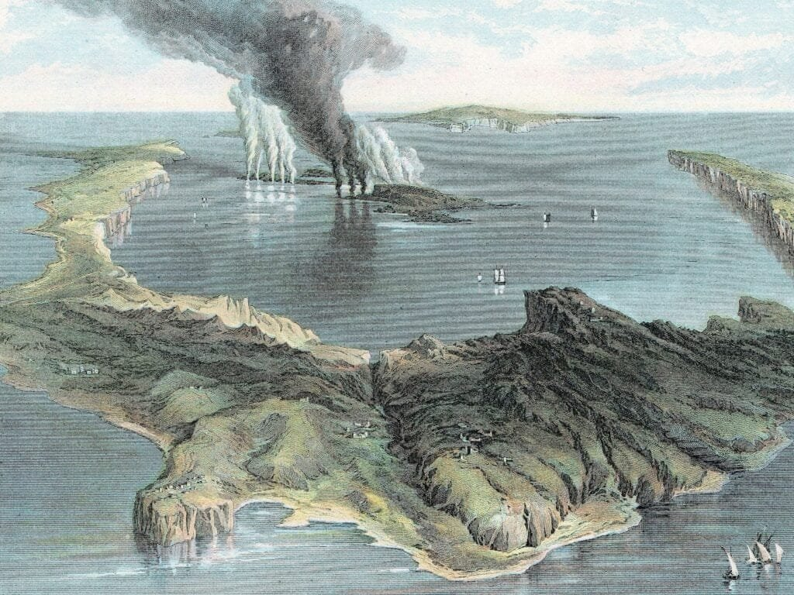

Imagine living in a peaceful coastal settlement, surrounded by picturesque views of the ocean. Life seems idyllic until a devastating volcanic tsunami strikes, leaving destruction in its wake. The impact of volcanic tsunamis on these coastal communities is nothing short of catastrophic. As molten rock and debris escape from volcanoes, they can trigger powerful underwater explosions and displacements of water, leading to the formation of destructive tsunami waves. These waves crash upon the shores, engulfing everything in their path and causing widespread devastation. In this article, we will explore the reasons why volcanic tsunamis have such a devastating impact on coastal settlements, delving into the various factors that contribute to their destructive force.

<iframe width="560" height="315" src="https://www.youtube.com/embed/PPkBABO7y2M" frameborder="0" allow="accelerometer; autoplay; encrypted-media; gyroscope; picture-in-picture" allowfullscreen></iframe>

  

## Understanding Volcanic Tsunamis

[Volcanic tsunamis are destructive natural phenomena](https://magmamatters.com/understanding-volcanic-formation-a-comprehensive-guide/ "Understanding Volcanic Formation: A Comprehensive Guide") that can occur when a volcanic eruption triggers an underwater landslide or displaces a large volume of water. These tsunamis can cause significant damage to coastal settlements and pose a threat to human life.

### Definition and causes of volcanic tsunamis

A volcanic tsunami refers to a tsunami that is generated by volcanic activity. It occurs when the energy released from a volcanic eruption displaces water, creating powerful and destructive waves. The primary causes of volcanic tsunamis are volcanic explosions, [pyroclastic flows](https://magmamatters.com/the-environmental-impact-of-volcanic-eruptions-2/ "The Environmental Impact of Volcanic Eruptions"), and underwater landslides triggered by volcanic activity. These events can result in the rapid displacement of a large volume of water, leading to the formation of tsunamis.

### The role of tectonic plate movement in tsunami generation

Tectonic plate movement plays a crucial role in the generation of volcanic tsunamis. Volcanoes often occur at plate boundaries, where the movement of tectonic plates leads to the build-up of stress and pressure beneath the Earth's surface. When this pressure is released through a volcanic eruption, it can trigger an underwater landslide or displace a significant amount of water, resulting in a tsunami.

### How volcanic eruptions contribute to tsunamis

Volcanic eruptions can contribute to the formation of tsunamis through various mechanisms. During an explosive eruption, a large quantity of volcanic ash, rocks, and debris is ejected into the atmosphere, which can fall into the sea and displace water. This displacement causes the generation of tsunami waves. Additionally, volcanic explosions can trigger underwater landslides, which can also lead to the formation of tsunamis. The combination of these factors highlights the destructive potential of volcanic eruptions in generating tsunamis.

## Historical Evidence of Volcanic Tsunamis

Throughout history, there have been numerous accounts and archaeological evidence of devastating volcanic tsunamis. These events have had significant impacts on coastal settlements and have shaped the course of human history.

### Accounts of prominent volcanic tsunamis

There are several well-documented accounts of volcanic tsunamis throughout history. One of the most notable examples is the 1883 eruption of Krakatoa in Indonesia. The eruption triggered a series of tsunamis, reaching heights of up to 40 meters, which devastated coastal communities and resulted in the loss of thousands of lives.

Another significant volcanic tsunami event occurred in AD 79 when the eruption of Mount Vesuvius in Italy led to the destruction of the cities of Pompeii and Herculaneum. The eruption generated a massive tsunami that engulfed the coastal areas, causing widespread devastation.

### Archaeological evidence supporting volcanic tsunamis

Archaeological evidence has provided further support for the occurrence of volcanic tsunamis in the past. Excavations at ancient coastal settlements, such as Akrotiri in Santorini, Greece, have revealed layers of volcanic ash and marine sediment, indicating that these areas were affected by tsunamis triggered by volcanic eruptions.

Additionally, the discovery of marine fossils and sediment deposits inland, far from the current coastline, suggests that these areas were once underwater due to the effects of past volcanic tsunamis.

### Documented impacts on coastal settlements

The impacts of volcanic tsunamis on coastal settlements have been well-documented. These tsunamis can cause widespread destruction, resulting in the loss of lives, displacement of communities, and damage to infrastructure. Coastal cities and towns are particularly vulnerable to the devastating effects of these tsunamis, as the abrupt and powerful waves can rapidly inundate low-lying areas and cause extensive damage.

This image is property of coastalcare.org.

## Geographic Regions prone to Volcanic Tsunamis

Volcanic tsunamis can occur in various regions around the world. Understanding the global distribution of active [volcanoes](https://magmamatters.com/geothermal-energy-and-its-volcanic-origins/ "Geothermal Energy and Its Volcanic Origins") and the geography of these areas can help identify regions that are more prone to volcanic tsunamis.

### Global distribution of active volcanoes

Active volcanoes are found in many parts of the world, primarily along plate boundaries and hotspot regions. The Pacific Ocean region, known as the "Ring of Fire," is particularly prone to volcanic activity and the formation of tsunamis. This region encompasses the coasts of countries such as Japan, Indonesia, the Philippines, and Chile, among others.

However, active volcanoes can also be found outside the Ring of Fire, such as in Italy (Mount Etna and Stromboli) and Iceland (Eyjafjallajökull and Katla). Understanding the global distribution of active volcanoes helps identify areas that may be at higher risk of volcanic tsunamis.

### Overview of the 'Ring of Fire'

The "Ring of Fire" is a major area in the basin of the Pacific Ocean where a large number of earthquakes and volcanic eruptions occur. The Pacific Plate and several other smaller tectonic plates meet along the Ring of Fire, leading to intense volcanic and seismic activity.

The Ring of Fire includes subduction zones, where one tectonic plate is forced beneath another, resulting in powerful volcanic eruptions and the potential for tsunamis. The frequent occurrence of volcanic activity in this region makes it one of the most prone areas for volcanic tsunamis.

### Coastal cities at risk due to proximity to volcanoes

Coastal cities located in close proximity to active volcanoes face a higher risk of volcanic tsunamis. For example, cities like Jakarta in Indonesia, Manila in the Philippines, and Tokyo in Japan are situated near active volcanoes and are at risk of experiencing the destructive effects of volcanic tsunamis. These cities, along with many others, have implemented strict disaster preparedness measures to mitigate the potential impacts of volcanic tsunamis.

## Mechanics of Volcanic Tsunamis

Understanding the mechanics of volcanic tsunamis is crucial for assessing their potential impacts and developing effective mitigation strategies. Various physical and chemical factors come into play, including the viscosity of lava, gas content, and the dynamics of wave propagation.

### Physical and chemical factors that influence volcanic tsunamis

The viscosity of lava and the gas content of volcanic eruptions play important roles in the generation and propagation of tsunamis. Highly viscous lava tends to trap more gas bubbles, resulting in explosive eruptions that can displace a larger volume of water and generate more powerful tsunamis.

The composition of volcanic gases, such as [sulfur dioxide and carbon](https://magmamatters.com/the-art-and-science-of-volcano-monitoring/ "The Art and Science of Volcano Monitoring") dioxide, can also influence the explosiveness of eruptions. Higher gas concentrations can lead to more violent eruptions, increasing the likelihood of generating tsunamis.

### Role of lava viscosity and gas content

The viscosity of lava determines its ability to flow. Less viscous lava, such as basaltic lava found in shield volcanoes, tends to flow more easily, resulting in less explosive eruptions. Conversely, highly viscous lava, like andesitic or rhyolitic lava, can create explosive eruptions with significant gas releases.

The gas content in volcanic eruptions affects the explosivity and volume of ejected materials. Higher gas content allows for more explosive eruptions, increasing the risk of triggering tsunamis.

### Dynamics of wave propagation from volcanic eruptions

When a volcanic eruption displaces a large volume of water, it creates a disturbance that propagates outward as a series of waves. These waves can travel across vast distances, potentially reaching coastlines and causing devastating tsunamis.

The dynamics of wave propagation are influenced by various factors, including the depth of the water, the energy released by the eruption, and the underwater topography. As the waves approach the coast, they can undergo amplification or attenuation depending on the local conditions, further affecting the intensity of the resulting tsunami.

This image is property of i.natgeofe.com.

## Impact on Human Settlements

Volcanic tsunamis have significant impacts on coastal communities, causing immediate and long-term effects on human settlements. Understanding these impacts is crucial for developing strategies to mitigate risks and enhance resilience.

### Immediate effects of volcanic tsunamis on coastal communities

The immediate effects of volcanic tsunamis on coastal communities can be catastrophic. The sudden arrival of powerful waves can lead to the loss of lives, injuries, and the destruction of buildings and infrastructure. Coastal communities reliant on fishing or tourism may suffer severe economic losses as their livelihoods are disrupted.

Evacuation and search-and-rescue efforts become critical in the aftermath of a volcanic tsunami, as survivors may be stranded or trapped in debris. The immediate response and coordination of emergency services are essential in minimizing further loss of life and providing aid to affected communities.

### Long-term impact on human societies

The long-term impact of volcanic tsunamis on human societies can be far-reaching. The displacement of communities and the destruction of infrastructure can have lasting socioeconomic and psychological effects. Displaced individuals may struggle to find new homes and secure their livelihoods, leading to increased vulnerability and poverty.

The loss of cultural heritage sites and the disruption of traditional ways of life can also have profound impacts on affected communities. Collaboration between government authorities, humanitarian organizations, and local communities is crucial in supporting long-term recovery efforts and ensuring the resilience of affected societies.

### Economic implications and setbacks

The economic implications of volcanic tsunamis can be significant. Coastal settlements heavily reliant on maritime activities, such as fishing and tourism, may experience a severe decline in economic activity. The destruction of docks, harbor facilities, and tourist infrastructure can take years to rebuild, leading to long-term setbacks for local economies.

The indirect economic impacts, such as the disruption of supply chains and trade routes, can also have regional or even global consequences. The loss of agricultural lands and fishing grounds can further exacerbate food insecurity and economic instability in the affected regions.

## Environmental Impact of Volcanic Tsunamis

Volcanic tsunamis not only impact human settlements but also have wide-ranging environmental effects. These tsunamis can cause changes in the land and seascape, affect marine and terrestrial ecosystems, and impact water quality and fisheries.

### Changes in land and seascape

The force of volcanic tsunamis can result in significant changes to the land and seascape. Coastal erosion, sediment deposition, and the reshaping of shorelines are common outcomes of these tsunamis. Entire coastlines can be altered, leading to the loss of habitats and changes in the distribution of plant and animal species.

The deposition of volcanic ash and sediment can also affect soil fertility, agricultural productivity, and the long-term stability of coastal ecosystems. The natural balance of the affected areas may take years or even decades to recover, depending on the severity of the environmental changes.

### Effects on marine and terrestrial ecosystems

Volcanic tsunamis have profound effects on marine and terrestrial ecosystems. The sudden influx of water can displace or destroy marine organisms, including coral reefs, seagrass beds, and mangrove forests. These habitats serve as critical breeding grounds and nurseries for various species, and their destruction can have cascading effects on biodiversity and fisheries.

On land, the deposition of volcanic ash and sediment can smother vegetation and disrupt terrestrial ecosystems. The loss of plant cover can lead to soil erosion, reduced water infiltration, and increased vulnerability to landslides. The recovery of these ecosystems depends on various factors, including the resilience of the species and the availability of favorable environmental conditions.

### Impact on water quality and fisheries

Volcanic tsunamis can significantly impact water quality, particularly in coastal areas. The sedimentation caused by these tsunamis can result in turbid and contaminated waters, affecting the survival of marine organisms and posing risks to human health.

The destruction of fisheries infrastructure, such as fishing boats and aquaculture facilities, can lead to disruptions in the local fishing industry. The loss of fish populations and the reduced availability of seafood can have socio-economic implications, particularly in communities heavily dependent on fishing for sustenance and livelihoods.

This image is property of c.files.bbci.co.uk.

## Resilience and Survival Tactics

Throughout history, people living in volcanic-prone areas have developed survival strategies to cope with the threats posed by volcanic eruptions and tsunamis. These historical tactics, combined with modern techniques of forecasting and evacuation, contribute to the resilience of communities in the face of volcanic tsunamis.

### Historical survival strategies

Communities living in volcanic regions have developed various survival strategies throughout history. These strategies often involve a combination of traditional knowledge, cultural practices, and adaptation to the local environment. For example, indigenous communities in volcanic regions may have oral traditions and folklore that provide valuable information about the signs preceding volcanic eruptions.

Building settlements on higher ground or constructing structures resistant to volcanic ash and debris are also common historical survival strategies. The use of volcanic materials, such as lava stones, for construction can increase the resilience of buildings to volcanic activity and tsunamis.

### Modern techniques of forecasting and evacuation

Today, technology plays a crucial role in forecasting volcanic eruptions and tsunamis, allowing for timely evacuation and the mitigation of risks. Techniques such as seismic monitoring, gas emissions monitoring, and satellite imagery enable scientists to detect volcanic unrest and provide early warnings to vulnerable communities.

Evacuation plans and emergency response systems are crucial components of modern survival tactics. Governments and local authorities work closely with scientists and disaster management agencies to develop evacuation routes, establish evacuation centers, and educate communities about the necessary precautions during volcanic eruptions and tsunamis.

### Role of community preparedness

Community preparedness is essential for enhancing resilience and survival in volcanic-prone areas. Education and awareness programs play a vital role in providing communities with the knowledge and skills necessary to respond effectively to volcanic eruptions and tsunamis.

Building community resilience involves training local volunteers, establishing early warning systems, and conducting regular evacuation drills. It also includes the development of community-based response plans and the promotion of sustainable development practices that reduce vulnerability to volcanic hazards.

By actively engaging communities in disaster risk reduction and preparedness efforts, the overall resilience of coastal settlements in volcanic regions can be significantly improved.

## Technological Measures to Mitigate Risks

Technological advancements have greatly contributed to mitigating the risks posed by volcanic tsunamis. Advanced seismic detection systems, tsunami alert systems, and the use of geospatial technologies play key roles in risk mitigation and management.

### Advanced seismic detection systems

Seismic detection systems are crucial for monitoring volcanic activity and providing early warnings of potential eruptions. These systems consist of networks of seismometers that measure and record seismic waves caused by volcanic activity.

By analyzing the data from these seismometers, scientists can detect changes in volcanic activity patterns and make more accurate predictions about the potential occurrence of eruptions and associated tsunamis. This early warning is crucial in enabling timely evacuation and other mitigation measures.

### Tsunami alert systems

Tsunami alert systems play a critical role in mitigating the risks of volcanic tsunamis. These systems consist of a network of sensors placed in the ocean that detect changes in water levels and transmit data to a central monitoring station.

When a tsunami is detected, alerts can be sent to coastal communities, warning them of the impending danger. These alert systems are essential in providing communities with timely information, allowing them to initiate evacuation procedures and take necessary precautions.

### Role of geospatial technologies in risk mitigation and management

Geospatial technologies, such as satellite imagery and Geographic Information Systems (GIS), are valuable tools in risk mitigation and management. These technologies enable scientists to monitor volcanic activity, assess the vulnerability of coastal settlements, and develop evacuation plans.

Satellite imagery can provide real-time information on volcanic eruptions, allowing scientists to track ash plumes, monitor changes in volcanic activity, and assess the potential impacts on coastal areas. GIS allows for the integration of various data, such as topography, population density, and infrastructure, to develop hazard maps and evacuation routes.

By combining these technological measures, authorities can make informed decisions and implement effective strategies to protect coastal communities from the devastating impacts of volcanic tsunamis.

This image is property of scx2.b-cdn.net.

## Policy Guidelines and Regulation

Governments play a crucial role in disaster planning and providing policy guidelines and regulations to protect coastal communities from volcanic tsunamis. International efforts for volcanic tsunami surveillance and prediction also contribute to the global coordination of risk mitigation measures.

### Governmental roles in disaster planning

Governments have a responsibility to develop and implement disaster planning strategies that prioritize the safety and well-being of coastal communities. This includes formulating policies and regulations that address land-use planning, building codes, and infrastructure development in volcanic-prone areas.

Government agencies also play a key role in funding and supporting research on volcanic activity and tsunami generation. By investing in scientific studies and monitoring systems, governments can enhance their ability to forecast volcanic eruptions and issue timely warnings to at-risk communities.

### International efforts for volcanic tsunami surveillance and prediction

International collaboration is crucial in the surveillance and prediction of volcanic tsunamis. Organizations such as the United Nations Educational, Scientific and Cultural Organization (UNESCO) and its Intergovernmental Oceanographic Commission (IOC) work with countries to establish regional tsunami warning systems and coordinate monitoring efforts.

These international efforts allow for the sharing of scientific data, early warning capabilities, and best practices in risk mitigation. By working together, countries can enhance their collective resilience and response capacities to volcanic tsunamis.

### Key regulatory frameworks to protect coastal communities

Regulatory frameworks are essential for protecting coastal communities from the impacts of volcanic tsunamis. These frameworks may include legislation that governs land-use planning in volcanic-prone areas, building codes that ensure the construction of resilient structures, and guidelines for evacuation procedures and emergency response.

Regulatory frameworks also address post-disaster recovery and reconstruction, ensuring that affected communities receive the necessary support to rebuild and recover. By implementing and enforcing these regulations, governments can significantly reduce the risks associated with volcanic tsunamis and enhance the resilience of coastal settlements.

## The Future of Coastal Settlements in Volcanic Regions

As volcanic activity continues to pose risks to coastal settlements, the future of these communities in volcanic regions faces challenges and opportunities. Migration and displacement possibilities, adaption strategies for future survival, and weighing the pros and cons of settlement in volcanic-prone zones are key considerations.

### Migration and displacement possibilities

The increasing frequency and intensity of volcanic eruptions and tsunamis may result in migration and displacement of coastal populations in volcanic regions. As communities face heightened risks and challenges in these areas, individuals and families may choose or be forced to relocate to safer locations.

Migration and displacement, however, pose challenges of their own. Seeking new settlements away from familiar territories can disrupt social structures, cultural identity, and livelihoods. Appropriate planning and support systems are necessary to ensure the well-being and integration of displaced communities.

### Adaption strategies for future survival

Coastal settlements in volcanic-prone zones will need to develop adaptive strategies to ensure their future survival. These strategies may include the construction of resilient infrastructure, land-use planning that avoids high-risk areas, and the diversification of livelihoods to reduce dependency on sectors vulnerable to volcanic tsunamis.

Investment in early warning systems and disaster preparedness measures will be critical in minimizing the impacts of future volcanic tsunamis. Additionally, fostering community resilience through education, awareness campaigns, and capacity-building initiatives can create a culture of preparedness and increase the ability of communities to cope with and recover from disasters.

### Pros and cons of settlement in volcanic-prone zones

Settlement in volcanic-prone zones presents both advantages and disadvantages. Volcanic regions often have rich soils due to the deposition of volcanic ash, making them suitable for agriculture and supporting human habitation. These regions can also offer unique geological, ecological, and cultural heritage that attract tourism and contribute to local economies.

However, the risks associated with volcanic eruptions and tsunamis must be carefully considered. The potential for catastrophic events and the need for robust mitigation measures can present significant challenges for coastal settlements. Balancing the benefits and risks is crucial in making informed decisions about settlement in volcanic-prone zones.

In conclusion, understanding volcanic tsunamis and their potential impacts on coastal settlements is crucial for assessing risks, developing effective mitigation strategies, and ensuring the resilience of communities. Through the integration of historical evidence, geographical analysis, knowledge on the mechanics of tsunamis, and a focus on human and environmental impacts, comprehensive policies, technological measures, and community resilience can be fostered to protect coastal settlements in volcanic regions. With continued research, planning, and cooperation at local, national, and international levels, the future of coastal settlements can be better equipped to handle the challenges posed by volcanic tsunamis.

