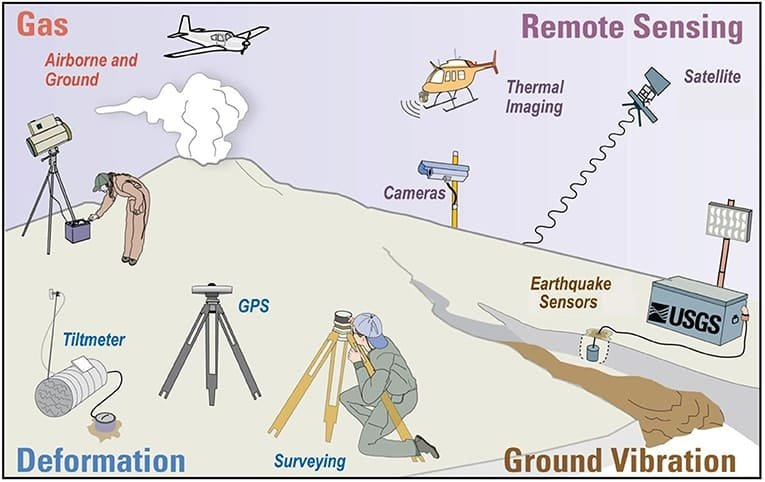
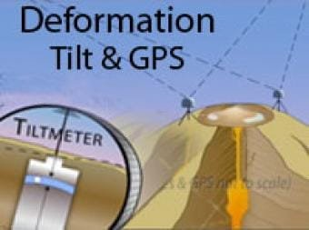
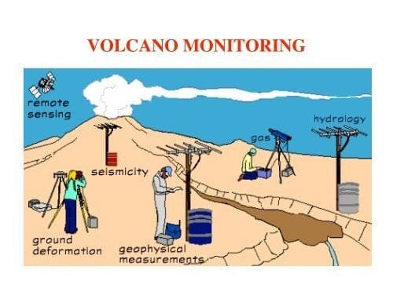

In the world of volcano monitoring, there are various techniques that scientists use to study and understand these powerful natural phenomena. From satellite observations to ground-based measurements, each method provides valuable insights into the behavior and potential hazards of volcanoes. By analyzing seismic activity, gas emissions, and ground deformation, scientists can track changes in volcanic activity, predict eruptions, and mitigate risks to surrounding communities. This article explores the different monitoring techniques used by experts in the field, shedding light on the fascinating world of volcano research. So, if you've ever been curious about how volcanoes are monitored and what goes on behind the scenes, read on to discover the exciting world of volcano monitoring techniques.

This image is property of d9-wret.s3.us-west-2.amazonaws.com.

## Seismic Monitoring

Seismic monitoring plays a crucial role in [understanding volcanic](https://magmamatters.com/understanding-volcanic-formation-a-comprehensive-guide/ "Understanding Volcanic Formation: A Comprehensive Guide") activity. By using seismometers, scientists can record the earthquakes induced by volcanoes. These earthquakes are typically caused by the movement of magma beneath the Earth's surface. Seismometers detect the vibrations and ground movements associated with these volcanic earthquakes, providing valuable data about the underground activity.

Low-frequency earthquakes, in particular, are analyzed to track and monitor the inflating magma within a volcano. These earthquakes occur as magma rises and causes the surrounding rocks to fracture. By closely analyzing the characteristics and patterns of these low-frequency earthquakes, scientists can gain insights into the movement and behavior of magma, which can help in predicting and understanding volcanic eruptions.

Another important aspect of seismic monitoring is the detection of harmonic tremors. Harmonic tremors are continuous, rhythmic ground motions that are associated with the movement of magma. By analyzing the frequency and intensity of harmonic tremors, scientists can gain valuable information about the movement of magma beneath a volcano. This helps in assessing the potential for an impending eruption and understanding the dynamics of volcanic activity.

## Gas Measurements

Monitoring gas emissions from volcanoes is another important technique in volcano monitoring. Two major gases that are monitored are sulphur dioxide (SO2) and carbon dioxide (CO2). These gases are released by volcanoes during eruptions and can provide important insights into volcanic activity.

Sulphur dioxide emissions are monitored as it is a key indicator of volcanic activity. By measuring the amount of SO2 being released, scientists can assess the intensity of volcanic eruptions and the potential for further activity. Continuous monitoring of SO2 levels helps in early detection of volcanic unrest and the implementation of appropriate mitigation measures.

[Carbon dioxide emissions are also monitored](https://magmamatters.com/the-art-and-science-of-volcano-monitoring/ "The Art and Science of Volcano Monitoring") as they can provide valuable information about the magmatic activity beneath a volcano. Increased levels of CO2 can indicate the movement and degassing of magma, which is often a precursor to volcanic eruptions. By analyzing the trends and variations in CO2 emissions, scientists can track the changes in volcanic activity and better understand the underlying processes.

Advanced tools such as spectrometers are used to measure the concentration of gases in the volcanic plumes. These instruments can identify and quantify various gases present in the plume, allowing scientists to gain a comprehensive understanding of the volcano's behavior. In recent years, satellite-based monitoring has also become increasingly important in volcano gas monitoring. Satellites equipped with special sensors can detect and measure volcanic gases from space, providing a broader perspective and coverage of volcanic activity.

This image is property of www.nps.gov.

## Thermal Monitoring

Thermal monitoring involves recording and analyzing temperature changes associated with volcanic activity. This technique allows scientists to track the heat signature of volcanic processes and observe any variations that may indicate an impending eruption.

Thermal cameras are often used to record temperature changes on the surface of a volcano. These cameras can detect even subtle variations in temperature, providing valuable data for monitoring purposes. By capturing thermal images over time, scientists can identify any significant changes in heat distribution, which can help in predicting volcanic activity.

Satellite imagery is also employed in thermal monitoring. Specialized satellites equipped with thermal sensors can capture images of volcanoes from space, allowing scientists to monitor temperature changes over large areas. This remote sensing technique provides a broader perspective and helps in obtaining a comprehensive view of volcanic thermal activity.

One specific aspect of thermal monitoring is the monitoring of lava lakes. Lava lakes are bodies of molten lava that accumulate in the summit crater of a volcano. By monitoring the thermal energy emitted by these lava lakes, scientists can assess their stability and potential for eruptions. Thermal monitoring of lava lakes provides crucial insights into the behavior of magma within a volcano and helps in understanding its potential hazards.

## Visual Observations

Visual observations play a significant role in volcano monitoring, providing real-time information on volcanic activity. Various techniques, such as the use of webcams, aerial surveillance, and regular field visits, are employed for visual monitoring.

Webcams are strategically placed around active volcanoes to provide real-time footage of volcanic activity. These cameras capture images or video of the volcano's summit or crater, allowing scientists to monitor changes in volcanic features, such as the emission of gases, ash plumes, or lava flows. By continuously analyzing the webcam footage, scientists can detect any sudden changes or anomalies, which could indicate an impending eruption.

Aerial surveillance is conducted using drones and helicopters equipped with various imaging and sensing technologies. These aerial platforms allow scientists to capture high-resolution images and collect data on volcanic features that are inaccessible from the ground. Aerial surveillance provides detailed topographic information and allows for the identification of potential hazards, such as cracks or bulges on the volcano's surface.

Regular field visits are essential for close-up examinations and ground-based measurements. Scientists visit volcano sites to collect samples of volcanic rocks, measure gas emissions, and assess the overall condition of the volcano. These field visits provide essential data for understanding the current state of the volcano and assessing the potential risks to surrounding communities.

This image is property of www.frontiersin.org.

## Deformation Monitoring

Deformation monitoring involves the measurement and analysis of ground movements associated with volcanic activity. By tracking these movements, scientists can gain insights into the behavior and changes occurring within a volcano.

Tiltmeters and GPS (Global Positioning System) are commonly used tools for deformation monitoring. Tiltmeters can measure even small changes in the tilt or inclination of the ground, providing valuable indications of magma movement or deformation. GPS systems, on the other hand, can track the precise location coordinates of ground points over time, allowing scientists to detect and measure any horizontal or vertical displacements.

In addition to tiltmeters and GPS, InSAR (Interferometric Synthetic Aperture Radar) technology is also employed for deformation monitoring. InSAR uses radar sensors mounted on satellites to measure minute changes in ground surface elevation. By comparing multiple radar images taken at different times, scientists can create precise maps of ground deformation and monitor the expansion or contraction of volcanic surfaces.

Monitoring the bulges on the surface of a volcano is another important aspect of deformation monitoring. When magma accumulates beneath the volcano's surface, it can cause the surface to bulge or inflate due to the increased pressure. By regularly measuring the size and characteristics of these bulges, scientists can gain insights into the amount and movement of magma within the volcano.

## Geochemical Monitoring

Geochemical monitoring involves the analysis of various components in the volcanic system to detect changes that may indicate volcanic activity. This technique helps scientists understand the chemical processes occurring within a volcano and provides insights into its current and future behavior.

Analysis of water sources, such as streams and groundwater, helps in monitoring geochemical changes. Volcanic activity can alter the chemical composition of water sources, leading to changes in pH, temperature, and the presence of certain elements. By regularly testing water samples, scientists can track any abnormalities or fluctuations that could indicate an increase in volcanic activity.

Collection and testing of rock samples are also important in geochemical monitoring. Volcanic rocks contain valuable information about the composition and behavior of the magma beneath a volcano. By analyzing the chemical makeup of these rocks, scientists can identify any changes or anomalies that may suggest an increase or decrease in volcanic activity.

Emission rates of radon gas, a radioactive gas released during volcanic activity, are also monitored. Radon gas can escape through cracks in the Earth's surface, providing valuable clues about the movement and behavior of magma. By measuring the concentration and emission rates of radon gas, scientists can assess the level of volcanic activity and determine if an eruption is likely to occur.

Geochemical monitoring provides essential data for understanding volcanic processes and helps in predicting and mitigating potential hazards. By tracking changes in the chemical composition of various components within a volcanic system, scientists can gain insights into the underlying processes and make informed assessments of volcanic activity.

This image is property of www.iris.edu.

## Acoustic Monitoring

Acoustic monitoring involves the study of sound waves to detect signs of volcanic activity. By monitoring the acoustic signals emitted by volcanoes, scientists can gain important information about the processes occurring within and beneath a volcano.

Infrasound sensors are used to detect low-frequency acoustic signals that are usually inaudible to the human ear. These sensors are designed to pick up the infrasound waves generated by volcanic eruptions or the movement of magma. By analyzing the frequency, amplitude, and duration of these infrasound signals, scientists can assess the intensity and dynamics of volcanic activity.

Studying sound waves can reveal valuable information about volcanic processes. For example, the sound frequency of volcanic explosions can indicate the size and magnitude of the eruption. By correlating the frequency of sound waves with the observed volcanic activity, scientists can estimate the scale of the eruption and determine its potential hazards.

Acoustic monitoring of volcanoes complements other monitoring techniques, providing a unique perspective on volcanic activity. By capturing and analyzing the acoustic signals emitted by volcanoes, scientists can enhance their understanding of the ongoing processes and improve their ability to predict and monitor volcanic eruptions.

## Magnetotelluric Monitoring

Magnetotelluric monitoring involves the measurement and analysis of the Earth's electrical and magnetic fields to track volcanic phenomena. This technique helps in understanding the properties and behavior of crustal magma and provides insights into the size, depth, and filling state of magma chambers.

Measurement of the Earth's electrical and magnetic fields is done through a network of sensors placed in the vicinity of a volcano. These sensors record variations in the electromagnetic signals, which can indicate the presence and movement of magma. By analyzing these signals, scientists can map the conductive pathways of magma and gain insights into the overall structure of a volcanic system.

Magnetotelluric monitoring focuses on detecting conductivity changes in the crustal magma. Conductivity is an important property as it reflects the presence of molten material and the extent of its fluidity. By monitoring changes in conductivity, scientists can track the movement of magma within a volcano and assess the potential for volcanic activity.

Assessing the size, depth, and filling state of magma chambers is another key aspect of magnetotelluric monitoring. Magma chambers are reservoirs of molten rock beneath a volcano, and their characteristics can provide insights into volcanic behavior. By analyzing the electromagnetic signals and conductivity data, scientists can estimate the dimensions and conditions of magma chambers, helping in understanding the potential for eruptions.

Magnetotelluric monitoring is a complex technique that requires sophisticated instruments and data analysis. However, it provides valuable information about the subsurface dynamics of volcanic systems, enhancing our understanding of volcanic processes and aiding in the prediction and monitoring of volcanic activity.

This image is property of img.yumpu.com.

## Hydrologic Monitoring

Hydrologic monitoring involves observing changes in local waterways and monitoring the temperature and chemical composition of hot springs. By tracking these hydrological factors, scientists can gain insights into the behavior of a volcano and potential changes in its activity.

Changes in local waterways, such as rivers and streams, can indicate variations in volcanic activity. Volcanic eruptions can alter the flow patterns and characteristics of water bodies, leading to changes in water levels, temperature, and chemical composition. By monitoring these hydrological changes, scientists can assess the current state of a volcano and identify any anomalies that may suggest an increase in volcanic activity.

Hot springs, which are naturally occurring springs of hot water, are also monitored for changes in temperature and chemical composition. Hot springs often exist in volcanic areas and can provide important clues about the underlying volcanic processes. By regularly measuring the temperature and chemical properties of hot springs, scientists can track any variations that may indicate a change in the volcanic system.

Hydrologic monitoring helps in understanding the relationship between volcanic activity and water systems. By observing and analyzing the changes in local waterways and hot springs, scientists can gather valuable data about the behavior and dynamics of a volcano, aiding in the prediction and monitoring of volcanic eruptions.

## Gravity Monitoring

Gravity monitoring involves measuring changes in the gravity field caused by moving magma beneath a volcano. By tracking these changes, scientists can gain insights into magmatic processes and the structure of a volcano.

Measurements of changes in the gravity field are done using gravimeters, which are highly sensitive instruments that can detect even small variations in gravity. When magma moves beneath a volcano, it displaces mass, leading to changes in the gravitational pull in that area. By monitoring these changes, scientists can track the movement and accumulation of magma, providing valuable information about volcanic activity.

Gravity monitoring helps in understanding magmatic processes within a volcano, such as the ascent and accumulation of magma. By measuring changes in the gravity field over time, scientists can gain insights into the volume and movement of magma, aiding in the prediction and assessment of volcanic eruptions.

In addition to studying magmatic processes, gravity monitoring also provides information about the structure of a volcano. Different rock layers, magma chambers, and other underground features can have varying densities, which affect the gravity field. By analyzing the gravity data, scientists can infer the density distribution within a volcano, helping in the understanding of its subsurface structure.

Gravity monitoring is a valuable tool in volcano monitoring, providing essential data for understanding the behavior of magma and the overall structure of a volcano. By tracking changes in the gravity field, scientists can improve their predictions and assessments of volcanic activity.

