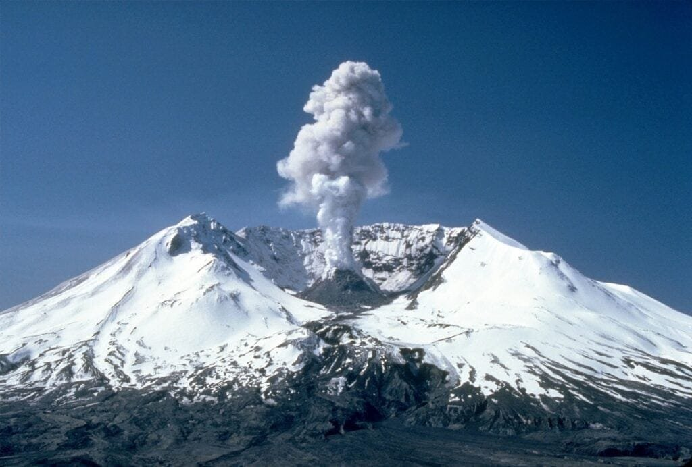

Volcanic ash, that seemingly innocuous gray powder, can pose a significant threat to airplanes. When an airplane comes into contact with volcanic ash, it can cause a range of problems, from engine failure to damaged navigational equipment. This is because volcanic ash contains tiny particles of glass and rock that are highly abrasive and can clog vital mechanical systems. In addition, the intense heat of a volcanic eruption can cause ash to melt and solidify on the airplane's exterior, which adds weight and disrupts the flow of air over the wings, reducing lift and increasing drag. The effects of volcanic ash on airplanes are not to be underestimated, and understanding the risks is crucial to ensuring aviation safety.

<iframe width="560" height="315" src="https://www.youtube.com/embed/dlN4NjqTGZs" frameborder="0" allow="accelerometer; autoplay; encrypted-media; gyroscope; picture-in-picture" allowfullscreen></iframe>

  

## Understanding Volcanic Ash

Volcanic ash is a critical component of volcanic eruptions, consisting of small rock fragments, mineral crystals, and volcanic glass. It is generated during explosive volcanic eruptions when magma is fragmented into fine particles upon contact with the atmosphere. The exact composition of [volcanic ash varies depending on the type of volcano](https://magmamatters.com/geothermal-energy-and-its-volcanic-origins/ "Geothermal Energy and Its Volcanic Origins") and the chemical composition of the erupted magma.

Formation and dispersion of volcanic ash depend on various factors, including the nature of the eruption, wind patterns, and the size of the erupted particles. During a volcanic eruption, ash can be injected into the atmosphere and carried over long distances by wind currents. The dispersal of ash can lead to the formation of volcanic plumes, which can reach high altitudes and travel thousands of kilometers from the source volcano.

Volcanic ash can take on different characteristics depending on the nature of the eruption. Explosive eruptions, characterized by high levels of gas and ash, can produce ash particles that are fine, jagged, and abrasive. These particles have a greater potential to cause damage to aircraft and affect their performance. On the other hand, effusive eruptions, which involve the relatively gentle release of lava, produce less ash and primarily consist of larger, denser particles.

## The Interaction between Volcanic Ash and Airplanes

When aircraft encounter a volcanic ash cloud, the first point of contact occurs when the aircraft flies into the ash plume. This initial contact can have immediate consequences for the aircraft's performance and safety. The abrasive nature of volcanic ash can cause severe damage to the airplane's exterior, affecting the paint, windscreens, windows, and carbon brakes.

Damage to the airplane's paint is a common occurrence when exposed to volcanic ash. The fine particles in the ash can scratch and chip the paint, leading to corrosion and degradation over time. This not only affects the aesthetics of the aircraft but also exposes it to further damage and reduces its resale value.

The impact on windscreens and windows is another concern when flying through volcanic ash. The high temperatures generated by the ash can cause the glass to become opaque, reducing visibility for pilots. Additionally, the abrasive nature of the ash can scratch the glass, compromising its structural integrity and potentially leading to cracks.

Volcanic ash can also pose significant risks to carbon brakes used in aircraft. The ash particles can accumulate on the brake surface, reducing their effectiveness and increasing the risk of overheating. This can result in reduced braking performance and potentially lead to accidents during landing and takeoff.

This image is property of pixabay.com.

## Turbojet Engine Damage

One of the most critical risks associated with volcanic ash encounters is the ingestion of ash particles by jet engines. When volcanic ash is drawn into the engine, it can cause a series of problems that affect engine performance and safety. The ash particles can melt upon contact with the high operating temperatures inside the engine, forming a sticky substance that can accumulate on various components.

The accumulation of melted ash inside the engine can lead to engine clogging and reduced airflow. This disrupts the proper functioning of the engine, affecting fuel combustion and causing a decrease in thrust output. In severe cases, the ingestion of volcanic ash can lead to engine flameout, where the engine stops producing thrust entirely.

Engine flameout poses a significant risk to the aircraft and its occupants, as it can result in a complete loss of power and an emergency situation. Restarting the engine in flight can be challenging, and the pilot may be forced to conduct a forced landing or deploy the aircraft's emergency systems.

## Impairment of Flight Instruments and Systems

Volcanic ash encounters can also impair the functioning of critical flight instruments and systems. The most notable impact is on the Pitot tubes, which are connected to the airspeed indicator and provide crucial information on the aircraft's speed. Ash particles can enter the Pitot tubes and obstruct the airflow, leading to incorrect readings and potentially causing errors in airspeed indication.

Furthermore, volcanic ash can disrupt radio communication systems, making it challenging for pilots to communicate with air traffic control and other aircraft. This can hinder the coordination of flight operations and pose safety risks, especially in congested airspace.

Volcanic ash can also have a negative effect on navigation systems, such as GPS and inertial navigation systems. Ash particles can interfere with signals and disrupt the accuracy of these systems, making it difficult for pilots to navigate and maintain the aircraft's intended flight path. This can lead to deviations from assigned routes and potentially cause conflicts with other aircraft.

This image is property of pixabay.com.

## Health Risks for Crew and Passengers

Inhalation of volcanic ash poses health risks for both the flight crew and passengers. Fine ash particles can be easily inhaled and deposited in the respiratory system, causing irritation and damage to the lungs. Prolonged exposure to volcanic ash can lead to respiratory problems, including bronchitis and asthma-like symptoms.

In addition to the physical particles, volcanic ash can also contain toxic gases such as [sulfur dioxide](https://magmamatters.com/the-art-and-science-of-volcano-monitoring/ "The Art and Science of Volcano Monitoring") and hydrogen sulfide. These gases can be released during volcanic eruptions and pose further health risks when inhaled. Exposure to toxic gases can cause respiratory distress, eye irritation, and even more severe effects on the central nervous system.

The impact on cabin air quality is a concern during volcanic ash encounters. Air filtration systems onboard aircraft are generally effective in removing contaminants, including volcanic ash particles. However, if the concentration of ash in the cabin is high, the effectiveness of the filtration system may be reduced. This can result in a decrease in air quality and potential health hazards for occupants.

## Impact on Flight Performance

Volcanic ash encounters can have detrimental effects on flight performance. The presence of ash in the atmosphere can reduce visibility, making it challenging for pilots to navigate and maintain situational awareness. This can lead to delays and diversions, affecting the efficiency of flight operations.

The ingestion of volcanic ash by jet engines can cause a decrease in engine performance. The accumulation of ash on engine components disrupts the airflow, reducing the engine's efficiency and resulting in reduced thrust output. This can lead to slower climb rates, longer takeoff distances, and increased fuel consumption.

The abrasive nature of volcanic ash can also cause damage to the aircraft's control surfaces, such as the wings and tail. The particles can erode the surface of these components, affecting their aerodynamic properties and leading to decreased maneuverability and stability.

This image is property of pixabay.com.

## Case Studies of Airplanes Encountering Volcanic Ash

Several notable cases have highlighted the dangers and consequences of airplanes encountering volcanic ash. In 1982, British Airways Flight 9, also known as the "Jakarta Incident," encountered a volcanic ash cloud from the eruption of Mount Galunggung in Indonesia. The ash caused all four engines to flame out, leading to a complete loss of power. Fortunately, the crew was able to restart the engines after descending to a lower altitude, and the aircraft landed safely.

In 1989, KLM Flight 867 flew into a volcanic ash cloud from the eruption of Mount Redoubt in Alaska. The ash severely damaged the aircraft's windshields, making it difficult for the pilots to see. The crew made an emergency landing, and all passengers and crew members safely evacuated the aircraft.

One of the most notable volcanic ash events in recent history was the eruption of Iceland's Eyjafjallajökull in 2010. The volcanic ash cloud from this eruption disrupted air travel across Europe for several days, causing widespread flight cancellations and delays. The ash particles posed a significant risk to aircraft engines, and aviation authorities implemented strict no-fly zones in affected areas to ensure safety.

## Mitigation Strategies

Mitigating the risks associated with volcanic ash encounters requires a multi-faceted approach. Airplane design modifications play a crucial role in minimizing the impact of volcanic ash. Aircraft manufacturers incorporate features such as engine inlet protection systems, which prevent ash particles from entering the engines. Improved materials and coatings are also being developed to enhance the aircraft's resistance to damage from volcanic ash.

Ash detection technologies have been developed to improve the identification and tracking of volcanic ash clouds. These technologies utilize satellite imagery, weather radar, and other measurement tools to detect the presence and location of ash plumes. This information can help aviation authorities and pilots make informed decisions regarding flight paths and the avoidance of volcanic ash.

Improved flight planning and rerouting protocols are essential for mitigating the risks associated with volcanic ash encounters. Airlines and pilots utilize real-time weather information and volcanic ash forecasts to plan alternate routes and avoid areas with high concentrations of ash. Effective communication between air traffic controllers, meteorologists, and pilots is crucial in ensuring the safe operation of flights in volcanic ash-prone regions.

## Legislation and Policy Response

The International Civil Aviation Organization (ICAO) has established regulations and guidelines to address the risks posed by volcanic ash encounters. The ICAO's volcanic ash-related provisions provide guidance on airspace management, flight operations, and aircraft certification. These regulations aim to ensure that aviation authorities, airlines, and pilots are equipped with the necessary tools and procedures to mitigate the risks associated with volcanic ash encounters.

National aviation authorities also play a vital role in developing policies and procedures to address volcanic ash risks. These authorities work in collaboration with meteorological agencies, aircraft operators, and other stakeholders to establish protocols for flight operations in areas affected by volcanic ash. The development of ash contingency plans and the dissemination of timely information are key components of effective policy responses.

Future policy considerations in the context of volcanic ash encounters include the need for improved ash detection and monitoring capabilities. Investments in research and development can further enhance the accuracy and timeliness of ash forecasts, enabling more effective decision-making by aviation authorities and pilots. Additionally, continued collaboration between international organizations, governments, and the aviation industry is crucial in developing standardized procedures and sharing best practices related to volcanic ash encounters.

In conclusion, understanding the composition, formation, and dispersion of volcanic ash is essential in comprehending the risks it poses to airplanes. The interaction between volcanic ash and aircraft can lead to significant damage to the airplane's exterior, engine, flight instruments, and systems. Furthermore, volcanic ash encounters can have adverse effects on the health of the crew and passengers and negatively impact flight performance. Mitigation strategies, such as airplane design modifications, ash detection technologies, and improved flight planning, are crucial in minimizing the risks associated with volcanic ash encounters. Legislation and policy responses at the international and national levels play a vital role in ensuring the safety of air travel in volcanic ash-prone regions. By understanding the potential hazards and implementing appropriate measures, the aviation industry can navigate the challenges posed by volcanic ash encounters and ensure the safety of passengers and crew.

