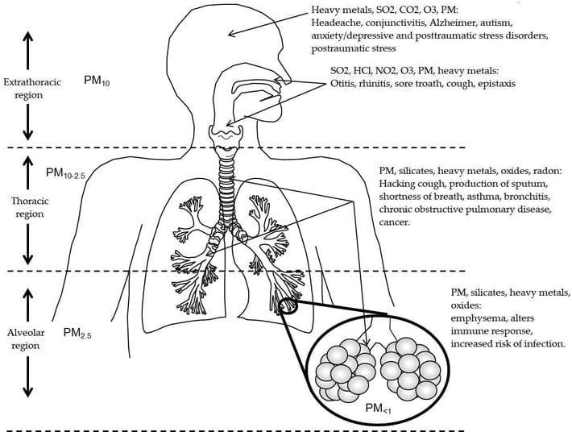
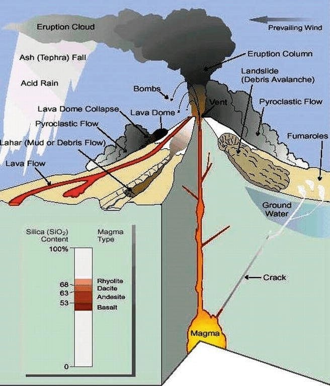
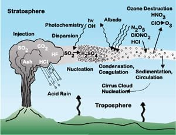
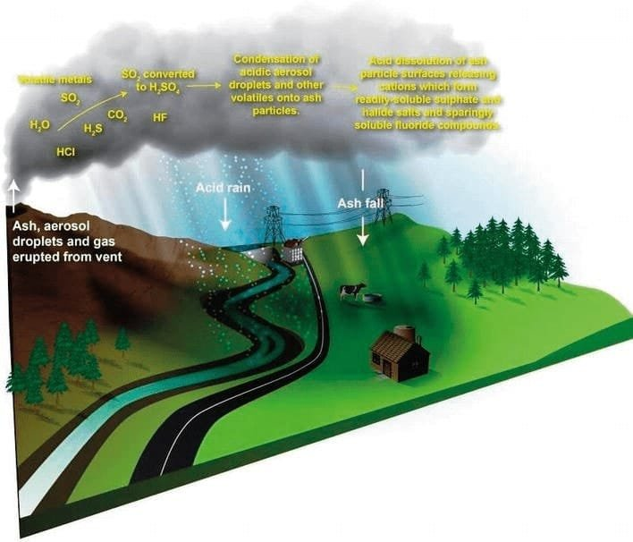

Have you ever wondered about the impact of volcanic gases on human settlements? Volcanoes, with their magnificent eruptions and stunning lava flows, have always been both awe-inspiring and dangerous. The gases emitted during volcanic eruptions, such as sulfur dioxide, carbon dioxide, and hydrogen sulfide, can have profound effects on the environment and on human health. In this article, we will explore the various ways in which volcanic gases can impact human settlements and the measures that can be taken to mitigate these effects. Whether you live near a volcano or simply have a fascination with the power of nature, understanding the consequences of volcanic gases is essential knowledge. So, let's dive in and broaden our understanding of this fascinating subject!

This image is property of cdnintech.com.

## Types of Volcanic Gases and Their Characteristics

### Identification of common volcanic gases such as water vapor, carbon dioxide, and sulfur dioxide

Volcanic gases are a mixture of different compounds that are released during volcanic eruptions. Some of the most common volcanic gases include water vapor, carbon dioxide, and sulfur dioxide. Water vapor is the most abundant volcanic gas, and its presence can often be seen as plumes of steam rising from an active volcano. [Carbon dioxide is also released in significant amounts during volcanic](https://magmamatters.com/geothermal-energy-and-its-volcanic-origins/ "Geothermal Energy and Its Volcanic Origins") eruptions and is a greenhouse gas that contributes to climate change. Sulfur dioxide is another common volcanic gas that has a strong odor of rotten eggs and can cause respiratory problems when inhaled.

### Discussion on rare gases like hydrogen and helium

In addition to the common volcanic gases mentioned above, there are also rare gases that can be found in volcanic emissions. These include gases such as hydrogen and helium. Hydrogen gas can be generated during volcanic eruptions through the reaction of magma with water, and it is highly flammable. Helium, on the other hand, is a noble gas that is released during volcanic activity. It is lighter than air and can rise rapidly into the atmosphere.

### The role of pressure and temperature in the composition of volcanic gases

The composition of [volcanic gases](https://magmamatters.com/understanding-volcanic-formation-a-comprehensive-guide/ "Understanding Volcanic Formation: A Comprehensive Guide") can vary depending on the pressure and temperature conditions within the volcano. Higher pressure can cause gases to dissolve into the magma, while lower pressure during an eruption allows the gases to escape more easily. Temperature also plays a role in determining which gases are released. For example, at higher temperatures, sulfur dioxide is more likely to be released, while at lower temperatures, carbon dioxide may dominate the gas emissions.

### Impact of the gas composition on the explosiveness of eruptions

The composition of volcanic gases can have a significant impact on the explosiveness of eruptions. Gases such as water vapor and carbon dioxide can contribute to eruptions becoming more explosive, as they expand rapidly when heated and provide the force to propel magma and volcanic fragments into the air. On the other hand, gases like sulfur dioxide can enhance the viscosity of magma, making it more difficult for gases to escape and potentially leading to less explosive eruptions. Understanding the gas composition of a volcano is therefore crucial for predicting its eruption behavior and assessing the potential risks to surrounding communities.

## Geographical Distribution of Volcanoes

### Understanding the 'Ring of Fire' and its volcanic activity

The 'Ring of Fire' is a major area in the basin of the Pacific Ocean where a large number of earthquakes and volcanic eruptions occur. It is a direct result of plate tectonics and the movement and collision of lithospheric plates. The 'Ring of Fire' includes several major subduction zones where one plate is forced under another, leading to the formation of explosive volcanoes. This region is known for its high volcanic activity and is home to over 75% of the world's active volcanoes.

### Analysis of volcanoes in rift zones

Rift zones are areas where the Earth's tectonic plates are moving apart, creating gaps that allow magma to rise to the surface and form volcanoes. These volcanic systems are characterized by relatively low explosive activity and are associated with the eruption of basaltic lava flows. The Mid-Atlantic Ridge and the East African Rift are examples of rift zones where volcanic activity is prominent.

### Comparison of shield volcanoes and their location on hotspots

Shield volcanoes are large, broad volcanoes with gentle slopes that are formed by the eruption of fluid basaltic lava. They are typically found on hotspots, which are areas where plumes of hot mantle material rise from deep within the Earth and generate volcanic activity. Examples of shield volcanoes include Mauna Loa in Hawaii and the Galapagos Islands. Shield volcanoes are known for their relatively non-explosive eruptions and can be active for long periods of time.

### Evaluation of volcanic activity in relation to tectonic plates

The distribution of volcanic activity is closely related to the boundaries of tectonic plates. Volcanoes are commonly found along plate boundaries, where the movement and interaction of plates allow magma to rise to the surface. The three main types of plate boundaries where volcanoes occur are subduction zones, where one plate is forced beneath another; divergent boundaries, where plates pull apart; and transform boundaries, where plates slide past each other. By studying the tectonic plates and their interactions, scientists can better understand and predict volcanic activity in specific regions.

<iframe width="560" height="315" src="https://www.youtube.com/embed/ia7PcET_cCo" frameborder="0" allow="accelerometer; autoplay; encrypted-media; gyroscope; picture-in-picture" allowfullscreen></iframe>

  

## Emission of Volcanic Gases and Its Impact on Air Quality

### How volcanic gases change the composition of the atmosphere

Volcanic gases released during eruptions can significantly alter the composition of the atmosphere. These gases contain various compounds, including sulfur dioxide, carbon dioxide, and water vapor. Sulfur dioxide, when released into the atmosphere, can react with other gases and particles to form aerosols, which can scatter sunlight and reduce visibility. Carbon dioxide, being a greenhouse gas, can contribute to global warming and climate change. Water vapor, on the other hand, can contribute to the formation of clouds and precipitation.

### Effect of volcanic gases on local and global air quality

The emission of volcanic gases can have both local and global impacts on air quality. Locally, volcanic gases can cause air pollution, leading to respiratory problems and other health issues for nearby communities. The gases can also contribute to the formation of smog and haze, reducing visibility and creating a general discomfort in the affected areas. Globally, the release of gases like carbon dioxide from volcanic eruptions adds to the overall concentrations of greenhouse gases in the atmosphere, contributing to the long-term effects of climate change.

### Volcanic smog or 'vog': composition and impact on humans and wildlife

Volcanic smog, often referred to as "vog," is a type of air pollution that occurs when volcanic gases mix with moisture and other substances in the atmosphere. Vog typically contains a mixture of sulfur dioxide, aerosols, and other gases, which can have a significant impact on human health and the environment. Inhaling vog can cause respiratory problems, including coughing, wheezing, and difficulty breathing. It can also have detrimental effects on wildlife, especially birds and marine life, which may come into contact with the pollutants through their natural habitats.

## Impact of Volcanic Gases on Water Supply

### How volcanic gases and ash contaminate surface water and groundwater

During volcanic eruptions, volcanic gases and ash can contaminate both surface water and groundwater sources. Volcanic ash is composed of small particles of rock and mineral fragments that can be carried by rainwater or wind and deposited in water bodies. These particles can clog and pollute water sources, making them unsuitable for human consumption and agricultural activities. Volcanic gases, such as sulfur dioxide, can also dissolve in water and create acidic conditions, further contributing to the degradation of water quality.

### Impact of acid rain caused by volcanic gases on water bodies

The release of volcanic gases, particularly sulfur dioxide, can lead to the formation of acid rain. When sulfur dioxide reacts with water vapor in the atmosphere, it forms sulfuric acid, which is then deposited onto the Earth's surface through rainfall. Acid rain can have detrimental effects on water bodies, including lakes, rivers, and streams. It can lower the pH of the water, making it more acidic and harmful to aquatic life. Acid rain also affects the chemistry of the soil, impacting plant growth and overall ecological health.

This image is property of cdnintech.com.

## Impact on Agricultural Activities

### Effect of volcanic gases on soil fertility and crop growth

Volcanic gases, when deposited onto the soil, can have both positive and negative effects on agricultural activities. On one hand, certain gases, such as sulfur dioxide, can provide nutrients to the soil, promoting fertility and enhancing crop growth. On the other hand, excessive amounts of gases and volcanic ash can have detrimental effects. The accumulation of ash on the soil surface can smother plants and hinder their access to sunlight. Additionally, the acidic nature of some volcanic gases can alter the pH of the soil, making it less suitable for certain crops.

### Damage caused by ash fall and acid rain to farms

Ash fall is a significant concern for agricultural activities in volcanic regions. The deposition of volcanic ash onto crops can damage plants by clogging stomata, inhibiting photosynthesis, and limiting their access to sunlight. Ash can also be abrasive and cause mechanical damage to plants, reducing crop yields. Acid rain resulting from the release of volcanic gases can exacerbate these effects, further impacting plant health and overall agricultural productivity. The combination of ash fall and acid rain can lead to severe economic losses for farmers and local communities.

### Long-term consequences for agriculture in regions prone to volcanic activity

In regions prone to volcanic activity, the long-term consequences for agriculture can be significant. While volcanic eruptions can enrich the soil with nutrients, they can also create unfavorable conditions for crop cultivation. The deposition of volcanic ash can render agricultural land unusable for an extended period of time. The acidity of volcanic gases and their impacts on soil chemistry can persist long after an eruption, requiring farmers to implement soil remediation strategies to restore fertility. The unpredictability of volcanic eruptions also poses risks to agricultural investments, making it challenging for farmers to plan and sustain their livelihoods.

## Health Impacts of Volcanic Gases

### Short and long-term health effects of exposure to volcanic gases

Exposure to volcanic gases can have both short-term and long-term health effects on individuals. Short-term effects include respiratory problems such as coughing, wheezing, and difficulty breathing. Eye irritation and skin rashes are also common symptoms. Prolonged exposure to volcanic gases can lead to more severe health issues, including chronic respiratory conditions such as asthma and bronchitis. High concentrations of gases like sulfur dioxide can cause lung inflammation and damage. It is important for individuals living in volcanic regions to take necessary precautions and seek medical attention if experiencing any health-related symptoms.

### Impact of volcanic gases on respiratory conditions

Volcanic gases, particularly sulfur dioxide and certain aerosols, can have a significant impact on respiratory conditions. Inhaling these gases can irritate the airways, leading to asthma attacks and exacerbating symptoms in individuals with pre-existing respiratory conditions. The fine ash particles in volcanic emissions can also be inhaled deep into the lungs, causing irritation and inflammation. People living near active volcanoes or in areas affected by volcanic eruptions should be aware of the potential respiratory risks and take appropriate measures to protect their health.

### Psychological stresses and health impacts related to volcanic eruptions and gas emissions

Volcanic eruptions and gas emissions can have significant psychological impacts on individuals and communities. The uncertainty and fear associated with volcanic activity can lead to heightened anxiety, stress, and even post-traumatic stress disorder (PTSD) in some cases. The disruption of normal daily activities, displacement from homes, and loss of property can also contribute to emotional distress. Communities affected by volcanic eruptions may experience social and economic disruptions, impacting mental health and overall well-being. It is important for affected individuals to seek support from mental health professionals and local support networks during and after volcanic events.

This image is property of pubs.usgs.gov.

## Structural Damage to Human Settlements

### The impact of volcanic gases and associated acid rain on infrastructure

Volcanic gases and acid rain resulting from volcanic eruptions can cause significant damage to human settlements and infrastructure. Acid rain can corrode buildings, bridges, and other structures, causing deterioration and weakening of materials over time. Metal structures, such as roofs and electrical systems, are particularly vulnerable to the corrosive effects of acid rain. The release of gases like sulfur dioxide can also damage infrastructure, as they can react with moisture in the air to form sulfuric acid, which can eat away at concrete, metal, and other building materials.

### Damage to homes and other buildings due to ash fall

Ash fall resulting from volcanic eruptions can also cause damage to homes and other buildings. The weight of ash on roofs and other structures can lead to collapse or structural instability. Ash can also clog ventilation systems, causing damage to HVAC systems and reducing indoor air quality. Additionally, the abrasive nature of ash can scratch and damage windows, leading to costly repairs. The impact of ash fall on buildings depends on the proximity to the volcano and the amount of ash ejected during the eruption.

### Long-term implications for urban planning and construction in volcanic regions

The presence of volcanoes in certain regions necessitates careful urban planning and construction practices to mitigate the potential risks associated with eruptions and [volcanic gases](https://magmamatters.com/the-environmental-impact-of-volcanic-eruptions-2/ "The Environmental Impact of Volcanic Eruptions"). Building codes and regulations should consider the structural resilience needed to withstand volcanic hazards, such as ash fall and acid rain. Designing buildings with appropriate roofing materials and ventilation systems can help minimize damage from ash fall and improve indoor air quality. Long-term urban planning should also take into account the potential for future volcanic eruptions and prioritize the safety of residents living in volcanic regions.

## Economic Impact of Volcanic Gas Emissions

### Cost of damage to properties and infrastructure

Volcanic gas emissions can result in significant economic losses due to the damage inflicted upon properties and infrastructure. The corrosive effects of volcanic gases and acid rain can deteriorate buildings, bridges, and roads, requiring costly repairs and maintenance. The weight of volcanic ash on roofs and structures can lead to structural damage, necessitating extensive renovations. The economic impact of volcanic gas emissions is particularly felt by homeowners, businesses, and local governments, who bear the financial burden of reconstruction and infrastructure development.

### Economic losses in agriculture and related sectors

Agriculture is one of the sectors most affected by volcanic gas emissions. The deposition of ash on crops can lead to significant losses in agricultural productivity, as it inhibits photosynthesis, damages plant tissue, and decreases crop yields. Farmers may also face challenges in marketing their produce due to contamination concerns. Additionally, the impact of volcanic emissions on water sources can further hinder agricultural activities by degrading soil fertility and limiting water availability. The economic losses sustained by the agriculture and related sectors can have long-term effects on local economies and livelihoods.

### Impact on tourism and other local industries

Volcanic eruptions and associated gas emissions can have a profound impact on tourism and other local industries. Many regions with active volcanoes rely heavily on tourism as a source of income. However, eruptions and the resulting effects such as ash fall, acid rain, and air pollution can deter visitors and lead to a decline in tourist arrivals. Local businesses, including hotels, restaurants, and tour operators, experience decreased revenue and potential long-term impacts on their operations. Other industries, such as mining and geothermal energy, can also be adversely affected by volcanic activity, further impacting the local economy.

### Cost of public health interventions

Public health interventions in response to the impacts of volcanic gas emissions can be costly. The provision of medical services to residents affected by respiratory problems and other health issues requires the allocation of resources and personnel. Public health campaigns to educate communities on the risks of volcanic gas exposure and promote preventive measures can also incur expenses. Rehabilitation and mental health support for individuals and communities affected by volcanic events are additional costs that need to be considered. The overall cost of public health interventions can have a significant financial impact on local governments and health care systems.

This image is property of cdnintech.com.

## Role of Early Warning Systems and Preparedness Plans

### Importance of monitoring volcanic gas emissions for predicting eruptions

Early warning systems that monitor volcanic gas emissions play a crucial role in predicting eruptions and mitigating the risks to surrounding communities. By continuously monitoring the composition and concentration of volcanic gases, scientists can detect changes that may indicate an imminent eruption. The detection of increased gas emissions, such as a rise in sulfur dioxide levels, can provide valuable information for evacuation and emergency response planning. Timely warnings can save lives, facilitate preparedness measures, and minimize the impact of volcanic eruptions on human settlements.

### Development and effectiveness of emergency response plans

The development and implementation of effective emergency response plans are vital for managing the impacts of volcanic gas emissions on human settlements. These plans should encompass evacuation procedures, communication strategies, and coordination among relevant agencies and stakeholders. Early warning systems and monitoring networks contribute to the effectiveness of emergency response plans by providing timely information. Regular drills and exercises to test the response capabilities of communities and emergency responders are essential for ensuring preparedness and enhancing the effectiveness of emergency response efforts.

### Role of community education in disaster preparedness

Community education plays a critical role in disaster preparedness and response to volcanic gas emissions. By educating individuals about the risks associated with living near [volcanoes and the potential health impacts of volcanic gases](https://magmamatters.com/the-art-and-science-of-volcano-monitoring/ "The Art and Science of Volcano Monitoring"), communities can be better equipped to make informed decisions and take appropriate measures to protect themselves. Educational programs can focus on the recognition of warning signs, evacuation procedures, and methods to minimize exposure to volcanic gases. Public campaigns and outreach initiatives can also promote community resilience and encourage the adoption of preventive measures before, during, and after volcanic events.

## Mitigation Strategies and Adaptation to Living Near Volcanoes

### Structural adaptations to minimize damage from volcanic gas emissions

Structural adaptations can help minimize the damage caused by volcanic gas emissions to human settlements. Building designs should take into account the potential hazards associated with eruptions, such as ash fall, acid rain, and the corrosive effects of volcanic gases. Using materials that are resistant to corrosion and developing roofing systems that can withstand the weight of ash are important considerations. Adequate ventilation systems can help reduce indoor air pollution and improve indoor air quality. Retrofitting existing infrastructure to meet these standards can enhance the resilience of settlements in volcanic regions.

### Changes in farming practices in regions prone to volcanic activity

Farming practices in regions prone to volcanic activity may need to be adapted to mitigate the impacts of volcanic gases. Crop diversification and the use of resistant varieties can help farmers minimize losses caused by ash fall and changes in soil fertility. Implementing soil conservation practices, such as erosion control measures, can protect agricultural land from ash deposition and maintain soil fertility. Timely irrigation practices can also be employed to reduce the impact of volcanic gases on water availability and crop health. Effective land management strategies are crucial for ensuring agricultural sustainability in volcanic regions.

### Public health initiatives for prevention and management of health impacts

Public health initiatives are essential for preventing and managing the health impacts of volcanic gas emissions. Regular monitoring of air quality, particularly the concentrations of volcanic gases, can help identify areas at higher risk. Public health campaigns can educate individuals on the importance of respiratory protection measures, such as the use of masks during volcanic events. Accessible healthcare services and medical support systems should be in place to address respiratory conditions and other health issues resulting from exposure to volcanic gases. Psychological support for affected individuals and communities is also critical for their overall well-being.

### Government policies and planning for safer settlements near volcanoes

Government policies and planning play a crucial role in ensuring safer settlements near volcanoes. Comprehensive land-use planning should consider the risks associated with living in volcanic regions, including volcanic gas emissions. Restricting development in high-risk areas and establishing appropriate buffer zones around volcanoes can minimize the exposure of human settlements to volcanic hazards. Building codes and regulations should address the specific requirements for structures in volcanic regions, considering the corrosive effects of volcanic gases and the risk of ash fall. Adequate funding and resources should be allocated for monitoring, research, and emergency response efforts. By integrating volcanic risk assessments into policy frameworks, governments can enhance the safety and resilience of settlements near volcanoes.

In conclusion, the impact of volcanic gases on human settlements is multifaceted and encompasses various aspects, including air quality, water supply, agriculture, health, infrastructure, and the economy. Understanding the types of volcanic gases, their characteristics, and the geographical distribution of volcanoes is crucial for assessing the risks and implementing appropriate mitigation and adaptation strategies. Early warning systems, preparedness plans, and community education play vital roles in reducing the impacts of volcanic gas emissions on human settlements. By implementing these measures and adopting sustainable practices, communities living near volcanoes can better navigate the challenges and harness the benefits of living in these dynamic environments.

