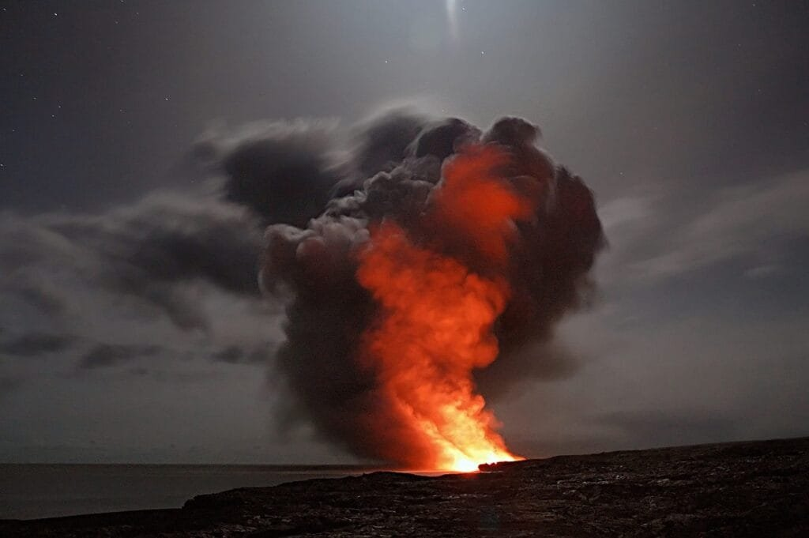

Let's take a journey deep into the fascinating world of volcanoes! This article will give you a captivating overview of the formation and eruption patterns of these majestic natural wonders. Volcanoes form when molten rock, gases, and debris find their way to the earth's surface, resulting in explosive eruptions of lava and ash. They can be found along plate boundaries, hotspots beneath the earth's crust, or rift zones where tectonic plates are moving apart. From the fiery volcanoes encircling the Pacific Ocean's "Ring of Fire" to the gradual growth of shield volcanoes in Hawaii, each type offers a unique spectacle. Understanding the different eruption patterns, such as those influenced by lava viscosity and gas content, can help predict future volcanic activity and protect the communities living in volcanic regions. So, prepare to be amazed as we uncover the secrets of these geological marvels!

<iframe width="560" height="315" src="https://www.youtube.com/embed/Fq8NtkPOzfA" frameborder="0" allow="accelerometer; autoplay; encrypted-media; gyroscope; picture-in-picture" allowfullscreen></iframe>

  

## Understanding Volcanic Formation

Volcanic formations are a fascinating natural phenomenon that has captivated humans for centuries. Understanding how volcanoes are formed requires an exploration of their underlying mechanisms and the contributing factors that lead to their formation.

### Source of magma and heat

At the core of volcanic formation lies the source of magma and heat. Magma, which consists of molten rock, is generated deep within the Earth's mantle. This molten rock is driven upwards towards the surface due to the intense heat present in the mantle. The heat responsible for melting rock and generating magma primarily comes from radioactive decay and residual heat from the formation of the Earth billions of years ago.

### Role of tectonic plates

Tectonic plates play a crucial role in the formation of volcanoes. These rigid pieces of the Earth's lithosphere are constantly moving and interacting with one another. Volcanoes are most commonly formed at plate boundaries where these plates converge or diverge.

Where plates converge, a process known as subduction occurs. In subduction zones, one tectonic plate is forced beneath another, leading to the formation of a deep oceanic trench. As the subducting plate sinks into the mantle, it begins to melt due to the increase in temperature and pressure. This melted rock, or magma, then rises towards the surface, eventually leading to volcanic eruptions.

In contrast, volcanoes can also form at divergent plate boundaries. These boundaries occur when two plates move away from each other, creating a gap in the Earth's crust. Magma from the mantle rises to fill this gap, resulting in the formation of new crust and volcanic activity.

### Role of 'hot spots'

While tectonic plate boundaries are the primary sites of volcanic activity, there are also instances where volcanoes form away from these boundaries, known as 'hot spots.' Hot spots are areas where an intense upward stream of magma occurs due to a localized concentration of heat in the mantle. These hot spots are often associated with mantle plumes, which are long, cylindrical columns of hot rock that rise from the deep mantle towards the surface.

Hot spot volcanism can create a chain of volcanic islands, such as the Hawaiian Islands. As the Pacific Plate moves over the stationary hot spot, it generates a sequence of volcanic islands, with the youngest island forming directly above the hot spot. This process has resulted in the formation of a volcanic trail, with each island becoming progressively older as it moves away from the hot spot.

### Factors contributing to volcano formation

Several factors contribute to the formation of volcanoes. The viscosity of magma plays a significant role in determining the shape and behavior of a volcano. Magma with low viscosity, meaning it flows easily, tends to result in shield volcanoes. These volcanoes have gentle slopes and are characterized by effusive eruptions, where lava flows steadily from the vent.

In contrast, magma with high viscosity, meaning it flows more slowly, leads to the formation of composite or stratovolcanoes. These volcanoes have steeper sides and are associated with explosive eruptions, where pressure builds up before being released in a violent explosion of ash, gases, and pyroclastic material.

The amount of gas content in magma also influences volcanic formation. Gas-rich magma is more likely to produce explosive eruptions, as the escaping gases can propel the magma with great force. In contrast, magma with lower gas content tends to result in less explosive eruptions, allowing the lava to flow more freely.

Understanding the complex interplay of these factors is crucial in comprehending the formation of volcanoes and predicting their behavior.

## Volcanic Eruption Mechanisms

Volcano eruptions are awe-inspiring displays of the Earth's raw power. The process leading up to an eruption involves a series of intricate mechanisms, influenced by the buildup of pressure and the release of gases.

### The process leading to eruption

Volcanic eruptions are complex events that typically begin with the accumulation of magma within a magma chamber deep beneath the Earth's surface. As magma continues to rise towards the surface, it often encounters pockets of trapped gases within the chamber.

The pressure in the magma chamber gradually builds, causing the magma to become highly pressurized. Eventually, the increasing pressure overcomes the strength of the surrounding rocks, leading to fractures and cracks that allow the magma to escape. This process is known as magma ascent.

Once the magma reaches the surface, it erupts in a variety of ways, depending on the specific characteristics of the volcano and the magma itself. These eruptions can range from relatively gentle, effusive eruptions, to highly explosive events that eject vast amounts of ash and volcanic gases.

### Why do volcanoes erupt?

Volcanoes erupt as a result of the interplay between pressure, gas content, and magma characteristics. As magma rises towards the surface, it encounters decreasing pressure, causing the dissolved gases within the magma to expand.

The release of this built-up pressure is what triggers an eruption. The sudden expansion of gases propels the magma upwards, leading to explosive eruptions. Additionally, the presence of volatile gases, such as water vapor and carbon dioxide, further contributes to the explosive nature of volcanic eruptions.

### The role of pressure and gases

Pressure plays a vital role in volcanic eruptions. The buildup of pressure within the magma chamber determines the intensity and explosivity of the eruption. Volcanoes with highly pressurized magma chambers are more likely to experience violent and explosive eruptions. Conversely, volcanoes with lower magma chamber pressures tend to have less explosive eruptions and allow magma to flow more freely.

The content of gases dissolved within the magma also plays a significant role in eruptions. Gases can become trapped within the magma as it rises to the surface, leading to an increase in pressure. These trapped gases can cause the magma to explode violently, propelling ash, gases, and pyroclastic material into the atmosphere.

Understanding the mechanisms behind volcanic eruptions is crucial for assessing the potential hazards associated with these natural phenomena and implementing effective mitigation strategies.

This image is property of pixabay.com.

## Different Types of Volcanoes

Volcanoes come in a diverse range of shapes and sizes, each with its unique characteristics. By examining different types of volcanoes, we can gain insight into their formation process and eruption patterns.

### Shield volcanoes

Shield volcanoes are aptly named due to their resemblance to a warrior's shield lying on the ground. These volcanoes have a broad, gently sloping profile and are primarily composed of layers of lava flows. Shield volcanoes are typically formed by the eruption of low-viscosity magma, which allows the lava to flow long distances before solidifying.

These types of volcanoes are characterized by effusive eruptions, where lava flows steadily from the vent and spreads outwards, creating a broad, shield-like shape. Due to their low explosivity, shield volcanoes are generally not associated with large pyroclastic explosions. Instead, they provide a remarkable display of flowing lava and are often considered relatively safe for observation.

One famous example of a shield volcano is Mauna Loa in Hawaii. Mauna Loa is one of the largest volcanoes on Earth, rising approximately 13,678 feet (4,169 meters) above sea level. Its gentle slopes and effusive eruptions have made it one of the most studied and monitored volcanoes in the world.

### Cinder cone volcanoes

[Cinder cone](https://magmamatters.com/the-birth-of-new-land-understanding-cinder-cones/) volcanoes, also known as scoria cones, are small, steep-sided volcanoes that form from the accumulation of volcanic debris. These volcanoes are often formed from explosive eruptions of gas-rich magma, which ejects fragments of magma into the air. These fragments, known as cinders or scoria, solidify and fall back to the ground, building up the cone-shaped structure.

Cinder cone volcanoes are relatively short-lived compared to other types of volcanoes. They tend to form and erupt over brief periods of time, with the majority of their activity occurring within a few months or years. These volcanoes are found all over the world, often dotting the landscapes with their distinctive cone shapes.

One notable example of a cinder cone volcano is Parícutin in Mexico. Parícutin is famous for its rapid formation, starting with the eruption of a fissure in a farmer's cornfield in 1943. Over the course of nine years, Parícutin grew to a height of 1,345 feet (410 meters), leaving a lasting impact on the surrounding landscape.

### Composite or stratovolcanoes

Composite or stratovolcanoes are imposing and majestic structures that captivate with their sheer size and explosive eruptions. These volcanoes are composed of layers of lava, volcanic ash, and other pyroclastic materials, giving them a stratified appearance.

Composite volcanoes are typically formed by a combination of both effusive and explosive eruptions. These eruptions release a mixture of lava flows, pyroclastic material, and volcanic gases, creating distinct layers that build up over time.

Due to their explosive nature, composite volcanoes can pose significant hazards to surrounding regions. The explosive eruptions can send volcanic ash and pyroclastic flows cascading down the slopes, endangering nearby communities. Examples of composite volcanoes include Mount Fuji in Japan and Mount St. Helens in the United States.

### Lava domes

Lava domes, also known as volcanic domes, are unique volcanic features that result from the slow extrusion of viscous lava. Unlike other types of volcanoes, lava domes do not typically produce explosive eruptions. Instead, thick lava slowly oozes out of the vent and piles up, forming a dome-shaped structure.

Lava domes are characterized by their steep sides and thick, pasty lava. The slow movement of this type of lava allows it to pile up near the vent, forming a dome-shaped mass. Although not explosively hazardous, lava domes can still pose risks due to their potential to collapse and generate pyroclastic flows.

One notable example of a lava dome is the Soufrière Hills volcano in Montserrat. The eruption of this volcano since 1995 has resulted in the formation of a large lava dome within its crater, significantly impacting the surrounding communities.

[Understanding the different types of volcanoes](https://magmamatters.com/understanding-volcanic-formation-a-comprehensive-guide/ "Understanding Volcanic Formation: A Comprehensive Guide") provides us with a deeper appreciation of the incredible diversity and complexity of these geological features.

## Patterns of Volcanic Eruptions

Volcanic eruptions exhibit a wide range of patterns, each characterized by unique types of volcanic activity. By examining these eruption patterns, scientists can gain insight into the behavior and potential hazards associated with volcanoes.

### Effusive eruptions

Effusive eruptions are volcanic events characterized by the steady outflow of lava from the volcano's vent. These eruptions typically involve low-viscosity magma, which allows the lava to flow freely across the volcano's surface. Effusive eruptions are often associated with shield volcanoes.

During an effusive eruption, lava flows in channels or tubes, gradually advancing and covering the surrounding landscape. The lava can spread out over vast areas, creating new land and reshaping the existing topography. Although effusive eruptions are generally less explosive and more predictable than other types of volcanic activity, they can still pose risks to nearby communities.

Hawaii's Kilauea volcano is renowned for its effusive eruptions, with ongoing lava flows continuously shaping the island's landscape. Kilauea has experienced numerous eruptions over the years, resulting in the formation of expansive lava fields and new land near its coastal regions.

### Explosive eruptions

Explosive eruptions, as the name suggests, involve violent and sudden explosions of volcanic material. These eruptions are predominantly associated with composite or stratovolcanoes, which are composed of high-viscosity magma.

During an explosive eruption, pressure builds up within the magma chamber until it overcomes the strength of the surrounding rocks. This sudden release of pressure results in an explosive eruption, with a combination of ash, gases, and pyroclastic material ejected into the atmosphere.

The explosive nature of these eruptions can generate towering ash plumes that can travel vast distances. Volcanic ash poses a severe threat to aviation, as it can interfere with aircraft engines and navigation systems. In extreme cases, pyroclastic flows, which are fast-moving currents of hot gas and volcanic debris, can cascade down the slopes of the volcano, capable of devastating everything in their path.

The 1980 eruption of Mount St. Helens in the United States serves as a tragic reminder of the destructive power of explosive eruptions. The eruption resulted in the loss of numerous lives, extensive destruction of infrastructure, and the transformation of the surrounding landscape.

### Phreatomagmatic eruptions

Phreatomagmatic eruptions occur when water comes into contact with magma, resulting in a violent reaction. These eruptions often occur when magma reaches groundwater or interacts with bodies of water, such as lakes or the ocean.

The interaction between the hot magma and cool water causes the rapid expansion of steam, leading to a powerful explosion. The explosive nature of phreatomagmatic eruptions can produce plumes of ash, volcanic gases, and steam that can reach great heights.

Phreatomagmatic eruptions pose unique hazards due to the potential for widespread ashfall, which can disrupt air travel and harm respiratory health. Additionally, the interaction between magma and water can generate lahars, which are fast-moving mudflows capable of demolishing everything in their path.

The eruption of Krakatoa in 1883 serves as a striking example of a phreatomagmatic eruption. The explosion generated a tsunami that caused widespread destruction in coastal areas, resulting in the loss of thousands of lives.

Understanding the varying patterns of volcanic eruptions is crucial for assessing the associated risks and implementing effective measures to mitigate their potential impact.

This image is property of pixabay.com.

## Geographic Distribution of Volcanoes

Volcanoes are not randomly scattered across the Earth's surface. Instead, they exhibit distinct patterns of distribution, with certain regions experiencing a greater concentration of volcanic activity. Examining the geographic distribution of volcanoes provides crucial insights into the underlying tectonic processes and environmental conditions that contribute to their formation.

### The 'Ring of Fire'

One of the most prominent volcanic regions on Earth is the 'Ring of Fire,' encircling the Pacific Ocean. This vast stretch of volcanic activity is characterized by a high concentration of volcanoes and frequent seismic activity. The 'Ring of Fire' is associated with the Pacific Plate and several other tectonic plates interacting along their boundaries.

This region is notorious for its explosive and destructive volcanoes, with notable examples including Mount St. Helens in the United States, Mount Fuji in Japan, and Mount Pinatubo in the Philippines. The 'Ring of Fire' is also prone to powerful earthquakes, as the intense tectonic activity leads to frequent plate movements and the release of seismic energy.

### Mid-Atlantic Ridge

The Mid-Atlantic Ridge represents another significant volcanic region, stretching along the center of the Atlantic Ocean. This volcanic system forms as tectonic plates move apart, creating a gap in the Earth's crust. Magma from the mantle rises to fill this gap, resulting in the formation of new crust and volcanic activity.

The Mid-Atlantic Ridge is characterized by effusive eruptions and the creation of underwater volcanoes. These eruptions occur at lower depths, away from human populations. However, the volcanic activity in this region contributes to the continuous growth of the Atlantic Ocean and the spreading of the tectonic plates.

### African Rift Valley

The African Rift Valley is an intriguing example of a region characterized by intense volcanism. This geological feature extends over 6,000 kilometers, from the Middle East to Mozambique. The African Rift Valley is the result of two tectonic plates moving away from each other, leading to a separation of the Earth's crust.

As the plates diverge, magma rises to fill the gap, generating a series of volcanic structures along the valley. These volcanic formations include both shield volcanoes, such as Mount Kilimanjaro and Mount Kenya, and cinder cone volcanoes like Mount Longonot.

The African Rift Valley showcases the dynamic nature of Earth's tectonic activity and provides a unique opportunity to study the formation of volcanoes in real-time.

### Pacific island chains like Hawaii

Isolated volcanic islands, such as the Hawaiian Islands, are another intriguing manifestation of volcanic activity. These volcanic islands are typically located above stationary hot spots in the Earth's mantle, where intense upward streams of magma occur due to localized concentrations of heat.

As the tectonic plate moves over the stationary hot spot, a chain of volcanic islands is formed. Each island represents a distinct stage in the volcanic activity, with the youngest island forming directly above the hot spot. Hawaii, with its shield volcanoes and ongoing volcanic activity, serves as a prime example of this volcanic chain.

Understanding the geographic distribution of volcanoes provides valuable insights into the underlying tectonic forces and geologic processes that shape our planet. These volcanic regions are not only remarkable natural wonders but also present unique challenges and opportunities for scientific research.

## Influence of Volcanism on Crustal Thickness

Volcanism plays a significant role in shaping the Earth's crust, contributing to both thickening and thinning processes. Understanding how volcanoes influence crustal thickness is crucial for comprehending the dynamic nature of our planet's tectonic activity.

### Thickening of the crust

Volcanism can lead to the thickening of the Earth's crust in several ways. One of the primary mechanisms is through the accumulation of volcanic material over time. As volcanoes erupt and release lava, ash, and other pyroclastic materials, these deposits can gradually build up, adding to the overall thickness of the crust.

Furthermore, volcanic activity can cause the injection of magma into the surrounding rocks, leading to the formation of igneous intrusions. These intrusions can solidify and add additional mass to the crust, resulting in overall thickening.

The continuous buildup of volcanic materials and igneous intrusions can have long-lasting effects on the crustal thickness of regions that experience frequent volcanic activity. Over time, these mechanisms contribute to the geological evolution and shaping of the Earth's crust.

### Thinning of the crust

In contrast to thickening processes, volcanism can also play a role in the thinning of the Earth's crust. This thinning occurs primarily at divergent plate boundaries, where tectonic plates move apart, creating a gap in the Earth's crust. As the plates separate, magma rises to fill the void, forming new crust and contributing to the thinning of the existing crust.

The process of magma intrusion at divergent plate boundaries can lead to the formation of volcanic rift zones. These zones are characterized by a series of volcanic formations and associated tectonic structures. The presence of volcanic activity and the injection of magma contribute to the stretching and thinning of the crust in these regions.

Volcanism's influence on crustal thickness is a constant reminder of the dynamic nature of our planet's geology. The continuous interaction between volcanic processes and tectonic activity shapes the Earth's crust and provides insights into the forces that drive its evolution.

This image is property of pixabay.com.

## Common Indicators of Eruption

Predicting volcanic eruptions is a challenging task, but careful monitoring of various indicators can provide valuable insights into the likelihood and timing of eruptive events. These indicators, ranging from ground deformation to changes in gas emissions, are essential tools for volcanic monitoring and hazard assessment.

### Ground deformation

Ground deformation, or changes in the shape and elevation of the Earth's surface, can be a crucial indicator of volcanic activity. As magma rises towards the surface, it exerts pressure on the surrounding rocks, causing the terrain to deform.

Monitoring ground deformation involves using precise tools, such as GPS receivers and satellite-based radar systems, to measure the minute changes in the Earth's surface. By analyzing these measurements over time, scientists can detect signs of magma movement and potential volcanic unrest.

The combination of ground deformation data with other monitoring parameters, such as seismic activity and gas emissions, can provide a more comprehensive understanding of the ongoing volcanic activity.

### Increased seismic activity

Seismic activity, or the occurrence of earthquakes, is another vital indicator of volcanic events. Volcanic earthquakes are typically associated with the movement of magma beneath the Earth's surface. This movement generates stress and strain, ultimately leading to the release of accumulated energy in the form of earthquakes.

Monitoring seismic activity involves the use of seismometers, instruments that measure the ground motion caused by seismic waves. By analyzing the characteristics of these seismic waves, scientists can detect patterns and identify potential volcanic activity.

The location, depth, and frequency of earthquakes can provide valuable insights into the movement of magma and the potential for a volcanic eruption. However, not all earthquakes are directly linked to volcanic activity, so careful analysis and interpretation of the seismic data are crucial.

### Changes in gas emissions

The composition and quantity of volcanic gases emitted from a volcano can serve as critical indicators of its activity. As magma rises towards the surface, it releases gases, including water vapor, carbon dioxide, sulfur dioxide, and various other volatile compounds.

Monitoring gas emissions involves sampling the gases released by a volcano and analyzing their composition. This process can be achieved using a variety of methods, including ground-based sampling and remote sensing techniques.

Changes in gas emissions, such as an increase in the concentration of certain gases or the appearance of new gases, can indicate the arrival of fresh magma and an increased potential for volcanic activity. Continuous monitoring of gas emissions provides crucial information for assessing the current state of a volcano.

By combining data from ground deformation, seismic activity, and gas emissions, scientists can better understand the behavior of a volcano and the likelihood of an eruption. These indicators, when carefully analyzed and interpreted, play a vital role in volcanic hazard assessment and the protection of surrounding communities.

## Volcanic Hazards

Volcanic eruptions can unleash a multitude of hazards, posing risks to both human populations and the surrounding environment. Understanding these hazards is key to implementing effective preparedness and mitigation strategies.

### Pyroclastic flows

Pyroclastic flows are one of the most deadly and destructive hazards associated with volcanic eruptions. These superheated mixtures of ash, gas, and volcanic rock materials can travel at extremely high speeds, reaching temperatures of several hundred degrees Celsius.

Pyroclastic flows are highly destructive, capable of obliterating everything in their path. Buildings, vegetation, and even entire towns can be incinerated by the intense heat and force of a pyroclastic flow. The rapid onset and high mobility of these flows leave little time for evacuation, making them particularly hazardous.

Famous examples of devastating pyroclastic flow events include the eruption of Mount Vesuvius in 79 AD, which buried the cities of Pompeii and Herculaneum, as well as the 1991 eruption of Mount Pinatubo in the Philippines.

### Volcanic ash and gases

Volcanic ash and gases pose significant hazards during volcanic eruptions. Volcanic ash consists of tiny particles of rock, glass, and minerals that are ejected into the atmosphere during explosions. These particles can be hazardous to human health, causing respiratory issues and damaging machinery and infrastructure.

The fine particles of volcanic ash can remain suspended in the atmosphere for extended periods, leading to reduced visibility, grounding of aircraft, and respiratory problems for nearby populations. The accumulation of ash on roofs, power lines, and transportation infrastructure can further exacerbate the impacts of an eruption.

In addition to ash, volcanic gases released during eruptions can pose risks to human health. These gases, such as [sulfur dioxide and carbon](https://magmamatters.com/the-art-and-science-of-volcano-monitoring/ "The Art and Science of Volcano Monitoring") dioxide, can be toxic and cause respiratory problems, especially in areas close to the volcano.

### Lava flows

Lava flows are a well-known hazard associated with volcanic eruptions. These rivers of molten rock move relatively slowly compared to other volcanic hazards, allowing for greater predictability. However, their high temperatures and ability to incinerate anything in their path make them a significant concern.

Lava flows can pose risks to nearby communities, damaging or destroying infrastructure, agriculture, and property. Effusive eruptions, such as those associated with shield volcanoes, often produce lava flows that can persist for long periods, slowly altering the landscape.

One striking example of a destructive lava flow is the 2018 eruption of Kilauea in Hawaii. The eruption resulted in the destruction of hundreds of homes and the reshaping of the land as lava engulfed entire neighborhoods.

### Volcanic landslides and tsunamis

Volcanic landslides, also known as flank collapses, can occur during or after eruptions, particularly on steep volcanic slopes. The collapse of unstable volcanic edifices can trigger large landslides, generating devastating debris avalanches.

These landslides can rapidly travel downslope, burying communities and blocking rivers, resulting in localized flooding. The displaced material can also generate tsunamis if it enters the ocean or a large body of water.

One notable example is the 1883 eruption of Krakatoa, where a massive explosion and subsequent landslide triggered a tsunami that caused widespread destruction and loss of life in nearby coastal regions.

Understanding and mitigating volcanic hazards requires comprehensive monitoring, effective early warning systems, and robust emergency preparedness plans. By recognizing the potential risks associated with volcanic activity, communities can be better equipped to respond and ensure the safety of their residents.

## Benefits of Volcanoes

While volcanic eruptions undoubtedly pose significant hazards, volcanoes also bring several benefits to the surrounding environment and human populations. Recognizing these benefits helps foster a more comprehensive understanding of the role of volcanoes in our world.

### Creation of fertile soils

Volcanic eruptions play a crucial role in soil formation, enriching the surrounding areas with essential nutrients. When lava flows cool and solidify, they break down into small fragments called volcanic ash. This ash is highly fertile and rich in minerals, serving as a valuable source of nutrients for plants.

Over time, volcanic ash weathers and decomposes, contributing to the development of highly productive and fertile soil. These nutrient-rich soils support lush vegetation and agricultural activities, providing a foundation for vibrant ecosystems and sustainable agriculture.

The volcanic soils of regions such as the Italian island of Sicily, known for their fertile fields and successful agriculture, showcase the benefits that volcanoes bring to soil formation.

### Formation of new lands

Volcanic eruptions offer a remarkable opportunity for the creation of new land. As lava flows cool and solidify, they gradually build up, giving rise to new islands, landscapes, and even entire archipelagos.

The ongoing formation of the Hawaiian Islands exemplifies this process. Each volcanic eruption results in the addition of new land, incrementally expanding the islands' size and contributing to the geological evolution of the region.

These new lands provide unique habitats for flora and fauna, often leading to the emergence of new ecosystems and biodiversity. Volcanic islands, with their striking landscapes and vibrant ecosystems, also attract tourists and researchers, promoting scientific exploration and tourism opportunities.

### Touristic and aesthetic value

Volcanoes hold significant aesthetic and touristic value, captivating visitors from around the world. Their majestic presence, unique shapes, and awe-inspiring eruptions make them natural wonders that draw countless visitors each year.

Volcanic landscapes, such as volcanic craters and calderas, offer breathtaking views and opportunities for exploration. Volcanic activity, such as the eruption of lava flows, serves as a powerful reminder of the Earth's dynamic nature and allows for unique experiences like witnessing a volcanic eruption.

Many volcanic regions, such as Yellowstone National Park in the United States or Mount Bromo in Indonesia, are popular tourist destinations that attract visitors keen to experience the beauty and power of volcanoes.

By recognizing the benefits that volcanoes bring, we can foster a greater appreciation for the natural world and its geological wonders. Balancing the understanding of the hazards and benefits allows for better management of volcanic regions and the protection of both the environment and local communities.

## The Role of Science in Predicting and Mitigating Volcanic Hazards

In the face of the potential risks posed by volcanic eruptions, science plays a critical role in predicting and mitigating volcanic hazards. Through a combination of monitoring techniques, hazard assessments, and public education, scientists and stakeholders collaborate to protect vulnerable communities.

### Seismic monitoring

Seismic monitoring plays a crucial role in understanding volcanic activity. Seismic instruments, such as seismometers, record the vibrations caused by earthquakes and volcanic activity. By analyzing the characteristics of these seismic waves, scientists can gain insights into magma movement and the potential for eruptions.

Continuous seismic monitoring provides valuable data for identifying patterns and changes in volcanic activity. Trends in earthquake frequency, depth, and intensity can help scientists assess the likelihood of an eruption, providing valuable information for hazard assessment and emergency preparedness.

### Ground deformation measurements

Ground deformation measurements allow scientists to gauge the movement and subsurface activities of volcanoes. Using techniques such as GPS receivers and satellite-based radar systems, scientists can detect subtle changes in the Earth's surface elevation, indicating magma movement beneath the volcano.

By monitoring ground deformation over time, scientists can identify potential volcanic unrest and assess the potential hazards associated with volcanic activity. These measurements offer critical data for hazard assessments and help guide decision-making processes for local authorities.

### Gas sampling

Sampling and analyzing volcanic gases provide valuable insights into volcanic activity. By collecting gas samples from volcanoes, scientists can determine the composition and quantity of gases being released. Changes in gas emissions can serve as indicators of magma movement and the potential for an eruption.

Gas sampling techniques range from ground-based sampling to remote gas sensing using drones or aircraft. Analyzing the composition of volcanic gases, especially changes in gas ratios, can help scientists detect volcanic unrest and evaluate potential hazards.

### Volcanic hazard maps

Volcanic hazard maps are essential tools for both scientific research and public safety. These maps delineate the areas at risk from volcanic hazards based on an understanding of a volcano's past activity, characteristics, and potential eruption scenarios.

Using data from seismic monitoring, ground deformation measurements, gas sampling, and other monitoring techniques, scientists can build hazard maps that identify potential hazards, evacuation zones, and safe areas. These maps provide critical information for emergency planning, infrastructure development, and land-use management.

### Evacuation planning and public education

Preparing communities for potential volcanic hazards involves both evacuation planning and public education efforts. Scientists work closely with local authorities to establish evacuation protocols, develop emergency response plans, and identify safe locations for residents during eruptions.

Public education plays a crucial role in minimizing the risks associated with volcanic hazards. By disseminating information about volcanic activity, potential risks, and emergency preparedness measures, scientists can empower communities to make informed decisions and take appropriate action during volcanic crises.

Through collaboration between scientists, stakeholders, and local authorities, it is possible to improve preparedness, response, and mitigation efforts related to volcanic hazards. By combining scientific knowledge with effective communication and community engagement, we can help ensure the safety and well-being of those living in volcanic regions.

In conclusion, understanding the formation and eruption patterns of volcanoes is a complex endeavor that requires a comprehensive examination of geological processes, tectonic activity, and environmental factors. Volcanoes, with their diverse shapes, eruption styles, and geographical distributions, offer a captivating insight into the dynamic nature of our planet.

While volcanic activity brings both hazards and benefits, the role of science in predicting and mitigating volcanic risks is crucial. Continuous monitoring, precise measurements, and effective hazard assessments allow scientists to provide valuable information for the protection of vulnerable communities. By promoting scientific research, public education, and collaboration, we can coexist with these mighty forces of nature and appreciate the remarkable beauty and power that volcanoes offer.

