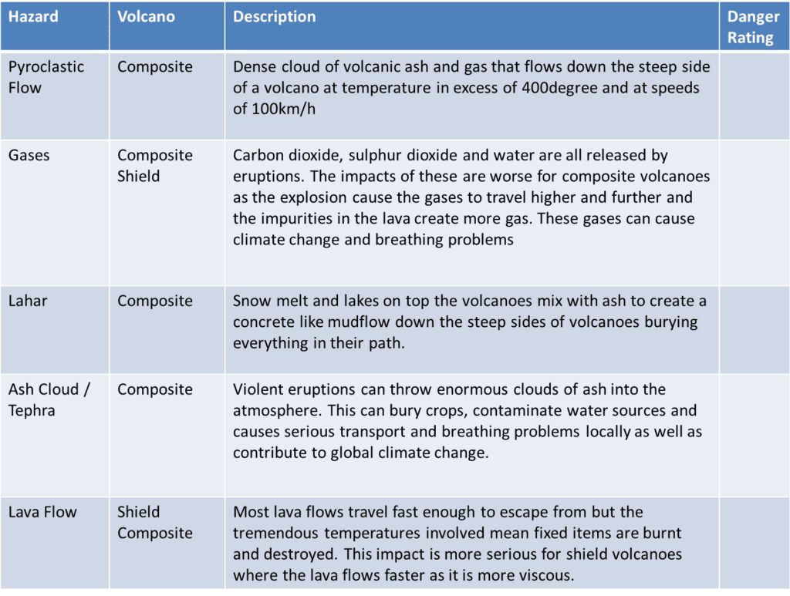
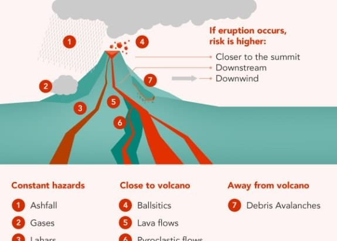
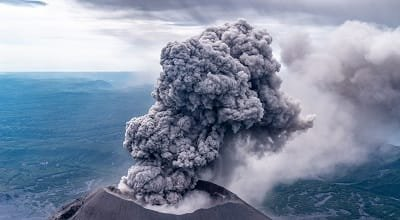

In the fascinating world of volcanoes, the hazards and impacts of volcanic gases are significant factors to consider. When volcanoes erupt, they release a variety of gases including carbon dioxide, sulfur dioxide, and water vapor, among others. These gases can pose numerous dangers to both the environment and human health. From suffocation to respiratory problems, volcanic gases have the potential to cause widespread harm. In this article, we will explore seven key hazards posed by volcanic gases and delve into the impact they can have on both the local and global scale. So buckle up and get ready to uncover the hidden dangers that lie within these magnificent natural phenomena.

  

## Volcanic Gases: An Overview

Volcanic eruptions are not only accompanied by the dramatic display of lava and ash but also the release of various gases into the atmosphere. These volcanic gases, consisting of compounds such as carbon dioxide (CO2), sulfur dioxide (SO2), hydrogen sulfide (H2S), hydrogen chloride (HCl), fluorine gases, and water vapor (H2O), play a crucial role in shaping the dynamics of volcanic activity and can have significant impacts on the environment and human health.

### Type of gases emitted during a volcanic eruption

During a volcanic eruption, several types of gases are emitted into the atmosphere. These gases can be categorized into different groups based on their chemical composition. The most common gases released during [volcanic eruptions include carbon dioxide](https://magmamatters.com/geothermal-energy-and-its-volcanic-origins/ "Geothermal Energy and Its Volcanic Origins") (CO2), sulfur dioxide (SO2), hydrogen sulfide (H2S), hydrogen chloride (HCl), fluorine gases, and water vapor (H2O).

### How these gases are formed

The formation of volcanic gases is primarily a result of the complex processes that occur within the Earth's interior and during volcanic eruptions. The magma, which is molten rock beneath the Earth's surface, contains dissolved gases, including water vapor, carbon dioxide, and sulfur dioxide. As magma rises towards the surface, the decrease in pressure allows these gases to escape, leading to their release during volcanic eruptions.

### Why the type and amount of gases can vary between eruptions

The type and amount of gases emitted during a volcanic eruption can vary significantly between different eruptions. Several factors influence these variations, including the composition and characteristics of the magma, the depth of the magma chamber, the presence of volatile elements, and the extent of the eruption. Additionally, the specific volcanic processes, such as the interaction of magma with water or the melting of surrounding rocks, can introduce different gases into the eruption plume.

## Carbon Dioxide (CO2)

### Role of CO2 in volcanic eruptions

Carbon dioxide (CO2) is one of the most abundant volcanic gases released during eruptions. It plays a significant role in the dynamics of volcanic activity. CO2-rich magma is associated with explosive eruptions, as the rapid expansion of gas within the magma can lead to the fragmentation of magma and the ejection of volcanic ash and debris.

### Potential hazards of CO2 emission to the environment and living organisms

While carbon dioxide is a natural component of the Earth's atmosphere, excessive emission of CO2 during volcanic eruptions can have detrimental effects on the environment and living organisms. High concentrations of CO2 can displace oxygen, leading to asphyxiation in confined areas and posing a threat to both humans and animals. In addition, extended exposure to elevated levels of CO2 can contribute to climate change and ocean acidification.

### Case studies of CO2-related accidents in history

Throughout history, there have been several tragic incidents related to the release of carbon dioxide during volcanic eruptions. One notable example is the 1986 eruption of Lake Nyos in Cameroon, where a massive release of CO2 from beneath the lake suffocated nearby villages, resulting in the death of thousands of people and animals. These incidents serve as a reminder of the potential dangers associated with CO2 emissions during volcanic eruptions and the importance of understanding and monitoring such hazards.

This image is property of pubs.usgs.gov.

## Sulfur Dioxide (SO2)

### Role of SO2 in volcanic eruptions

Sulfur dioxide (SO2) is another significant gas emitted during volcanic eruptions. It is released when sulfur-bearing minerals in the magma are heated and decomposed. SO2 plays a crucial role in the eruption dynamics, influencing the intensity and duration of volcanic activity. The release of SO2 can result in the formation of volcanic plumes, acid rain, and the generation of volcanic aerosols.

### Hazards of SO2 emissions on air quality and human health

The emission of sulfur dioxide during volcanic eruptions can have adverse effects on air quality and human health. SO2 can combine with atmospheric moisture to form sulfuric acid, a major component of acid rain. Inhaling high levels of SO2 can cause respiratory issues, including irritation of the airways and exacerbation of pre-existing respiratory conditions.

### Impact of SO2 on climate change

[Sulfur dioxide has a direct impact on climate change](https://magmamatters.com/the-environmental-impact-of-volcanic-eruptions-2/ "The Environmental Impact of Volcanic Eruptions") as well. When released into the atmosphere, it can react with water vapor to form sulfate aerosols, which reflect solar radiation back into space, leading to a cooling effect on the Earth's surface. This interaction between SO2 and water vapor contributes to the complex relationship between volcanic activity and the global climate system.

## Hydrogen Sulfide (H2S) and Hydrogen Chloride (HCl)

### Role and formation of H2S and HCl in volcanic eruptions

Hydrogen sulfide (H2S) and hydrogen chloride (HCl) are two gases commonly associated with volcanic eruptions. H2S is formed when sulfur-containing minerals in the magma are heated, while HCl is released through the interaction of volcanic gases with chloride-rich fluids. Both gases play important roles in the chemical reactions occurring within volcanic plumes.

### Hazards of H2S and HCl on human health and infrastructure

The release of hydrogen sulfide and hydrogen chloride during volcanic eruptions poses significant hazards to human health and infrastructure. Hydrogen sulfide is highly toxic and can cause respiratory distress and, at high concentrations, even death. Hydrogen chloride, on the other hand, can cause severe respiratory irritation and damage to infrastructure, particularly metals and concrete.

### How H2S and HCl contribute to acid rain

Hydrogen sulfide and hydrogen chloride released during volcanic eruptions can contribute to the formation of acid rain. When these gases combine with atmospheric moisture, they form sulfuric and hydrochloric acid, respectively, which can then be deposited onto the Earth's surface through precipitation. Acid rain can have detrimental effects on plants, water bodies, and human-made structures.

This image is property of mrgeogwagg.files.wordpress.com.

## Fluorine Gases and Volcanic Ash

### How fluorine gases are formed in volcanic eruptions

Fluorine gases are formed during volcanic eruptions through the interaction of volcanic gases with fluorine-rich minerals in the magma. These gases, such as hydrogen fluoride (HF) and silicon tetrafluoride (SiF4), are released into the atmosphere and can contribute to the chemical composition of volcanic plumes.

### Potential impact of fluorine gases on livestock and agriculture

The release of fluorine gases during volcanic eruptions can have detrimental effects on livestock and agriculture. High concentrations of fluorine gases can be toxic to animals, causing dental and skeletal fluorosis, reproductive issues, and even death. Fluorine deposition onto plants can also affect crop yields and lead to the contamination of food sources.

### Hazards of volcanic ash to aviation and human health

Volcanic ash, consisting of tiny glass and rock fragments, is another hazardous component emitted during eruptions. Volcanic ash can pose significant risks to aviation due to its ability to damage aircraft engines and impair visibility. Additionally, inhalation of volcanic ash can cause respiratory issues, including irritation of the airways and exacerbation of pre-existing respiratory conditions.

## Water vapor (H2O)

### Role of water vapor in volcanic eruptions

Water vapor is the most abundant volcanic gas released during eruptions. It is primarily derived from the degassing of water-rich magma. Water vapor plays a crucial role in the eruptive processes, contributing to the fragmentation and explosiveness of volcanic eruptions.

### Potential dangers associated with significant release of water vapor

While water vapor is generally considered harmless, the significant release of water vapor during volcanic eruptions can pose dangers. The rapid condensation of water vapor in the eruption column can lead to the formation of pyroclastic flows, which are fast-moving currents of volcanic material that are extremely hot and can cause severe damage to the surroundings.

### Impact of water vapor on climate and weather patterns

Water vapor released during volcanic eruptions can have both short-term and long-term impacts on climate and weather patterns. In the short term, the injection of water vapor into the upper atmosphere can contribute to cloud formation and the alteration of local weather conditions. In the long term, water vapor can contribute to global warming, as it is a potent greenhouse gas that traps heat in the Earth's atmosphere.

This image is property of www.gns.cri.nz.

## Volcanic gases and Climate Change

### How volcanic gases contribute to global warming

Volcanic gases, particularly carbon dioxide and water vapor, are primary contributors to global warming. The release of carbon dioxide during volcanic eruptions adds to the concentration of greenhouse gases in the atmosphere, contributing to the enhanced greenhouse effect and the warming of the Earth's surface. Water vapor, although short-lived in the atmosphere, also plays a significant role in amplifying the greenhouse effect.

### Role of volcanic aerosols in climate cooling

In contrast to the warming effects of volcanic gases, volcanic aerosols have a cooling effect on the climate. Volcanic aerosols, consisting of tiny particles and droplets, are formed from the solid and liquid materials ejected during eruptions. These particles reflect sunlight back into space, reducing the amount of solar radiation reaching the Earth's surface and leading to a temporary cooling effect.

### Comparison of human-generated and volcano-produced greenhouse gases

While volcanic eruptions release substantial amounts of greenhouse gases into the atmosphere, human activities are still the primary drivers of long-term climate change. The continuous and massive emissions of greenhouse gases from burning fossil fuels, deforestation, and industrial processes far exceed the contributions of volcanic emissions. However, the short-term effects of major volcanic eruptions can have noticeable impacts on climate patterns.

## Health Risks associated with Volcanic Gases

### Short-term and long-term health effects of volcanic gas exposure

Exposure to volcanic gases can have both short-term and long-term health effects on individuals. Short-term effects include respiratory problems, eye irritation, and exacerbation of existing respiratory conditions. Prolonged exposure to volcanic gases over time can lead to chronic respiratory illnesses, cardiovascular issues, and increased susceptibility to respiratory infections.

### Preventive measures and safety guidelines

To mitigate the health risks associated with volcanic gas exposure, it is crucial to adhere to safety guidelines and preventive measures. During volcanic eruptions, individuals should avoid unprotected exposure to volcanic gases and ash, particularly in areas with poor air quality. Wearing respiratory protection, such as proper masks, and following evacuation orders from authorities are essential steps in ensuring safety during volcanic events.

### Historical cases of toxic gas exposure

Throughout history, there have been numerous cases of toxic gas exposure during volcanic eruptions. One notable example is the 1902 eruption of Mount Pelée in Martinique, where the release of volcanic gases and pyroclastic flows led to the death of thousands of people. These historical cases highlight the devastating consequences of toxic gas exposure and emphasize the need for thorough understanding and preparedness in areas prone to volcanic activity.

This image is property of www.hidenanalytical.com.

## Environmental Impact of Volcanic Gases

### Effect of volcanic gases on surrounding ecosystems

The release of volcanic gases during eruptions can have significant effects on surrounding ecosystems. Acidic gases such as sulfur dioxide and hydrogen sulfide can contribute to the acidification of soil and water bodies, affecting the pH levels and disrupting the delicate balance of ecosystems. These changes can impact the survival and reproductive success of plant and animal species.

### Impacts on water bodies and marine life

Volcanic gases, particularly sulfur dioxide and hydrogen sulfide, can have detrimental effects on water bodies and marine life. The deposition of sulfuric acid can lead to the acidification of lakes, rivers, and oceans, harming aquatic organisms such as fish, algae, and coral reefs. Elevated levels of sulfur dioxide in the atmosphere can also contribute to acid rain, further impacting water quality.

### Changes in land fertility after volcanic eruptions

Although volcanic eruptions can cause destruction and devastation, they also bring forth benefits to the surrounding land. Volcanic gases, such as carbon dioxide, release nutrients into the soil, making it fertile and conducive to plant growth. Over time, volcanic eruptions can lead to the rejuvenation of land and the creation of new habitats for various species.

## Mitigating the Hazards of Volcanic Gases

### Modern methods for monitoring and predicting gas emissions

Advancements in technology have significantly improved the monitoring and prediction of volcanic gas emissions. Scientists use various instruments, including gas analyzers, satellite imagery, and ground-based monitoring stations, to measure and track the release of gases during volcanic eruptions. These monitoring efforts allow for early warning systems and the implementation of timely evacuation plans.

### Role of local and international agencies in hazard mitigation

Local and international agencies play a crucial role in mitigating the hazards associated with volcanic gases. These agencies work together to develop strategies for risk reduction, emergency response plans, and public awareness campaigns. They collaborate on research initiatives and share data to improve the understanding of volcanic processes and enhance hazard assessment.

### Educational initiatives on hazard awareness and preparedness

Educational initiatives play a vital role in increasing hazard awareness and preparedness in communities at risk of volcanic activity. These initiatives aim to [educate individuals about the potential hazards of volcanic gases](https://magmamatters.com/the-art-and-science-of-volcano-monitoring/ "The Art and Science of Volcano Monitoring"), promote safety measures, and provide information on evacuation procedures. By enhancing public knowledge and awareness, communities can be better equipped to respond to volcanic events and minimize the impacts on human health and the environment.

In conclusion, volcanic eruptions are not only awe-inspiring [natural phenomena but also sources of various gases](https://magmamatters.com/understanding-volcanic-formation-a-comprehensive-guide/ "Understanding Volcanic Formation: A Comprehensive Guide") that can have significant impacts on the environment and human health. Understanding the formation, role, and hazards associated with these volcanic gases is crucial for predicting volcanic activity, mitigating risks, and promoting the safety of communities living in volcanic regions. By continuously advancing our knowledge and implementing effective strategies, we can minimize the adverse effects of volcanic gas emissions and better protect our planet and its inhabitants.

Related Posts: [Mitigating Risks: Forecasting Volcanic Activity in Prone Areas](https://magmamatters.com/mitigating-risks-forecasting-volcanic-activity-in-prone-areas/), [The Formation and Eruption Patterns of Volcanoes](https://magmamatters.com/the-formation-and-eruption-patterns-of-volcanoes-4/), [The Pyroclastic Phenomena of Pompeii: 7 Insights to Explore](https://magmamatters.com/the-pyroclastic-phenomena-of-pompeii-7-insights-to-explore/), [Tips for Capturing Volcano Pyroclastic Flow Photos](https://magmamatters.com/tips-for-capturing-volcano-pyroclastic-flow-photos/), [Understanding Volcanoes and Their Eruption Patterns](https://magmamatters.com/understanding-volcanoes-and-their-eruption-patterns/)
