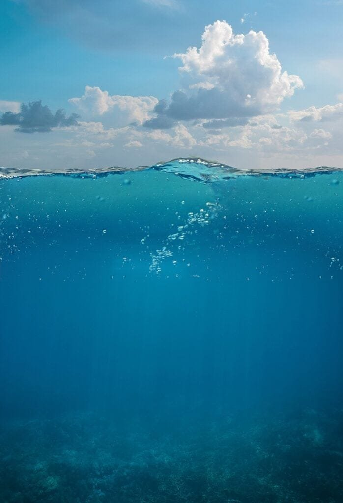
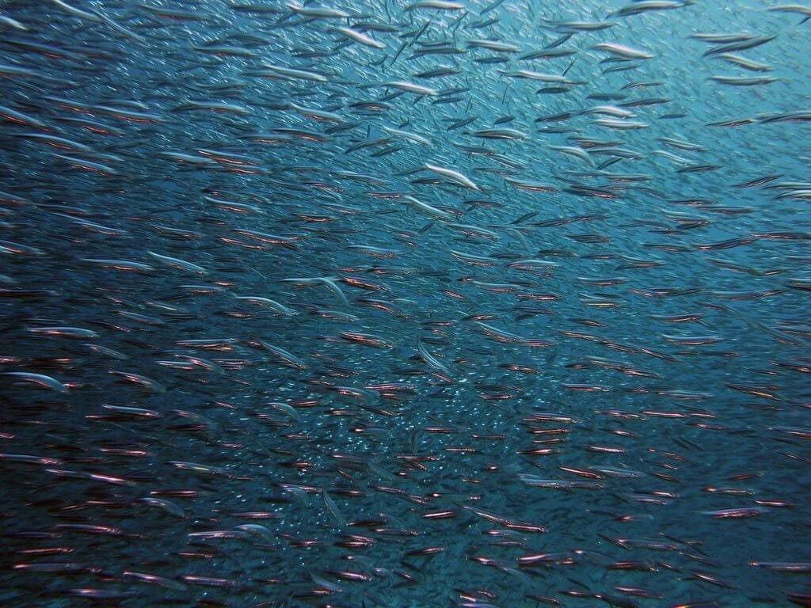

Imagine exploring the depths of the ocean, surrounded by mysterious marine life and colorful coral reefs. But beneath the calm waters lies a powerful and dangerous force - submarine volcanoes. These underwater eruptions, although hidden from our view, pose significant hazards that can impact both the ocean ecosystem and human populations. From the creation of toxic gases to the formation of destructive tsunamis, the risks associated with submarine volcano eruptions are many. In this article, we will delve into the ten best explained hazards of submarine volcano eruptions, shedding light on the potential dangers lurking beneath the waves. So grab your diving gear and prepare to uncover the secrets of these fiery underwater giants.

This image is property of pixabay.com.

## Understanding Submarine Volcanoes

Submarine volcanoes are volcanoes that are located beneath the surface of the ocean. These volcanic structures are formed when molten rock, known as magma, rises from the Earth's mantle and reaches the ocean floor. As the magma erupts, it cools and solidifies, forming new volcanic material. Over time, repeated eruptions can build up underwater mountain ranges known as volcanic arcs or seamount chains.

Submarine volcanoes are predominantly found in areas where tectonic plates meet, such as along subduction zones or mid-ocean ridges. The "Ring of Fire," which encircles the Pacific Ocean, is one of the most geologically active areas on Earth and is known for its numerous submarine volcanoes.

## Geographical Distribution

Submarine volcanoes can be found in various parts of the world's oceans, with the highest concentration occurring along tectonic plate boundaries. These volcanoes are commonly observed in the Pacific Ocean, particularly near the coasts of countries like Japan, Indonesia, and the Philippines. The Pacific Ring of Fire is a prime example of an area with extensive submarine volcanic activity.

Other regions with significant submarine volcano activity include the Atlantic Ocean, the Indian Ocean, and the Southern Ocean. In these areas, underwater volcanic eruptions contribute to the formation of new landmasses, alteration of seafloor topography, and geological changes.

This image is property of pixabay.com.

## Eruption Causes

Submarine volcanic eruptions are primarily caused by the movement and interaction of tectonic plates. There are three main processes that lead to these eruptions:

1. Subduction Zone Eruptions: In subduction zones, where one tectonic plate is forced beneath another, the subducted plate sinks into the Earth's mantle. As the subducting plate descends, the increase in pressure and temperature causes the release of water and other volatile substances. These volatiles rise through the mantle, triggering the melting of rocks and the generation of magma. This magma then makes its way to the surface, leading to a submarine volcanic eruption.
    
2. Mid-Ocean Ridge Eruptions: Mid-ocean ridges are underwater mountain ranges formed by the upwelling of magma from the Earth's mantle. As tectonic plates move apart, magma rises to fill the gap, creating new oceanic crust. During this process, submarine volcanic eruptions can occur, resulting in the formation of new seafloor and the release of volcanic gases and materials.
    
3. Hotspot Eruptions: Hotspots are areas where a plume of hot magma rises from deep within the Earth's mantle. As the tectonic plates move over these hotspots, volcanoes can form on the ocean floor. The Hawaiian Islands are a classic example of a hotspot volcano chain, with the youngest and most active volcanoes situated on the Big Island of Hawaii.
    

Understanding the causes of submarine volcanic eruptions is crucial in predicting and mitigating the associated hazards.

## Hazard 1: Tsunamis

One of the major hazards associated with submarine volcano eruptions is the formation of tsunamis. When a volcano erupts underwater, the release of large volumes of magma and gases can displace massive amounts of water. This displacement generates powerful waves that propagate outward from the eruption site, potentially leading to a tsunami.

Case studies have shown the catastrophic impact and destruction caused by tsunamis resulting from submarine volcano eruptions. The 1883 eruption of Krakatoa, a volcanic island in Indonesia, triggered a series of tsunamis that killed tens of thousands of people and devastated coastal communities. More recently, the 2018 eruption of Anak Krakatau resulted in a tsunami that ravaged the coastlines of Java and Sumatra, causing widespread destruction and loss of life.

The impact of these resulting tsunamis can be devastating. Coastal infrastructure, human settlements, and ecosystems are highly vulnerable to the immense force and destructive power of these waves. Efforts to mitigate the risks associated with submarine volcano-induced tsunamis include early warning systems, evacuation plans, and coastal zoning regulations.

This image is property of pixabay.com.

## Hazard 2: Destruction of Marine Ecosystems

Submarine volcanic eruptions can have significant detrimental effects on marine ecosystems. The introduction of high temperatures, toxic gases, and volcanic material into the ocean can cause severe damage to the delicate balance of marine life.

Volcanic activities release large amounts of heat, which can result in the destruction of coral reefs and other sensitive habitats. The sudden increase in water temperature can cause coral bleaching, leading to the death of coral colonies and the loss of biodiversity.

Toxic substances emitted during eruptions, such as sulfur dioxide and carbon dioxide, can have harmful effects on marine fauna and flora. These substances can lead to oxygen depletion in the water, making it difficult for marine life to survive. Volcanic ash and debris can also smother and damage underwater organisms, impacting their ability to feed, reproduce, and thrive.

The long-term effects on marine ecosystems can be significant. It may take years or even decades for the affected ecosystems to recover, with potential disruptions in species composition, food webs, and overall ecosystem health.

## Hazard 3: Impact on Climate

Submarine volcanic eruptions can have a substantial impact on weather patterns and global climate. The release of gases and aerosols during eruptions can influence the Earth's atmospheric composition, leading to both short-term and long-term effects.

The emissions of greenhouse gases, such as carbon dioxide and methane, contribute to global warming. These gases trap heat in the atmosphere, leading to an increase in average global temperatures over time. Submarine volcanic eruptions can be a significant source of these gases, releasing them into the atmosphere and exacerbating climate change.

On the other hand, volcanic aerosols, such as sulfur dioxide, can have a cooling effect on the climate. These aerosols reflect sunlight back into space, reducing the amount of solar radiation reaching the Earth's surface. In extreme cases, large volcanic eruptions can lead to temporary cooling of the climate, resulting in what is known as a nuclear winter effect.

Understanding and quantifying the impact of submarine volcano eruptions on climate is essential for predicting and managing future [climate changes](https://magmamatters.com/geothermal-energy-and-its-volcanic-origins/ "Geothermal Energy and Its Volcanic Origins").

## Hazard 4: Impact on Human Health

Submarine volcano eruptions can pose risks to human health, primarily through the release of toxic gases and the contamination of food sources.

During eruptions, [volcanic gases such as sulfur dioxide](https://magmamatters.com/the-art-and-science-of-volcano-monitoring/ "The Art and Science of Volcano Monitoring"), carbon dioxide, and hydrogen sulfide are emitted into the atmosphere. These gases can be hazardous to human health, leading to respiratory problems, eye irritation, and exacerbation of existing health conditions. Breathing in high concentrations of these gases can result in severe health consequences, especially for individuals with pre-existing respiratory issues.

Another significant concern is the impact on seafood, which is a primary food source for many coastal communities. Toxic substances released during underwater volcanic eruptions can contaminate the ocean and accumulate in marine organisms, making them unsafe for consumption. This poses a significant risk to the health and well-being of communities that rely on seafood as a vital source of nutrition and livelihood.

Additionally, the eruption process itself can create hazardous conditions for individuals involved in marine activities, such as fishing or tourism. The sudden release of gases, ash, and volcanic debris can pose a risk of accidents and injuries.

## Hazard 5: Economic Implications

Submarine volcano eruptions can have severe economic implications, particularly for industries such as fishing and tourism. These hazards can disrupt livelihoods, cause financial losses, and lead to economic instability.

The destruction of marine ecosystems can devastate fishing communities that rely on healthy oceans for their livelihoods. Disrupted food chains and reduced fish populations can result in a decline in fishery yields, impacting the income of fishermen and the availability of seafood for local and international markets.

The tourism industry is also vulnerable to the impacts of submarine volcano eruptions. Popular coastal destinations, known for their pristine beaches and coral reefs, can suffer reputational damage and a decline in visitor numbers due to the destruction of marine ecosystems and the potential for associated hazards like tsunamis.

Furthermore, the costs associated with cleaning up and rebuilding after an eruption can be substantial. Governments and affected communities often bear the financial burden of repairing infrastructure, restoring ecosystems, and supporting those affected by the loss of livelihoods.

The economic instability caused by unexpected volcanic events can have long-lasting effects on local and regional economies, requiring careful planning and management to mitigate risks and promote resilience.

## Hazard 6: Seafloor Contamination

Submarine volcano eruptions can result in the spread of harmful chemicals in seafloors and water bodies, leading to contamination of marine and human life.

During eruptions, volcanic substances such as ash, gases, and heavy metals are released into the water. These materials can settle on the seafloor, leading to the contamination of sediments. Harmful chemicals can persist in these sediments for extended periods, affecting benthic organisms and potentially entering the food chain.

The impact of seafloor contamination can be far-reaching. Marine organisms may suffer from reduced reproductive success, growth abnormalities, and increased mortality rates. The risks can extend to humans who rely on the ocean for sustenance, as contaminated seafood can pose health risks when consumed.

Cleaning up seafloor contamination can be challenging and expensive. The long-term effects of contamination may require ongoing monitoring and remediation efforts to ensure the health and sustainability of marine ecosystems.

## Hazard 7: Geological Changes

Submarine volcanic activities can lead to significant geological changes, including earthquakes, the formation of new landmasses, and alterations in seafloor topography.

As magma rises to the surface during eruption events, it can cause seismic activity and generate submarine earthquakes. These earthquakes can have far-reaching effects, potentially triggering tsunamis, damaging infrastructure, and impacting marine and human lives.

Volcanic eruptions underwater can also contribute to the formation of new landmasses. Over time, repeated eruptions and the accumulation of solidified lava and volcanic material can result in the emergence of new islands or seamounts. The creation of these landforms can have both positive and negative impacts, offering new habitats for marine life while also altering natural coastal processes.

Furthermore, submarine volcanic eruptions can alter the topography of the seafloor. The deposition of volcanic materials can lead to the formation of underwater geological features, such as ridges, vents, and calderas. These changes can affect ocean currents, marine ecosystems, and the overall dynamics of the seafloor environment.

Understanding how submarine volcanic activities contribute to geological changes is crucial for assessing and managing the associated hazards.

## Hazard 8: Damage to Submarine Cables and Infrastructure

Submarine volcano eruptions pose a risk to undersea cables and offshore infrastructure, with implications for global communications and economies.

Undersea cables play a critical role in international communication networks, transmitting vast amounts of data and voice traffic across oceans. Submarine volcanic eruptions can pose a risk to these vulnerable cables, which are often laid on or near the ocean floor. Volcanic activities can cause physical damage to the cables, disrupting global communications and leading to significant economic losses.

In addition to undersea cables, submarine volcanic eruptions can also cause damage to offshore infrastructure such as drilling platforms and pipelines. The release of volcanic gases, ash, and debris can pose a risk to these structures, potentially causing fires, explosions, or structural failures. The destruction of offshore infrastructure not only disrupts operations but also poses environmental risks such as oil spills or gas leaks.

The implications of damage to submarine cables and infrastructure are far-reaching, affecting industries, economies, and global connectivity. Mitigation strategies, such as improved monitoring systems and contingency plans, are vital to minimizing the risks associated with these hazards.

## Mitigating the Hazards of Submarine Volcano Eruptions

Efforts to mitigate the hazards of submarine volcano eruptions involve a combination of risk management strategies, government intervention, and international cooperation. Here are some key areas of focus:

1. Risk Management Strategies: Implementing early warning systems for tsunamis and volcanic activities, establishing evacuation plans in vulnerable coastal areas, and promoting public awareness and education about submarine volcano hazards.
    
2. Role of Governments and International Bodies: Governments play a crucial role in disaster mitigation and post-eruption recovery. They can establish regulations and zoning policies to limit human activity in hazardous areas, allocate resources for monitoring and research, and coordinate international efforts to address global hazards.
    
3. Current Research Trends: Ongoing research aims to better understand submarine volcanic processes, improve eruption forecasting capabilities, and enhance monitoring systems. Advanced technologies, such as seafloor sensors and satellite-based observations, help scientists gather crucial data and track volcanic activities in real-time.
    

By implementing these risk management strategies, governments and international bodies can work together to minimize the hazards posed by submarine volcano eruptions. This collaboration is essential to protect human lives, preserve ecosystems, and promote resilient communities in the face of volcanic events.

