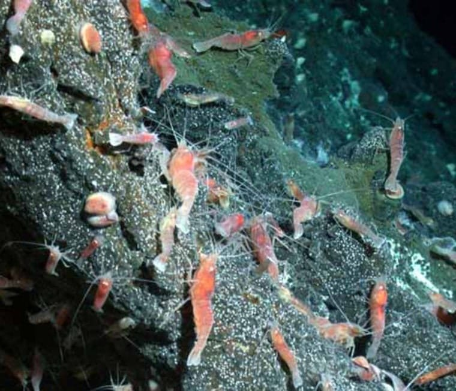
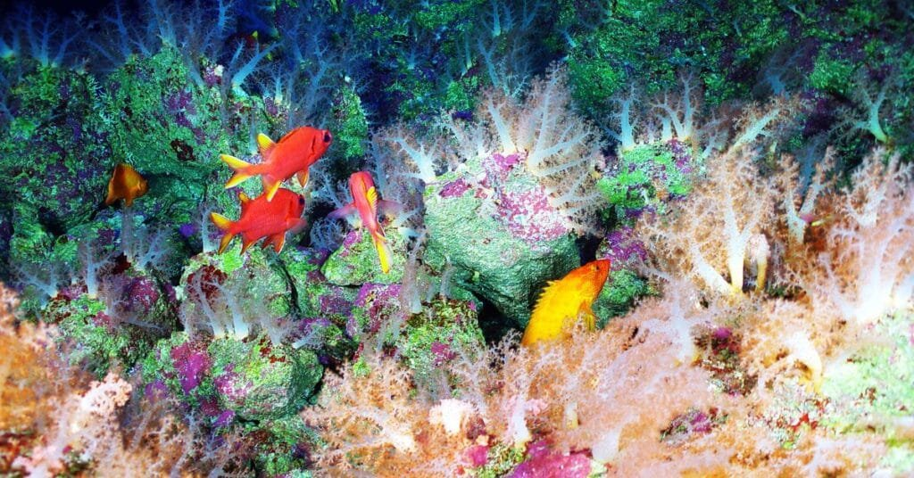
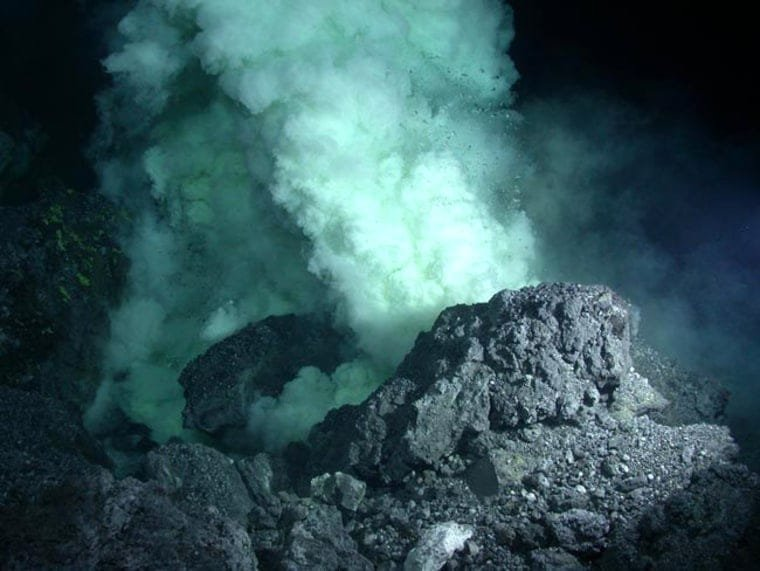
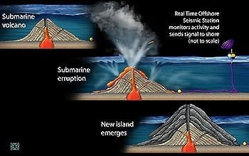
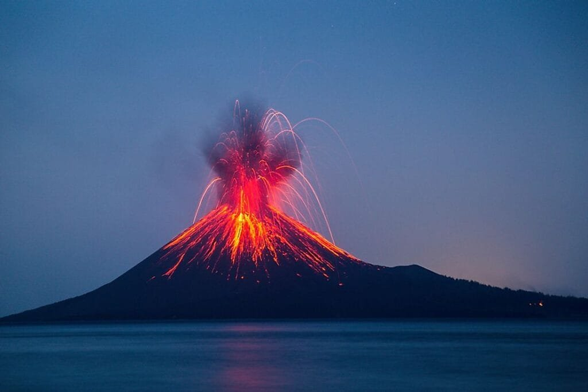

Did you know that there are volcanoes lurking beneath the surface of the ocean? These underwater giants, known as submarine volcanoes, have a significant impact on marine life. Formed when molten rock and gases escape to the earth's surface underwater, submarine volcanoes can create a variety of effects on the surrounding marine ecosystem. From altering water temperature and chemistry to providing new habitats for unique species, these hidden volcanoes play a crucial role in shaping the biodiversity and dynamics of our oceans. In this article, we will explore the fascinating ways in which submarine volcanoes affect marine life and contribute to the delicate balance of our underwater world.

This image is property of media-cldnry.s-nbcnews.com.

## Understanding Submarine Volcanoes

Submarine volcanoes, also known as underwater volcanoes or seamounts, are volcanic formations that are located beneath the surface of the ocean. These volcanoes are formed through similar processes as terrestrial volcanoes, but the eruptions occur underwater. Understanding the formation and characteristics of submarine volcanoes is crucial for comprehending their impact on marine life.

### Definition and formation of submarine volcanoes

Submarine volcanoes are formed when molten rock, known as magma, rises to the surface of the ocean floor through fissures or vents. The magma is derived from the Earth's mantle, which melts due to the high temperatures and pressures in the Earth's interior. As the magma erupts, it cools rapidly in contact with the cold ocean water, solidifying and forming volcanic rocks and structures.

### Location and geographic distribution of submarine volcanoes

Submarine volcanoes are found in various locations across the world's oceans. They are often associated with tectonic plate boundaries, such as mid-ocean ridges, subduction zones, and rift zones. These areas have intense geological activity, with the movement and interaction of tectonic plates leading to the formation of underwater volcanic systems.

The geographic distribution of submarine volcanoes is not limited to specific regions. They can be found in all major ocean basins, including the Pacific, Atlantic, Indian, and Arctic Oceans. The Pacific Ocean, in particular, is home to a significant number of submarine volcanoes due to its position along the "Ring of Fire," a highly active tectonic region.

## Physical Attributes of Submarine Volcanoes

Submarine volcanoes exhibit distinct physical characteristics that set them apart from their terrestrial counterparts. Understanding these attributes is essential to gain insights into their behavior and impact on marine life.

### Size and structure

Submarine volcanoes vary in size, with some reaching heights of several kilometers from the ocean floor. They can have different shapes and structures, including conical peaks, flat-topped seamounts, and even calderas. The size and structure of submarine volcanoes depend on factors such as eruption history, magma viscosity, and interactions with the surrounding tectonic features.

### Eruptive characteristics

The eruptive characteristics of submarine volcanoes differ from those of terrestrial volcanoes due to the presence of water. When magma encounters the ocean water, it undergoes rapid cooling and fragmentation, leading to explosive eruptions. These eruptions often produce plumes of steam, gases, and volcanic ash, which rise to the surface. The interaction between magma and water also results in the formation of pillow lavas, spherical structures formed by the rapid quenching of lava.

### Comparative analysis with terrestrial volcanoes

While submarine volcanoes share similarities with their terrestrial counterparts, there are important differences to consider. Terrestrial volcanic eruptions are more easily observed and monitored, allowing for a better understanding of their behavior. On the other hand, studying submarine volcanoes presents challenges due to their underwater nature. Despite these challenges, advances in technology and underwater exploration have enabled scientists to gain valuable insights into the behavior of submarine volcanoes.

This image is property of cdn.vox-cdn.com.

## Eruption Processes of Submarine Volcanoes

The eruption processes of submarine volcanoes are influenced by various factors, including the manner of eruptions, the materials released during eruptions, and the conditions of pressure, temperature, and depth.

### Manner of eruptions

Submarine volcanic eruptions can occur in different ways, including explosive eruptions and effusive eruptions. Explosive eruptions involve the rapid release of gas and magma, resulting in violent explosions and the ejection of volcanic materials into the water. Effusive eruptions, on the other hand, involve the slow and steady release of magma, which flows out of the volcano and forms lava flows.

### Submarine volcanic materials released during eruptions

During submarine volcanic eruptions, various types of materials are released into the surrounding water. These materials include volcanic ash, pyroclastic flows, and gases such as [sulfur dioxide and carbon](https://magmamatters.com/the-art-and-science-of-volcano-monitoring/ "The Art and Science of Volcano Monitoring") dioxide. The release of these materials can have significant impacts on the marine environment, including changes in water chemistry, temperature, and sedimentation.

### Impacts of pressure, temperature, and depth on eruption processes

The pressure, temperature, and depth of the ocean play a crucial role in submarine volcanic eruptions. The immense pressure of the water at greater depths can affect the behavior of magma, causing it to erupt explosively or effusively. Additionally, the temperature variations in the ocean can influence the cooling and solidification of lava and the formation of different volcanic structures. Understanding these factors is vital for predicting and assessing the impacts of submarine volcanic eruptions on marine life.

## Direct Effects of Submarine Volcanic Eruptions on Marine Life

Submarine volcanic eruptions can have immediate and profound effects on marine organisms and their habitats. Understanding these direct effects is essential for evaluating the ecological impacts of volcanic activity in the ocean.

### Immediate impacts on marine organisms

The intense heat, pressure, and toxic gases associated with submarine volcanic eruptions can cause immediate harm to marine organisms. The sudden release of volcanic materials can suffocate or damage organisms that come into direct contact with them. Additionally, the displacement of large quantities of water during eruptions can produce powerful shockwaves that can harm marine life, including fish, corals, and other vulnerable species.

### Changes in water temperature and chemistry

Submarine volcanic eruptions can lead to significant changes in water temperature and chemistry in the surrounding areas. The expulsion of hot lava and gases can cause localized heating of the water, affecting the thermal regime and creating thermal anomalies. The release of gases can also alter the chemical composition of the water, potentially leading to decreased oxygen levels and increased acidity. These changes can have cascading effects on marine organisms, impacting their ability to survive and reproduce.

### Displacement and loss of habitat

The physical disturbances caused by submarine volcanic eruptions can result in the displacement and loss of marine habitats. The rapid deposition of volcanic materials can bury and smother existing habitats, such as coral reefs and seafloor communities. The altered topography and increased sedimentation can also change the physical characteristics of the surrounding areas, making them less suitable for certain species. These habitat disruptions can have long-lasting effects on the biodiversity and ecological balance of the marine ecosystem.

This image is property of media-cldnry.s-nbcnews.com.

## Indirect Effects of Submarine Volcanic Eruptions on Marine Life

In addition to the direct impacts, submarine volcanic eruptions can have significant indirect effects on marine life. These effects can occur over longer time scales and have broader ecological implications.

### Alteration of ocean circulation and chemistry

Submarine volcanic eruptions can alter ocean circulation patterns and chemical composition over large areas. The expulsion of volcanic materials into the water can lead to the formation of dense plumes that sink and spread, affecting water currents and nutrient distribution. Changes in ocean circulation can impact the transport of larvae and other propagules, potentially disrupting the connectivity and gene flow between populations. The release of gases and chemicals can also impact water chemistry, leading to changes in nutrient availability and pH levels.

### Impacts on food chains and marine ecosystems

Submarine volcanic eruptions can disrupt food chains and marine ecosystems by altering the availability and quality of food resources. Volcanic materials and gases can affect primary productivity, which forms the base of marine food chains. These changes can cascade up the food web, impacting higher trophic levels and changing community dynamics. Changes in species composition and abundance can have lasting effects on the structure and functioning of marine ecosystems.

### Long-term changes in marine biodiversity

The indirect effects of submarine volcanic eruptions can lead to long-term changes in marine biodiversity. Habitat loss, alteration of ocean circulation, and changes in food availability can drive shifts in species distributions and abundance. Some species may be more resilient to the disturbances caused by eruptions, while others may decline or become locally extinct. Over time, these changes can result in altered community compositions and reduced overall biodiversity. Understanding these long-term dynamics is crucial for managing and conserving marine resources in volcanic regions.

## Case Studies: Submarine Volcanoes and Marine Life Interactions

Numerous case studies have documented the interactions between submarine volcanoes and marine life. These studies provide valuable insights into the ecological impacts of volcanic activity in the ocean.

### Documented instances of marine life affected by submarine volcanoes

Researchers have observed various instances of marine life being affected by submarine volcanoes. For example, studies have shown that eruptions can cause mass mortalities of fish, corals, and other benthic organisms due to the release of toxic gases and the burial of habitats. Additionally, volcanic vents can create unique habitats that support specialized communities of organisms, such as chemosynthetic bacteria and deep-sea organisms adapted to extreme conditions.

### Research findings on impact of individual eruptions on marine environments

Scientists have conducted research to assess the impacts of individual submarine volcanic eruptions on marine environments. By studying the changes in water chemistry, temperature, and biodiversity following eruptions, researchers have been able to quantify the ecological effects. These findings contribute to our understanding of the resilience and adaptation of marine life in volcanic regions.

This image is property of scx2.b-cdn.net.

## Potential Benefits of Submarine Volcanoes to Marine Life

While submarine volcanic eruptions can have detrimental effects on marine life, they can also create unique opportunities and benefits for marine organisms.

### Nutrient enrichment due to volcanic materials

Submarine volcanic eruptions release large amounts of nutrients, including nitrogen, phosphorus, and trace elements, into the water. These nutrients can stimulate primary productivity, leading to increased algal growth and the availability of food resources for marine organisms. This nutrient enrichment can enhance the productivity of the surrounding marine ecosystem, supporting the growth and survival of various species.

### Creation of new habitats and ecosystems

Submarine volcanic eruptions can create new habitats and ecosystems by altering the physical and chemical characteristics of the seafloor. The deposition of volcanic materials can form hard substrates, which provide attachment surfaces for sessile organisms such as corals and sponges. The altered topography and hydrothermal activity associated with submarine volcanoes can support unique communities of organisms that are adapted to extreme conditions. These newly formed habitats can contribute to overall biodiversity and promote the colonization of new species.

### Role in promoting biological diversity

Submarine volcanoes play a role in promoting biological diversity by providing opportunities for speciation and habitat connectivity. The dynamic nature of volcanic environments, with their constant geological changes and patchy distribution of habitats, can drive evolutionary processes. Isolated habitats created by submarine volcanoes can serve as stepping stones for species dispersal, allowing for gene flow and colonization of new areas. This connectivity between habitats can enhance genetic diversity and contribute to the resilience of marine ecosystems.

## Challenges in Studying Submarine Volcanoes and Their Impact on Marine Life

Studying submarine volcanoes and their impact on marine life poses several challenges due to the unique nature of these environments.

### Technical limitations

The underwater nature of submarine volcanoes presents technical challenges for researchers. Accessing and studying these remote and often deep-sea environments require specialized equipment and technologies. Remote-operated vehicles (ROVs) and autonomous underwater vehicles (AUVs) are used to explore and document submarine volcanoes, but their use is limited by factors such as depth, weather conditions, and data collection capabilities.

### Lack of long-term observational data

Long-term observational data on submarine volcanoes and their impact on marine life are scarce. Monitoring and studying volcanic activity in the ocean is challenging due to the transient nature of eruptions and the vastness of the marine environment. As a result, scientists often rely on short-term studies and targeted sampling to understand the ecological implications of volcanic activity. The lack of long-term data hinders our ability to fully grasp the long-term effects of submarine volcanoes on marine ecosystems.

### Difficulties in assessing direct and indirect impacts

Assessing the direct and indirect impacts of submarine volcanic eruptions on marine life is a complex task. The dynamic nature of underwater volcanic systems makes it challenging to distinguish the effects of eruptions from other natural and anthropogenic factors. Additionally, the interconnectedness of marine ecosystems and the wide-ranging scales at which impacts occur further complicate the assessment process. Integrating multiple lines of evidence and interdisciplinary approaches is necessary to gain a comprehensive understanding of the effects of submarine volcanoes on marine life.

This image is property of www.worldatlas.com.

## Future Research Directions on Impact of Submarine Volcanoes on Marine Life

Advances in technology and a growing interest in understanding the impact of submarine volcanoes on marine life have opened up new avenues for research.

### Emerging technologies for studying submarine volcanoes

Emerging technologies, such as high-resolution mapping techniques, advanced imaging systems, and genetic sequencing methods, offer promising opportunities for studying submarine volcanoes. These technologies allow for detailed mapping of volcanic structures, visualization of underwater processes, and genetic analysis of organisms in volcanic environments. By combining these cutting-edge tools and techniques, scientists can enhance their understanding of submarine volcanoes and their impacts on marine life.

### Potential areas for further research

There are several potential areas for further research on the impact of submarine volcanoes on marine life. These include investigating the long-term ecological consequences of volcanic eruptions, studying the mechanisms of species adaptation and resilience to volcanic disturbances, and assessing the role of volcanic activity in shaping marine biodiversity patterns. Additionally, research on the interactions between submarine volcanoes and deep-sea ecosystems, which are still relatively understudied, can provide valuable insights into the dynamics of these unique habitats.

### Implications for management and conservation of marine resources

Understanding the impact of submarine volcanoes on marine life has implications for the management and conservation of marine resources in volcanic regions. By considering the ecological effects of volcanic activity, policymakers and resource managers can develop strategies to mitigate potential negative impacts and protect vulnerable habitats and species. Integrating volcano monitoring into existing marine conservation efforts can aid in the effective management of these dynamic and valuable ecosystems.

## Implications for Climate Change Studies

The study of submarine volcanoes and their impact on marine life has broader implications for understanding the interactions between volcanism and [climate change](https://magmamatters.com/geothermal-energy-and-its-volcanic-origins/ "Geothermal Energy and Its Volcanic Origins").

### Role of submarine volcanoes in modifying ocean chemistry and temperature

Submarine volcanoes play a role in modifying ocean chemistry and temperature through the release of volcanic gases and the alteration of nutrient cycles. Volcanic emissions can contribute to greenhouse gas concentrations, influencing the Earth's climate system. The injection of gases such as carbon dioxide and sulfur dioxide into the atmosphere can affect the global carbon cycle and climate patterns. Moreover, volcanic activity can influence ocean temperature through localized heating and thermal exchanges between the ocean and the atmosphere.

### Impact on marine life adaptation to changing ocean conditions

Understanding the impact of submarine volcanoes on marine life can provide insights into how organisms adapt to changing ocean conditions. Volcanic disturbances can act as natural laboratories for studying species resilience and adaptation. By examining the responses of marine organisms to volcanic eruptions, scientists can gain valuable knowledge about their capacity to cope with environmental changes, including those associated with climate change. This understanding can contribute to predicting and managing the impacts of future environmental changes on marine ecosystems.

### Contribution to understanding of ocean-climate interactions

Studying submarine volcanoes and their influence on marine life contributes to our understanding of the complex interactions between the ocean and climate. Volcanic eruptions release large amounts of aerosols and gases into the atmosphere, which can affect atmospheric circulation patterns and regional climate. The deposition of volcanic materials in the ocean can impact marine ecosystems and the global carbon cycle, influencing climate feedback processes. Integrating knowledge from submarine volcanic studies into climate models can improve our ability to simulate and predict the consequences of natural and anthropogenic climate forcings.

In conclusion, understanding submarine volcanoes and their impact on marine life is an important field of research. These underwater volcanic systems exhibit unique characteristics and eruption processes that differ from terrestrial volcanoes. Submarine volcanic eruptions can have direct and indirect effects on marine organisms, altering their habitats and influencing ecological dynamics. While there are challenges in studying submarine volcanoes, emerging technologies and research efforts offer promising opportunities for further understanding. By investigating the implications of submarine volcanoes for marine life and climate change, we can better manage and conserve our marine resources and enhance our knowledge of Earth's dynamic processes.

