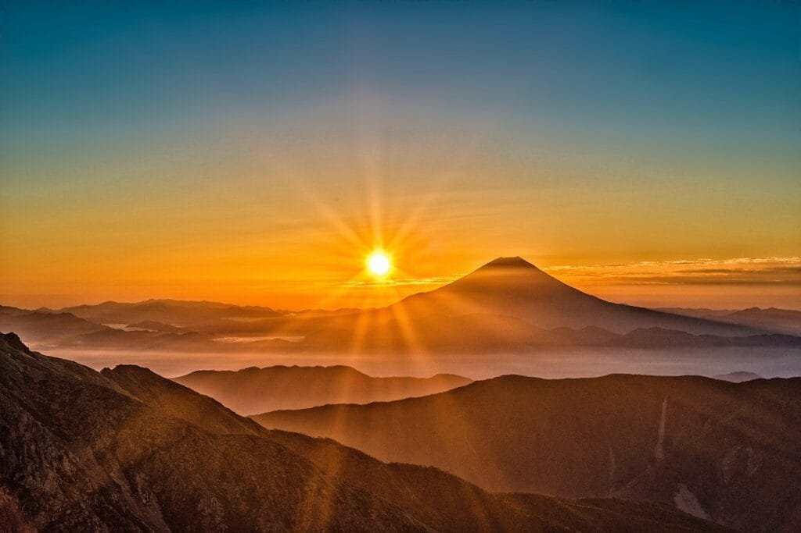

Imagine a world beneath the surface of the ocean, where hidden volcanoes silently erupt, reshaping the chemistry of the vast waters surrounding them. These underwater marvels, known as submarine volcanoes, have a profound impact on the intricate balance of the ocean's chemistry. As molten rock and gases escape to the surface, they unleash a chain of reactions that subtly alter the composition of the water, influencing everything from nutrient availability to the delicate ecosystem of marine life. In this article, we will explore the fascinating world of submarine volcanoes and unveil the captivating ways in which they shape the chemistry of the ocean. Get ready to dive into the depths and discover the secrets hidden within this submerged volcanic realm.

This image is property of pixabay.com.

## Overview of Submarine Volcanoes

Submarine volcanoes, as the name suggests, are volcanoes that erupt underwater on the ocean floor. These unique geological features are formed when molten rock, known as magma, rises from beneath the Earth's crust and erupts, releasing lava and gases. Unlike their terrestrial counterparts, submarine volcanoes are hidden beneath the vast depths of the ocean and can pose unique challenges for researchers and scientists studying them.

### Definition and characteristics of submarine volcanoes

Submarine volcanoes are defined as volcanoes that have a significant portion of their structure submerged underwater. They can vary in size and shape, with some forming massive structures known as seamounts, while others may be smaller and more irregular in appearance.

The characteristics of submarine volcanoes depend on various factors, including the type of volcano and the specific geological setting in which it forms. They can have different shapes such as cones, ridges, or even flat plateaus. The eruptions from submarine volcanoes are often characterized by the release of lava flows and the ejection of volcanic gases and ash into the surrounding water.

### Eruption patterns of submarine volcanoes

The eruption patterns of submarine volcanoes can vary greatly from one volcano to another. This is influenced by several factors, such as the composition of the magma, the depth at which the volcano is located, and the presence of any geological features that can modify the eruption.

Submarine volcanoes can have both explosive and effusive eruptions. In explosive eruptions, the volcanic gases trapped within the magma are released with great force, propelling ash, rock fragments, and gases into the water column. This type of eruption can create large plumes of steam and gas that rise to the ocean's surface.

Effusive eruptions, on the other hand, are characterized by the relatively slow extrusion of lava onto the seafloor. These eruptions can create underwater lava flows that can extend for kilometers, gradually building up the volcano's structure over time.

### Geographical distribution of submarine volcanoes

Submarine volcanoes are found in various locations around the world and are part of an extensive volcanic system beneath the Earth's oceans. They are particularly abundant along tectonic plate boundaries, where the movement of the Earth's plates creates conditions suitable for volcanic activity.

The most well-known example of a region with a high concentration of submarine volcanoes is the "Ring of Fire" in the Pacific Ocean. This area, which encircles the Pacific plate, is home to numerous active and dormant volcanoes, both on land and underwater. Other zones of submarine volcanic activity include the Mid-Atlantic Ridge, the East Pacific Rise, and the Kermadec-Tonga Arc.

## Volcanism and Sea Floor Spreading

### Relationship between volcanism and sea floor spreading

Volcanism and sea floor spreading are intrinsically linked processes that occur at tectonic plate boundaries. Sea floor spreading refers to the creation of new oceanic crust at mid-ocean ridges, where tectonic plates are moving apart. As the plates separate, magma rises from the mantle to fill the gap, forming new crust.

Volcanism plays a crucial role in the sea floor spreading process. The magma that rises to fill the gap between the separating plates eventually reaches the surface, forming underwater volcanoes and lava flows. These volcanic activities contribute to the continuous growth of the oceanic crust and the expansion of the seafloor.

### Role of submarine volcanoes in sea floor spreading

Submarine volcanoes play a vital role in the sea floor spreading process by contributing to the formation and expansion of the oceanic crust. As molten rock erupts from these volcanoes, it cools and solidifies, forming new layers of rock that eventually become part of the oceanic crust.

The lava flows released by submarine volcanoes create new seafloor, effectively pushing the existing crust apart as they spread. This slow spreading process, driven by volcanic activity, plays a significant role in shaping the Earth's ocean basins and influencing the overall structure of the planet.

This image is property of pixabay.com.

## Submarine Volcanic Eruptions and Ocean Chemistry

### How submarine volcanic eruptions affect ocean chemistry

Submarine volcanic eruptions have a profound influence on ocean chemistry. When a submarine volcano erupts, it releases a variety of materials into the surrounding water, including lava, gases, and other volcanic products. These materials can have both short-term and long-term effects on the chemistry of the ocean.

In the short term, the heat released during an eruption can cause localized changes in the temperature and salinity of the water. This can lead to the formation of underwater plumes of hot water, which can have a significant impact on the surrounding marine environment.

Additionally, the gases released during an eruption, such as carbon dioxide and sulfur dioxide, can react with seawater to form acids. These acids can alter the pH of the surrounding water, leading to changes in ocean acidity levels, a process known as ocean acidification.

### Key elements and minerals emitted by submarine volcanoes during eruptions

Submarine volcanic eruptions release a wide range of elements and minerals into the ocean. These include elements such as iron, sulfur, magnesium, and silica, as well as minerals like basalt, pyroxene, and olivine. The composition of these materials can vary depending on the type of volcano and the specific geologic conditions at the eruption site.

Iron, in particular, is a significant element emitted by submarine volcanoes. It plays a crucial role in ocean productivity, acting as a micronutrient for marine organisms. Iron-rich volcanic ash can fertilize the surrounding waters, stimulating the growth of phytoplankton and other primary producers, which form the basis of the marine food web.

The release of these elements and minerals during volcanic eruptions can have far-reaching effects on ocean chemistry and the overall health of marine ecosystems.

## Impact of Volcanic Gases on Ocean Chemistry

### Types of gases emitted by submarine volcanoes

Submarine volcanoes release a variety of gases during eruptions. These gases can include carbon dioxide (CO2), sulfur dioxide (SO2), hydrogen sulfide (H2S), methane (CH4), and many others. The composition and quantity of these gases can vary depending on factors such as the type of volcano, the magma composition, and the depth of the eruption.

Carbon dioxide is one of the most prevalent gases released by submarine volcanoes. It can be dissolved in seawater, leading to the acidification of the surrounding ocean. [Sulfur dioxide and hydrogen sulfide](https://magmamatters.com/understanding-volcanic-formation-a-comprehensive-guide/ "Understanding Volcanic Formation: A Comprehensive Guide") gases can react with water to form sulfuric acid and contribute to acidification as well.

Methane, a potent greenhouse gas, can also be emitted by submarine volcanoes. Although it is present in much smaller quantities compared to carbon dioxide, methane can contribute to global warming and climate change when released into the atmosphere.

### How these volcanic gases influence ocean chemistry

The release of volcanic gases by submarine volcanoes can have significant effects on ocean chemistry. One of the most notable impacts is the contribution to ocean acidification. When carbon dioxide and sulfur dioxide dissolve in seawater, they form carbonic acid and sulfurous acid, respectively. These acids can lower the pH of the water, making it more acidic.

Ocean acidification can have detrimental effects on marine life, especially organisms that rely on calcium carbonate to build shells and skeletons, such as coral reefs and certain species of plankton. The increased acidity can make it more difficult for these organisms to maintain their structures, potentially disrupting entire ecosystems.

Additionally, the release of methane and sulfur gases can contribute to the greenhouse effect and global warming, further influencing the Earth's climate system.

This image is property of pixabay.com.

## Role of Submarine Volcanoes in the Carbon Cycle

### Understanding the carbon cycle

The carbon cycle plays a crucial role in regulating the Earth's climate. It describes the continuous movement of carbon between the atmosphere, oceans, land, and living organisms. This movement occurs through various processes, such as photosynthesis, respiration, decomposition, and the burning of fossil fuels.

Carbon dioxide, a greenhouse gas, is a significant component of the carbon cycle. It is naturally released into the atmosphere through volcanic eruptions, including those that occur underwater. Understanding the role of submarine volcanoes in the carbon cycle is essential for accurately assessing the carbon budget and its implications for climate change.

### How submarine volcanoes contribute to the carbon cycle

Submarine volcanoes contribute to the carbon cycle by releasing carbon dioxide into the atmosphere and oceans during eruptions. The carbon dioxide emitted by these volcanoes can come from various sources, including the carbon-rich magma and the degassing of carbonate minerals.

When carbon dioxide enters the oceans, it can be absorbed by seawater through a process known as carbon sequestration. This helps to mitigate the impact of increased atmospheric carbon dioxide levels, reducing the greenhouse effect to some extent.

Furthermore, submarine volcanoes also play a role in the long-term storage of carbon. Through the weathering of volcanic rocks and the formation of carbonate minerals, carbon can be stored for extended periods, effectively removing it from the carbon cycle.

Understanding the complex interactions between submarine volcanoes and the carbon cycle is critical for accurately modeling and predicting the Earth's climate and its response to increased carbon dioxide levels.

## Iron: Submarine Volcanoes and Ocean Fertilization

### Role of iron in ocean productivity

Iron is a crucial micronutrient for marine organisms, playing a vital role in the growth and productivity of phytoplankton. These microscopic algae are primary producers in the marine food web and are responsible for approximately half of the global oxygen production.

Iron is an essential component of the enzymes involved in photosynthesis and drives the production of chlorophyll, the pigment responsible for capturing sunlight. When iron is limited in the ocean, phytoplankton growth and productivity can be severely restricted, affecting higher levels of the food chain.

### Connection between submarine volcanoes and ocean fertilization with iron

Submarine volcanoes have a unique connection to ocean fertilization with iron. When a submarine volcano erupts, it releases large quantities of iron-rich volcanic ash and minerals into the surrounding waters. This iron acts as a fertilizer, providing the necessary micronutrient for phytoplankton growth.

The iron-rich volcanic ash can stimulate the growth of phytoplankton, increasing their biomass and productivity. This, in turn, has cascading effects on the marine ecosystem, as more abundant phytoplankton can support larger populations of zooplankton, which serve as a food source for fish and other marine animals.

The fertilization effect of submarine volcanoes is not limited to the immediate vicinity of the eruption. Ocean currents can disperse the iron-rich ash over larger areas, leading to enhanced productivity in regions that are typically nutrient-deficient. This phenomenon has important implications for the global carbon cycle and the overall health of marine ecosystems.

## Submarine Volcanoes and Ocean Acidification

### Understanding ocean acidification

Ocean acidification refers to the ongoing decrease in the pH of the Earth's oceans, primarily caused by the absorption of carbon dioxide from the atmosphere. When carbon dioxide dissolves in seawater, it reacts to form carbonic acid, leading to lower pH levels and increased acidity.

The process of ocean acidification has significant implications for marine life, particularly organisms that rely on calcium carbonate, such as coral reefs and shellfish. The increased acidity makes it more challenging for these organisms to build and maintain their calcium carbonate structures, leading to potential damage and even dissolution.

### Contribution of submarine volcanoes to ocean acidification

Submarine volcanoes contribute to ocean acidification through the release of carbon dioxide and other acidic gases during eruptions. When carbon dioxide dissolves in seawater, it forms carbonic acid, which lowers the pH of the water.

The release of [volcanic gases by submarine volcanoes](https://magmamatters.com/the-art-and-science-of-volcano-monitoring/ "The Art and Science of Volcano Monitoring") adds to the overall carbon dioxide levels in the ocean. This additional input of carbon dioxide can exacerbate the process of ocean acidification, creating a more corrosive environment for marine organisms.

While submarine volcanoes are not the primary drivers of ocean acidification, they do play a role in shaping local and regional variations in pH levels. The cumulative effects of submarine volcanic activity, combined with other sources of carbon dioxide, contribute to the ongoing changes in ocean chemistry and pose challenges for marine ecosystems.

## Impact on Marine Ecosystems

### How changes in ocean chemistry affect marine biodiversity

Changes in ocean chemistry, such as increased acidity and altered nutrient availability, can have significant impacts on marine biodiversity. These changes can disrupt the delicate balance of marine ecosystems and affect the distribution and abundance of various species.

Ocean acidification, for example, can directly impact marine organisms that rely on calcium carbonate for their shells and skeletons. Corals, oysters, and other shell-building organisms may experience reduced growth rates and structural damage, making them more vulnerable to predation and environmental stressors.

Altered nutrient availability resulting from submarine volcanic activity can also influence the structure and composition of marine food webs. The increased iron input from volcanic ash can stimulate phytoplankton blooms, altering the availability of nutrients for other organisms and potentially leading to shifts in species composition.

### Unique ecosystems around submarine volcanoes

Submarine volcanoes create unique ecosystems around their vents and slopes. These environments, often referred to as hydrothermal vents or black smokers, are characterized by high temperatures, chemical-rich water, and unique communities of organisms adapted to these extreme conditions.

Hydrothermal vents provide an oasis of life in the otherwise dark and deep ocean. The hot fluids emanating from the vents support a variety of chemosynthetic organisms, which derive their energy from chemicals rather than sunlight. These organisms form the basis of unique food chains and contribute to the overall biodiversity of the deep-sea ecosystem.

The ecosystems surrounding submarine volcanoes offer valuable insights into the adaptability of life and the potential for life's existence in extreme environments. They provide scientists with opportunities to study unique ecological interactions and the potential for undiscovered species and adaptations.

### Submarine volcanoes as biological hotspots

Submarine volcanoes can act as biological hotspots, supporting elevated levels of biodiversity and productivity compared to surrounding areas. The volcanic activity and associated nutrient inputs create favorable conditions for the growth and survival of various marine organisms.

The release of iron-rich volcanic ash stimulates the growth of primary producers, such as phytoplankton, which form the foundation of the food web. Increased phytoplankton growth can support higher levels of zooplankton, leading to more abundant and diverse communities of fish and other marine animals.

The presence of hydrothermal vents further enhances the biological richness around submarine volcanoes. The unique organisms adapted to the extreme conditions found in these environments contribute to the overall diversity of marine life and can provide valuable insights into the limits of life on Earth and beyond.

## Human Impacts and Importance

### Importance of understanding submarine volcanoes' effect on ocean chemistry in the context of climate change

Understanding the effects of submarine volcanoes on ocean chemistry is of great importance in the context of climate change. Submarine volcanic activity, along with other natural and anthropogenic sources, contributes to the overall carbon budget and influences the Earth's climate system.

By comprehending the role of submarine volcanoes in the carbon cycle, ocean acidification, and nutrient availability, scientists can better predict and model the impacts of climate change on marine ecosystems. This knowledge is crucial for developing effective conservation and management strategies to mitigate the potential threats to biodiversity and human well-being.

Furthermore, understanding the linkages between submarine volcanoes and ocean chemistry helps researchers assess and differentiate natural variations from anthropogenic influences. This is critical for determining the extent to which human activities are impacting the marine environment and for making informed decisions to reduce our ecological footprint.

### Potential human-made risks

While submarine volcanoes occur naturally, human activities can contribute to the risks associated with these geological features. Human-made risks can include the disturbance or destruction of submarine volcanoes through deep-sea mining operations or the improper disposal of waste and pollutants in the oceans.

Deep-sea mining, in particular, can pose significant threats to submarine volcanoes and the surrounding ecosystems. The extraction of minerals from the ocean floor can disrupt the delicate balance of organisms that rely on submarine volcanic activity for their survival. Additionally, the release of pollutants from mining operations can have adverse effects on marine life and ocean chemistry.

Proper management and regulation of human activities in sensitive marine environments, including areas with submarine volcanoes, are crucial for minimizing the potential risks and ensuring the long-term sustainability of these unique ecosystems.

## Future Research Directions

### Current knowledge gaps about submarine volcanoes and ocean chemistry

Despite significant advancements in scientific understanding, there are still several knowledge gaps regarding submarine volcanoes and their impact on ocean chemistry. These gaps present exciting opportunities for future research and exploration.

One of the primary knowledge gaps is the limited understanding of the long-term effects of submarine volcanic eruptions on ocean chemistry. While previous studies have focused on short-term effects, there is much to learn about the long-lasting impacts of volcanic gases, minerals, and heat on the surrounding marine environment.

Another area that requires further investigation is the influence of submarine volcanoes on global biogeochemical cycles. Research efforts should aim to better quantify the contributions of submarine volcanic activity to the carbon, nitrogen, and iron cycles and understand their interactions with other natural and human-induced processes.

### Potential future research directions and methodologies

Future research on submarine volcanoes and ocean chemistry could be approached from various angles and utilizing new methodologies. One potential direction is the use of advanced remote sensing technologies to monitor and observe submarine volcanic activity in real-time. This would provide valuable data on eruption dynamics, gas emissions, and lava flow characteristics.

Developing and deploying autonomous underwater vehicles (AUVs) and remotely operated vehicles (ROVs) can also revolutionize the study of submarine volcanoes. These advanced tools can reach greater depths, capture high-resolution imagery, and collect samples, enabling scientists to investigate previously inaccessible areas and unravel the secrets of these underwater volcanoes.

Furthermore, collaborations between geologists, chemists, biologists, and oceanographers would facilitate interdisciplinary research efforts to better understand the complex interactions between submarine volcanoes and ocean chemistry.

By addressing these research gaps and utilizing innovative methodologies, scientists can further enhance our understanding of submarine volcanoes' [impact on ocean chemistry and its implications for climate change](https://magmamatters.com/geothermal-energy-and-its-volcanic-origins/ "Geothermal Energy and Its Volcanic Origins"), marine ecosystems, and human well-being.

In conclusion, submarine volcanoes play a vital role in shaping the Earth's oceans, influencing ocean chemistry, and impacting marine ecosystems. Their unique characteristics, eruption patterns, and geographical distribution provide a fascinating field of study for scientists and researchers. By unraveling the complexities of submarine volcanoes and their relationship with ocean chemistry, we can better comprehend the impacts of climate change and human activities on the marine environment. Continued research and exploration are crucial for addressing the knowledge gaps, mitigating potential risks, and ensuring the sustainable management of these extraordinary geological features.

