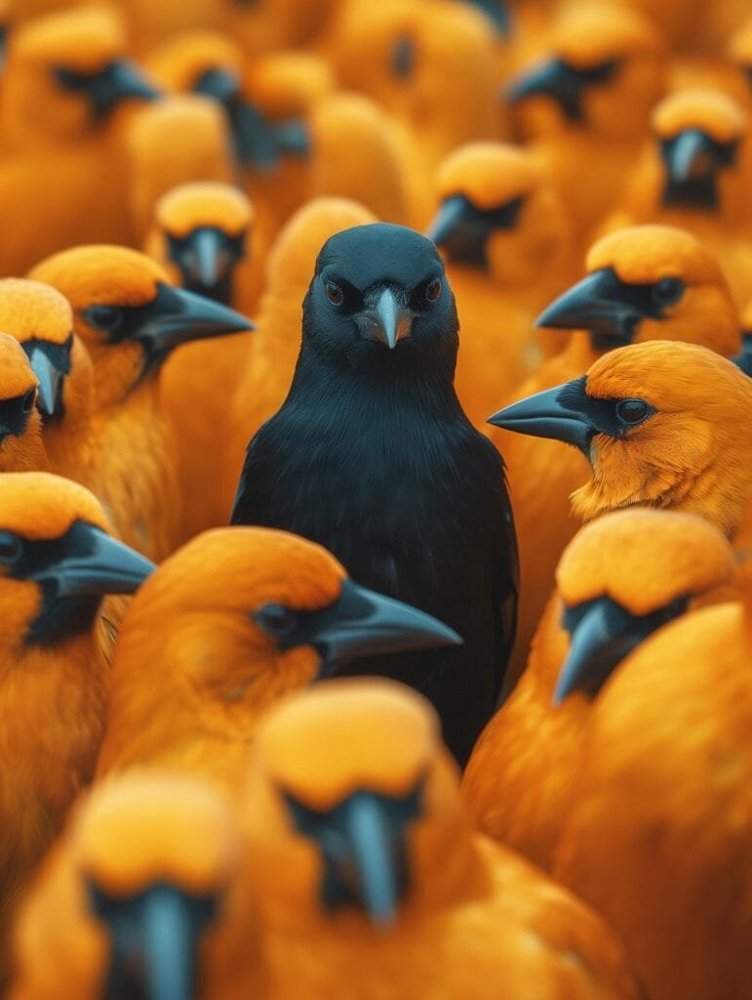

Imagine standing on the edge of a volcano, feeling the heat radiating from the molten lava below. The sheer power and magnitude of these natural wonders are awe-inspiring, but have you ever considered the impact they have on bird diversity? Volcanic activity, with its eruptive forces and changing landscapes, plays a significant role in shaping the variety of bird species found in volcanic regions. From providing new habitats to influencing migratory patterns, volcanoes have a profound influence on the birds that call these areas home. In this article, we will explore three of the best ways volcanic activity shapes bird diversity, shedding light on the fascinating relationship between these fiery marvels and avian life.

This image is property of pixabay.com.

## Understanding Volcanoes

Volcanoes are fascinating and powerful forces of nature. Understanding how they form, their geographic distribution, and their different types can give us valuable insights into their eruption patterns and the hazards and benefits they bring. By studying volcanoes, we can better understand their impact on habitats, bird migration, bird species diversity, bird adaptation, bird behavior, and even the evolution of bird species. In this comprehensive article, we will explore the various aspects of volcanoes and their influence on bird diversity.

### Formation of Volcanoes

Volcanoes are formed when molten rock, gases, and debris escape to the Earth's surface, causing eruptions of lava and ash. This molten rock, known as magma, is formed deep beneath the Earth's crust in the mantle. When the pressure builds up and the magma finds a path to escape, it erupts through a vent in the volcano. The eruption can be explosive or effusive, depending on factors such as the viscosity of the magma and the amount of gas trapped in it. Over time, repeated eruptions can build up a mountain-like structure, creating a volcano.

### Geographic Distribution of Volcanoes

Volcanoes are not evenly distributed across the planet. They occur at sites along plate boundaries, hotspots under the Earth's crust, or rift zones where the Earth's tectonic plates are moving apart. One prominent region with a high concentration of volcanoes is the "Ring of Fire" encircling the Pacific Ocean. This region is known for its frequent volcanic activity and is a result of the collision of several tectonic plates. Other volcanic regions exist throughout the world, each with their unique characteristics and patterns of volcanic activity.

### Different Types of Volcanoes and Their Eruption Patterns

Volcanoes can be classified into different types based on their shape and eruptive behavior. One common type is the shield volcano, characterized by its broad, gently sloping sides. [Shield volcanoes](https://magmamatters.com/understanding-volcanic-formation-a-comprehensive-guide/ "Understanding Volcanic Formation: A Comprehensive Guide") often erupt less explosively and have lava flows that can travel long distances. Examples of shield volcanoes can be found in the Hawaiian Islands, such as Mauna Loa and Kilauea. Another type is the stratovolcano, which is tall and steep with layers of hardened lava, ash, and volcanic rocks. Stratovolcanoes, also known as composite volcanoes, have explosive eruptions due to the high viscosity of their magma. Mount St. Helens in the United States is a famous stratovolcano. Other types include [cinder cones](https://magmamatters.com/the-birth-of-new-land-understanding-cinder-cones/), lava domes, and calderas, each with their unique characteristics and eruption patterns.

### Hazards and Benefits of Volcanic Eruptions

Volcanic eruptions can have both devastating and beneficial effects. On one hand, they can cause destruction and alteration of habitat. The intense heat, ash, and lava can destroy vegetation, homes, and infrastructure, leading to the displacement of animals, including birds. The toxic gases released during an eruption can also have adverse effects on bird populations. On the other hand, volcanic eruptions can create new habitats. The lava flows can form new land, which eventually supports the growth of vegetation and attracts various bird species. Volcanic ash, rich in nutrients, can also fertilize the soil, resulting in increased plant growth and a subsequent increase in bird abundance. Balancing the hazards and benefits of volcanic eruptions is crucial in understanding their impact on bird diversity.

## Impact of Volcanic Eruptions on Habitat

Volcanic eruptions can have a significant impact on habitats, both in terms of destruction and alteration, as well as the creation of new habitats.

### Destruction and Alteration of Habitat

When a volcano erupts, the lava and ash can completely destroy existing habitats. Vegetation is burned, and the landscape is transformed. This destruction can be especially devastating for birds that rely on specific vegetation types for nesting, feeding, and shelter. Additionally, the alteration of the landscape can disrupt food chains and affect the availability of resources for birds.

### Creation of New Habitats

Despite the destruction caused by volcanic eruptions, they also play a crucial role in the creation of new habitats. The lava flows from volcanic eruptions cool and solidify over time, forming new land. These barren landscapes eventually become colonized by pioneer plants, which attract insects, rodents, and other small animals. These new habitats can provide opportunities for bird species to establish themselves in previously uninhabited areas.

### Fragmentation of Existing Habitats

Volcanic eruptions can also lead to the fragmentation of existing habitats. The lava flows can carve new paths and divide previously contiguous habitats into smaller, isolated pockets. This fragmentation can disrupt the movement and dispersal of bird populations, leading to reduced gene flow and potentially impacting the long-term viability of certain species. The ability of birds to adapt and navigate these fragmented habitats becomes crucial for their survival.

## Effect of Volcanoes on Bird Migration

Bird migration is a remarkable phenomenon, with birds traveling long distances to find suitable breeding and wintering grounds. Volcanic activity can have a significant impact on bird migration patterns and behaviors.

### Interruption of Migratory Routes

Volcanic eruptions can disrupt the traditional migratory routes that birds have followed for generations. When a volcano erupts, the release of ash and gases can create hazardous conditions in the surrounding airspace. Birds may need to alter their flight paths or make detours to avoid flying through these areas. These interruptions can lead to longer and more energetically costly journeys for migrating birds.

### Impact on Timing of Migration

The timing of bird migration is finely tuned to take advantage of favorable environmental conditions. Volcanic eruptions can disrupt these conditions and affect the timing of migration. The presence of ash particles in the air can reduce visibility and alter weather patterns, making it more challenging for birds to navigate. As a result, birds may delay or accelerate their migration to avoid flying through areas affected by volcanic activity.

### Influence on Destination of Migration

Birds rely on a combination of genetic programming and environmental cues to determine their migratory destinations. Volcanic activity can disrupt these cues and influence the destination of bird migration. Changes in wind patterns, altered landscapes, and the availability of food and nesting sites can all affect where birds ultimately choose to settle. Volcanoes can create new habitats and food sources that attract birds, altering their traditional migration destinations.

## Influence of Volcanic Activity on Bird Species Diversity

The influence of volcanic activity on bird species diversity is multifaceted, with volcanoes playing a role in both species diversification and disturbance.

### Role of Volcanoes in Species Diversification

Volcanic activity can be a driver of species diversification in birds. Islands formed by volcanic eruptions, such as the Hawaiian Islands, provide unique opportunities for colonization and isolation. Birds that manage to reach these isolated habitats can diversify and adapt to the specific environmental conditions found on these islands. It is often on these volcanic islands that endemic species, found nowhere else in the world, emerge.

### Influence of Volcanic Disturbances on Bird Communities

While volcanic eruptions can lead to the creation of new habitats and the diversification of bird species, they can also disrupt existing bird communities. Disruptions in food availability, habitat destruction, and changes in environmental conditions can negatively impact bird populations. Some bird species may be more resilient and able to adapt to these disturbances, while others may struggle to survive. Understanding the resilience and adaptability of different bird species in the face of volcanic disturbances is essential in predicting and managing their long-term survival.

### Effect of Volcanoes on Endemic Bird Species

Volcanic islands are often hotspots for endemic bird species. These birds have evolved in isolation on specific islands and are uniquely adapted to the local environment. Volcanic eruptions can have both positive and negative effects on these endemic bird species. On one hand, eruptions can destroy their habitats and lead to population declines. On the other hand, new habitats formed by volcanic activity can provide opportunities for the expansion of endemic species' ranges and increase their population sizes. The interplay between volcanic activity and endemic bird species is complex and requires careful monitoring and conservation efforts.

## Volcanic Landscapes and Bird Adaptation

Volcanic landscapes provide unique challenges and opportunities for bird species. The extreme and ever-changing conditions of volcanic regions require birds to adapt to new habitats, altered food sources, and changed environmental conditions.

### Adaptation to New Habitats

Birds that inhabit volcanic landscapes often need to adapt to the barren and harsh environments. These adaptations can include changes in plumage coloration, beak shape, and feeding strategies. For example, birds may develop specialized beaks to access food sources found in volcanic rock crevices or develop cryptic plumage patterns to blend in with the volcanic ash. Over time, these adaptations can lead to the evolution of new bird species uniquely suited to volcanic environments.

### Adaptation to Altered Food Sources

Volcanic eruptions can have a significant impact on the availability of food sources for birds. The destruction of vegetation can reduce the abundance of fruits, seeds, and insects that birds rely on for sustenance. However, volcanic activity also brings opportunities for birds to exploit new food sources. The nutrient-rich volcanic ash can stimulate the growth of plants, which, in turn, attract insects and other invertebrates. Birds that can adapt their feeding behaviors and take advantage of these new food sources have a better chance of survival and successful reproduction.

### Adaptation to Changed Environmental Conditions

Volcanic eruptions can drastically alter the environmental conditions of an area. The release of gases, the deposition of ash, and changes in temperature can all impact bird populations. Birds that can tolerate high levels of [sulfur dioxide and other volcanic gases](https://magmamatters.com/the-art-and-science-of-volcano-monitoring/ "The Art and Science of Volcano Monitoring") have a better chance of survival in these environments. Additionally, volcanic landscapes often experience rapid changes in weather patterns, such as the formation of strong updrafts and downdrafts. Birds that can navigate these turbulent conditions and take advantage of wind patterns may have a competitive edge in volcanic regions.

## Effect of Volcanoes on Bird Behavior

Volcanic activity can cause significant disruptions and changes in bird behavior, as birds respond to the disturbances and new environmental conditions brought about by eruptions.

### Changes in Nesting Behavior

Birds rely on specific nesting habitats to successfully raise their young. Volcanic eruptions can destroy or alter these habitats, forcing birds to change their nesting behaviors. They may need to search for new nesting sites in the aftermath of an eruption or modify existing nests to adapt to the changed environment. Some bird species may even abandon areas affected by volcanic activity altogether, resulting in localized population declines.

### Alterations in Feeding Habits

When a volcanic eruption occurs, the availability of food sources can change dramatically. Birds may need to adapt their feeding habits to access new food sources or switch to alternative prey items that are more abundant in volcanic landscapes. These alterations in feeding habits can have cascading effects on food webs and can influence the distribution and abundance of bird species within a volcanic region.

### Behavioral Responses to Volcanic Disturbances

Birds are highly adaptable creatures, capable of responding to changes in their environment. In the face of volcanic disturbances, birds may exhibit various behavioral responses. They may engage in territorial defense to protect their nest sites from other displaced individuals, engage in aerial displays and vocalizations to attract mates, or alter their migration routes to avoid areas affected by volcanic activity. These behavioral responses are vital for the survival and reproductive success of bird populations in volcanic landscapes.

## Role of Volcanoes in Evolution of Bird Species

Volcanic activity can play a significant role in the evolution and diversification of bird species, shaping their genetic composition and contributing to the formation of new bird species.

### Influence on Genetic Diversification

Isolated volcanic regions can act as natural laboratories for genetic diversification. The unique landscapes and environmental conditions found in volcanic areas can lead to genetic differentiation among bird populations. Over time, these genetic differences can accumulate, ultimately resulting in the formation of genetically distinct populations or even new bird species. Studying the genetic diversity of bird populations in volcanic regions can provide insights into the processes of speciation and evolution.

### Role in the Formation of New Species

Volcanic islands are famous for being hotspots of diversity, with many endemic bird species found nowhere else on Earth. These species have often evolved in isolation on these islands and are the result of speciation events triggered by volcanic activity. The sudden creation of new habitat after a volcanic eruption provides opportunities for the colonization and subsequent evolution of bird species. The interplay between volcanic activity, isolation, and founder effects can lead to the emergence of unique bird species with specialized adaptations to their volcanic environments.

### Impact on Survival of the Fittest

Volcanic landscapes can be harsh and unpredictable. The survival of bird species in volcanic regions relies on their ability to adapt to changing environmental conditions and compete for limited resources. Natural selection plays a significant role in determining which individuals are better suited to the challenges posed by volcanic activity. Birds with traits and behaviors that enhance their survival and reproductive success in volcanic regions are more likely to pass on their genes, shaping the genetic composition of future bird populations.

## The Impact of Volcanic Ash and Gases on Birds

Volcanic eruptions release ash and gases into the atmosphere, creating hazardous conditions for birds.

### Adverse Health Effects of Volcanic Ash

Volcanic ash can have severe health effects on birds. Fine ash particles can irritate the respiratory system of birds, leading to breathing difficulties and even death in severe cases. Ash can also contaminate water bodies, reducing the availability of clean drinking water for birds. Prolonged exposure to volcanic ash can have long-lasting impacts on bird populations, affecting their overall health and reproductive success.

### Hazards of Volcanic Gases on Bird Populations

Volcanic eruptions release various gases, including sulfur [dioxide and carbon](https://magmamatters.com/geothermal-energy-and-its-volcanic-origins/ "Geothermal Energy and Its Volcanic Origins") dioxide, which can be toxic to birds. In high concentrations, these gases can cause suffocation and respiratory distress. Birds that are exposed to volcanic gases may experience reduced flight performance, impaired foraging abilities, and increased vulnerability to predation. Monitoring and understanding the gas emissions associated with volcanic activity can help mitigate these hazards and protect bird populations.

### Strategies Adopted by Birds to Mitigate Effects of Ash and Gases

Birds have evolved various strategies to mitigate the effects of volcanic ash and gases. Some birds may temporarily relocate to safer areas until the ash settles and the air quality improves. Others may seek shelter in dense vegetation or underground burrows to minimize their exposure. Additionally, birds that rely on vocal communication may adjust their calls and songs to compensate for reduced acoustic transmission caused by the presence of ash particles in the air.

## Case Studies: Bird Diversity in Different Volcanic Regions

Examining bird diversity in various volcanic regions provides valuable insights into the impact of volcanic activity on avian populations.

### Bird Diversity in 'Ring of Fire' Region

The "Ring of Fire" is a region with a high concentration of volcanoes encircling the Pacific Ocean. This region is known for its active tectonic activity, resulting in frequent volcanic eruptions. The volcanic activity in the 'Ring of Fire' has shaped the bird diversity in the area. Researchers have documented a rich assortment of bird species in these volcanic regions, with endemic species found on islands formed by volcanic activity. Understanding the unique bird communities in this region can help guide conservation efforts and protect their fragile ecosystems.

### Analysis of Bird Species in Hawaiian Shield Volcanoes

The Hawaiian Islands, located in the middle of the Pacific Ocean, are famous for their shield volcanoes, such as Mauna Loa and Kilauea. These volcanoes have played a key role in shaping bird diversity in Hawaii. From honeycreepers with vibrant plumage to the elusive Hawaiian Akepa, the Hawaiian Islands are home to a wide range of unique bird species. Scientists have conducted extensive studies on bird populations in these volcanic environments, providing valuable insights into the factors influencing their diversity and conservation needs.

### Impact on Bird Diversity in Other Volcanic Regions

Volcanic regions around the world, from the Galapagos Islands to the Canary Islands, have their own unique bird communities shaped by their volcanic landscapes. Researchers have examined the impact of volcanic activity on bird diversity in these regions, studying how eruptions and subsequent habitat changes affect bird populations. By analyzing these case studies, we can gain a comprehensive understanding of the intricate relationship between volcanic activity and bird diversity across the globe.

## Future Prospects: Volcanic Activity and Bird Diversity

As we look to the future, it is essential to consider the potential impact of future volcanic eruptions on bird diversity and develop strategies to mitigate risks to bird populations.

### Predicted Impact of Future Eruptions

The study of volcanic activity patterns, along with advances in technology, allows scientists to make predictions about future eruptions. By analyzing historical data and monitoring volcanic activity, scientists can identify areas at the highest risk of eruptions. These predictions can help inform conservation efforts and ensure the protection of bird populations in at-risk volcanic regions.

### Mitigating Risks to Bird Populations

Mitigating risks to bird populations in volcanic regions requires a multi-faceted approach. Protected areas can be established to safeguard critical habitats and minimize disturbances caused by human activities. Additionally, early warning systems can be implemented to alert researchers and conservationists of impending eruptions, allowing for timely evacuation or intervention to protect bird populations and their habitats.

### Conservation Strategies for Birds in Volcanic Areas

Conservation strategies tailored specifically for bird populations in volcanic areas are crucial for their long-term survival. These strategies can include habitat restoration efforts, establishing corridors to promote gene flow between fragmented populations, and raising awareness about the importance of protecting these unique ecosystems. Collaborative efforts between scientists, conservation organizations, and local communities are instrumental in implementing effective conservation measures for birds in volcanic areas.

In conclusion, volcanoes have a profound impact on bird diversity. From the formation of new habitats and the disruption of migratory routes to the adaptation of bird species and the role of volcanic activity in evolution, understanding the relationship between volcanoes and bird diversity is vital for conservation efforts. By comprehensively studying the various aspects of this complex interaction, we can develop strategies to mitigate the risks posed by volcanic activity and ensure the long-term survival of bird populations in volcanic regions.

