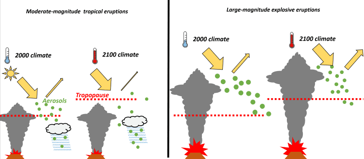

Have you ever wondered about the connection between volcanic activity and global warming? Volcanic eruptions are not only mesmerizing natural phenomena, but they also have a significant impact on our climate. In this article, we will explore the various ways in which volcanic activity influences global warming. From the release of greenhouse gases to the formation of aerosols in the atmosphere, volcanoes play a crucial role in shaping the Earth's climate. Join us as we delve into the fascinating relationship between volcanic eruptions and the warming of our planet.

This image is property of d9-wret.s3.us-west-2.amazonaws.com.

## Understanding the Basics of Volcanic Activity

### Definition of volcanic activity

Volcanic activity refers to the processes and phenomena associated with the eruption of volcanoes. It involves the release of molten rock (magma), gases, and volcanic ash from the Earth's crust onto the surface. This can result in the formation of lava flows, volcanic bombs, pyroclastic flows, and other volcanic landforms.

### Types of volcanoes

There are several types of volcanoes, each with its own unique characteristics and eruption styles. The most common types include shield volcanoes, stratovolcanoes, and [cinder cones](https://magmamatters.com/the-birth-of-new-land-understanding-cinder-cones/).

- Shield volcanoes: These volcanoes have gentle slopes and are formed by the accumulation of numerous thin lava flows. They are characterized by low viscosity lava that can travel long distances, resulting in broad, shield-like shapes.
    
- Stratovolcanoes: Also known as composite volcanoes, stratovolcanoes are steep-sided and cone-shaped. They are built up by alternating layers of lava, volcanic ash, and other pyroclastic materials. Stratovolcanoes often have explosive eruptions due to the high viscosity of their magma.
    
- Cinder cones: Cinder cones are small, steep-sided volcanoes that form from the eruption of gas-rich magma. They are composed mainly of volcanic cinders, scoria, and other fragmented volcanic material.
    

### Geographic distribution of volcanoes

Volcanoes can be found all over the world, but they are most commonly concentrated in specific regions. The "Ring of Fire," a horseshoe-shaped area encircling the Pacific Ocean, is known for its intense volcanic and [seismic activity](https://magmamatters.com/the-art-and-science-of-volcano-monitoring/ "The Art and Science of Volcano Monitoring"). This region is home to many of the world's most active volcanoes, including Mount St. Helens and Mount Fuji.

Other volcanic hotspots include the East African Rift, where the earth's tectonic plates are moving apart, and the Hawaiian Islands, which are formed by a hotspot under the Earth's crust. Volcanoes can also be found underwater, along mid-ocean ridges and submarine volcanoes.

### Eruption causes and patterns

Volcanic eruptions are caused by the movement and release of magma from beneath the Earth's surface. The exact triggers for eruptions can vary, but they are typically associated with plate tectonics, the movement of magma through volcanic conduits, or the interaction between magma and external processes such as groundwater.

Eruption patterns can be classified into different types based on the volcanic explosivity index (VEI) and the style of eruption. Some eruptions are characterized by explosive volcanic activity, which can produce ash clouds, pyroclastic flows, and widespread volcanic ash fallout. Other eruptions may be less explosive, with the lava flowing steadily from the volcano.

Understanding the causes and patterns of volcanic eruptions is crucial for predicting and mitigating the potential hazards associated with volcanic activity.

## Volcanic Emissions and Climate Change

### Composition of volcanic emissions

Volcanic emissions consist of a combination of gases, aerosols, and ash particles released during volcanic eruptions. The composition of these emissions can vary depending on factors such as the type of volcano, the chemical composition of the magma, and the depth of the magma source.

The main gases released during volcanic eruptions include water vapor (H2O), carbon dioxide (CO2), sulfur dioxide (SO2), hydrogen sulfide (H2S), and various other sulfur compounds. Volcanic emissions can also contain minor amounts of gases such as carbon monoxide (CO), nitrogen oxides (NOx), and halogen compounds.

In addition to gases, volcanic emissions also contain solid particles known as volcanic ash. These particles are made up of fragments of volcanic glass, minerals, and other crystalline materials.

### How volcanic emissions contribute to the greenhouse effect

Volcanic emissions, particularly carbon dioxide (CO2) and sulfur dioxide (SO2), contribute to the greenhouse effect and climate change. CO2 is a greenhouse gas that traps heat in the Earth's atmosphere, leading to an increase in global temperatures. SO2, on the other hand, can react with other compounds in the atmosphere to form aerosols, which can also contribute to warming by absorbing and trapping heat.

While volcanic emissions can have short-term cooling effects due to the reflection of sunlight by aerosols, the long-term warming effects of greenhouse gases like CO2 outweigh these temporary cooling effects.

### Comparing volcanic emissions with human-induced greenhouse gases

Although volcanic emissions can contribute to the greenhouse effect, they are relatively small compared to human-induced emissions. According to research, volcanic emissions account for less than 1% of the total CO2 emissions from human activities.

Human activities, such as the burning of fossil fuels, deforestation, and industrial processes, are the primary drivers of greenhouse gas emissions. These human-induced emissions far outweigh the natural emissions from volcanoes and have a much greater [impact on global warming and climate change](https://magmamatters.com/geothermal-energy-and-its-volcanic-origins/ "Geothermal Energy and Its Volcanic Origins").

It is important to understand and address human-induced greenhouse gas emissions to effectively mitigate the effects of climate change.

<iframe width="560" height="315" src="https://www.youtube.com/embed/8Z9e2PVnnIo" frameborder="0" allow="accelerometer; autoplay; encrypted-media; gyroscope; picture-in-picture" allowfullscreen></iframe>

  

## Volcanic Particles and Solar Radiation

### The role of volcanic aerosols in the stratosphere

Volcanic aerosols, which are tiny particles of volcanic ash and sulfur compounds, can be injected into the stratosphere during powerful volcanic eruptions. The stratosphere is the layer of the Earth's atmosphere located between 10 to 50 kilometers above the surface.

When volcanic aerosols reach the stratosphere, they can remain suspended for months to years, creating a haze that can scatter and absorb sunlight. This scattering and absorption of solar radiation by volcanic aerosols can have significant effects on the Earth's energy balance and climate.

### How volcanic ash particles reflect solar radiation

Volcanic ash particles have a reflective nature, meaning they can bounce sunlight back into space before it reaches the Earth's surface. This reflection of solar radiation by volcanic ash can result in a cooling effect on the Earth's surface by reducing the amount of sunlight that reaches the surface.

The reflective nature of volcanic ash particles can also lead to colorful sunsets and sunrises, as the scattered light interacts with the Earth's atmosphere.

### Long-term effects of volcanic aerosols on global temperature

The presence of volcanic aerosols in the stratosphere can have both short-term and long-term effects on global temperature. In the short term, the scattering and absorption of sunlight by volcanic aerosols can cause a temporary cooling of the Earth's surface, known as volcanic cooling.

However, the long-term effects of volcanic aerosols on global temperature depend on factors such as the magnitude and duration of the volcanic eruption, as well as the composition and distribution of the aerosols in the stratosphere.

While volcanic aerosols can have a cooling effect in the short term, the warming effects of greenhouse gases like CO2 can dominate in the long term. Therefore, the impact of volcanic aerosols on global temperature is typically temporary and smaller compared to the effects of greenhouse gases.

## Large-Scale Volcanic Eruptions and their Climate Impact

### Case studies of major eruptions and subsequent climate change (e.g., Mount Pinatubo, Krakatoa)

Several major volcanic eruptions in history have had profound impacts on the Earth's climate. Two notable examples are the eruptions of Mount Pinatubo in 1991 and Krakatoa in 1883.

The eruption of Mount Pinatubo in the Philippines injected a large amount of sulfur dioxide (SO2) into the stratosphere, resulting in the formation of sulfuric acid aerosols. These aerosols reflected sunlight back into space, cooling the Earth's surface by about 0.5 to 0.6 degrees Celsius for a year or two.

The eruption of Krakatoa, located in present-day Indonesia, unleashed massive amounts of ash and debris into the atmosphere. This led to global cooling effects and phenomena such as "volcanic winter," where temperatures dropped significantly and had widespread effects on weather patterns.

### Duration of effects from major eruptions on global climate

The effects of major volcanic eruptions on the global climate can vary in duration. While the initial cooling from volcanic aerosols may last for a few years, the complete recovery of the Earth's climate system can take several years to decades.

After a major eruption, volcanic aerosols gradually settle out of the stratosphere, leading to a decrease in their cooling effects. However, the impacts on climate can persist for an extended period, affecting regional weather patterns and atmospheric circulation.

### Influence of large-scale eruptions on atmospheric chemistry

Large-scale volcanic eruptions can have significant impacts on atmospheric chemistry. The release of sulfur dioxide (SO2) during eruptions can lead to the production of sulfuric acid aerosols in the stratosphere. These aerosols can play a role in the depletion of ozone in the ozone layer, which protects the Earth from harmful ultraviolet (UV) radiation.

Volcanic eruptions can also introduce large amounts of nitrogen oxides (NOx) into the atmosphere. These NOx compounds can have complex interactions with other atmospheric constituents, contributing to the formation of secondary pollutants such as ozone (O3) and nitrogen dioxide (NO2).

Understanding the influence of large-scale volcanic eruptions on atmospheric chemistry is crucial for studying their effects on climate and air quality.

This image is property of static.scientificamerican.com.

## Volcanic Activity and Ocean Acidification

### Impact of volcanic CO2 emissions on ocean pH levels

Volcanic CO2 emissions can contribute to the acidification of the oceans. When CO2 dissolves in seawater, it reacts with water to form carbonic acid. This process lowers the pH of the water, making it more acidic.

Ocean acidification can have detrimental effects on marine organisms, particularly those that rely on calcium carbonate to build their shells and skeletons. The increased acidity can make it more challenging for these organisms to form and maintain their structures, leading to potential impacts on marine ecosystems.

### Effects on marine life and ecosystems

Volcanic eruptions can have both short-term and long-term effects on marine life and ecosystems. In the immediate aftermath of an eruption, the release of volcanic ash and other volcanic debris into the ocean can result in localized impacts, such as smothering and suffocating marine organisms.

The acidification of seawater due to volcanic CO2 emissions can also affect the growth and survival of corals, shellfish, and other calcifying organisms. These organisms play a crucial role in marine ecosystems and provide habitat and food sources for a variety of marine species.

### Oceans as carbon sinks and the role of volcanoes

Oceans play a vital role in regulating the Earth's climate by acting as a carbon sink. They absorb a significant portion of the CO2 emitted into the atmosphere, helping to mitigate the effects of climate change.

Volcanic eruptions can contribute to this natural carbon sink through the release of CO2 into the atmosphere, which can then dissolve in seawater. The carbon absorbed by the oceans can be stored for long periods, thereby reducing its impact on the atmosphere.

Understanding the interaction between volcanic activity, ocean acidification, and carbon cycling is crucial for assessing the overall impact of volcanoes on climate change and marine ecosystems.

## Volcanic Activity and Sea-Level Changes

### Volcanic eruptions and immediate sea-level changes

During a volcanic eruption, the sudden release of magma, gases, and other volcanic materials can cause localized sea-level changes. These changes can be temporary and short-lived, affecting the coastal areas near the volcano.

The displacement of water by volcanic activity can lead to a temporary rise or fall in sea level, depending on the volume and direction of the eruption. These immediate sea-level changes can have immediate impacts on coastal ecosystems and communities.

### The role of volcanoes in long-term sea-level shifts

While volcanic eruptions may cause short-term sea-level changes, they do not significantly contribute to long-term sea-level rise. This is because the volume of material released during volcanic eruptions is relatively small compared to other factors influencing sea-level changes, such as melting glaciers and thermal expansion of seawater due to climate change.

It is important to differentiate between immediate sea-level changes caused by volcanic activity and long-term sea-level shifts associated with ongoing global climate change.

### Effects of sea-level changes on global warming

Sea-level changes, both short-term and long-term, can have implications for global warming and climate change. Rising sea levels can result in increased coastal erosion, loss of habitat, and increased vulnerability to storm surges.

Additionally, the inundation of low-lying coastal areas can lead to saltwater intrusion into freshwater supplies and displacement of communities.

Understanding the relationship between sea-level changes and global warming is crucial for developing strategies to mitigate the impacts of climate change on coastal areas.

This image is property of media.npr.org.

## Volcanoes and Albedo Effect

### How volcanic aerosols increase Earth's albedo effect

Volcanic aerosols, particularly those containing ash particles, can increase the Earth's albedo effect. Albedo refers to the fraction of solar radiation reflected by a surface. Light-colored surfaces, such as fresh volcanic ash, have high albedo values, reflecting a significant portion of incoming sunlight back into space.

When volcanic aerosols are injected into the atmosphere during eruptions, they can spread across large areas and create a reflective layer. This enhanced albedo effect can lead to a temporary cooling of the Earth's surface by reducing the amount of solar radiation absorbed by the Earth.

### Effects of increased albedo on global temperatures

The increased albedo caused by volcanic aerosols can have significant effects on global temperatures. By reflecting sunlight away from the Earth's surface, the cooling effect of volcanic aerosols can temporarily counteract the warming effects of greenhouse gases, such as CO2, in the atmosphere.

However, the duration and magnitude of the cooling effect depend on various factors, including the size and composition of the aerosols, their distribution in the atmosphere, and the characteristics of the underlying surface.

### Duration of albedo effects after volcanic activity

The duration of the albedo effects after volcanic activity can vary depending on the factors mentioned above. Generally, the effects of volcanic aerosols on the Earth's albedo are relatively short-lived, lasting from months to a few years.

As the volcanic aerosols gradually settle out of the atmosphere or are removed through atmospheric processes, the albedo returns to its normal state. The long-term impacts of volcanic activity on global temperature are primarily driven by greenhouse gas emissions, rather than the short-term reflective effects of aerosols.

## Volcanic Activity and Carbon Cycle Disruption

### Effects of volcanic eruptions on carbon sinks

Volcanic eruptions can disrupt the Earth's carbon cycle by releasing large amounts of carbon dioxide (CO2) into the atmosphere. This additional CO2 can affect the balance between carbon sources and sinks, potentially leading to an increase in atmospheric CO2 concentrations.

The release of CO2 during volcanic eruptions can overwhelm the natural carbon sinks, such as forests and oceans, that absorb CO2 from the atmosphere. This disturbance in the carbon cycle can contribute to higher atmospheric CO2 levels and potentially exacerbate global warming.

### Long-term impacts on carbon cycle and climate change

The long-term impacts of volcanic activity on the carbon cycle and climate change depend on the magnitude and frequency of volcanic eruptions, as well as the ability of natural carbon sinks to absorb and store CO2.

While individual volcanic eruptions may have temporary effects on the carbon cycle, the overall contribution of volcanic activity to long-term climate change is relatively small compared to human-induced emissions.

### Comparison to human-induced disruptions in the carbon cycle

Human activities, such as burning fossil fuels and deforestation, have a much larger and sustained impact on the carbon cycle compared to volcanic activity. The burning of fossil fuels releases vast amounts of CO2 into the atmosphere, which is not effectively offset by natural carbon sinks.

The disruption caused by human-induced carbon emissions surpasses the short-term disturbances caused by volcanic eruptions and has a significant influence on the global carbon cycle and climate change. Addressing human-induced disruptions in the carbon cycle is crucial for mitigating the impacts of climate change.

This image is property of www.cam.ac.uk.

## Volcanic Activity and Weather Patterns

### Impact of volcanic eruptions on local weather

Volcanic eruptions can have immediate and localized impacts on weather patterns in the areas surrounding the volcano. The release of volcanic gases and ash can alter temperature, humidity, precipitation, and wind patterns.

Volcanic ash can act as cloud condensation nuclei, leading to the formation of clouds and potentially affecting rainfall patterns. The injection of gases like sulfur dioxide (SO2) into the atmosphere can lead to the formation of sulfuric acid aerosols, which can influence cloud properties and impact precipitation processes.

### Effects of volcanic eruptions on global weather patterns

In addition to local impacts, volcanic eruptions can also affect global weather patterns. The injection of volcanic aerosols into the stratosphere can alter the distribution of heat, moisture, and winds on a global scale. This can lead to changes in atmospheric circulation patterns, such as the jet stream, and can impact weather systems thousands of kilometers away from the eruption site.

The effects of volcanic eruptions on global weather patterns can persist for months to years, depending on the magnitude of the eruption and the characteristics of the aerosols released.

### Duration and sustainability of weather changes due to volcanic activities

The duration and sustainability of weather changes resulting from volcanic activities depend on various factors, including the magnitude and duration of the eruption, the composition and distribution of the volcanic aerosols, and the atmospheric conditions.

While some weather changes may be short-lived and return to normal once the aerosols disperse, others can have more prolonged impacts. The sustainability of weather changes due to volcanic activities is closely tied to the persistence of the aerosols in the atmosphere and their interactions with other atmospheric processes.

Understanding the relationship between volcanic activity and weather patterns is crucial for predicting and mitigating the potential impacts on local and global weather systems.

## Mitigating the Impact of Volcanic Activity on Global Warming

### Strategies for monitoring and predicting volcanic activity

The monitoring and prediction of volcanic activity are essential for mitigating its impact on global warming. Scientists use various techniques, including seismology, gas monitoring, ground deformation measurements, and satellite remote sensing, to detect and track changes in volcanic activity.

Monitoring networks can provide early warning signs of volcanic unrest, allowing authorities to implement evacuation plans and take precautionary measures to protect local communities.

### Mitigation efforts post-volcanic eruptions

After a volcanic eruption, mitigation efforts focus on addressing the immediate and long-term impacts on affected communities and ecosystems. These efforts may include providing emergency response services, evacuating at-risk populations, and conducting post-eruption assessments to evaluate the extent of the damage.

In some cases, volcanic ash can pose a significant threat to public health and infrastructure. Mitigation measures may involve ash removal, cleaning of water supplies, and protection of agricultural lands from ashfall.

### Adapting to climate changes induced by volcanic activity

Adapting to climate changes induced by volcanic activity requires a comprehensive approach that includes scientific research, community engagement, and policy development. Understanding the potential impacts of volcanic activity on climate change can help inform adaptation strategies at the local, regional, and global levels.

Adaptation measures may include improving disaster preparedness, enhancing early warning systems, developing resilient infrastructure, and promoting sustainable land and resource management practices.

By understanding the potential impacts of volcanic activity on global warming and implementing appropriate mitigation and adaptation strategies, we can minimize the risks and protect vulnerable communities and ecosystems from the effects of volcanic eruptions.

