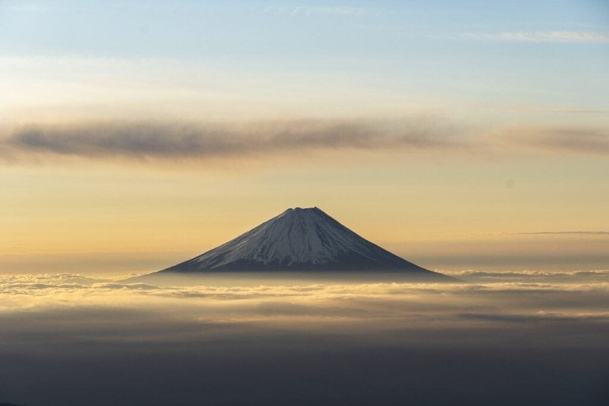
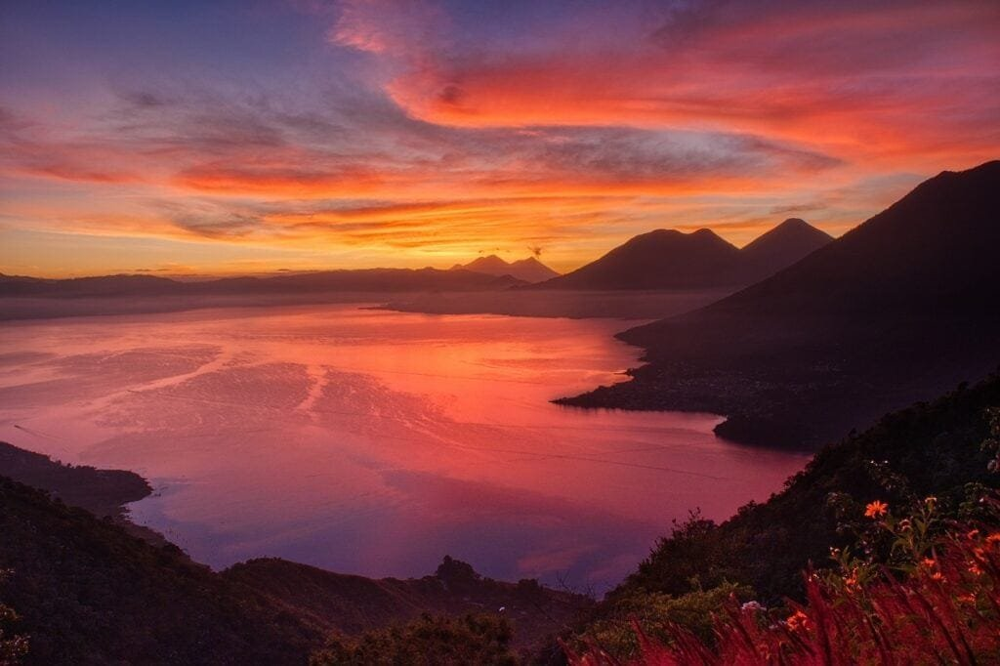
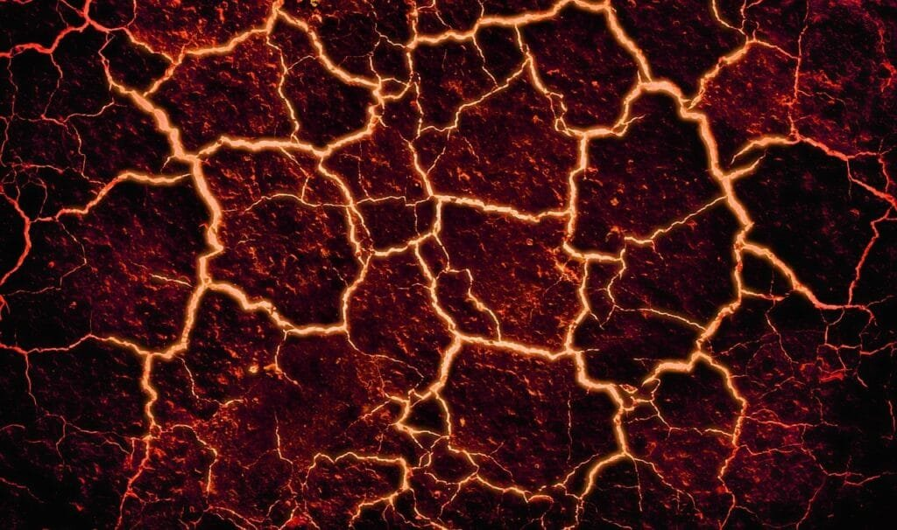

Volcanic eruptions have a significant impact on the formation of the Earth's crust. When molten rock, gases, and debris escape to the surface, they create volcanoes that release lava and ash. These volcanoes can be found along plate boundaries, hotspots beneath the Earth's crust, or rift zones where tectonic plates are moving apart. The "Ring of Fire" around the Pacific Ocean is a prime location for volcanic activity, with frequent eruptions occurring due to the meeting of tectonic plates. While some volcanoes erupt explosively, others, like shield volcanoes in Hawaii, form gradually over time and erupt less violently. Understanding different eruption patterns, such as lava viscosity and gas content, is crucial in predicting future volcanic activity and mitigating risks to surrounding communities. Despite the hazards they pose, volcanic eruptions also bring benefits by providing nutrients to the soil and contributing to the formation of the Earth's crust. By exploring the various contributions of volcanoes to crust formation, we can gain a comprehensive understanding of these natural phenomena and their impact on our planet.

This image is property of pixabay.com.

## Overview of Volcanic Eruptions

Volcanic eruptions are natural phenomena that occur when molten rock, known as magma, and other materials are expelled from a volcano onto the surface of the Earth. These eruptions can be accompanied by various forms of volcanic activity, such as the release of gases, ash, and pyroclastic flows.

Volcanic eruptions can be triggered by factors including tectonic plate movement, the build-up of pressure within the volcano, and the composition of the magma. The intensity and duration of an eruption can vary greatly, with some being relatively mild while others are highly explosive and can result in significant damage and loss of life.

Volcanic eruptions can occur in various locations around the world, but they are most commonly found along tectonic plate boundaries. These boundaries are areas where two tectonic plates are either colliding, moving apart, or sliding past each other. The movement and interaction of these plates provide the conditions necessary for the formation and eruption of volcanoes.

## Volcanoes and Tectonic Plate Boundaries

Volcanoes that are formed at tectonic plate boundaries are typically associated with subduction zones, where one tectonic plate is forced beneath another. As the subducting plate sinks into the Earth's mantle, it begins to melt, forming magma. This magma then rises to the surface, leading to the creation of a volcanic arc. Examples of volcanic arcs include the cascades in the western United States and the Andes in South America.

Volcanoes formed at plate boundaries often exhibit specific characteristics. They tend to be explosive in nature, releasing a combination of gases, ash, and pyroclastic material. These eruptions can result in the formation of volcanic ash clouds and significant destruction in the surrounding areas.

The Ring of Fire, a region encircling the Pacific Ocean, is known for its high concentration of volcanoes. This area is located at the meeting points of several tectonic plates, making it highly susceptible to volcanic activity. The volcanic eruptions in the Ring of Fire contribute significantly to the formation of Earth's crust in this region.

<iframe width="560" height="315" src="https://www.youtube.com/embed/R_pDKyg5YKY" frameborder="0" allow="accelerometer; autoplay; encrypted-media; gyroscope; picture-in-picture" allowfullscreen></iframe>

  

## Volcanoes Formed Over Hot Spots

Volcanoes formed over hot spots are a result of localized intense heat and upwelling mantle material from deep within the Earth. These hot spots occur away from tectonic plate boundaries and create a volcanic plume that rises toward the surface, leading to the formation of a volcano.

The process of shield volcano formation over hot spots is characterized by the repeated eruption of low-viscosity lava. This type of lava flows easily and travels long distances, spreading out in thin layers to form a broad, shield-like shape. The Hawaiian Islands are a prime example of shield volcanoes formed over hot spots.

Volcanoes formed over hot spots often have different characteristics compared to those formed at plate boundaries. They typically have less explosive eruptions, with lava flowing freely rather than explosively erupting. Due to the relatively low viscosity of the lava, it can cover large areas and contribute to the gradual formation and expansion of Earth's crust.

## Effect of Lava Viscosity and Gas Content on Eruption Patterns

The viscosity of lava refers to its resistance to flow. It is influenced by factors such as temperature, composition, and gas content. Lava with low viscosity, such as basaltic lava, flows more easily and can travel greater distances before solidifying. On the other hand, lava with high viscosity, such as rhyolitic lava, is more sticky and flows more slowly.

The gas content in magma plays a crucial role in determining eruption patterns as well. The presence of dissolved gases, such as water vapor, [carbon dioxide](https://magmamatters.com/geothermal-energy-and-its-volcanic-origins/ "Geothermal Energy and Its Volcanic Origins"), and sulfur dioxide, can lead to explosive eruptions. As magma rises towards the surface, the decreasing pressure causes the gas to be released, creating an upward force that propels the magma and other volcanic materials into the air.

Different eruption patterns can occur based on the viscosity of the lava and the gas content in magma. Effusive eruptions, characterized by the gentle release of lava flows, are often associated with low-viscosity lava and lower gas content. Explosive eruptions, on the other hand, are usually associated with high-viscosity lava and higher gas content.

These eruption patterns have different impacts on crust formation. Effusive eruptions contribute to the gradual building of Earth's crust through the accumulation of lava layers. Explosive eruptions, on the other hand, can result in the formation of ash clouds and pyroclastic flows, which can have a more immediate and destructive impact on the surrounding crust.

This image is property of pixabay.com.

## Volcanic Eruptions and Crust Formation

Volcanic eruptions play a crucial role in the formation of Earth's crust. The materials released during eruptions, including magma, lava, ash, and gases, contribute to the creation of new crustal rocks and can cause significant changes to existing ones.

Different types of volcanic materials contribute to crust formation in various ways. Magma, when it reaches the surface as lava and cools, solidifies to form igneous rocks. These rocks make up a significant portion of the Earth's crust. Ash, which is made up of tiny volcanic glass fragments, can accumulate and compact over time to form sedimentary rocks. Gases released during eruptions can also contribute to the formation of crustal rocks through chemical reactions with the surrounding material.

Volcanic ash and lava have a direct impact on the Earth's upper crust. Ash can blanket large areas and be deposited on land and in bodies of water. Over time, this ash can compact and become part of the sedimentary record, contributing to the formation of rock layers. Lava, when it solidifies, can form volcanic rocks that become part of the Earth's crust.

## Impact of Volcanoes on Soil Nutrient Value

Volcanic eruptions can have a positive impact on soil quality due to the deposition of mineral-rich volcanic materials. When volcanic ash is deposited on the land, it acts as a natural fertilizer, providing essential nutrients for plant growth. The ash contains various minerals, such as potassium, phosphorus, and calcium, which are beneficial for crops and other vegetation.

The distribution of mineral-rich volcanic materials through eruptions can enhance soil fertility in areas that may otherwise have nutrient-deficient soils. The nutrients released by volcanic eruptions can greatly benefit agricultural productivity in surrounding regions. This phenomenon has been observed in volcanic areas such as Iceland and the Pacific Northwest of the United States, where fertile soils support thriving agricultural industries.

The correlation between volcanic soils and agricultural productivity is well established. Farmers often choose to settle in volcanic regions due to the nutrient-rich soils, which can lead to increased crop yields and overall agricultural success.

This image is property of pixabay.com.

## Volcanic Hazards and Their Effects

Volcanic eruptions can pose various hazards to human life and property. These hazards can include pyroclastic flows, volcanic ash fall, volcanic gases, lahars, and volcanic tsunamis.

Pyroclastic flows are fast-moving currents of hot gas, ash, and rocks that can travel down the slopes of a volcano at high speeds. These flows can cause extensive damage and loss of life, as they can bury entire communities and destroy infrastructure in their path.

Volcanic ash fall occurs when fine ash particles are released into the atmosphere during an eruption. These particles can be carried by wind currents and fall over large areas, blanketing the surrounding landscape. Ash fall can disrupt air traffic, contaminate water sources, and have negative impacts on human health, agriculture, and infrastructure.

Volcanic gases, such as [sulfur dioxide and carbon](https://magmamatters.com/the-art-and-science-of-volcano-monitoring/ "The Art and Science of Volcano Monitoring") dioxide, can be released during eruptions. These gases can be harmful or even fatal if inhaled in high concentrations. They can also cause acid rain, which can damage vegetation, crops, and infrastructure in surrounding areas.

Lahars are volcanic mudflows that occur when volcanic material, such as ash and debris, mixes with water. These lahars can flow rapidly down river valleys and can be highly destructive, burying homes, infrastructure, and agricultural land in their path.

Volcanic tsunamis can be triggered when volcanic eruptions occur under or near bodies of water. These tsunamis can result in massive waves that can travel long distances, causing extensive coastal damage and posing a threat to coastal communities.

## Volcanoes and the Mitigation of Eruption Risks

Predicting volcanic activity is an ongoing challenge, but current methods allow scientists to monitor volcanoes for signs of impending eruptions. Monitoring systems include the use of seismometers to detect seismic activity, gas analyzers to measure gas emissions, and remote sensing techniques to track ground deformation.

Understanding volcanic behavior and eruption patterns can help limit the damage caused by eruptions, as it allows for the development of effective evacuation plans and the implementation of measures to protect vulnerable areas. By studying past eruptions and the behavior of specific volcanoes, scientists can make informed predictions about future activity and mitigate risks to surrounding communities.

Geological studies play a crucial role in mitigating eruption risks and enhancing our understanding of crust formation. By analyzing the composition of volcanic rocks, studying volcanic deposits, and monitoring volcanic activity, scientists gain valuable insights into the processes that drive volcanic eruptions. This knowledge helps inform hazard assessments, land-use planning, and emergency response strategies in volcanic regions.

## Historical Volcanic Eruptions and Their Impact on Crust Formation

Throughout history, several notable volcanic eruptions have had a significant impact on crust formation and the Earth's geology. These eruptions have shaped landscapes, influenced climate patterns, and left a lasting legacy on the crust.

For example, the eruption of Mount Tambora in 1815, located in present-day Indonesia, released an enormous amount of volcanic ash into the atmosphere. The resulting ash cloud caused a drop in global temperatures, leading to a year without a summer in many parts of the world. This eruption had a direct impact on agricultural productivity and resulted in widespread crop failures and famine.

Eruptions like the 1883 eruption of Krakatoa, also in Indonesia, generated powerful tsunamis that caused extensive coastal damage and loss of life. The material ejected from the volcano also contributed to the formation of new volcanic islands and modified the surrounding crust.

Studying these historical eruptions and their impacts on crust formation provides valuable insights into the geological processes and their long-term consequences. These studies contribute to our understanding of the dynamic nature of the Earth's crust and help improve hazard assessments and mitigation strategies.

## Research and Future Studies on Volcanic Eruptions and Crust Formation

Ongoing research on volcanoes covers a wide range of topics, including monitoring volcanic activity, studying eruption mechanisms, and understanding the long-term effects of volcanic eruptions on crust formation. Scientists use various techniques, such as remote sensing, seismic monitoring, and geochemical analysis, to advance our understanding of these complex phenomena.

The future of volcanic studies and crust formation understanding holds great promise, thanks to technological advances in instrumentation and data analysis. Advances in satellite technology allow for improved remote sensing capabilities, providing scientists with detailed data on volcanic activity and crustal changes. Computational modeling and simulation techniques enable researchers to simulate eruption scenarios and analyze the potential impacts of volcanic activity on the crust.

Furthermore, the integration of interdisciplinary approaches, such as combining geological studies with atmospheric and climate research, can provide a more comprehensive understanding of the interactions between volcanic eruptions and the Earth's crust.

In conclusion, volcanic eruptions have a significant impact on the formation and modification of the Earth's crust. They occur along tectonic plate boundaries and over hot spots, leading to the release of magma, lava, gases, and volcanic ash. [Understanding the different types of volcanoes](https://magmamatters.com/understanding-volcanic-formation-a-comprehensive-guide/ "Understanding Volcanic Formation: A Comprehensive Guide"), eruption patterns, and their effects on crust formation is crucial for predicting volcanic activity and mitigating risks to surrounding communities. Ongoing research and future studies in this field will continue to enhance our knowledge of volcanic processes, crust formation, and the dynamic nature of the Earth's geology.

