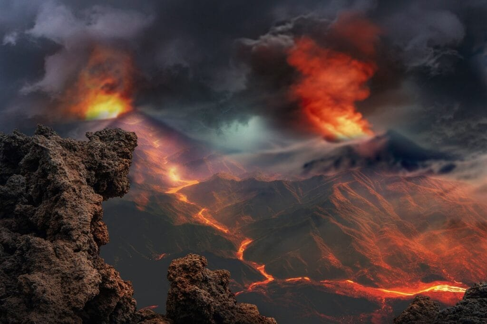

Volcanic eruptions have a profound impact on human settlements, with both positive and negative consequences. When volcanoes erupt, they release molten rock, gases, and debris, which can lead to the destruction of homes, infrastructure, and agricultural land. The ash and gases emitted can cause respiratory issues and pose a threat to human health. However, volcanic eruptions also have beneficial aspects. The ash and lava released during eruptions provide nutrients to the soil, making it fertile for agriculture. Additionally, volcanic landscapes are often scenic and attract tourists, boosting local economies. Despite these benefits, it is crucial to understand the causes and patterns of volcanic eruptions to predict future activity and minimize the risks to human settlements.

  

## Basic Understanding of Volcanoes

### Definition and Formation of Volcanoes

[Volcanoes are geological](https://magmamatters.com/geothermal-energy-and-its-volcanic-origins/ "Geothermal Energy and Its Volcanic Origins") formations on Earth's surface that are created when molten rock, gases, and debris, collectively known as magma, escape through openings called vents or fissures. This process is known as volcanic eruption.

Volcanoes can form in different ways. One common formation occurs at plate boundaries, where tectonic plates meet and interact. When the plates move apart, magma rises to the surface, forming a volcano. Another way volcanoes can form is through hotspots, which are areas of intense heat deep within the Earth. The magma from these hotspots can create volcanoes, such as the shield volcanoes in Hawaii.

### Geographic Distribution of Volcanoes

Volcanoes are not evenly distributed across the globe. They tend to occur in specific regions, such as the "Ring of Fire" that encircles the Pacific Ocean. This region is known for its high volcanic activity due to the movement of tectonic plates. Other areas with significant volcanic activity include Iceland, the East African Rift Zone, and the Mediterranean region. Understanding the geographic distribution of volcanoes is crucial for identifying regions that are more prone to eruptions.

### Types of Volcanoes and Their Eruption Patterns

There are several types of volcanoes, each with its distinct characteristics and eruption patterns. Shield volcanoes, like those in Hawaii, have broad, gently sloping sides created by the eruption of fluid lava with low viscosity. Stratovolcanoes, on the other hand, are tall and steep due to the eruption of viscous lava, which leads to the formation of layers of ash and rock.

Other types of volcanoes include cinder cones, which are small and conical with explosive eruptions, and calderas, which form when the top of a volcano collapses after a massive eruption. Understanding these different [types of volcanoes and their eruption](https://magmamatters.com/understanding-volcanic-formation-a-comprehensive-guide/ "Understanding Volcanic Formation: A Comprehensive Guide") patterns is essential to assess the potential impact of volcanic activity on human settlements.

## Historical Overview of Volcanic Disruptions on Human Settlements

### Notable Historical Instances of Volcanic Disruptions

Throughout history, there have been numerous notable instances of volcanic disruptions that have had a significant impact on human settlements. The eruption of Mount Vesuvius in 79 AD, which buried the Roman cities of Pompeii and Herculaneum, is one of the most well-known examples. Another significant eruption is the 1815 eruption of Mount Tambora in Indonesia, which caused a global drop in temperatures and led to the "Year Without a Summer" in 1816.

### Trends and Patterns in Volcanic Disruptions

Analyzing historical volcanic disruptions reveals certain trends and patterns. Volcanic eruptions tend to occur in cycles, with periods of high activity followed by relative calm. There are also geographical trends, with certain regions experiencing frequent volcanic activity while others are relatively dormant. Researching these trends and patterns helps scientists and policymakers understand the likelihood and impact of future volcanic disruptions.

This image is property of pixabay.com.

## The Immediate Impact of Eruptions on Human Settlements

### Physical Destruction from Lava and Ash

One of the most obvious impacts of volcanic eruptions on human settlements is the physical destruction caused by lava and ash. Lava flows can destroy buildings, infrastructure, and agricultural land, leaving behind a barren and desolate landscape. Ashfall can also have severe consequences, damaging crops, contaminating water sources, and disrupting transportation.

### Loss of Human Life

Volcanic eruptions can result in the loss of human lives. The immediate dangers include pyroclastic flows, which are fast-moving clouds of hot gas, ash, and rock, as well as volcanic bombs and projectiles. These hazards can cause severe injuries or fatalities. In addition, volcanic gases, such as sulfur dioxide, can be toxic and pose respiratory risks to nearby communities.

### Displacement and Migration Patterns Post-disruption

Volcanic eruptions often lead to the displacement of people from their homes and communities. The destruction caused by eruptions can render areas uninhabitable, forcing residents to seek shelter and assistance elsewhere. This displacement can have long-term social and economic consequences, as communities are uprooted and fragmented.

## Long-term Impact of Volcanic Eruption

### Changes in Landscape topography

Volcanic eruptions can have lasting impacts on the landscape's topography. The deposition of ash and lava can alter the shape and contours of the land. It can create new landforms, such as volcanic mountains and hills, or modify existing ones. These changes can affect land use, agriculture, and infrastructure development in the affected areas.

### Alterations in local and Global Climate

Volcanic eruptions release large amounts of gases and particles into the atmosphere. These emissions can have significant effects on the climate. Volcanic ash and gases can block sunlight, resulting in temporary cooling of the Earth's surface. Sulfur dioxide can also react with water vapor to form sulfuric acid droplets, leading to acid rain. These climate effects can impact local weather patterns and have broader global consequences.

### Impact on Agriculture and Livestock

Volcanic eruptions can have a devastating impact on agriculture and livestock. Ashfall can bury farmland, destroying crops and making the land unusable for farming. The acidity of volcanic ash can also affect soil fertility, making it challenging for plants to grow. Furthermore, the release of harmful gases can poison livestock and disrupt grazing areas, jeopardizing the livelihoods of communities reliant on farming and animal husbandry.

This image is property of pixabay.com.

## Health Impacts of Volcanic Eruptions on Humans

### Respiratory and Skin Problems

The release of gases and ash during volcanic eruptions can have severe health impacts on nearby communities. Inhalation of volcanic ash can cause respiratory problems, such as coughing, shortness of breath, and exacerbation of existing respiratory conditions. Fine ash particles can also irritate the skin and eyes, leading to discomfort and potential infections.

### Mental Health Issues

The psychological impact of volcanic eruptions on human settlements should not be overlooked. The sudden destruction of homes, the loss of loved ones, and the displacement from familiar surroundings can cause significant emotional distress. Post-traumatic stress disorder, anxiety, and depression are common mental health issues experienced by individuals affected by volcanic disruptions.

### Impacts on Public Health Infrastructure and Services

Volcanic eruptions can overwhelm public health infrastructure and services in affected areas. The influx of injured individuals, the need for emergency medical care, and the increased demand for clean water and sanitation facilities can strain already limited resources. This can lead to a decline in healthcare quality and an increased risk of infectious diseases, exacerbating the health impacts of the eruption.

## Socio-economic Impacts of Volcanoes

### Effect on Local Economies

Volcanic eruptions can have significant socio-economic impacts on local economies. The destruction of infrastructure, including roads and buildings, can disrupt transportation and commerce, leading to a decline in economic activity. Agricultural productivity may also be severely affected, leading to food shortages and increased prices. Moreover, the loss of tourism revenue can have long-lasting economic consequences for communities that rely on this industry.

### Implications for Trade and International Relations

In addition to the local economic impacts, volcanic eruptions can also have implications for trade and international relations. Disruptions in transportation due to volcanic ash clouds can result in the cancellation or rerouting of flights, affecting global air travel. Volcanic eruptions in one region can also impact international trade by disrupting supply chains and delaying shipments of goods and services.

### Disruptions in Tourism Industry

While tourism can be negatively affected by volcanic eruptions, there can also be long-term positive impacts. Some volcanic eruptions create unique landscapes and features that attract tourists, turning the affected areas into popular tourist destinations. The natural beauty and geological interest in volcanic sites can stimulate tourism development and economic recovery in the aftermath of an eruption.

This image is property of pixabay.com.

## Positive Impacts of Volcanic Eruptions

### Role in Soil Fertility and Agriculture

Despite the destruction they may cause, volcanic eruptions can have positive impacts on soil fertility and agriculture. Volcanic ash is rich in nutrients, such as phosphorus and potassium, which can enhance soil fertility and promote plant growth. The deposition of ash can act as a natural fertilizer and contribute to the productivity of agricultural lands in the long run.

### Creation of Tourist Attractions

As mentioned earlier, certain volcanic eruptions can create unique landscapes that attract tourists. Volcanic sites, such as volcanic craters, lava flows, and geothermal features, can become popular attractions for visitors. They offer opportunities for hiking, exploration, and educational experiences. Tourism related to volcanic features can contribute to local economies and support sustainable development.

### Stimulation of Economic Reconstruction and Development

After a volcanic eruption, affected communities often undergo processes of reconstruction and development. This can stimulate economic growth and lead to the implementation of improved infrastructure and services. The rebuilding process creates job opportunities, boosts construction industries, and facilitates the development of more resilient communities.

## Risk and Hazard Mitigation Strategies

### Disaster Preparedness Measures

To mitigate the risks associated with volcanic eruptions, communities need to be well-prepared. Disaster preparedness measures include developing early warning systems that can detect signs of volcanic activity, establishing evacuation plans and shelters, and conducting regular emergency drills. Educating communities about the risks and providing them with the necessary tools and information is crucial for effective disaster preparedness.

### Evacuation Plans and Shelters

Evacuation plans and shelters are essential components of risk mitigation strategies for volcanic eruptions. These plans should identify safe zones and routes for evacuation, considering the potential hazards and the size of the affected area. Establishing adequate shelters and ensuring their accessibility can save lives and reduce injuries during volcanic emergencies.

### Community Education and Awareness Programs

Promoting community education and awareness is vital in reducing the impact of volcanic eruptions on human settlements. Informing residents about the potential risks, teaching them how to recognize warning signs, and providing guidance on emergency response protocols can empower individuals to take appropriate actions. Community education and awareness programs should be ongoing and involve collaboration between authorities, scientists, and local communities.

## The Role of Technology in Volcano Monitoring and Prediction

### Satellite Imagery and Remote Sensing Techniques

Technology plays a crucial role in monitoring and predicting volcanic activity. Satellite imagery and remote sensing techniques allow scientists to observe changes in volcanic behavior from a distance. Tracking thermal anomalies, gas emissions, and ground deformation through these technologies enable early detection of potential eruptions and aid in issuing timely warnings to at-risk communities.

### Seismic Monitoring and Ground Deformation Measurements

Seismic monitoring involves tracking seismic waves produced by volcanic activity to detect and measure volcanic ground vibrations. By analyzing these data, scientists can monitor volcanic activity, identify signs of impending eruptions, and estimate the scale of potential eruptions. Ground deformation measurements, using techniques like GPS and radar, can further provide insights into the movement and deformation of the Earth's surface associated with volcanic activity.

### Chemical Analysis of Gases and Rocks

Chemical analysis of [volcanic gases](https://magmamatters.com/the-environmental-impact-of-volcanic-eruptions-2/ "The Environmental Impact of Volcanic Eruptions") and rocks can provide valuable information about the composition and behavior of a volcano. By studying the changes in gas emissions, such as [sulfur dioxide and carbon](https://magmamatters.com/the-art-and-science-of-volcano-monitoring/ "The Art and Science of Volcano Monitoring") dioxide, scientists can gain insights into volcanic activity and potential hazards. Analyzing rock samples can reveal details about past eruptions and help in predicting future volcanic behavior.

## Case Studies: Impact of Specific Volcano on Human Settlements

### Impact of Krakatoa Eruption in Indonesia

The eruption of Krakatoa in 1883 had a profound impact on human settlements in the region. The eruption generated tsunamis that killed tens of thousands of people and wiped out entire coastal communities. The volcanic ash and gases ejected into the atmosphere caused global climate anomalies, leading to vivid sunsets and significant temperature changes. The eruption also created a new volcanic island, Rakata, which eventually became a popular tourist destination due to its unique geological features.

### Consequences of Mount St. Helens Eruption in the United States

The eruption of Mount St. Helens in 1980 caused extensive destruction and loss of life in the surrounding area. The lateral blast, pyroclastic flows, and lahars devastated forested lands and infrastructure. The eruption claimed the lives of 57 people and caused billions of dollars in damages. However, the subsequent recovery efforts and scientific research following the eruption have provided valuable insights into volcanic processes and have led to improved monitoring and risk mitigation strategies in the region.

### Effects of Mount Vesuvius Eruption on Pompeii

The eruption of Mount Vesuvius in 79 AD had a catastrophic impact on the ancient Roman cities of Pompeii and Herculaneum. The volcanic ash and pyroclastic flows buried the cities, preserving them in remarkable detail and giving archaeologists unique insights into Roman life during that time. The eruption resulted in the loss of thousands of lives and the disappearance of two vibrant cities. Today, the excavated ruins of Pompeii attract millions of visitors every year, contributing to Italy's tourism industry.

In conclusion, the impact of volcanic eruptions on human settlements can be profound and wide-ranging. From immediate physical destruction to long-term effects on the landscape, climate, and public health, volcanic eruptions can disrupt communities on various levels. However, there can also be positive outcomes, such as the role volcanoes play in soil fertility, the creation of tourist attractions, and the stimulation of economic reconstruction. By understanding the types of volcanoes, their eruption patterns, and implementing effective risk mitigation strategies, communities can better prepare for and respond to volcanic disruptions. Additionally, the use of technology in volcano monitoring and prediction provides valuable tools for early detection and warning systems. By learning from historical instances and case studies, we can continue to improve our understanding of volcanic eruptions and their impact on human settlements.

Related Posts: [Mitigating Risks: Forecasting Volcanic Activity in Prone Areas](https://magmamatters.com/mitigating-risks-forecasting-volcanic-activity-in-prone-areas/), [The Formation and Eruption Patterns of Volcanoes](https://magmamatters.com/the-formation-and-eruption-patterns-of-volcanoes-4/), [The Pyroclastic Phenomena of Pompeii: 7 Insights to Explore](https://magmamatters.com/the-pyroclastic-phenomena-of-pompeii-7-insights-to-explore/), [Tips for Capturing Volcano Pyroclastic Flow Photos](https://magmamatters.com/tips-for-capturing-volcano-pyroclastic-flow-photos/), [Understanding Volcanoes and Their Eruption Patterns](https://magmamatters.com/understanding-volcanoes-and-their-eruption-patterns/)
