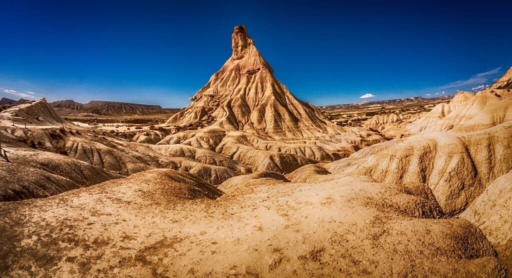

Volcanic eruptions have a significant impact on seismic activity, provoking earthquakes and triggering tsunamis. The formation and eruption of volcanoes are closely linked to the movement of tectonic plates, occurring along plate boundaries, hotspots, or rift zones. Volcanoes in areas like the "Ring of Fire" are prone to explosive eruptions due to the convergence of tectonic plates. On the other hand, shield volcanoes in Hawaii gradually form over hotspots and have less explosive eruptions. Factors like lava viscosity and gas content determine the eruption pattern of a volcano. While volcanic eruptions provide nutrients to soil, they also pose risks to surrounding communities. By understanding the different types of [volcanoes and their relationship to seismic activity](https://magmamatters.com/the-art-and-science-of-volcano-monitoring/ "The Art and Science of Volcano Monitoring"), scientists can better predict future eruptions and implement measures to mitigate their impact.

This image is property of pixabay.com.

## Volcanic Eruption Mechanics

Volcanic eruptions are fascinating natural phenomena that have both destructive and constructive impacts on the Earth. Understanding the mechanics behind these [eruptions](https://magmamatters.com/understanding-volcanic-formation-a-comprehensive-guide/ "Understanding Volcanic Formation: A Comprehensive Guide") is crucial in order to comprehend the relationship between volcanic activity and seismic events.

### Basics of volcanic eruptions

Volcanic eruptions occur when molten rock, known as magma, rises to the surface. The magma exists beneath the Earth's crust in the form of pockets called magma chambers. As pressure builds up within these chambers, the magma is forced upwards through vents and fissures, resulting in an eruption. The magma that emerges on the surface is called lava.

During an eruption, there are various factors at play that influence the intensity and type of eruption. These factors include the composition and temperature of the magma, the amount of gas trapped within the magma, and the presence of solid materials, such as rocks and ash.

### Role of molten rock, gases, and debris

The molten rock, or magma, is the driving force behind volcanic eruptions. Its properties, such as viscosity and temperature, determine the type of eruption. Magma with high viscosity, meaning it is thick and sticky, tends to trap gas bubbles, creating explosive eruptions. On the other hand, magma with low viscosity, meaning it is runny, allows gas to escape more easily, resulting in less explosive eruptions.

Gases play a significant role in volcanic eruptions. Magma contains dissolved gases, primarily consisting of water vapor, [carbon dioxide](https://magmamatters.com/geothermal-energy-and-its-volcanic-origins/ "Geothermal Energy and Its Volcanic Origins"), and sulfur dioxide. As the magma rises to the surface, the decreasing pressure causes these gases to expand rapidly, leading to explosive eruptions. The release of gases during an eruption can have various impacts, including the formation of ash clouds and the potential for harmful effects on the environment and human health.

In addition to magma and gases, volcanic eruptions also involve the ejection of debris. This can include rocks, ash, and other solid materials that are blasted into the air during an eruption. These particles can travel great distances and pose hazards to aviation, agriculture, and human settlements. The size and composition of the ejected debris depend on the type of eruption and the characteristics of the volcano.

### Impact on seismic activity during volcano formation

Seismic activity plays a crucial [role in the formation of volcanoes](https://magmamatters.com/the-role-of-volcanoes-in-earths-carbon-cycle-5/ "The Role Of Volcanoes In Earth’s Carbon Cycle"). Volcanoes are often found along plate boundaries, where tectonic plates interact. The movement and collision of these plates generate intense geological forces, leading to the development of volcanic activity. The shifting tectonic plates can create fractures and weaknesses in the Earth's crust, allowing magma to rise to the surface and form volcanoes.

During the process of volcano formation, seismic activity is commonly observed. As magma moves through the Earth's crust, it encounters resistance from the surrounding rocks, causing stress and pressure to build up. This increase in stress can lead to earthquakes, which serve as a precursor to volcanic eruptions. By monitoring seismic activity, scientists can gain insight into the behavior of volcanoes and predict potential eruptions.

This image is property of pixabay.com.

## Geographic Distribution of Volcanoes

Volcanoes are not randomly scattered across the Earth's surface; instead, there is a distinct pattern to their distribution. Understanding the global distribution of volcanoes and their relationship with [seismic activity is essential in assessing volcanic hazards](https://magmamatters.com/the-environmental-impact-of-volcanic-eruptions-2/ "The Environmental Impact of Volcanic Eruptions") and predicting future eruptions.

### Overview of global volcano distribution

Volcanoes can be found in various locations around the world, but they are primarily concentrated along plate boundaries. These boundaries include divergent plate boundaries, where plates move apart, convergent plate boundaries, where plates collide, and transform plate boundaries, where plates slide past each other. Each type of plate boundary has its own characteristics and leads to different types of volcanic activity.

Divergent plate boundaries, such as the Mid-Atlantic Ridge, occur where plates move apart. This movement creates a gap in the Earth's crust through which magma can rise, forming volcanic systems like rift zones and underwater volcanoes. These eruptions are usually less explosive and produce basaltic lava.

Convergent plate boundaries, such as the "Ring of Fire" encircling the Pacific Ocean, are areas where plates collide. This collision can result in subduction zones, where one plate sinks beneath another, producing explosive volcanic eruptions and volcanic arcs. The "Ring of Fire" is known for its high volcanic activity and frequent earthquakes, making it one of the most seismically active regions on Earth.

Transform plate boundaries, such as the San Andreas Fault in California, occur when plates slide past each other horizontally. While they are not typically associated with volcanic activity, the intense movement along these boundaries can cause significant seismic activity.

### Relationship between volcano location and seismic activity

The location of a volcano is closely linked to the seismic activity in its vicinity. Volcanoes situated along plate boundaries experience higher levels of seismic activity due to the intense geological forces involved in plate interactions. The movement and collision of plates generate stress and friction, leading to earthquakes. These earthquakes serve as indicators to scientists that volcanic activity may be increasing and that an eruption could be imminent.

On the other hand, volcanoes located in hotspot areas, such as the Hawaiian Islands, have a different relationship with seismic activity. Hotspots are areas deep beneath the Earth's surface where a column of hot rock, known as a mantle plume, rises towards the crust. This causes magma to form and leads to the formation of shield volcanoes over time. While hotspot volcanoes are not directly associated with plate boundaries, they can still experience seismic activity, albeit at reduced levels compared to plate boundary volcanoes.

### Significance of 'Ring of Fire' and hotspot volcanoes

The "Ring of Fire" is a significant area of volcanic activity and seismicity. It extends around the Pacific Ocean and includes regions such as Alaska, Japan, and South America. The presence of numerous subduction zones within the "Ring of Fire" means it experiences frequent and often powerful earthquakes and explosive volcanic eruptions. This intense seismic activity is a result of the interaction between the Pacific Plate and surrounding plates.

Hotspot volcanoes, such as those found in Hawaii, are also of great significance when studying the relationship between volcanism and seismic activity. These volcanoes form over fixed mantle plumes that generate magma beneath the Earth's crust. The movement of tectonic plates causes the chain of islands to move gradually over the hotspot, leading to the formation of distinct volcanic islands. While hotspot volcanoes may not experience as much seismic activity as their plate boundary counterparts, studying their behavior can provide insights into the underlying processes of magma generation and volcanic eruption.

Related Posts: [Mitigating Risks: Forecasting Volcanic Activity in Prone Areas](https://magmamatters.com/mitigating-risks-forecasting-volcanic-activity-in-prone-areas/), [The Formation and Eruption Patterns of Volcanoes](https://magmamatters.com/the-formation-and-eruption-patterns-of-volcanoes-4/), [The Pyroclastic Phenomena of Pompeii: 7 Insights to Explore](https://magmamatters.com/the-pyroclastic-phenomena-of-pompeii-7-insights-to-explore/), [Tips for Capturing Volcano Pyroclastic Flow Photos](https://magmamatters.com/tips-for-capturing-volcano-pyroclastic-flow-photos/), [Understanding Volcanoes and Their Eruption Patterns](https://magmamatters.com/understanding-volcanoes-and-their-eruption-patterns/)
