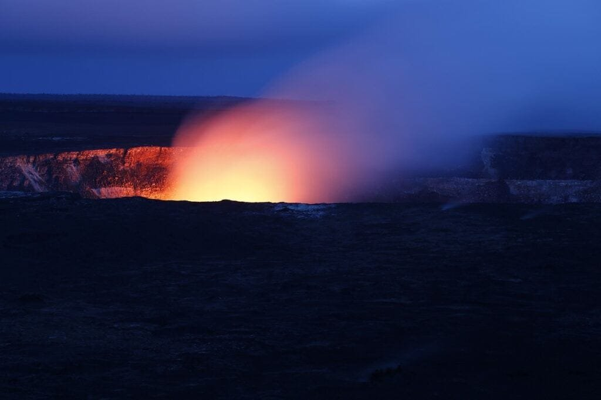

Imagine standing at the edge of a majestic volcano, the heat radiating from the molten lava and the sound of rumbling thunder in the distance. As intriguing and awe-inspiring as volcanoes may be, their eruptions have far-reaching consequences beyond their immediate surroundings. One such consequence is their impact on the ozone layer. In this article, we will explore the fascinating world of volcanoes and delve into the 5 best insights regarding their effect on the ozone layer. So strap on your adventure boots and get ready to embark on a journey of discovery as we uncover the hidden secrets of these fiery giants.

<iframe width="560" height="315" src="https://www.youtube.com/embed/gpYlX5TeQRM" frameborder="0" allow="accelerometer; autoplay; encrypted-media; gyroscope; picture-in-picture" allowfullscreen></iframe>

  

## Understanding Volcanic Eruptions

Volcanic eruptions are natural phenomena that occur when molten rock, known as magma, rises to the surface of the Earth. This magma is accompanied by gases and debris, resulting in explosive or non-explosive eruptions that release lava, ash, and gases into the atmosphere.

### Definition of a volcanic eruption

A volcanic eruption refers to the violent or non-violent discharge of magma, gases, and other materials from a volcanic vent. It is a dynamic process that can have significant impacts on the surrounding environment, including the release of harmful gases and the formation of new landforms.

### Process and characteristics of volcanic eruptions

During a volcanic eruption, magma rises to the surface through volcanic vents or fissures. The eruption process is influenced by various factors such as the composition and viscosity of the magma, the presence of gases, and the shape of the volcanic vent.

Explosive eruptions occur when highly viscous magma traps gases, causing an increase in pressure that leads to explosive fragmentation of the magma. This type of eruption can produce volcanic ash, pyroclastic flows, and volcanic bombs, posing significant risks to nearby communities.

Non-explosive eruptions, on the other hand, occur when the magma is less viscous and allows gases to escape more easily. This results in the effusion of lava flows, which can slowly and steadily advance from the volcanic vent, causing destruction in their path.

### Types of volcanic eruptions

Volcanic eruptions can be classified into several types based on their characteristic features. The most common types include effusive eruptions, explosive eruptions, phreatomagmatic eruptions, and pyroclastic eruptions.

Effusive eruptions are characterized by the slow and steady flow of lava from the volcanic vent. These eruptions often occur in shield volcanoes, where low-viscosity basaltic lava allows for easy movement.

Explosive eruptions, as mentioned earlier, involve the violent fragmentation of magma due to the build-up of gas pressure. These eruptions can be further categorized as strombolian, vulcanian, and plinian eruptions, depending on the intensity and characteristics of the eruption column.

Phreatomagmatic eruptions occur when magma interacts with water, resulting in a steam-driven eruption. These eruptions can be particularly destructive as they can produce ash clouds, pyroclastic surges, and lahars.

Pyroclastic eruptions are characterized by the ejection of hot fragments, ash, and gases into the atmosphere. These eruptions can generate pyroclastic flows, which are dense, fast-moving currents of hot gas and volcanic matter that travel down the slopes of the volcano.

### Geographical distribution of volcanoes

Volcanoes are not uniformly distributed across the Earth's surface. They are mainly concentrated along plate boundaries, where tectonic interactions create conditions for magma ascent. The "Ring of Fire" in the Pacific Ocean is a prime example of such a region, housing numerous active volcanoes. Other volcanic regions include the Mid-Atlantic Ridge, the East African Rift, and hotspots, such as the Hawaiian Islands.

Understanding the geographical distribution of volcanoes helps scientists and communities assess the potential risks and [impacts](https://magmamatters.com/understanding-volcanic-formation-a-comprehensive-guide/ "Understanding Volcanic Formation: A Comprehensive Guide") of volcanic eruptions. It allows for the development of strategies to mitigate the impact on nearby populations and infrastructure.

## The Ozone Layer's Role in Atmospheric Protection

The ozone layer plays a crucial role in protecting life on Earth by absorbing a significant portion of the sun's ultraviolet (UV) radiation. This protective layer is located in the stratosphere, approximately 10 to 50 kilometers above the Earth's surface.

### Essence of the ozone layer

The ozone layer is composed of ozone molecules (O3) that are formed when regular oxygen molecules (O2) are exposed to UV radiation. This conversion process occurs predominantly in the stratosphere and results in the formation of a protective layer.

### Composition of the ozone layer

The ozone layer is not evenly distributed throughout the stratosphere but is concentrated in the ozone-rich layer called the ozone layer. This layer is usually found between 15 and 35 kilometers above the Earth's surface. The concentration of ozone within this layer is highest at around 25 kilometers.

### The relationship between the ozone layer and Earth's climate

The ozone layer and Earth's climate are intricately linked. While the ozone layer does not directly influence climate patterns, it affects the distribution of solar radiation in the atmosphere. The absorption of UV radiation by ozone molecules helps regulate the temperature of the stratosphere, which, in turn, has implications for atmospheric circulation and climate.

### Effects of ozone depletion on life on Earth

Ozone depletion, primarily caused by the release of human-made ozone-depleting substances (ODS), can have significant consequences for life on Earth. Increased UV radiation reaching the Earth's surface due to ozone depletion poses risks to human health, including skin cancer, cataracts, and immune system suppression. It can also impact terrestrial and marine ecosystems, affecting plant growth, phytoplankton productivity, and the overall balance of ecosystems.

This image is property of pixabay.com.

## The Emission of Gases During Volcanic Eruptions

Volcanic eruptions release a variety of gases into the atmosphere alongside lava and ash. These gases play a crucial role in the Earth's atmospheric composition and dynamics.

### Types of gases emitted during volcanic eruptions

The types of gases emitted during volcanic eruptions vary depending on several factors, including the composition of the magma and the depth of its source. Common volcanic gases include water vapor (H2O), carbon dioxide (CO2), sulfur dioxide (SO2), hydrogen sulfide (H2S), and various halogens.

Water vapor is the most abundant volcanic gas, accounting for a significant portion of the total gas emissions during eruptions. It originates from the water content within the magma and is released as steam during volcanic activity.

Carbon dioxide is another major gas emitted during volcanic eruptions. It is primarily derived from the degassing of magma and volcanic rocks. While the amount of [carbon dioxide emitted by volcanoes](https://magmamatters.com/geothermal-energy-and-its-volcanic-origins/ "Geothermal Energy and Its Volcanic Origins") is relatively small compared to human activities, it still contributes to the overall concentration of CO2 in the atmosphere.

Sulfur dioxide is a highly reactive gas emitted during volcanic eruptions. It can have significant short-term impacts on air quality and climate, as well as long-term effects on the ozone layer.

### Quantities of gases ejected in volcanic eruptions

The quantities of gases ejected during volcanic eruptions can vary greatly depending on factors such as eruption style, magma composition, and eruption duration. Some eruptions may release millions of tons of gas into the atmosphere, while others may release relatively smaller amounts.

Large explosive eruptions, such as those produced by stratovolcanoes, commonly result in very high gas emissions due to the violent fragmentation of magma. In contrast, effusive eruptions, like those from shield volcanoes, may have relatively lower gas emissions, as the magma flows more freely and allows gases to escape more easily.

### The dispersion of volcanic gas emissions in the Earth's atmosphere

Once emitted, volcanic gases disperse and mix with the Earth's atmospheric gases. Their dispersion is influenced by atmospheric processes such as wind patterns, convection currents, and chemical reactions with other atmospheric compounds.

Volcanic gas emissions can have global impacts, depending on the magnitude and duration of the eruption, as well as the composition of the emitted gases. The dispersion of volcanic gases can affect air quality, climate patterns, and even the composition of the ozone layer.

## The Interplay between Volcanic Aerosols and the Ozone Layer

Volcanic aerosols, which are tiny particles composed of solid or liquid droplets suspended in the atmosphere, play a significant role in the interaction between volcanic eruptions and the ozone layer.

### The formation of volcanic aerosols

Volcanic aerosols are formed during volcanic eruptions when fine ash particles and sulfur-rich gases combine in the atmosphere. These aerosols can range in size from submicron particles to larger particles that can be several micrometers in diameter.

The composition and size of volcanic aerosols vary depending on the type of volcanic eruption and the chemical composition of the ejected materials. Volcanic aerosols can contain sulfur compounds, such as sulfuric acid, which can contribute to the depletion of the ozone layer.

### How volcanic aerosols reach the ozone layer

Once formed, volcanic aerosols can be transported by atmospheric circulation mechanisms and reach the stratosphere, where the ozone layer is located. The ascent of volcanic aerosols to the stratosphere can occur through processes such as convective uplift, jet-stream circulation, and volcanic plume injection.

Key factors affecting the transport of volcanic aerosols to the ozone layer include the altitude and intensity of the eruption, wind patterns, and the size and composition of the aerosols. The presence of volcanic aerosols in the stratosphere can impact the chemistry and dynamics of the ozone layer.

### Interactions between volcanic aerosols and ozone molecules

When volcanic aerosols reach the ozone layer, they can interact with ozone molecules through several processes. One significant interaction is the catalytic destruction of ozone by chlorine and bromine compounds present in volcanic aerosols. These compounds can be released during volcanic eruptions and play a role in ozone depletion.

Furthermore, volcanic aerosols can act as surfaces for chemical reactions that convert stable chlorine compounds into more reactive forms, which can then participate in ozone destruction cycles. These interactions contribute to the overall impact of volcanic eruptions on the ozone layer.

This image is property of pixabay.com.

## The Impact of Volcanic Gases on the Ozone Layer

Volcanic gases, including sulfur dioxide (SO2), carbon dioxide (CO2), and chlorofluorocarbons (CFCs), can have varying effects on the ozone layer depending on their composition and the processes involved.

### Influences of sulfur dioxide on the ozone layer

[Sulfur dioxide is one of the major volcanic gases](https://magmamatters.com/the-art-and-science-of-volcano-monitoring/ "The Art and Science of Volcano Monitoring") emitted during eruptions. While its direct impact on the ozone layer is minor compared to human-made substances, it can indirectly contribute to ozone depletion through various chemical reactions.

When sulfur dioxide reaches the stratosphere, it can undergo photochemical reactions, leading to the formation of sulfuric acid (H2SO4) aerosols. These aerosols can act as surfaces for ozone-destroying reactions, particularly in the presence of chlorine and bromine compounds. Therefore, large volcanic eruptions emitting significant amounts of sulfur dioxide can potentially have a measurable impact on the ozone layer.

### Impact of chlorofluorocarbons (CFCs) on the ozone layer

Unlike volcanic gases, chlorofluorocarbons (CFCs) are human-made substances that have been widely used in various industrial applications. CFCs have been recognized as significant contributors to ozone depletion, primarily through their release of chlorine atoms in the stratosphere.

While volcanic eruptions release chlorine and bromine compounds, the amounts are generally much lower compared to the historical and ongoing emissions from human activities. Therefore, the impact of volcanic chlorine and bromine compounds on the ozone layer is relatively minor compared to CFCs and other ozone-depleting substances produced by human activities.

### Role of carbon dioxide in ozone layer dynamics

Carbon dioxide (CO2) is a greenhouse gas that plays a major role in climate change. While its impact on the ozone layer is indirect, changes in climate can influence the chemistry and dynamics of the ozone layer.

Increasing concentrations of carbon dioxide in the atmosphere can lead to changes in atmospheric circulation patterns, which can affect the distribution of ozone. Additionally, changes in temperature and water vapor content due to climate change can influence the chemistry of the stratosphere and impact the stability of the ozone layer.

## Temporal Scale of Volcanic Impacts on the Ozone Layer

The impacts of volcanic eruptions on the ozone layer can occur over various timescales, ranging from immediate effects to long-term consequences.

### Immediate impacts on the ozone layer immediately after an eruption

In the immediate aftermath of a volcanic eruption, the injection of volcanic gases and aerosols into the atmosphere can have localized effects on the ozone layer. These effects are often short-lived and dependent on the intensity and duration of the eruption.

Localized ozone depletion may occur due to chemical reactions involving volcanic gases, chlorine compounds, and volcanic aerosols. However, these effects are generally limited to the vicinity of the eruption and may not have a significant impact on the global ozone layer.

### Long-term effects of volcanic eruptions on the ozone layer

While the immediate impacts of volcanic eruptions on the ozone layer are relatively short-lived, the long-term effects can be more significant. The release of sulfur dioxide during large volcanic eruptions can lead to the formation of sulfuric acid aerosols, which can persist in the stratosphere for an extended period.

These aerosols can contribute to the depletion of the ozone layer over time by providing surfaces for ozone-destroying reactions. The long-term effects of volcanic aerosols on the ozone layer are influenced by factors such as the magnitude and frequency of volcanic eruptions, as well as the concentration of ozone-depleting substances already present in the atmosphere.

### Cumulative impacts of multiple eruptions on ozone concentrations

The cumulative impacts of multiple volcanic eruptions on ozone concentrations depend on the frequency and magnitude of the eruptions, as well as the composition of the emitted gases and aerosols. If a series of large eruptions occur in close succession, the combined effects on the ozone layer can be amplified.

However, it is important to note that while volcanic eruptions can affect the ozone layer, their cumulative impact is generally small compared to the long-term impact of human-made ozone-depleting substances. Human activities, particularly the release of chlorofluorocarbons (CFCs), have had a far greater influence on the overall depletion of the ozone layer.

This image is property of pixabay.com.

## Regional Variations in Volcanic Impacts on the Ozone Layer

The impacts of volcanic eruptions on the ozone layer can vary geographically, depending on factors such as the location and magnitude of the eruption, atmospheric circulation patterns, and the proximity of sensitive regions.

### Geographic discrepancies in impacts on the ozone layer

The impacts of volcanic eruptions on the ozone layer can vary significantly across different regions. This is due to variations in atmospheric circulation, which govern the transport and dispersion of volcanic gases and aerosols.

Regions closer to the source of an eruption, such as the surrounding areas of the volcano, are more likely to experience localized ozone depletion as a result of the direct release of ozone-destroying substances. However, these impacts are generally confined to the immediate vicinity of the eruption and do not have a widespread influence on the global ozone layer.

### Influence of latitude on effects of volcanic eruptions on the ozone layer

Latitude plays a crucial role in determining the effects of volcanic eruptions on the ozone layer. At higher latitudes, where the stratospheric circulation is weaker, volcanic emissions have a higher chance of remaining in the vicinity of the eruption site, resulting in more significant localized impacts on the ozone layer.

In contrast, at lower latitudes, the stronger equator-to-pole circulation can effectively disperse volcanic emissions, limiting their impact on the ozone layer. While localized ozone depletion may still occur in these regions, the overall influence on the global ozone layer is typically minimal.

### Role of prevailing wind patterns in dispersion of volcanic emissions

Prevailing wind patterns have a considerable influence on the dispersion of volcanic emissions, including gases and aerosols. The direction and strength of these winds determine the transport pathways and the eventual distribution of volcanic pollutants in the atmosphere.

Depending on the local wind patterns, volcanic emissions can be transported over long distances, allowing their impact to extend beyond the immediate vicinity of the eruption. Prevailing winds can carry volcanic aerosols to different regions, potentially affecting the ozone layer in areas far from the eruption site.

## Comparisons of Volcanic vs. Human Sources of Ozone Depleting Substances

While volcanic eruptions can emit significant amounts of gases and aerosols, their contribution to ozone depletion is relatively small compared to human activities.

### Comparison of quantity of ozone-depleting substances from volcanoes versus human activity

The quantity of ozone-depleting substances released by volcanic eruptions is relatively small compared to human-made sources. Human activities, particularly the use of chlorofluorocarbons (CFCs) in various industries, have been the primary contributors to the depletion of the ozone layer over the past decades.

Volcanoes release an estimated 0.15-0.25 teragrams (Tg) of chlorine and bromine compounds annually, while human-made emissions of ozone-depleting substances reach several hundred to thousand Tg per year. This significant difference in quantities underscores the overwhelming impact of human activities on the ozone layer.

### Differences in sources and types of ozone-depleting substances from volcanoes and human activity

The ozone-depleting substances released by volcanoes and human activities differ in their sources and types. Volcanic emissions primarily consist of gases and aerosols derived from the Earth's mantle, while human-made substances are synthetic compounds produced for various industrial, commercial, and domestic purposes.

Volcanic emissions predominantly contain sulfur compounds, such as sulfur dioxide, which can contribute to localized ozone depletion. In contrast, human-made substances, such as chlorofluorocarbons (CFCs), halons, and other synthetic chemicals, contain chlorine and bromine atoms that have a long atmospheric lifetime and can significantly impact the global ozone layer.

### Impact of human-made chlorofluorocarbons (CFCs) versus naturally occurring volcanic substances on the ozone layer

The impact of human-made chlorofluorocarbons (CFCs) on the ozone layer is much greater than that of naturally occurring volcanic substances. CFCs possess high ozone-depletion potential due to the stability and longevity of chlorine atoms released from these compounds.

Once released into the atmosphere, CFCs can persist for years to decades, gradually making their way to the stratosphere, where they can initiate ozone-destroying reactions. The cumulative effect of CFCs on the ozone layer has resulted in significant depletion and the formation of the "ozone hole" in certain regions, particularly over Antarctica.

In comparison, the impact of volcanic substances on the ozone layer, while not negligible, is relatively minor and localized. The release of [sulfur dioxide and other volcanic gases](https://magmamatters.com/the-environmental-impact-of-volcanic-eruptions-2/ "The Environmental Impact of Volcanic Eruptions") can lead to localized ozone depletion in the immediate vicinity of the eruption, but their overall impact on the global ozone layer is limited.

## The Cumulative Impact of Volcanic Activities on Global Climate

Volcanic activities, including eruptions and the release of volcanic gases and aerosols, can have both short-term and long-term impacts on the Earth's climate.

### Influence of volcanic activities on global temperature

Large volcanic eruptions can have a cooling effect on the Earth's climate in the short term. During explosive eruptions, volcanic aerosols and gases, such as sulfur dioxide, are injected into the stratosphere. These aerosols scatter and absorb incoming solar radiation, reducing the amount of sunlight reaching the Earth's surface.

The scattering and absorption of solar radiation by volcanic aerosols result in a decrease in global temperatures, commonly referred to as volcanic cooling. This cooling effect can be significant, with some eruptions leading to a noticeable drop in global temperatures for a period of one to three years.

### Effects of volcanic activities on atmospheric chemistry

Volcanic activities can influence atmospheric chemistry through the release of gases and aerosols. The emitted gases, such as sulfur dioxide and carbon dioxide, can interact with atmospheric constituents, affecting their concentrations and chemical reactions.

Sulfur dioxide released during volcanic eruptions can transform into sulfate aerosols in the presence of water vapor. These aerosols can contribute to the scattering of solar radiation and the enhancement of cloud formation processes. Additionally, volcanic emissions can affect the distribution and chemistry of greenhouse gases, including carbon dioxide, in the atmosphere, potentially influencing the Earth's climate on longer timescales.

### The interplay between volcanic activities, ozone layer, and climate change

The interplay between volcanic activities, the ozone layer, and climate change is complex. While volcanic eruptions can emit substances that have short-term and localized impacts on the ozone layer, the long-term influence of volcanic emissions on ozone depletion is relatively minor compared to human activities.

Climate change can indirectly influence the ozone layer by affecting atmospheric circulation patterns, temperature profiles, and the distribution of ozone-depleting substances. Additionally, changes in the ozone layer, such as ozone depletion, can impact climate dynamics, including temperature profiles and atmospheric circulation patterns.

Understanding the interplay between volcanic activities, the ozone layer, and climate change is crucial for comprehensively assessing the factors that contribute to environmental changes and developing strategies for their mitigation and adaptation.

## Mitigation and Adaptation to Changes in the Ozone Layer Due to Volcanic Activities

Mitigating and adapting to changes in the ozone layer resulting from volcanic activities require a combination of scientific research, policy measures, and international cooperation.

### Strategies for mitigating ozone depletion caused by volcanic eruptions

Mitigating ozone depletion caused by volcanic eruptions involves understanding the factors that contribute to ozone destruction and exploring ways to minimize these impacts. This can include monitoring and assessing the emissions of volcanic gases and aerosols, as well as their atmospheric transport and reactions.

Developing early warning systems and forecasting models can help anticipate the impacts of volcanic eruptions on the ozone layer. This can aid in informing communities and implementing measures to reduce exposure to harmful UV radiation and mitigate the potential risks associated with ozone depletion.

### Adaptation strategies for living with changes in the ozone layer

Adapting to changes in the ozone layer requires a combination of individual and collective efforts. Public awareness campaigns can educate communities about the risks of increased UV radiation and promote protective measures such as wearing sunscreen, protective clothing, and sunglasses.

Supporting the development and availability of advanced UV detection technologies can also help individuals and communities monitor UV radiation levels and take appropriate precautions. Additionally, incorporating UV protection measures into building design and urban planning can create sun-safe environments that minimize the risks associated with increased UV exposure.

### Role of policy and international agreements in protecting the ozone layer

International agreements and policies play a critical role in protecting the ozone layer and mitigating the impacts of ozone depletion caused by volcanic activities. The Montreal Protocol, an international treaty aimed at phasing out ozone-depleting substances, has been instrumental in reducing the global production and consumption of these substances.

Collaboration between governments, scientific communities, and industry stakeholders is essential for effectively implementing policies and monitoring the progress towards ozone layer protection goals. Continued research, education, and public engagement are crucial for maintaining the momentum in protecting the ozone layer and addressing the challenges posed by volcanic emissions.

In conclusion, understanding the complex relationship between volcanic eruptions, the ozone layer, and climate dynamics is essential for assessing and managing the impacts of volcanism on the environment. While volcanic activities can contribute to localized ozone depletion and climate cooling in the short term, their cumulative impact on the global ozone layer is relatively small compared to human-made ozone-depleting substances. Mitigating and adapting to changes in the ozone layer require interdisciplinary efforts, including scientific research, policy measures, and international cooperation. By studying and addressing the interplay between volcanism, the ozone layer, and climate change, we can strive towards a sustainable future and minimize the risks associated with environmental changes.

