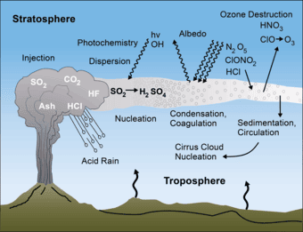
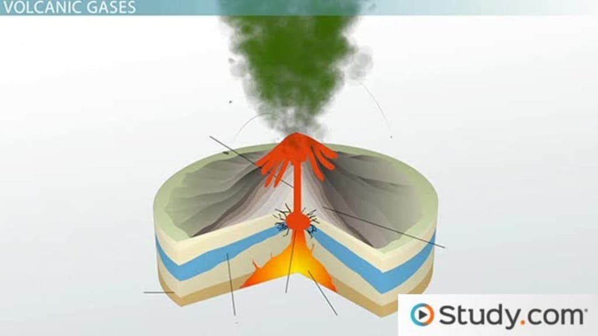
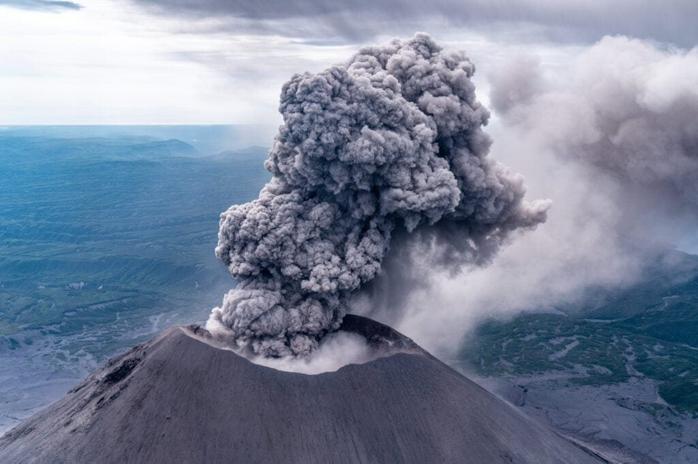
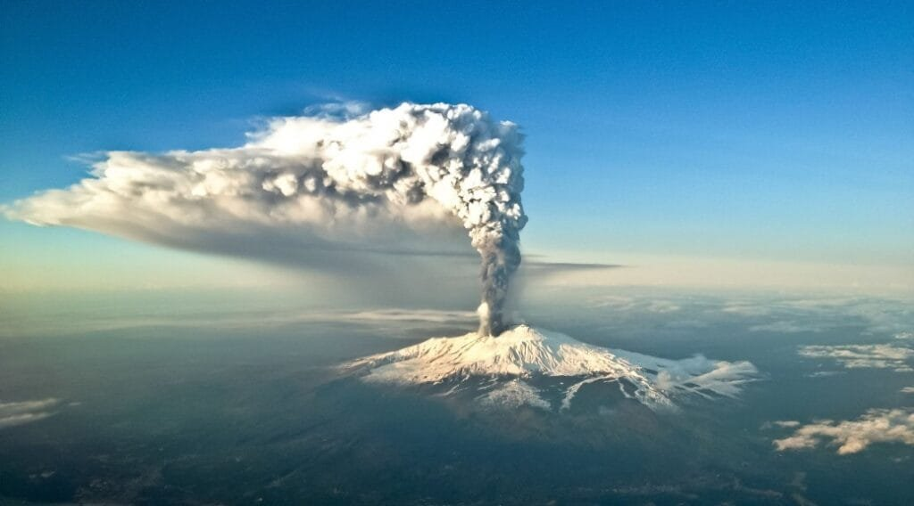

Volcanoes, with their majestic displays of fiery eruptions and billowing smoke, have long fascinated and terrified humans. But beyond their awe-inspiring beauty, they also have a profound impact on the environment. Volcanic gas emissions, a byproduct of these eruptions, can have far-reaching consequences that extend beyond the immediate vicinity of the volcano. In this article, we will explore the impact of volcanic gas emissions on the environment, highlighting the top 10 tips to better understand and navigate the potential hazards and benefits associated with these powerful natural phenomena. So, buckle up and prepare to embark on a journey into the fascinating world of volcanoes and their impact on our planet.

This image is property of d9-wret.s3.us-west-2.amazonaws.com.

## Understanding Volcanic Gases

[Volcanic gases are one of the key components of volcanic eruptions and play a crucial role in the formation](https://magmamatters.com/understanding-volcanic-formation-a-comprehensive-guide/ "Understanding Volcanic Formation: A Comprehensive Guide") and behavior of volcanoes. These gases are released from the magma beneath the Earth's surface during volcanic activity. They consist of several different compounds, including water vapor, carbon dioxide, sulfur dioxide, hydrogen sulfide, and various other gases.

### Defining volcanic gases

Volcanic gases are the gases released during volcanic eruptions or the steady expulsion of gases from volcanic vents. These gases can be emitted both during explosive eruptions and more passive volcanic activities. Volcanic gases are primarily composed of water vapor, carbon dioxide, and sulfur dioxide, but they can also contain other compounds and trace elements.

### Types of gases emitted by volcanoes

Volcanoes emit a wide range of gases, but some of the most common ones include water vapor, carbon dioxide, sulfur dioxide, hydrogen sulfide, and hydrogen chloride. Water vapor is the most abundant gas, followed by carbon dioxide. Sulfur dioxide is particularly hazardous due to its ability to react with atmospheric components and form aerosols, which can have detrimental effects on climate and air quality.

### How volcanic gases are released

Volcanic gases are released from volcanic vents, which can be located on the summit or flanks of a volcano. The release of these gases can occur through effusive eruptions, where lava flows slowly from the volcano, or explosive eruptions, which involve the violent ejection of magma, gases, and volcanic ash into the atmosphere. The process by which gases are released during volcanic eruptions is complex and influenced by factors such as magma composition, magma degassing, and the eruption style of the volcano.

## Geographical Distribution of Volcanoes

Volcanoes are not evenly distributed across the Earth's surface but are concentrated in specific regions. This distribution is influenced by several factors, including tectonic plate boundaries, hotspots, and other geological processes.

### Regions most affected by volcanic gas emissions

Volcanic gas emissions can have a significant impact on the regions surrounding volcanic activity. The "Ring of Fire," which encircles the Pacific Ocean, is one of the most volcanic-active regions in the world. This region is prone to frequent volcanic eruptions and has a high concentration of active volcanoes, resulting in substantial gas emissions.

### Role of tectonic plates in volcano distribution

The movement and interaction of tectonic plates play a crucial role in determining the distribution of volcanoes. Volcanoes tend to occur at plate boundaries, where one tectonic plate subducts beneath another or where two plates move apart, creating rift zones. These plate boundaries provide the conditions necessary for magma to rise to the surface and lead to volcanic activity and gas emissions.

### Hotspot locations and their gas emissions

Hotspots are another significant factor in the distribution of volcanoes and their gas emissions. Hotspots are areas of intense volcanic activity that occur far from plate boundaries and are believed to be caused by a plume of hot magma rising from deep within the Earth's mantle. Examples of hotspot locations are Hawaii and Yellowstone National Park. These regions have unique volcanic gas emissions due to their distinct geological processes.

This image is property of climateadaptationplatform.com.

## Emission Levels and Types of Volcanoes

Different types of volcanoes exhibit varying levels of gas emissions. The type of volcano can be determined by factors such as eruption style, lava composition, and volcanic structure. These factors also influence the levels and types of gases emitted by volcanoes.

### Correlation between volcano type and gas emission levels

There is a correlation between the type of volcano and the levels of gas emissions during eruptions. Shield volcanoes, which have gently sloping sides, tend to erupt effusively with low gas emissions. In contrast, composite volcanoes, also known as stratovolcanoes, have steep slopes and often erupt explosively with higher levels of gas emissions. The magma composition and eruption style of each volcano type contribute to the levels and types of gases released.

### Comparing gas emissions from shield volcanoes and composite volcanoes

Shield volcanoes, such as those found in Hawaii, typically have lower levels of gas emissions. These volcanoes have less viscous lava, allowing gases to escape more easily. Composite volcanoes, on the other hand, like Mount St. Helens, have higher levels of gas emissions due to their explosive nature. The high viscosity of the magma in composite volcanoes traps gases within the magma, leading to explosive eruptions and increased gas emissions.

### Factors influencing eruption patterns and gas emissions

Several factors can influence eruption patterns and gas emissions. The composition of the magma, particularly the amount of gas dissolved in it, plays a vital role. Magma with a high gas content is more likely to produce explosive eruptions and higher gas emissions. Additionally, the presence of water can significantly affect the explosiveness and gas emissions of a volcanic eruption. The interactions between magma, gas, and water can lead to violent eruptions and the release of significant amounts of volcanic gases.

## Role of Volcanic Gases in Climate Change

[Volcanic gases can have a significant impact on climate change](https://magmamatters.com/geothermal-energy-and-its-volcanic-origins/ "Geothermal Energy and Its Volcanic Origins") as they contribute to the greenhouse effect and the formation of volcanic aerosols. Understanding the role of volcanic gases in climate change is essential for comprehending the broader implications of volcanic activity.

### Volcanic gases' contribution to greenhouse effect

Volcanic gases, particularly carbon dioxide, contribute to the greenhouse effect and therefore play a role in climate change. When volcanic eruptions release large amounts of carbon dioxide into the atmosphere, it can contribute to the warming of the Earth's surface. However, the overall contribution of volcanic gases to the greenhouse effect is relatively small compared to human-produced greenhouse gas emissions.

### Volcanic aerosols and their climate impacts

During volcanic eruptions, volcanic aerosols are formed when gases and ash are ejected into the atmosphere. These aerosols can have both cooling and warming effects on the Earth's climate. On one hand, volcanic aerosols can reflect sunlight back into space, leading to a temporary cooling effect. On the other hand, certain volcanic aerosols can also absorb and trap heat in the atmosphere, contributing to a warming effect. The net effect of volcanic aerosols on climate change depends on the specific composition of the aerosols and the magnitude of the volcanic eruption.

### Influence of volcanic gases on global warming

While volcanic gases can contribute to short-term climate effects, such as cooling due to volcanic aerosols, their influence on long-term global warming is relatively small. Human-produced greenhouse gas emissions, such as carbon dioxide from burning fossil fuels, have a much greater impact on global warming compared to volcanic gases. However, local impacts of volcanic gas emissions, such as regional air quality and climate changes, can still pose significant challenges for affected communities.

This image is property of study.com.

## Impact of Volcanic Gases on Air Quality

Volcanic gas emissions can have a detrimental impact on air quality, leading to increased levels of air pollution. The release of gases such as [sulfur dioxide during volcanic](https://magmamatters.com/the-environmental-impact-of-volcanic-eruptions-2/ "The Environmental Impact of Volcanic Eruptions") eruptions can have severe consequences for both the environment and human health.

### Air pollution caused by volcanic gases

Volcanic gas emissions, particularly sulfur dioxide, can cause air pollution on a significant scale. Sulfur dioxide can react with other compounds in the atmosphere to form sulfuric acid, leading to the formation of acid rain. Acid rain can have damaging effects on vegetation, soil, and water bodies. Additionally, volcanic gases can contribute to the formation of smog and haze, reducing visibility and impacting overall air quality.

### Health effects of poor air quality due to volcanic emissions

Poor air quality resulting from volcanic emissions can have detrimental effects on human health. Breathing in volcanic gases, such as sulfur dioxide and hydrogen sulfide, can irritate the respiratory system and lead to respiratory problems, especially in individuals with pre-existing respiratory conditions. Prolonged exposure to high levels of volcanic gases can also cause eye irritation, skin problems, and other respiratory ailments.

### Management and mitigation of air pollution from volcanoes

Managing and mitigating the air pollution caused by volcanic emissions is essential to protect both human health and the environment. Monitoring the levels and composition of volcanic gases is crucial for assessing air quality and issuing timely warnings and evacuation orders when necessary. Additionally, implementing measures to control and reduce emissions, such as using sulfur dioxide scrubbers in power plants, can help mitigate the impacts of volcanic gas emissions on air quality.

## Effect of Volcanic Gases on Water Systems

Volcanic gas emissions can also have profound effects on water systems, including contamination and impacts on marine life. Understanding these effects is crucial for protecting water resources and the aquatic environment.

### Contamination of water systems through volcanic emissions

Volcanic emissions, particularly sulfur dioxide, can lead to contamination of water systems. When sulfur dioxide reacts with water vapor in the atmosphere, it forms sulfuric acid, which can be deposited in rainfall or as acid fog. This acid deposition can acidify water bodies, such as lakes and rivers, making them uninhabitable for certain aquatic organisms. It can also lead to the contamination of groundwater, affecting drinking water sources.

### Effect of volcanic gases on marine life

Volcanic gas emissions can have severe consequences for marine life. Acidic deposition resulting from volcanic emissions can harm coral reefs and other sensitive marine ecosystems. The decline of these habitats can lead to a loss of biodiversity and disrupt the delicate balance of marine ecosystems. Additionally, the release of toxic gases, such as hydrogen sulfide, can cause fish kills and further impact marine life.

### Remedies and prevention of water contamination due to volcanic emissions

Protecting water systems from contamination due to volcanic emissions requires proactive measures. Implementing monitoring systems to track water quality and acidity levels is crucial for detecting any changes and taking appropriate action. Increasing public awareness about the impacts of volcanic emissions on water systems can also help promote responsible land use practices and reduce pollution sources. Collaborative efforts between scientists, policymakers, and local communities are vital in developing effective strategies to prevent and mitigate water contamination caused by volcanic emissions.

This image is property of www.hidenanalytical.com.

## Impact of Volcanic Gases on Vegetation and Soils

Volcanic gases can have both positive and negative effects on vegetation and soils. While volcanic eruptions can provide essential nutrients for plant growth, they can also lead to soil degradation and pose challenges to agricultural practices.

### Effects of volcanic gases on plant life

Volcanic gases, such as carbon dioxide, sulfur dioxide, and hydrogen chloride, can have varying effects on plant life. Some plants thrive in environments with elevated levels of volcanic gases, using them as a source of nutrients and enhancing their growth. These gases can act as fertilizers, supplying plants with essential elements like sulfur and phosphorus. However, high concentrations of certain gases, such as sulfur dioxide, can have detrimental effects on plant health, leading to reduced growth, leaf damage, and even death.

### Degradation and enrichment of soil due to volcanic gases

Volcanic eruptions can cause both soil degradation and enrichment. The deposition of volcanic ash can improve soil fertility, enriching it with essential minerals and organic matter. This can benefit plant growth and agriculture in the long run. However, prolonged exposure to volcanic gases, particularly sulfur dioxide, can lead to soil degradation. Acidic gases can acidify the soil, reducing its fertility and damaging the microbial communities that contribute to nutrient cycling.

### Mitigation and adaptation strategies for agriculture near volcanoes

Agricultural practices near volcanoes require careful consideration and adaptation strategies to mitigate the impacts of volcanic gases. Utilizing volcanic ash as a soil amendment can help replenish nutrients and restore fertility in volcanic soils. Planting resilient and tolerant crop varieties that can withstand high levels of volcanic gases can also minimize the negative effects on agricultural productivity. Implementing irrigation systems to maintain appropriate soil moisture levels and pH adjustments can further support agriculture near volcanic areas. Ongoing research and collaboration between scientists, farmers, and policymakers are essential to develop effective strategies to adapt to the challenges posed by volcanic gases.

## Social Impact of Volcanic Gas Emissions

The social impact of volcanic gas emissions extends beyond environmental issues, affecting human health, communities, and overall socio-economic well-being. Understanding and managing these impacts are crucial for building resilient communities and ensuring disaster preparedness.

### Human health risks associated with volcanic gas exposure

Exposure to volcanic gas emissions poses significant risks to human health. Inhalation of gases such as sulfur dioxide and hydrogen sulfide can lead to respiratory problems, eye irritation, and skin issues. Prolonged exposure to high concentrations of volcanic gases can have long-term effects on respiratory health, especially in individuals with pre-existing conditions. It is essential for communities living near active volcanoes to be aware of the associated health risks and take appropriate measures to protect themselves.

### Socio-economic effects of frequent volcanic emissions

Frequent volcanic gas emissions can have wide-ranging socio-economic impacts on communities. Volcanic eruptions can lead to the displacement of communities, destruction of infrastructure, and loss of livelihoods. The tourism industry, which relies heavily on the presence of scenic volcanic landscapes, can suffer during periods of heightened volcanic activity. Additionally, the costs of health care and disaster response can place a significant burden on local economies. Developing strategies for disaster preparedness, economic diversification, and community resilience can help mitigate these socio-economic impacts.

### Community resilience and disaster preparedness

Building community resilience and promoting disaster preparedness are essential components of managing the social impacts of volcanic gas emissions. This involves educating communities about the risks associated with volcanic activity and implementing early warning systems to alert residents of potential hazards. Developing evacuation plans and providing support and resources to affected communities during and after volcanic eruptions are essential for reducing the social and economic impact of volcanic gas emissions. Strong communication networks, collaboration between government agencies, community organizations, and the public are vital for effective disaster preparedness and response.

This image is property of intlpollution.commons.gc.cuny.edu.

## Volcanic Emissions and Wildlife

Volcanic gas emissions can have significant effects on wildlife and their habitats. These impacts can range from temporary disruptions in animal behavior to long-term changes in biodiversity and ecosystem dynamics.

### Impact of volcanic gases on animal habitats

Animal habitats can be significantly affected by volcanic gas emissions. Wildlife may experience acute impacts due to the sudden release of toxic gases, such as hydrogen sulfide, which can cause mortality in animals. The presence of volcanic gases can also disrupt animal behavior, affecting migration patterns, feeding habits, and reproduction. Additionally, the deposition of volcanic ash can contaminate habitats, making them inhospitable for certain species.

### Long-term effects of volcanic emissions on biodiversity

Volcanic emissions can have long-term effects on biodiversity. Prolonged exposure to volcanic gases and the associated changes in habitat can lead to shifts in species composition and abundance. Some species may demonstrate adaptations to tolerate high levels of volcanic gases, while others may be negatively affected or displaced. Changes in biodiversity can disrupt ecosystem dynamics and impact ecological processes, such as nutrient cycling and pollination.

### Conservation efforts in regions with high volcanic activity

Conservation efforts play a crucial role in protecting wildlife in regions with high volcanic activity. Monitoring animal populations, behavior, and habitat quality can provide insights into the impacts of volcanic gas emissions and guide conservation strategies. Implementing protective measures such as establishing protected areas, implementing habitat restoration programs, and promoting sustainable land use practices can help mitigate the effects on wildlife. Collaborative efforts between scientists, conservation organizations, and local communities are essential for successful conservation outcomes in volcanic regions.

## Predicting and Monitoring Volcanic Emissions

Predicting and monitoring volcanic emissions are vital for mitigating the impacts of volcanic activity and ensuring the safety of surrounding communities. Advances in technology have provided new tools and methods for tracking and understanding volcanic gas emissions.

### Methods for predicting volcanic gas emissions

Predicting volcanic gas emissions involves combining various monitoring techniques and data sources. These methods include gas measurements taken directly from volcanic vents, remote sensing techniques using satellites and ground-based sensors, and geological and seismic monitoring to track volcanic activity. By analyzing the composition and volume of gases emitted, scientists can make predictions about the likelihood and magnitude of future volcanic eruptions.

### Importance and challenges in monitoring volcanic gases

Monitoring [volcanic gases is crucial for understanding the behavior of volcanoes](https://magmamatters.com/the-art-and-science-of-volcano-monitoring/ "The Art and Science of Volcano Monitoring") and assessing their potential hazards. Continuous monitoring provides valuable information about changes in gas emissions and can help identify precursor signals of volcanic activity. However, monitoring volcanic gases presents several challenges, such as the remote and hazardous locations of active volcanoes, the variability of gas compositions, and the need for real-time data collection and analysis. Overcoming these challenges requires the use of robust monitoring networks, innovative sensing technologies, and interdisciplinary collaboration among volcanologists, geophysicists, and atmospheric scientists.

### Role of technology in volcanic emission prediction and monitoring

Technology plays a vital role in volcanic emission prediction and monitoring. Advanced remote sensing techniques, such as satellite-based infrared and ultraviolet sensors, allow scientists to detect and track gas plumes and changes in volcanic activity. Ground-based monitoring stations equipped with gas analyzers and atmospheric sensors provide real-time data on gas concentrations and meteorological conditions. Developments in data analysis, modeling, and visualization tools also help integrate and interpret large datasets, improving our understanding of volcanic gas emissions and their impacts. Continued technological advancements are critical for enhancing prediction capabilities and enabling timely response and decision-making in volcanic emergencies.

