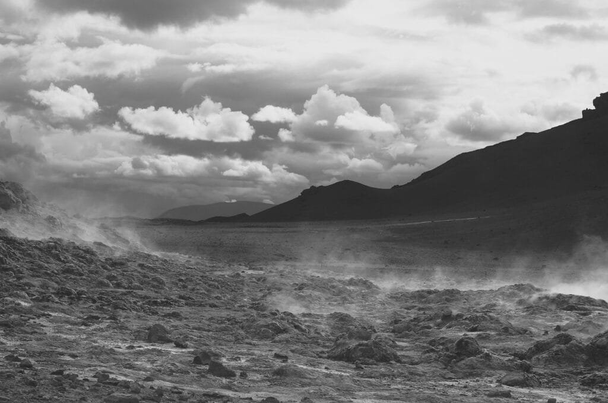

Imagine living near an active volcano. Sounds risky, right? But did you know that volcanic geothermal energy can have a positive impact on local communities? In this article, we will explore how volcanoes, with their underground heat sources, can provide clean and sustainable energy to nearby towns and cities. From harnessing the power of hot springs and steam to generating electricity, volcanic geothermal energy has the potential to not only improve the livelihoods of people living in volcanic regions but also contribute to global efforts in reducing carbon emissions. So, let's delve into the fascinating world of volcanic geothermal energy and find out how it is transforming the lives of those living in its proximity.

This image is property of pixabay.com.

## Understanding Volcanic Geothermal Energy

### Explanation of what geothermal energy is

Geothermal energy is a type of renewable energy that comes from the heat stored beneath the Earth's surface. This heat is produced by the natural decay of radioactive materials and the residual heat from the formation of the Earth. Geothermal energy can be harnessed through the use of geothermal power plants to generate electricity or for direct use in heating and cooling applications.

### Connection between volcanoes and geothermal energy

Volcanoes play a significant role in the production of geothermal energy. The intense heat generated by volcanic activity can create geothermal reservoirs, which consist of hot water or steam trapped beneath the Earth's surface. These reservoirs can be tapped into to extract the heat and convert it into usable energy.

### How geothermal energy is harnessed from volcanoes

The process of harnessing geothermal energy from volcanoes involves drilling wells into the geothermal reservoirs located near volcanic areas. The hot water or steam trapped underground is brought to the surface through these wells. The steam is then used to drive turbines, which generate electricity. In some cases, the hot water itself can be used directly for heating purposes. After the energy is extracted, the geothermal fluid is reinjected back into the reservoir, ensuring a sustainable and continuous source of energy.

## Geographic Distribution of Volcanoes

### Regions that are prone to volcanic activities

Volcanoes can be found in various regions across the globe, but they are most commonly associated with plate boundaries. These regions, known as the "Ring of Fire," are highly prone to volcanic activities due to the intense tectonic activity. Some examples of countries located in the Ring of Fire include Japan, Philippines, Indonesia, and Chile.

### Influential role of tectonic plates in volcano formation

Volcanoes are formed as a result of the movement of tectonic plates. When two plates converge, one plate subducts beneath the other, creating a subduction zone. The subducting plate melts due to the intense heat and pressure, forming magma, which eventually rises to the surface and erupts as a volcano.

### Significance of the 'Ring of Fire'

The "Ring of Fire" is a major area in the basin of the Pacific Ocean where a large number of earthquakes and volcanic eruptions occur. This region is highly significant in terms of volcanic geothermal energy as the volcanoes found here provide abundant sources for harnessing geothermal energy.

### Simple overview of shield volcanoes in Hawaii

[Shield volcanoes](https://magmamatters.com/understanding-volcanic-formation-a-comprehensive-guide/ "Understanding Volcanic Formation: A Comprehensive Guide"), like those found in Hawaii, are formed by repeated eruptions of fluid lava. These volcanoes have broad, gently sloping sides, resembling a warrior's shield, hence the name "shield volcano." The lava from these volcanoes has low viscosity, allowing it to flow long distances before solidifying. The volcanoes in Hawaii, such as Mauna Loa and Kilauea, are prime examples of shield volcanoes.

This image is property of pixabay.com.

## Benefits of Volcanic Geothermal Energy

### Contribution to sustainable and renewable energy

Volcanic geothermal energy is a sustainable and renewable source of energy that can help reduce our reliance on fossil fuels. Unlike coal, oil, or natural gas, which are finite resources that emit greenhouse gases when burned, geothermal energy harnesses the heat from the Earth's interior, making it an environmentally friendly energy option.

### Reduction in reliance on fossil fuels

By utilizing volcanic geothermal energy, communities can reduce their dependence on fossil fuels for electricity generation and heating. This not only helps to mitigate [climate change](https://magmamatters.com/geothermal-energy-and-its-volcanic-origins/ "Geothermal Energy and Its Volcanic Origins") but also contributes to a more secure and sustainable energy future.

### Economic gain from the sale of geothermal energy

The production and sale of geothermal energy can provide significant economic benefits for local communities. As a renewable energy source, geothermal energy can be a lucrative industry, attracting investments and creating job opportunities in the energy sector.

### Stimulation of job growth in energy sectors

The development and operation of geothermal power plants require a skilled workforce, leading to job creation and economic growth in the energy sector. These jobs can range from engineers and technicians to construction workers and maintenance personnel. Additionally, the growth of geothermal energy can stimulate ancillary industries, such as drilling and equipment manufacturing.

## Impact on the Environment

### Geothermal energy's role in reducing carbon emissions

One of the major environmental benefits of volcanic geothermal energy is its ability to reduce carbon emissions. Geothermal power plants produce little to no greenhouse gases during operation, unlike fossil fuel-based power plants. By replacing traditional power generation methods with geothermal energy, local communities can significantly contribute to the global effort of reducing carbon emissions.

### Effects on local biodiversity and ecosystems

The development and operation of geothermal power plants can have some impact on local biodiversity and ecosystems. Construction activities may cause habitat disruption and fragmentation, potentially affecting certain plant and animal species. However, with proper planning and mitigation measures, the impact on biodiversity can be minimized.

### Potential risks and downsides to the environment

While geothermal energy itself is a clean source of energy, there are potential risks and downsides to consider. The reinjection of geothermal fluids back into the reservoirs can bring up minerals and chemicals from deep within the Earth, which may have adverse effects on the environment if not properly managed. Additionally, there is a small risk of induced seismicity, or human-induced earthquakes, associated with geothermal operations.

This image is property of pixabay.com.

## Economic Impact on Local Communities

### Impact on local job markets and employment

The development of geothermal energy projects can have a positive impact on local job markets and employment. It creates opportunities for skilled and unskilled workers, ranging from geologists and engineers to construction workers and administrative staff. These jobs can provide stable incomes and contribute to the economic growth of local communities.

### Increased local revenues from energy production

Geothermal energy projects can generate significant revenues for local communities through the sale of electricity to the grid or direct use applications. This additional income can be utilized for essential services, infrastructure development, or public welfare programs, benefiting the entire local population.

### Tourism opportunities due to geothermal installations

Geothermal power plants and associated infrastructure can attract tourists and visitors, thereby contributing to the local tourism industry. Visitors interested in renewable energy and the natural wonder of volcanic activity may be drawn to areas with geothermal installations, providing an additional source of revenue and employment opportunities for local businesses.

## Impact on Local Infrastructure

### Stable and consistent power supply

Volcanic geothermal energy can provide a stable and consistent power supply to local communities. Unlike intermittent renewable energy sources like solar and wind, geothermal energy is not dependent on weather conditions, ensuring a reliable source of electricity.

### Potential need for infrastructure upgrades

The implementation of geothermal energy projects may require upgrades to local infrastructure, such as transmission lines and substations, in order to distribute the generated power. These upgrades are necessary to ensure the efficient and reliable delivery of geothermal energy to end-users.

### Challenges to infrastructure during implementation

The construction and operation of geothermal power plants can pose challenges to local infrastructure. Heavy machinery and equipment may temporarily disrupt roads and transportation networks. However, these challenges can be minimized through proper planning and coordination between project developers and local authorities.

## Health and Safety Implications

### Effects on air and water quality

Geothermal power plants have minimal impact on air quality as they produce virtually no air pollution during operation. However, there may be some emissions of certain gases, such as hydrogen sulfide, which can have a noticeable odor. Proper monitoring and mitigation measures can ensure that these emissions remain within safe limits.

### Potential health risks in cases of volcanic eruptions

While geothermal energy operations are separate from volcanic eruptions, there could still be potential health risks associated with volcanic activity. During an eruption, [volcanic gases](https://magmamatters.com/the-art-and-science-of-volcano-monitoring/ "The Art and Science of Volcano Monitoring"), ash, and debris can pose hazards to human health. Communities near active volcanoes should have emergency preparedness plans in place to protect residents in case of an eruption.

### Preventive measures for potential volcanic hazards

To mitigate potential volcanic hazards, communities near volcanic areas should have early warning systems, evacuation plans, and emergency shelters. Regular monitoring of volcanic activity and effective communication between authorities and residents are crucial to ensure the safety and well-being of local communities.

## Cultural and Social Implications

### Influence on local customs and traditions

The presence of geothermal energy projects may have an influence on local customs and traditions. These projects can become a part of the local identity and pride, reflecting the commitment to renewable energy and sustainable development. Local communities may incorporate elements of geothermal energy into cultural events and celebrations, showcasing their unique connection with the volcanic geothermal resources.

### Effects on community cohesion and social dynamics

Geothermal energy projects can bring communities together and foster a sense of unity and cooperation. The development and operation of these projects often require collaboration between various stakeholders, including government agencies, project developers, and local communities. This collaboration can strengthen community bonds and social dynamics.

### Potential disruption of local cultures

While geothermal energy projects can bring economic and social benefits, they may also disrupt local cultures and traditions. The construction and operation of power plants and associated infrastructure can change the landscape and alter the traditional way of life for some communities. It is essential to involve local communities in the decision-making process and ensure their concerns and values are taken into consideration.

## Case Studies of Geothermal Energy

### Case study: Geothermal energy in Iceland

Iceland is a prime example of a country that has successfully harnessed geothermal energy from volcanic sources. With its abundant geothermal resources, Iceland has been able to generate a substantial portion of its electricity and heat from geothermal power plants. This has greatly reduced its reliance on imported fossil fuels and positioned Iceland as a global leader in renewable energy.

### Case study: Geothermal energy in the Philippines

The Philippines is another country that has tapped into its volcanic resources to harness geothermal energy. Being located in the Ring of Fire, the country is endowed with numerous geothermal fields. Geothermal power plants in the Philippines have played a vital role in providing electricity to remote areas, supporting economic growth, and reducing carbon emissions.

### Case study: Geothermal energy in New Zealand

New Zealand, with its geologically active landscape, has a long history of utilizing geothermal energy. The country has a significant number of geothermal power plants, supplying both electricity and heat to local communities. Geothermal energy has become an integral part of New Zealand's energy mix, contributing to its transition to a more sustainable and renewable future.

## Future Outlook on Volcanic Geothermal Energy

### Growth prospects of volcanic geothermal energy

The future outlook for volcanic geothermal energy is promising. As the world seeks to transition to cleaner and more sustainable energy sources, the demand for geothermal energy is expected to increase. Advancements in technology and improved understanding of geothermal reservoirs will contribute to the growth and development of geothermal energy projects around volcanic areas.

### Potential challenges and solutions

While volcanic geothermal energy offers numerous benefits, there are challenges that need to be addressed. These challenges include the high upfront investment costs, the uncertainty of geothermal resource availability, and potential environmental impacts. However, with proper planning, regulatory support, and technological advancements, these challenges can be overcome.

### Importance of further research and development on volcanic geothermal energy

Research and development play a crucial role in unlocking the full potential of volcanic geothermal energy. Further exploration and understanding of geothermal reservoirs, advancements in drilling techniques, and improvements in power plant efficiency will contribute to the growth and optimization of geothermal energy projects. Continued investment in research and development is essential to maximize the benefits of volcanic geothermal energy for local communities and the global energy sector.

In conclusion, volcanic geothermal energy provides a sustainable and renewable source of power that can benefit local communities in various ways. From reducing carbon emissions and creating jobs to stimulating economic growth and promoting cultural identity, the impact of geothermal energy extends beyond just electricity generation. By harnessing the power of volcanoes, we can tap into a clean and abundant energy source that can contribute to a more sustainable and resilient future for our communities.

