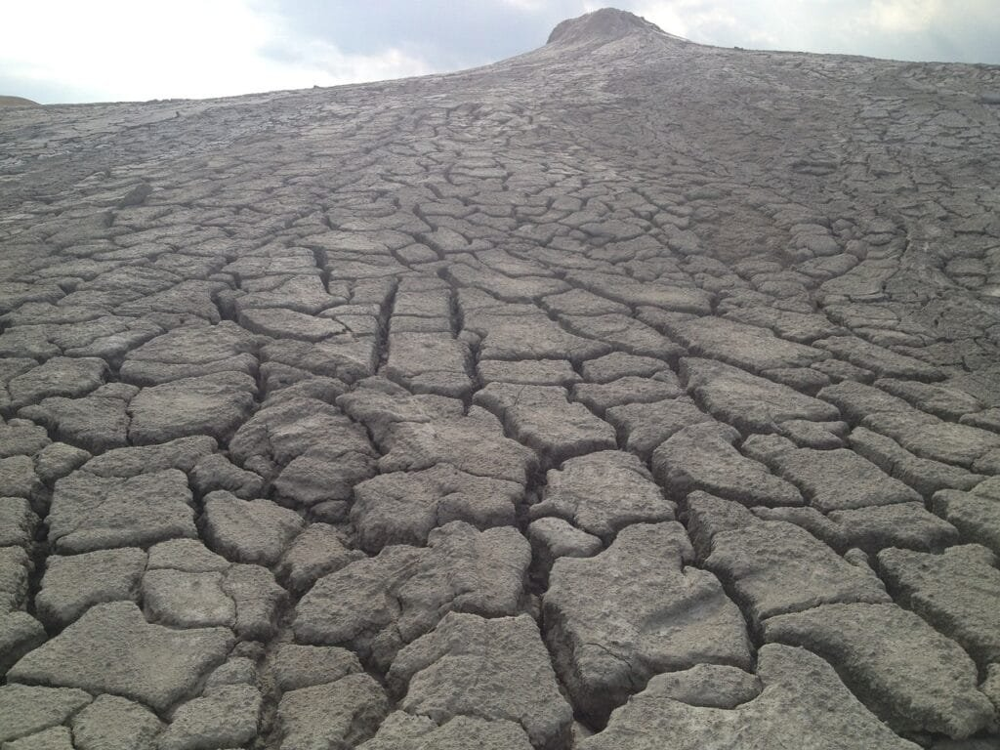
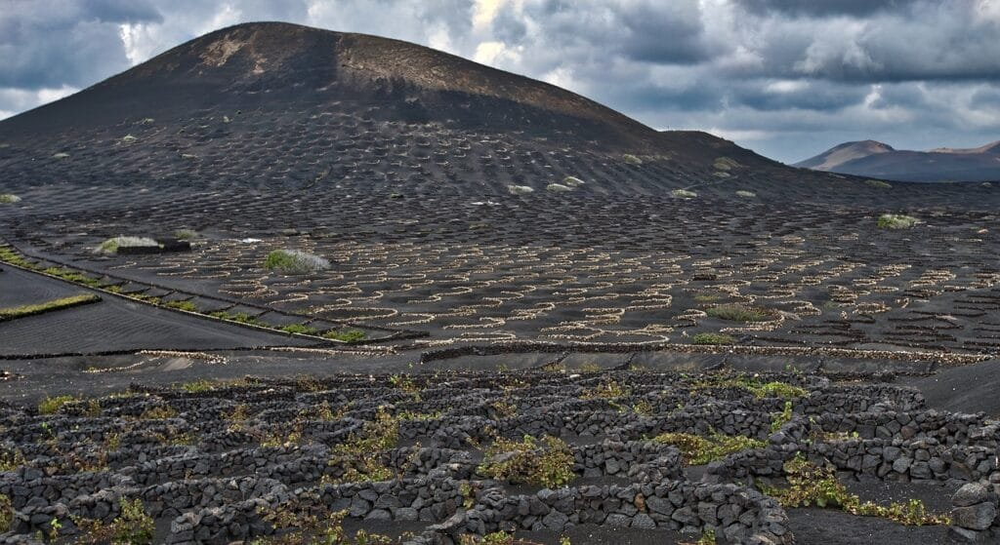

Volcanic soil, also known as volcanic ash soil, is highly prized for its exceptional fertility and ability to boost agricultural productivity. This type of soil is formed when volcanic eruptions deposit layers of ash and other volcanic materials on the earth's surface. The ash particles are rich in essential nutrients such as potassium, phosphorus, and nitrogen, which are vital for plant growth and development. Additionally, volcanic soil has a unique physical structure that allows for excellent water retention and drainage. These combined factors create a fertile environment that promotes healthy plant growth and high crop yields. Farmers who have access to volcanic soil often enjoy bountiful harvests and increased agricultural output, making it a valuable resource for food production. In this article, we will explore the various ways in which volcanic soil impacts agricultural productivity, highlighting the benefits and advantages it brings to farming communities worldwide.

This image is property of pixabay.com.

## Characteristics of Volcanic Soil

### Definition and Formation

Volcanic soil, also known as volcanic ash soil or volcanic ash-derived soil, is soil that has been formed through the weathering and decomposition of volcanic material. It is primarily composed of ash, pumice, cinders, and other volcanic debris, which are rich in minerals and nutrients. The volcanic materials are typically deposited on the earth's surface during volcanic eruptions and can be found in areas with a history of volcanic activity.

The formation of volcanic soil begins when lava and ash are ejected from a volcano during an eruption. As the volcanic material settles, it undergoes a process called weathering, which involves the breakdown of rocks and minerals by physical, chemical, and biological processes. Over time, this weathered volcanic material mixes with other organic matter, such as decaying plants and animals, to form fertile volcanic soil.

### Physical Properties

Volcanic soil exhibits several physical properties that contribute to its fertility and productivity. One of the notable characteristics is its fine texture, which allows for good water drainage and aeration. The presence of small particles, such as ash and pumice, creates a porous structure that promotes the movement of air and water through the soil. This, in turn, enables the roots of plants to access oxygen and absorb nutrients more effectively.

Additionally, volcanic soil is typically well-drained due to its physical properties. The porous [nature](https://magmamatters.com/the-art-and-science-of-volcano-monitoring/ "The Art and Science of Volcano Monitoring") of the soil allows excess water to percolate through the soil profile, preventing waterlogging and the risk of root rot. This proper drainage is crucial for plant growth as it ensures that the roots receive adequate oxygen while preventing the buildup of harmful salts and toxins in the soil.

### Chemical Properties

Volcanic soil is renowned for its high mineral content, which contributes to its fertility and productivity. The volcanic material from which the soil is derived is rich in essential nutrients, such as potassium, phosphorus, calcium, magnesium, and sulfur. These nutrients are released into the soil during the weathering process, providing plants with a readily available source of nutrition.

Furthermore, volcanic soil is often alkaline in nature, with a pH level ranging from neutral to slightly alkaline. This alkalinity helps to enhance nutrient availability in the soil, as many nutrients are more readily accessible to plants under alkaline conditions. However, the pH level can vary depending on the specific type of volcanic soil and the surrounding environmental conditions.

The high mineral content and alkaline [nature of volcanic soil create an optimal environment](https://magmamatters.com/the-environmental-impact-of-volcanic-eruptions-2/ "The Environmental Impact of Volcanic Eruptions") for plant growth. These chemical properties promote healthy root development, improve nutrient uptake, and contribute to overall agricultural productivity.

## Why Does Volcanic Soil Boost Agricultural Productivity?

### Rich in Nutrients

One of the primary reasons volcanic soil boosts agricultural productivity is its rich nutrient content. The volcanic material from which the soil is derived contains a wide range of essential plant nutrients, including nitrogen, phosphorus, potassium, and trace elements like iron and zinc. These nutrients are essential for plant growth, development, and reproduction.

As the volcanic material weathers and decomposes, these nutrients are released into the soil, creating a nutrient-rich environment that is highly beneficial for plant growth. The availability of these nutrients in volcanic soil allows plants to access them more easily, leading to increased productivity and healthier crops.

### Excellent Water Retention

Volcanic soil exhibits excellent water retention properties, allowing it to hold moisture for longer periods compared to other types of soil. The fine texture and porous structure of volcanic soil enable it to absorb and retain water effectively, providing a consistent source of moisture to plant roots.

This water retention capacity is particularly beneficial in areas with erratic rainfall patterns or in regions experiencing drought conditions. Volcanic soil can store water during periods of rainfall and slowly release it to plant roots during dry periods. This helps to prevent water stress in plants and ensures their continued growth and development, even in challenging climatic conditions.

### Enhanced Soil Structure

The physical properties of volcanic soil, such as its fine texture and porous structure, contribute to an enhanced soil structure that promotes healthy root development. The small particles in volcanic soil create spaces between them, allowing for better air and water movement within the soil profile.

This improved soil structure facilitates root penetration, enabling plants to establish strong root systems. Strong root systems are essential for plant nutrient uptake, as they allow the roots to explore a larger volume of soil and access a greater quantity of nutrients. Additionally, a well-structured soil prevents compaction and erosion, reducing the risk of nutrient loss and ensuring long-term soil fertility.

Overall, the combination of nutrient-rich composition, excellent water retention, and enhanced soil structure makes volcanic soil highly conducive to agricultural productivity.

This image is property of pixabay.com.

## Nutritional Contribution of Volcanic Soil

### Mineral Content

Volcanic soil is characterized by its high mineral content, which plays a critical role in the nutritional contribution of this type of soil to agricultural productivity. The volcanic material from which the soil is derived contains minerals such as potassium, phosphorus, calcium, magnesium, and sulfur, among others. These minerals are essential for plant growth and development, as they serve as building blocks for enzymes, proteins, and other important plant compounds.

Plants obtain these minerals from the volcanic soil through their root systems. The minerals present in the soil are dissolved in water and taken up by the roots, where they are transported throughout the plant. Adequate mineral availability in the soil is essential for optimal plant growth, as mineral deficiencies can lead to stunted growth, reduced yield, and poor crop quality.

### Organic Matter Presence

In addition to its mineral content, volcanic soil also contains organic matter derived from decaying plants and animals. This organic matter contributes to the fertility and nutrient content of the soil, as it releases essential nutrients over time through the process of decomposition. Organic matter also improves soil structure, water retention, and nutrient holding capacity, further enhancing the nutritional contribution of volcanic soil to agricultural productivity.

Organic matter acts as a reservoir for nutrients, holding them near the root zone and preventing nutrient leaching. It also provides a food source for beneficial soil organisms, such as earthworms and bacteria, which play a crucial role in nutrient cycling and soil health. The presence of organic matter in volcanic soil helps to support the growth of healthy plants and sustain long-term soil fertility.

### Fertility Enhancement

Overall, the combination of mineral content and organic matter presence in volcanic soil enhances its fertility and contributes to its nutritional value for agricultural purposes. The minerals and nutrients released during the weathering of volcanic material provide plants with the necessary elements for growth and development.

Furthermore, the presence of organic matter improves the overall health and fertility of the soil, ensuring a continuous supply of nutrients for plants. Fertile volcanic soil supports higher crop yields, enhances crop quality, and contributes to the overall productivity of agricultural systems.

## Water Management and Volcanic Soil

### Water Retention Properties

One of the significant benefits of volcanic soil is its excellent water retention properties. The fine texture and porous structure of volcanic soil allow it to absorb and retain water effectively. This is particularly advantageous in regions with irregular rainfall patterns, as the soil can store water during periods of heavy precipitation and release it slowly to plant roots during drier periods.

The ability of volcanic soil to retain water helps to mitigate the effects of drought and reduces the reliance on supplemental irrigation. It provides plants with a consistent source of moisture, ensuring their growth and productivity, even in challenging climatic conditions.

### Drainage Capabilities

While volcanic soil excels in water retention, it also possesses good drainage capabilities. The porous structure of volcanic soil promotes the movement of excess water through the soil profile, preventing waterlogging and the associated risk of root rot and nutrient loss.

The efficient drainage of volcanic soil is crucial for maintaining optimal soil aeration and preventing the buildup of harmful salts and toxins. Proper drainage ensures that plant roots have access to oxygen and can absorb nutrients efficiently, leading to healthier and more productive crops.

### Role in Irrigation

Volcanic soil plays an essential role in irrigation management due to its water retention and drainage properties. In areas with limited water resources, volcanic soil can reduce the need for frequent irrigation, as it can store water for extended periods.

By minimizing water loss through evaporation and runoff, volcanic soil helps maximize the effectiveness of irrigation practices. It allows for the efficient use of water resources, reducing the overall water requirements for agricultural production. This plays a significant role in sustainable water management and helps conserve this valuable resource.

This image is property of pixabay.com.

## Impact of Volcanic Soil on Crop Yield

### Increased Biomass

One of the significant impacts of volcanic soil on crop yield is the promotion of increased biomass production. The nutrient-rich composition and ideal soil conditions provided by volcanic soil contribute to enhanced plant growth and development.

The high mineral content in volcanic soil ensures that plants have an ample supply of essential nutrients necessary for biomass production. The presence of organic matter also facilitates nutrient availability and promotes healthy root development, enabling plants to extract nutrients efficiently from the soil.

As a result, crops grown in volcanic soil often exhibit higher levels of biomass compared to those grown in less fertile soils. Increased biomass production leads to higher yields and contributes to the overall agricultural productivity in volcanic regions.

### Improved Crop Quality

The impact of volcanic soil on crop yield is not limited to quantity alone; it also extends to the quality of the harvested crops. The mineral-rich composition of volcanic soil provides plants with the necessary elements to produce high-quality crops, including fruits, vegetables, and grains.

The availability of essential nutrients in volcanic soil promotes the synthesis of proteins, vitamins, and other compounds that contribute to the nutritional value and taste of crops. As a result, crops grown in volcanic soil often exhibit improved flavor, color, and nutritional profiles, making them more desirable to consumers.

Farmers in volcanic regions can take advantage of these quality improvements to command premium prices for their products, further enhancing the economic viability of agricultural activities.

### Enhancement in Crop Resistance

Volcanic soil also plays a role in enhancing crop resistance to various environmental stresses and diseases. The nutrient-rich composition of volcanic soil promotes robust plant growth, resulting in stronger and healthier crops that are less susceptible to pests and diseases.

Additionally, the ability of volcanic soil to retain water contributes to crop resistance during drought conditions. The consistent moisture supply ensures that plants can maintain optimal physiological functions and withstand periods of water scarcity.

The enhanced crop resistance provided by volcanic soil helps to minimize yield losses and supports more resilient agricultural systems in regions prone to challenging climatic conditions or disease outbreaks.

## Limitations in Utilizing Volcanic Soil

### Soil Acidity Issues

One of the limitations of volcanic soil is its potential for high acidity. Depending on the specific type of volcanic soil and the surrounding environmental conditions, volcanic soil can exhibit varying levels of acidity. Excessive soil acidity can hinder nutrient availability to plants and affect their growth and productivity.

To address soil acidity issues, farmers in volcanic regions may need to apply lime or other soil amendments to neutralize the acidic pH and create a more favorable environment for crops. Soil testing and regular monitoring of soil pH are essential in managing acidity levels and ensuring optimal nutrient uptake by plants.

### Presence of Heavy Metals

Volcanic soil can also contain elevated levels of heavy metals, which can pose a risk to both human health and the environment. These heavy metals, such as lead, cadmium, and arsenic, are naturally present in the volcanic material and can be released into the soil during weathering and decomposition processes.

Excessive accumulation of heavy metals in the soil can lead to contamination of crops and groundwater, making them unsafe for consumption. Therefore, farmers utilizing volcanic soil need to monitor heavy metal levels and implement appropriate strategies to mitigate their potential adverse effects.

Soil management practices, such as soil testing and the use of organic amendments, can help reduce heavy metal concentrations and ensure the safety of agricultural products.

### Challenges in Soil Management

The unique characteristics and properties of volcanic soil present challenges in its management for agricultural purposes. The fine texture and porous structure of volcanic soil make it vulnerable to erosion, particularly in areas with steep slopes or heavy rainfall.

Erosion can lead to the loss of topsoil, which is rich in nutrients and essential for plant growth. To mitigate erosion, farmers must implement appropriate soil conservation measures, such as terracing, contour plowing, and cover cropping. These practices help to reduce soil erosion, maintain soil fertility, and protect the overall health of the soil ecosystem.

Furthermore, volcanic soils may require additional soil amendments and fertilizers to supplement nutrient deficiencies and maintain optimal nutrient levels for crop growth. Regular soil testing and nutrient management practices are crucial in ensuring that the soil remains fertile and productive.

## Examples of Successful Agriculture in Volcanic Soil

### Coffee Production in Costa Rica

Costa Rica is known for its thriving coffee industry, and much of the country's success can be attributed to its volcanic soil. The volcanic ash and mineral-rich composition of the soil provide optimal conditions for coffee plants to grow and produce high-quality beans.

The combination of high-altitude regions, volcanic soil, and favorable climatic conditions in Costa Rica creates an ideal environment for cultivating coffee. The nutrient-rich soil contributes to the development of coffee plants with robust root systems, enabling them to absorb nutrients efficiently and produce flavorful coffee cherries.

Coffee plantations in volcanic regions of Costa Rica have gained recognition for their high-quality beans and unique flavor profiles, making them highly sought after in the global coffee market.

### Wine Production in Italy

Italy is renowned for its wine production, and volcanic soil plays a significant role in the success of many Italian wine regions. Examples include the volcanic regions of Sicily, Mount Etna, and Campania, where wine grapes thrive in the mineral-rich and porous volcanic soils.

Volcanic soil provides the ideal conditions for grape cultivation, as it contributes to the flavor complexity and unique characteristics of the wines produced in these regions. The low fertility, good drainage, and mineral content of volcanic soil create a stressful environment for the vines, leading to a concentration of flavors and aromas in the grapes.

Wines produced in volcanic regions of Italy, such as Etna Rosso and Greco di Tufo, have gained international recognition for their distinctive qualities and have become prized by wine enthusiasts worldwide.

### Rice Production in The Philippines

The Philippines is one of the leading producers of rice globally, and volcanic soil plays a crucial role in supporting the country's rice production. The volcanic ash soil found in regions such as the Bicol Region, Central Luzon, and Albay provides favorable conditions for rice cultivation.

The mineral-rich composition of volcanic soil provides essential nutrients, such as potassium and phosphorus, necessary for the growth and development of rice plants. The excellent water retention properties of volcanic soil also help to sustain rice crops during the wet season, ensuring optimal grain yield.

Farmers in volcanic regions of the Philippines have capitalized on these favorable soil conditions to achieve high rice yields and contribute to the overall food security of the country.

## Addressing Challenges in Farming with Volcanic Soil

### Integrating Soil Amendments

To overcome limitations associated with acidity and heavy metal presence, farmers in volcanic regions can integrate soil amendments into their agricultural practices. Lime application can help neutralize soil acidity and create a more favorable pH for plant growth.

Additionally, the use of organic amendments, such as compost and manure, can improve soil fertility, structure, and nutrient content. Organic matter acts as a buffer against acidity and helps reduce heavy metal availability in the soil. Incorporating organic amendments into volcanic soil can enhance its overall productivity and mitigate potential challenges.

### Implementing Suitable Crop Rotation

Crop rotation is an effective strategy to optimize soil health and fertility in volcanic regions. By rotating crops and diversifying plant species, farmers can prevent the depletion of specific nutrients and reduce the risk of pest and disease buildup.

Different crops have varying nutrient requirements, and rotating crops helps maintain a balanced nutrient profile in the soil. Additionally, crop rotation can break pest and disease cycles, reducing the need for chemical pesticides and promoting a more sustainable farming system.

### Adoption of Suitable Farming Practices

The adoption of suitable farming practices is essential for maximizing the potential of volcanic soil and ensuring long-term sustainability. Practices such as conservation tillage, contour plowing, and cover cropping can help minimize soil erosion, protect soil structure, and maintain optimal nutrient levels.

Implementing precision agriculture techniques, such as soil testing and targeted nutrient application, can also help optimize nutrient management and ensure efficient use of fertilizers. By tailoring farming practices to the specific characteristics of volcanic soil, farmers can overcome limitations and achieve sustainable agricultural productivity.

## Potential Threats to Agriculture in Volcanic Regions

### Risk of Volcanic Eruptions

While volcanic soil provides numerous benefits to agriculture, it is important to recognize the potential threats associated with volcanic activity. Volcanic regions are prone to volcanic eruptions, which can have devastating effects on agricultural landscapes.

Volcanic eruptions can release large quantities of ash, gases, and rocks, burying fertile soil and destroying crops. The heat and toxic gases emitted during volcanic eruptions can also lead to the death of plants and animals, further impacting agricultural productivity.

Farmers in volcanic regions must be prepared for potential volcanic activity and have contingency plans in place to protect their crops and livelihoods. Monitoring volcanic activity, early warning systems, and evacuation plans can help mitigate the risks associated with volcanic eruptions.

### Environmental Impacts

The environmental impacts of volcanic soil utilization must also be considered. The extraction and utilization of volcanic material can lead to habitat destruction, soil erosion, and disturbance of natural ecosystems.

It is crucial for farmers and land managers to adopt responsible land management practices and ensure the sustainable utilization of volcanic soil resources. This includes implementing erosion control measures, reforestation initiatives, and conservation practices to minimize the environmental impacts associated with agricultural activities in volcanic regions.

### Climate Change Considerations

With the increasing global concern over climate change, it is important to consider the potential effects of [climate change on volcanic](https://magmamatters.com/geothermal-energy-and-its-volcanic-origins/ "Geothermal Energy and Its Volcanic Origins") regions and their agricultural productivity. Climate change can alter rainfall patterns, temperature regimes, and the frequency and intensity of extreme weather events, impacting agricultural systems in volcanic regions.

Farmers in volcanic regions must adapt to these changing climate conditions by implementing climate-smart agricultural practices. These practices can include crop diversification, water management strategies, and the use of drought-resistant crop varieties.

Considering the potential threats posed by volcanic eruptions, environmental impacts, and climate change, it is crucial to promote sustainable and resilient agriculture in volcanic regions. By adopting appropriate mitigation measures and implementing climate-smart practices, farmers can ensure the long-term productivity and sustainability of agricultural systems in these areas.

## Future Perspectives on Volcanic Soil Utilization

### Role in Sustainable Agriculture

Volcanic soil has a significant role to play in the future of sustainable agriculture. Its unique characteristics, such as its high fertility, water retention properties, and enhanced soil structure, make it a valuable resource for agricultural production.

By utilizing volcanic soil and implementing sustainable farming practices, farmers can minimize the environmental impacts of agriculture, conserve soil and water resources, and maintain long-term soil fertility. The nutrient-rich composition of volcanic soil also reduces the reliance on synthetic fertilizers, contributing to the reduction of agronomic inputs and minimizing potential environmental pollution.

Furthermore, the efficient water management capabilities of volcanic soil contribute to water conservation and the sustainable use of this vital resource. Volcanic soil can help mitigate the effects of climate change by promoting resilient agricultural systems that are adaptable to changing climatic conditions.

### Influence on Global Food Security

Volcanic soil utilization has the potential to contribute to global food security by enhancing agricultural productivity and supporting sustainable food production systems. The nutrient-rich composition and excellent water management properties of volcanic soil can help meet the increasing demand for food in a world facing population growth and changing dietary patterns.

By maximizing the potential of volcanic soil and adopting sustainable agricultural practices, farmers can increase crop yields, improve crop quality, and enhance overall agricultural productivity. This, in turn, helps to ensure a stable and abundant food supply for local communities and contributes to global food security.

### Implications for Climate Resilience

As climate change continues to impact agricultural systems worldwide, the resilience of farming practices and the development of climate-resilient crops become increasingly important. Volcanic soil utilization offers opportunities to enhance climate resilience in agricultural systems.

The water retention properties of volcanic soil can help crops withstand periods of drought, providing a consistent source of moisture to plants. The enhanced soil structure also supports healthy root development, enabling plants to access nutrients and withstand environmental stresses.

By capitalizing on the beneficial properties of volcanic soil and implementing climate-smart practices, farmers can enhance the resilience of their agricultural systems and mitigate the potential impacts of climate change.

In conclusion, volcanic soil presents numerous advantages and characteristics that contribute to its positive impact on agricultural productivity. From its nutrient-rich composition and water retention properties to its role in improving crop quality and enhancing resistance to environmental stresses, volcanic soil plays a critical role in supporting sustainable and resilient agricultural systems.

While challenges such as soil acidity, heavy metal presence, and soil management issues exist, addressing these challenges through suitable soil amendments, crop rotation, and appropriate farming practices is essential. Successful examples of agriculture in volcanic soil, such as coffee production in Costa Rica, wine production in Italy, and rice production in the Philippines, demonstrate the potential for productive and profitable farming in volcanic regions.

However, it is crucial to recognize potential threats to agriculture in volcanic regions, such as volcanic eruptions, environmental impacts, and climate change considerations. By adopting proactive measures and implementing responsible land management practices, farmers can ensure the long-term productivity and sustainability of agricultural systems in volcanic soil.

Looking ahead, the utilization of volcanic soil holds promise for sustainable agriculture, global food security, and climate resilience. By harnessing its unique properties and promoting sustainable farming practices, volcanic soil can continue to contribute significantly to agricultural productivity and support the needs of communities worldwide.

