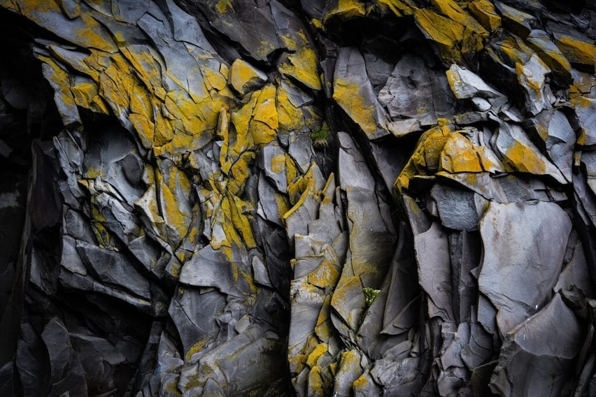

Volcano formation plays a significant role in shaping our climate. When molten rock, gases, and debris escape to the earth's surface during eruptions, they release various substances into the atmosphere that can have both immediate and long-lasting effects on our climate. These substances include sulfur dioxide, ash particles, and greenhouse gases like carbon dioxide. Volcanic eruptions can result in temporary cooling of the Earth's surface due to the reflection of sunlight by ash particles, but they can also contribute to global warming in the long term by releasing greenhouse gases. By understanding the impact of volcano formation on climate, we can better comprehend the complexities of our planet's climate system and its responses to natural phenomena.

This image is property of pixabay.com.

## Understanding Volcano Formation Process

[Volcanoes are fascinating natural phenomena that have a significant impact](https://magmamatters.com/the-environmental-impact-of-volcanic-eruptions-2/ "The Environmental Impact of Volcanic Eruptions") on our climate and environment. To understand the intricate relationship between volcanoes and climate, it is crucial to gain insight into the formation process of these majestic structures.

### Volcano Formation at Plate Boundaries

At plate boundaries, which are the areas where the Earth's tectonic plates meet and interact, volcano formation is a common occurrence. These plate boundaries can either be convergent, where two plates collide, or divergent, where two plates move apart. Volcanoes that form at convergent plate boundaries result from the subduction of one tectonic plate beneath another. This subduction process leads to the release of molten rock, known as magma, that rises to the surface, ultimately forming volcanoes.

### Shield Volcano Formation Over Hot Spots

In contrast to plate boundaries, shield volcanoes are formed over hot spots deep underground. Hot spots are areas where plumes of exceptionally hot mantle material rise from the Earth's core to just below the crust. The hot spot causes the overlying tectonic plate to melt, giving rise to the formation of a shield volcano. Shield volcanoes are characterized by their low-profile, broad shape, and relatively gentle eruptions.

### Volcano Formation in Rift Zones

Rift zones, also known as divergent plate boundaries, occur when tectonic plates move apart from each other. As the plates separate, magma from the Earth's mantle rises to fill the gap, forming new crust and giving birth to volcanoes. In rift zones, volcanic activity is often characterized by frequent and relatively mild eruptions.

### Impact of Lava Viscosity and Gas Content on Eruptions

The viscosity of lava and the gas content within it play crucial roles in volcano eruptions and their nature. Lava viscosity refers to how easily lava flows, with high viscosity lava flowing more sluggishly and low viscosity lava being more fluid. The gas content within lava contributes to eruptions by creating pressure that eventually leads to explosive eruptions. Volcanoes with high gas content and low viscosity lava tend to produce more explosive and hazardous eruptions, while those with low gas content and high viscosity lava experience more effusive eruptions.

## Geographic Distribution of Volcanoes

Volcanoes are not evenly distributed across the globe; instead, they exhibit distinct patterns and concentrations in certain regions. Understanding the geographic distribution of volcanoes is essential in comprehending their overall impact on climate and the environment.

### Exploration of 'Ring of Fire'

The "Ring of Fire" is a region encircling the Pacific Ocean where a significant number of earthquakes and volcanic eruptions occur. This area is characterized by the convergence of several tectonic plates, making it highly geologically active. Volcanoes present in the "Ring of Fire" have a profound influence on climate due to the frequency and magnitude of their eruptions.

### Diversity of Hawaiian Shield Volcanoes

The Hawaiian Islands are renowned for their stunning shield volcanoes, which have been formed over millions of years. These shield volcanoes, such as Mauna Loa and Kilauea, have unique characteristics and eruption patterns that contribute to their diverse impact on climate. Studying the various formations in Hawaii provides valuable insights into the relationship between volcano types and their influence on climate.

### Rift Zone Volcanoes Around the World

Rift zones, where tectonic plates are diverging, are also home to numerous volcanoes around the world. These rift zones can be found in various continents, including Africa, Iceland, and the East African Rift System. Each rift zone offers valuable information on the geological processes occurring beneath the Earth's surface and their subsequent impact on climate.

  

## Volcano Eruptions and Their Direct Impacts

Volcano eruptions have significant direct impacts on the surrounding environment, communities, and even global systems. Understanding the consequences of volcano eruptions is crucial in predicting their effects and implementing strategies to mitigate their negative outcomes.

### Local Environmental Consequences

One of the most immediate and noticeable impacts of volcano eruptions is the alteration of the local environment. Volcanic ash, lava flows, and pyroclastic density currents can destroy vegetation, contaminate water sources, and cause significant habitat disruption. The release of toxic gases during eruptions also poses a threat to both plant and animal life in the affected areas.

### Impact on Surrounding Communities

Volcanic eruptions can have severe consequences for communities living in close proximity to active volcanoes. The destruction caused by lava flows, ashfall, and lahars (destructive volcanic mudflows) can result in the displacement of communities and cause considerable economic and social upheaval. Additionally, exposure to volcanic gases and increased respiratory problems can adversely affect the health and well-being of individuals living in these areas.

### Effects on Global Air and Land Traffic

In addition to the immediate local impacts, volcanic eruptions can disrupt global air and land traffic. Volcanic ash clouds are a significant concern for aviation, as the fine particles can damage aircraft engines and severely limit visibility. Consequently, airspace may be temporarily closed, leading to flight cancellations and significant economic losses. Volcanic ash can also affect land transportation, as it can make roads slippery and reduce visibility, potentially causing accidents.

### Potential Global Catastrophe Scenarios

In rare cases, massive volcanic eruptions can have far-reaching consequences that extend beyond the immediate vicinity of the eruption. These eruptions, known as super-eruptions, release enormous amounts of volcanic ash and gas into the atmosphere, resulting in a cooling effect on the Earth's climate. The long-term impacts of such eruptions can cause significant disturbances in global temperature patterns and ecosystems.

## Emissions from Volcanic Eruptions

Volcanic eruptions release various gases and aerosols into the atmosphere, which can have short-term and long-term effects on climate and the environment. Understanding the composition and behavior of these emissions is vital in comprehending their impact on our planet.

### Types of Gas Emissions

Volcanoes emit a wide range of gases during eruptions, including water vapor, carbon dioxide (CO2), sulfur dioxide (SO2), hydrogen sulfide (H2S), and many others. Each gas can have a different influence on the climate, depending on its atmospheric lifetime and its ability to trap heat.

### Rate of Emission

The rate at which volcanic emissions are released during eruptions can vary significantly. Some eruptions might release gases and aerosols in short, intense bursts, while others may have a more prolonged emission period. These emission rates can directly impact the extent of the eruption's immediate and long-term effects.

### Lifespan of Volcanic Emissions in the Atmosphere

After being released during an eruption, volcanic emissions interact with the atmosphere and can remain present for varying lengths of time. Certain gases, such as water vapor, have relatively short lifespans in the atmosphere. In contrast, greenhouse gases like carbon dioxide can persist for much longer periods, contributing to long-term climate changes.

This image is property of pixabay.com.

## The Role of Aerosols in Climate Impact

Aerosols, which are tiny particles suspended in the atmosphere, play a significant role in the complex relationship between volcanic eruptions and climate. [Understanding how volcanic](https://magmamatters.com/understanding-volcanic-formation-a-comprehensive-guide/ "Understanding Volcanic Formation: A Comprehensive Guide") aerosols form, interact with radiation, and influence cloud formation is crucial in analyzing their impact on our climate system.

### Formation and Composition of Volcanic Aerosols

Volcanic aerosols are primarily formed during eruption events when lava, ash, and other volcanic materials are ejected into the atmosphere. These aerosols consist of a variety of particles, including glass shards, minerals, and sulfur compounds. The size and composition of these aerosols determine their ability to interact with sunlight and affect climate.

### Aerosols' Influence on Radiation Balance

Once in the atmosphere, volcanic aerosols can scatter and absorb incoming sunlight, thus modifying the Earth's radiation balance. The scattering of sunlight by aerosols can lead to a cooling effect on the planet's surface. However, certain aerosol particles, such as black carbon, can absorb sunlight and contribute to localized warming.

### Aerosols Impact on Cloud Formation

Volcanic aerosols can also influence cloud formation processes. Aerosol particles can serve as cloud condensation nuclei, providing surfaces upon which water vapor can condense and form clouds. The presence of volcanic aerosols can alter cloud properties, such as cloud droplet size and cloud lifetime, ultimately impacting the Earth's energy budget and climate system.

## Volcanic Influence on Atmospheric Temperature

Volcanic eruptions can affect atmospheric temperatures in both the short-term and long-term. Understanding these temperature changes is critical in predicting climate patterns and assessing the impact of volcanic activity on global climate systems.

### Short-Term Cooling Effects

After powerful volcanic eruptions, large amounts of sulfur dioxide are released into the stratosphere. These sulfur dioxide emissions can react with water vapor and form sulfate aerosols, which have a cooling effect on the Earth's atmosphere. The presence of these aerosols can temporarily lower global temperatures, leading to a phenomenon known as volcanic cooling.

### Long-Term Warming Effects

While volcanic eruptions can provide short-term cooling, some aspects of their emissions can contribute to long-term warming. For instance, [volcanic emissions of carbon dioxide](https://magmamatters.com/geothermal-energy-and-its-volcanic-origins/ "Geothermal Energy and Its Volcanic Origins"), a greenhouse gas, can accumulate in the atmosphere over time. The gradual increase in carbon dioxide concentration can subsequently lead to an enhanced greenhouse effect, resulting in long-term warming of the Earth's climate.

### Case Studies of Significant Volcanic Eruptions and Their Impact on Temperature

Throughout history, several significant volcanic eruptions have had a notable impact on atmospheric temperature patterns. Examining case studies, such as the 1991 eruption of Mount Pinatubo in the Philippines and the 1815 eruption of Mount Tambora in Indonesia, provides valuable insights into the relationship between volcanic activity and temperature variations.

This image is property of pixabay.com.

## Global Climate Models and Volcanoes

To accurately predict future climate trends, climate scientists incorporate volcanic emissions into global climate models. Understanding how volcanic activity and emissions are integrated into these models is crucial in comprehending the broader picture of climate change.

### Inclusion of Volcanic Emissions in Climate Models

Global climate models incorporate various factors, including volcanic emissions, to simulate the Earth's climate system. By including volcanic emissions in these models, scientists can estimate the impact of volcanic activity on climate variables such as temperature, precipitation, and atmospheric dynamics. This inclusion enables a more comprehensive understanding of the complex interactions between volcanoes and climate.

### Simulation of Global Temperature Responses to Volcanic Eruptions

By inputting data on the size, duration, and composition of volcanic eruptions into climate models, scientists can simulate the resulting temperature responses. These simulations provide insights into the short-term and long-term effects of volcanic eruptions on the Earth's climate. Such information aids in assessing the potential climate consequences of future volcanic activity.

## Volcanoes and Oceanic Impact

Volcanic eruptions also have significant consequences for the world's oceans. Understanding the impact of volcanic activity on sea surface temperature, oceanic currents, and ocean acidification is crucial in comprehending the broader implications of volcanic eruptions on the marine environment.

### Changes in Sea Surface Temperature

Volcanic eruptions can have profound effects on sea surface temperature. The release of gases and aerosols during eruptions can alter the amount of solar radiation reaching the ocean, ultimately influencing temperature patterns. Additionally, volcanic emissions can modify the chemical composition of seawater, directly impacting regional and global sea surface temperature.

### Alteration of Oceanic Current Patterns

The release of heat and chemicals from volcanic eruptions can disrupt oceanic currents, leading to changes in circulation patterns. These alterations in currents can affect temperature distribution, nutrient availability, and the migration of marine species. Understanding these changes is crucial in assessing the impact of volcanic activity on oceanic ecosystems and fisheries.

### Ocean Acidification Due to Volcanic Emissions

Volcanic emissions, particularly [sulfur dioxide and carbon](https://magmamatters.com/the-art-and-science-of-volcano-monitoring/ "The Art and Science of Volcano Monitoring") dioxide, can contribute to ocean acidification. When these gases are released into the atmosphere, they can dissolve in seawater, leading to a decrease in pH. This decrease in pH can have detrimental effects on marine life, especially organisms that rely on carbonate structures like coral reefs and shellfish.

## Volcanic Eruptions and Long-Term Climate Change

Volcanic eruptions have played a substantial role in shaping Earth's climate over millions of years. Understanding the influence of volcanic activity on greenhouse gas concentrations and natural climate variability is essential in deciphering the broader context of long-term climate change.

### Influence on Greenhouse Gas Concentrations

Volcanic eruptions release significant amounts of carbon dioxide and other greenhouse gases into the atmosphere. The accumulation of these gases, especially carbon dioxide, overtime, contributes to changes in the Earth's climate by enhancing the greenhouse effect. These emissions have played a role in climate changes throughout Earth's history, including past periods of warming and cooling.

### Contributions to Natural Climate Variability

Volcanic eruptions can also contribute to natural climate variability, which refers to fluctuations in climate patterns over long periods of time. The release of volcanic gases and aerosols can temporarily disrupt the Earth's energy balance, resulting in altered climate conditions. By examining past volcanic events, scientists can identify [the role of volcanic](https://magmamatters.com/the-role-of-volcanoes-in-earths-carbon-cycle-5/ "The Role Of Volcanoes In Earth’s Carbon Cycle") activity in natural climate variability and better understand its impacts on our current climate.

## Volcano Monitoring and Climate Prediction

Monitoring volcanic activity is essential for predicting eruptions and assessing their potential impact on climate. Understanding the relationship between volcanoes and climate enables us to adapt to and mitigate the risks associated with volcanic activity.

### Importance of Monitoring Volcanic Activity

Volcano monitoring involves the continuous observation and recording of various parameters, such as volcanic gas emissions, ground deformation, seismic activity, and thermal anomalies. By monitoring these indicators, scientists can detect changes in volcanic activity and provide early warnings of potential eruptions. This monitoring is crucial for safeguarding communities, predicting volcanic hazards, and minimizing the impact of eruptions on climate and the environment.

### Volcanoes as Indicators for Climate Shifts and Trends

Volcanoes can serve as indicators for climate shifts and trends due to their sensitivity to changes in the Earth's crust and mantle. By studying past eruptions and their associated climatic effects, scientists can gain insights into climate variations and dynamics. Volcanic activity can provide valuable information on regional and global climate patterns, aiding in the understanding of long-term climate change and its interactions with volcanic activity.

In conclusion, understanding the formation, eruption patterns, and impacts of volcanoes is crucial in comprehending their influence on climate. Volcanic eruptions release various gases, aerosols, and other materials into the atmosphere, which can have both short-term and long-term effects on temperature, rainfall patterns, oceanic conditions, and the overall climate system. By studying volcanoes and their relationship with climate, we can better predict, adapt to, and mitigate the risks associated with volcanic activity, ultimately ensuring the well-being of both humans and the environment.

Related Posts: [Mitigating Risks: Forecasting Volcanic Activity in Prone Areas](https://magmamatters.com/mitigating-risks-forecasting-volcanic-activity-in-prone-areas/), [The Formation and Eruption Patterns of Volcanoes](https://magmamatters.com/the-formation-and-eruption-patterns-of-volcanoes-4/), [The Pyroclastic Phenomena of Pompeii: 7 Insights to Explore](https://magmamatters.com/the-pyroclastic-phenomena-of-pompeii-7-insights-to-explore/), [Tips for Capturing Volcano Pyroclastic Flow Photos](https://magmamatters.com/tips-for-capturing-volcano-pyroclastic-flow-photos/), [Understanding Volcanoes and Their Eruption Patterns](https://magmamatters.com/understanding-volcanoes-and-their-eruption-patterns/)
