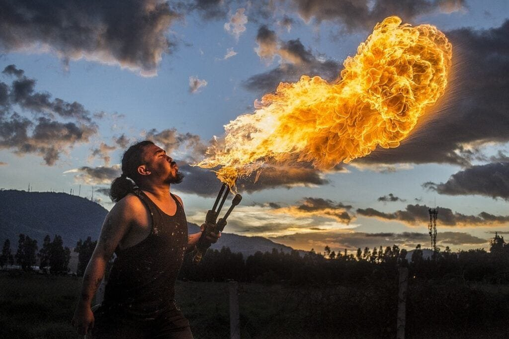

In the world of art and culture, volcanoes have long been a source of inspiration and fascination. From vibrant paintings capturing the raw power and beauty of an eruption to ancient myths and legends surrounding these natural wonders, volcanoes have left an indelible mark on human creativity. They symbolize both destruction and creation, serving as a reminder of the immense forces at work beneath the Earth's surface. Whether it's the use of volcanic materials in sculpture or the incorporation of volcanic themes in literature, volcanoes have played a significant role in shaping artistic expression throughout history. By exploring their influence, we gain a deeper understanding of the interconnectedness between nature, culture, and human imagination.

This image is property of pixabay.com.

## The Symbolism of Volcanoes in Art

Volcanoes have long been a captivating subject for artists, permeating various forms of art and culture throughout history. They hold a deep symbolic meaning, representing power, destruction, and the raw energy of the natural world. Depictions of [volcanoes in ancient art](https://magmamatters.com/geothermal-energy-and-its-volcanic-origins/ "Geothermal Energy and Its Volcanic Origins") provide insights into the beliefs and perceptions of civilizations that lived in close proximity to these majestic forces of nature.

### Depiction of Volcanoes in Ancient Art

In ancient art, volcanoes were often portrayed as awe-inspiring, larger-than-life entities. Ancient civilizations in regions like Mesoamerica and the Mediterranean basin captured the essence of volcanoes through intricate murals, sculptures, and pottery. These depictions often showcased erupting volcanoes with vibrant colors and dramatic shapes, conveying the primal power of these natural phenomena.

Ancient artists saw volcanoes as manifestations of divine power, often tying them to their religious and mythological beliefs. For example, in ancient Roman art, the volcano deity Vulcan was revered as the god of fire and craftsmanship. His forge was believed to be located beneath Mount Etna in Sicily, an active volcano that erupted sporadically. This association between volcanoes and deities reflects the reverence ancient cultures held for these majestic natural wonders.

### Volcanoes as Symbols of Power and Destruction

Volcanoes have also been symbols of power and destruction in art, representing the innate strength and unpredictability of nature. Artists from various periods in history have used volcanoes metaphorically to depict larger themes, such as the overwhelming force of nature, the fleeting nature of life, or the destructive power of human hubris.

In classical literature and art, for instance, the eruption of Mount Vesuvius in 79 AD has been immortalized as a symbol of calamity and destruction. The devastating eruption buried the ancient Roman cities of Pompeii and Herculaneum under layers of ash and pumice, preserving them remarkably well. Artists throughout the centuries have depicted this catastrophic event as a reminder of the fleeting nature of life and the overwhelming power of nature's wrath.

### Volcanoes in Modern and Contemporary Art

Volcanoes continue to inspire artists in modern and contemporary times. Artists draw upon the rich symbolism and powerful visual imagery of volcanoes to explore themes ranging from environmental concerns to personal transformation. Contemporary artists often use photography, paintings, and multimedia installations to portray volcanoes as dynamic forces, capturing the tension between their destructive potential and their captivating beauty.

Some artists, such as Andy Goldsworthy and Olafur Eliasson, employ volcanic materials like ash, pumice, and volcanic rock in their artworks. By incorporating these elements, they create a visceral connection between the artwork and the volcanic forces that shaped them. This integration of volcanic materials adds a tangible dimension, reinforcing the symbolism and power associated with volcanoes in modern art.

## Volcanoes in Literature and Poetry

The symbolism of volcanoes extends beyond visual art, permeating the realms of literature and poetry. Through vivid descriptions and metaphors, volcanic imagery has been employed as a powerful tool to evoke emotions, convey meaning, and explore deep philosophical themes.

### Volcano Themes in Epic Tales and Myths

Epic tales and myths from different cultures often feature volcanoes as integral components of their narrative structures. Volcanic eruptions are portrayed as cataclysmic events that shape the destiny of characters and civilizations. These stories use the imagery of volcanoes to highlight themes such as the clash of opposing forces, the struggle between good and evil, or the existential fragility of human existence.

One notable example is the Greek myth of "Hephaestus and the Volcano." Hephaestus, the god of fire and blacksmithing, was believed to have his forge beneath the volcanic island of Lemnos. The myth portrays Hephaestus' connection with volcanoes as a representation of creation, destruction, and rebirth. This theme resonates deeply with human experiences and the ever-changing cycles of life.

### Volcanoes in Symbolism and Metaphor in Poetry

Poets have long employed volcanic imagery to evoke powerful emotions and explore complex ideas. Volcanoes symbolize a range of emotions, from intense passions to explosive outbursts of anger or desire. The inherent duality of volcanoes, with their potential for destructive eruptions and their role in nurturing fertile soil, becomes a metaphor for the complexities of human existence.

In the famous poem "Kubla Khan" by Samuel Taylor Coleridge, the poet describes a "sunless sea" and "ancestral voices prophesying war" within a sublime landscape dominated by a volcano. The volcano acts as a metaphor for the turmoil and creative power brewing within the poet's imagination. Through these volcanic images, Coleridge captures the transformative and often tumultuous process of artistic creation.

Volcanic imagery in poetry also captures the sublime nature of volcanoes, their ability to evoke a sense of awe and wonder in the face of natural forces beyond human control. Poets use volcanic symbolism to explore themes of existential questioning, mortality, and the capacity of the natural world to both inspire and terrify.

<iframe width="560" height="315" src="https://www.youtube.com/embed/6cu5kQEVnKo" frameborder="0" allow="accelerometer; autoplay; encrypted-media; gyroscope; picture-in-picture" allowfullscreen></iframe>

  

## Volcanoes in Cinema and Animation

The dramatic visual appeal of volcanoes has made them a prominent feature in cinema and animation. Filmmakers and animators leverage the power and spectacle of volcanic eruptions to create thrilling narratives and visually stunning sequences.

### Epic Disaster Movies Featuring Volcanoes

Volcanic eruptions provide a cataclysmic backdrop for epic disaster movies, capturing the attention and imagination of audiences. These films often depict the struggle of individuals or communities to survive in the face of imminent volcanic threats. The explosive power and devastating consequences of volcanic eruptions create high-stakes scenarios, heightening the tension and suspense in these cinematic experiences.

Popular disaster movies like "Dante's Peak" and "Volcano" showcase the destructive potential of volcanoes and the heroic efforts to save lives in the midst of chaos. The volcanic eruptions in these films serve as metaphors for the unpredictability and fragility of human existence, underscoring our vulnerability in the face of nature's forces.

### Animated Movies and Series Depicting Volcanoes

Volcanoes also play a significant role in animated movies and series, captivating audiences of all ages. Through vibrant and imaginative visuals, these animated works bring volcanoes to life, transforming them into characters and settings that children and adults can engage with.

The animated film "Moana" features a lava monster named Te Ka, who guards the heart of the goddess Te Fiti. The volcanic landscape of the film not only serves as a visually stunning backdrop but also represents the transformative power of self-discovery and embracing one's true identity. The animation process allows filmmakers to create fantastical worlds and characters that embody the raw energy and symbolism associated with volcanoes.

## Volcanic Imagery in Music and Dance

The primal energy and dramatic nature of volcanoes have inspired musicians and dancers to incorporate volcanic imagery into their creations. From expressive compositions to captivating dance movements, volcanic references bring an evocative and dynamic element to the performing arts.

### Songs and Compositions Inspired by Volcanic Eruptions

Musicians have drawn inspiration from the awe-inspiring beauty and destructive power of volcanoes, translating them into powerful melodies and compositions. These musical creations capture the emotional intensity and dramatic contrasts associated with volcanic eruptions, from the brooding buildup to explosive climaxes.

One notable example is the classical composition "The Moldau" by Bedřich Smetana. In this piece, the composer depicts the journey of the Vltava River through various landscapes, culminating in a grand crescendo symbolizing the Vltava's merger with the Elbe. This powerful climax is often compared to a volcanic eruption, showcasing the capability of music to evoke imagery and convey a sense of grandeur.

### Traditional Dances Depicting Volcanic Eruptions

In many cultures, traditional dances incorporate volcanic imagery to represent the power and energy associated with eruptions. These dances often involve dynamic movements, evoking the surging and explosive nature of volcanic events. Through rhythmic footwork, swirling costumes, and powerful gestures, dancers embody the forces of nature and engage with the symbolism of volcanoes.

One example is the Balinese Kecak dance, which features a story from the Ramayana epic. In this dance, a group of male dancers chant "cak" in a rhythmic pattern, creating a mesmerizing soundscape. These chants symbolize the volcanic energy and act as a backdrop for the actions of the characters, intensifying the dramatic impact of the performance.

This image is property of pixabay.com.

## Influence of Volcanoes on Architecture and Design

Volcanoes have not only inspired artistic expressions but also influenced architecture and design. From innovative architectural concepts to the use of volcanic materials, the presence of volcanoes is evident in the built environment.

### Volcano-Escape Architecture

Volcanic regions often experience eruptions and volcanic activity, prompting architects and designers to develop concepts that can mitigate the risks and provide safe havens during volcanic events. Volcano-escape architecture focuses on creating structures that can withstand volcanic ashfall, pyroclastic flows, and other hazards associated with eruptions.

In areas like Japan and Iceland, where volcanic activity is prevalent, architects have designed buildings and shelters with reinforced structures, efficient ventilation systems, and emergency evacuation plans. These designs prioritize safety while considering the unique challenges posed by volcanic environments. Volcano-escape architecture serves as a testament to the adaptability and resilience of human beings in the face of natural disasters.

### Volcanic Materials in Design and Decor

The unique properties of volcanic materials have made them a popular choice in architectural design and decor. Volcanic rocks such as basalt and obsidian are known for their durability, strength, and aesthetic appeal. They have been used for centuries in construction, landscaping, and interior design.

In contemporary architecture, volcanic materials are often employed for their visual and textural qualities. Facades, floors, and walls made from volcanic rock provide a striking contrast to more traditional building materials, adding a touch of natural elegance to modern structures. Additionally, volcanic ash has been used in the production of concrete, contributing to the sustainable use of volcanic resources in construction.

## Volcano Worship and Spiritual Beliefs

The immense power and mystery of volcanoes have inspired religious and spiritual beliefs in cultures around the world. Volcanoes are often regarded as sacred sites and worshipped as deities or gateways to the divine.

### Ancient Rituals and Beliefs Surrounding Volcanoes

In many ancient cultures, volcanoes were considered sacred and were the focus of religious ceremonies and rituals. The connection between volcanic activity and the divine was perceived as a manifestation of the gods' power and presence in the world.

In Hawaii, the volcano goddess Pele is highly revered and worshipped through rituals, chants, and offerings. Pele is believed to reside within the active volcanoes of the Hawaiian Islands, and her presence is seen as both creative and destructive. The reverence and rituals surrounding Pele are a testament to the spiritual significance bestowed upon volcanoes by indigenous cultures.

### Modern Spiritual Practices Involving Volcanoes

In contemporary times, some spiritual practices incorporate the energy and symbolism of volcanoes into their beliefs and rituals. The transformative power associated with volcanic eruptions aligns with the concepts of growth, rebirth, and personal transformation in these spiritual traditions.

For example, in the practice of Volcano Meditation, individuals visualize themselves as dormant volcanoes, tapping into their inner strength and potential for change. The meditation process involves harnessing the energy and symbolism of volcanoes to facilitate personal growth and emotional healing, metaphorically erupting into a new version of oneself.

This image is property of pixabay.com.

## Volcanoes in Mythology and Folklore

Volcanoes have occupied prominent roles in the mythologies and folklore of different cultures around the world. Often regarded as deities or homes of deities, volcanoes were believed to possess immense power and influence over human affairs.

### Volcanoes as Deities or Homes of Deities

Many mythologies depict volcanoes as the abodes of gods or spirits. These volcanic deities were believed to control the elements, bestow blessings, or wreak havoc upon the world. The association of volcanoes with divine beings reflects the reverence and fear that ancient [cultures held for these natural phenomena](https://magmamatters.com/the-art-and-science-of-volcano-monitoring/ "The Art and Science of Volcano Monitoring").

In Norse mythology, the volcanic mountain Hekla was believed to be the entrance to the underworld and the realm of the fire giants. Hekla was considered a sacred site and was connected to the god Loki, who brought about chaos and destruction. The portrayal of volcanoes as the dwelling places of powerful beings highlights their symbolic significance as gateways between the mortal and divine realms.

### Folk Tales about Volcanic Eruptions

Folk tales and legends often incorporated volcanic eruptions as central plot points, weaving narratives around the dramatic events surrounding these natural phenomena. These stories sought to explain volcanic activity and its impact on the landscape and human lives.

In Hawaiian folklore, the legend of the volcano goddess Pele recounts her journey from Tahiti to the Hawaiian Islands, where she settled within the active volcanoes. The eruptions of the volcanoes were believed to be a manifestation of Pele's emotions and desires, leading to both destruction and creation. Folk tales like these imbue volcanoes with a sense of mystery and spiritual significance, reflecting the cultural heritage and beliefs of the communities that shared these stories.

## Geographical Influence of Volcanoes on Culture and Society

Volcanoes have a profound influence on the culture and society of the regions in which they are located. The unique challenges and benefits associated with living near active volcanoes have shaped the practices, traditions, and resilience of these communities.

### Cultures Living Near Active Volcanoes and Their Unique Practices

Communities that inhabit regions near active volcanoes develop unique practices and traditions that reflect their close relationship with these powerful natural forces. The constant threat of eruptions and volcanic hazards necessitates adaptive strategies and cultural practices that ensure the safety and well-being of the community.

In regions like Iceland, where volcanic activity is frequent, cultural practices such as "Jólabókaflóð" (Christmas Book Flood) have emerged. During the holiday season, Icelanders exchange books as gifts, a tradition that developed partially due to the isolation caused by volcanic eruptions in the past. This cultural adaptation allowed communities to find solace and entertainment during volcanic events when outdoor activities were limited.

### Community Response and Adaptation to Volcanic Threats

Communities residing near active volcanoes have developed strategies to mitigate the risks posed by volcanic eruptions. These strategies include early warning systems, evacuation plans, and the construction of resilient infrastructures.

For example, in Japan, where numerous active volcanoes dot the landscape, communities have established volcano monitoring networks to detect and monitor volcanic activity. The data collected by these networks allows authorities to issue timely warnings and evacuation orders, ensuring the safety of residents. Additionally, the construction of volcanic hazard maps and the development of [volcano](https://magmamatters.com/understanding-volcanic-formation-a-comprehensive-guide/ "Understanding Volcanic Formation: A Comprehensive Guide") education programs help communities understand the risks they face and prepare for potential eruptions.

These community responses and adaptations demonstrate the resilience and resourcefulness of societies living near active volcanoes, underlining the ongoing interaction between culture and the natural world.

## Scientific Influence of Volcanoes in Culture

Scientific studies and research on volcanoes have contributed to a deeper understanding of society and culture. Volcanology, the study of volcanoes, provides insights into the geological, ecological, and social impacts of volcanic activity, thus informing decision-making and shaping cultural responses.

### The Role of Volcanology in Understanding Society and Culture

Volcanology has played a vital role in unraveling the interactions between volcanic activity and human society. Scientists have examined past eruptions, probed the geological history of volcanic regions, and analyzed the social and cultural responses to volcanic hazards.

Studies in volcanology have shed light on the ways in which volcanic eruptions have shaped human settlements, influenced migration patterns, and even influenced the rise and fall of civilizations. By understanding the societal impact of volcanic activity, scientists and researchers can provide valuable insights that inform policies, urban planning, and disaster management strategies.

### Public Reception and Understanding of Volcanic Science

Volcanology also influences public perception and understanding of volcanic science. Through educational outreach programs, museums, and public lectures, volcanologists seek to communicate the significance of their research to the wider community. By disseminating knowledge about volcanoes, scientists foster an appreciation for the geological and cultural heritage associated with volcanic regions.

Public awareness of volcanic science enhances preparedness and resilience, enabling communities to respond effectively to volcanic hazards. Understanding the scientific processes involved in eruptions helps dispel myths and misconceptions, fostering a more informed and culturally aware approach to living near volcanoes.

## Economic and Environmental Influence of Volcanoes on Culture

Volcanoes have a significant economic and environmental impact on culture and society. From the fertility of volcanic soil to the opportunities for tourism, volcanoes shape livelihoods, influence agricultural practices, and contribute to local economies.

### Volcanic Soil and Its Impact on Agriculture and Lifestyle

Volcanic soil, often referred to as "volcanic ash" or "tephra," is rich in minerals and organic matter, making it highly fertile. The volcanic ash emitted during eruptions settles on surrounding areas, replenishing the soil with essential nutrients. Communities living near volcanoes harness this fertility to cultivate crops and sustain agriculture-based livelihoods.

Regions like the volcanic island of Java in Indonesia and the Azores in Portugal are renowned for their fertile volcanic soil, enabling the cultivation of a variety of crops. The unique characteristics of volcanic soil not only support local economies but also influence the culinary traditions and cultural practices of these communities.

### Tourism and Commercial Exploitation of Volcanoes and Their Effects on Local Cultures

Volcanoes have immense tourism potential, attracting visitors from around the world who seek to witness their awe-inspiring beauty and experience their cultural significance. Tourism centered around volcanoes influences local cultures and economies, creating opportunities for economic growth while also presenting challenges.

Volcano tourism contributes to the diversification of local economies, providing employment opportunities and boosting local businesses. However, commercial exploitation of volcanoes must be carefully managed to ensure the preservation of cultural heritage and the protection of fragile ecosystems. Responsible tourism practices that prioritize environmental conservation, respect for local cultures, and community involvement are essential for sustainable development in volcanic regions.

In conclusion, volcanoes hold a powerful symbolic and cultural significance that transcends different art forms, literature, cinema, music, architecture, spirituality, and folklore. They are not merely geological phenomena but sources of inspiration, reflection, and resilience for humankind. The influence of volcanoes in art and culture speaks to our deep connection with the natural world and our continued efforts to understand and coexist with these magnificent forces of nature.

