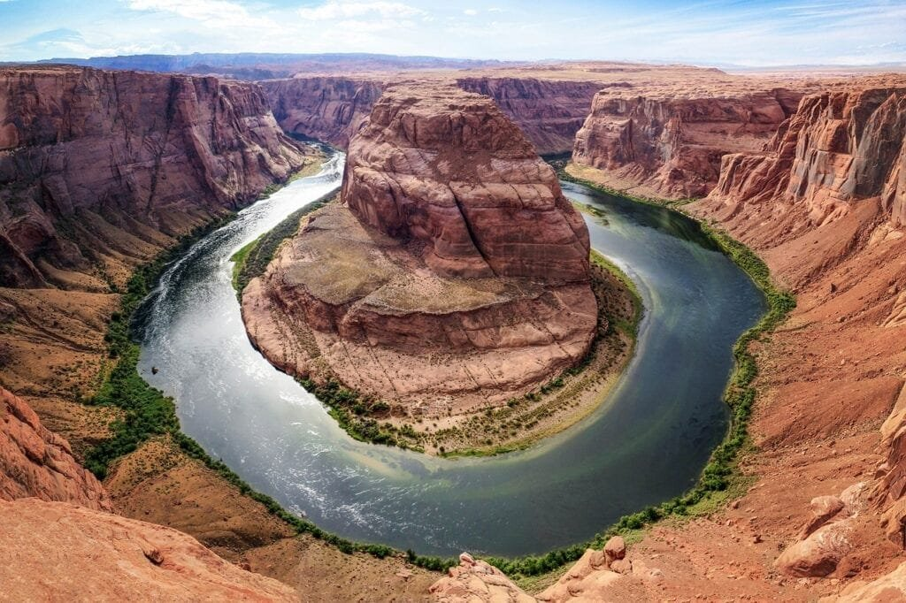

In this article, we will explore the fascinating interaction between volcanoes and crustal plate movements. Volcanoes, which are formed by the escape of molten rock and debris from the earth's surface, can occur at plate boundaries, hotspots, or rift zones. By understanding the different types of volcanoes, their distribution, eruption causes, hazards, and benefits, we can gain valuable insights into how they interact with crustal plate movements. This knowledge not only helps us predict future volcanic activity but also allows us to mitigate risks to the surrounding communities. So, let's dive into the captivating world of volcanoes and uncover the intricate relationship they share with crustal plate movements.

This image is property of pixabay.com.

## Fundamental Concepts of Earth's Tectonic Plate Movements

### Understanding the concept of tectonic plates

Tectonic plates are massive pieces of Earth's lithosphere that fit together like a jigsaw puzzle, covering the surface of the planet. These plates are constantly moving, either colliding, sliding past each other, or moving apart, causing various geological phenomena. The concept of tectonic plates is crucial in understanding the dynamics of the Earth's surface and the processes that shape our planet.

### Outlining the process of plate tectonic movement

Plate tectonic movement is driven by convection currents in the Earth's mantle. These currents create a circular motion that pushes the tectonic plates. There are three main types of plate boundaries where movement occurs: convergent, divergent, and transform boundaries.

Convergent boundaries are formed when two plates collide. Depending on the type of plates involved, different processes take place, such as subduction, where one plate slides beneath another, or continental collision, where two plates with continental crust collide and uplifts occur.

Divergent boundaries occur when two plates move away from each other, creating a gap where magma rises to form new crust. This process is called seafloor spreading and is responsible for the formation of mid-ocean ridges.

Transform boundaries are formed when two plates slide past each other horizontally. These boundaries are characterized by intense shear stress, which can result in earthquakes.

### Different types of plate boundaries: convergent, divergent, and transform

Convergent boundaries can be further classified into three types based on the types of plates involved. Oceanic-oceanic convergent boundaries occur when two oceanic plates converge, leading to the formation of volcanic island arcs. Examples of such boundaries include the Aleutian Islands and the Mariana Islands.

Oceanic-continental convergent boundaries occur when an oceanic plate subducts beneath a continental plate. This process leads to the formation of volcanic mountain ranges, like the Andes in South America and the Cascades in North America.

Continental-continental convergent boundaries occur when two continental plates collide. Due to the low density of continental crust, subduction does not occur, and instead, the crust crumples and uplifts, forming large mountain ranges. Examples of such boundaries include the Himalayas and the Alps.

Divergent boundaries are responsible for the formation of mid-ocean ridges and rift valleys. Mid-ocean ridges can be found in the Atlantic Ocean and the East Pacific Rise. Rift valleys, such as the East African Rift Valley, are formed when continental plates move apart.

Transform boundaries are characterized by intense seismic activity and the absence of volcanic activity. The San Andreas Fault in California is an example of a transform boundary.

Understanding these different types of plate boundaries is crucial in comprehending the complex relationship between tectonic plate movements and volcanic activity.

## Essential Properties of Volcanoes

### Understanding the composition and structure of a volcano

Volcanoes are geological formations created by the extrusion of molten rock, gases, and debris onto the Earth's surface. They are composed of various layers, each with its unique properties. The main components of a volcano are the magma chamber, the conduit, and the vent.

The magma chamber is a reservoir located deep within the Earth's crust, where molten rock, known as magma, accumulates. As pressure builds up, the magma seeks a path of least resistance, leading to the formation of a conduit. The conduit is a vertical channel through which magma travels to the surface during an eruption. Finally, the vent is the opening at the top of the volcano, where the magma, gases, and debris are expelled.

### Volcano formation

Volcanoes form through different processes, depending on their location and the type of plate boundary involved. At subduction zones, where one tectonic plate is forced beneath another, magma is produced due to the melting of the subducting plate. This magma rises through the overriding plate, leading to the formation of volcanoes. This type of volcanism is common in areas such as the Pacific Ring of Fire.

Hotspots, on the other hand, are areas of intense volcanic activity that occur away from plate boundaries. These hotspots are believed to be caused by plumes of hot mantle material that rise to the surface. As the tectonic plates move over the stationary hotspot, a chain of volcanoes is formed. The Hawaiian Islands are a prime example of hotspot volcanism.

### Different types of volcanoes: stratovolcanoes, shield volcanoes, lava domes, cinder cones

Volcanoes can be classified into different types based on their shape and eruptive characteristics. Stratovolcanoes, also known as composite volcanoes, are tall and conical in shape. They are composed of alternating layers of lava, ash, and pyroclastic material. Examples of stratovolcanoes include Mount Fuji in Japan and Mount St. Helens in the United States.

Shield volcanoes, on the other hand, have a broad, gently sloping profile. They are formed by the accumulation of low-viscosity lava, which spreads out in all directions. Shield volcanoes can reach enormous sizes, with Mauna Loa in Hawaii being one of the largest examples.

Lava domes are smaller, dome-shaped volcanoes. They are formed when thick, viscous lava accumulates around the vent, creating a bulbous structure. Lava domes are often associated with explosive eruptions due to the buildup of pressure. The Soufrière Hills volcano in Montserrat is a well-known example of a lava dome volcano.

[Cinder cones](https://magmamatters.com/the-birth-of-new-land-understanding-cinder-cones/) are the simplest and smallest type of volcano. They are formed when lava is ejected into the air and solidifies before reaching the ground, creating a cone-shaped hill. Cinder cones are often found on the flanks of larger volcanoes and can be associated with explosive eruptions.

### The role of magma viscosity in volcano types

The viscosity of magma plays a crucial role in determining the type of volcano that forms during an eruption. Viscosity refers to a material's resistance to flow. Magma with high viscosity is thick and sticky, making it difficult for gas bubbles to escape, resulting in explosive eruptions. This type of magma is often associated with stratovolcanoes and lava domes.

On the other hand, magma with low viscosity is runny, allowing gas bubbles to escape easily, resulting in less explosive eruptions. This type of magma is associated with shield volcanoes, as it spreads out in thin, broad flows. The viscosity of magma is influenced by its composition, temperature, and the presence of dissolved gases.

Understanding the relationship between different types of volcanoes and the viscosity of magma helps scientists predict the eruptive behavior and potential hazards associated with volcanic activity.

This image is property of pixabay.com.

## The Relationship between Tectonic Plate Movements and Volcanoes

### The role of plate tectonics in volcano formation

The interaction between tectonic plate movements and volcanic activity is fundamental to the formation and distribution of volcanoes. At convergent plate boundaries, where plates collide or subduct, the melting of crustal material generates magma, leading to the formation of volcanic arcs. This process explains the presence of many of the world's most well-known volcanoes, such as Mount Vesuvius in Italy and Mount Rainier in the United States.

### Explanation of hotspot volcanoes and their relationship with tectonic plate movement

Hotspot volcanoes are a unique type of volcanic activity that occurs away from plate boundaries. They are believed to result from a localized heat source, or "hotspot," in the Earth's mantle. As the tectonic plates move over these hotspots, volcanic activity is triggered, leading to the formation of volcanic chains, such as the Hawaiian Islands.

The exact mechanism behind hotspot volcanism is still debated among scientists, but it is generally agreed upon that the heat source is distinct from the tectonic plate movements present at divergent or convergent boundaries. Hotspot volcanoes provide valuable insights into the dynamic nature of Earth's mantle and the complex relationship between plate tectonics and volcanism.

### How subduction zones and divergent boundaries influence volcano distribution

Subduction zones and divergent boundaries play significant roles in the distribution of volcanoes around the world. Subduction zones, where an oceanic plate is forced beneath another plate, are associated with the formation of volcanic arcs. These arcs can stretch thousands of kilometers and are home to some of the most active and explosive volcanoes on Earth.

Divergent boundaries, on the other hand, are responsible for the formation of mid-ocean ridges and rift valleys. Along these boundaries, magma rises to the surface, creating new crust and resulting in volcanic activity. This type of volcanic activity is generally less explosive and more focused on the formation of new crust.

By understanding the influence of subduction zones and divergent boundaries on volcano distribution, scientists can gain valuable insights into the geologic processes occurring beneath our feet and better predict potential volcanic hazards.

## Volcano Eruptions and Crustal Plate Movements

### Volcano eruption triggers

Volcano eruptions are triggered by a combination of factors, including the movement of tectonic plates, the composition and viscosity of the magma, and the buildup of pressure within the volcano's plumbing system. The tectonic environment in which a volcano is located plays a significant role in determining the type and frequency of eruptions.

Volcanoes at convergent plate boundaries often experience explosive eruptions due to the high viscosity of the magma and the presence of volatile gases. The collision or subduction of tectonic plates can cause the release of trapped volatiles, resulting in powerful eruptions accompanied by ash clouds, pyroclastic flows, and lahars.

In contrast, volcanoes at divergent plate boundaries typically experience less explosive eruptions. The lower viscosity of the magma allows gases to escape more easily, reducing the potential for pressure buildup and explosive eruptions. Instead, these volcanoes tend to produce effusive eruptions, characterized by the relatively gentle flow of lava.

### The role of plate movements in volcanic eruptions

Plate movements play a crucial role in volcanic eruptions. At convergent plate boundaries, where two plates collide or subduct, the movement and interaction of these plates can cause the uplift and deformation of the Earth's crust. This uplift creates pathways for magma to rise through the crust, leading to volcanic eruptions.

The rate and direction of plate movements also affect the frequency and intensity of volcanic eruptions. Rapid plate movements can result in more frequent eruptions, as the tectonic forces generate additional heat and pressure, facilitating magma ascent. Slower plate movements, on the other hand, may result in longer intervals between eruptions and less intense volcanic activity.

### Eruption patterns due to different plate boundaries

Different types of plate boundaries exhibit distinct eruption patterns. At convergent plate boundaries, where subduction occurs, explosive eruptions are common due to the high viscosity of the magma and the presence of volatiles. These eruptions can produce devastating pyroclastic flows, lahars, and ash clouds.

Divergent plate boundaries, by contrast, are associated with more effusive eruptions. The low viscosity of the magma allows it to flow more freely, resulting in gentle lava flows that can extend over large areas. These eruptions are typically less explosive and pose less immediate danger to surrounding communities.

Transform boundaries, characterized by horizontal plate movements, do not usually exhibit volcanic activity. However, in rare cases, volcanic activity can occur along transform faults, leading to localized eruptions.

Understanding the eruption patterns associated with different plate boundaries is crucial in assessing volcanic hazards and developing effective hazard mitigation strategies.

This image is property of pixabay.com.

## Geographic Distribution of Volcanoes and Its Relation with Crustal Plates

### Notable volcanic regions

Volcanoes are not evenly distributed across the Earth's surface but are concentrated in specific regions. Some of the most notable volcanic regions include:

- The Pacific Ring of Fire: This region stretches along the rim of the Pacific Ocean and is one of the most seismically and volcanically active areas on Earth. It is home to numerous convergent plate boundaries and is characterized by the presence of volcanic arcs, such as the Andes, Cascades, and the Kamchatka Peninsula.
    
- The Mediterranean: This region hosts several volcanic systems, including Mount Vesuvius and Mount Etna. These volcanoes are associated with the convergence of the African and Eurasian plates, with subduction occurring beneath the Italian Peninsula.
    
- The East African Rift Valley: This region is marked by a series of interconnected rift valleys and volcanic mountains. The volcanic activity in this area is associated with the divergence of the African tectonic plate, which is slowly splitting apart.
    

### The Pacific 'Ring of Fire'

The Pacific Ring of Fire is a vast region encircling the Pacific Ocean and extending through several continents, including the Americas, Asia, and Oceania. This region is characterized by high tectonic activity, including volcanic eruptions, earthquakes, and the presence of subduction zones.

The Pacific Ring of Fire is home to the majority of the world's active volcanoes. It owes its volcanic activity to the convergence of several tectonic plates. The subduction of oceanic plates beneath continental plates or other oceanic plates creates ideal conditions for volcanic activity.

Countries situated along the Pacific Ring of Fire, such as Japan, Indonesia, and Chile, often experience frequent volcanic eruptions and seismic events. This region serves as a prominent example of the close relationship between tectonic plate movements and volcanic activity.

### Hotspot volcanoes

Hotspot volcanoes are another significant volcanic feature, often occurring in isolation from plate boundaries. These volcanoes are associated with plumes of hot mantle material that rise from deep within the Earth. As the tectonic plates move over these hotspots, volcanic activity is triggered.

Notable examples of hotspot volcanoes include the Hawaiian Islands, located in the middle of the Pacific Plate, and the Yellowstone Caldera in the United States. These volcanic systems provide valuable insights into the origin and behavior of hotspot volcanism and the underlying mantle processes driving volcanic activity.

### Different volcano types and their distribution relative to plate boundaries

Different types of volcanoes exhibit distinct distribution patterns relative to plate boundaries. Stratovolcanoes, characterized by explosive eruptions, are commonly found near subduction zones, where one plate slides beneath another. These volcanoes form volcanic arcs parallel to the plate boundary and can be seen in locations such as the Ring of Fire.

Shield volcanoes, associated with effusive eruptions, are often found along divergent boundaries and hotspots. They form volcanic islands, like those in Hawaii, or expansive plateau regions, such as the Deccan Traps in India. The low viscosity of the lava allows shield volcanoes to spread out over large areas.

Lava domes and cinder cones, which can be associated with both effusive and explosive eruptions, can occur in various tectonic settings. Lava domes are often found at subduction zones, while cinder cones can be formed near other volcanoes or along rift zones.

Understanding the distribution of different volcano types relative to plate boundaries is essential in assessing the potential hazards and risks associated with volcanic activity in specific regions.

## Effects of Volcanoes on Tectonic Plate Movements

### Examining how volcanoes influence plate tectonic activities

While tectonic plate movements are the primary drivers of volcanic activity, volcanoes, in turn, can influence plate movements through various mechanisms. The weight of volcanic materials, such as lava and ash, can exert pressure on the lithosphere, affecting its behavior.

Volcanic uplift, caused by the accumulation of magma beneath the Earth's surface, can cause the surrounding crust to rise. This uplift can create stresses and strains within the lithosphere, potentially influencing nearby fault zones and plate boundaries. The buildup of pressure can also trigger seismic activity, leading to earthquakes.

Additionally, volcanic eruptions can cause subsidence, or the sinking of the Earth's surface, as magma is expelled from beneath the crust. Subsidence can affect the stability of the lithosphere, potentially influencing plate movements in the vicinity of volcanic regions.

While the exact extent of volcanoes' influence on plate tectonic activities is still an area of ongoing research, it is clear that these interrelationships contribute to Earth's ever-changing geologic landscape.

### Interaction between volcanic activity and plate boundaries

Volcanic activity often occurs at or near plate boundaries, where tectonic forces generate the necessary conditions for magma ascent. Volcanic eruptions can affect the behavior of plate boundaries in several ways.

In subduction zones, where one tectonic plate is forced beneath another, volcanic activity can influence the subduction process. The accumulation of volcanic materials, including lava and ash, can increase friction between the plates, potentially affecting the rate of subduction. Additionally, the release of volatiles during eruptions can alter the pressure and temperature conditions within the subduction zone, influencing the melting and generation of magma.

At divergent boundaries, volcanic activity plays a crucial role in the formation of new crust. As magma rises to the surface, it cools and solidifies, contributing to the growth of the lithosphere. This continuous process of magma injection and solidification plays a vital role in the widening of the ocean basins and the creation of new seafloor.

The interaction between volcanic activity and plate boundaries is a complex process influenced by various geologic factors. Understanding this interaction is essential in deciphering the underlying forces that shape Earth's crust and the mechanisms driving tectonic plate movements.

### Cases showcasing the effects of volcanic activities on tectonic plates

The effects of volcanic activities on tectonic plates can be observed in various regions around the world. One notable example is the eruption of Mount Pinatubo in the Philippines in 1991. The eruption, which released billions of tons of volcanic material into the atmosphere, caused the ground around the volcano to subside significantly.

This subsidence affected nearby fault systems, including the Zambales Ophiolite Complex, which is part of the plate boundary between the Philippine Sea Plate and the Eurasian Plate. The subsidence caused by the eruption influenced the behavior of these faults, potentially affecting their ability to accommodate tectonic stresses and strain in the region.

Another example is the eruption of Eyjafjallajökull in Iceland in 2010. The eruption caused widespread disruption to air travel due to the release of volcanic ash into the atmosphere. This event highlighted the potential global impacts of volcanic eruptions on air traffic and the economy.

These cases, among many others, demonstrate the significant effects that volcanic activities can have on tectonic plates and the geologic processes occurring at plate boundaries.

## Volcanic Hazards and Benefits Influenced by Tectonic Plate Movements

### Types of volcanic hazards: Ash clouds, lahars, pyroclastic flows

Volcanoes pose various hazards that can have devastating consequences for surrounding communities and the environment. Some of the most common volcanic hazards include:

- Ash clouds: Volcanic eruptions can release massive amounts of ash particles into the atmosphere. These ash clouds can pose risks to human health, as inhaling ash can cause respiratory problems. Ash clouds can also disrupt air travel, as the tiny particles can damage aircraft engines and reduce visibility.
    
- Lahars: Lahars are fast-moving mudflows or debris flows that occur when volcanic ash mixes with water. Heavy rainfall or the melting of ice and snow on the volcano can trigger lahars. These flows can cause significant damage to infrastructure, including bridges and buildings, and can pose a threat to human life.
    
- Pyroclastic flows: Pyroclastic flows are extremely hot, fast-moving mixtures of gas, ash, and volcanic material. They travel down the slopes of the volcano at high speeds, destroying everything in their path. [Pyroclastic flows are one of the most deadly volcanic hazards](https://magmamatters.com/the-environmental-impact-of-volcanic-eruptions-2/ "The Environmental Impact of Volcanic Eruptions"), and they can cause severe burns and asphyxiation.
    

These volcanic hazards, among others, highlight the importance of understanding the relationship between tectonic plate movements and volcanic activity. By studying these interactions, scientists can better predict when and where volcanic hazards are likely to occur, allowing for effective risk mitigation strategies.

### The impact of plate movements on the occurrence of these hazards

Plate movements play a significant role in the occurrence and severity of volcanic hazards. At convergent plate boundaries, where subduction occurs, explosive eruptions are more common, resulting in the release of large amounts of volcanic ash. The movement and collision of plates at these boundaries can generate intense seismic activity and trigger devastating pyroclastic flows and lahars.

Divergent plate boundaries, by contrast, are associated with less explosive eruptions and the formation of more effusive lava flows. While these types of eruptions may be less immediately hazardous to human life, they can still pose risks to local communities, damaging infrastructure and agricultural lands.

The impact of plate movements on volcanic hazards is further influenced by factors such as the local topography, the viscosity of the magma, and the presence of volatile gases. Understanding these complex interactions is essential in assessing and mitigating the risks associated with volcanic activity.

### Volcanic benefits and their relationship with tectonic plates

Despite the hazards they pose, volcanoes also provide several benefits influenced by tectonic plate movements. Volcanic activity contributes to the formation of fertile soils, making volcanic regions ideal for agriculture. Volcanic soils are rich in minerals and contribute to high agricultural productivity.

Volcanic eruptions also release significant amounts of gases, including carbon dioxide, sulfur dioxide, and water vapor, into the atmosphere. While excessive release of these gases can have negative environmental impacts, in moderate amounts, they can contribute to the global carbon cycle, atmospheric chemistry, and climate regulation.

Furthermore, volcanic eruptions can contribute to the formation of new landforms and the creation of unique geological features. Volcanic islands, such as those in Hawaii, are formed through successive volcanic activity, creating diverse ecosystems and attracting tourists, benefiting local economies.

Understanding the relationship between tectonic plate movements and the benefits associated with volcanic activity provides valuable insights into the complex interplay of geologic processes that shape our planet.

## Studying and Predicting Volcanic Activity through Crustal Plate Movements

### Utilization of tectonic plate data for volcanic prediction

Tectonic plate data plays a crucial role in studying and predicting volcanic activity. By monitoring the movement and behavior of tectonic plates, scientists can identify areas of increased volcanic hazard and develop early warning systems.

Monitoring techniques, such as Global Positioning System (GPS) measurements and satellite-based interferometry, can detect subtle crustal movements associated with magma migration and volcano inflation. By analyzing these data, scientists can track the development of volcanic unrest and assess the potential for an eruption.

Additionally, seismic monitoring networks provide crucial information about the underground activity associated with volcanic systems. Seismic instruments record the energy released during earthquakes and volcanic tremors, offering insights into magma movement and the pressure changes within volcanic plumbing systems.

### Successes and limitations of predictive measures

Predicting volcanic eruptions with precision remains a challenge, as volcanic systems are complex and dynamic. However, significant progress has been made in recent years, leading to successful volcano monitoring and eruption forecasting in many cases.

One notable success story is the eruption of Mount Pinatubo in 1991. Scientists, using a combination of seismic monitoring, ground deformation measurements, and gas analyses, accurately predicted the eruption and were able to evacuate thousands of people, mitigating potential loss of life.

However, there are still limitations to current predictive measures. Volcanic eruptions can be unpredictable, and there are instances where eruptions occur with little to no warning. The diverse nature of volcanic systems and the variability in eruptive behavior make it challenging to develop universal models for eruption prediction.

Despite these limitations, ongoing advancements in volcano monitoring techniques and the integration of multiple data sources offer hope for further improvements in eruption forecasting and increased preparedness for volcanic hazards.

### Techniques used in monitoring volcanic activities and crust movements

Monitoring volcanic activities and crust movements requires a combination of diverse techniques and instruments. Some of the commonly used methods include:

- Seismic monitoring: Seismic instruments record the energy released during earthquakes and volcanic tremors. These instruments can detect underground activity associated with magma movement, providing valuable information for volcano monitoring.
    
- Ground deformation measurements: Techniques such as GPS and satellite-based interferometry can detect subtle changes in ground elevation and movements. These measurements help scientists track magma migration and volcano inflation, providing insights into volcanic unrest.
    
- Gas analyses: Analyzing the composition and flux of gases emitted by volcanoes can offer valuable information about volcanic activity. Changes in gas composition and flux can indicate the presence of a magma source and potential eruption.
    
- Thermal monitoring: Thermal cameras and satellite-based thermal sensors can detect changes in volcanic heat output. These measurements are particularly useful for identifying areas of increased volcanic activity and potential eruptions.
    
- Geochemical analyses: Sampling and analyzing volcanic rocks and gases can provide insights into the magmatic processes occurring beneath the surface. Geochemical data help scientists understand the source and evolution of magma, aiding in eruption prediction.
    

By utilizing these and other monitoring techniques, scientists can develop a comprehensive understanding of volcanic activity and crustal plate movements, leading to improved volcano monitoring and eruption forecasting.

## Role of Seismology in Understanding Volcano and Crust Interaction

### The study of seismic waves in relation to volcanoes and crust movement

Seismology is the study of seismic waves that propagate through the Earth. Seismic waves are generated by various sources, including volcanic activity and plate movements. By analyzing these waves, scientists can gain insights into the interaction between volcanoes and crustal movements.

Seismic waves allow scientists to detect and locate underground earthquakes, volcanic tremors, and magma migration. The analysis of these waves provides information about the depth, magnitude, and frequency of these events, offering valuable data for volcano monitoring.

Additionally, seismic waves can reveal the properties of the subsurface, such as the elasticity and density of rocks. This information helps scientists understand the structure and composition of the Earth's crust, aiding in the interpretation of volcanic processes.

### Seismic activities associated with different types of volcanoes

Different [types of volcanoes exhibit distinct seismic activities](https://magmamatters.com/understanding-volcanic-formation-a-comprehensive-guide/ "Understanding Volcanic Formation: A Comprehensive Guide"). Explosive eruptions, typically associated with stratovolcanoes, are often preceded by [increased seismic activity](https://magmamatters.com/the-art-and-science-of-volcano-monitoring/ "The Art and Science of Volcano Monitoring"). This increase in seismicity is caused by the movement of magma beneath the volcano and the fracturing of rocks due to the buildup of pressure.

Effusive eruptions, commonly associated with shield volcanoes, are characterized by less intense seismic activity. The lava flows from effusive eruptions are often gentle and do not generate significant pressure within the volcano's plumbing system, resulting in fewer seismic events.

Seismic activity associated with volcanic systems can also manifest as continuous volcanic tremors. These tremors are caused by the movement of fluids, such as magma or volcanic gases, within the volcano. By analyzing the frequency and magnitude of volcanic tremors, scientists can gain insights into the dynamics of volcanic plumbing systems.

### How seismic studies aid in predicting volcanic activity

Seismic studies play a critical role in predicting volcanic activity. By analyzing seismic data, scientists can identify precursory signals, such as increased seismicity or changes in volcanic tremor patterns, that indicate the likelihood of an eruption.

Changes in the characteristics of seismic waves, such as their amplitude and frequency, can provide information about the movement and migration of magma beneath a volcano. These changes can help scientists assess the potential for increased volcanic activity and eruption.

Seismic monitoring also allows scientists to track the propagation of seismic waves, enabling them to locate the source of volcanic activity accurately. This information is crucial for developing hazard maps and determining areas at risk from volcanic hazards.

While seismic studies provide valuable insights into volcanic activity, they are just one piece of the puzzle. Integrating seismic data with other monitoring techniques, such as ground deformation measurements and gas analyses, is crucial for a comprehensive understanding of volcanic behavior and accurate eruption prediction.

## Future Research Directions on the Interaction between Volcanoes and Crustal Plate Movements

### Potential areas for further exploration and study

The interaction between volcanoes and crustal plate movements continues to be an active area of research, with several potential areas for further exploration and study.

One aspect that requires further investigation is the role of deep mantle plumes in hotspot volcanism. Understanding the origin and behavior of these plumes and their [interaction with tectonic plate movements](https://magmamatters.com/geothermal-energy-and-its-volcanic-origins/ "Geothermal Energy and Its Volcanic Origins") can provide valuable insights into the driving forces behind hotspot volcanism and the associated volcanic chains.

The behavior of volcanic systems during periods of quiescence, or when volcanoes are not erupting, is another area of interest. The study of dormant or extinct volcanoes can help scientists understand the long-term evolution of volcanic regions and better predict future volcanic activity.

Additionally, the integration of various monitoring techniques and the development of advanced data analysis methodologies offer exciting avenues for future research. By combining data from multiple sources, scientists can gain a more comprehensive understanding of volcanic systems and their relationship with crustal plate movements.

### Implications for disaster management and risk mitigation

Enhanced understanding of the interaction between volcanoes and crustal plate movements has significant implications for disaster management and risk mitigation. By accurately predicting volcanic eruptions, communities in volcanic regions can be better prepared to respond to potential hazards.

Improved eruption forecasting can facilitate the timely evacuation of at-risk populations, reducing the potential loss of life and property. Early warning systems, based on robust scientific data, can provide the necessary information for effective emergency planning and response.

Furthermore, studying the long-term behavior of volcanic systems can help establish hazard maps and guidelines for land use planning in volcanic regions. By considering the potential risks associated with volcanic activity, communities can implement measures to minimize exposure to hazards and reduce vulnerabilities.

### How increased understanding of volcano-plate interaction can aid civilization

Increased understanding of the interaction between volcanoes and crustal plate movements can provide valuable insights into the dynamic nature of our planet. This knowledge can aid civilization in several ways.

Firstly, understanding the complex processes driving volcanic activity can help predict future eruptions and mitigate the associated risks. By implementing effective monitoring systems and using reliable predictive models, communities can better prepare for volcanic hazards and protect lives and infrastructure.

Secondly, the study of volcanic systems can contribute to our understanding of Earth's geologic history and the evolution of our planet. By examining volcanic rocks and studying the past eruptions preserved within them, scientists can reconstruct past environmental conditions and gain insights into the long-term behavior of Earth's crust.

Lastly, volcanoes provide various resources that can benefit society. Geothermal energy, harnessed from the heat stored beneath volcanic regions, is a sustainable energy source that can contribute to reducing greenhouse gas emissions. Volcanic soils, rich in minerals and nutrients, can support agricultural productivity, providing vital resources for food production.

By increasing our knowledge of how volcanoes interact with crustal plate movements, we can unlock the potential benefits they offer while minimizing the risks they pose. This understanding can contribute to the sustainable development and well-being of humanity.

