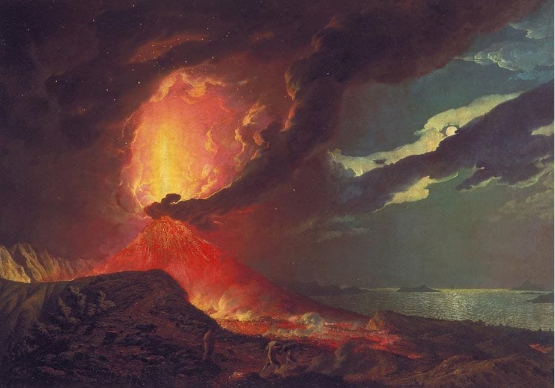
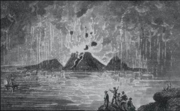
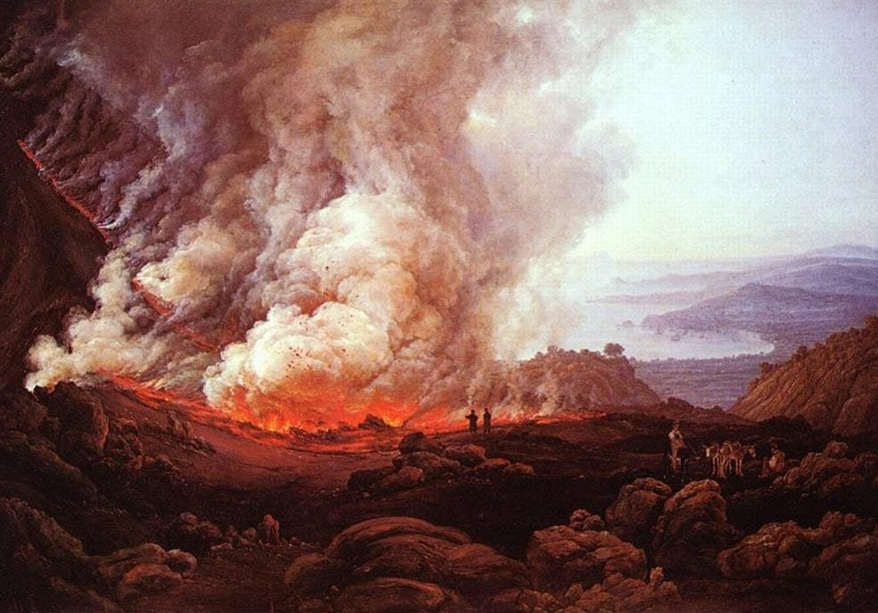
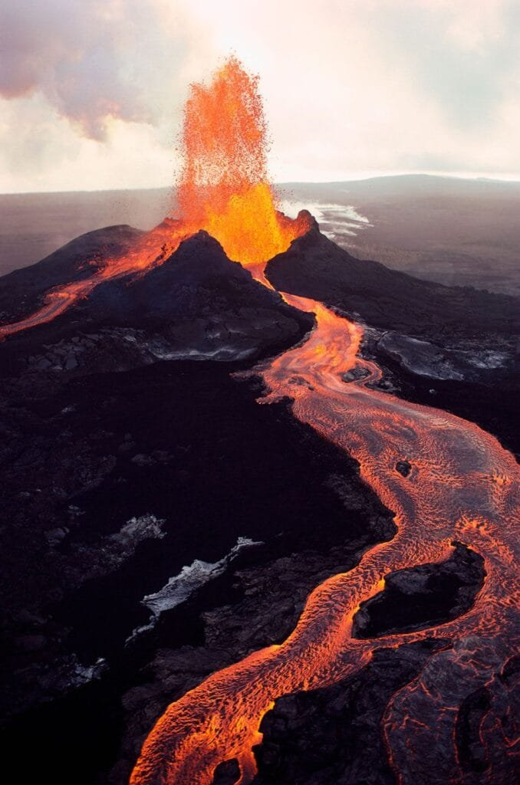
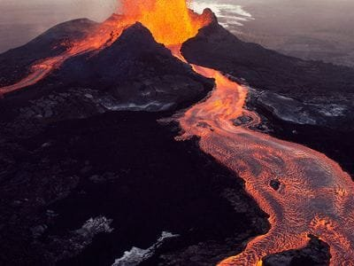

In "The Mythological Origins of Volcanic Activity," this article explores the fascinating relationship between mythology and the powerful forces behind volcanic eruptions. Volcanoes, formed by the escape of molten rock, gases, and debris, have long captivated human imagination. This article delves into the belief systems of different cultures and their interpretations of volcanic activity. From the wrath of ancient gods to the fiery underworld, these mythological stories provide unique insights into our understanding of these explosive natural phenomena. So, join us on a journey through time and mythology as we uncover the ten best mythological interpretations of volcanic activity.

This image is property of www.ancient-origins.net.

## The Greek Mythology of Volcanic Activity

### Hephaestus: The Greek God of Fire and Volcanoes

In Greek mythology, Hephaestus was the god of fire, blacksmiths, and volcanoes. He was the son of Zeus and Hera and was known for his exceptional craftsmanship. Hephaestus was often depicted as a skilled blacksmith working in his forge, creating various weapons and armor for the gods.

It is said that Hephaestus had his own workshop underneath Mount Etna, a volcanic mountain in Sicily. This connection between the god and the [volcano symbolized the power and destructive nature of volcanic](https://magmamatters.com/geothermal-energy-and-its-volcanic-origins/ "Geothermal Energy and Its Volcanic Origins") activity. The ancient Greeks believed that the eruptions of Mount Etna were the result of Hephaestus working tirelessly in his forge.

### The myth of Typhon and Zeus

Another significant myth in Greek mythology involving volcanic activity is the battle between Typhon and Zeus. Typhon was a monstrous creature, born from the union of Gaia (the Earth) and Tartarus (the Underworld). He was so powerful and destructive that even the gods feared him.

In their battle against Typhon, Zeus unleashed his thunderbolts and threw them at the monstrous creature. Typhon, in his rage, retaliated by throwing fiery rocks and molten lava at Zeus. This epic clash between the two resulted in massive volcanic eruptions, shaping the landscape and causing devastation.

The myth of Typhon and Zeus provides an explanation for the volcanic activity seen in Greece and other regions. The ancient Greeks believed that these eruptions were the result of divine conflict and the release of volcanic fury.

### Interpretation of Volcanic Eruptions in Ancient Greece

In ancient Greece, volcanic eruptions were seen as events directly linked to the gods and their divine power. The Greeks believed that the gods used volcanoes as a means to communicate with mortals or to punish those who angered them.

The eruptions were often seen as a sign of divine intervention or a manifestation of the gods' anger. People would offer sacrifices and prayers to appease the gods and seek protection from the destructive forces of volcanoes.

Volcanic eruptions were also associated with various myths and legends in ancient Greece. For example, the eruption of Mount Vesuvius in 79 AD, which buried the cities of Pompeii and Herculaneum, was believed to be the result of the wrath of the god Vulcan (Hephaestus).

The Greek mythology surrounding volcanic activity provided people with a framework to understand and interpret these [natural phenomena](https://magmamatters.com/the-art-and-science-of-volcano-monitoring/ "The Art and Science of Volcano Monitoring"). It helped them make sense of the catastrophic events and find solace in their belief that the gods were in control.

## The Roman Mythological Understanding of Volcanoes

### Vulcan: The Roman God of Fire and Volcanoes

In Roman mythology, Vulcan, the counterpart of Hephaestus in Greek mythology, was the god of fire, volcanoes, and blacksmithing. He was the son of Jupiter (Zeus) and Juno (Hera) and was often associated with the destructive power of volcanic eruptions.

Vulcan was depicted as a skilled blacksmith, working diligently in his forge located underneath Mount Etna, just like Hephaestus in Greek mythology. The Romans believed that the eruptions of Mount Etna were the result of Vulcan's work, forging weapons and armor for the gods.

The worship of Vulcan played a significant role in Roman society, particularly in relation to volcanic activity. People would offer prayers and sacrifices to Vulcan, seeking protection from volcanic disasters and asking for his favor in their own blacksmithing endeavors.

### The Legend of the Cyclops living under Mt. Etna

A famous legend associated with Mount Etna in Roman mythology is the story of the Cyclops. According to the myth, the Cyclops were giant, one-eyed creatures who served as Vulcan's assistants and helped him in his forge.

The legend goes that these Cyclops lived underneath Mount Etna and were responsible for creating thunderbolts for Jupiter. They would hammer and shape the metal under the fire of the volcano, creating powerful weapons for the gods.

The connection between the Cyclops, Vulcan, and Mount Etna emphasized the association between volcanic activity and divine craftsmanship. The Romans believed that the volcanic eruptions were not only the result of Vulcan's work but also the creation of the Cyclops in their forge beneath the mountain.

The Roman mythological understanding of volcanoes reflected their belief in the power of the gods and their ability to control and shape the natural world. It provided the Romans with a foundation for comprehending the destructive forces of volcanoes and seeking protection from their wrath.

This image is property of volcano.oregonstate.edu.

## Polynesian Mythology and Its Volcanic Relations

### Pele: The Hawaiian Goddess of Volcanoes

In Polynesian mythology, Pele is the goddess of volcanoes, fire, and lightning. She is a prominent figure in Hawaiian mythology and is believed to reside in the Halemaʻumaʻu crater of the Kīlauea volcano on the Big Island of Hawaii.

Pele is often described as a passionate and volatile goddess, capable of both creating and destroying. She is associated with volcanic eruptions, lava flows, and the creation of new land. According to Hawaiian legends, Pele's fiery temperament often resulted in conflicts with other deities.

The worship of Pele and the belief in her power were deeply ingrained in Hawaiian culture. The Hawaiians recognized the significance of the volcanic activity in shaping their islands and believed that Pele played a crucial role in these processes.

### The Powerful Saga of Maui and the Fire Goddess

One of the most well-known stories involving Pele is the saga of the demigod Maui and his encounter with the fire goddess. According to the legend, Maui set out on a quest to capture the goddess of fire and make her share her secret powers with him.

Maui used his cunning and wit to trap Pele in a snare made of sacred ropes. However, Pele managed to escape and punished Maui by summoning a volcanic eruption that destroyed his village. This tale serves as a reminder of the power and unpredictability of Pele and the dire consequences of challenging her authority.

The Polynesians saw Pele as more than just a deity associated with volcanic activity. She represented the creative and destructive aspects of nature and acted as a bridge between the mortal world and the realm of the gods. The stories and worship of Pele offered the Polynesians a way to understand and respect the dynamic forces of volcanoes.

## Indonesian Folklore and Volcanic Activity

### The Legend of the Toba Catastrophe

In Indonesian folklore, the legend of the Toba Catastrophe explains the origins of Lake Toba, one of the world's largest volcanic crater lakes. According to the legend, Lake Toba was formed after a tremendous volcanic eruption that resulted in widespread destruction and changed the landscape forever.

The legend tells the story of a young man named Toba and his love for a water spirit named Batak. Toba ignored the warnings of the gods and married Batak, which angered the divine beings. In their fury, the gods unleashed a cataclysmic volcanic eruption, burying the village and creating the massive crater that eventually filled with water, becoming Lake Toba.

This legend serves as a cautionary tale about the consequences of defying the gods and the destructive power of volcanic eruptions. It also highlights the Indonesian people's connection to their volcanic landscapes and the deep respect and reverence they have for these natural wonders.

### Mythical tales from Mount Merapi

Mount Merapi, located in central Java, Indonesia, has a rich history of volcanic activity. The indigenous Javanese people have developed myths and legends surrounding the mountain to explain its eruptions and their significance.

One such story is the tale of Panembahan Senopati, the founder of the Mataram Kingdom. According to the legend, Senopati made a pact with the spirits of Mount Merapi, promising to perform rituals and offer sacrifices in exchange for their protection and assistance in battle. The volcanic eruptions of Mount Merapi were seen as manifestations of the spirits' approval or displeasure.

The Javanese people also believe in the existence of Nyai Roro Kidul, the Queen of the South Sea, who is said to reside in the southern coast of Java. Nyai Roro Kidul is associated with both the ocean and Mount Merapi. Her temper is believed to influence the volcanic activity of Mount Merapi, with calm and clear seas signifying her satisfaction and violent eruptions reflecting her anger.

These mythical tales and beliefs demonstrate the deep spiritual and cultural connection between the Indonesian people and their volcanically active landscapes. The people's understanding of volcanic activity is intertwined with their folklore and serves as a way to navigate and interpret the natural world around them.

This image is property of www.ancient-origins.net.

## Japanese Cultural Understanding of Volcanoes

### Mount Fuji and its Spiritual Significance

Mount Fuji, located southwest of Tokyo, is an iconic symbol of Japan and holds great cultural and spiritual significance. The colossal volcanic mountain has been an inspiration for artists, poets, and religious worshippers throughout history.

In Japanese mythology, Mount Fuji is closely associated with the goddess Konohanasakuya-hime, who is believed to be the deity of Mount Fuji and cherry blossoms. She is revered as the goddess of beauty, purification, and fertility. Many believe that the eruptions and volcanic activities of Mount Fuji are a reflection of the goddess's influence and power.

Mount Fuji has also been regarded as a sacred mountain and a gateway to the divine realm. It has been a popular destination for pilgrimages and spiritual practices, with climbers seeking enlightenment and a deeper connection with the spiritual world. The volcanic activity of Mount Fuji is seen as a catalyst for personal transformation and spiritual growth.

### The Japanese God of Fire: Kagutsuchi

Kagutsuchi is the Japanese god of fire, associated with volcanic eruptions and the power of destruction. According to Japanese mythology, Kagutsuchi was born from the blood of Izanami, the goddess of creation and death, during her tragic death and descent to the underworld.

However, Kagutsuchi's birth was so intense and fiery that it caused the death of his mother, Izanami. This tragic event is believed to have created the teachings of purification and rejuvenation that are deeply rooted in Japanese culture.

Kagutsuchi's association with fire, volcanoes, and destruction is a reminder of the dual nature of volcanic activity. While volcanoes can bring forth life and creation through the fertility of the soil, their eruptions also have the potential to cause devastation and loss.

The Japanese culture's understanding of volcanoes, as represented by Mount Fuji and Kagutsuchi, reflects their respect for the power of nature and the interconnectedness of all living beings. It emphasizes the need for balance and harmony between humans and the natural world.

## Native American Myths Associated with Volcanoes

### The Thunderbird and Whale Myth

In Native American mythology, many tribes have myths and legends associated with volcanic eruptions and the creation of volcanoes. One such myth is the story of the Thunderbird and the Whale, which is prevalent among the tribes of the Pacific Northwest.

The Thunderbird is a powerful and sacred bird believed to control the weather and create thunder and lightning. According to the myth, the Thunderbird would battle with the Whale, causing massive waves and turmoil in the ocean. The force of their battles would result in volcanic eruptions, and the islands and mountains would form as a result.

This myth illustrates the Native American belief in the spiritual power of nature and the influence of supernatural beings in shaping the land. It also highlights the interconnectedness of all elements of the natural world, with volcanic activity directly influenced by celestial beings and marine creatures.

### Mount St. Helens and the Tale of Loowit

Mount St. Helens, located in the state of Washington, holds immense cultural significance for the indigenous tribes of the region, particularly the Yakama and Klickitat tribes. The volcanic eruption of Mount St. Helens in 1980 brought renewed attention to the native myths and legends associated with the mountain.

One famous myth tells the story of Loowit, a beautiful maiden who was courted by two powerful chiefs, Yel-lowstone (the Great Spirit of Fire) and Wy-East (the Great Spirit of the Mountains). Unable to choose between the two, Loowit's indecision angered the spirits, resulting in a violent volcanic eruption that destroyed her village and turned her into Mount St. Helens.

The tale of Loowit serves as a cautionary story about the consequences of selfishness and the importance of living in harmony with nature and respecting the power of the spirits. It also serves as a reminder of the ongoing relationship between the indigenous tribes and the volcanic landscapes they call home.

The Native American myths and legends associated with volcanoes demonstrate the deep connection and reverence that indigenous peoples have for the natural world. These stories are passed down through generations, preserving their cultural heritage and providing insight into their understanding of volcanic activity.

This image is property of cdn.britannica.com.

## Volcanoes in Norse Mythology

### Ragnarok: The Norse Version of a Volcanic Apocalypse

In Norse mythology, Ragnarok is the prophesied end of the world and the battle between the gods and various chaotic forces. This apocalyptic event is associated with volcanic activity and the destruction of the world as we know it.

According to the myth, during Ragnarok, the fiery realm of Muspelheim, ruled by the fire giant Surtr, will rise against the gods of Asgard. Surtr, wielding a flaming sword, will set the world ablaze, causing massive volcanic eruptions and engulfing the earth in flames.

The volcanic apocalypse of Ragnarok represents the cyclical nature of the cosmos in Norse mythology, with destruction and rebirth being intertwined. The fiery eruptions symbolize the end of the old world and the necessary step towards a new beginning.

### The fiery realm of Muspelheim

Muspelheim, the realm of fire in Norse mythology, is a place of intense heat and flames. It is ruled by Surtr, the fire giant who plays a significant role in the events of Ragnarok.

Muspelheim is believed to be the land where sparks and embers from the fiery realm originated and spread across the universe, giving birth to the stars and heavenly bodies. The realm itself is described as a land of eternal fire and molten lava, existing in stark contrast to the icy realms of Niflheim and Jotunheim.

The connection between Muspelheim, fire, and volcanoes in Norse mythology further emphasizes the transformative and creative aspects of volcanic activity. It signifies the role of fire in the cycle of life and the belief that destruction and rebirth go hand in hand.

The Norse understanding of volcanoes portrays them as both destructive and necessary for the survival and renewal of the world. It reflects their belief in the cyclical nature of existence and the constant interplay between opposing forces.

## Mythology of the Mesoamerican Civilizations

### The Popocatepetl and Iztaccihuatl Legend

In Mesoamerican mythology, the Popocatepetl and Iztaccihuatl legend is a tragic love story that explains the origins of two prominent volcanoes in Mexico. According to the legend, Popocatepetl was a brave warrior who fell in love with Iztaccihuatl, the daughter of a powerful chief.

Before Popocatepetl could marry Iztaccihuatl, he was called off to battle against a neighboring tribe. During his absence, a false rumor reached Iztaccihuatl that Popocatepetl had been killed in the battle. Overwhelmed with grief, she died of a broken heart.

When Popocatepetl returned and discovered the fate of his beloved, he carried Iztaccihuatl's lifeless body to the mountaintop and lit a funeral pyre. Distraught with loss, he remained by her side, and both their bodies turned into mountains. Popocatepetl became an active volcano, while Iztaccihuatl became a dormant volcano.

This myth serves as a poignant reminder of the connection between love, loss, and the power of nature. The volcanic mountains of Popocatepetl and Iztaccihuatl stand as eternal monuments to the enduring love between the two characters and the profound impact their story had on the Mesoamerican civilizations.

### Volcanic Explanation in Mayan Folklore

The ancient Maya civilization also had their own interpretations and explanations for volcanic activity. In Mayan folklore, volcanoes were often seen as portals to the underworld, with the fiery eruptions representing the wrath and power of the gods.

The Mayans believed that offerings and sacrifices were necessary to appease the gods and prevent volcanic eruptions. They often conducted rituals, presented valuable objects, and even offered human sacrifices to ensure the gods' favor and protect their communities from the destructive forces of the volcanoes.

Volcanic activity held a significant place in Mayan cosmology and mythology. The Maya associated specific deities with volcanoes, such as the fire god Chahk, the god of agriculture Yum Kaax, and the underworld god Hun-Came. These deities were believed to have control over volcanic eruptions and were honored through elaborate rituals and ceremonies.

The Mayans' understanding of volcanic activity was deeply intertwined with their spiritual beliefs and practices. They recognized the importance of maintaining a harmonious relationship with the gods and the natural world to ensure the safety and prosperity of their civilization.

This image is property of cdn.britannica.com.

## Volcanoes in African Mythology

### The Cameroon volcanic legend of Lake Nyos

In African mythology, the volcanic lake Nyos in Cameroon is associated with a tragic legend. According to the legend, the lake was formed after the gods punished a wicked village by causing a volcanic eruption that swallowed the land and created a vast crater filled with water.

The myth serves as a cautionary tale about the consequences of immoral behavior and the destructive power of nature. Moreover, it underscores the belief that natural disasters, such as volcanic eruptions, are often seen as the result of divine intervention or punishment.

The people living around Lake Nyos continue to tell the story of the volcanic legend as a way to remember the importance of living in harmony with nature and respecting the power of the gods.

### Ngai's Home: Mount Kilimanjaro in Maasai Beliefs

In Maasai beliefs, Mount Kilimanjaro in Tanzania holds great spiritual significance. The Maasai people believe that the mountain is the dwelling place of Ngai, their supreme god. Mount Kilimanjaro is considered the holiest mountain in Maasai mythology.

According to Maasai beliefs, Ngai created the mountain as his earthly abode, placing his throne at its summit. The volcanic activity of Mount Kilimanjaro is seen as the manifestation of Ngai's presence and power. The Maasai people revere the mountain for its spiritual connection to their god and consider it a sacred site.

Volcanic eruptions from Mount Kilimanjaro are seen as messages from Ngai and have a significant impact on Maasai rituals and ceremonies. The Maasai consult the mountain and perform rituals to communicate with Ngai, seeking his guidance and protection.

The Maasai mythology surrounding Mount Kilimanjaro reflects their deep spiritual connection to the natural world. The volcano serves as a direct link to their god and provides a basis for their cultural practices and beliefs.

## Ancient Mesopotamian Volcanic Myths

### The Epic of Gilgamesh and Its Connection to Volcanic Activity

The ancient Mesopotamian civilization, from which the Epic of Gilgamesh originates, also had its own interpretations of volcanic activity. In the Epic of Gilgamesh, a mythical hero embarks on a quest for immortality and encounters a devastating flood, believed to be caused by the gods.

The flood described in the Epic of Gilgamesh is often associated with volcanic eruptions. The ancient Mesopotamians believed that the gods unleashed their wrath through floods and other natural disasters, including volcanic activity, as a means of punishment or renewal.

The epic serves as a way for the ancient Mesopotamians to understand and explain the devastating forces of nature. It also highlights their recognition of the interplay between the divine realm and the natural world, with volcanic eruptions being a direct result of divine intervention.

### Fire Gods in Sumerian Mythology

Sumerian mythology, one of the earliest recorded mythologies in human history, also features gods associated with fire and volcanic activity. In Sumerian beliefs, the god Gibil is considered the deity of fire, blacksmithing, and volcanic eruptions.

Gibil is often depicted as a flaming figure, holding a spear and surrounded by the destructive power of fire. He is believed to control the volcanic forces and is credited with shaping the earth's crust through his work as a blacksmith.

The Sumerians believed that Gibil's control over fire and volcanoes was crucial for the survival and prosperity of their civilization. They made offerings and performed rituals to seek his favor and ensure that the volcanic activity remained in balance and harmony.

The Sumerian understanding of fire gods and their association with volcanic activity demonstrates their recognition of the power of nature and their dependence on its forces. It reflects their desire to maintain a delicate relationship with these deities to secure their safety and well-being.

In conclusion, mythologies from around the world provide fascinating insights into the cultural, spiritual, and historical significance of volcanoes. These myths serve as a bridge between the natural and supernatural realms, offering explanations and interpretations for the destructive forces of volcanic activity. The gods and goddesses associated with volcanoes represent the power and unpredictability of nature, reminding humanity of its place in the grand scheme of the universe. From the Greek and Roman deities Hephaestus and Vulcan to Polynesian goddess Pele and the Native American legends of Mount St. Helens, these stories capture the awe and reverence felt by ancient civilizations towards volcanoes. By studying these mythologies, we gain a deeper understanding of the human fascination with the raw power of volcanoes, their impact on the physical and spiritual landscapes, and the universal themes of creation, destruction, and rebirth.

