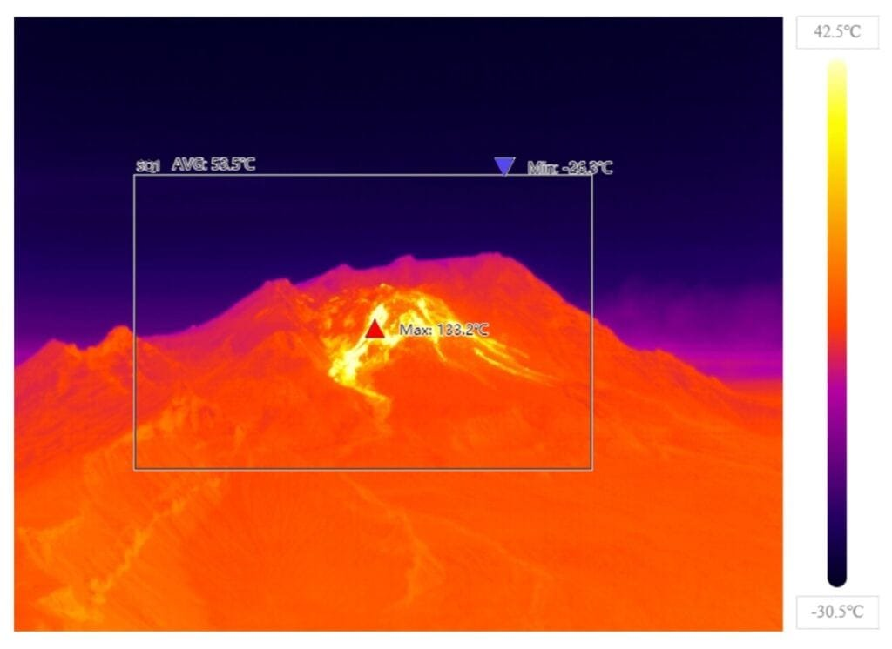
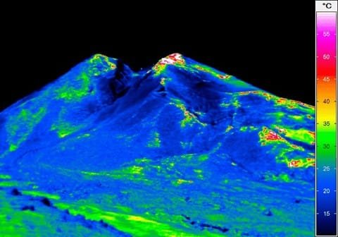

Imagine standing on the edge of a volcano crater, peering into its depths, trying to understand its inner workings. It's a daunting and dangerous task, but one that is vital for the safety of nearby communities. That's where thermal imaging comes in. By utilizing advanced technology, thermal imaging allows scientists to see beyond what the naked eye can detect, revealing crucial information about the temperature distribution within the volcano. This information is key in understanding the behavior of the volcano and predicting when it might erupt. In this article, we will explore the significance of thermal imaging in volcano monitoring, and how it has revolutionized our understanding of these natural wonders.

## Understanding Volcanic Activity

Volcanoes are fascinating geological features that have captivated the human imagination for centuries. They are formed when molten rock, gases, and debris escape to the Earth's surface, causing eruptions of lava and ash. There are various types of volcanoes, each with its own unique characteristics and eruption patterns.

This image is property of www.mdpi.com.

### Types of volcanoes

Volcanoes can be classified into three main types: stratovolcanoes, shield volcanoes, and cinder cones. Stratovolcanoes, also known as composite volcanoes, are steep-sided cones formed from layers of lava, ash, and other volcanic material. These volcanoes are known for their explosive eruptions and can reach great heights.

Shield volcanoes, on the other hand, have a low, broad shape resembling a warrior's shield. They are formed by the accumulation of fluid lava that spreads out in all directions from a central vent. Shield volcanoes usually have non-explosive eruptions and are characterized by gentle slopes.

Cinder cones are the simplest form of volcanoes and often have the shape of a cone made of loose volcanic fragments. They are formed by the accumulation of cinders and other small volcanic materials around a vent. Cinder cones tend to have short-lived eruptions and are usually smaller in size compared to stratovolcanoes and shield volcanoes.

This image is property of thermtest.com.

### Geographic distribution of volcanoes

Volcanoes are not evenly distributed across the globe. They occur in specific areas known as volcanic zones or belts. One well-known volcanic zone is the "Ring of Fire," which encircles the Pacific Ocean and is characterized by intense volcanic and [seismic activity](https://magmamatters.com/the-art-and-science-of-volcano-monitoring/ "The Art and Science of Volcano Monitoring"). This region is home to numerous active volcanoes and is where several tectonic plates meet.

Hotspots are another common location for volcanoes. Hotspots are areas of the Earth's mantle where exceptionally hot plumes of magma rise to the surface, creating volcanic activity. One example of a hotspot is the Hawaiian Islands, which are formed by a stationary plume of magma beneath the Pacific plate.

Volcanic activity can also be found along rift zones, where tectonic plates are moving apart. These areas, such as the East African Rift Valley, are characterized by long, linear chains of volcanoes.

This image is property of ars.els-cdn.com.

### Causes of eruptions

Volcanic eruptions are a result of several factors, including the composition of magma, the amount of dissolved gases in the magma, and the pressure buildup beneath the Earth's surface. Magma is a mixture of molten rock, gases, and solid crystals. It forms beneath the Earth's surface and rises to the surface during an eruption.

The composition of magma plays a crucial role in determining the eruption style of a volcano. Magma can be either felsic (rich in silica) or mafic (low in silica). Felsic magma, which is more viscous, tends to produce explosive eruptions due to the buildup of gas pressure. Mafic magma, on the other hand, is less viscous and produces less explosive eruptions.

The amount of dissolved gases in magma also contributes to eruption style. Gases, such as water vapor, carbon dioxide, and sulfur dioxide, are dissolved in the magma under high pressure. As magma rises to the surface, the pressure decreases, causing the gases to expand rapidly and drive the eruption.

This image is property of thermtest.com.

### Hazards and benefits of volcanic activity

Volcanic activity has both hazards and benefits. On one hand, volcanic eruptions can pose significant risks to human lives and infrastructure. Explosive eruptions can result in pyroclastic flows, which are fast-moving avalanches of hot ash, lava, and gases. These flows can destroy everything in their path and travel many kilometers from the volcano.

Ashfall is another hazard associated with volcanic eruptions. Volcanic ash can cause respiratory problems, contaminate water supplies, and damage agricultural crops. Ash can also disrupt air travel by damaging aircraft engines and reducing visibility.

Despite the hazards, volcanic activity also provides benefits. Volcanic ash and lava are rich in minerals and nutrients, making volcanic soils highly fertile for agriculture. Volcanic eruptions also release gases, such as carbon dioxide, which can contribute to the greenhouse effect and influence climate patterns.

[Understanding volcanic](https://magmamatters.com/understanding-volcanic-formation-a-comprehensive-guide/ "Understanding Volcanic Formation: A Comprehensive Guide") activity is crucial for predicting future eruptions and mitigating risks to surrounding communities. By studying different types of volcanoes, their geographic distribution, eruption causes, and the hazards and benefits they pose, scientists can develop effective monitoring strategies to safeguard vulnerable populations. This knowledge forms the foundation for further exploration into the use of thermal imaging in volcano monitoring.

