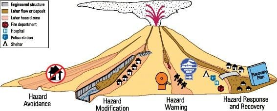

Are you currently facing the daunting task of managing volcano-induced resettlement? Fear not, for we have three valuable tips to help you navigate this challenging process. Volcanic eruptions can be highly destructive, causing the displacement of entire communities. In this article, we will explore three essential strategies that can assist in efficiently and effectively managing the resettlement of affected individuals and communities. By considering factors such as relocation plans, community involvement, and infrastructure development, you can ensure a smooth transition for those impacted by volcanic activity. So let's delve into these tips and discover how you can make a difference in the lives of those needing to start anew.

  

## Understanding Volcanic Hazards

Volcanic hazards pose significant threats to nearby communities and it is crucial to identify these potential threats in order to effectively mitigate risks. By studying historical volcanic activity, scientists can gain insights into the patterns and behavior of different types of eruptions. Understanding the specific hazards associated with each type of eruption, such as pyroclastic flows, ashfall, and volcanic gases, is essential for developing appropriate emergency response plans.

## Awareness of Different Types of Volcanic Eruptions

Volcanic eruptions can manifest in various ways, and it is important to be aware of these different types in order to respond appropriately. Effusive eruptions, characterized by the steady flow of lava, tend to be less explosive but can still cause damage to nearby communities. Explosive eruptions, on the other hand, can release massive amounts of volcanic ash, pyroclastic flows, and volcanic gases. Understanding the distinction between these types of eruptions is essential for determining the level of risk and implementing appropriate safety measures.

This image is property of media.springernature.com.

## Recognition of Signs of Impending Eruptions

Recognizing the signs of an impending volcanic eruption is crucial for providing timely warnings and ensuring the safety of affected communities. These signs can include [increased seismic activity](https://magmamatters.com/the-art-and-science-of-volcano-monitoring/ "The Art and Science of Volcano Monitoring"), ground deformation, changes in gas emissions, and the emergence of new vents or fissures. By closely monitoring these indicators through advanced technologies such as seismometers, gas sensors, and satellite imagery, scientists and authorities can issue timely evacuation orders and activate emergency response plans.

## Preparing for a Volcanic Eruption

Preparing for a volcanic eruption requires careful planning and coordination among different stakeholders. Creation of emergency plans that outline evacuation routes, designated shelters, and strategies for communication is essential. Reliable communication channels should be established to ensure that timely and accurate information reaches the affected communities, enabling them to take necessary precautions. Additionally, educating communities about potential hazards and safe zones empowers individuals to make informed decisions before, during, and after an eruption.

This image is property of www.explorevolcanoes.com.

## Evacuation Procedures and Protocols

Evacuation procedures and protocols play a critical role in safeguarding lives during a volcanic eruption. Mapping evacuation routes ensures that people are guided towards safer areas and away from potential hazards. Coordinating time-sensitive evacuation activities involves working closely with local authorities, emergency response teams, and community leaders to ensure a smooth and organized evacuation process. It is also crucial to ensure the availability of emergency supplies and shelters to support evacuated individuals and meet their basic needs.

## Crisis Management Following an Eruption

Once a volcanic eruption occurs, immediate response and relief efforts are vital to mitigate the impact on affected communities. This includes providing emergency healthcare services to those injured or affected by the eruption, such as treating burns, respiratory issues, and other trauma. Post-eruption assessment and clean-up efforts help to evaluate the extent of damage caused and facilitate the restoration of affected areas. This involves removing ash and debris, repairing infrastructure, and taking steps to return the affected communities to a state of normalcy.

This image is property of qph.cf2.quoracdn.net.

## Planning for Long-Term Resettlement

In the aftermath of a volcanic eruption, planning for long-term resettlement is crucial to ensure the safety and well-being of affected populations. This involves carefully choosing suitable relocation sites that are not prone to future volcanic activity and have the necessary infrastructure to support the resettled communities. Rebuilding livelihoods and infrastructure is essential for the affected population to regain their self-sufficiency and rebuild their lives. Compensation mechanisms should also be put in place to support individuals who have lost their homes, belongings, or livelihoods due to the eruption.

## Psychological Support for Displaced Populations

Displacement due to a volcanic eruption can have severe psychological impacts on affected populations. Providing trauma counseling and mental health support services is crucial to help individuals cope with the trauma and stress of the event. Additionally, promoting community building activities helps foster a sense of belonging and resilience among displaced populations. Mitigating mental health issues linked to displacement requires ongoing support and access to mental health professionals, as well as promoting community support networks.

This image is property of media.springernature.com.

## Continued Monitoring and Prediction of Volcanic Activity

Monitoring and predicting volcanic activity are essential for mitigating risks and ensuring the safety of communities living near volcanoes. Partnerships with professional and academic institutions enable the collection and analysis of data to better [understand volcanic](https://magmamatters.com/understanding-volcanic-formation-a-comprehensive-guide/ "Understanding Volcanic Formation: A Comprehensive Guide") behavior and potential hazards. Implementation of monitoring technologies, such as seismographs, GPS monitoring, and gas sensors, allows for early detection of changes in volcanic activity. Regular updating and review of data prediction models help improve the accuracy of eruption forecasts and enhance emergency preparedness.

## Education and Training on Volcano Preparedness

Educating the public about volcano preparedness is key to reducing the potential impact of eruptions. Launching public awareness campaigns raises awareness about the hazards associated with volcanic activity and provides information on evacuation routes, emergency supplies, and other safety measures. Training programs for emergency response teams equip them with the necessary skills and knowledge to efficiently handle volcanic crises. Integrating eruption safety measures into school curriculums ensures that future generations are well-informed and prepared to respond to volcanic hazards.

This image is property of ars.els-cdn.com.

## Strengthening Local Governance and Community Capacity

Building the capacity of local administrations in crisis management is vital for effective response and recovery efforts. Providing training and resources to local authorities strengthens their ability to coordinate evacuation procedures, emergency response, and long-term recovery efforts. Engaging community organizations in preparedness measures fosters collaboration and ensures that the unique needs of the affected communities are taken into account. Promoting participative decision-making processes in disaster risk reduction empowers the local population to actively contribute to and take ownership of their safety and well-being.

## Collaboration with International Aid Organizations

Collaboration with international aid organizations is essential for accessing financial and logistical support during and after a volcanic eruption. These organizations can provide critical resources, expertise, and funding to support emergency response and long-term recovery efforts. Additionally, collaborating with international aid organizations facilitates the transfer of knowledge and best practices from other regions that have experienced similar volcanic disasters. Participating in global platforms for disaster risk management and resilience building allows for the sharing of experiences and lessons learned, contributing to the development of more effective strategies for future volcanic eruptions.

Related Posts: [Mitigating Risks: Forecasting Volcanic Activity in Prone Areas](https://magmamatters.com/mitigating-risks-forecasting-volcanic-activity-in-prone-areas/), [The Formation and Eruption Patterns of Volcanoes](https://magmamatters.com/the-formation-and-eruption-patterns-of-volcanoes-4/), [The Pyroclastic Phenomena of Pompeii: 7 Insights to Explore](https://magmamatters.com/the-pyroclastic-phenomena-of-pompeii-7-insights-to-explore/), [Tips for Capturing Volcano Pyroclastic Flow Photos](https://magmamatters.com/tips-for-capturing-volcano-pyroclastic-flow-photos/), [Understanding Volcanoes and Their Eruption Patterns](https://magmamatters.com/understanding-volcanoes-and-their-eruption-patterns/)
