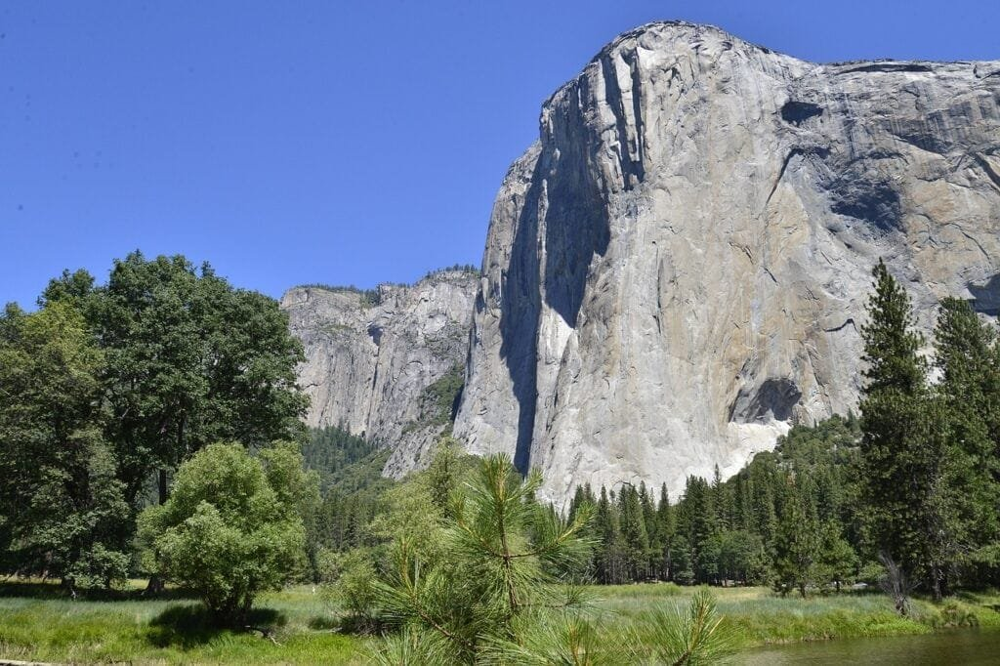
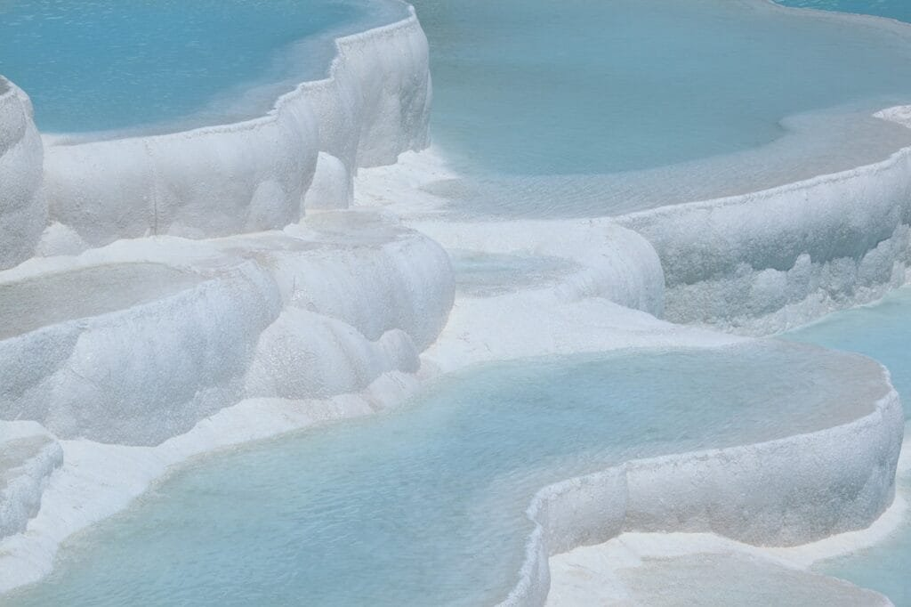
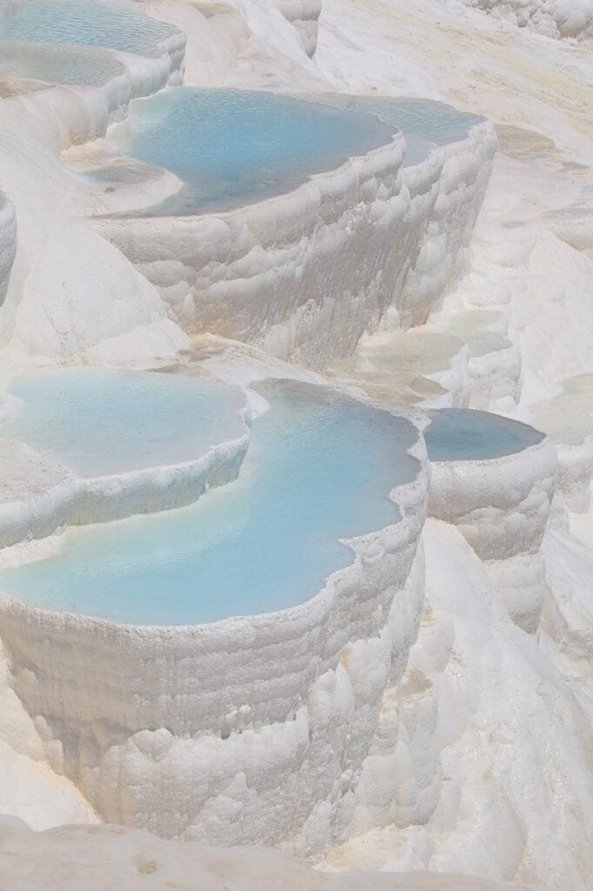

Did you know that volcanoes are not only fascinating geological features, but they also play a crucial role in shaping the Earth's landscapes? From explosive eruptions to the gradual formation of shield volcanoes, these natural wonders have captivated scientists and adventurers for centuries. In this article, we will take a closer look at the top five volcanic landmarks in the geological time scale. From the Ring of Fire to the majestic peaks of Hawaii, get ready to embark on a journey through time and discover the awe-inspiring power of volcanoes.

This image is property of pixabay.com.

## Earth Formation and the First Volcanoes

### Setting the stage: Earth's formation and how it led to the birth of volcanoes

The formation of Earth began approximately 4.6 billion years ago as a result of the accretion of dust and gas in the early solar system. Over time, gravity caused this matter to come together, forming our planet. As Earth continued to evolve, intense heat and pressure led to the differentiation of the planet into layers - the core, mantle, and crust.

Volcanic activity is closely tied to Earth's formation. During the early stages, when Earth was still hot and comprised mostly of molten rock, volcanoes played a crucial role in shaping the planet's surface. The release of molten lava and gases from the interior of the Earth created the first volcanoes, which were instrumental in the formation of the early atmosphere and oceans.

### The relation between geological timescale and volcanic activity

The geological timescale is a system used by scientists to divide Earth's history into distinct periods, based on major geological events and the fossils found in specific rock layers. Volcanic activity is one of the key markers in this timescale as it leaves behind a record in the form of volcanic rocks and ash deposits.

By studying the age and composition of volcanic rocks, scientists can gain valuable insights into Earth's history. Volcanic eruptions provide a snapshot of the conditions and processes that were occurring at the time, allowing us to understand the evolution of our planet over millions of years.

### Significance of volcanic activity in Earth's early stages

Volcanic activity played a crucial role in shaping Earth during its early stages. As volcanoes erupted, they released gases such as water vapor, carbon dioxide, and methane into the atmosphere. This process contributed to the formation of Earth's early atmosphere, which eventually led to the development of life.

Volcanic eruptions were also responsible for the creation of the first oceans. As lava flowed into the surrounding basins and cooled, it formed the foundation for the water bodies that cover much of Earth's surface today.

Furthermore, volcanic activity played a vital role in mineral formation. The intense heat and pressure associated with volcanic eruptions caused the formation of valuable minerals, including gold, silver, and copper. These minerals have been instrumental in the development of civilizations throughout history.

## A Look at Shield Volcanoes: Mauna Loa

### Introduction to Mauna Loa: the largest shield volcano

Coming in at an impressive height of 13,678 feet (4,169 meters), Mauna Loa is the largest shield volcano on Earth. Located on the Big Island of Hawaii, it is part of the larger volcanic system that includes four other active volcanoes - Kilauea, Hualalai, Mauna Kea, and Kohala.

### Understanding shield volcanoes and their typical eruption pattern

Shield volcanoes, like Mauna Loa, are named for their broad, gently sloping profiles resembling shields. They are formed by the accumulation of thin, fluid lava flows that spread out over a large area, creating a shield-like shape. These lava flows are typically low in viscosity, meaning they flow easily and can travel long distances.

The eruption pattern of shield volcanoes is characterized by relatively frequent and non-explosive eruptions. The lava flows from these eruptions can extend for tens of kilometers, covering vast areas of land. Due to the low viscosity of the lava, gases can easily escape, resulting in a relatively calm eruption compared to other types of volcanoes.

### How Mauna Loa reflects Earth's tectonic activity over millions of years

Mauna Loa's formation and ongoing volcanic activity are a direct result of the Pacific Plate moving over a hotspot deep beneath the Earth's crust. Hotspots are fixed areas of intense heat beneath the Earth's surface, where magma rises and erupts, creating volcanic activity.

As the Pacific Plate moves slowly northwestward, it carries the hotspot beneath it. Over millions of years, Mauna Loa has been built up by successive eruptions, with each eruption adding layers of lava to the volcano. This process is a testament to the ongoing tectonic activity and the dynamic nature of Earth's crust.

<iframe width="560" height="315" src="https://www.youtube.com/embed/rWp5ZpJAIAE" frameborder="0" allow="accelerometer; autoplay; encrypted-media; gyroscope; picture-in-picture" allowfullscreen></iframe>

  

## Stratovolcano Spotlight: Mount Fuji

### Introduction to Mount Fuji: Japan's tallest peak and a renowned stratovolcano

Rising majestically to a height of 12,388 feet (3,776 meters), Mount Fuji is not only Japan's tallest peak but also one of the most iconic and revered stratovolcanoes in the world. Located about 100 kilometers southwest of Tokyo, Mount Fuji holds deep cultural and spiritual significance for the Japanese people.

### Understanding stratovolcanoes and their typical eruption pattern

Stratovolcanoes, also known as composite volcanoes, are steep-sided and symmetrical in shape. They are built up by alternating layers of lava, ash, and volcanic debris ejected during eruptions. These layers give stratovolcanoes their characteristic appearance and make them highly visible and recognizable.

The eruption pattern of stratovolcanoes can vary, but they are known for their explosive eruptions. These eruptions are often triggered by the buildup of pressure from the magma chamber beneath the volcano. The viscosity of the magma can cause it to trap gases, leading to explosive eruptions that can send ash, rocks, and pyroclastic flows cascading down the slopes.

### How Mount Fuji’s age and eruption history map onto the Geological Time Scale

Mount Fuji is approximately 100,000 years old and has a rich eruption history. Scientists have studied the volcanic deposits surrounding the mountain to piece together its chronology and understand its place on the Geological Time Scale.

Based on these studies, it is estimated that Mount Fuji has experienced at least 18 eruptions in the past 10,000 years. The most recent eruption occurred in 1707 during the Edo period and resulted in the deposition of a significant amount of ash and volcanic material. By analyzing these deposits, scientists can better understand the geological processes associated with Mount Fuji's eruptions.

## The Anarchy of Supervolcanoes: Yellowstone Caldera

### Introduction to Yellowstone Caldera: one of the world's most infamous supervolcanoes

Yellowstone Caldera, located primarily within Yellowstone National Park in the United States, is one of the most notorious supervolcanoes on Earth. Its widespread fame comes from the immense destructive power it has displayed in the past and the potential catastrophic consequences it could unleash in the future.

### Understanding supervolcanoes and their potential catastrophic impact

Supervolcanoes are characterized by their colossal size and explosive potential. These volcanoes can produce eruptions thousands of times more powerful than a typical volcanic eruption, spewing vast quantities of ash, gases, and lava over extensive areas.

The catastrophic impact of supervolcanic eruptions can be devastating on both regional and global scales. The immediate effects include the destruction of landscapes, the release of toxic gases, and the burial of vast areas under ash and pyroclastic flows. In the long term, the massive injection of volcanic material into the atmosphere can alter global climate patterns, leading to reduced sunlight and lower temperatures.

### Tracing back Yellowstone's eruptions on the Geological Time Scale

The Yellowstone Caldera has experienced three supereruptions in the past 2.1 million years. The most recent eruption, known as the Lava Creek eruption, occurred approximately 640,000 years ago and resulted in the formation of the Yellowstone Caldera. The caldera spans an area of about 30 by 45 miles (48 by 72 kilometers) and serves as a visible reminder of the incredible power Yellowstone holds beneath its surface.

Geologists and volcanologists continue to monitor Yellowstone closely to better understand the complex processes occurring beneath the surface and to detect potential signs of future activity. While the future potential of a Yellowstone eruption remains uncertain, the scientific community is committed to improving our understanding of these enigmatic supervolcanoes.

This image is property of pixabay.com.

## The Unpredictability of Composite Volcanoes: Mount Pinatubo

### Introduction to Mount Pinatubo: the site of one of the 20th century's largest eruptions

Mount Pinatubo, located in the Philippines, is infamous for its cataclysmic eruption in 1991. This eruption, one of the largest of the 20th century, had widespread effects on the global climate and served as a stark reminder of the unpredictable nature of composite volcanoes.

### Understanding composite volcanoes and their typical eruption style

Composite volcanoes, also known as stratovolcanoes, are characterized by their steep slopes and composite nature. They are formed by alternating layers of lava, ash, and volcanic debris that accumulate during eruptions.

The eruption style of composite volcanoes can vary, but they are known for their explosive eruptions. The combination of highly viscous magma, which traps gas bubbles, and the steep slopes of the volcano can lead to the buildup of immense pressure. When this pressure is released, it can result in explosive eruptions that produce pyroclastic flows, ash clouds, and lahars.

### Mount Pinatubo’s eruptions and their place on the Geological Time Scale

The 1991 eruption of Mount Pinatubo was a significant event in geological history. It expelled over 10 cubic kilometers of magma, making it one of the largest volcanic eruptions of the 20th century. The eruption column reached a height of 40 kilometers (25 miles), and the released ash and sulfur dioxide had a profound impact on the global climate.

By analyzing the volcanic deposits left behind by the Mount Pinatubo eruption, scientists can gain valuable insights into the eruption style, processes, and impacts associated with this type of composite volcano. These findings contribute to our understanding of volcanic hazards and aid in the development of strategies to mitigate future risks.

### Impact of Mount Pinatubo eruption on global climate patterns

The 1991 eruption of Mount Pinatubo had a significant impact on global climate patterns. The massive amounts of ash and sulfur dioxide released during the eruption entered the stratosphere and formed a layer of aerosols. These aerosols reflected sunlight back into space, resulting in a cooling effect on Earth's surface.

The following year, 1992, was commonly referred to as the "Year Without a Summer" due to the global temperature decrease caused by the Mount Pinatubo eruption. The reduced sunlight led to lower average temperatures in many regions, affecting agriculture, weather patterns, and ecosystems around the world.

The eruption of Mount Pinatubo serves as a reminder of the far-reaching impacts that volcanic eruptions can have on global climate and emphasizes the need for continuous monitoring and research in the field of volcanology.

## Decoding Dome Volcanoes: Mont Pelee

### Introduction to Mont Pelee: a deadly dome volcano

Mont Pelee, located on the Caribbean island of Martinique, gained notoriety for the catastrophic eruption that occurred on May 8, 1902. This eruption led to the destruction of the town of Saint-Pierre and claimed the lives of approximately 30,000 people, making it one of history's deadliest volcanic eruptions.

### Understanding dome volcanoes and their typical eruption pattern

Dome volcanoes, also known as lava dome volcanoes, are characterized by the extrusion of highly viscous lava that accumulates around the volcano's vent. The lava solidifies to form a dome-shaped structure that can grow over time.

The eruption pattern of dome volcanoes is typically characterized by the gradual extrusion of lava rather than explosive eruptions. However, this does not mean that dome volcanoes are not hazardous. The slow-moving lava can pile up and eventually collapse, resulting in pyroclastic flows that can be highly destructive.

### The catastrophic 1902 eruption of Mont Pelee and its place on the Geological Time Scale

The eruption of Mont Pelee in 1902 was a catastrophic event that had a significant impact on the region. The eruption column reached a height of approximately 30 kilometers (18.6 miles) and generated pyroclastic flows that engulfed the town of Saint-Pierre within minutes, destroying everything in its path.

This devastating eruption serves as a reminder of the immense power of volcanic activity and the importance of preparedness and risk mitigation in volcanic regions. The lessons learned from the Mont Pelee eruption have contributed to improved volcano monitoring and disaster management strategies worldwide.

### The aftermath and learnings from Mont Pelee eruption

The aftermath of the 1902 Mont Pelee eruption was a scene of devastation. The once-thriving town of Saint-Pierre was reduced to ruins, and the human toll was staggering. In the wake of this tragedy, efforts were made to rebuild and rehabilitate the affected areas.

The Mont Pelee eruption served as a turning point in the study of volcanic hazards and the development of volcano monitoring systems. It highlighted the need for accurate eruption forecasting, reliable communication systems, and evacuation plans in volcanic regions. The lessons learned from the Mont Pelee eruption continue to shape our understanding of volcanic hazards and inform disaster prevention strategies to this day.

This image is property of pixabay.com.

## Analyzing Volcanic Hazards and Threats

### The potential dangers of volcanic activity

Volcanic activity poses numerous hazards that can endanger human life and infrastructure. These hazards include pyroclastic flows, ash clouds, lahars (volcanic mudflows), volcanic gases, and volcanic tsunamis.

Pyroclastic flows are fast-moving, superheated mixtures of ash, rocks, and gases that can travel at speeds exceeding 100 kilometers per hour (62 miles per hour). Ash clouds produced during eruptions can disrupt air travel, damage machinery, and pose respiratory health risks. Lahars, formed by the mixing of volcanic ash and water, can flow rapidly downhill and bury communities in their path.

Volcanic gases, such as [sulfur dioxide and carbon](https://magmamatters.com/the-art-and-science-of-volcano-monitoring/ "The Art and Science of Volcano Monitoring") dioxide, can be toxic and cause respiratory and environmental issues. Volcanic tsunamis, triggered by submarine volcanic activity or the collapse of volcanic edifices into the sea, can generate large, destructive waves that pose a threat to coastal communities.

### Major volcanic disasters throughout history

Throughout history, there have been several major volcanic disasters that have left indelible marks on communities and landscapes. The eruption of Mount Vesuvius in 79 AD, which destroyed the Roman cities of Pompeii and Herculaneum, is one such example. Other notable volcanic disasters include the 1883 eruption of Krakatoa in Indonesia, the 1815 eruption of Mount Tambora in Indonesia (which caused the "Year Without a Summer"), and the 1814 eruption of Mount Mayon in the Philippines.

These catastrophic events serve as reminders of the potential dangers associated with volcanic activity and highlight the need for preparedness, early warning systems, and effective disaster management strategies in volcanic regions.

### The role of volcanologists in monitoring and predicting eruptions

Volcanologists play a crucial role in monitoring and predicting volcanic eruptions. By studying various indicators of volcanic activity, such as ground deformation, gas emissions, seismic activity, and thermal anomalies, volcanologists can detect changes that may precede an eruption.

Monitoring techniques, such as ground-based and satellite-based observations, provide valuable real-time data that help volcanologists assess the state of a volcano and make informed predictions about its future behavior. These predictions can then be used to issue timely warnings, evacuate at-risk communities, and implement measures to mitigate the hazards associated with volcanic eruptions.

The work of volcanologists is essential in ensuring the safety and well-being of populations living in volcanic regions. By continuously monitoring and studying these awe-inspiring natural phenomena, volcanologists contribute to our understanding of Earth's dynamics and help protect vulnerable communities from the devastating impacts of volcanic disasters.

## The Bright Side of Volcanoes: Economic and Environmental Benefits

### Understanding the role of volcanoes in mineral formation and other economic benefits

Volcanoes have played a significant role in the formation of valuable minerals that have shaped human history. The intense heat and pressure associated with volcanic activity can melt rock, leading to the formation of precious metals, gemstones, and various industrial minerals.

Volcanic regions are often rich in mineral resources, attracting mining activities that contribute to the local economy. Volcanic areas, such as the Andean Volcanic Belt in South America, have been a source of copper, gold, silver, and other valuable minerals for centuries.

In addition to mineral formation, volcanic activity can also have other economic benefits. Geothermal energy, which harnesses the heat from volcanic activity, provides a sustainable and renewable source of energy for heating, electricity generation, and other industrial processes.

### Volcanic soil and its agricultural benefits

Volcanic eruptions also have positive effects on agricultural productivity. The minerals and nutrients released during volcanic eruptions enrich the soil, making it fertile and highly productive for agriculture. Volcanic soils, known as andisols, are prized for their ability to retain water and nutrients, promoting the growth of crops.

Many regions with volcanic soils, such as the volcanic islands of Hawaii, are renowned for their agricultural abundance. These fertile lands support the cultivation of crops such as coffee, tea, fruits, vegetables, and sugarcane. The rich volcanic soil, combined with a favorable climate, creates ideal conditions for agriculture, creating economic opportunities for local communities.

### Carbon cycle and Volcanic emissions: understanding the dual nature

While [volcanic activity can release significant amounts of carbon dioxide](https://magmamatters.com/geothermal-energy-and-its-volcanic-origins/ "Geothermal Energy and Its Volcanic Origins") (CO2) and other greenhouse gases into the atmosphere, it is crucial to understand the context of volcanic emissions within the larger carbon cycle.

Volcanic emissions make up only a small fraction of the global carbon budget compared to human activities such as burning fossil fuels. The carbon emitted during volcanic eruptions is ultimately part of the natural carbon cycle and is balanced by processes such as weathering and photosynthesis.

Furthermore, volcanic emissions can have a cooling effect on the climate. Volcanic aerosols, composed of sulfuric acid droplets and ash particles, can reflect incoming solar radiation back into space, resulting in a temporary cooling effect on the Earth's surface.

Understanding the dual nature of volcanic emissions is essential for accurately assessing their impact on [climate change](https://magmamatters.com/the-environmental-impact-of-volcanic-eruptions-2/ "The Environmental Impact of Volcanic Eruptions") and implementing effective strategies to mitigate human-caused greenhouse gas emissions.

## Volcanic Landmarks and Climate Change

### How do volcanic eruptions impact climate patterns?

Volcanic eruptions have the potential to significantly impact climate patterns on a regional and global scale. When volcanoes erupt, they release large amounts of ash, gases, and aerosols into the atmosphere. These volcanic emissions can have both short-term and long-term effects on the Earth's climate.

In the short term, volcanic aerosols can reflect incoming solar radiation back into space, leading to a cooling effect on the Earth's surface. This can result in a temporary decrease in global temperatures, altering weather patterns and influencing precipitation levels.

In the long term, volcanic emissions can have a more complex impact on the climate. Sulfur dioxide released during volcanic eruptions can react with water vapor in the atmosphere to form sulfate aerosols. These aerosols can remain in the atmosphere for an extended period, reflecting sunlight and leading to a cooling effect.

### Case study: Eruptions and the 'Year Without a Summer'

One notable example of the impact of volcanic eruptions on climate patterns is the "Year Without a Summer" in 1816. This event was caused by the release of volcanic material into the atmosphere from the massive eruption of Mount Tambora in Indonesia in 1815.

The volcanic aerosols and ash from the Mount Tambora eruption caused global cooling, resulting in an unusually cold and wet summer in many parts of the world. Crops failed, leading to food shortages, and severe weather events, such as frosts and heavy rainfall, were reported in various regions.

The "Year Without a Summer" serves as a historical reminder of the far-reaching impact volcanic eruptions can have on climate patterns and the importance of considering these factors in climate modeling and future climate predictions.

### The paradox of volcanic activity: both a source and a sink for greenhouse gases

While volcanic eruptions can release significant amounts of greenhouse gases, such as carbon dioxide (CO2) and methane (CH4), into the atmosphere, they also have the potential to act as a sink, effectively removing these gases from the atmosphere.

Volcanic activity can facilitate the uptake and storage of carbon through various mechanisms. During eruptions, volcanic rock weathers and reacts with CO2, effectively removing it from the atmosphere and trapping it in carbonate minerals on land and in the ocean.

Furthermore, volcanic regions often have dense vegetation cover, which acts as a carbon sink by absorbing CO2 through photosynthesis. The fertile volcanic soils support the growth of vegetation, contributing to the uptake and storage of carbon.

It is essential to consider the complex interactions between volcanic activity and greenhouse gas emissions when evaluating their role in climate change. While volcanic emissions can contribute to short-term variations in climate patterns, the long-term impact of volcanic activity on the global carbon cycle is relatively small compared to human-caused emissions.

## The Future of Volcanology and Disaster Prevention

### Current methodologies in predicting volcanic activity

Advancements in technology and the accumulation of scientific knowledge have significantly improved our ability to predict volcanic activity. Volcanologists employ various monitoring techniques to detect changes in volcanic behavior that may indicate an impending eruption.

Ground-based monitoring stations, equipped with instruments such as seismometers, gas analyzers, and thermal cameras, provide real-time data on seismic activity, gas emissions, and thermal anomalies. Satellite-based remote sensing allows for the continuous monitoring of volcanic edifices and the detection of changes in ground deformation and gas emissions from space.

Coupled with advanced modeling techniques and data analysis, these monitoring systems enable scientists to make more accurate predictions about the timing, size, and potential hazards associated with volcanic eruptions. Continuous monitoring and improved prediction capabilities are essential in ensuring the safety and well-being of communities living in volcanic regions.

### The role of technology in improving eruption forecasts

Technological advancements have revolutionized eruption forecasting and improved our understanding of volcanic processes. Advanced numerical models simulate the complex dynamics of volcanic systems, allowing scientists to explore different scenarios and predict possible outcomes of volcanic eruptions.

Additionally, remote sensing technologies have transformed our ability to monitor and analyze volcanic activity. Satellite-based sensors can detect subtle changes in gas emissions, ground deformation, and thermal anomalies, providing valuable data on volcanic behavior over large areas and remote regions.

The integration of real-time monitoring data, advanced models, and remote sensing technologies has led to significant advancements in eruption forecasting. The increasing availability and accessibility of these tools are empowering scientists to make more accurate predictions and provide timely warnings to populations at risk.

### Community preparedness and disaster management in areas with volcanic threats

Disaster prevention and preparedness play a pivotal role in mitigating the impact of volcanic eruptions on communities. By developing robust disaster management plans and implementing proactive measures, communities can enhance their resilience and ability to respond effectively to volcanic hazards.

Education and awareness programs are crucial for informing communities about the risks associated with living in volcanic regions. These programs should focus on teaching individuals how to recognize warning signs of volcanic activity and respond appropriately in emergency situations.

Early warning systems equipped with sirens, text alerts, and other communication methods are vital in ensuring that communities receive timely information about impending eruptions. Evacuation plans, emergency shelters, and routes should be established and regularly reviewed to facilitate the safe and organized evacuation of at-risk populations.

Collaboration between scientists, local authorities, and community leaders is essential in developing and implementing effective disaster management strategies. By working together, we can reduce the risks and potential impacts of volcanic eruptions, ultimately creating safer communities in volcanic regions.

In conclusion, understanding the formation and behavior of volcanoes is crucial in mitigating the risks and harnessing the benefits associated with these awe-inspiring natural phenomena. From shield volcanoes like Mauna Loa to stratovolcanoes like Mount Fuji, each [type of volcano tells a unique story about Earth's history](https://magmamatters.com/understanding-volcanic-formation-a-comprehensive-guide/ "Understanding Volcanic Formation: A Comprehensive Guide") and its dynamic processes. The catastrophic impact of supervolcanoes like the Yellowstone Caldera and the unpredictability of composite volcanoes like Mount Pinatubo serve as reminders of the immense power and potential hazards associated with volcanic activity. However, it is important to recognize that volcanoes also offer economic benefits through mineral formation, geothermal energy, and fertile volcanic soils. By continuously monitoring and studying volcanoes, we can improve our understanding of their behavior, enhance eruption forecasts, and develop effective strategies for disaster prevention. Through community preparedness and collaboration, we can strive towards safer and more resilient societies in volcanic regions. As we move into the future, technological advancements will undoubtedly play a critical role in advancing our knowledge of volcanology and improving our ability to predict and mitigate volcanic hazards.

