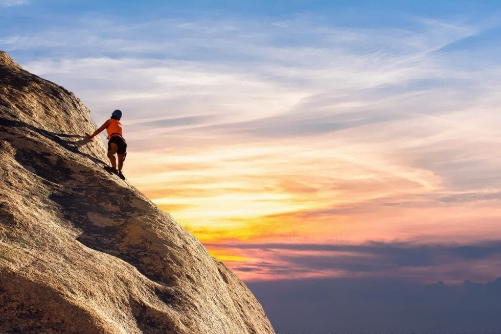
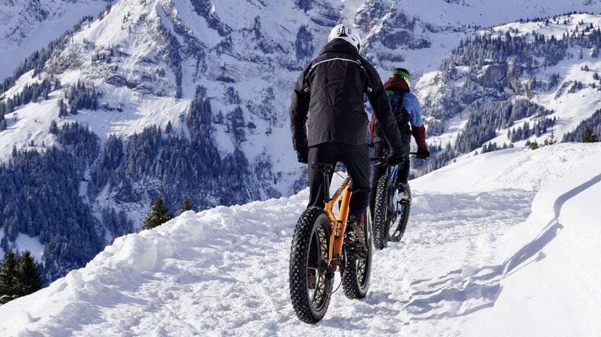

If you're looking for an adrenaline-pumping adventure that combines breathtaking views with thrilling activities, then exploring volcanoes might just be the perfect choice for you. From the fiery eruptions to the rugged landscapes, volcanoes offer a unique experience for extreme sports enthusiasts. Whether you're into hiking, rock climbing, or even paragliding, there are plenty of top volcano sites around the world that will satisfy your craving for adventure. So buckle up and get ready to discover the most exhilarating and breathtaking volcano sites that are sure to make your heart race and leave you with unforgettable memories.

This image is property of pixabay.com.

## Mount St. Helens, Washington, USA

### Volcano Boarding

At Mount St. Helens, you can experience the thrill of volcano boarding, which involves sliding down the slopes of the volcano on a specially designed board. As you descend, you'll feel the rush of adrenaline as you navigate the rugged terrain and admire the breathtaking views. This unique activity combines the excitement of snowboarding with the volcanic landscape, offering a truly one-of-a-kind adventure.

### Mountaineering

For those seeking a more challenging experience, mountaineering on Mount St. Helens is an excellent choice. With its steep terrain and rocky slopes, this volcano provides a perfect opportunity for climbers to test their skills and endurance. As you reach the summit, you'll be rewarded with panoramic views of the surrounding landscape, including the picturesque Spirit Lake. Whether you're a seasoned mountaineer or a beginner looking for a new adventure, climbing Mount St. Helens is an experience you won't soon forget.

### Cave Exploration

If you're interested in delving deep into the mysteries of Mount St. Helens, cave exploration is the activity for you. The volcano is home to a network of lava tubes, formed by ancient lava flows. These caves offer a unique opportunity to explore the inner workings of the volcano and witness the incredible geological formations that have been created over thousands of years. Equipped with a helmet and headlamp, you can crawl through narrow passages, marvel at stalactites and stalagmites, and gain a deeper understanding of the volcano's geological history.

## Pacaya Volcano, Guatemala

### Hiking

Hiking is one of the most popular activities at Pacaya Volcano in Guatemala. As you trek through lush forests and volcanic landscapes, you'll be surrounded by stunning natural beauty. The hike takes you up to the summit of the volcano, where you can witness the breathtaking sight of flowing lava and experience the power of the earth beneath your feet. Whether you're an experienced hiker or a novice, the trails at Pacaya Volcano cater to all skill levels and provide an unforgettable adventure.

### Camping

For a truly immersive experience, camping at Pacaya Volcano is a must. Spend a night under the stars, surrounded by the volcanic landscape and the sound of crackling lava. As darkness falls, you can witness the mesmerizing glow of the lava as it flows down the slopes of the volcano. Camping allows you to fully appreciate the beauty and power of Pacaya Volcano, creating memories that will last a lifetime.

### Volcanic Sauna Experience

If you're looking for a unique way to relax and rejuvenate, the volcanic sauna experience at Pacaya Volcano is the perfect choice. This natural sauna is located next to a hot lava flow and utilizes the geothermal energy of the [volcano](https://magmamatters.com/the-art-and-science-of-volcano-monitoring/ "The Art and Science of Volcano Monitoring") to create a soothing and therapeutic environment. As you unwind in the warm steam, you'll feel the stress and tension melt away. The volcanic minerals present in the steam provide numerous health benefits, making this a truly revitalizing experience.

This image is property of pixabay.com.

## Etna Volcano, Sicily, Italy

### Skiing/snowboarding

Etna Volcano in Sicily offers a thrilling skiing and snowboarding experience. With its high altitudes and abundant snowfall, the volcano provides excellent conditions for winter sports enthusiasts. As you glide down the slopes, you'll be treated to breathtaking views of the surrounding landscape, including the sparkling Mediterranean Sea. Whether you're a beginner or an expert, Etna Volcano offers a range of slopes to cater to all skill levels, ensuring a fun-filled adventure for everyone.

### Volcano Biking

For a unique and exhilarating way to explore Etna Volcano, volcano biking is the activity of choice. Hop on a mountain bike and traverse the rugged terrain, taking in the stunning scenery as you go. The trails wind through lava fields and dense forests, providing an exciting and challenging ride. With professional guides to lead the way, volcano biking at Etna Volcano offers an unforgettable adventure for adrenaline junkies and nature lovers alike.

### Winery Tours at Mount Etna

In addition to its natural beauty, Etna Volcano is also renowned for its exceptional vineyards and wineries. Take a break from the adrenaline-fueled activities and indulge in a winery tour, where you can sample the delicious wines produced in the fertile volcanic soil. Learn about the rich history of winemaking in the region and gain an appreciation for the unique flavors that are derived from the volcanic environment. A winery tour at Mount Etna provides a perfect blend of adventure and relaxation, allowing you to savor the best that this volcanic region has to offer.

## Cotopaxi Volcano, Ecuador

### Mountain Biking

Cotopaxi Volcano in Ecuador offers an exhilarating mountain biking experience. With its rugged terrain and varied landscapes, this volcano provides the perfect backdrop for an adrenaline-fueled adventure. As you navigate the winding trails, you'll be surrounded by breathtaking views of the Andes Mountains and the stunning Cotopaxi National Park. Whether you're a seasoned mountain biker or a beginner, Cotopaxi Volcano offers trails of varying difficulty levels, ensuring an exciting and challenging ride for all.

### Hiking and Climbing

For those seeking a more traditional adventure, hiking and climbing at Cotopaxi Volcano are a must. The volcano's majestic slopes and icy glaciers provide the perfect setting for a challenging trek. As you ascend to the summit, you'll be rewarded with panoramic views of the surrounding landscape, including the vast expanse of the Andes Mountains. Climbing Cotopaxi Volcano requires physical fitness and mountaineering experience, but the sense of accomplishment and the beauty of the journey make it a truly unforgettable experience.

### Horseback Riding

Experience the beauty of Cotopaxi Volcano from a different perspective with a horseback riding tour. Explore the volcanic landscapes and lush valleys as you ride through the picturesque countryside. With professional guides to lead the way, you can relax and enjoy the breathtaking scenery. Horseback riding at Cotopaxi Volcano offers a unique and peaceful adventure, allowing you to connect with nature and appreciate the natural wonders of the region.

This image is property of pixabay.com.

## Mauna Loa, Big Island, Hawaii, USA

### Submarine Magma Chamber Dives

Take your adventure to new depths with a submarine magma chamber dive at Mauna Loa in Hawaii. Explore the hidden world beneath the volcano's surface and witness the raw power of volcanic activity up close. As you descend into the depths of the ocean, you'll be surrounded by the vibrant colors of underwater [volcanic formations](https://magmamatters.com/understanding-volcanic-formation-a-comprehensive-guide/ "Understanding Volcanic Formation: A Comprehensive Guide") and unique marine life. Dive into the unknown and discover the marvels that lie beneath the surface at Mauna Loa.

### Volcanic Hot Air Balloon Tours

For a more serene and breathtaking experience, embark on a volcanic hot air balloon tour at Mauna Loa. Soar above the volcano's majestic slopes and take in the panoramic views of the Big Island's stunning landscape. As you glide through the sky, you'll witness the beauty of Mauna Loa from a unique perspective, admiring the vast lava fields and lush tropical forests. A hot air balloon tour offers a peaceful and awe-inspiring adventure that allows you to fully appreciate the grandeur of Mauna Loa.

### Volcanic Helicopter Tours

For the ultimate adventure at Mauna Loa, embark on a volcanic helicopter tour. As you soar above the volcano's molten lava and cascading waterfalls, you'll be treated to breathtaking views of the Big Island's natural wonders. From the comfort of a helicopter, you can witness the power and beauty of Mauna Loa up close, capturing stunning aerial photographs and creating memories that will last a lifetime. A volcanic helicopter tour offers a thrilling and unforgettable experience that showcases the true magnificence of Mauna Loa.

## Mount Yasur, Tanna Island, Vanuatu

### Bungee Jumping

For the adrenaline junkies out there, bungee jumping at Mount Yasur is an experience like no other. Leap off the edge of the volcano and freefall towards the crater below, experiencing the ultimate rush of adrenaline. As you bounce back up, you'll be surrounded by the fiery glow of lava and the roar of the volcano. Bungee jumping at Mount Yasur is not for the faint of heart, but for those who dare to take the leap, it offers an unparalleled adventure that will leave you breathless.

### Volcano Yoga

For a more tranquil and meditative experience, volcano yoga at Mount Yasur is the perfect choice. Practice yoga amidst the peaceful surroundings of the volcano, connecting with nature and harnessing the energy of the earth. As you flow through the poses, you'll be inspired by the beauty and power of Mount Yasur, creating a sense of calm and serenity. Volcano yoga offers a unique and spiritually uplifting experience, allowing you to find balance and harmony in the midst of a volcanic landscape.

### Zip Lining Over Crater

For a thrilling and exhilarating adventure, zip lining over the crater of Mount Yasur is an absolute must. Soar through the air as you traverse the volcanic landscape, taking in breathtaking views of the smoldering crater and the surrounding tropical paradise. As you zip along the lines, you'll feel the rush of adrenaline and the sense of freedom that comes with flying through the sky. Zip lining over the crater of Mount Yasur offers an unforgettable and high-flying adventure that will leave you wanting more.

## Eyjafjallajökull, Iceland

### Ice Climbing on Glacial Volcanoes

Iceland is home to numerous glacial volcanoes, including Eyjafjallajökull, offering a unique ice climbing experience. Strap on your crampons and grab your ice axes as you ascend the icy slopes, navigating through crevasses and seracs. Ice climbing on glacial volcanoes combines the thrill of climbing with the stunning beauty of frozen landscapes. As you reach the summit, you'll be rewarded with magnificent views of the surrounding glaciers and the rugged Icelandic terrain.

### Snowmobile Tours

For a fast-paced and adrenaline-filled adventure, snowmobile tours are a popular choice at Eyjafjallajökull. Hop on a snowmobile and speed across the snow-covered slopes, experiencing the thrill of the volcanic landscape in a unique way. With the wind in your hair and the stunning scenery passing by, you'll feel a true sense of freedom and excitement. Snowmobile tours at Eyjafjallajökull are suitable for all skill levels, making it a thrilling activity for both beginners and experienced riders.

### Quad Bike Volcano Tours

If you prefer a more rugged and adventurous experience, quad bike volcano tours are the perfect option. Hop on a powerful quad bike and navigate through the volcanic terrain, tackling steep slopes and rocky trails. As you ride, you'll feel the exhilaration of off-roading and the adrenaline rush of exploring the untamed wilderness. Quad bike volcano tours at Eyjafjallajökull offer an exciting and adrenaline-fueled adventure that will satisfy even the most daring adrenaline seekers.

## Villarrica Volcano, Chile

### Volcano Surfing

For a truly unique and adrenaline-pumping experience, try volcano surfing at Villarrica Volcano in Chile. Strap on a special sled and slide down the slopes of the volcano, reaching speeds of up to 50 miles per hour. As you descend, you'll be surrounded by stunning views of the snow-capped summit and the picturesque surrounding landscape. Volcano surfing combines the thrill of sledding with the natural beauty of a volcanic setting, creating a truly unforgettable adventure.

### Snowboarding/Skiing

Villarrica Volcano offers excellent opportunities for snowboarding and skiing, with its steep slopes and deep powder. Strap on your gear and carve your way down the volcano, experiencing the rush of adrenaline as you navigate through the pristine snow. Whether you're a seasoned snowboarder or a beginner looking for a new challenge, Villarrica Volcano provides the perfect conditions for an exhilarating day on the slopes. With stunning views and excellent snow conditions, snowboarding or skiing at Villarrica Volcano is an experience you won't want to miss.

### Paragliding

For a bird's-eye view of Villarrica Volcano and the stunning Chilean landscape, paragliding is the activity of choice. Soar through the sky as you glide above the volcano, taking in the panoramic views and feeling the wind in your face. Paragliding offers a unique and exhilarating adventure that allows you to fully appreciate the beauty and magnitude of Villarrica Volcano. With experienced pilots and top-of-the-line equipment, you can take to the skies with confidence and enjoy a once-in-a-lifetime experience.

## Mount Bromo, East Java, Indonesia

### Horse Riding

Explore the stunning landscapes of Mount Bromo on horseback and immerse yourself in the natural beauty of East Java, Indonesia. Horse riding offers a unique and peaceful way to experience the volcano and its surroundings. As you ride through the picturesque valleys and rolling hills, you'll be surrounded by breathtaking views of the volcanic landscape. Whether you're an experienced rider or a beginner, horse riding at Mount Bromo is a relaxing and enchanting adventure that allows you to connect with nature and appreciate the tranquility of the region.

### Adventure Jeep Tours

For an adrenaline-fueled adventure, embark on an exhilarating jeep tour of Mount Bromo. Hop into a 4x4 vehicle and traverse the rugged terrain, navigating through sandy desert plains and rocky slopes. As you explore the volcano and its surroundings, you'll be treated to panoramic views of the stunning landscapes and the iconic Mount Bromo crater. With experienced drivers and specialized off-road vehicles, an adventure jeep tour offers an exciting and action-packed journey that will leave you in awe of the natural wonders of East Java.

### Sunrise Viewing from Summit

One of the most popular activities at Mount Bromo is witnessing the breathtaking sunrise from the summit. Wake up early and hike to the top of the volcano, where you'll be rewarded with panoramic views of the surrounding landscape bathed in golden light. As the sun rises, you'll witness the dramatic colors and shadows that create a truly magical atmosphere. Watching the sunrise from the summit of Mount Bromo is a once-in-a-lifetime experience that will leave you speechless and provide memories that will last a lifetime.

## Arenal Volcano, Costa Rica

### White Water Rafting

For a thrilling and adrenaline-pumping adventure, white water rafting is a must-do activity at Arenal Volcano in Costa Rica. Navigate the rapids of the nearby rivers, experiencing the rush of adrenaline as you paddle through the turbulent waters. As you raft down the river, you'll be surrounded by lush rainforests and stunning scenery, creating a truly immersive and exhilarating experience. Whether you're a beginner or an experienced rafter, Arenal Volcano offers a range of rafting options to cater to all skill levels.

### Canopy and Zipline Tours

Experience the thrill of flying through the treetops with a canopy and zipline tour at Arenal Volcano. Strap on a harness and soar through the rainforest canopy, taking in breathtaking views of the volcano and the surrounding lush landscapes. With a variety of ziplines to choose from, including superman-style ziplines and Tarzan swings, you can customize your adventure and choose the level of excitement that suits you. Canopy and zipline tours at Arenal Volcano provide an exhilarating and unforgettable experience that allows you to embrace your inner adventurer.

### Hot Springs Relaxation

After a day of adrenaline-fueled activities, unwind and relax in the soothing hot springs that are fed by the [geothermal energy](https://magmamatters.com/geothermal-energy-and-its-volcanic-origins/ "Geothermal Energy and Its Volcanic Origins") of Arenal Volcano. Immerse yourself in the warm, mineral-rich waters and let the stress melt away. The hot springs offer a tranquil and rejuvenating experience, allowing you to connect with the natural surroundings and recharge your body and mind. Whether you prefer a quiet soak or a luxurious spa treatment, the hot springs at Arenal Volcano provide the perfect setting for relaxation and renewal.

