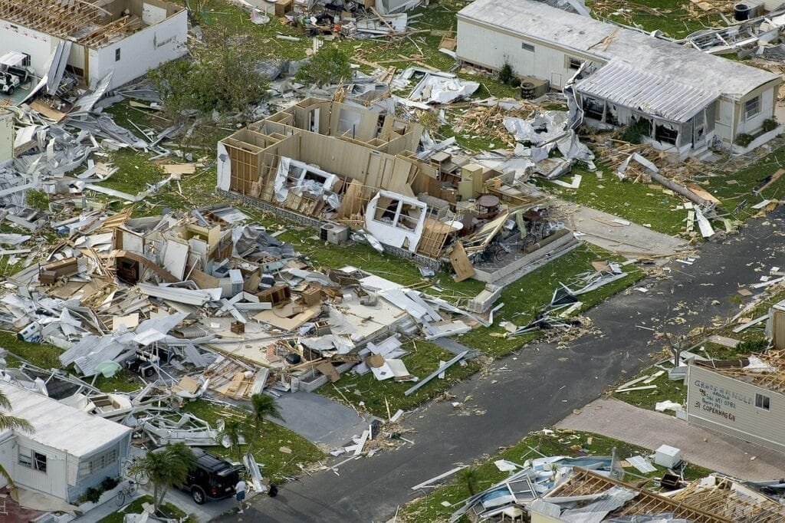

In "Training Techniques for Volcano Disaster Response," you will discover the essential knowledge needed to effectively respond to volcanic disasters. Volcanoes can be both awe-inspiring and dangerous, and understanding their behavior is crucial in mitigating risks to nearby communities. This article covers the different types of volcanoes, their geographic distribution, eruption causes, hazards, and benefits. With this context in mind, we will explore the five best practices for training individuals in volcano disaster response. Whether you are a first responder, a community leader, or simply interested in learning more about volcanoes, this article will provide valuable insights that can be applied in real-world situations. So, let's dive into the world of volcano disaster response training together!

<iframe width="560" height="315" src="https://www.youtube.com/embed/g1BIsRva-cI" frameborder="0" allow="accelerometer; autoplay; encrypted-media; gyroscope; picture-in-picture" allowfullscreen></iframe>

  

## Understanding Volcanic Hazards

Volcanoes are fascinating natural phenomena but can also pose significant risks to human populations. To effectively respond to volcanic disasters, it is crucial to have a solid understanding of volcanic hazards. This section will explore the different types of volcanoes and the recognition of warning signs and alerts.

### Different Types of Volcanoes

Volcanoes come in various shapes and sizes, each with its own unique characteristics. The two primary [types of volcanoes are stratovolcanoes and shield](https://magmamatters.com/understanding-volcanic-formation-a-comprehensive-guide/ "Understanding Volcanic Formation: A Comprehensive Guide") volcanoes.

Stratovolcanoes, also known as composite volcanoes, are steep-sided mountains formed by alternating layers of lava flows, volcanic ash, and other volcanic materials. These volcanoes are known for their explosive eruptions as a result of the high viscosity of the magma. Mount Vesuvius in Italy and Mount St. Helens in the United States are notable examples of stratovolcanoes.

On the other hand, shield volcanoes have a broad, gently sloping profile and are primarily formed by the accumulation of thin, runny lava flows. These volcanoes have non-explosive eruptions and are characterized by their calm and effusive nature. Mauna Loa in Hawaii is one of the world's largest shield volcanoes.

### Recognition of Volcanic Warning Signs and Alerts

In order to mitigate the risks associated with volcanic eruptions, it is crucial to be able to recognize the warning signs and respond quickly. Volcanic warning signs can include [increased seismic activity](https://magmamatters.com/the-art-and-science-of-volcano-monitoring/ "The Art and Science of Volcano Monitoring"), ground deformation, changes in gas emissions, and surface temperature anomalies. Monitoring these indicators can help scientists predict volcanic activity and issue timely warnings to at-risk communities.

Government agencies and scientific institutions play a vital role in disseminating volcanic alerts. These alerts inform the public about the potential hazards and advise on necessary precautions. It is essential for individuals and communities to stay informed and heed these warnings to ensure their safety.

## Basics of Disaster Response

When it comes to disaster response, every second counts. Understanding the concept of disaster response and implementing best practices is crucial for effective management of volcanic eruptions. This section will explore the fundamentals of disaster response and the impact and aftermath of a volcanic eruption.

### Defining the Concept of Disaster Response

Disaster response refers to the coordinated efforts and actions taken by individuals, organizations, and governments to address the immediate needs of affected communities in the aftermath of a disaster. The primary goal of disaster response is to save lives, alleviate suffering, and minimize the impact of the disaster.

In the case of volcanic eruptions, disaster response involves various activities such as search and rescue operations, evacuation planning, providing medical attention and shelter, and ensuring the provision of basic needs like food, water, and sanitation.

### Best Practices in Disaster Response Training

Training plays a critical role in disaster response preparedness. It helps responders develop the necessary knowledge, skills, and competencies to effectively manage the challenges posed by volcanic disasters. Some best practices in disaster response training include:

1. Multi-agency cooperation: Collaboration between different governmental and non-governmental agencies is essential for a coordinated and effective response. Training exercises should simulate multi-agency collaboration to improve coordination and communication.
    
2. Simulations and drills: Practical disaster simulations, such as table-top exercises and live-action drills, provide responders with hands-on experience and help them familiarize themselves with emergency protocols. These simulations also assist in identifying any gaps in response plans and facilitate improvements.
    
3. Evaluation and feedback: After conducting simulations and drills, it is crucial to evaluate and provide feedback to responders. This feedback loop helps identify areas for improvement and ensures continuous learning and refinement of response strategies.
    

### Understanding the Impact and Aftermath of a Volcanic Eruption

The impact of a volcanic eruption can be devastating, with immediate and long-term consequences for both human and natural systems. The immediate impacts can include ashfall, pyroclastic flows, lahars (mudflows), and toxic gas emissions, which pose significant risks to human health and infrastructure.

In the aftermath of a volcanic eruption, communities face the challenges of infrastructure damage, loss of homes and livelihoods, and potential long-term environmental impacts. Displaced populations require shelter, access to healthcare, and mental health support. Recovery efforts focus on providing immediate relief, rebuilding infrastructure, and restoring livelihoods.

Understanding the impact and aftermath of a volcanic eruption helps inform disaster response planning and ensure that resources and support are efficiently allocated to affected communities.

This image is property of pixabay.com.

## Risk Assessment and Planning

To effectively respond to volcanic disasters, it is crucial to assess potential volcanic hazards and develop contingency plans. This section will explore strategies for assessing volcanic hazards, creating contingency plans, and identifying high-risk areas and communities.

### Strategies for Assessing Potential Volcanic Hazards

Assessing potential volcanic hazards involves understanding the past eruption history of a volcano, monitoring current volcanic activity, and analyzing the physical and chemical characteristics of the volcano. This information helps scientists and disaster management agencies predict the likelihood and potential impacts of future eruptions.

Some strategies for assessing potential volcanic hazards include:

1. Volcano monitoring: Continuous monitoring of volcanic activity, including seismic activity, gas emissions, ground deformation, and thermal anomalies, provides valuable data for hazard assessment.
    
2. Historical data analysis: Studying the past eruption history of a volcano helps identify recurring patterns and potential hazards associated with specific eruption types.
    
3. Modeling and simulations: Using computer models and simulations, scientists can predict the potential pathways of volcanic ash clouds, pyroclastic flows, and lahars. This information aids in the development of evacuation plans and resource allocation.
    

### Creation of Contingency Plans for Various Disaster Scenarios

Developing comprehensive contingency plans is essential for effective disaster response. Contingency plans outline the actions to be taken in different disaster scenarios, considering factors such as eruption magnitude, population density, and existing infrastructure.

Contingency plans should include:

1. Evacuation routes and shelters: Identifying safe evacuation routes and establishing designated shelters for displaced populations helps ensure a swift and organized evacuation process.
    
2. Resource allocation: Contingency plans should outline the allocation of resources like food, water, medical supplies, and emergency equipment to adequately support affected populations.
    
3. Communication strategies: Establishing effective communication channels between government agencies, responders, and the public is crucial for issuing timely warnings, providing updates, and coordinating response efforts.
    

### Identifying High-Risk Areas and Communities

Identifying high-risk areas and communities is a critical part of disaster response planning. This involves assessing factors such as proximity to volcanoes, population density, infrastructure vulnerability, and socio-economic characteristics.

High-risk areas and communities may require additional preparedness measures, such as:

1. Early warning systems: Installing early warning systems, such as sirens or alert apps, in high-risk areas can help ensure that residents receive timely warnings and can take appropriate actions.
    
2. Vulnerable populations: Identifying vulnerable populations, such as the elderly, children, or individuals with disabilities, is crucial for planning targeted assistance and support during evacuation and recovery.
    

By identifying high-risk areas and communities, disaster response efforts can be focused, ensuring that resources and support are allocated where they are most needed.

## Emergency Preparedness

When disaster strikes, being prepared can make all the difference. This section will cover essential emergency skills training, the development of evacuation plans, and planning for the provision of basic needs.

### Essential Emergency Skills Training

Emergency skills training equips individuals and communities with the necessary knowledge and skills to respond effectively during a disaster. Some essential emergency skills training includes:

1. First aid and medical training: Basic first aid and medical training enable individuals to provide immediate care to injured individuals until professional medical help arrives.
    
2. Search and rescue techniques: Training individuals in search and rescue techniques helps them safely locate and extract individuals trapped or injured in disaster situations.
    
3. Fire safety and extinguisher training: Knowing how to prevent fires and operate fire extinguishers can help individuals mitigate the risk of fires during a volcanic eruption.
    

### Development of Evacuation Plans

During a volcanic eruption, the safe and orderly evacuation of affected populations is crucial. Developing evacuation plans helps ensure that everyone knows what to do, where to go, and how to stay safe.

Evacuation plans should consider factors such as:

1. Evacuation routes: Identifying and marking clear evacuation routes is essential to guide individuals to safe locations away from the hazardous zones.
    
2. Shelter locations: Designating shelters away from the hazardous areas provides displaced populations with a safe place to seek refuge during the eruption.
    
3. Transportation arrangements: Coordinating transportation arrangements, such as buses or boats, for evacuees who do not have access to private vehicles ensures that everyone can evacuate safely.
    

### Planning for Provision of Basic Needs – Food, Medical Attention, Shelter

Ensuring the provision of basic needs is crucial during a volcanic eruption. Displaced populations often require access to food, medical attention, and shelter. Planning for these necessities ahead of time helps prevent shortages and ensures that affected communities receive the support they need.

Emergency preparedness plans should consider:

1. Emergency food supplies: Establishing emergency food distribution centers or stockpiling non-perishable food items ensures that affected populations have access to adequate nutrition during the initial stages of the disaster.
    
2. Medical support: Coordinating medical teams, setting up temporary medical facilities, and stockpiling medical supplies helps ensure that individuals receive timely medical attention and treatment.
    
3. Emergency shelters: Identifying suitable locations for emergency shelters and pre-staging supplies like blankets, bedding, and hygiene kits ensures that displaced populations have a safe and comfortable place to stay.
    

By planning for the provision of basic needs, emergency responders can mitigate the immediate suffering of affected populations and help them begin the recovery process.

This image is property of pixabay.com.

## Communication and Information Management

Effective communication during a volcanic disaster is vital for disseminating accurate information, issuing warnings, and coordinating response efforts. This section will explore methods for effective communication, information distribution, and leveraging technology for information management.

### Effective Communication During a Disaster

Clear and timely communication is crucial during a volcanic disaster to ensure that the public receives accurate information and knows how to stay safe. Effective communication practices during a disaster include:

1. Public education campaigns: Engaging with the public through educational initiatives and awareness programs helps disseminate essential information about volcanic hazards, evacuation procedures, and emergency contacts.
    
2. Multi-channel communication: Utilizing multiple communication channels, such as radio, television, social media, and mobile apps, helps reach a wider audience and ensures that information is accessible to different segments of the population.
    
3. Language and cultural considerations: Recognizing the linguistic and cultural diversity of affected populations and providing information in their native languages facilitates better understanding and compliance with safety instructions.
    

### Information Distribution Methods

Distribution and dissemination of accurate and timely information are critical components of disaster response. Some effective information distribution methods include:

1. Official press releases: Issuing official press releases through credible sources, such as government agencies or scientific institutions, helps ensure that accurate information reaches the public and avoids unnecessary panic or misinformation.
    
2. Public briefings: Conducting regular public briefings, either in-person or through live-streamed sessions, allows government officials and experts to update the public on the latest developments and provide guidance on safety measures.
    
3. Community engagement: Engaging with local community leaders, organizations, and influencers helps facilitate information dissemination at the grassroots level and ensures that communities receive relevant and accurate information.
    

### Leveraging Technology for Information Management During Disasters

In today's digital age, technology plays a crucial role in information management during disasters. Some ways technology can be leveraged for effective information management during volcanic disasters include:

1. Mobile applications: Developing mobile applications that provide real-time updates, emergency contact information, and evacuation routes helps individuals access information quickly and stay informed even during connectivity disruptions.
    
2. Social media platforms: Utilizing social media platforms like Twitter, Facebook, and Instagram can help disseminate important updates, safety instructions, and emergency contact information to a large audience.
    
3. Web-based platforms: Creating web-based platforms that centralize critical information, disaster maps, and educational resources can serve as a one-stop resource for individuals seeking information during a volcanic disaster.
    

By leveraging technology, disaster response agencies can ensure that accurate and up-to-date information is accessible to affected populations, enabling them to make informed decisions and stay safe.

## Coordination with Local and International Agencies

Coordinating with local and international agencies is crucial for effective disaster response. This section will explore the importance of engaging with community-based organizations and NGOs, collaborating with national and international disaster management bodies, and establishing inter-agency relations before a disaster occurs.

### Engaging with Community-Based Organizations & NGOs

Community-based organizations and non-governmental organizations (NGOs) play a vital role in disaster response. Engaging with these organizations helps leverage their local knowledge, resources, and networks to support affected communities. Some ways to engage with community-based organizations and NGOs include:

1. Collaboration and information sharing: Regular communication and collaboration with community-based organizations and NGOs can help share information, identify community needs, and establish partnerships for effective response.
    
2. Volunteer recruitment and training: Involving community-based organizations and NGOs in the recruitment and training of volunteers helps build local capacity and ensures that individuals from affected communities are actively involved in the response efforts.
    
3. Targeted support: Collaborating with community-based organizations and NGOs allows for the targeted delivery of relief supplies, medical services, and psychological support to specific communities that may require specialized assistance.
    

### Collaboration with National and International Disaster Management Bodies

In addition to working with local organizations, collaboration with national and international disaster management bodies is essential for effective disaster response. Some benefits of collaborating with these bodies include:

1. Access to expertise and resources: National and international disaster management bodies have specialized knowledge, resources, and experience in responding to various types of disasters. Collaborating with them can enhance the effectiveness and efficiency of response efforts.
    
2. Coordinated response planning: Sharing information, coordinating response plans, and aligning strategies with national and international disaster management bodies helps ensure a synchronized response and avoids duplication of efforts.
    
3. Resource mobilization: Collaborating with national and international agencies facilitates resource mobilization, including financial assistance, equipment, and humanitarian aid, to support response efforts at a larger scale.
    

### Importance of Establishing Inter-Agency Relations Before a Disaster

Establishing inter-agency relations before a disaster occurs is crucial for effective coordination during response operations. By building relationships and strengthening communication channels ahead of time, agencies can ensure a faster and more efficient response. Some key steps for establishing inter-agency relations before a disaster include:

1. Memorandums of Understanding (MOUs): Developing MOUs between different agencies outlines the roles, responsibilities, and coordination mechanisms during a disaster. This helps establish clear expectations and streamline collaboration.
    
2. Regular meetings and training exercises: Conducting regular meetings and joint training exercises between different agencies fosters familiarity, understanding, and collaboration, improving the overall response capacity.
    
3. Information sharing platforms: Creating platforms for information sharing between agencies, such as online portals or shared databases, facilitates efficient communication and enables a centralized view of response operations.
    

By proactively establishing inter-agency relations, disaster response agencies can enhance their coordination, response capacity, and overall effectiveness in managing volcanic disasters.

This image is property of pixabay.com.

## Simulating Disaster Scenarios

Training individuals and agencies to respond effectively to volcanic disasters requires practical experience. This section will explore the value of practical disaster simulations in training, conducting table-top and live-action drills, and evaluating and providing feedback from simulations.

### Value of Practical Disaster Simulations in Training

Practical disaster simulations are invaluable in preparing responders for the real-life challenges they may face during a volcanic eruption. These simulations recreate realistic disaster scenarios, allowing individuals to apply their knowledge and skills in a controlled environment.

Some benefits of practical disaster simulations include:

1. Real-time decision-making: Simulations provide individuals with the opportunity to make critical decisions in real-time, helping them develop effective decision-making skills under pressure.
    
2. Team collaboration and coordination: Simulations encourage teamwork and collaboration among responders, mimicking the multi-agency coordination required during a disaster.
    
3. Identification of weaknesses and gaps: Simulations help identify weaknesses and gaps in response plans, standard operating procedures, and individual competencies. This information enables organizations to make improvements and strengthen their response strategies.
    

### Conducting Table-Top and Live-Action Drills

There are various approaches to conducting disaster simulations, with table-top exercises and live-action drills being two common methods.

Table-top exercises involve participants gathering in a simulated emergency response setting and discussing hypothetical scenarios and response strategies. This approach facilitates discussion, decision-making, and problem-solving in a controlled environment.

Live-action drills, on the other hand, involve physically executing response actions based on a simulated scenario. These drills provide responders with hands-on experience and allow them to practice skills, test equipment, and identify any operational challenges.

Both approaches have their merits and can be used in combination to provide a comprehensive training experience.

### Evaluation and Feedback from Simulations

Evaluation and feedback are crucial components of disaster simulations. After conducting simulations, it is important to evaluate the performance of individuals and teams and provide constructive feedback to facilitate learning and improvement.

Evaluation can be carried out through:

1. Observation and documentation: Observers can document the actions, decisions, and communication of participants during the simulation. This documentation serves as a reference for evaluating performance and identifying strengths and areas for improvement.
    
2. Debriefing sessions: Holding debriefing sessions after simulations allows participants to reflect on their performance and discuss their experiences. Facilitators can provide feedback, highlight best practices, and collectively identify areas for improvement.
    
3. After-action reports: Compilation of after-action reports summarizing the key observations, lessons learned, and recommendations from simulations helps document the outcomes and serves as a guide for future training and response planning.
    

By conducting thorough evaluations and providing feedback, disaster response agencies can continuously learn from simulations and refine their strategies, ultimately improving their preparedness and response capabilities.

## Post-Disaster Recovery Training

Disaster recovery extends far beyond the immediate response phase. It is essential to understand the recovery process, provide training on mental health and trauma coping mechanisms, and develop long-term recovery and rebuilding strategies.

### Understanding the Disaster Recovery Process

The disaster recovery process involves the reconstruction and restoration of affected communities after a volcanic eruption. Some key aspects of the recovery process include:

1. Damage assessment: Conducting comprehensive damage assessments to determine the extent of the impact and prioritize recovery efforts.
    
2. Community engagement: Involving affected communities in the recovery process, seeking their input and participation, to ensure that the rebuilding efforts reflect their needs and preferences.
    
3. Infrastructure and economic recovery: Rehabilitating damaged infrastructure, restoring basic services, and implementing economic recovery programs to support the revival of local economies.
    

Understanding the recovery process helps guide training initiatives and ensures that response efforts seamlessly transition into long-term recovery activities.

### Training on Mental Health and Trauma Coping Mechanisms

Disasters often have profound psychological effects on survivors. Training individuals to provide psychological support and coping mechanisms is essential for addressing mental health concerns and promoting resilience. Some key components of mental health and trauma coping training include:

1. Psychological first aid: Equipping individuals with basic psychological first aid skills helps them provide immediate support and comfort to individuals experiencing distress.
    
2. Trauma-informed care: Training responders to recognize the signs of trauma and provide trauma-informed care promotes healing and leads to better long-term outcomes for survivors.
    
3. Self-care for responders: Providing training on self-care strategies and stress management techniques helps responders cope with the emotional demands of their role and maintain their own well-being.
    

By prioritizing mental health training, disaster response agencies can ensure the holistic well-being of affected populations and responders.

### Long-Term Recovery and Rebuilding Strategies

Long-term recovery and rebuilding efforts aim to restore communities to their pre-disaster state or even strengthen their resilience against future disasters. Developing long-term recovery and rebuilding strategies involves:

1. Participatory planning and engagement: Engaging affected communities in long-term recovery planning helps ensure that their voices are heard and that the rebuilding process aligns with their needs and aspirations.
    
2. Sustainable infrastructure and risk reduction measures: Incorporating risk reduction measures into the rebuilding process, such as incorporating hazard-resistant design and promoting sustainable practices, helps mitigate future risks.
    
3. Livelihood restoration: Implementing programs and initiatives that support the revival of local economies, provide income-generating opportunities, and restore livelihoods helps communities recover and rebuild their self-sufficiency.
    

By focusing on long-term recovery and rebuilding strategies, disaster response agencies can help affected communities not only recover but also become more resilient and better prepared for future disasters.

## Continual Learning and Improvement

The field of disaster response is ever-evolving, and it is crucial to continually learn and adapt to improve response efforts. This section will explore adapting training programs based on the latest research, learning from past disaster experiences, and conducting regular knowledge update and refresh sessions.

### Adapting Training Programs Based on Latest Research

Research plays a vital role in shaping effective disaster response strategies. Staying up-to-date with the latest research findings and recommendations helps inform the design and delivery of training programs. Some ways to adapt training programs based on the latest research include:

1. Collaboration with research institutions: Building partnerships with research institutions facilitates collaboration on research projects and allows for the integration of research findings into training initiatives.
    
2. Incorporating lessons learned: Identifying key lessons learned from previous disasters, analyzing case studies, and integrating those insights into training programs helps address recurring challenges and improve response strategies.
    
3. Continuous professional development: Encouraging ongoing professional development among responders, such as attending conferences, workshops, and webinars, helps them stay abreast of the latest research and best practices in disaster response.
    

By adapting training programs based on the latest research, disaster response agencies can ensure that their training initiatives reflect the most current knowledge and effectively prepare responders for future volcanic disasters.

### Learning from Past Disaster Experiences

Learning from past experiences is crucial for continuous improvement in disaster response. Reflecting on previous volcanic disasters and the associated response efforts helps identify areas for improvement and generate insights for better future planning. Some ways to learn from past disaster experiences include:

1. Case studies and post-disaster evaluations: Conducting case studies and post-disaster evaluations allows for a comprehensive analysis of different response strategies, successes, and shortcomings.
    
2. Cross-agency knowledge sharing: Facilitating knowledge sharing between different disaster response agencies enables the exchange of lessons learned and promotes collaborative problem-solving.
    
3. After-action reviews: Conducting after-action reviews following every response operation encourages open and honest discussions among responders, allowing for the identification of strengths and areas for improvement.
    

By learning from past disaster experiences, disaster response agencies can continuously refine their strategies, enhance their response capacities, and better serve affected communities.

### Conducting Regular Knowledge Update and Refresh Sessions

Knowledge and skills can fade over time, making regular knowledge update and refresh sessions crucial for maintaining a high level of readiness. Some ways to conduct knowledge update and refresh sessions include:

1. Refresher courses: Organizing refresher courses on essential disaster response skills helps reinforce knowledge and keep responders' skills sharp.
    
2. Scenario-based exercises: Conducting scenario-based exercises and simulations regularly allows responders to apply their knowledge and skills in different contexts and keeps them prepared for various disaster scenarios.
    
3. Sharing lessons learned: Facilitating forums or platforms for sharing lessons learned from recent volcanic disasters or response operations helps disseminate new knowledge and best practices among responders.
    

By conducting regular knowledge update and refresh sessions, disaster response agencies can ensure that their responders are well-prepared and equipped to face any future volcanic disaster.

## Public Awareness and Education

Public awareness and education are critical components of disaster risk reduction. This section will explore the role of awareness programs in disaster risk reduction, using media effectively for disseminating information, and targeting educational initiatives towards schools, colleges, and community groups.

### Role of Awareness Programs in Disaster Risk Reduction

Awareness programs play a pivotal role in reducing the risks associated with volcanic disasters. By educating the public about volcanic hazards, preparedness measures, and response protocols, awareness programs empower individuals to take proactive steps to protect themselves and their communities.

Some key components of effective awareness programs include:

1. Information dissemination: Distributing educational materials, brochures, and pamphlets that explain volcanic hazards and safety measures helps raise awareness among the public.
    
2. Public campaign and events: Organizing public campaigns and events, such as workshops or exhibitions, provides platforms for interactive learning and engagement with the community.
    
3. School and community outreach: Collaborating with schools, colleges, and community groups to deliver educational sessions and training workshops helps ensure that awareness programs reach the target audience effectively.
    

### Using Media Effectively for Disseminating Information

The media plays a powerful role in disseminating information during volcanic disasters. Harnessing the potential of media channels helps amplify the reach and impact of public awareness campaigns. Some ways to use media effectively for disseminating information include:

1. Press releases and media briefings: Issuing timely and accurate press releases and organizing media briefings helps ensure that accurate information reaches a wider audience through news channels and publications.
    
2. Social media engagement: Harnessing the power of social media platforms allows for interactive communication, the sharing of information, and engaging with the public in real-time.
    
3. Public service announcements: Collaborating with broadcasters and utilizing public service announcements on radio, television, and online platforms effectively disseminates vital information to a broad audience.
    

### Educational Initiatives Targeting Schools, Colleges, and Community Groups

Educational initiatives targeting schools, colleges, and community groups are instrumental in promoting a culture of disaster preparedness and resilience. By incorporating disaster risk reduction into educational curricula and engaging with community groups, the foundations for long-term risk reduction are laid.

Some key components of educational initiatives include:

1. Curriculum integration: Incorporating disaster risk reduction topics into school and college curricula helps build a generation that is both aware of and prepared for volcanic disasters.
    
2. Extracurricular activities: Organizing extracurricular activities, such as competitions, workshops, and clubs focused on disaster preparedness, fosters a culture of resilience and encourages active participation among students.
    
3. Community-based programs: Engaging with community groups, such as neighborhood associations or youth organizations, to deliver specialized training and awareness sessions promotes grassroots-level preparedness and community resilience.
    

By targeting schools, colleges, and community groups, disaster response agencies can effectively instill a sense of responsibility and preparedness among future generations and empower communities to take proactive measures to reduce volcanic risks.

In conclusion, training techniques for volcano disaster response encompass various aspects, from understanding volcanic hazards to coordinating with local and international agencies. By adopting best practices in disaster response training, conducting practical simulations, and fostering continuous learning and improvement, disaster response agencies can enhance their preparedness and ability to mitigate the impact of volcanic disasters. Public awareness and education play a crucial role in reducing volcanic risks and building resilient communities. By disseminating accurate information, using media effectively, and targeting educational initiatives, agencies can empower individuals and communities to take proactive measures in disaster risk reduction. Through collaborative efforts and a commitment to ongoing training and preparedness, we can minimize the impact of volcanic hazards and ensure the safety and well-being of our communities.

