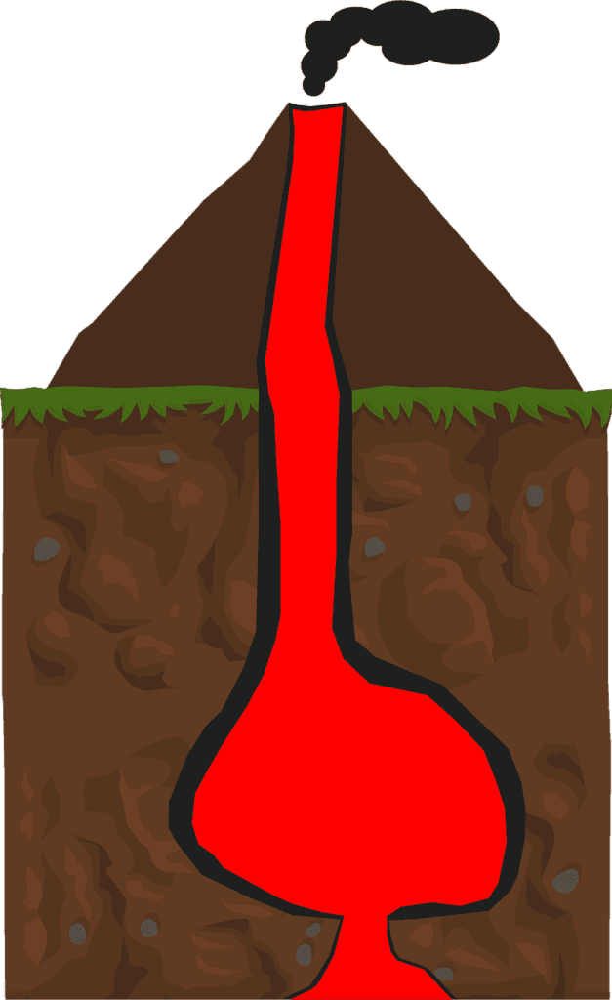

Volcanoes may seem like mysterious forces of nature, but there are actually three key stages that can help us understand their activity. First, the formation stage, where molten rock, gases, and debris rise to the earth's surface, causing eruptions of lava and ash. Next, the eruption stage, where the volcano releases its built-up pressure, resulting in the fiery displays we often associate with volcanoes. Finally, the dormant stage, where the volcano appears inactive, but is still potentially dangerous. By understanding these stages, scientists can monitor volcanic activity and better predict when eruptions may occur, helping to keep communities safe. So let's take a closer look at these stages and gain a deeper understanding of the fascinating world of volcanoes.

<iframe width="560" height="315" src="https://www.youtube.com/embed/LQwZwKS9RPs" frameborder="0" allow="accelerometer; autoplay; encrypted-media; gyroscope; picture-in-picture" allowfullscreen></iframe>

  

## Understanding what Volcanoes are

[Volcanoes are fascinating natural phenomena](https://magmamatters.com/understanding-volcanic-formation-a-comprehensive-guide/ "Understanding Volcanic Formation: A Comprehensive Guide") that have captivated humans for centuries. But what precisely is a volcano? Simply put, a volcano is a vent or opening in the Earth's crust through which molten rock, known as magma, along with gases and debris, is expelled onto the Earth's surface. This process is known as a volcanic eruption.

## Definition of volcanoes

Volcanoes are the result of the movement of tectonic plates and the Earth's internal heat. When these plates collide or separate, it creates weakness in the Earth's crust, allowing magma to rise to the surface. This molten rock, along with gases and solid debris, forms the characteristic cone shape that we associate with volcanoes.

## The role of molten rock, gases, and debris in volcano formation

Molten rock, or magma, is the primary driving force behind volcanic activity. Magma is formed deep within the Earth's mantle and rises to the surface due to its lower density compared to the surrounding rock. As magma ascends, it collects gases, such as water vapor, [carbon dioxide](https://magmamatters.com/geothermal-energy-and-its-volcanic-origins/ "Geothermal Energy and Its Volcanic Origins"), and sulfur dioxide. These gases become trapped within the magma, creating pressure that ultimately leads to an explosive eruption.

Additionally, the volcanic debris, consisting of solid rock particles and ash, plays a crucial role in shaping the volcano's structure. This material is ejected during eruptions and can accumulate around the volcano, forming layers that build up over time.

## How and where volcano eruptions occur

Volcano eruptions can occur in various ways, but they generally fall into two main categories: explosive and effusive eruptions.

Explosive eruptions are characterized by the sudden release of pressure that has been building up within the volcano. This release causes magma and gases to explode violently, ejecting large amounts of volcanic ash, rocks, and debris into the atmosphere.

Effusive eruptions, on the other hand, are less explosive and involve the gradual flow of magma onto the Earth's surface. As the magma reaches the surface, it forms lava flows that can travel long distances, slowly building up the volcano's cone over time.

The location of volcano eruptions is closely tied to plate boundaries and hotspots. Volcanoes commonly occur along subduction zones, where one tectonic plate is forced beneath another. This subduction process creates conditions for the formation of magma and volcanic activity. Hotspots, which are areas of intense volcanic activity, can also give rise to volcanic eruptions. These hotspots are located above plumes of hot material rising from deep within the Earth's mantle.

## Different Types of Volcanoes

Volcanoes exhibit a wide range of forms and characteristics, and scientists have categorized them into various types based on their structure and eruption style.

The 'Ring of Fire' is one of the most well-known types of volcanoes. This term refers to a major area in the basin of the Pacific Ocean where a large number of volcanic eruptions and earthquakes occur. The Pacific Ring of Fire is a result of the movement and interaction of several tectonic plates, making it a highly active volcanic region.

Shield volcanoes, like those found in Hawaii, are another common type. These volcanoes are characterized by their broad, shield-like shape, which is formed by layers of lava flows that gradually accumulate over time. Shield volcanoes are typically associated with effusive eruptions, where lava flows easily and travels far from the vent.

Other types of volcanoes include stratovolcanoes (also known as composite volcanoes), [cinder cones](https://magmamatters.com/the-birth-of-new-land-understanding-cinder-cones/), and calderas. Each type has its own distinctive features and eruption patterns, making them unique and worthy of study.

## Geographical Distribution of Volcanoes

Volcanoes are not evenly distributed across the globe. They tend to occur in specific regions where the conditions for their formation are present. The majority of volcanoes are found along plate boundaries, where tectonic plates interact and collide.

Subduction zones, where one plate is forced beneath another, are particularly prone to volcanic activity. This is because the subducting plate sinks into the Earth's mantle, creating temperatures and pressures that cause the surrounding rock to melt and form magma. The magma then rises to the surface, leading to volcanic eruptions.

Hotspots are another key factor in the distribution of volcanoes. Hotspots are areas where plumes of hot material rise from deep within the Earth's mantle. These plumes can create volcanic activity even in the middle of a tectonic plate, far from any plate boundaries.

The global distribution of volcanoes reveals that they are concentrated primarily along the boundaries of the Pacific Plate, forming the infamous Ring of Fire. This circular belt encompasses the Pacific Ocean and is home to a significant number of active volcanoes and earthquake zones.

This image is property of pixabay.com.

## The impact of tectonic plate movements on volcanoes

Tectonic plate movements have a direct influence on volcanic activity. When tectonic plates collide or move apart, it creates stress and strain within the Earth's crust. This stress can lead to the formation of faults, fractures, and weaknesses that allow magma to rise to the surface, resulting in volcanic eruptions.

Subduction zones, where plates converge and one plate sinks beneath another, are particularly prone to volcanic activity. The subducting plate brings water and other volatiles into the mantle, reducing the melting temperature of the surrounding rock and triggering magma formation.

Plate boundaries where plates move apart, known as divergent boundaries, also give rise to volcanic activity. As the plates separate, magma rises to fill the gap, leading to volcanic eruptions along the rift.

## Born of Volcanic Activity

Volcanic activity is born from a combination of pressure, heat, and the movement of tectonic plates. The internal heat of the Earth, coming from its core, drives geological processes, including the formation and eruption of volcanoes.

Deep within the Earth, the combination of heat and pressure melts rock, creating magma. This molten rock is less dense than the solid surrounding rock, allowing it to rise towards the surface. As it ascends, the pressure decreases, allowing the magma to collect gases and form bubbles within it.

When the pressure becomes too great, or the magma reaches shallow depths, it can explode violently, resulting in an explosive eruption. The gases within the magma rapidly expand, propelling volcanic ash, rocks, and other debris high into the air.

However, not all volcanic eruptions are explosive. Some eruptions are characterized by the slow and steady flow of lava onto the Earth's surface. These eruptions, known as effusive eruptions, occur when the magma is less viscous and does not trap as much gas. The lava flows and spreads over the surrounding terrain, building up the volcano's shape over time.

The viscosity of lava plays a crucial role in determining the eruption style. High viscosity lava, which is thick and sticky, tends to build up pressure within the volcano, resulting in explosive eruptions. In contrast, low viscosity lava flows more easily and tends to produce less explosive eruptions.

## The different eruption patterns of volcanoes

Volcanoes exhibit a wide range of eruption patterns, ranging from explosive to more gradual and effusive. The eruption pattern depends on various factors, such as the viscosity of the magma, the gas content, and the presence of any structural weaknesses in the volcano.

Explosive eruptions are characterized by the sudden release of built-up pressure within the volcano. This rapid release leads to a violent explosion, sending volcanic ash, rocks, and gas high into the atmosphere. These eruptions can have wide-ranging effects, from devastating nearby areas to impacting global climate patterns.

Effusive eruptions, on the other hand, involve the slow flow of lava onto the Earth's surface. The lava oozes out of the volcano's vent and gradually spreads out, forming lava flows. These eruptions tend to be less explosive but can still cause significant damage due to the sheer volume of lava released.

The eruption pattern of a volcano can vary over time, with periods of relative calm followed by periods of increased activity. Monitoring the eruption pattern of a volcano is crucial for understanding its behavior and predicting future eruptions.

## The influence of lava viscosity and gas content in eruption patterns

The viscosity of lava, or its resistance to flow, plays a significant role in determining the eruption pattern of a volcano. Lava viscosity depends on factors such as temperature, composition, and gas content. Lava with high viscosity tends to be thick and sticky, making it more difficult for gases to escape.

When high viscosity lava erupts, gases become trapped within the magma, building up pressure. Eventually, the pressure becomes too great, leading to explosive eruptions. These eruptions can be highly destructive, generating ash clouds, pyroclastic flows, and volcanic projectiles.

In contrast, low viscosity lava flows more easily and allows gases to escape more readily. This results in more effusive eruptions, where lava flows slowly and steadily from the volcano's vent. Effusive eruptions tend to be less explosive but can still cause significant damage, especially if the lava flows reach populated areas.

The gas content of magma also influences the eruption pattern. When magma contains a high amount of dissolved gas, such as water vapor and carbon dioxide, it can lead to more explosive eruptions. As the magma rises to the surface, the decrease in pressure causes the gas to rapidly expand, propelling the magma and generating an explosive eruption.

## Volcanic Activity Stages: Stage 1

Volcanic activity occurs in three primary stages, each with its own distinct characteristics. The first stage is the initial or dormant stage, where there are no visible signs of volcanic activity.

During this stage, the volcano is essentially inactive and appears dormant. However, beneath its surface, there may be ongoing geological processes and the accumulation of magma.

Signs suggesting the commencement of volcanic activity during this stage are subtle. Monitoring seismic activity, such as an increase in small earthquakes, can indicate that the volcano is awakening from its dormant state.

Additionally, ground deformations, such as swelling or tilting, may be observed. These deformations result from the movement of magma beneath the surface, causing changes in the shape and elevation of the volcano.

Scientists closely monitor these signs to better understand the volcano's behavior and to predict future eruptions. This monitoring helps provide valuable information to help mitigate the potential risks associated with volcanic activity.

## Volcanic Activity Stages: Stage 2

The second stage of volcanic activity is known as the crisis or active stage. This stage is characterized by escalating volcanic activity, indicating an increased risk of eruption.

During this stage, indicators of volcanic activity become more apparent and pronounced. One of the key indicators is an increase in volcanic earthquakes. These earthquakes result from the movement of magma and the release of gas within the volcano.

Monitoring gas emissions is another crucial aspect of assessing volcanic activity during this stage. Changes in the composition and amount of gases emitted by the volcano, such as an increase in [sulfur dioxide or carbon](https://magmamatters.com/the-art-and-science-of-volcano-monitoring/ "The Art and Science of Volcano Monitoring") dioxide, can signify an impending eruption.

In addition to seismic and gas monitoring, scientists also closely monitor hydrothermal activity. Changes in the temperature and chemistry of the volcano's hydrothermal systems, such as hot springs and geysers, can provide valuable insights into the volcano's activity.

By closely analyzing these indicators and patterns of volcanic activity, scientists can gain a better understanding of when and how a volcano may erupt. This knowledge is crucial for preparing and responding to potential volcanic hazards.

## Volcanic Activity Stages: Stage 3

The third and final stage of volcanic activity is the eruptive or eruption stage. This stage is characterized by the actual eruption of the volcano, with lava, ash, and other materials being ejected from the volcano's vent.

During this stage, the eruption process follows a sequence of events. It begins with the opening of the volcano's vent, allowing magma to rise to the surface. As the magma reaches the surface, it encounters air and rapidly cools, forming solid volcanic material such as ash and rock fragments.

The eruption may involve different types of materials being ejected from the volcano. These materials can include pyroclastic flows, which are dense mixtures of hot ash and gas that flow rapidly down the volcano's slopes, and volcanic bombs, which are large, solid fragments of lava thrown into the air.

The intensity and duration of the eruption can vary greatly depending on factors such as the magma's viscosity, gas content, and the structural characteristics of the volcano. Some eruptions can be relatively short-lived, while others may continue for weeks or even months.

Understanding the eruption process and the types of materials ejected during an eruption is essential for assessing and mitigating the hazards associated with volcanic activity.

## Hazards of Volcanic Activity

Volcanic eruptions can be incredibly destructive natural events, causing profound impacts on communities and the environment. Throughout history, there have been numerous catastrophic volcanic eruptions that have resulted in significant loss of life and property.

One example of a historical natural disaster caused by a volcanic eruption is the eruption of Mount Vesuvius in 79 AD. This eruption buried the Roman cities of Pompeii and Herculaneum under several meters of volcanic ash and rock, preserving them in a remarkable state of preservation.

Volcanic eruptions can also have global implications, affecting climate patterns. When volcanoes erupt, large amounts of ash and gases are released into the atmosphere. The ash can block sunlight, causing a temporary cooling effect on the Earth's surface. Additionally, certain volcanic gases, such as sulfur dioxide, can react with water vapor in the atmosphere to form sulfuric acid aerosols, which can further contribute to cooling.

The potential dangers associated with volcanic eruptions vary depending on the type of eruption. Explosive eruptions, characterized by ash clouds, pyroclastic flows, and volcanic projectiles, pose significant hazards to nearby communities. These eruptions can cause widespread destruction, including the collapse of buildings, infrastructure damage, and the release of toxic gases.

Effusive eruptions, although less explosive, can still be hazardous. Lava flows can move slowly but have the potential to engulf and destroy anything in their path. In addition, volcanic gases emitted during effusive eruptions, such as carbon dioxide, can be harmful or even fatal if inhaled in high concentrations.

Understanding the potential hazards of different types of eruptions is crucial for emergency preparedness and response efforts. By educating communities at risk and implementing appropriate mitigation measures, the risks associated with volcanic activity can be minimized.

## Benefits of Volcanic Activity

While volcanic eruptions can be devastating, they also bring a range of benefits to the natural world. One of the significant advantages of volcanic activity is its ability to enrich the surrounding soil.

Volcanoes produce nutrient-rich volcanic ash, which, when deposited on the ground, enhances the fertility of the soil. This fertile soil is highly beneficial for agriculture, promoting the growth of crops and supporting sustainable farming practices.

In addition to soil enrichment, volcanoes also create unique ecological advantages. The nutrient-rich ash and new mineral deposits resulting from volcanic eruptions create habitats that support diverse plant and animal species. Some plant species are specially adapted to volcanic landscapes and thrive in the mineral-rich soils.

Volcanic eruptions can also play a role in new land formation. Over time, repeated eruptions can build up layers of lava and ash, gradually shaping new landforms and expanding the geographical range of the area.

Studying the benefits of volcanic activity allows us to appreciate the positive aspects of these natural phenomena. By understanding how volcanic eruptions can contribute to the ecosystem and agricultural practices, we can better harness these benefits while minimizing the risks.

## Mitigating Risks of Volcanic Activity

The risks associated with volcanic activity can be mitigated through a combination of understanding, monitoring, and preparedness. By gaining a deep understanding of how volcanoes function and the potential hazards they pose, scientists can develop strategies to minimize risks and protect communities.

One crucial approach in reducing risks is through the continuous monitoring of volcanoes. This monitoring involves measuring various indicators, such as seismic activity, gas emissions, ground deformations, and changes in hydrothermal activity. By closely monitoring these factors, scientists can detect signs of volcanic unrest and provide timely warnings to communities at risk.

In addition to monitoring, [educating communities about volcanic hazards](https://magmamatters.com/the-environmental-impact-of-volcanic-eruptions-2/ "The Environmental Impact of Volcanic Eruptions") and implementing effective emergency response plans are vital steps in reducing the risks. By raising awareness about the potential dangers and providing clear instructions on evacuation procedures, communities can be better prepared to respond to volcanic eruptions.

Furthermore, land-use planning plays a significant role in mitigating volcanic risks. Restricting or regulating development in high-risk areas near volcanoes can help reduce the potential impacts of eruptions. Building infrastructure that is resistant to volcanic hazards, such as ash mitigation systems and improved evacuation routes, can also enhance community resilience.

Ultimately, mitigating the risks of volcanic activity requires a collaborative effort between scientists, government agencies, and communities. By combining scientific knowledge, effective monitoring systems, and preparedness measures, we can safeguard communities near volcanoes and minimize the impacts of future eruptions.

Understanding the 3 Key Stages of Volcanic Activity helps us grasp the complex nature of these incredible geological phenomena. By delving into the various types of volcanoes, their distribution, eruption patterns, hazards, and benefits, we can gain a comprehensive understanding of volcanoes and their impact on our planet. This knowledge allows us to approach volcanoes with respect and appreciation, as well as to mitigate the risks they present to our communities.

