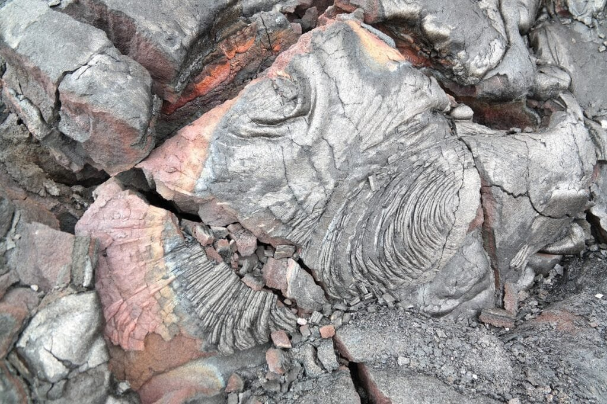
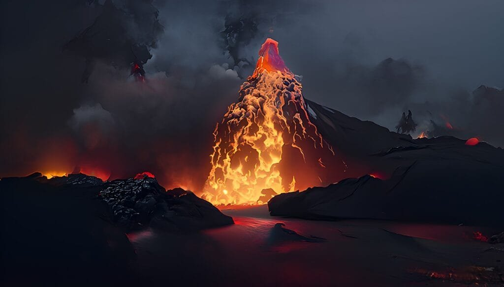

Have you ever wondered how volcanoes are formed? Understanding the 7 stages of volcano formation can provide valuable insight into these powerful geological phenomena. Volcanoes are created when molten rock, gases, and debris escape from beneath the earth's surface, resulting in eruptions of lava and ash. They are typically found at plate boundaries, hotspots, or rift zones where the earth's tectonic plates are moving apart. The famous "Ring of Fire" in the Pacific Ocean is home to many volcanoes due to the collision of these plates. However, not all volcanoes are the same. Some, like the shield volcanoes in Hawaii, form gradually over hotspots and have less explosive eruptions. By studying the different stages of volcano formation, researchers can better predict future activity and mitigate the potentially devastating impacts on surrounding communities. This article aims to provide a comprehensive explanation of the 7 stages of volcano formation, shedding light on the fascinating and often unpredictable world of volcanoes.

This image is property of pixabay.com.

## Stage 1: The Magma Chamber

### Definition and formation of the magma chamber

The magma chamber is a large reservoir beneath the Earth's surface where molten rock, known as magma, accumulates. It forms when magma, generated by the melting of the Earth's mantle rocks, rises through cracks and fractures in the crust and collects in a chamber. As the magma cools and solidifies, it forms igneous rocks.

### Role of the magma chamber in volcano formation

The magma chamber plays a crucial [role in the formation of volcanoes](https://magmamatters.com/the-role-of-volcanoes-in-earths-carbon-cycle-5/ "The Role Of Volcanoes In Earth’s Carbon Cycle"). It acts as a storage space for magma, allowing it to accumulate over time. As the magma chamber fills, the pressure increases, eventually leading to volcanic eruptions. The size and strength of the magma chamber determine the scale and intensity of the volcanic activity.

### Impact of pressure and temperature on the magma chamber

The pressure and temperature within the magma chamber have a significant impact on volcanic activity. As the magma accumulates, the pressure builds up within the chamber. When the pressure exceeds the strength of the overlying rocks, it triggers an eruption, causing the magma to be expelled onto the Earth's surface. Additionally, higher temperatures in the magma chamber can increase the fluidity of the magma, influencing the eruption style and the type of volcanic rocks formed.

## Stage 2: The Pipe or Vent

### Description of the volcano pipe or vent

The pipe or vent of a volcano is a channel that connects the magma chamber to the surface of the Earth. It serves as a pathway for the magma to reach the surface during an eruption. The pipe is typically narrow and cylindrical in shape, allowing the magma to ascend rapidly.

### How magma reaches the surface through the pipe

When pressure within the magma chamber becomes too high, the magma begins to rise through the pipe towards the surface. This ascent is driven by the buoyancy of magma, which is less dense than the surrounding rocks. As the magma moves upwards, it may encounter obstacles, such as solidified magma or rock layers, which can create pressure and lead to explosive eruptions.

### Variations and structure of the pipe in different volcanoes

The structure and characteristics of the [volcano pipe can vary depending on the type](https://magmamatters.com/understanding-volcanic-formation-a-comprehensive-guide/ "Understanding Volcanic Formation: A Comprehensive Guide") of volcano. In some volcanoes, the pipe may be a straight conduit that runs directly from the magma chamber to the surface. In others, it may be more complex, with branching channels and vents. The width and composition of the pipe also differ, influencing the eruptive behavior and style of the volcano.

  

## Stage 3: The Emergence of Volcanic Mountain

### Formation of volcanic mountain due to magma accumulation

As magma continues to erupt through the pipe and reach the Earth's surface, it accumulates layer by layer, forming a volcanic mountain. The repeated eruptions and deposition of volcanic materials such as lava, ash, and pyroclastic flows contribute to the growth of the mountain over time.

### Role of tectonic activities in the emergence of volcanic mountain

Tectonic activities, such as the movement of tectonic plates, play a critical role in the emergence of volcanic mountains. Volcanoes often occur at plate boundaries where plates either collide, move apart, or slide past each other. The interaction between these plates results in the formation of fractures and weak spots in the Earth's crust, providing pathways for magma to reach the surface and form mountains.

### Types of volcanic mountains: stratovolcanoes, shield volcanoes, etc.

Volcanic mountains come in various forms, each with its unique characteristics. Stratovolcanoes, also known as composite volcanoes, are tall and steep mountains built from alternating layers of lava and ash. They are associated with explosive eruptions and often have a symmetrical cone shape. Shield volcanoes, on the other hand, are broad and gently sloping mountains formed by the accumulation of fluid lava flows. They are characterized by their large size and low viscosity lava.

## Stage 4: The Plateau Stage

### Description of the dormant or plateau stage

The dormant or plateau stage is a period of relative inactivity in a volcano's lifecycle. During this stage, the volcano stops erupting and enters a period of rest. The volcano may appear dormant, but the magma chamber beneath the surface remains active.

### Evolution of the volcanic mountain during the plateau stage

During the plateau stage, the volcanic mountain undergoes various geological processes. Weathering and erosion gradually erode the mountain, reshaping its contours. Rivers and streams cut through the volcanic rock, exposing different layers and creating valleys and canyons. Vegetation begins to colonize the slopes, further altering the landscape.

### Examples of volcanoes in plateau stage

One example of a volcano in the plateau stage is Mount Rainier in Washington state, USA. It is a stratovolcano that has not erupted for over 100 years but is still considered an active volcano. Another example is Mount Fuji in Japan, which is also in a dormant state but continues to be monitored for signs of reactivation.

This image is property of pixabay.com.

## Stage 5: Eruption Phase

### Triggering factors for a volcanic eruption

Volcanic eruptions can be triggered by various factors, including the pressure buildup in the magma chamber, the viscosity of the magma, and the presence of volatile gases. The interaction between these factors, along with external influences such as tectonic activity and groundwater, can lead to the sudden release of magma and [volcanic gases](https://magmamatters.com/the-art-and-science-of-volcano-monitoring/ "The Art and Science of Volcano Monitoring").

### Patterns and types of volcanic eruptions

Volcanic eruptions can exhibit different patterns and types. Some eruptions are explosive, characterized by violent ejections of ash, lava bombs, and pyroclastic flows. Others are effusive, with the slow and steady flow of lava. Phreatomagmatic eruptions occur when water comes into contact with magma, resulting in explosive activity fueled by the rapid expansion of steam.

### Role of gas content and magma viscosity in eruption style

The gas content and magma viscosity play a crucial role in determining the eruption style of a volcano. Magma with high gas content and low viscosity tends to produce explosive eruptions, as the gas bubbles rapidly expand and fragmented magma is ejected. In contrast, magma with low gas content and high viscosity leads to more effusive eruptions, where lava flows slowly and accumulates around the volcanic vent.

## Stage 6: Volcano Dormancy

### Definition and causes of volcano dormancy

Volcano dormancy refers to a prolonged period of inactivity during a volcano's lifecycle. It occurs when the volcano has ceased erupting for an extended period but may potentially become active again in the future. The causes of volcano dormancy can vary and include the depletion of magma supply, a decrease in gas pressure, or changes in the underlying tectonic forces.

### Differentiation between dormant and extinct volcanoes

Dormant and extinct volcanoes are often used to describe different stages of volcanic activity. A dormant volcano is one that has not erupted for a significant period but still retains an active magma chamber beneath the surface. In contrast, an extinct volcano is one that is unlikely to erupt again, as it has completely ceased volcanic activity and undergone significant weathering and erosion over time.

### Historical examples of dormant volcanoes that erupted

Mount St. Helens in Washington state, USA, is a famous example of a dormant volcano that erupted after a long period of inactivity. In 1980, it experienced a catastrophic eruption that resulted in the loss of lives and extensive damage to the surrounding area. Another example is Mount Pinatubo in the Philippines, which erupted in 1991 after several centuries of dormancy.

This image is property of pixabay.com.

## Stage 7: Extinction or Cooling

### Process of volcano extinction or cooling

Volcano extinction, also known as cooling, occurs when a volcano's internal heat diminishes, and the magma supply ceases completely. As a result, the volcano becomes dormant for an extended period, leading to significant weathering and erosion. Over time, the volcano cools down, and the associated volcanic activities cease entirely.

### Signs and timeline for a volcano becoming extinct

Signs that a volcano is becoming extinct include the absence of any recent eruptions or volcanic activity, significant erosion of the volcanic cone, and the absence of a functioning magma chamber. The timeline for a volcano to become extinct can vary greatly, ranging from thousands to millions of years, depending on the specific geological conditions and factors affecting the volcano.

### Examples of extinct volcanoes worldwide

Numerous examples of extinct volcanoes exist worldwide. One notable example is Shiprock in New Mexico, USA. It is a volcanic rock formation that was once the throat of an ancient volcano but has since become exposed and eroded over millions of years, leaving behind a dramatic and solitary landmark. Additionally, the Eifel volcanic field in Germany is considered to be extinct, with no volcanic activity occurring there for thousands of years.

## Hazards of Volcanic Eruptions

### Types of hazards associated with volcanic eruptions

Volcanic eruptions pose various hazards to human life and the environment. These hazards include pyroclastic flows, which are fast-moving currents of hot gas, rock fragments, and ash, as well as lahars, which are destructive mudflows triggered by volcanic activity. Other hazards include volcanic ashfall, volcanic gases, and volcanic landslides.

### Case studies of volcanic eruptions causing destruction

Numerous historical volcanic eruptions have caused significant destruction and loss of life. The eruption of Mount Vesuvius in 79 AD resulted in the destruction and burial of the Roman cities of Pompeii and Herculaneum, preserving them for centuries. The 1815 eruption of Mount Tambora in Indonesia is one of the most powerful volcanic eruptions in recorded history, causing widespread global climate abnormalities and resulting in the "Year Without a Summer."

### Preventive measures and risk mitigation strategies

To mitigate the risks associated with volcanic eruptions, various preventive measures and risk mitigation strategies are in place. These include setting up early warning systems to detect volcanic activity, establishing exclusion zones to restrict human settlement near active volcanoes, and educating communities on emergency preparedness and evacuation procedures. Additionally, ongoing monitoring of volcanic activity is essential to assess potential threats and provide timely warnings.

## Benefits of Volcanoes

### Role of volcanoes in land formation

Volcanoes play a vital role in shaping the Earth's surface and forming new land. Through volcanic eruptions, magma rises to the surface and cools, forming igneous rocks. Over time, these volcanic materials accumulate and build up, creating new landmasses and islands. Volcanic activity also contributes to the formation of fertile volcanic soil, which supports the growth of vegetation.

### Volcanic soil and agriculture

Volcanic soil, also known as volcanic ash soil or Andisols, is highly fertile and rich in essential nutrients. The ash and lava deposits from volcanic eruptions break down into fine particles that create a porous and well-draining soil. This soil is ideal for agriculture, as it retains moisture, promotes root development, and provides essential minerals for crop growth. Volcanic regions around the world, such as the Mediterranean and parts of Central America, have highly productive agricultural systems due to volcanic soil.

### Use of geothermal energy from volcanoes

Volcanoes also serve as a valuable source of geothermal energy. Geothermal energy harnesses the heat generated by hot rocks and magma beneath the Earth's surface to generate electricity and heat buildings. In volcanic areas with accessible geothermal resources, such as Iceland and New Zealand, geothermal power plants are used to harness this clean and renewable energy source, reducing reliance on fossil fuels.

## Future of Volcano Monitoring and Prediction

### Current methods and technologies used for volcano monitoring

[Volcano monitoring involves the use of various methods and technologies](https://magmamatters.com/geothermal-energy-and-its-volcanic-origins/ "Geothermal Energy and Its Volcanic Origins") to detect and measure volcanic activity. These include seismometers to record ground vibrations, gas analyzers to measure the composition of volcanic gases, and remote sensing techniques such as satellite imagery and thermal cameras. Ground deformation monitoring, using technologies like GPS and satellite data, is also crucial in assessing volcanic hazards.

### Challenges in predicting volcanic eruptions

Despite advances in volcano monitoring, accurately predicting volcanic eruptions remains a significant challenge. Volcanic systems are highly complex, and eruptions can be influenced by multiple factors, making it difficult to precisely forecast their occurrence. The inherent unpredictability of volcanic processes, coupled with the limitations of existing monitoring techniques, presents challenges for scientists and volcano observatories worldwide.

### Future technologies and research in volcano prediction

Scientists are continually striving to improve volcano prediction through the development of new technologies and research. One area of focus is the advancement of machine learning and artificial intelligence algorithms, which could help identify patterns and indicators of impending volcanic eruptions. Additionally, the integration of multiple monitoring techniques and data sources holds promise in enhancing the accuracy of eruption forecasts. Ongoing research and technological advancements offer hope for better understanding and prediction of volcanic activity in the future.

In conclusion, understanding the stages of volcano formation is essential in comprehending the complex processes that drive volcanic activity. From the formation of magma chambers and volcanic pipes to the emergence of volcanic mountains and the eruption phase, each stage contributes to the dynamic nature of volcanoes. The dormant and extinct stages highlight the cyclical nature of volcanic activity, while the hazards and benefits associated with eruptions underscore the need for effective risk mitigation strategies. As we continue to monitor and study volcanoes, advancements in technology and research hold the key to improving volcano prediction and reducing the potential impact of future eruptions.

Related Posts: [Mitigating Risks: Forecasting Volcanic Activity in Prone Areas](https://magmamatters.com/mitigating-risks-forecasting-volcanic-activity-in-prone-areas/), [The Formation and Eruption Patterns of Volcanoes](https://magmamatters.com/the-formation-and-eruption-patterns-of-volcanoes-4/), [The Pyroclastic Phenomena of Pompeii: 7 Insights to Explore](https://magmamatters.com/the-pyroclastic-phenomena-of-pompeii-7-insights-to-explore/), [Tips for Capturing Volcano Pyroclastic Flow Photos](https://magmamatters.com/tips-for-capturing-volcano-pyroclastic-flow-photos/), [Understanding Volcanoes and Their Eruption Patterns](https://magmamatters.com/understanding-volcanoes-and-their-eruption-patterns/)
