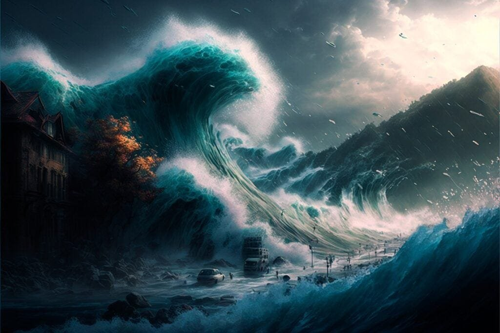

Imagine standing on the shores of a beautiful beach, enjoying the sun and the sound of the crashing waves. Suddenly, you receive a tsunami warning. Panic ensues as people scramble to higher ground. But have you ever wondered what causes these tsunami warnings from submarine volcano eruptions? In this article, we will explore the fascinating world of volcanoes, their eruption patterns, and the triggers that lead to tsunami warnings. By understanding these causes and triggers, we can better prepare for future volcanic activity and keep our coastal communities safe from the devastating effects of tsunamis. So, let's dive into the depths of this topic and uncover the secrets of submarine volcano eruptions!

This image is property of pixabay.com.

## Definition of Tsunami

### Understanding the term 'tsunami'

A tsunami, also known as a seismic sea wave, is a natural phenomenon that occurs when there is a sudden disturbance in the ocean floor. It is usually caused by an underwater earthquake, volcanic eruption, or landslide, which displaces a large volume of water and creates a series of powerful waves. These waves can travel across the ocean at high speeds and cause significant destruction when they reach the shoreline.

### How tsunamis form: the role of submarine earthquakes

Submarine earthquakes are one of the primary causes of tsunamis. When tectonic plates beneath the ocean floor shift and release large amounts of energy, it creates seismic waves that propagate through the water. These seismic waves then evolve into tsunami waves as they travel towards the coastlines. The magnitude and depth of the earthquake play a crucial role in determining the size and intensity of the resulting tsunami.

### Tsunamis vs. Regular Waves: Key Differences

Tsunamis are distinct from regular waves in several ways. Unlike ordinary ocean waves, which are formed by the wind, tsunamis are generated by the displacement of a large volume of water. This displacement creates massive waves that are capable of traveling vast distances across the ocean. Unlike normal waves that break closer to the shoreline, tsunamis can maintain their energy and height as they approach the coast, resulting in a more powerful and destructive impact.

## Linking Volcano Eruptions and Tsunamis

### Submarine volcanic eruptions and the role they play in tsunami genesis

Submarine volcanic eruptions can also trigger tsunamis. When a volcano located beneath the ocean erupts, it releases gases, magma, and debris into the surrounding water. This sudden ejection of material creates a disturbance on the ocean's surface, displacing water and generating tsunami waves. The size and magnitude of the resulting tsunami depend on various factors, including the depth and intensity of the eruption.

### Historical incidents linking tsunami and volcano eruptions

Throughout history, numerous incidents have shown a clear link between volcano eruptions and tsunamis. One notable example is the eruption of Krakatoa in 1883, which triggered a series of massive tsunamis that caused widespread devastation in the surrounding regions. Similarly, the eruption of Mount St. Helens in 1980 resulted in a landslide that generated a localized tsunami in Spirit Lake. These historical events emphasize the significant role that volcano eruptions can play in the formation of tsunamis.

This image is property of pixabay.com.

## The Anatomy of Submarine Volcanoes

### The formation of submarine volcanoes

Submarine volcanoes are volcanic structures that are located beneath the surface of the ocean. They are formed when magma rises from the Earth's mantle and erupts through weak points in the oceanic crust. As the lava cools and solidifies, it builds up layers of volcanic rock, eventually forming a submerged volcano. These volcanoes can have similar characteristics to their terrestrial counterparts, such as a central vent, cone, and crater.

### Identifying active and dormant submarine volcanoes

Identifying active and dormant submarine volcanoes is a challenging task due to their location underwater. Scientists use various techniques to monitor volcanic activity, including sonar mapping, satellite imagery, and seismic monitoring. By studying the patterns of [seismic activity](https://magmamatters.com/the-art-and-science-of-volcano-monitoring/ "The Art and Science of Volcano Monitoring") and volcanic gas emissions, researchers can determine whether a submarine volcano is currently active or dormant. This information is essential for assessing the potential risks of a volcanic eruption and its potential to trigger a tsunami.

### Understanding the eruption pattern of submarine volcanoes

Submarine volcanoes have different eruption patterns compared to their terrestrial counterparts. Since they are located underwater, the interaction between magma and water plays a crucial role in determining the eruption style. Submarine volcanic eruptions can range from effusive (slow lava flow) to explosive (violent ejection of magma and gas). Understanding the eruption pattern of submarine volcanoes is vital for predicting the associated tsunami hazards and implementing appropriate mitigation measures.

## The 'Ring of Fire' and Tsunamis

### Geographical characteristics of the 'Ring of Fire'

The 'Ring of Fire' is a major area in the basin of the Pacific Ocean where a large number of earthquakes and volcanic eruptions occur. It is a direct result of plate tectonics and the movement and collisions of lithospheric plates. The 'Ring of Fire' encompasses several tectonic plate boundaries, including the Pacific Plate, the Philippine Sea Plate, and the Juan de Fuca Plate. This geologically active region is known for its high seismic and volcanic activity, making it more susceptible to tsunamis.

### Highlighted incidents of tsunamis in the 'Ring of Fire'

The 'Ring of Fire' is infamous for experiencing numerous tsunamis throughout history. One of the most devastating tsunamis occurred in 2004 off the coast of Sumatra, triggered by a massive underwater earthquake. This event resulted in widespread destruction and loss of life in multiple countries surrounding the Indian Ocean. Additionally, the Fukushima tsunami in 2011, caused by an undersea earthquake off the coast of Japan, demonstrated the catastrophic impact tsunamis can have on coastal communities.

### Submarine volcano distribution in the area

The 'Ring of Fire' also houses a significant number of submarine volcanoes. Due to the high levels of tectonic activity and convergence of plates, magma can easily rise to the surface, resulting in the formation of submarine volcanoes. These underwater volcanic structures contribute to the overall volcanic activity in the region and can potentially trigger tsunamis if they erupt or collapse.

This image is property of pixabay.com.

## The Role of Plate Tectonics in Tsunamis and Volcano Eruptions

### Understanding plate tectonics and their movements

Plate tectonics is the scientific theory that describes the movement and interaction of Earth's lithospheric plates. It explains the formation of earthquakes, volcanic activity, and the creation of mountain ranges. The Earth's crust is divided into several large plates, which are constantly moving and interacting with each other. These plate boundaries are areas of high tectonic activity and can give rise to tsunamis and volcano eruptions.

### The link between plate boundaries and volcano location

Volcanoes are predominantly located along plate boundaries due to the interaction of tectonic plates. There are three main types of plate boundaries: convergent, divergent, and transform. Convergent boundaries, where two plates collide, are particularly conducive to volcano formation. In these zones, one plate subducts beneath the other, allowing magma to rise to the surface, leading to volcanic eruptions. Understanding the relationship between plate boundaries and [volcano](https://magmamatters.com/the-environmental-impact-of-volcanic-eruptions-2/ "The Environmental Impact of Volcanic Eruptions") location is essential for accurately identifying areas at risk of tsunamis and volcanic hazards.

### Tectonic activity and the triggering of tsunamis

Tectonic activity, such as earthquakes and volcanic eruptions, can trigger tsunamis. When there is a sudden rupture along a fault line or a volcano erupts, a significant amount of energy is released. This energy is transferred to the surrounding water, displacing it and generating tsunami waves. The magnitude and location of the tectonic event play a crucial role in determining the size and destructive potential of the resulting tsunami. Monitoring tectonic activity is essential for issuing timely tsunami warnings and ensuring the safety of coastal communities.

## Detecting Submarine Volcano Eruptions

### Techniques employed to monitor underwater volcanoes

Monitoring underwater volcanoes is a complex task due to their location beneath the ocean's surface. Scientists utilize various techniques to detect and monitor submarine volcanic activity. These include remote sensing technologies such as sonar mapping, which allows researchers to create detailed maps of the seafloor and detect any changes indicative of volcanic activity. Additionally, autonomous underwater vehicles (AUVs) equipped with specialized sensors can be deployed to collect data on volcanic gas emissions, temperature, and seismic activity.

### How seismic waves reveal information about underwater eruptions

Seismic waves, generated during underwater volcanic eruptions, provide valuable information about the nature and intensity of the eruption. By analyzing the seismic waves, scientists can determine the depth, magnitude, and duration of the eruption. Seismometers located on land and ocean-based monitoring stations record and analyze these seismic signals, contributing to the understanding of submarine volcanic activity and its potential to trigger tsunamis.

### Utilizing satellite images for monitoring purposes

Satellite imagery plays a crucial role in monitoring submarine volcanoes. Satellite sensors can detect changes in ocean color, temperature, and surface deformation, which may indicate volcanic activity. High-resolution satellite imagery allows scientists to identify key features such as volcanic plumes, surface thermal anomalies, and seafloor topography. This data aids in tracking volcanic eruptions, providing early warning signs, and assessing the potential tsunamigenic hazards associated with submarine volcanoes.

## What Triggers a Tsunami Warning

### The role of seismographic data in triggering alerts

Seismographic data plays a vital role in triggering tsunami warnings. When a significant earthquake occurs, seismometers measure its magnitude and location. This information is essential in assessing the potential for a tsunami to form. By analyzing the seismic data, scientists can estimate the energy released by the earthquake and determine whether it poses a threat of generating a tsunami. Tsunami warning systems utilize this data to issue timely alerts and provide critical information to coastal communities.

### Analyzing sea level changes for early warnings

Sea level changes are another essential factor in determining the need for a tsunami warning. When a tsunami approaches the coastline, it causes a significant increase in sea level. This rise in water level can be detected through tide gauges and other monitoring systems. By continuously monitoring sea level data, scientists can identify abnormal changes that may indicate the presence of a tsunami and issue appropriate warnings to at-risk areas.

### The importance of local vs distant tsunamis in warnings

Tsunami warnings take into account the distinction between local and distant tsunamis. Local tsunamis are usually triggered by nearby earthquakes and can reach coastal areas within minutes to an hour. In contrast, distant tsunamis originate from seismic events further away and may take several hours to reach coastal regions. Understanding the difference between local and distant tsunamis is crucial for appropriate evacuation measures and issuing targeted warnings, ensuring that at-risk populations have sufficient time to reach safety.

## Mitigation Measures to Handle Tsunami Threats

### Development of early warning systems

The development of early warning systems is a crucial step in mitigating tsunami threats. These systems consist of a network of sensors, including seismometers and tide gauges, that detect earthquake activity and sea-level changes. Once a potential underwater volcanic eruption or earthquake is detected, the data is analyzed, and tsunami warnings are issued to relevant authorities and the public through various communication channels. Early warning systems allow for prompt evacuation and preparedness, minimizing the potential loss of life and damage to coastal communities.

### Educational measures for making communities tsunami-ready

Educational measures play a significant role in making communities tsunami-ready. It is essential to raise awareness about the risks and potential impact of tsunamis, particularly in coastal regions prone to volcanic activity and earthquakes. Informing the public about evacuation routes, emergency shelters, and necessary supplies can help individuals and communities prepare for tsunamis. Additionally, educational initiatives should focus on teaching individuals how to recognize natural warning signs, such as seismic activity, changes in sea level, and unusual animal behavior.

### Case studies of effective tsunami response strategies

Studying case studies of effective tsunami response strategies is crucial for refining mitigation measures. Learning from past experiences and analyzing successful response efforts can help identify best practices and areas for improvement. For example, the devastating Indian Ocean tsunami of 2004 led to significant improvements in early warning systems and evacuation procedures in affected countries. Sharing these case studies and implementing the lessons learned can enhance the overall preparedness and resilience of coastal communities to future tsunamis.

## Role of Climate Change in Tsunami Activity

### Understanding the potential impacts of climate change on tsunamis

Climate change can potentially impact tsunamis in various ways. Rising sea levels caused by global warming increase the vulnerability of coastal areas to tsunamis, as a smaller amount of wave energy is required to cause significant inundation. Additionally, changes in weather patterns can affect the frequency and intensity of storms, which in turn may result in an increased likelihood of tsunami-generating events, such as underwater landslides. [Understanding the potential impacts of climate change](https://magmamatters.com/understanding-volcanic-formation-a-comprehensive-guide/ "Understanding Volcanic Formation: A Comprehensive Guide") on tsunamis is crucial for effective mitigation and adaptation strategies.

### Examples of climate-induced changes in underwater volcanism

[Climate change can also influence underwater volcanism](https://magmamatters.com/geothermal-energy-and-its-volcanic-origins/ "Geothermal Energy and Its Volcanic Origins"), thus affecting the potential for tsunami generation. Increased heat accumulation in the Earth's system due to global warming can lead to changes in magma production and the behavior of submarine volcanoes. This can potentially alter eruption patterns, resulting in more frequent or larger volcanic events that have the potential to trigger tsunamis. Studying examples of climate-induced changes in underwater volcanism can provide insights into the connection between climate change and tsunamis.

### Predicting future tsunami risks in light of climate change

Predicting future tsunami risks in light of climate change requires comprehensive research and analysis. Scientists use advanced modeling techniques to simulate different scenarios and assess the potential impacts of climate change on tsunami occurrence. These models consider factors such as sea level rise, changes in volcanic activity, and alterations in storm patterns. By understanding how climate change may impact tsunami risks, policymakers and communities can implement appropriate measures to reduce vulnerability and enhance resilience.

## The Aftermath of Tsunamis and Volcano Eruptions

### Impacts on human life and economy

Tsunamis and volcano eruptions can have severe impacts on human life and the economy. These natural disasters can result in the loss of thousands of lives, displacement of populations, and destruction of infrastructure, including homes, businesses, and critical facilities. The recovery process can be lengthy and costly, requiring extensive efforts to rebuild communities and restore the economy. Additionally, the psychosocial impacts on survivors and affected communities must also be addressed in the aftermath of these disasters.

### Environmental outcomes: Soil fertility and marine life effects

The environmental outcomes of tsunamis and volcano eruptions can have long-lasting effects on ecosystems. Tsunamis carry vast amounts of sediment and debris, which can drastically alter soil fertility and agricultural productivity in coastal areas. Furthermore, the sudden release of volcanic gases and the deposition of volcanic ash can affect air quality and disrupt marine ecosystems. The death and displacement of marine organisms can have ripple effects throughout the food chain, impacting fisheries and biodiversity.

### Rehabilitation and recovery efforts post-disaster

Rehabilitation and recovery efforts are critical in the post-disaster phase. These efforts involve providing immediate relief to affected communities, including emergency shelter, clean water, food, and medical assistance. As the initial emergency response transitions into long-term recovery, efforts focus on rebuilding infrastructure, restoring services, and supporting the recovery of affected populations. Community participation, strong governance, and international support play essential roles in ensuring the success of rehabilitation and recovery efforts following tsunamis and volcano eruptions.

In conclusion, understanding the causes and triggers of tsunami warnings from submarine volcano eruptions is essential for reducing the risks and impacts of these devastating natural events. By comprehending the processes behind tsunamis, the relationship between volcano eruptions and tsunamis, and the role of plate tectonics, scientific advancements and mitigation measures can be implemented. Through the development of early warning systems, educational initiatives, and effective response strategies, coastal communities can become more prepared and resilient in the face of future tsunami threats. Additionally, considering the potential impacts of climate change on tsunamis and the importance of rehabilitation and recovery efforts post-disaster, holistic approaches are necessary for mitigating risks and promoting sustainable development in tsunami-prone regions.

