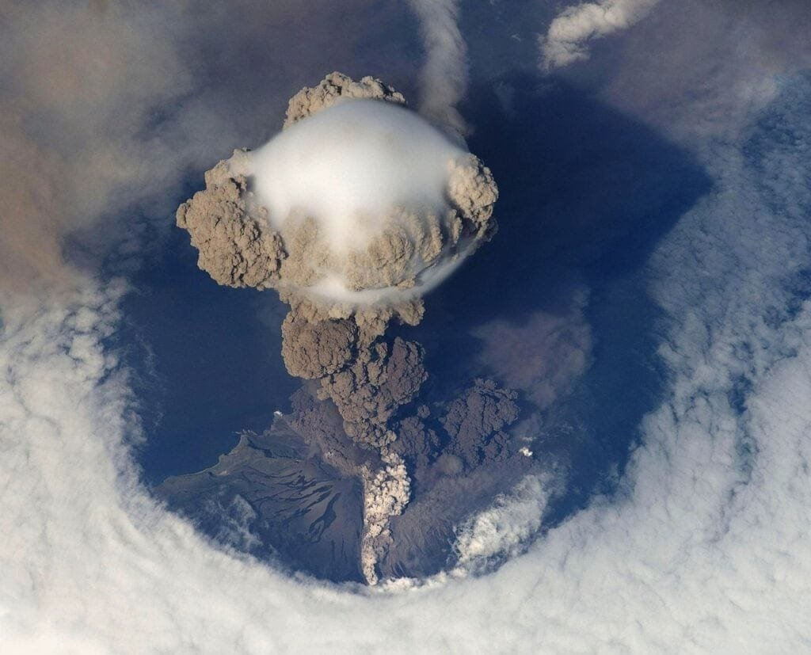

Have you ever wondered why flights sometimes have to be rerouted due to volcanic ash? Volcanoes, with their explosive eruptions and towering ash clouds, can pose significant risks to aircraft. In this article, we will explore the causes of flight rerouting due to volcanic ash, including how volcanoes form, where they are commonly found, and the various factors that contribute to volcanic eruptions. By understanding these causes, we can gain insight into why volcanic ash can be hazardous to aviation and what measures are taken to ensure the safety of air traffic. So, let's delve into the fascinating world of volcanoes and discover how they can impact our skies.

# Understanding Volcanic Ash

Volcanic ash is a fine, powdery material that is ejected during volcanic eruptions. It is composed of rock fragments, minerals, and volcanic glass. The particles can vary in size from less than a micrometer to several millimeters in diameter. Volcanic ash is lightweight and can be carried by winds over long distances.

This image is property of pixabay.com.

## Definition of Volcanic Ash

Volcanic ash is the fragmented material that is discharged into the air during volcanic eruptions. It is different from the ash produced by burning wood or coal since it is created by the explosive interaction of molten rock with water or air.

## Process of Volcanic Ash Formation

Volcanic ash is formed through a complex process involving the fragmentation of molten rock, known as magma, during volcanic eruptions. When magma is subjected to intense pressure and undergoes rapid cooling, it shatters into small glassy fragments, forming ash particles.

## Composition of Volcanic Ash

The composition of [volcanic ash varies depending on the type of volcano](https://magmamatters.com/understanding-volcanic-formation-a-comprehensive-guide/ "Understanding Volcanic Formation: A Comprehensive Guide") and the composition of the magma. It typically consists of fine rock particles, glass shards, and minerals. The ash particles can contain a wide range of elements, including silica, aluminum, iron, magnesium, and calcium. These elements give volcanic ash its characteristic composition and can have various effects on aircraft and aircraft systems.

# Hazard of Volcanic Ash to Aircraft

Volcanic ash poses significant hazards to aircraft due to its physical and chemical properties. The following are some of the hazards associated with volcanic ash and its impact on aircraft operations.

## Visibility Reduction

One of the primary hazards of volcanic ash to aircraft is the reduction in visibility. Volcanic ash clouds can be thick and opaque, making it challenging for pilots to see and navigate through them. Reduced visibility can pose a significant risk, especially during takeoff, landing, and low-altitude flights.

## Engine Performance Impairment

Volcanic ash can severely impair the performance of aircraft engines. The fine particles in volcanic ash can enter the engine's combustion chamber and mix with the hot gases. This can cause the ash particles to melt and solidify, forming a glass-like coating on engine components. This coating reduces the engine's efficiency and can lead to engine failure if not managed properly.

## Avionic System and Surface Damage

Volcanic ash can also cause damage to the aircraft's avionic systems and surfaces. The abrasive nature of volcanic ash can erode the aircraft's exterior surfaces, including the windshield, leading edges, and antennas. It can also interfere with the operation of critical avionic systems, such as radar and communication equipment.

# How Volcanic Ash Affects Jet Engines

The presence of volcanic ash in the atmosphere poses significant challenges to the safe operation of jet engines. The following are some of the ways volcanic ash affects jet engines and their components.

## Melting and Solidification of Ash in Engines

When volcanic ash enters a jet engine, it can melt and solidify on the engine's hot components. The high temperatures within the engine cause the ash particles to melt, and when they come in contact with cooler surfaces, they solidify again. This process creates glass-like deposits on engine components, leading to reduced engine performance and potential engine damage.

## Abrasion of Aero-Engine Components

The abrasive nature of volcanic ash can cause erosion and wear of aero-engine components. The high-speed impact of ash particles on the compressor blades, turbine blades, and other engine parts can lead to surface damage and degradation. This can result in reduced engine efficiency and increased maintenance requirements.

This image is property of pixabay.com.

## Obstruction of Fuel Nozzles and Cooling Holes

Volcanic ash can also obstruct fuel nozzles and cooling holes within the engine. The fine ash particles can accumulate and clog these critical passages, affecting fuel flow and proper cooling of engine components. This can result in reduced power output and thermal stress on engine parts, compromising aircraft safety.

# Detection of Volcanic Ash in Flight

Detecting the presence of volcanic ash in flight is crucial for ensuring the safety of aircraft operations. Several methods and technologies are used for ash detection, both in-flight and on the ground.

## In-Flight Ash Detection

In-flight ash detection relies on various sensors and instruments installed on aircraft. These systems can detect volcanic ash by measuring parameters such as particle concentration, particle size, and optical properties. Real-time data from these sensors are used to provide accurate information about the location and density of ash clouds.

## Ground-Based Ash Detection Systems

Ground-based ash detection systems are used to monitor volcanic ash near active volcanoes and provide early warning of potential hazards. These systems use a combination of remote sensing technologies such as lidar, radar, and infrared cameras to detect and track ash clouds. Ground-based monitoring helps to supplement in-flight detection and provides valuable information for volcanic ash forecasts and advisories.

## Satellite Monitoring and Ash Cloud Tracking

Satellites equipped with specialized sensors play a crucial role in monitoring and tracking volcanic ash clouds over large areas. These satellites provide continuous coverage and can detect volcanic ash from space using remote sensing techniques. Satellite data are used to track the movement of ash clouds, estimate their concentration, and generate ash cloud models for aviation authorities and pilots.

# Volcanic Ash Advisory Centers (VAACs) Role

Volcanic Ash Advisory Centers (VAACs) play a vital role in monitoring volcanic ash hazards and providing timely information to aviation stakeholders. They serve as centralized hubs for collecting, analyzing, and disseminating volcanic ash-related data and forecasts.

## Definition and Roles of VAACs

VAACs are responsible for issuing volcanic ash advisories and warnings to support safe flight operations. They gather information from various sources, including ground-based monitoring systems, in-flight observations, satellite data, and volcano observatories. VAACs analyze this information to assess ash hazards, issue advisories, and provide recommendations for flight routing and airspace management.

## VAACs Contribution to Flight Rerouting

Flight rerouting is a common strategy to avoid volcanic ash hazards. VAACs play a crucial role in providing real-time information and forecasts to airlines, pilots, and air traffic control agencies to facilitate safe flight operations. By monitoring ash clouds and issuing timely advisories, VAACs help ensure that aircraft can navigate around areas affected by volcanic ash.

## Information Dissemination Among VAACs Globally

Collaboration and information sharing among VAACs globally are essential for effective volcanic ash management. VAACs exchange data, forecasts, and advisories to ensure consistent and accurate information for aviation stakeholders. This international cooperation helps in minimizing the impact of volcanic ash on air travel and promoting global aviation safety.

# Dynamics of Flight Rerouting Decisions

Flight rerouting decisions in response to volcanic ash hazards involve a combination of scientific analysis, risk assessment, and coordination among various stakeholders. Several factors influence these decisions, which can have significant implications for airline operations.

## Rerouting Process

The rerouting process involves evaluating the current location of the aircraft, the location and intensity of volcanic ash clouds, and the available alternate routes. Airline dispatchers and flight operations teams work closely with VAACs and air traffic control to assess the risks and determine the safest and most efficient rerouting options. These decisions consider factors such as the size and density of ash clouds, forecasted ash concentrations, and the capabilities of the aircraft.

This image is property of pixabay.com.

## Factors Influencing Rerouting Decisions

Numerous factors influence flight rerouting decisions in the presence of volcanic ash. The primary consideration is the safety of passengers and crew, followed by the capabilities and limitations of the aircraft. Other factors include the prevailing weather conditions, airspace restrictions, and the availability of suitable alternate routes. The decisions also take into account operational considerations such as fuel efficiency, flight duration, and passenger convenience.

## Flight Rerouting and Airline Operations

Flight rerouting due to volcanic ash can have significant impacts on airline operations. It may result in longer flight times, increased fuel consumption, and additional costs associated with route changes and accommodation for affected passengers. Airlines need to have robust contingency plans in place to ensure the efficient management of flight rerouting and minimize disruptions to their operations.

# Case Studies on Volcanic Ash Interference with Flights

Several notable volcanic eruptions in the past have caused significant interference with flight operations. The following case studies highlight the impact of volcanic ash on aviation.

## Eruption of Eyjafjallajökull in 2010

The eruption of Eyjafjallajökull in Iceland in 2010 caused widespread disruption to air travel in Europe. The eruption produced a large ash plume that drifted across the continent, leading to the closure of airspace in several countries. The resulting flight cancellations and reroutings had a significant economic impact on the aviation industry and caused inconvenience to millions of travelers.

## Eruption of Mount Pinatubo in 1991

The eruption of Mount Pinatubo in the Philippines in 1991 is another notable case of volcanic ash interference with flights. The eruption sent ash clouds to altitudes where commercial aircraft typically operate, leading to the suspension of air operations in the region. The widespread ash contamination of the airspace affected numerous international flights and resulted in significant disruptions to air travel.

## Eruption of Galunggung in 1982

The eruption of Mount Galunggung in Indonesia in 1982 had a profound impact on aviation. The eruption generated a massive ash cloud that caused the loss of all four engines on a British Airways flight, temporarily incapacitating the aircraft. The incident highlighted the need for improved volcanic ash detection and monitoring systems and spurred global efforts to enhance aviation safety in volcanic ash environments.

# Mitigation Measures for Volcanic Ash Risks to Aviation

To mitigate the risks posed by volcanic ash to aviation, airlines and regulatory agencies worldwide have implemented various measures and protocols.

## Airline Policies and Protocols

Airlines have developed comprehensive policies and protocols to guide their crews and flight operations teams in dealing with volcanic ash hazards. These include guidelines for avoiding areas with known or suspected volcanic ash, procedures for assessing and managing engine damage, and protocols for communicating with air traffic control and dispatch centers during ash-contaminated flights.

## Training for Flight Crews and Maintenance Personnel

Flight crews and maintenance personnel undergo specialized training to enhance their knowledge and skills in dealing with volcanic ash hazards. This training covers ash detection and identification, engine performance monitoring, emergency procedures, and the safe operation and maintenance of aircraft in ash-contaminated environments. Regular recurrent training ensures that personnel are adequately prepared to handle ash-related situations.

## Pre-Flight and Post-Flight Inspections

Pre-flight and post-flight inspections play a crucial role in mitigating the risks of volcanic ash to aviation. Before departure, aircraft are inspected for any signs of external ash contamination, including the windshield, engine inlets, and airframe surfaces. Post-flight inspections involve a thorough assessment of the aircraft's components and systems to identify any potential damage caused by volcanic ash. These inspections help ensure the continued airworthiness and safety of the aircraft.

# Innovations and Advances for Detection and Evading Volcanic Ash

Ongoing research and technological developments are advancing the capabilities for detecting and evading volcanic ash hazards. Innovations in detection technology, ash dispersion modeling systems, and engine design improvements are helping to improve safety in volcanic ash environments.

## In-Flight Ash Detection Technology

Advances in in-flight ash detection [technology](https://magmamatters.com/the-art-and-science-of-volcano-monitoring/ "The Art and Science of Volcano Monitoring") are improving the ability of aircraft to detect and monitor volcanic ash clouds. New sensor technologies, including lidar and radar-based systems, provide real-time data on ash concentration, particle size, and distribution. These advancements help pilots and airlines make informed decisions about flight routing and ensure the safety of aircraft and passengers.

## Ash Dispersion Modeling Systems

Advanced ash dispersion modeling systems use computational algorithms and meteorological data to predict the movement and concentration of volcanic ash clouds. These models help authorities and airlines make informed decisions about flight planning and airspace management. By simulating the dispersion of ash particles, these models contribute to safer flight operations and minimize the impact of volcanic ash on aviation.

## Engine Design Improvements

Engine manufacturers are continuously improving the design and materials used in jet engines to better withstand the hazards of volcanic ash. Advanced engine designs incorporate features such as ash-proof filters, improved fuel nozzle designs, and enhanced compressor coatings to mitigate the effects of ash ingestion. These design improvements enhance engine reliability and performance in volcanic ash environments.

# Future Directions and Challenges

While significant progress has been made in understanding and mitigating the risks of volcanic ash to aviation, several challenges and uncertainties remain.

## Uncertainties in Volcanic Ash Detection and Prediction

Despite advances in detection technology and modeling systems, there are still uncertainties in accurately detecting and predicting volcanic ash hazards. The size, composition, and density of ash particles can vary widely, making it challenging to develop robust detection methods. Improved data collection and analysis techniques, as well as ongoing research, will help address these uncertainties and enhance volcanic ash detection and prediction capabilities.

## Climate Change and Volcanic Activities

[Climate change may affect the frequency and intensity of volcanic](https://magmamatters.com/geothermal-energy-and-its-volcanic-origins/ "Geothermal Energy and Its Volcanic Origins") eruptions, making it essential to understand the potential impacts on aviation. Changes in temperature, wind patterns, and atmospheric conditions can influence the behavior and distribution of volcanic ash clouds. Ongoing research is needed to assess the relationship between climate change and volcanic activities and develop strategies to address any emerging risks.

## Public Attention and Policy Issues

Public attention and policy issues surrounding volcanic ash hazards can have a significant impact on aviation operations. Heightened public awareness of the risks associated with volcanic ash can lead to increased scrutiny and demands for stringent safety measures. Balancing the need for effective risk management with public expectations and policy considerations poses a challenge for aviation stakeholders and regulatory authorities.

In conclusion, understanding volcanic ash and its hazards is crucial for ensuring the safety of aircraft operations. The detection and prediction of volcanic ash, along with the implementation of mitigation measures, help to minimize the impact of volcanic ash on aviation. Ongoing research, innovation, and cooperation between various stakeholders are essential for addressing the challenges associated with volcanic ash and promoting safe and efficient flight operations in volcanic ash environments.

