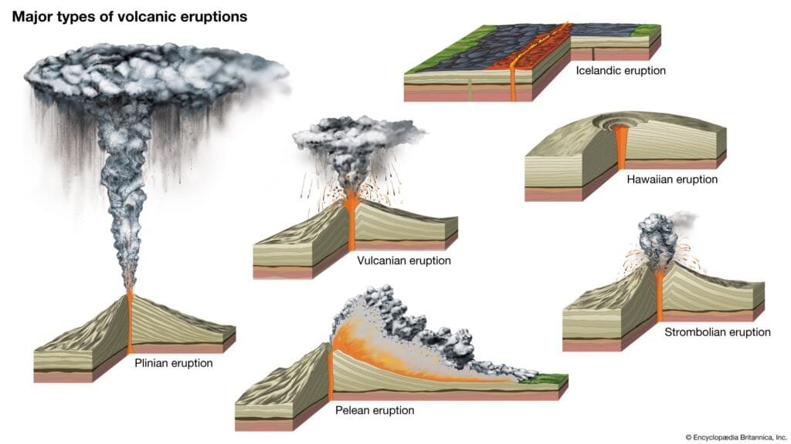

In the article "Understanding the Different Types and Eruption Patterns of Volcanoes," you'll gain valuable insights into the fascinating world of volcanoes. From the formation process to their geographic distribution, this article dives deep into the subject, shedding light on the various types of volcanoes and their eruption patterns. By understanding these volcanic phenomena, you'll not only enhance your knowledge but also gain the ability to predict future activity and mitigate risks to surrounding communities. So, get ready to embark on a captivating journey into the fiery world of volcanoes.

This image is property of cdn.britannica.com.

## Understanding Volcanoes

Volcanoes are fascinating natural features that have captivated human interest for centuries. To truly understand volcanoes, it is important to explore their formation process, the role of tectonic plates and hotspots, as well as the magma and gases involved in their formation.

### Formation process

Volcanoes are formed when molten rock, known as magma, rises to the surface of the Earth. This magma is often rich in gases and debris. When the pressure of the magma becomes too great, it erupts, resulting in a volcanic eruption. Volcanoes can be found at various sites, including plate boundaries, hotspots under the Earth's crust, or rift zones where tectonic plates are moving apart. Each of these locations plays a crucial role in the formation of volcanoes.

### Role of tectonic plates and hotspots

Tectonic plates are large pieces of the Earth's lithosphere that fit together like a jigsaw puzzle. They constantly move, interacting with one another at plate boundaries. Volcanoes often occur at these plate boundaries, where the movement and interaction of tectonic plates create conditions that allow magma to rise to the surface.

Hotspots, on the other hand, are isolated areas underneath the Earth's crust where magma is able to rise, regardless of tectonic plate boundaries. These hotspots are thought to be a result of mantle plumes, which are columns of hot material rising from the Earth's core. The combination of tectonic plate movement and hotspots contributes significantly to the formation of volcanoes in various parts of the world.

### Understanding magma and gases involved in formation

Magma is the molten rock that exists beneath the Earth's surface. It is a complex mixture of different minerals, as well as dissolved gases. The composition of magma plays a crucial role in the eruption patterns and characteristics of volcanoes.

The gases involved in volcanic eruptions are primarily water vapor, carbon dioxide, and sulfur dioxide. These gases are released from the magma as it rises to the surface and can have various effects. The amount of gas in the magma affects its viscosity, or thickness, which in turn determines the explosivity of the eruption. Highly viscous magma with a high gas content can result in explosive eruptions, whereas low-viscosity magma with a low gas content leads to less explosive eruptions.

Understanding the properties of magma and the gases involved in volcanic eruptions is essential for predicting volcanic activity and mitigating the risks to surrounding communities.

## Types of Volcanoes

Volcanoes come in various shapes and sizes, each with its own unique characteristics. [Understanding the different types of volcanoes](https://magmamatters.com/understanding-volcanic-formation-a-comprehensive-guide/ "Understanding Volcanic Formation: A Comprehensive Guide") is essential for gaining a comprehensive understanding of these powerful natural phenomena.

### Introduction to different types

There are four main types of volcanoes: shield volcanoes, stratovolcanoes (also known as composite volcanoes), [cinder cone](https://magmamatters.com/the-birth-of-new-land-understanding-cinder-cones/) volcanoes, and composite volcanoes. Each type has its own distinct shape, eruption patterns, and geological features.

### How they differ from each other

Shield volcanoes are characterized by their broad, gentle slopes and large size. They are formed by the eruption of low-viscosity lava, which flows easily and covers a wide area. In contrast, stratovolcanoes are tall and steep, with alternating layers of lava, ash, and other volcanic materials. They are formed by the eruption of high-viscosity lava and are known for their explosive eruptions.

Cinder cone volcanoes are small, cone-shaped volcanoes that are formed by tephra, which is a type of volcanic material consisting of small fragments of solidified lava. Lastly, composite volcanoes are a combination of both shield and stratovolcanoes. They have a broad base with steeper sides and are formed by alternating eruptions of lava and explosive eruptions.

### Key characteristics of each type

Shield volcanoes are often found in hotspots, such as the Hawaiian Islands, and have gentle eruption patterns. They are known for their ability to produce extensive lava flows. Stratovolcanoes, on the other hand, are commonly found in subduction zones and are associated with explosive eruptions.

Cinder cone volcanoes are usually small and can form quickly. They are often found at the summit or on the flanks of larger volcanoes. Composite volcanoes, as the name suggests, display characteristics of both shield and stratovolcanoes. They are often found in areas of subduction and can have both gentle and explosive eruptions.

Understanding the key characteristics of each type of volcano is crucial for identifying and studying them in different geographic locations.

This image is property of www.visualcapitalist.com.

## Shield Volcanoes

Shield volcanoes are one of the most iconic and unique types of volcanoes. Here, we will delve into the definition and formation of shield volcanoes, their geographical locations, as well as their eruption patterns and features.

### Definition and formation

Shield volcanoes derive their name from their shape, which resembles a warrior's shield laying flat on the ground. They are characterized by their broad, gently sloping sides and large size. Shield volcanoes are formed by the eruption of low-viscosity lava, which flows easily and covers a wide area.

The formation of a shield volcano begins with the eruption of low-viscosity lava. This lava flows down the sides of the volcano, covering a wide area and gradually building up the shield-like shape over time. The repeated eruptions of lava from the central vent contribute to the growth of the volcano. The lava solidifies and cools, creating layers of hardened rock that form the characteristic shape of a shield volcano.

### Geographical locations

Shield volcanoes are found in various locations around the world. One of the most famous examples of a shield volcano is Mauna Loa in Hawaii. It is the largest volcano on Earth and rises about 13,678 feet above sea level. Other examples of shield volcanoes include the Galapagos Islands, Iceland, and the Canary Islands.

The distribution of shield volcanoes is often associated with hotspots, which are areas beneath the Earth's crust where magma rises due to the movement of tectonic plates. These hotspots create the conditions necessary for the formation of shield volcanoes.

### Eruption patterns and features

Shield volcanoes are known for their relatively gentle eruption patterns. The low-viscosity lava that erupts from these volcanoes flows easily and can travel over long distances without causing significant destruction. Unlike stratovolcanoes, which often have explosive eruptions, shield volcanoes have eruptions that are typically non-explosive.

The eruptions of shield volcanoes are characterized by the effusion of lava and the formation of lava flows. These lava flows can vary in length and size, depending on the eruptive activity of the volcano. Over time, the repeated eruptions of lava contribute to the gradual growth of the shield volcano and the accumulation of layers of solidified lava.

Shield volcanoes also often have a central vent, from which lava and gases are released during eruptions. This central vent is usually located at the summit of the volcano and can be a source of spectacular displays of volcanic activity.

## Stratovolcanoes

Stratovolcanoes, also known as composite volcanoes, are some of the most well-known and classic examples of volcanoes. In this section, we will explore the definition and formation of stratovolcanoes, their geographical locations, as well as their eruption patterns and features.

### Definition and formation

Stratovolcanoes are tall and steep-sided volcanoes that are characterized by their alternating layers of lava, ash, and other volcanic materials. They are formed by the eruption of high-viscosity lava, which does not flow as easily as the lava erupted by shield volcanoes. As a result, stratovolcanoes have a more explosive eruption pattern.

The formation of a stratovolcano begins with the eruption of high-viscosity lava, which is rich in gas. As this lava rises to the surface, the gas within it expands rapidly, creating a build-up of pressure. Eventually, this pressure becomes too great, leading to an explosive eruption. The explosive nature of these eruptions is due to the viscosity of the lava, which traps the gas and creates a build-up of pressure.

Over time, the repeated eruptions of high-viscosity lava contribute to the growth of the stratovolcano. The alternating layers of lava, ash, and other volcanic materials build up, creating the characteristic shape and structure of a stratovolcano.

### Geographical locations

Stratovolcanoes can be found in various locations around the world. They are commonly associated with subduction zones, where one tectonic plate is forced beneath another. The intense heat and pressure generated by the subduction process create the conditions necessary for the formation of stratovolcanoes.

Examples of stratovolcanoes include Mount St. Helens in the United States, Mount Fuji in Japan, and Mount Etna in Italy. These volcanoes are known for their steep slopes and explosive eruption patterns.

### Eruption patterns and features

Stratovolcanoes are characterized by their explosive eruption patterns. The high-viscosity lava erupts with great force, often producing impressive displays of volcanic activity. These eruptions can result in the release of large amounts of volcanic ash, as well as pyroclastic flows, which are fast-moving, high-temperature currents of gas and volcanic material.

The explosive nature of stratovolcano eruptions is due to the high gas content of the erupted lava. The high-viscosity lava traps the gas, creating a build-up of pressure. When this pressure becomes too great, it is released explosively, leading to a volcanic eruption.

In addition to explosive eruptions, stratovolcanoes can also experience effusive eruptions, where lava slowly flows out of the volcano. However, these eruptions are generally less common compared to the explosive eruptions.

Stratovolcanoes often have a central vent, similar to shield volcanoes, from which lava and gases are released during eruptions. This central vent is usually located at the summit of the volcano and can be a source of intense volcanic activity during eruptions.

This image is property of upload.wikimedia.org.

## Cinder Cone Volcanoes

Cinder cone volcanoes, also known as scoria cones, are small but fascinating features of volcanic activity. In this section, we will explore the definition and formation of cinder cone volcanoes, their geographical locations, as well as their eruption patterns and features.

### Definition and formation

Cinder cone volcanoes are small, cone-shaped volcanoes that are formed by the eruption of tephra, which is a type of volcanic material consisting of small fragments of solidified lava. These small fragments are known as cinders or scoria. Unlike shield and stratovolcanoes, which are formed by the eruption of lava, cinder cone volcanoes are formed by the explosive ejection of pyroclastic material.

The formation of a cinder cone volcano begins with a volcanic explosion. During this explosion, pyroclastic material, such as cinders and volcanic ash, is thrown into the air. As this material falls back to the ground, it accumulates around the vent, forming the characteristic conical shape of a cinder cone volcano.

The eruptions of cinder cone volcanoes are typically short-lived and can occur in a series of explosive bursts. The eruptions are driven by the build-up of pressure within the volcano, which is caused by the accumulation of gas and magma beneath the surface.

### Geographical locations

Cinder cone volcanoes can be found in various locations around the world. They are often found at the summit or on the flanks of larger volcanoes. This is because cinder cone volcanoes are usually formed as a result of secondary eruptions, where the primary volcano experiences a volcanic explosion.

Examples of cinder cone volcanoes include Sunset Crater in Arizona, United States, and Paricutin in Mexico. These volcanoes are known for their small size and distinct conical shape.

### Eruption patterns and features

Cinder cone volcanoes are known for their explosive eruption patterns. The explosive eruptions of these volcanoes are driven by the build-up of pressure within the volcano, which is caused by the accumulation of gas and magma beneath the surface.

The eruptions of cinder cone volcanoes are typically short-lived and can occur in a series of explosive bursts. These eruptions result in the ejection of pyroclastic material, including cinders and volcanic ash, into the air. The pyroclastic material then falls back to the ground, accumulating around the vent and forming the conical shape of the volcano.

Unlike shield and stratovolcanoes, cinder cone volcanoes do not usually have a central vent. Instead, they have a single vent from which the explosive eruptions occur. During eruptions, cinder cone volcanoes often produce volcanic plumes, which are columns of gases, ash, and other volcanic materials that rise high into the sky.

## Composite Volcanoes

Composite volcanoes, also known as stratovolcanoes, are some of the most impressive and dangerous volcanoes on Earth. In this section, we will explore the definition and formation of composite volcanoes, their geographical locations, as well as their eruption patterns and features.

### Definition and formation

Composite volcanoes are a combination of both shield and stratovolcanoes. They are characterized by their broad base with steeper sides, creating a distinct cone shape. Composite volcanoes are formed by alternating eruptions of lava and explosive eruptions of pyroclastic material.

The formation of a composite volcano begins with the eruption of lava, similar to shield volcanoes. As the lava flows down the sides of the volcano, it gradually builds up the broad base. However, unlike shield volcanoes, composite volcanoes also experience explosive eruptions of pyroclastic material. These eruptions are driven by the build-up of pressure within the volcano, caused by the accumulation of gas and magma beneath the surface.

The alternating eruptions of lava and pyroclastic material contribute to the growth of the composite volcano. Over time, the layers of lava, ash, and other volcanic materials build up, creating the characteristic cone shape of the composite volcano.

### Geographical locations

Composite volcanoes can be found in various locations around the world. They are commonly associated with subduction zones, where one tectonic plate is forced beneath another. The intense heat and pressure generated by the subduction process create the conditions necessary for the formation of composite volcanoes.

Examples of composite volcanoes include Mount Rainier in the United States, Mount Vesuvius in Italy, and Mount Mayon in the Philippines. These volcanoes are known for their steep sides and explosive eruption patterns.

### Eruption patterns and features

Composite volcanoes are known for their explosive eruption patterns. The alternating eruptions of lava and pyroclastic material create a combination of effusive and explosive eruptions. This makes composite volcanoes some of the most dangerous and unpredictable volcanoes on Earth.

During effusive eruptions, lava flows slowly down the sides of the volcano, similar to shield volcanoes. However, during explosive eruptions, pyroclastic material, including ash, cinders, and volcanic bombs, is ejected into the air. These explosive eruptions can result in the release of large amounts of volcanic ash and the formation of pyroclastic flows, which are fast-moving currents of gas and volcanic material.

Composite volcanoes often have a central vent, similar to shield and stratovolcanoes, from which lava and gases are released during eruptions. This central vent can be a source of intense volcanic activity and spectacular displays during eruptions.

This image is property of www.visualcapitalist.com.

## Ring of Fire Volcanoes

The Ring of Fire is a region in the Pacific Ocean known for its high concentration of volcanic activity. In this section, we will provide a description of the 'Ring of Fire' region, explore the volcanic activity in this region, and compare these volcanoes with those found in other parts of the world.

### Description of the 'Ring of Fire' region

The Ring of Fire is a major area in the basin of the Pacific Ocean where a large number of earthquakes and volcanic eruptions occur. It is a 40,000 kilometer (25,000 miles) horseshoe-shaped ring that is associated with a nearly continuous series of oceanic trenches, volcanic arcs, volcanic belts, and plate movements.

The Ring of Fire encompasses several tectonic plate boundaries, including the Pacific Plate, the Nazca Plate, the Cocos Plate, and the Philippine Sea Plate. These plates interact with each other, resulting in intense volcanic activity.

The region is known for its geological instability as the different tectonic plates collide, subduct, and interact with one another. This continuous movement and collision of tectonic plates result in the formation of numerous volcanoes, making the Ring of Fire one of the most volcanically active areas on Earth.

### Volcanic activity in this region

The Ring of Fire is home to the majority of the world's active volcanoes. It spans multiple countries, including Chile, Japan, Indonesia, the Philippines, and the United States. Some of the most well-known and active volcanoes are located within this region.

Volcanoes within the Ring of Fire are often characterized by their explosive eruption patterns. This is due to the subduction of oceanic plates beneath continental plates, creating the conditions necessary for explosive volcanism. The explosive eruptions in this region are often accompanied by pyroclastic flows, ash clouds, and the release of large amounts of volcanic gases.

The volcanic activity within the Ring of Fire poses significant risks to the countries and communities located within the region. It is important for these communities to have robust monitoring and preparedness measures in place to mitigate the potential impacts of volcanic eruptions.

### Comparison of these volcanoes with others

Volcanoes within the Ring of Fire differ from those found in other parts of the world due to the specific tectonic processes occurring within the region. The subduction of oceanic plates beneath continental plates creates the conditions for explosive volcanic activity. As a result, volcanoes within the Ring of Fire are often associated with violent and destructive eruptions.

In contrast, shield volcanoes, such as those found in Hawaii, are formed by the eruption of low-viscosity lava and are not typically associated with explosive eruptions. These volcanoes have more gentle eruption patterns and are often characterized by the effusion of lava flows.

While shield volcanoes are driven by hotspots and the movement of tectonic plates far beneath the Earth's surface, the volcanoes within the Ring of Fire are much more influenced by the direct interaction of tectonic plates. This fundamental difference in volcanic activity results in the distinct characteristics exhibited by these volcanoes.

## Volcanic Eruptions: Causes and Patterns

Volcanic eruptions are awe-inspiring and powerful natural events. In this section, we will explore the factors contributing to volcanic eruptions, how the properties of gas and magma affect eruption types, as well as common eruption patterns.

### Factors contributing to eruptions

Volcanic eruptions are a complex interplay of various factors. The primary contributors to volcanic eruptions are the movement and interaction of tectonic plates, the accumulation of magma beneath the Earth's surface, and the release of gas.

Tectonic plate movement creates the conditions necessary for the formation of volcanoes. When plates collide or separate, magma is able to rise to the surface, leading to eruptions. The characteristics of the magma, such as its viscosity and gas content, also play a crucial role in determining the eruption type.

Another factor contributing to volcanic eruptions is the accumulation of magma beneath the Earth's surface. As magma accumulates, pressure builds up within the volcano, eventually reaching a point where it exceeds the strength of the surrounding rocks. This leads to an explosive eruption as the magma forcefully escapes to the surface.

### How gas and magma properties affect eruption types

The properties of gas and magma play a significant role in determining the type of volcanic eruption. The viscosity, or thickness, of the magma affects its ability to flow and determines the explosivity of the eruption.

Magma with a low viscosity, known as basaltic magma, is able to flow easily and typically results in non-explosive, effusive eruptions. This type of magma is often associated with shield volcanoes and has a low gas content.

In contrast, magma with a high viscosity, known as andesitic or rhyolitic magma, does not flow as easily and tends to trap gas within it. This creates a build-up of pressure, leading to explosive eruptions. These explosive eruptions are often associated with stratovolcanoes and are characterized by the release of large amounts of volcanic ash and pyroclastic material.

The gas content of magma also affects eruption types. Magma with a high gas content is more likely to lead to explosive eruptions, as the gas within the magma expands rapidly when pressure is released. On the other hand, magma with a low gas content is less likely to result in explosive eruptions.

### Common eruption patterns

Volcanic eruptions can exhibit a range of patterns, depending on the specific characteristics of the volcano and the properties of the magma. Some common eruption patterns include effusive eruptions, explosive eruptions, and phreatomagmatic eruptions.

Effusive eruptions, as the name suggests, involve the slow and gradual effusion of lava from the volcano. This lava flows down the sides of the volcano, often creating extensive lava flows. Effusive eruptions are typically associated with shield volcanoes and basaltic magma.

Explosive eruptions, on the other hand, involve the rapid ejection of volcanic ash, cinders, and pyroclastic material into the air. These eruptions are often accompanied by the release of large amounts of volcanic gases and can be highly destructive. Explosive eruptions are commonly associated with stratovolcanoes and volcanoes within the Ring of Fire.

Phreatomagmatic eruptions occur when water comes into contact with magma. This can happen when magma interacts with groundwater, lakes, or the ocean. The rapid conversion of water into steam creates explosive eruptions that are often characterized by the release of large amounts of ash and volcanic gases.

Understanding the common eruption patterns and their associated characteristics is important for predicting volcanic activity and mitigating the risks to surrounding communities.

This image is property of www.nps.gov.

## Hazards and Effects of Volcanic Eruptions

Volcanic eruptions can have a wide range of hazards and effects, both immediate and long-term. In this section, we will explore the immediate dangers posed by volcanic eruptions, the long-term environmental impact, as well as the potential positive effects and benefits.

### Immediate dangers

Volcanic eruptions can pose immediate dangers to human life and infrastructure. Some of the most common immediate dangers include pyroclastic flows, volcanic ash, lahars, volcanic gases, and lava flows.

Pyroclastic flows are fast-moving currents of gas and volcanic material that can reach extremely high temperatures. These flows can travel over long distances and are highly destructive. They can bury entire communities and cause significant loss of life.

Volcanic ash, which is made up of tiny particles of volcanic glass and rock, can also have severe impacts. Ashfall can be detrimental to human health, especially if inhaled. It can cause respiratory problems and eye irritation. Ash can also disrupt transportation systems, damage buildings and infrastructure, and have a significant impact on agriculture.

Lahars, or volcanic mudflows, occur when volcanic ash, debris, and water mix together. These mudflows can travel at high speeds and can be extremely destructive. They can bury communities, destroy infrastructure, and disrupt transportation systems.

Volcanic gases, such as [sulfur dioxide and carbon](https://magmamatters.com/the-art-and-science-of-volcano-monitoring/ "The Art and Science of Volcano Monitoring") dioxide, are released during volcanic eruptions. These gases can be toxic and pose a significant threat to human health. They can cause respiratory problems, as well as damage the [environment and contribute to climate change](https://magmamatters.com/geothermal-energy-and-its-volcanic-origins/ "Geothermal Energy and Its Volcanic Origins").

Lava flows, although often slow-moving, can also cause significant damage. They can engulf and destroy anything in their path, including homes, forests, and farmland.

### Long-term environmental impact

Volcanic eruptions can have long-term environmental impacts that extend far beyond the immediate aftermath of the eruption. These long-term impacts can affect the surrounding ecosystem, climate patterns, and even have global implications.

One of the long-term environmental impacts of volcanic eruptions is the alteration of the landscape. Volcanic material, such as ash and volcanic rocks, can cover vast areas and drastically change the topography. This can have significant effects on the local ecosystem and the way it functions.

Volcanic eruptions can also lead to the formation of new land. Lava flows from volcanic eruptions can create new land masses, such as volcanic islands. These newly formed land masses can serve as habitats for new plant and animal species, contributing to biodiversity.

Volcanic eruptions can also impact climate patterns. Volcanic ash and gases released during eruptions can have a cooling effect on the climate. The ash can reflect sunlight, reducing the amount of solar radiation reaching the Earth's surface. This can result in a temporary drop in global temperatures.

Furthermore, volcanic eruptions can have global implications. The release of gases, such as sulfur dioxide, can reach the upper atmosphere and react with water vapor to form sulfuric acid aerosols. These aerosols can remain in the atmosphere for an extended period, affecting the Earth's climate and potentially leading to global cooling.

### Positive effects and benefits

While volcanic eruptions can be devastating natural disasters, they can also have positive effects and benefits. One of the significant benefits of volcanic eruptions is their contribution to the formation of fertile soil. The volcanic ash and other volcanic materials can be rich in minerals and nutrients, providing an excellent foundation for plant growth. This is particularly evident in areas surrounding volcanoes, where the soil is often highly fertile and conducive to agriculture.

Volcanic eruptions can also create new habitats. The formation of new land masses, such as volcanic islands, can provide opportunities for the colonization of new plant and animal species. These newly formed habitats contribute to biodiversity and can lead to the discovery of new species.

Additionally, volcanic eruptions can have cultural and geological significance. Many communities living near volcanoes have deep cultural connections to these natural features. Volcanoes can be seen as sacred or revered sites, and their eruptions can be important events for these communities. Furthermore, volcanic eruptions can reveal valuable geological information, providing insights into the Earth's history and geological processes.

Understanding the hazards and impact of volcanic eruptions is crucial for implementing effective mitigation strategies and reducing the risks to surrounding communities.

## Case Studies

To gain a deeper understanding of volcanic eruptions and their impact, it is important to examine historical eruptions and their consequences. Additionally, studying comparative analysis of different eruption types and real-life examples of prediction and response efforts can provide valuable insights into the study of volcanoes.

### Historical eruptions and their impact

Throughout history, numerous volcanic eruptions have left a lasting impact on societies and the environment. One such example is the eruption of Mount Vesuvius in 79 AD, which buried the Roman cities of Pompeii and Herculaneum under layers of ash and volcanic debris. This volcanic eruption not only preserved these ancient cities but also provided valuable insights into life during the Roman Empire.

Another historic volcanic eruption is the 1815 eruption of Mount Tambora in Indonesia. This eruption was one of the largest in recorded history and had significant global impacts. The eruption released large amounts of volcanic ash and gases into the atmosphere, causing a drop in global temperatures and leading to a year without summer in 1816. This event, known as the "Year Without a Summer," had severe consequences on agriculture, resulting in crop failures and famine in many parts of the world.

### Comparative analysis of different eruption types

Comparative analysis of different eruption types can provide valuable insights into the behavior and characteristics of volcanoes. By studying the characteristics and outcomes of effusive eruptions, explosive eruptions, and phreatomagmatic eruptions, scientists can better understand the underlying processes and potential hazards associated with each eruption type.

Effusive eruptions, such as those seen in shield volcanoes, often result in the slow and gradual release of lava. These eruptions tend to have minimal immediate impact on human populations but can have long-term consequences for the surrounding environment, including the formation of new land and changes in ecosystems.

Explosive eruptions, commonly associated with stratovolcanoes, can have catastrophic consequences due to the rapid release of enormous amounts of gas, ash, and pyroclastic material. These eruptions can result in the destruction of entire communities and have significant impacts on the environment and climate.

Phreatomagmatic eruptions, which occur when magma comes into contact with water, can have unique characteristics and hazards. The interaction of magma and water can result in explosive eruptions, as seen in the eruption of Mount St. Helens in 1980. These eruptions can produce powerful pyroclastic flows and lahars, which pose significant dangers to human populations.

Comparative analysis of different eruption types allows scientists to better understand the factors that influence eruption behavior, helping in the prediction and mitigation of volcanic hazards.

### Real-life examples of prediction and response efforts

The study of volcanoes is not limited to understanding their formation and eruption patterns but also involves predicting and responding to volcanic activity to mitigate risks. Real-life examples of prediction and response efforts can provide valuable lessons in volcano monitoring and disaster management.

One notable example is the eruption of Mount Pinatubo in the Philippines in 1991. This eruption was accurately predicted by scientists, allowing for the successful evacuation of thousands of people from the surrounding area. The prediction and subsequent evacuation efforts saved countless lives and minimized the impact of the eruption.

Another example is the ongoing monitoring and response efforts at the Yellowstone Caldera in the United States. The Yellowstone Caldera is one of the largest volcanic systems in the world and has the potential for a catastrophic eruption. Scientists closely monitor the volcanic activity at Yellowstone, using various methods such as seismic monitoring and gas emissions measurements. These monitoring efforts allow for the early detection of any signs of volcanic unrest, enabling timely response and mitigation efforts.

Real-life examples of prediction and response efforts highlight the importance of ongoing monitoring, research, and preparedness in mitigating the risks associated with volcanic activity.

In conclusion, understanding the different types and eruption patterns of volcanoes is essential for gaining a comprehensive understanding of these powerful natural phenomena. From shield volcanoes with their broad slopes and gentle eruption patterns to stratovolcanoes with their steep sides and explosive eruptions, each type of volcano exhibits unique characteristics. The 'Ring of Fire' region, with its high concentration of volcanic activity, presents its own set of challenges and volcanic phenomena. Volcanic eruptions pose immediate dangers, such as pyroclastic flows and volcanic ash, as well as long-term environmental impacts. However, there are also positive effects, such as the formation of fertile soil and new habitats. By studying case studies, conducting comparative analysis, and learning from real-life prediction and response efforts, we can further advance our knowledge and understanding of volcanoes. This knowledge is crucial for predicting volcanic activity, mitigating risks, and protecting communities living in volcanic regions.

