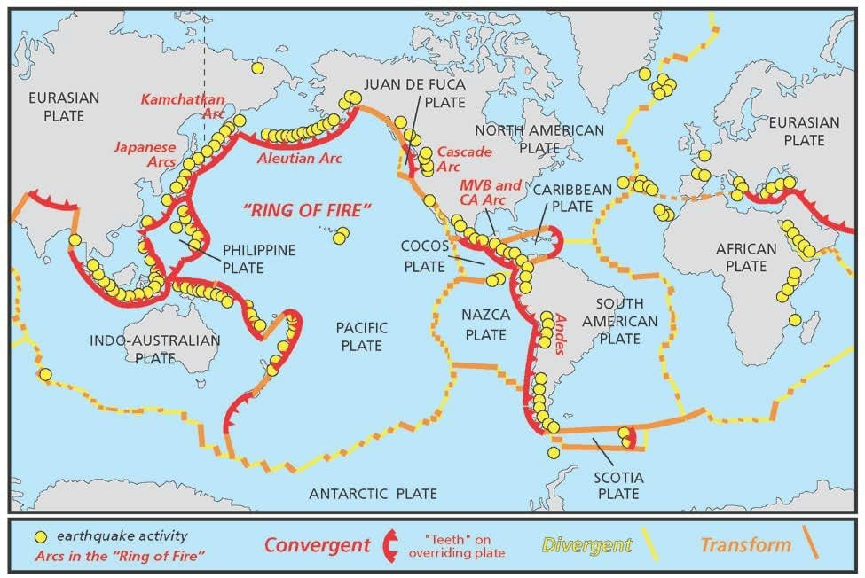
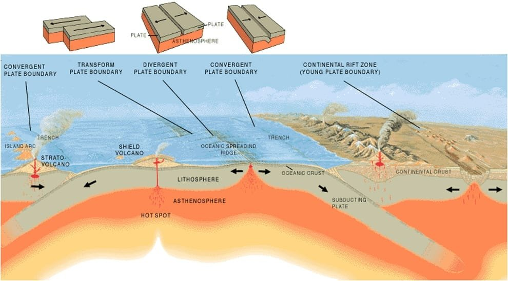
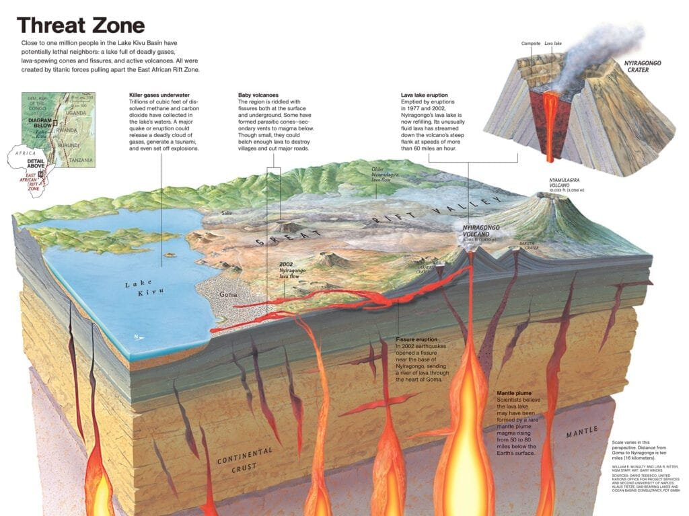
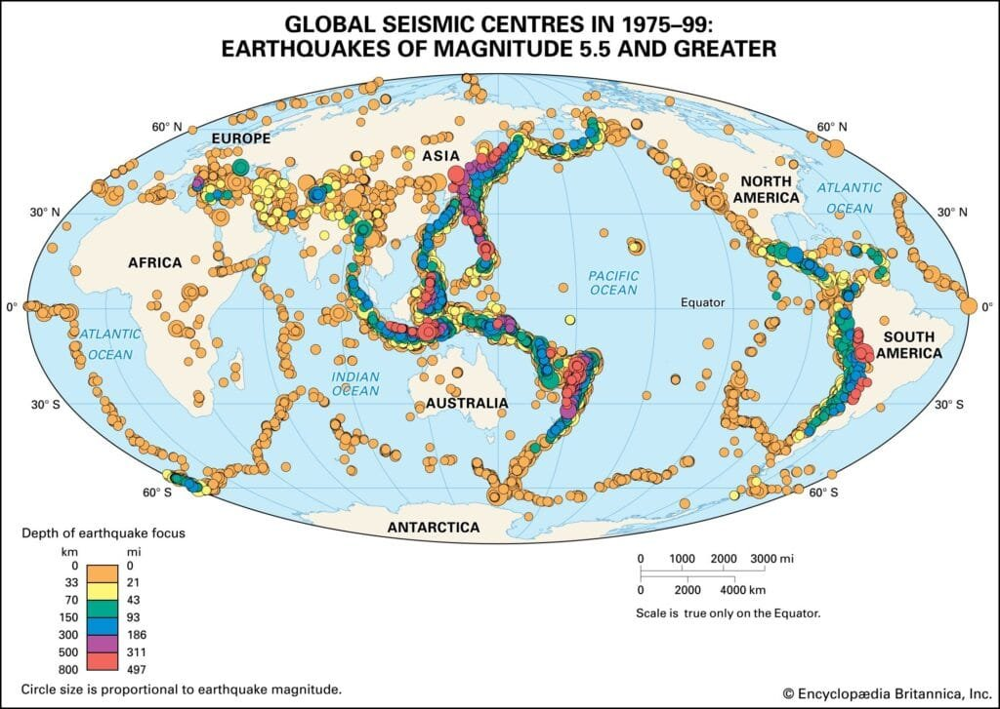

In "Understanding the Eruption Patterns of Volcanoes at Plate Boundaries," we explore the fascinating world of volcanoes and their eruption patterns. Volcanoes are formed when molten rock, gases, and debris escape to the earth's surface, resulting in spectacular eruptions of lava and ash. They occur at various sites along plate boundaries, hotspots beneath the earth's crust, or rift zones where tectonic plates are moving apart. These remarkable geological features are not only found in well-known regions like the "Ring of Fire," but also in other parts of the world. By understanding the different eruption patterns of volcanoes and the factors that influence them, we can gain valuable insights into predicting future volcanic activity and mitigating risks to surrounding communities. This article provides a [comprehensive overview of the types of volcanoes](https://magmamatters.com/understanding-volcanic-formation-a-comprehensive-guide/ "Understanding Volcanic Formation: A Comprehensive Guide"), their geographic distribution, eruption causes, hazards, and benefits, setting the stage for a deeper analysis of the subject matter.

This image is property of cdn.britannica.com.

## The Generation of Magma

Volcanoes are formed through the eruption of magma, which consists of molten rock, gases, and debris. The generation of magma is a result of various factors, with heat and pressure playing a crucial role. When the temperature beneath the Earth's crust reaches a certain point, rocks start to melt, forming liquid magma. This process occurs deep within the Earth's mantle, where intense heat and pressure exist. As the molten rock rises towards the surface, it creates the potential for volcanic activity.

Different types of magma can be produced depending on the composition of the rocks that melt. Magma can be categorized into three main types: basaltic, andesitic, and rhyolitic. The properties of each type of magma are determined by its chemical composition. Basaltic magma is characterized by its low silica content, which makes it relatively fluid and capable of traveling long distances. Andesitic magma has a higher silica content, resulting in a more viscous consistency. Rhyolitic magma, on the other hand, has the highest silica content and is extremely viscous, making it less likely to flow easily. The properties of magma have a significant impact on the eruption style and overall behavior of a volcano.

## Transport of Magma Through the Crust

As magma is generated beneath the Earth's crust, it begins to migrate towards the surface. Magma chambers play a crucial role in this process. These underground reservoirs are formed as molten rock accumulates in pockets or chambers within the Earth's crust. The magma chambers act as temporary storage areas, allowing the magma to build up and increase in pressure.

The movement of magma within the crust is facilitated by cracks and fissures. These fractures in the Earth's crust provide pathways for the magma to flow towards the surface. When the pressure within the magma chamber surpasses the strength of the surrounding rocks, the magma forces its way through these openings, leading to volcanic eruptions. The efficiency of magma transport is influenced by the size and connectivity of the cracks and fissures, as well as the viscosity of the magma itself.

This image is property of www.nps.gov.

## Geography of Volcanoes

Volcanic activity is not evenly distributed across the Earth's surface. Instead, it occurs in specific regions that are known for their volcanic activity. One significant volcanic distribution pattern is seen in the "Ring of Fire," which encircles the Pacific Ocean. This region is highly prone to volcanic eruptions due to the convergence of tectonic plates in the area. The subduction of the Pacific plate beneath neighboring plates creates intense heat, pressure, and magma generation, resulting in frequent volcanic activity.

In addition to the "Ring of Fire," volcanoes are also found in hotspot locations and rift zones. Hotspots are areas deep beneath the Earth's crust where a plume of hot material rises from the mantle. These hotspots can remain relatively stationary while the tectonic plates move above them, resulting in the formation of a chain of volcanic islands, such as the Hawaiian Islands. Rift zones, on the other hand, occur where tectonic plates are moving apart, creating fractures in the Earth's crust. Magma rises to fill these fractures, leading to volcanic activity along the rift.

## Types of Plate Boundaries and Their Relation to Volcanoes

Volcanic activity is closely tied to the different types of plate boundaries. There are three primary types of plate boundaries: convergent, divergent, and transform boundaries. Each of these boundary types exhibits distinct characteristics when it comes to volcanic activity.

Convergent boundaries occur when two tectonic plates collide. In these regions, one of the plates is subducted beneath the other, creating a subduction zone. Subduction zone volcanoes are commonly found along these convergent boundaries. The subducting plate carries water and other volatiles into the mantle, resulting in the melting of the overlying rocks and the generation of magma. This magma then rises to the surface, leading to volcanic eruptions.

Divergent boundaries are characterized by the separation of tectonic plates, creating a gap or rift between them. Along these rift zones, magma fills the gaps between the separating plates, causing volcanic activity. Volcanoes that form along divergent boundaries are known as rift zone volcanoes. The magma generated in these regions is typically basaltic in composition and relatively fluid, resulting in comparatively less explosive eruptions.

Transform boundaries occur when tectonic plates slide past each other horizontally. Unlike convergent and divergent boundaries, transform boundaries do not typically exhibit volcanic activity. This is because the movement along these boundaries is primarily horizontal, resulting in rock deformation rather than vertical displacement that would allow magma to reach the surface.

This image is property of images.nationalgeographic.org.

## Types of Volcanoes and Their Eruption Patterns

Volcanoes come in various forms, each with its distinct structure and eruption pattern. The four primary types of volcanoes are shield volcanoes, composite or stratovolcanoes, [cinder cone](https://magmamatters.com/the-birth-of-new-land-understanding-cinder-cones/) volcanoes, and lava domes.

Shield volcanoes, such as those found in Hawaii, are characterized by their broad, gently sloping sides. These volcanoes are formed by the eruption of fluid basaltic magma, which spreads out in layers, creating the shield-like shape. Shield volcanoes typically have long eruption cycles, with lava flow being their dominant eruption pattern.

Composite or stratovolcanoes, like Mount Fuji in Japan and Mount St. Helens in the United States, are cone-shaped with steep sides. These volcanoes are formed from alternating layers of lava flows and pyroclastic material. Composite volcanoes have more explosive eruption patterns compared to shield volcanoes, with a combination of pyroclastic flows, ash clouds, and lava flows.

Cinder cone volcanoes are small, single vent volcanoes that form from explosive eruptions of gas-rich magma. These volcanoes have a steep, conical shape and are often composed of loose, gravel-like material called volcanic cinders. Cinder cone volcanoes have short-lived eruption cycles and are known for their ash clouds and explosive eruptions.

Lava domes are formed when highly viscous magma accumulates around a vent, forming a dome-shaped mass. These domes can be composed of different types of magma and can grow through the slow extrusion of lava. Lava domes are typically associated with more explosive eruption patterns due to the build-up of pressure beneath their solidified outer layers.

## The Role of Lava Viscosity and Gas Content in Eruptions

The composition of magma plays a crucial role in determining the eruption type of a volcano. The two primary factors that influence eruption behavior are lava viscosity and gas content.

Lava viscosity refers to the resistance of magma to flow. Magma with low viscosity, such as basaltic magma, has a relatively low silica content and flows more easily. This type of magma tends to produce effusive eruptions, characterized by gentle lava flows that spread out over large distances. In contrast, magma with high viscosity, such as rhyolitic magma, contains a high silica content, making it thick and sticky. This highly viscous magma is associated with explosive eruptions, as it traps gas bubbles and can lead to the buildup of pressure within the volcano.

Gas content in magma also impacts eruption behavior. As magma rises towards the surface, the decrease in pressure allows dissolved gases, primarily water vapor, carbon dioxide, and sulfur dioxide, to expand and form gas bubbles. If the magma has a low viscosity, these gases can escape easily, producing relatively mild eruptions. However, if the magma is highly viscous, the gas bubbles become trapped and can lead to violent explosive eruptions when the pressure becomes too great.

This image is property of images.nationalgeographic.org.

## The 'Ring of Fire' and Its Unique Eruption Patterns

The "Ring of Fire" is a famous volcanic region encircling the Pacific Ocean. It is known for its unique eruption patterns and frequent volcanic activity. The presence of the "Ring of Fire" is directly linked to the subduction of the Pacific plate beneath adjacent plates.

Subduction zone volcanoes are prevalent along the "Ring of Fire" due to the intense heat and pressure generated by the subduction process. As the Pacific plate is forced beneath other plates, it undergoes partial melting, resulting in the formation of magma. This magma eventually rises to the surface, leading to the volcanic eruptions observed along the region. The "Ring of Fire" is known for both explosive eruptions and effusive eruptions, with varying degrees of violence and magma composition.

Some notable eruptions within the "Ring of Fire" include the 1980 eruption of Mount St. Helens in the United States and the 1991 eruption of Mount Pinatubo in the Philippines. These eruptions had significant impacts on the surrounding areas, including the loss of lives, destruction of infrastructure, and long-term environmental effects.

## Impacts and Hazards of Volcanic Eruptions

Volcanic eruptions can have immediate and long-term impacts on both the environment and human communities. The immediate dangers associated with eruptions include pyroclastic flows, ash clouds, and lahars. Pyroclastic flows are fast-moving mixtures of hot gas, ash, and volcanic debris that can travel down the slopes of a volcano at high speeds, destroying anything in their path. Ash clouds pose a threat to aviation, as their fine particles can damage aircraft engines. Lahars, volcanic mudflows, occur when heavy rainfall mixes with loose volcanic material, creating fast-flowing streams of mud and debris that can destroy infrastructure and farmland.

Long-term environmental impacts of volcanic eruptions can be significant. The release of ash and gases into the atmosphere can disrupt global climate patterns, leading to changes in temperature and precipitation patterns. Volcanic ash deposits can also alter topography and soil composition, affecting vegetation growth and the overall ecosystem. Additionally, the release of sulfur dioxide into the atmosphere can react with water vapor to form acid rain, which can have negative effects on both terrestrial and aquatic environments.

Volcanic eruptions can also have a profound effect on human communities and infrastructure. The destruction caused by pyroclastic flows, ash clouds, and lahars can result in the displacement of populations, loss of homes and livelihoods, and the disruption of essential services such as transportation and utilities. Additionally, the long-term environmental impacts described earlier can pose challenges for agriculture, water resources, and overall human well-being in affected regions.

This image is property of cdn.britannica.com.

## Benefits of Volcanic Activity

Despite the potential hazards, volcanic activity also brings benefits to the natural environment. Volcanic soil, known as volcanic ash, is highly fertile and rich in nutrients such as nitrogen, phosphorus, and potassium. This nutrient-rich soil supports the growth of lush vegetation and is often used in agriculture for its ability to enhance crop yield. Volcanic ash deposits can be found far from the eruption site, spreading fertility to previously infertile areas.

Volcanic activity also contributes to the Earth's atmosphere. During eruptions, volcanic gases, such as water vapor and carbon dioxide, are released into the air. Although some of these gases can have negative effects, they also play important roles in natural processes. [Carbon dioxide released during volcanic](https://magmamatters.com/geothermal-energy-and-its-volcanic-origins/ "Geothermal Energy and Its Volcanic Origins") eruptions can be absorbed by plants through photosynthesis, contributing to the overall carbon cycle. Water vapor released into the atmosphere can condense and form clouds, which play a crucial role in global weather patterns.

## Predicting Volcanic Eruptions and Mitigating Risk

Predicting volcanic eruptions is a complex task that requires continuous monitoring and analysis of various factors. Some signs that can indicate an imminent eruption include [increased seismic activity](https://magmamatters.com/the-art-and-science-of-volcano-monitoring/ "The Art and Science of Volcano Monitoring"), ground deformation, changes in gas emissions, and the occurrence of small-scale eruptions or volcanic unrest. Monitoring techniques such as seismology, ground deformation measurements, gas sampling, and thermal imaging can provide valuable information in assessing the activity level of a volcano.

The role of volcano monitoring and seismology is crucial in understanding the behavior of volcanoes and assessing potential risks. By analyzing patterns of seismic activity, scientists can identify the movement of magma beneath the surface and predict possible eruption scenarios. Ground deformation measurements help track changes in the volcano's shape, which can indicate the inflow or movement of magma. Gas sampling provides valuable information about the composition and quantity of gases being released, allowing scientists to assess the potential for explosive eruptions.

In addition to monitoring, disaster response and preparedness plans are essential in mitigating the risks associated with volcanic eruptions. These plans involve creating evacuation strategies, establishing communication networks, and educating the public about the potential hazards and safety measures. Regular drills and exercises can help ensure that communities are well-prepared to respond to volcanic emergencies.

In conclusion, understanding the eruption patterns of volcanoes at plate boundaries is crucial for predicting and mitigating volcanic risks. The generation of magma, its transport through the crust, and the distribution of volcanoes are all key factors in determining volcanic behavior. Different types of plate boundaries give rise to distinct volcano types and eruption styles. Factors such as lava viscosity and gas content further influence eruption patterns. While volcanic eruptions pose hazards and have significant impacts, there are also benefits associated with volcanic activity. By studying and monitoring volcanoes, scientists can enhance our understanding of their behavior and take proactive measures to reduce the risks to human communities and the environment.

