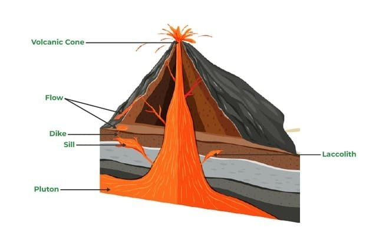
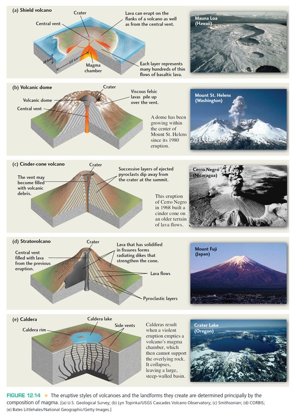
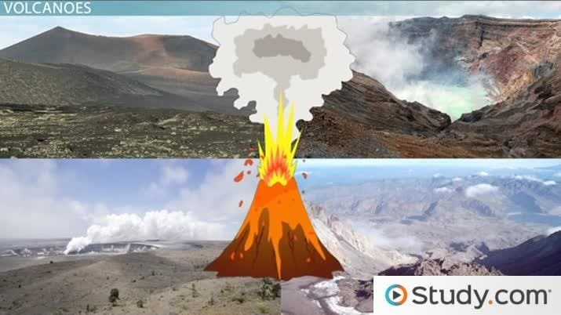

Volcanoes, those magnificent and powerful natural wonders, have intrigued and fascinated humans for centuries. They are not only beautiful and awe-inspiring when dormant, but they can also unleash unimaginable destruction when they erupt. In order to truly understand the major volcanic landforms worldwide, we must delve into the intricate details of their formation, eruption patterns, and the hazards and benefits they bring. By gaining a deeper understanding of the types of volcanoes, their geographical distribution, and the causes behind their eruptions, we can not only appreciate their beauty but also better prepare ourselves for the potential risks they pose. So, let us embark on this journey of discovery, where we explore the captivating world of volcanoes and their remarkable landforms.

This image is property of media.geeksforgeeks.org.

## Stratovolcanoes

### Description and Formation

Stratovolcanoes, also known as composite volcanoes, are tall and steep-sided volcanoes characterized by alternating layers of hardened lava, volcanic ash, and other volcanic materials. They are formed by explosive eruptions and are typically composed of andesite or dacite lava, which is viscous and can trap gas bubbles. These volcanoes are created when a subduction zone is formed, where one tectonic plate is forced under another. As the subducting plate sinks into the Earth's mantle, it melts and forms a magma chamber. Over time, the magma rises through the Earth's crust and erupts, building up layers of volcanic material.

### Notable Examples Worldwide

Some notable examples of stratovolcanoes include Mount Fuji in Japan, Mount Vesuvius in Italy, Mount Rainier in the United States, and Mount Pinatubo in the Philippines. These volcanoes have had significant historical eruptions and are closely monitored by scientists due to their potential hazards to nearby populations.

### Eruption Patterns

Stratovolcanoes are known for their explosive eruptions, which can send ash, volcanic bombs, and [pyroclastic flows](https://magmamatters.com/the-environmental-impact-of-volcanic-eruptions-2/ "The Environmental Impact of Volcanic Eruptions") into the air and down the slopes of the volcano. These eruptions are often triggered by the build-up of pressure in the magma chamber, caused by the viscosity of the magma and the presence of volatile gases. The explosive nature of these eruptions can result in the destruction of the volcano's summit and the [formation of a volcanic](https://magmamatters.com/understanding-volcanic-formation-a-comprehensive-guide/ "Understanding Volcanic Formation: A Comprehensive Guide") crater or caldera. Eruption patterns can vary widely, with some stratovolcanoes experiencing frequent small eruptions, while others have long periods of dormancy followed by catastrophic eruptions.

## Shield Volcanoes

### Description and Formation

Shield volcanoes are broad, gently sloping volcanoes characterized by layers of basaltic lava flows. They are formed by the eruption of low-viscosity lava, which allows it to flow easily and cover large areas. These volcanoes are typically formed over hotspots, where a plume of hot mantle material rises towards the Earth's surface. As the magma reaches the surface, it erupts and spreads out in all directions, creating a broad, shield-like shape.

### Notable Examples Worldwide

Some notable examples of shield volcanoes include Mauna Loa and Kilauea in Hawaii, which are two of the most active volcanoes on Earth. Other examples include Mount Etna in Italy, Piton de la Fournaise in Reunion Island, and the Galapagos Islands in Ecuador. These volcanoes are known for their frequent eruptions and the creation of vast lava fields.

### Eruption Styles

Shield volcanoes are characterized by relatively gentle and non-explosive eruptions. The lava flows from these volcanoes can travel long distances, creating extensive lava fields. The eruptions are often effusive, with the lava flowing steadily from the volcanic vents. However, shield volcanoes can also experience more explosive eruptions if there is a sudden release of trapped gas or if the magma becomes more viscous. These explosive eruptions can result in the formation of [cinder cones](https://magmamatters.com/the-birth-of-new-land-understanding-cinder-cones/) or explosive craters on the shield volcano's summit.

<iframe width="560" height="315" src="https://www.youtube.com/embed/VNGUdObDoLk" frameborder="0" allow="accelerometer; autoplay; encrypted-media; gyroscope; picture-in-picture" allowfullscreen></iframe>

  

## Cinder Cones

### Description and Formation

Cinder cones, also known as scoria cones, are small, steep-sided volcanoes formed by the eruption of gas-rich, basaltic lava. These volcanoes are typically conical in shape, with a prominent crater at the summit. Cinder cones are formed when gas bubbles in the lava cause it to fragment into cinders and ash, which are then ejected into the air and fall back to the ground, building up layers of volcanic material.

### Notable Examples Worldwide

Some notable examples of cinder cones include Parícutin in Mexico, Sunset Crater in the United States, and Mount Ngauruhoe in New Zealand. These volcanoes are known for their relatively recent eruptions and the unique landscapes they have created.

### Eruption Patterns

Cinder cones often have short and episodic eruption cycles. They can erupt suddenly and explosively, with the ejection of ash, cinders, and bombs. These eruptions are generally localized to the summit crater of the volcano and can result in the formation of a small summit crater lake or lava lake. The eruption of cinder cones typically lasts for a relatively short period of time, with the volcano becoming dormant or inactive until the next eruption cycle begins.

## Calderas

### Definition and Formation

Calderas are large, basin-shaped volcanic depressions formed by the collapse of a volcano's summit or the expulsion of large volumes of magma during explosive eruptions. These depressions can range in size from a few kilometers to tens of kilometers in diameter. Calderas can form in different ways, including the collapse of the volcano's magma chamber, the emptying of the magma chamber through eruptive vents, or the drainage of a magma chamber through volcanic fissures.

### Notable Examples Worldwide

Some notable examples of calderas include Yellowstone Caldera in the United States, which is one of the largest calderas in the world, Santorini Caldera in Greece, and Taal Caldera in the Philippines. These calderas are known for their stunning landscapes and their potential for future volcanic activity.

### Impact of Eruptions

The eruptions that lead to the formation of calderas can have significant impacts on the surrounding environment and communities. The collapse of a volcano's summit can result in the formation of deep craters and the release of ash and [volcanic gases](https://magmamatters.com/the-art-and-science-of-volcano-monitoring/ "The Art and Science of Volcano Monitoring") into the atmosphere. The expulsion of large volumes of magma can lead to pyroclastic flows, which are fast-moving mixtures of hot gas, ash, and volcanic debris that can travel great distances and cause widespread destruction. Additionally, the formation of calderas can result in the release of volcanic gases and the formation of geothermal features, such as hot springs and geysers.

This image is property of qph.cf2.quoracdn.net.

## Lava Domes

### Description and Formation

Lava domes are volcanic landforms that are formed by the slow extrusion of extremely viscous lava. These volcanic structures are typically steep-sided and rounded, resembling a dome. Lava domes are created when the lava erupts from a vent and piles up around the vent area, forming a mound-like shape.

### Notable Examples Worldwide

Some notable examples of lava domes include Mount Saint Helens in the United States, Soufrière Hills Volcano in Montserrat, and Mount Asama in Japan. These lava domes have experienced significant eruptions in the past and are closely monitored by scientists.

### How Eruptions Occur

The eruption of lava domes is characterized by the slow extrusion of highly viscous lava, which can pile up and form a dome-shaped structure. This extrusion can be continuous over a long period of time or occur in short bursts. The lava that forms lava domes is often more gas-rich and can result in explosive eruptions if the pressure within the dome becomes too great. These explosive eruptions can lead to the partial collapse of the lava dome and the generation of pyroclastic flows.

## Volcanic Fields

### Definition and Formation

Volcanic fields are areas that contain multiple volcanic landforms, including cinder cones, lava flows, and shield volcanoes. These fields are formed by repeated volcanic eruptions over a large area, resulting in the accumulation of volcanic material. Volcanic fields can cover thousands of square kilometers and often have a diverse range of volcanic features.

### Notable Examples Worldwide

Some notable examples of volcanic fields include the Snake River Plain in the United States, the Eifel Volcanic Field in Germany, and the Deccan Traps in India. These volcanic fields are known for their extensive lava flows and the variety of volcanic landforms present.

### Eruptions and Impact

Volcanic fields can experience a range of eruption styles, depending on the types of volcanoes present. Cinder cones within the field can erupt explosively, producing ash and lava bombs, while shield volcanoes can have more effusive eruptions, with the flow of lava covering large areas. The eruptions in volcanic fields can have a significant impact on the surrounding environment, including the destruction of vegetation, alteration of landscapes, and disruption of local ecosystems. However, volcanic fields can also have long-term benefits, as the volcanic material enriches the soil and promotes the growth of new vegetation.

This image is property of media.geeksforgeeks.org.

## Cryptodomes

### Explanation and Formation

Cryptodomes are volcanic landforms that are formed by the intrusion of magma beneath the Earth's surface. These landforms are often characterized by a dome-like shape and can be difficult to detect because they do not typically result in visible eruptions. Cryptodomes are formed when magma pushes up through cracks in the Earth's crust but does not reach the surface, instead becoming trapped and creating a bulge.

### Notable Examples

There are several notable examples of cryptodomes worldwide, including the San Francisco Mountain volcanic field in the United States and the Stawamus Chief in Canada. These cryptodomes have unique geological features and are of interest to scientists studying the behavior of magma beneath the Earth's surface.

### Eruption Patterns

Cryptodomes do not typically result in explosive eruptions like other volcanic landforms. Instead, they can have slow and continuous deformation of the Earth's surface as magma intrudes and creates a bulge. However, if the pressure within the cryptodome becomes too great, it can result in the formation of volcanic vents and the eruption of lava and volcanic gases. These eruptions can be unpredictable and may result in both effusive and explosive activity.

## Geographical Distribution of Volcanoes

### Volcanoes in the 'Ring of Fire'

The "Ring of Fire" is a major area in the basin of the Pacific Ocean where a large number of earthquakes and volcanic eruptions occur. This region is characterized by a series of tectonic plate boundaries, including subduction zones, where one tectonic plate is forced under another, leading to the formation of stratovolcanoes. Some notable examples of volcanoes in the Ring of Fire include Mount St. Helens in the United States, Mount Fuji in Japan, and Mount Mayon in the Philippines.

### Hotspot Volcanoes

Hotspot volcanoes, such as those found in Hawaii, are located away from plate boundaries. They are formed by the presence of a hotspot, or a plume of hot mantle material that rises towards the Earth's surface. The hotspot volcanoes erupt less explosively and have shield-like shapes due to the low-viscosity lava. Examples of hotspot volcanoes include Mauna Loa and Kilauea in Hawaii.

### Rift Zone Volcanoes

Rift zones are areas where tectonic plates are moving apart, leading to the formation of volcanic activity. These zones can be found along mid-ocean ridges or continental rifts. Rift zone volcanoes are characterized by the eruption of basaltic lava and can create fissure eruptions and extensive lava flows. Examples of rift zone volcanoes include the Icelandic volcanoes and the East African Rift volcanoes.

This image is property of study.com.

## The Impact of Volcanoes

### Impact on Environment and Ecology

Volcanic eruptions can have both short-term and long-term impacts on the environment and ecology. In the short term, volcanic ash can blanket the landscape, smothering vegetation and disrupting ecosystems. The release of volcanic gases, such as sulfur dioxide, can also have a negative impact on air quality and can lead to acid rain. However, in the long term, volcanic eruptions can have positive effects as well. The volcanic material enriches the soil with nutrients, making it fertile for agriculture. Additionally, volcanic islands and their unique ecosystems provide habitats for a variety of plant and animal species.

### Impact on Human Lives and Communities

Volcanic eruptions can have significant impacts on human lives and communities. The destruction caused by explosive eruptions, such as pyroclastic flows, lava flows, and volcanic ash, can lead to the loss of homes, infrastructure, and even lives. Volcanic activity can also result in the displacement of local populations, who may need to evacuate their homes to avoid the hazards associated with the eruptions. Furthermore, volcanic ash can disrupt air travel and cause health issues for people living in the vicinity of the eruption.

### Economic Impact

Volcanic eruptions can have a substantial economic impact on affected regions. The destruction of crops, infrastructure, and tourism facilities can result in significant financial losses. Additionally, the costs associated with emergency response and recovery efforts can be substantial. However, volcanoes can also have economic benefits in the long term. Volcanic materials, such as pumice and volcanic ash, can be used as construction materials. Geothermal energy, which is harnessed from volcanic activity, can provide a source of renewable energy for communities.

## The Role of Volcanoes in Earth's Geography

### Formation of New Landforms

Volcanoes play a crucial role in the formation of new landforms on Earth. The eruption of lava and other volcanic materials can create new islands, mountains, and even continents. Over time, these landforms can shape the geography of entire regions, influencing the distribution of ecosystems, climate patterns, and human settlements. For example, the Hawaiian Islands were formed by volcanic activity over millions of years, creating a unique archipelago with diverse landscapes.

### Influence on Climate and Weather

Volcanic eruptions can have a significant impact on climate and weather patterns. The release of volcanic gases, such as sulfur dioxide, can lead to the formation of volcanic aerosols in the atmosphere, which can reflect sunlight and cool the Earth's surface. This can result in a temporary cooling effect on global temperatures. Additionally, large volcanic eruptions can inject sulfur dioxide into the stratosphere, where it can combine with water vapor to form sulfuric acid aerosols. These aerosols can contribute to the formation of volcanic sunsets and can have long-lasting effects on climate patterns.

### Importance for Scientific Study

Volcanoes provide invaluable opportunities for scientific study. They offer insights into the Earth's interior and the processes that occur deep within the planet. Scientists can study volcanic eruptions to better understand the behavior of magma, the factors that trigger eruptions, and the impact of volcanic activity on the surrounding environment. Volcanoes also provide valuable information about the history of the Earth, including past climate conditions, geological processes, and the evolution of life on our planet.

In conclusion, volcanoes are fascinating and dynamic natural phenomena. They come in various forms, each with its distinctive characteristics and eruption patterns. Stratovolcanoes, shield volcanoes, cinder cones, calderas, lava domes, volcanic fields, cryptodomes, and various other volcanic landforms are found across the globe. Understanding these landforms and their geographical distribution helps scientists predict and mitigate the impacts of volcanic eruptions. [Volcanoes have a profound impact on the environment](https://magmamatters.com/geothermal-energy-and-its-volcanic-origins/ "Geothermal Energy and Its Volcanic Origins"), ecology, human lives, and economies. While they can cause destruction and disruption, they also contribute to the formation of new landforms, influence climate and weather patterns, and provide valuable scientific insights. Studying volcanoes is essential for a comprehensive understanding of our planet's geology and its intricate relationship with life on Earth.

